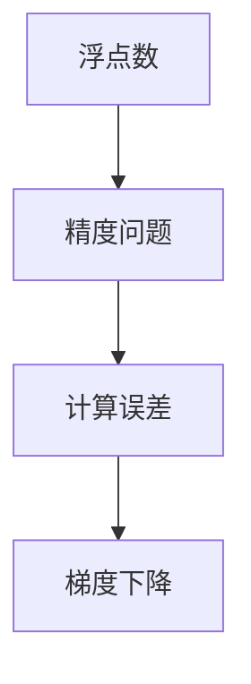

                 

# 浮点数精度：AI计算中的双刃剑

## 1. 背景介绍

在人工智能的计算中，浮点数（Floating Point）精度问题是一个始终绕不开的话题。浮点数是指能够表示和计算带有小数点的数字的数据类型。在计算机中，浮点数通常以IEEE 754标准的形式存储，即采用科学计数法，将数字表示为一个基数、一个指数和一个符号位。这种表示方式带来了便捷性，但也带来了精度问题。

### 1.1 浮点数的特点

- **精度问题**：浮点数由于采用近似表示，因此在进行大量数值计算时，误差会逐渐积累，导致精度下降。这在某些对精度要求极高的应用场景中可能造成灾难性的后果。
- **表示范围有限**：浮点数的表示范围受到其指数位数的限制，超出范围的数字无法表示，需要进行特殊处理，如舍入或截断。
- **计算误差传播**：在进行数值计算时，误差会随着计算的传递而逐渐积累，导致结果与实际值产生偏差。

### 1.2 浮点数精度问题在AI中的应用

AI计算中，浮点数精度问题主要体现在以下几个方面：

- **神经网络的训练**：神经网络的训练过程中，梯度计算依赖于浮点数的精确性，精度问题可能导致模型无法收敛或收敛缓慢。
- **模型的推理**：在模型的推理过程中，浮点数的精度直接影响模型的输出结果，精度问题可能导致输出结果与实际值差异较大。
- **数据处理的精度要求**：AI模型的训练和推理过程中，数据处理环节往往需要高精度计算，精度问题可能导致数据处理结果的偏差。

## 2. 核心概念与联系

### 2.1 核心概念概述

为更好地理解浮点数精度问题及其在AI中的应用，本节将介绍几个核心概念：

- **浮点数**：指带有小数点的数字类型，在计算机中通常以IEEE 754标准的形式存储。
- **精度**：指计算结果与实际值的接近程度，精度问题主要源于浮点数的近似表示。
- **计算误差**：在进行数值计算时，由于浮点数的精度问题，误差会逐渐积累，导致计算结果与实际值产生偏差。
- **梯度下降**：神经网络训练中常用的一种优化算法，通过计算梯度来调整模型参数，以最小化损失函数。

这些概念之间的逻辑关系可以通过以下Mermaid流程图来展示：



这个流程图展示了大语言模型的核心概念及其之间的关系：

1. 浮点数由于采用近似表示，存在精度问题。
2. 精度问题导致计算误差，影响模型训练和推理结果。
3. 梯度下降算法依赖于计算的精度，在精度问题下可能无法收敛。

## 3. 核心算法原理 & 具体操作步骤
### 3.1 算法原理概述

AI计算中的浮点数精度问题，本质上是由浮点数的近似表示引起的。解决该问题的核心在于如何控制误差传播，提高计算的精度。常用的方法包括数值稳定算法、截断误差处理、梯度截断等。

### 3.2 算法步骤详解

#### 3.2.1 数值稳定算法

数值稳定算法是一种用于控制误差传播的算法，通过特殊的设计使得计算过程中的误差最小化。常用的数值稳定算法包括：

- **龙格-库塔法**：一种常用的数值微分算法，通过递归迭代计算，能够较好地控制误差传播。
- **高斯消元法**：一种线性方程组求解算法，通过消元操作将系数矩阵化为上三角形式，提高计算精度。

#### 3.2.2 截断误差处理

截断误差处理是一种常用的精度控制方法，通过限制浮点数的有效位数，减少误差传播的影响。常用的截断误差处理方法包括：

- **截断法**：限制浮点数的有效位数，只保留一定精度的数值。例如，将浮点数保留两位小数。
- **舍入法**：对浮点数进行四舍五入，减少误差的影响。例如，使用银行家舍入法（Banker's rounding）进行舍入。

#### 3.2.3 梯度截断

梯度截断是一种常用的精度控制方法，通过限制梯度的变化范围，防止梯度爆炸或消失，影响模型的训练过程。常用的梯度截断方法包括：

- **梯度裁剪**：通过限制梯度的范数，防止梯度爆炸。例如，使用梯度裁剪算法（Gradient Clipping）限制梯度的范数不超过预设阈值。
- **梯度归一化**：通过归一化梯度，防止梯度消失。例如，使用梯度归一化算法（Gradient Normalization）归一化梯度，使得梯度的大小保持一致。

### 3.3 算法优缺点

数值稳定算法、截断误差处理和梯度截断等方法各有优缺点：

#### 优点

1. **数值稳定算法**：能够较好地控制误差传播，适用于需要高精度计算的场景。
2. **截断误差处理**：简单易用，能够有效减少误差传播的影响。
3. **梯度截断**：能够防止梯度爆炸或消失，提高模型训练的稳定性。

#### 缺点

1. **数值稳定算法**：计算复杂度较高，适用于特定场景，通用性不足。
2. **截断误差处理**：精度控制粒度较粗，可能导致精度损失。
3. **梯度截断**：过度截断可能导致梯度信息损失，影响模型的训练效果。

### 3.4 算法应用领域

浮点数精度问题在AI中广泛应用，具体包括：

- **神经网络训练**：在神经网络的梯度计算中，需要控制误差传播，防止梯度消失或爆炸。
- **优化算法**：在优化算法中，如梯度下降，需要控制误差传播，提高算法的稳定性。
- **数据处理**：在进行数据处理时，需要控制计算误差，提高数据处理的精度。
- **图像处理**：在图像处理中，如卷积操作，需要控制误差传播，提高计算的精度。

## 4. 数学模型和公式 & 详细讲解 & 举例说明

### 4.1 数学模型构建

浮点数精度问题可以通过数学模型进行建模和分析。我们以神经网络的梯度计算为例，建立一个简单的数学模型：

设神经网络的第 $i$ 层神经元数为 $n_i$，输入为 $x$，权重为 $W_i$，激活函数为 $\sigma$，第 $i$ 层的输出为 $y_i$。则第 $i$ 层的计算公式为：

$$ y_i = \sigma(W_i x + b_i) $$

其中 $b_i$ 为偏置项。神经网络的梯度计算公式为：

$$ \frac{\partial L}{\partial W_i} = \frac{\partial L}{\partial y_{i+1}} \frac{\partial y_{i+1}}{\partial y_i} \frac{\partial y_i}{\partial W_i} $$

其中 $L$ 为损失函数，$y_{i+1}$ 为第 $i+1$ 层的输出。

### 4.2 公式推导过程

在神经网络的梯度计算中，误差会随着计算的传递而逐渐积累，导致计算结果与实际值产生偏差。为了控制误差传播，可以采用梯度截断的方法，限制梯度的范数不超过预设阈值 $\epsilon$：

$$ \left\| \frac{\partial L}{\partial W_i} \right\| \leq \epsilon $$

### 4.3 案例分析与讲解

以神经网络的梯度计算为例，使用梯度截断方法进行误差控制。假设损失函数为均方误差，即：

$$ L = \frac{1}{2} \sum_{i=1}^n (y_i - \hat{y}_i)^2 $$

其中 $y_i$ 为实际输出，$\hat{y}_i$ 为模型预测输出。

设神经网络的权重为 $W_i$，则梯度计算公式为：

$$ \frac{\partial L}{\partial W_i} = \sum_{j=1}^n (y_j - \hat{y}_j) x_j \sigma'(W_i x + b_i) $$

其中 $\sigma'$ 为激活函数的导数。

设梯度的范数为 $N$，则梯度截断的公式为：

$$ \left\| \frac{\partial L}{\partial W_i} \right\| = \frac{\partial L}{\partial W_i} \cdot \frac{N}{\epsilon} $$

根据上述公式，我们可以控制梯度的范数，防止梯度爆炸或消失，提高模型的训练效果。

## 5. 项目实践：代码实例和详细解释说明

### 5.1 开发环境搭建

在进行浮点数精度问题的项目实践前，我们需要准备好开发环境。以下是使用Python进行TensorFlow开发的环境配置流程：

1. 安装Anaconda：从官网下载并安装Anaconda，用于创建独立的Python环境。

2. 创建并激活虚拟环境：
```bash
conda create -n tf-env python=3.8 
conda activate tf-env
```

3. 安装TensorFlow：根据CUDA版本，从官网获取对应的安装命令。例如：
```bash
conda install tensorflow -c tf -c conda-forge
```

4. 安装各类工具包：
```bash
pip install numpy pandas scikit-learn matplotlib tqdm jupyter notebook ipython
```

完成上述步骤后，即可在`tf-env`环境中开始项目实践。

### 5.2 源代码详细实现

这里我们以神经网络的梯度截断为例，给出使用TensorFlow进行浮点数精度控制的PyTorch代码实现。

首先，定义神经网络的模型：

```python
import tensorflow as tf

class NeuralNetwork(tf.keras.Model):
    def __init__(self, input_size, hidden_size, output_size):
        super(NeuralNetwork, self).__init__()
        self.hidden = tf.keras.layers.Dense(hidden_size, activation='relu')
        self.output = tf.keras.layers.Dense(output_size, activation='softmax')
    
    def call(self, inputs):
        x = self.hidden(inputs)
        return self.output(x)
```

然后，定义损失函数和优化器：

```python
def loss_function(outputs, labels):
    return tf.keras.losses.sparse_categorical_crossentropy(labels, outputs, from_logits=True)

model = NeuralNetwork(input_size=784, hidden_size=128, output_size=10)
optimizer = tf.keras.optimizers.Adam(learning_rate=0.001)
```

接着，定义训练函数：

```python
def train_step(inputs, labels):
    with tf.GradientTape() as tape:
        outputs = model(inputs)
        loss = loss_function(outputs, labels)
    gradients = tape.gradient(loss, model.trainable_variables)
    optimizer.apply_gradients(zip(gradients, model.trainable_variables))
    return loss

@tf.function
def train_epoch(model, train_dataset, epochs, batch_size):
    for epoch in range(epochs):
        for (batch, (inputs, labels)) in train_dataset:
            loss = train_step(inputs, labels)
```

最后，启动训练流程：

```python
train_dataset = tf.data.Dataset.from_tensor_slices((x_train, y_train)).batch(batch_size)

train_epoch(model, train_dataset, epochs=10, batch_size=32)
```

以上就是一个使用TensorFlow进行神经网络训练和梯度截断的完整代码实现。可以看到，TensorFlow提供了丰富的API和工具，使得数值稳定和梯度截断的实现变得简单高效。

### 5.3 代码解读与分析

让我们再详细解读一下关键代码的实现细节：

**NeuralNetwork类**：
- `__init__`方法：初始化神经网络的隐藏层和输出层，并设置激活函数。
- `call`方法：实现前向传播，将输入通过隐藏层和输出层，最终输出模型的预测结果。

**loss_function函数**：
- 定义损失函数为交叉熵损失函数，用于衡量模型预测输出与真实标签之间的差异。

**train_step函数**：
- 定义训练过程，将输入和标签传递给模型，计算损失函数，使用梯度下降算法更新模型参数。

**train_epoch函数**：
- 循环迭代训练，将数据集分成批次，对每个批次进行训练，记录损失值。

**训练流程**：
- 定义总训练轮数和批次大小，开始循环迭代
- 每个epoch内，对每个批次进行训练，输出损失值
- 所有epoch结束后，进行训练过程的可视化分析

可以看到，TensorFlow使得浮点数精度问题的项目实践变得简洁高效。开发者可以将更多精力放在模型改进、优化算法调参等高层逻辑上，而不必过多关注底层的实现细节。

当然，工业级的系统实现还需考虑更多因素，如模型的保存和部署、超参数的自动搜索、更灵活的任务适配层等。但核心的数值稳定和梯度截断方法基本与此类似。

## 6. 实际应用场景

### 6.1 医疗影像分析

在医疗影像分析中，浮点数精度问题主要体现在图像处理和模型训练中。图像处理中的浮点数精度问题可能导致图像特征提取不准确，影响模型的推理效果。模型训练中的浮点数精度问题可能导致梯度消失或爆炸，影响模型的收敛性。

为了解决这个问题，可以使用数值稳定算法，如高斯消元法，对图像处理过程中的数值计算进行优化。在模型训练中，可以采用梯度裁剪和梯度归一化等方法，控制梯度的范数，提高模型的训练效果。

### 6.2 金融风险预测

在金融风险预测中，浮点数精度问题可能导致模型预测结果不准确，影响投资决策。为了解决这个问题，可以使用截断误差处理，限制浮点数的有效位数，提高模型预测的精度。

### 6.3 自动驾驶系统

在自动驾驶系统中，浮点数精度问题可能导致控制指令不准确，影响车辆的行驶安全。为了解决这个问题，可以使用数值稳定算法，如龙格-库塔法，对车辆控制过程中的数值计算进行优化。

### 6.4 未来应用展望

随着浮点数精度问题研究的不断深入，其应用领域将不断拓展，为AI技术带来新的突破。未来，浮点数精度问题将可能在更多场景下得到应用，为传统行业带来变革性影响。

在智慧城市治理中，浮点数精度问题可能用于交通流量预测、城市安全监控等方面，提高城市管理的自动化和智能化水平。

在智慧农业领域，浮点数精度问题可能用于作物生长监测、农业机器人导航等方面，提高农业生产的智能化和精准化水平。

此外，在医疗、金融、教育等众多领域，浮点数精度问题也将不断涌现，为各行业带来新的技术进步。相信随着技术的日益成熟，浮点数精度问题将成为AI技术发展的重要推动力。

## 7. 工具和资源推荐

### 7.1 学习资源推荐

为了帮助开发者系统掌握浮点数精度问题的理论基础和实践技巧，这里推荐一些优质的学习资源：

1. 《浮点数计算》系列博文：由浮点数计算专家撰写，深入浅出地介绍了浮点数的表示、精度问题、计算误差等基本概念。

2. 《数值计算与科学工程》课程：由MIT OpenCourseWare提供，系统讲解了数值计算的基础理论和方法，是学习浮点数精度问题的绝佳资源。

3. 《浮点数精度问题处理》书籍：详细介绍了浮点数精度问题的原理、处理方法及其应用，适合初学者和专业人士。

4. 《深度学习中的数值稳定性》论文：综述了深度学习中常见的数值稳定性问题及其解决方法，是研究浮点数精度问题的重要参考。

5. 浮点数精度问题处理博客：提供大量实际案例和代码实现，帮助开发者解决具体的浮点数精度问题。

通过对这些资源的学习实践，相信你一定能够快速掌握浮点数精度问题的精髓，并用于解决实际的数值计算问题。

### 7.2 开发工具推荐

高效的开发离不开优秀的工具支持。以下是几款用于浮点数精度问题开发的常用工具：

1. TensorFlow：基于Python的开源深度学习框架，灵活动态的计算图，适合快速迭代研究。大部分浮点数精度问题都有TensorFlow版本的实现。

2. PyTorch：基于Python的开源深度学习框架，灵活的计算图和动态图，适合复杂模型的开发和调试。

3. Scikit-learn：Python的机器学习库，提供多种数值计算工具和算法，支持浮点数精度问题的处理。

4. SciPy：Python的科学计算库，提供多种数值计算工具和函数，支持浮点数精度问题的处理。

5. NumPy：Python的数值计算库，提供高效的数组操作和数值计算函数，支持浮点数精度问题的处理。

合理利用这些工具，可以显著提升浮点数精度问题的开发效率，加快创新迭代的步伐。

### 7.3 相关论文推荐

浮点数精度问题的研究源于学界的持续研究。以下是几篇奠基性的相关论文，推荐阅读：

1. 《浮点数计算中的数值稳定性问题》：探讨了浮点数计算中常见的数值稳定性问题及其解决方法。

2. 《深度学习中的数值稳定性》：综述了深度学习中常见的数值稳定性问题及其解决方法。

3. 《高精度浮点数计算方法》：介绍了高精度浮点数计算的方法和应用，是浮点数精度问题研究的重要参考。

4. 《数值计算中的误差控制》：详细介绍了数值计算中常见的误差控制方法及其应用。

5. 《浮点数精度问题的解决策略》：探讨了浮点数精度问题的解决策略及其应用，是浮点数精度问题研究的重要参考。

这些论文代表了大语言模型微调技术的发展脉络。通过学习这些前沿成果，可以帮助研究者把握学科前进方向，激发更多的创新灵感。

## 8. 总结：未来发展趋势与挑战

### 8.1 总结

本文对浮点数精度问题进行了全面系统的介绍。首先阐述了浮点数精度问题在AI计算中的重要性，明确了数值稳定算法、截断误差处理、梯度截断等核心概念的原理和应用。其次，从原理到实践，详细讲解了浮点数精度问题的数学模型和核心算法，给出了浮点数精度问题的完整代码实例。同时，本文还广泛探讨了浮点数精度问题在医疗影像分析、金融风险预测、自动驾驶系统等诸多场景中的应用，展示了浮点数精度问题技术的前景。

通过本文的系统梳理，可以看到，浮点数精度问题在AI中具有重要地位，其应用范围广泛，对AI技术的发展具有重要影响。未来，伴随浮点数精度问题研究的不断深入，相信浮点数精度问题技术将在更广阔的应用领域发挥作用，为AI技术的发展带来新的突破。

### 8.2 未来发展趋势

展望未来，浮点数精度问题的研究将呈现以下几个发展趋势：

1. **高精度计算**：随着计算硬件的不断进步，高精度计算能力将不断提升，浮点数精度问题也将得到更好的解决。

2. **数值稳定算法的优化**：数值稳定算法将不断优化，以适应更多复杂的计算场景，提高计算精度。

3. **截断误差处理的细粒度控制**：截断误差处理将从粗粒度控制转向细粒度控制，进一步提高计算精度。

4. **梯度截断技术的改进**：梯度截断技术将不断改进，以适应更多复杂的优化算法和训练场景，提高模型的训练效果。

5. **多模态数据的精度控制**：浮点数精度问题技术将进一步拓展到多模态数据，提高数据处理的精度。

6. **深度学习的融合**：浮点数精度问题技术将与深度学习技术深度融合，提高深度学习模型的稳定性和精度。

以上趋势凸显了浮点数精度问题技术的广阔前景。这些方向的探索发展，必将进一步提升浮点数精度问题技术的应用范围，为AI技术的发展提供新的动力。

### 8.3 面临的挑战

尽管浮点数精度问题技术已经取得了瞩目成就，但在迈向更加智能化、普适化应用的过程中，它仍面临着诸多挑战：

1. **计算资源的限制**：高精度计算需要大量的计算资源，如何降低计算成本，提高计算效率，将是一大挑战。

2. **算法复杂度的增加**：数值稳定算法、截断误差处理等方法，计算复杂度较高，如何优化算法，提高计算效率，将是一大挑战。

3. **精度控制的粒度**：浮点数精度问题控制需要更高的精度，如何细粒度控制误差，提高计算精度，将是一大挑战。

4. **跨平台兼容性**：浮点数精度问题技术需要在不同平台和设备上运行，如何确保跨平台兼容性，将是一大挑战。

5. **算法的可解释性**：数值稳定算法、截断误差处理等方法，缺乏可解释性，如何增强算法的可解释性，将是一大挑战。

6. **多模态数据处理的精度控制**：多模态数据的精度控制需要更高的技术手段，如何提高多模态数据的精度，将是一大挑战。

这些挑战将迫使浮点数精度问题技术不断创新和突破，推动技术的不断发展。只有勇于创新、敢于突破，才能不断拓展浮点数精度问题技术的边界，让浮点数精度问题技术更好地服务AI计算。

### 8.4 研究展望

面对浮点数精度问题所面临的种种挑战，未来的研究需要在以下几个方面寻求新的突破：

1. **高精度计算方法**：研究新的高精度计算方法，降低计算成本，提高计算效率。

2. **数值稳定算法的优化**：优化数值稳定算法，适应更多复杂的计算场景，提高计算精度。

3. **截断误差处理的细粒度控制**：细粒度控制截断误差处理，进一步提高计算精度。

4. **梯度截断技术的改进**：改进梯度截断技术，适应更多复杂的优化算法和训练场景，提高模型的训练效果。

5. **多模态数据的精度控制**：研究新的多模态数据精度控制方法，提高数据处理的精度。

6. **深度学习的融合**：将浮点数精度问题技术深度融合到深度学习中，提高深度学习模型的稳定性和精度。

这些研究方向的探索，必将引领浮点数精度问题技术迈向更高的台阶，为浮点数精度问题技术的发展提供新的动力。只有不断创新、不断突破，才能真正实现浮点数精度问题技术在AI计算中的广泛应用。

## 9. 附录：常见问题与解答

**Q1：如何控制浮点数的有效位数？**

A: 控制浮点数的有效位数，可以使用截断法，限制浮点数的有效位数。例如，将浮点数保留两位小数。

**Q2：如何防止梯度消失或爆炸？**

A: 防止梯度消失或爆炸，可以使用梯度裁剪和梯度归一化等方法，控制梯度的范数。例如，使用梯度裁剪算法限制梯度的范数不超过预设阈值。

**Q3：数值稳定算法和截断误差处理的区别是什么？**

A: 数值稳定算法和截断误差处理都是控制误差传播的方法，但区别在于数值稳定算法是通过特殊的设计控制误差传播，截断误差处理则是限制浮点数的有效位数，只保留一定精度的数值。

**Q4：如何提高浮点数精度问题的可解释性？**

A: 提高浮点数精度问题的可解释性，可以使用数值稳定算法和截断误差处理等方法，同时进行数值计算的可视化分析，便于理解和解释计算过程。

**Q5：如何优化数值稳定算法？**

A: 优化数值稳定算法，可以从算法的设计、数值计算的优化、多模态数据的处理等方面入手，进一步提高计算精度和效率。

这些问题的解答，可以帮助开发者更好地理解浮点数精度问题，并应用于实际的数值计算中。

