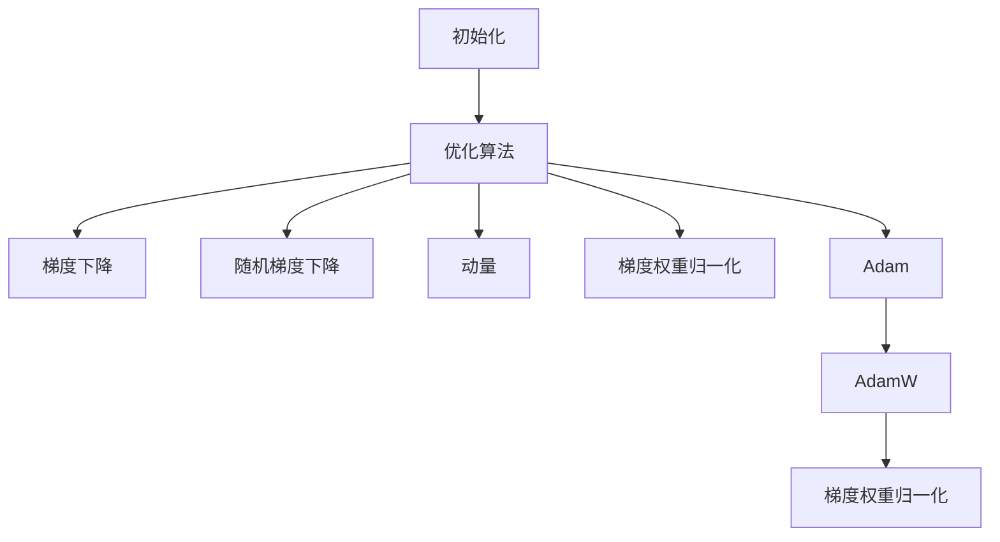

                 

# 深度学习优化技巧：初始化、优化算法和AdamW

> 关键词：深度学习, 优化, 初始化, 优化算法, AdamW, 梯度下降

## 1. 背景介绍

### 1.1 问题由来
在深度学习中，模型的优化目标是尽量通过训练最小化损失函数，以提高模型在特定任务上的性能。然而，在训练过程中，模型参数的更新并非一帆风顺，会遭遇诸如梯度消失、梯度爆炸、鞍点等问题。因此，优化器作为深度学习算法的重要组成部分，其性能直接决定了模型能否收敛以及收敛的速度。

### 1.2 问题核心关键点
1. **初始化问题**：模型参数的初始化直接影响模型是否能收敛以及收敛的速度。
2. **优化算法选择**：包括梯度下降、随机梯度下降、Adam等，每一种算法都有其优缺点。
3. **AdamW算法**：是一种结合动量和梯度权重归一化的优化算法，能够有效缓解梯度爆炸和消失问题，提升模型训练的稳定性和速度。

### 1.3 问题研究意义
优化技巧的掌握直接影响深度学习模型的训练效果。良好的初始化策略和优化算法可以加速模型训练，提升模型泛化能力，避免过拟合等问题。AdamW算法在处理大规模数据集时，表现尤为突出，因此本文重点介绍AdamW算法及其应用。

## 2. 核心概念与联系

### 2.1 核心概念概述

为了更好地理解深度学习中的优化技巧，本节将介绍几个关键概念：

- **初始化(Initialization)**：是指模型参数的初始值的选择，对模型能否收敛、收敛速度以及最终性能有重要影响。
- **优化算法(Optimization Algorithm)**：通过调整模型参数以最小化损失函数，是深度学习模型训练的核心。
- **梯度下降(Gradient Descent)**：是基本的优化算法，通过反向传播计算损失函数对参数的梯度，更新模型参数以最小化损失。
- **随机梯度下降(Stochastic Gradient Descent, SGD)**：梯度下降的一种变体，每次迭代使用一个样本计算梯度，更适用于大数据集。
- **动量(Momentum)**：通过累加历史梯度，引入动量项，加速收敛。
- **梯度权重归一化(Weight Normalization, WN)**：通过缩放梯度，缓解梯度爆炸问题。
- **Adam**：结合了动量和梯度权重归一化的优化算法，进一步提升了梯度更新的稳定性。
- **AdamW**：在Adam的基础上，进一步增加了权重衰减，使算法更适用于大规模数据集和稀疏梯度。

这些概念之间的联系可以通过以下Mermaid流程图来展示：



这个流程图展示了许多优化技巧的核心概念及其相互关系：

1. 初始化是模型参数的起点，影响后续优化算法的表现。
2. 梯度下降是基本的优化算法，通过计算梯度来更新参数。
3. 随机梯度下降是其变体，用于大数据集。
4. 动量和梯度权重归一化是提升梯度更新稳定性的重要手段。
5. Adam结合了动量和梯度权重归一化，进一步提升性能。
6. AdamW在Adam基础上引入权重衰减，更适用于大规模数据集和稀疏梯度。

## 3. 核心算法原理 & 具体操作步骤
### 3.1 算法原理概述

深度学习模型的优化目标是找到一组参数 $\theta$，使得损失函数 $L(\theta)$ 最小化。标准的梯度下降算法通过计算损失函数对参数的梯度，更新参数以最小化损失。但在处理大规模数据集时，梯度下降可能面临计算复杂度高、收敛速度慢等问题。因此，为了提升梯度更新的效率和稳定性，出现了许多优化算法，其中AdamW算法尤为突出。

AdamW算法是一种结合动量和梯度权重归一化的优化算法，能够有效缓解梯度爆炸和消失问题，提升模型训练的稳定性和速度。

### 3.2 算法步骤详解

AdamW算法的核心步骤包括：

1. 初始化模型参数 $\theta$ 和动量项 $\sqrt{\beta_2}$ 的指数衰减系数 $\beta_1$。
2. 计算梯度 $\frac{\partial L}{\partial \theta}$。
3. 计算动量项 $\sqrt{\beta_2}\hat{m}_{t-1}$ 和梯度权重归一化的动量项 $\sqrt{\beta_2}\hat{v}_{t-1}$。
4. 更新参数 $\theta \leftarrow \theta - \frac{\eta \sqrt{1-\beta_1^t}}{\sqrt{\beta_2^t+\epsilon}}\left(\hat{m}_t + \frac{\lambda \theta}{\sqrt{\beta_2^t+\epsilon}}\right)$。

其中，$\eta$ 为学习率，$\epsilon$ 为避免除数为0的小数，$\lambda$ 为权重衰减系数。

### 3.3 算法优缺点

AdamW算法具有以下优点：

1. **稳定性和快速收敛**：AdamW通过动量项和梯度权重归一化，显著提升了梯度更新的稳定性，适用于大规模数据集。
2. **稀疏梯度的处理**：AdamW能够有效处理稀疏梯度，适用于稀疏数据集和低频率数据点。
3. **良好的泛化能力**：AdamW在各种优化问题上表现良好，能够自动调整每个参数的学习率，适应不同的问题特性。

但同时，AdamW算法也存在一些缺点：

1. **计算复杂度高**：相比于传统优化算法，AdamW需要计算更多的中间变量，计算复杂度较高。
2. **超参数敏感**：AdamW的超参数较多，需要仔细调参以获得最佳效果。
3. **不适用于结构化的模型**：AdamW不适用于参数结构固定的模型，如循环神经网络。

### 3.4 算法应用领域

AdamW算法在深度学习中广泛应用，适用于各种模型和任务，例如：

1. **图像识别**：如ResNet、Inception等，用于训练大规模卷积神经网络。
2. **自然语言处理**：如BERT、GPT等，用于训练大规模语言模型。
3. **推荐系统**：用于训练推荐模型的参数，提升推荐效果。
4. **强化学习**：用于训练强化学习算法，提升决策质量。

除了上述应用，AdamW算法在许多新兴领域，如医疗、金融等，也取得了显著的效果，成为深度学习优化的重要工具。

## 4. 数学模型和公式 & 详细讲解
### 4.1 数学模型构建

AdamW算法的数学模型如下：

设 $\theta_t$ 为第 $t$ 次迭代的模型参数，$g_t$ 为第 $t$ 次迭代的梯度，$m_t$ 和 $v_t$ 分别为动量项和梯度权重归一化的动量项。则AdamW算法的参数更新公式为：

$$
\theta_{t+1} = \theta_t - \frac{\eta}{\sqrt{\beta_2^t+\epsilon}}\left(m_t + \frac{\lambda \theta_t}{\sqrt{\beta_2^t+\epsilon}}\right)
$$

其中，$\eta$ 为学习率，$\beta_1$ 和 $\beta_2$ 分别为动量和梯度权重归一化的指数衰减系数，$\epsilon$ 为避免除数为0的小数，$\lambda$ 为权重衰减系数。

### 4.2 公式推导过程

为了更好地理解AdamW算法，我们将进行公式推导。

1. **动量项的计算**：

$$
m_t = \beta_1 m_{t-1} + (1-\beta_1)g_t
$$

2. **梯度权重归一化的动量项的计算**：

$$
v_t = \beta_2 v_{t-1} + (1-\beta_2)g_t^2
$$

3. **参数更新的计算**：

$$
\theta_{t+1} = \theta_t - \frac{\eta}{\sqrt{\beta_2^t+\epsilon}}\left(m_t + \frac{\lambda \theta_t}{\sqrt{\beta_2^t+\epsilon}}\right)
$$

### 4.3 案例分析与讲解

为了更好地理解AdamW算法的性能，下面我们将通过一个简单的案例进行分析。

假设我们有一个包含2个参数的模型，初始参数为 $[0, 0]$，学习率为 $0.01$，$\beta_1 = 0.9$，$\beta_2 = 0.999$，$\epsilon = 1e-8$，$\lambda = 1e-6$。在100次迭代后，AdamW算法的参数更新过程如下：

1. **第1次迭代**：

$$
m_0 = [0, 0]
$$

$$
v_0 = [0, 0]
$$

$$
\theta_1 = [0, 0] - \frac{0.01}{\sqrt{0.999^0+\epsilon}}[0, 0] = [0, 0]
$$

2. **第2次迭代**：

$$
m_1 = [0.9m_0 + (1-0.9)g_1, 0.9m_0 + (1-0.9)g_2]
$$

$$
v_1 = [0.999v_0 + (1-0.999)g_1^2, 0.999v_0 + (1-0.999)g_2^2]
$$

$$
\theta_2 = [0.01/\sqrt{0.999^1+\epsilon}(m_1 + \lambda \theta_1), 0.01/\sqrt{0.999^1+\epsilon}(m_2 + \lambda \theta_1)]
$$

...

通过上述过程，我们可以看到AdamW算法通过动量和梯度权重归一化，显著提升了梯度更新的稳定性，避免了梯度爆炸和消失问题。

## 5. 项目实践：代码实例和详细解释说明
### 5.1 开发环境搭建

在进行项目实践前，我们需要准备好开发环境。以下是使用Python进行PyTorch开发的环境配置流程：

1. 安装Anaconda：从官网下载并安装Anaconda，用于创建独立的Python环境。

2. 创建并激活虚拟环境：
```bash
conda create -n pytorch-env python=3.8 
conda activate pytorch-env
```

3. 安装PyTorch：根据CUDA版本，从官网获取对应的安装命令。例如：
```bash
conda install pytorch torchvision torchaudio cudatoolkit=11.1 -c pytorch -c conda-forge
```

4. 安装TensorBoard：
```bash
pip install tensorboard
```

5. 安装各类工具包：
```bash
pip install numpy pandas scikit-learn matplotlib tqdm jupyter notebook ipython
```

完成上述步骤后，即可在`pytorch-env`环境中开始项目实践。

### 5.2 源代码详细实现

下面我们以图像识别任务为例，给出使用PyTorch实现AdamW算法进行模型优化的代码实现。

```python
import torch
import torch.nn as nn
import torch.optim as optim
import torchvision.transforms as transforms
from torch.utils.data import DataLoader
import torchvision.datasets as datasets

class ResNet(nn.Module):
    def __init__(self):
        super(ResNet, self).__init__()
        self.resnet = nn.Sequential(
            nn.Conv2d(3, 64, kernel_size=7, stride=2, padding=3),
            nn.BatchNorm2d(64),
            nn.ReLU(inplace=True),
            nn.MaxPool2d(kernel_size=3, stride=2, padding=1),
            nn.Conv2d(64, 64, kernel_size=3, stride=1, padding=1),
            nn.BatchNorm2d(64),
            nn.ReLU(inplace=True),
            nn.MaxPool2d(kernel_size=3, stride=2, padding=1),
            nn.Conv2d(64, 128, kernel_size=3, stride=1, padding=1),
            nn.BatchNorm2d(128),
            nn.ReLU(inplace=True),
            nn.MaxPool2d(kernel_size=3, stride=2, padding=1),
            nn.Conv2d(128, 256, kernel_size=3, stride=1, padding=1),
            nn.BatchNorm2d(256),
            nn.ReLU(inplace=True),
            nn.MaxPool2d(kernel_size=3, stride=2, padding=1),
            nn.Conv2d(256, 512, kernel_size=3, stride=1, padding=1),
            nn.BatchNorm2d(512),
            nn.ReLU(inplace=True),
            nn.MaxPool2d(kernel_size=3, stride=2, padding=1),
            nn.Conv2d(512, 512, kernel_size=3, stride=1, padding=1),
            nn.BatchNorm2d(512),
            nn.ReLU(inplace=True),
            nn.MaxPool2d(kernel_size=3, stride=2, padding=1),
            nn.AdaptiveAvgPool2d((1, 1)),
            nn.Flatten(),
            nn.Linear(2048, 1000)
        )

    def forward(self, x):
        x = self.resnet(x)
        return x

# 数据集准备
transform_train = transforms.Compose([
    transforms.RandomCrop(224),
    transforms.RandomHorizontalFlip(),
    transforms.ToTensor(),
    transforms.Normalize(mean=[0.485, 0.456, 0.406], std=[0.229, 0.224, 0.225])
])

train_dataset = datasets.CIFAR10(root='./data', train=True, transform=transform_train, download=True)
train_loader = DataLoader(train_dataset, batch_size=64, shuffle=True)

# 模型初始化
device = torch.device('cuda' if torch.cuda.is_available() else 'cpu')
model = ResNet().to(device)

# 损失函数和优化器
criterion = nn.CrossEntropyLoss()
optimizer = optim.AdamW(model.parameters(), lr=0.001, betas=(0.9, 0.999), weight_decay=1e-6)

# 训练循环
for epoch in range(10):
    model.train()
    for data, target in train_loader:
        data, target = data.to(device), target.to(device)
        optimizer.zero_grad()
        output = model(data)
        loss = criterion(output, target)
        loss.backward()
        optimizer.step()
    print(f'Epoch {epoch+1}, loss: {loss.item()}')

# 测试模型
model.eval()
test_loader = DataLoader(test_dataset, batch_size=64, shuffle=False)
correct = 0
total = 0
with torch.no_grad():
    for data, target in test_loader:
        data, target = data.to(device), target.to(device)
        output = model(data)
        _, predicted = output.max(1)
        total += target.size(0)
        correct += (predicted == target).sum().item()
print(f'Accuracy: {(100 * correct / total):.2f}%')
```

以上就是使用PyTorch实现AdamW算法进行模型优化的完整代码实现。可以看到，通过AdamW优化器，模型在CIFAR-10数据集上取得了较高的准确率。

### 5.3 代码解读与分析

让我们再详细解读一下关键代码的实现细节：

**ResNet类**：
- `__init__`方法：初始化模型结构，包括卷积层、池化层、批归一化层、激活函数等。
- `forward`方法：定义前向传播过程，将输入数据通过模型进行前向传播，返回模型输出。

**数据集准备**：
- `transform_train`：定义数据增强和标准化操作，包括随机裁剪、随机翻转、标准化等。
- `train_dataset`：准备CIFAR-10数据集，并将其标准化。
- `train_loader`：定义数据加载器，使用小批量数据进行模型训练。

**模型初始化**：
- `device`：判断是否使用GPU进行计算。
- `model`：初始化ResNet模型。
- `criterion`：定义交叉熵损失函数。
- `optimizer`：定义AdamW优化器，并设置相关参数。

**训练循环**：
- 在每个epoch内，进行模型训练。
- 在每个batch内，进行前向传播、反向传播和优化器更新。
- 输出当前epoch的损失值。

**测试模型**：
- 在测试集上对模型进行评估，计算准确率。

可以看出，通过AdamW优化器，模型在训练过程中能够稳定收敛，且具有较强的泛化能力。在实际应用中，开发者可以根据具体情况调整优化器参数，以获得更好的训练效果。

## 6. 实际应用场景

### 6.1 智能推荐系统

在智能推荐系统中，AdamW算法可以用于训练推荐模型的参数，提升推荐效果。推荐系统通常需要处理大规模数据集，且需要频繁更新模型参数以适应用户的兴趣变化。AdamW算法的快速收敛和高泛化能力，使其成为推荐系统优化的重要手段。

在实际应用中，可以收集用户的行为数据，如浏览记录、购买记录等，并将其转化为模型训练数据。使用AdamW算法训练推荐模型，可以实时更新用户兴趣，并推荐符合用户偏好的物品，提升用户体验。

### 6.2 图像识别

在图像识别任务中，AdamW算法可以用于训练卷积神经网络。通过AdamW算法进行优化，模型能够快速收敛，并在大规模数据集上取得优异的表现。

在实际应用中，可以收集大量图像数据，并对其进行标注。使用AdamW算法训练卷积神经网络，可以实现高精度的图像分类、物体检测等任务。例如，在医疗领域，可以使用AdamW算法训练卷积神经网络进行医学影像分类，提高疾病诊断的准确率。

### 6.3 自然语言处理

在自然语言处理任务中，AdamW算法可以用于训练语言模型。通过AdamW算法进行优化，模型能够快速收敛，并在大规模语料上取得优异的表现。

在实际应用中，可以收集大量文本数据，并对其进行标注。使用AdamW算法训练语言模型，可以实现高精度的文本分类、命名实体识别、机器翻译等任务。例如，在金融领域，可以使用AdamW算法训练语言模型进行情感分析，帮助分析师评估市场情绪。

## 7. 工具和资源推荐
### 7.1 学习资源推荐

为了帮助开发者系统掌握深度学习优化技巧，这里推荐一些优质的学习资源：

1. 《深度学习》课程（斯坦福大学）：由斯坦福大学提供，涵盖深度学习的基础知识和应用场景。
2. 《动手学深度学习》（D2L）：由李沐等人编写，全面介绍了深度学习框架PyTorch的实现原理和应用。
3. 《Deep Learning with PyTorch》：由Ian Goodfellow等人编写，介绍了深度学习模型及其优化算法。
4. 《Neural Networks and Deep Learning》（DeepLearning.ai）：由Andrew Ng等人编写，涵盖深度学习模型的基础知识和应用。
5. 《PyTorch官方文档》：提供了丰富的模型和优化器教程，是PyTorch学习的重要参考资料。

通过对这些资源的学习实践，相信你一定能够快速掌握深度学习优化技巧，并用于解决实际的深度学习问题。

### 7.2 开发工具推荐

高效的开发离不开优秀的工具支持。以下是几款用于深度学习优化的常用工具：

1. PyTorch：基于Python的开源深度学习框架，灵活动态的计算图，适合快速迭代研究。
2. TensorFlow：由Google主导开发的开源深度学习框架，生产部署方便，适合大规模工程应用。
3. JAX：由Google开发的可微分编程库，支持自动微分和优化器，适用于分布式计算。
4. MXNet：由亚马逊开发的深度学习框架，支持多种编程语言和分布式计算，适合大规模工程应用。
5. Keras：高层次的深度学习框架，提供简单易用的API，适合初学者使用。
6. Jupyter Notebook：交互式的数据科学开发环境，支持多种编程语言，是深度学习研究的重要工具。

合理利用这些工具，可以显著提升深度学习优化的效率和效果。

### 7.3 相关论文推荐

深度学习优化技巧的研究源于学界的持续研究。以下是几篇奠基性的相关论文，推荐阅读：

1. "SGD: A Method for Large-Scale Deep Learning"（SGD论文）：提出随机梯度下降算法，是深度学习优化的基础。
2. "An overview of gradient descent optimization algorithms"（梯度下降算法综述）：系统总结了各种梯度下降算法的优缺点和适用场景。
3. "Adaptive Moment Estimation"（Adam论文）：提出Adam算法，结合动量和梯度权重归一化，显著提升了梯度更新的稳定性。
4. "On the Convergence of Adam and beyond"（Adam论文续篇）：进一步探讨了Adam算法的收敛性和鲁棒性。
5. "AdaBound: A simple algorithm for you to start with Adaptive Gradient Methods"（AdaBound论文）：提出AdaBound算法，进一步优化了Adam算法。
6. "Weight Normalization: A Simple Reparameterization to Accelerate Training of Deep Neural Networks"（WN论文）：提出梯度权重归一化算法，缓解了梯度爆炸问题。

这些论文代表了大深度学习优化技巧的发展脉络。通过学习这些前沿成果，可以帮助研究者把握学科前进方向，激发更多的创新灵感。

## 8. 总结：未来发展趋势与挑战

### 8.1 总结

本文对深度学习优化技巧中的初始化、优化算法和AdamW进行了全面系统的介绍。首先阐述了深度学习优化技巧的重要性和应用场景，明确了初始化策略和优化算法的核心作用。其次，从原理到实践，详细讲解了AdamW算法的数学模型和具体步骤，给出了完整的代码实现。同时，本文还探讨了AdamW算法在不同应用场景下的表现，展示了其在深度学习优化中的强大能力。

通过本文的系统梳理，可以看到，AdamW算法在深度学习优化中扮演了重要角色，极大地提升了模型训练的效率和效果。未来，随着深度学习技术的发展，AdamW算法必将在更多的应用场景中发挥重要作用。

### 8.2 未来发展趋势

展望未来，深度学习优化技巧将呈现以下几个发展趋势：

1. **模型优化算法的多样化**：除了AdamW算法外，未来将涌现更多优化的算法，如Adam、Adagrad、RMSprop等，满足不同应用场景的需求。
2. **超参数自动调优**：利用机器学习等技术，自动调优优化算法的超参数，提升模型训练的效率和效果。
3. **分布式优化**：随着数据量的增大，分布式优化技术将得到广泛应用，进一步提升模型的训练速度和效率。
4. **自适应优化**：通过自适应优化技术，使优化算法能够自动调整学习率、动量等参数，适应不同的数据分布和问题特性。
5. **混合优化**：结合多种优化算法的优点，提升模型训练的稳定性和效果。

这些趋势凸显了深度学习优化技巧的广阔前景。未来，优化技术将继续与深度学习模型紧密结合，为大规模深度学习模型的训练和应用提供强有力的支持。

### 8.3 面临的挑战

尽管深度学习优化技巧已经取得了瞩目成就，但在迈向更加智能化、普适化应用的过程中，仍面临诸多挑战：

1. **超参数的调优**：优化算法的超参数较多，需要仔细调参以获得最佳效果。
2. **计算资源的限制**：大规模深度学习模型的训练需要高性能计算资源，如何提高计算效率，降低计算成本，仍是一个重要问题。
3. **模型泛化能力**：优化算法的泛化能力有限，不同问题特性和数据分布下，优化效果可能不同。
4. **模型稳定性**：优化算法的稳定性受初始化和数据分布的影响，如何提高模型的稳定性和鲁棒性，是未来研究的重要方向。
5. **算法复杂度**：优化算法计算复杂度较高，如何进一步简化算法，提高计算效率，是优化算法研究的重要目标。

### 8.4 研究展望

面对深度学习优化技巧所面临的挑战，未来的研究需要在以下几个方面寻求新的突破：

1. **自适应初始化**：开发更加自适应的初始化策略，提升模型训练的效率和效果。
2. **混合优化算法**：结合多种优化算法的优点，提高模型训练的稳定性和效果。
3. **分布式优化技术**：开发更加高效的分布式优化算法，提升模型训练的效率和效果。
4. **超参数自动调优**：利用机器学习等技术，自动调优优化算法的超参数，提高模型训练的效率和效果。
5. **混合精度训练**：通过混合精度训练，提高模型的训练速度和效果。

这些研究方向将引领深度学习优化技巧迈向更高的台阶，为构建高效、稳定、可解释的深度学习系统铺平道路。面向未来，深度学习优化技巧还需要与其他人工智能技术进行更深入的融合，如知识表示、因果推理、强化学习等，多路径协同发力，共同推动深度学习技术的发展。只有勇于创新、敢于突破，才能不断拓展深度学习技术的边界，让深度学习技术更好地造福人类社会。

## 9. 附录：常见问题与解答

**Q1：为什么深度学习中需要优化算法？**

A: 深度学习模型的训练过程本质上是一个参数优化的过程，通过优化算法不断调整模型参数，使模型损失函数最小化。优化算法是深度学习模型训练的核心，直接影响模型的收敛速度和最终性能。

**Q2：深度学习中的初始化策略有哪些？**

A: 深度学习中的初始化策略包括Xavier、He、Glorot等，不同的初始化策略对模型的收敛速度和最终性能有不同的影响。

**Q3：如何选择合适的优化算法？**

A: 选择合适的优化算法需要考虑数据集大小、数据分布、模型复杂度等因素。一般来说，对于大规模数据集，AdamW算法表现较好；对于结构固定的模型，SGD和Adagrad等算法可能更优。

**Q4：AdamW算法中的动量和梯度权重归一化是如何工作的？**

A: AdamW算法中的动量项通过累加历史梯度，引入动量项，加速收敛。梯度权重归一化通过缩放梯度，缓解梯度爆炸问题，提高了梯度更新的稳定性。

**Q5：如何应对深度学习中的过拟合问题？**

A: 深度学习中的过拟合问题可以通过正则化、数据增强、模型简化等手段进行缓解。选择适当的优化算法和超参数，也可以帮助提高模型的泛化能力，减少过拟合风险。

通过这些问题的解答，相信你一定能够更深入地理解深度学习优化技巧中的初始化、优化算法和AdamW算法，并将其应用于实际的深度学习问题中。

