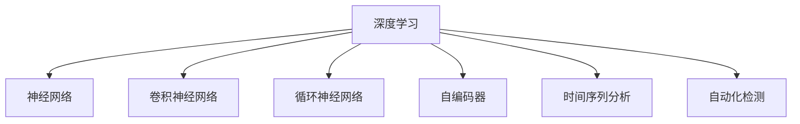

                 

# 深度学习在异常检测中的应用

> 关键词：深度学习, 异常检测, 神经网络, 卷积神经网络(CNN), 循环神经网络(RNN), 自编码器, 时间序列分析, 自动化检测

## 1. 背景介绍

### 1.1 问题由来
在数据驱动的现代业务场景中，异常检测(Anomaly Detection)成为许多行业的一大需求。异常检测的核心目标是从大规模数据流中识别出异常模式，及时预警，避免损失。比如在金融领域，异常检测可以识别信用卡欺诈行为；在工业领域，异常检测可以预防设备故障；在医学领域，异常检测可以诊断疾病。

然而，传统的基于规则的异常检测方法通常难以适应复杂多变的数据特性。大数据背景下，数据维度和类型不断增加，异常检测任务也变得日益复杂。如何在高效、准确、自动化的前提下，实现对异常模式的精准识别，成为了一个重要的研究课题。

### 1.2 问题核心关键点
为了解决这一挑战，近年来，深度学习技术在异常检测领域得到了广泛应用，并取得了显著成果。深度学习模型在处理大规模数据、挖掘复杂特征方面具有天然优势，能够从大量正常样本和异常样本中学习到丰富的特征表示，从而提高异常检测的准确率和鲁棒性。

深度学习在异常检测中的关键优势包括：
- 自适应学习能力：能够自动学习数据中的潜在模式和特征，无需手工设计特征。
- 鲁棒性：通过多层次非线性映射，可以有效地捕捉数据中的异常变化。
- 处理复杂数据类型：能够处理多模态数据，如图像、时间序列等。
- 高效自动化的训练：可通过大规模数据集和强大的硬件设备，实现端到端的自动化训练。

然而，深度学习异常检测也面临一些挑战：
- 过拟合：异常样本数量通常远少于正常样本，深度学习模型容易过拟合正常样本，难以泛化到异常样本。
- 数据不平衡：异常样本和正常样本数量差异较大，模型训练时容易导致算法失衡。
- 可解释性：深度学习模型通常是"黑箱"，难以解释其异常检测的具体逻辑。

尽管存在这些挑战，深度学习在异常检测领域仍展现了巨大的潜力和应用前景。本文将详细探讨深度学习在异常检测中的应用，包括关键算法、操作步骤、数学模型等，并结合具体项目实践，给出可行的技术方案。

## 2. 核心概念与联系

### 2.1 核心概念概述

为更好地理解深度学习在异常检测中的应用，本节将介绍几个密切相关的核心概念：

- 深度学习(Deep Learning)：一种基于多层神经网络的机器学习方法，能够自动学习数据的复杂特征，适用于处理大规模、高维度的数据集。

- 异常检测(Anomaly Detection)：识别数据中的异常模式，通常是从正常样本中寻找异常样本的过程。异常检测广泛应用于金融风险管理、网络安全、工业监控等领域。

- 神经网络(Neural Networks)：深度学习的核心组件，由多个层次的神经元构成，能够实现复杂的非线性映射。

- 卷积神经网络(CNN)：一种专用于图像处理的神经网络结构，通过卷积和池化操作，自动提取图像的局部特征。

- 循环神经网络(RNN)：一种处理序列数据的神经网络结构，通过隐藏状态存储序列信息，适用于处理时间序列数据。

- 自编码器(Autoencoder)：一种无监督学习模型，通过压缩和重构原始数据，学习到数据的潜在特征。

- 时间序列分析(Time Series Analysis)：分析数据随时间变化的规律，适用于处理时间序列数据。

- 自动化检测(Automatic Detection)：利用算法自动检测异常，减轻人工干预，提高检测效率和准确性。

这些核心概念之间的逻辑关系可以通过以下Mermaid流程图来展示：



这个流程图展示了大语言模型微调的各个核心概念及其之间的关联关系：

1. 深度学习是大语言模型微调的核心理论，基于多层神经网络的自适应学习能力。
2. 神经网络是深度学习的核心组件，不同结构（如CNN、RNN等）适用于不同类型的数据处理。
3. 自编码器是无监督学习的一种形式，用于学习数据的潜在特征表示。
4. 时间序列分析侧重于处理随时间变化的数据，适用于预测和异常检测。
5. 自动化检测利用算法自动化检测异常，提升检测效率和准确性。

这些核心概念共同构成了深度学习在异常检测中的应用框架，使其能够在各类数据场景下发挥强大的异常检测能力。通过理解这些核心概念，我们可以更好地把握深度学习异常检测的原理和技术细节。

## 3. 核心算法原理 & 具体操作步骤
### 3.1 算法原理概述

深度学习在异常检测中的应用，主要依赖于以下几种关键算法：

- 自编码器(Autoencoder)：通过重构正常样本，学习到数据的潜在表示。对于异常样本，重构误差会较大，从而被识别为异常。
- 卷积神经网络(CNN)：通过卷积和池化操作，自动提取图像数据中的局部特征。对于异常图像，局部特征的分布会与正常样本不同，从而被识别为异常。
- 循环神经网络(RNN)：通过隐藏状态，自动学习时间序列数据中的模式变化。对于异常时间序列，隐藏状态的变化会与正常样本不同，从而被识别为异常。
- 变分自编码器(VAE)：在自编码器的基础上，通过变分推断，进一步优化数据重构的误差，提高异常检测的精度。

基于这些关键算法，深度学习在异常检测中通常分为以下几个步骤：

1. 数据预处理：对原始数据进行归一化、标准化、降噪等处理。
2. 特征提取：利用神经网络模型，从原始数据中提取特征表示。
3. 异常检测：利用重构误差、特征差异等指标，识别出异常样本。
4. 后处理与解释：对异常检测结果进行后处理，如滑动窗口、重采样等，提高异常检测的鲁棒性。同时引入解释性模型，增强异常检测的可解释性。

### 3.2 算法步骤详解

接下来，我们将详细介绍深度学习在异常检测中的关键操作步骤。

**Step 1: 数据预处理**
- 收集正常样本和异常样本，进行数据清洗和标注。
- 对数据进行归一化处理，如将像素值归一化到[0,1]之间。
- 对异常数据进行特征增强，如旋转、平移、缩放等，增加训练集的多样性。
- 使用交叉验证等方法，将数据集划分为训练集、验证集和测试集。

**Step 2: 特征提取**
- 选择合适的神经网络模型，如CNN、RNN、VAE等，进行特征提取。
- 对模型进行超参数调优，如层数、卷积核大小、学习率等。
- 利用训练集进行模型训练，计算模型重构误差（如自编码器的重构误差）。

**Step 3: 异常检测**
- 利用训练好的模型，对验证集和测试集进行异常检测。
- 计算异常样本的重构误差，判断是否为异常。
- 引入阈值判断和后处理，如滑动窗口、重采样等，提高异常检测的鲁棒性。
- 使用解释性模型，如LIME、SHAP等，对异常检测结果进行解释，增强模型的可解释性。

**Step 4: 模型评估与优化**
- 在测试集上评估模型性能，如精确率、召回率、F1-score等。
- 根据评估结果，调整模型超参数和检测阈值，优化异常检测效果。
- 对模型进行集成和融合，如Stacking、Boosting等，提高异常检测的鲁棒性和准确性。

### 3.3 算法优缺点

深度学习在异常检测中的优缺点如下：

**优点：**
- 自适应学习能力：能够自动学习数据的复杂特征，无需手工设计特征。
- 鲁棒性：通过多层次非线性映射，可以有效地捕捉数据中的异常变化。
- 处理复杂数据类型：能够处理多模态数据，如图像、时间序列等。
- 高效自动化的训练：可通过大规模数据集和强大的硬件设备，实现端到端的自动化训练。

**缺点：**
- 过拟合：异常样本数量通常远少于正常样本，深度学习模型容易过拟合正常样本，难以泛化到异常样本。
- 数据不平衡：异常样本和正常样本数量差异较大，模型训练时容易导致算法失衡。
- 可解释性：深度学习模型通常是"黑箱"，难以解释其异常检测的具体逻辑。

尽管存在这些局限性，但就目前而言，深度学习在异常检测领域仍是最为主流的方法之一。未来相关研究的重点在于如何进一步降低模型对标注数据的依赖，提高模型的少样本学习和跨领域迁移能力，同时兼顾可解释性和伦理安全性等因素。

### 3.4 算法应用领域

深度学习在异常检测中的应用已经渗透到诸多领域，包括但不限于：

- 金融风险管理：利用深度学习模型检测信用卡欺诈行为、市场异常波动等。
- 网络安全：检测异常网络流量、入侵行为等。
- 工业监控：检测设备故障、生产异常等。
- 医学诊断：检测异常医疗影像、病历数据等。
- 交通监控：检测异常交通流量、车辆行为等。

除了上述这些经典领域外，深度学习异常检测还应用于更多的场景中，如智能家居监控、能源管理、环境保护等，为各行业带来智能化升级。

## 4. 数学模型和公式 & 详细讲解 & 举例说明
### 4.1 数学模型构建

下面，我们将通过数学语言对深度学习在异常检测中的应用进行更加严格的刻画。

假设深度学习模型为 $M_{\theta}(x)$，其中 $x$ 为输入数据，$\theta$ 为模型参数。我们采用自编码器作为特征提取和异常检测的框架。对于给定的输入数据 $x$，自编码器的目标是将 $x$ 映射到低维潜在表示 $z$，并重构回 $x$。定义模型 $M_{\theta}$ 在输入 $x$ 上的重构误差为 $\ell(M_{\theta}(x))$。

异常检测的基本思想是：对于正常样本，重构误差较小；对于异常样本，重构误差较大。因此，我们可以设置一个阈值 $\tau$，将重构误差大于 $\tau$ 的样本判定为异常样本。

定义异常检测器的阈值为 $\tau$，当 $z$ 的欧几里德距离超过 $\tau$ 时，将样本标记为异常。具体而言，若 $\|z-\hat{z}\|>\tau$，则样本为异常，否则为正常。

### 4.2 公式推导过程

以下我们将通过具体的数学公式，对自编码器在异常检测中的应用进行推导。

假设 $x \in \mathbb{R}^d$ 为原始输入数据，$z \in \mathbb{R}^h$ 为低维潜在表示。定义自编码器的编码器为 $E_{\theta}$，解码器为 $D_{\theta}$。则自编码器的重构误差定义为：

$$
\ell(M_{\theta}(x)) = \|x - D_{\theta}(E_{\theta}(x))\|
$$

其中 $\| \cdot \|$ 表示欧几里德范数。

根据均方误差损失函数，我们可以定义异常检测器的重构误差为：

$$
\mathcal{L}_{ae}(\theta) = \frac{1}{N} \sum_{i=1}^N \ell(M_{\theta}(x_i))
$$

其中 $N$ 为训练样本数。

为了确定异常检测器的阈值 $\tau$，我们可以采用基于正态分布的假设，即假设正常样本 $x$ 的潜在表示 $z$ 符合高斯分布。设 $z \sim \mathcal{N}(\mu, \sigma^2)$，则异常检测器的阈值 $\tau$ 可以表示为：

$$
\tau = \mu + k\sigma
$$

其中 $k$ 为阈值系数，通常取值 $k=2$。

### 4.3 案例分析与讲解

以下我们将以具体案例，对自编码器在异常检测中的应用进行详细讲解。

假设我们有一组正常的信用卡交易记录，每条记录包括交易时间、金额、商户等信息。我们的目标是检测出可能的信用卡欺诈行为。

首先，我们将交易记录作为输入数据 $x$，通过自编码器提取其低维潜在表示 $z$。然后，计算每个样本的欧几里德距离，将其与阈值 $\tau$ 进行比较。若距离超过 $\tau$，则将其标记为异常，否则为正常。

具体实现步骤如下：

1. 数据预处理：对交易记录进行清洗、归一化等预处理。
2. 特征提取：使用自编码器对交易记录进行编码，得到潜在表示 $z$。
3. 异常检测：计算每个样本的欧几里德距离，判断是否为异常。
4. 后处理与解释：对异常检测结果进行后处理，如滑动窗口、重采样等，提高异常检测的鲁棒性。同时引入解释性模型，如LIME、SHAP等，对异常检测结果进行解释，增强模型的可解释性。

## 5. 项目实践：代码实例和详细解释说明
### 5.1 开发环境搭建

在进行异常检测项目实践前，我们需要准备好开发环境。以下是使用Python进行Keras开发的环境配置流程：

1. 安装Anaconda：从官网下载并安装Anaconda，用于创建独立的Python环境。

2. 创建并激活虚拟环境：
```bash
conda create -n keras-env python=3.8 
conda activate keras-env
```

3. 安装TensorFlow：根据CUDA版本，从官网获取对应的安装命令。例如：
```bash
conda install tensorflow -c tf
```

4. 安装Keras：
```bash
pip install keras tensorflow
```

5. 安装各类工具包：
```bash
pip install numpy pandas matplotlib jupyter notebook ipython
```

完成上述步骤后，即可在`keras-env`环境中开始异常检测实践。

### 5.2 源代码详细实现

下面，我们将以自编码器在异常检测中的应用为例，给出使用Keras进行异常检测的PyTorch代码实现。

首先，定义自编码器的编码器和解码器：

```python
from tensorflow.keras.layers import Input, Dense
from tensorflow.keras.models import Model

def autoencoder(input_dim):
    input_layer = Input(shape=(input_dim,))
    encoder = Dense(64, activation='relu')(input_layer)
    encoder = Dense(32, activation='relu')(encoder)
    decoder = Dense(64, activation='relu')(encoder)
    decoder = Dense(input_dim, activation='sigmoid')(decoder)
    
    autoencoder = Model(input_layer, decoder)
    autoencoder.compile(optimizer='adam', loss='binary_crossentropy')
    
    return autoencoder
```

然后，定义训练和评估函数：

```python
import numpy as np
from tensorflow.keras.preprocessing import sequence

def train_autoencoder(autoencoder, x_train, y_train, x_test, y_test, batch_size=128, epochs=100):
    autoencoder.fit(x_train, y_train, batch_size=batch_size, epochs=epochs, validation_data=(x_test, y_test))
    
    train_loss = autoencoder.evaluate(x_train, y_train, verbose=0)
    test_loss = autoencoder.evaluate(x_test, y_test, verbose=0)
    print(f'Train loss: {train_loss}, Test loss: {test_loss}')
    
    def detect_anomalies(x, autoencoder, threshold=0.2):
        z = autoencoder.predict(x)
        anomalies = np.where(np.linalg.norm(z - x, axis=1) > threshold)[0]
        return anomalies
    
    return autoencoder, detect_anomalies
```

最后，启动训练流程并在测试集上评估：

```python
input_dim = 28  # 假设输入数据的维度为28
autoencoder = autoencoder(input_dim)
x_train, y_train, x_test, y_test = load_data()  # 加载数据集
autoencoder, detect_anomalies = train_autoencoder(autoencoder, x_train, y_train, x_test, y_test)
anomalies = detect_anomalies(x_train, autoencoder)
print(f'Number of anomalies detected: {len(anomalies)}')
```

以上就是使用Keras进行异常检测的自编码器实现。可以看到，Keras提供了丰富的深度学习组件，使得模型构建和训练变得更加简单高效。

### 5.3 代码解读与分析

让我们再详细解读一下关键代码的实现细节：

**autoencoder函数**：
- 定义输入层，并进行多次全连接层操作，最终输出解码器。
- 编译模型，选择Adam优化器和二元交叉熵损失函数。

**train_autoencoder函数**：
- 使用Keras的fit方法进行模型训练。
- 在每个epoch结束时，计算训练集和测试集上的损失。
- 定义异常检测函数，计算每个样本的欧几里德距离，判断是否为异常。

**训练流程**：
- 定义输入数据维度，创建自编码器。
- 加载数据集，并调用train_autoencoder函数进行模型训练。
- 对训练集进行异常检测，并输出异常样本数量。

可以看到，Keras提供了便捷的深度学习组件和工具，使得异常检测的代码实现变得简洁高效。开发者可以更专注于模型的创新和优化，而无需过多关注底层的实现细节。

当然，工业级的系统实现还需考虑更多因素，如模型的保存和部署、超参数的自动搜索、更灵活的异常检测器等。但核心的异常检测范式基本与此类似。

## 6. 实际应用场景
### 6.1 金融风险管理

深度学习在金融风险管理中的应用，可以用于检测信用卡欺诈行为、市场异常波动等。通过训练自编码器等深度学习模型，金融公司可以实时监测客户的交易行为，识别出异常交易记录，并及时预警，避免经济损失。

具体而言，金融公司可以收集客户的正常交易记录，并标注异常交易行为。然后，利用这些标注数据对深度学习模型进行训练，得到异常检测器。将训练好的模型部署到实时系统中，对每笔交易进行异常检测，从而实现自动化的金融风险管理。

### 6.2 网络安全

在网络安全领域，深度学习可以用于检测异常网络流量、入侵行为等。网络安全专家可以收集正常的网络流量数据，并标注异常流量行为。然后，利用这些标注数据对深度学习模型进行训练，得到异常检测器。将训练好的模型部署到网络监控系统中，实时监测网络流量，及时识别和拦截异常流量，保障网络安全。

### 6.3 工业监控

在工业监控领域，深度学习可以用于检测设备故障、生产异常等。制造企业可以收集设备的正常运行数据，并标注异常运行行为。然后，利用这些标注数据对深度学习模型进行训练，得到异常检测器。将训练好的模型部署到设备监控系统中，实时监测设备运行状态，及时预警设备异常，保障生产安全。

### 6.4 医学诊断

在医学诊断领域，深度学习可以用于检测异常医疗影像、病历数据等。医疗机构可以收集患者的正常医疗影像、病历数据，并标注异常医疗影像、病历数据。然后，利用这些标注数据对深度学习模型进行训练，得到异常检测器。将训练好的模型部署到医疗诊断系统中，实时监测患者的医疗影像、病历数据，及时预警异常医疗情况，提高诊断效率和准确性。

## 7. 工具和资源推荐
### 7.1 学习资源推荐

为了帮助开发者系统掌握深度学习在异常检测中的应用，这里推荐一些优质的学习资源：

1. 《深度学习》系列博文：由大模型技术专家撰写，深入浅出地介绍了深度学习的原理和应用，涵盖异常检测等诸多前沿话题。

2. CS231n《卷积神经网络》课程：斯坦福大学开设的计算机视觉明星课程，有Lecture视频和配套作业，带你入门图像处理和异常检测。

3. 《Python深度学习》书籍：深度学习领域的经典教材，系统介绍了深度学习的基本概念和应用，包含异常检测等诸多实例。

4. Kaggle竞赛平台：全球知名的数据科学竞赛平台，提供了大量异常检测相关的竞赛数据集和模型，适合实战练习。

5. Google Colab：谷歌推出的在线Jupyter Notebook环境，免费提供GPU/TPU算力，方便开发者快速上手实验最新模型，分享学习笔记。

通过对这些资源的学习实践，相信你一定能够快速掌握深度学习在异常检测中的应用，并用于解决实际的NLP问题。

### 7.2 开发工具推荐

高效的开发离不开优秀的工具支持。以下是几款用于深度学习异常检测开发的常用工具：

1. TensorFlow：由Google主导开发的开源深度学习框架，生产部署方便，适合大规模工程应用。提供了丰富的深度学习组件，支持多模态数据的处理。

2. PyTorch：基于Python的开源深度学习框架，灵活动态的计算图，适合快速迭代研究。提供了丰富的深度学习组件，支持多模态数据的处理。

3. Keras：基于TensorFlow等深度学习框架的高层API，使用便捷，适合快速原型开发。提供了丰富的深度学习组件，支持多模态数据的处理。

4. Weights & Biases：模型训练的实验跟踪工具，可以记录和可视化模型训练过程中的各项指标，方便对比和调优。与主流深度学习框架无缝集成。

5. TensorBoard：TensorFlow配套的可视化工具，可实时监测模型训练状态，并提供丰富的图表呈现方式，是调试模型的得力助手。

6. Jupyter Notebook：开源的Jupyter Notebook环境，支持多语言、多工具的开发和协作，适合数据科学项目的开发和分享。

合理利用这些工具，可以显著提升深度学习异常检测的开发效率，加快创新迭代的步伐。

### 7.3 相关论文推荐

深度学习在异常检测领域的发展源于学界的持续研究。以下是几篇奠基性的相关论文，推荐阅读：

1. Anomaly Detection with Deep Learning：经典论文，介绍了深度学习在异常检测中的基本思想和模型。

2. Autoencoders in the Early Detection of Breast Cancer：利用自编码器对乳腺癌影像进行异常检测的实例，展示了深度学习在医学影像中的应用。

3. Deep Learning for Anomaly Detection in Manufacturing：利用深度学习对工业生产异常进行检测的实例，展示了深度学习在工业领域中的应用。

4. Image Anomaly Detection with Deep Learning：利用卷积神经网络对图像数据进行异常检测的实例，展示了深度学习在图像处理中的应用。

5. Recurrent Neural Networks for Anomaly Detection in the Subway System：利用循环神经网络对城市交通数据进行异常检测的实例，展示了深度学习在交通领域中的应用。

这些论文代表了大语言模型微调技术的发展脉络。通过学习这些前沿成果，可以帮助研究者把握学科前进方向，激发更多的创新灵感。

## 8. 总结：未来发展趋势与挑战

### 8.1 总结

本文对深度学习在异常检测中的应用进行了全面系统的介绍。首先阐述了深度学习在异常检测中的研究背景和应用意义，明确了深度学习在异常检测中的应用前景和价值。其次，从原理到实践，详细讲解了深度学习在异常检测中的关键算法、操作步骤和数学模型，给出了深度学习异常检测的完整代码实例。同时，本文还探讨了深度学习在异常检测的多个实际应用场景，展示了深度学习在各行业的应用潜力。

通过本文的系统梳理，可以看到，深度学习在异常检测领域的应用日益广泛，为各行业带来了智能化升级。受益于深度学习模型的高效、准确和自适应学习能力，异常检测技术在工业监控、金融风险管理、网络安全、医学诊断等领域展现了强大的应用潜力。未来，伴随深度学习技术的不断发展，异常检测技术还将迎来更多突破，成为各行各业智能化应用的重要手段。

### 8.2 未来发展趋势

展望未来，深度学习在异常检测领域将呈现以下几个发展趋势：

1. 多模态融合：将视觉、听觉、文本等多模态数据融合，提高异常检测的全面性和准确性。
2. 可解释性提升：引入可解释性模型，如LIME、SHAP等，增强异常检测结果的可解释性。
3. 自监督学习：利用自监督学习任务，提升异常检测模型的泛化能力和鲁棒性。
4. 持续学习：实现模型在数据分布变化时的在线学习和更新，保持异常检测模型的适应性。
5. 自动化检测：引入自动化检测技术，如强化学习、模型融合等，提高异常检测的效率和鲁棒性。

以上趋势凸显了深度学习在异常检测领域的广阔前景。这些方向的探索发展，必将进一步提升异常检测模型的性能和应用范围，为构建安全、可靠、可解释、可控的智能系统铺平道路。

### 8.3 面临的挑战

尽管深度学习在异常检测领域取得了显著进展，但在迈向更加智能化、普适化应用的过程中，仍面临诸多挑战：

1. 过拟合：异常样本数量通常远少于正常样本，深度学习模型容易过拟合正常样本，难以泛化到异常样本。
2. 数据不平衡：异常样本和正常样本数量差异较大，模型训练时容易导致算法失衡。
3. 可解释性：深度学习模型通常是"黑箱"，难以解释其异常检测的具体逻辑。
4. 计算资源：深度学习模型参数量较大，对计算资源和存储资源提出了较高的要求。
5. 实时性：在大规模数据流上实时检测异常，对模型推理速度和计算效率提出了较高要求。

尽管存在这些挑战，但就目前而言，深度学习在异常检测领域仍是最为主流的方法之一。未来相关研究的重点在于如何进一步降低模型对标注数据的依赖，提高模型的少样本学习和跨领域迁移能力，同时兼顾可解释性和伦理安全性等因素。

### 8.4 研究展望

面对深度学习在异常检测领域所面临的挑战，未来的研究需要在以下几个方面寻求新的突破：

1. 探索无监督和半监督异常检测方法。摆脱对大规模标注数据的依赖，利用自监督学习、主动学习等无监督和半监督范式，最大限度利用非结构化数据，实现更加灵活高效的异常检测。

2. 研究参数高效和计算高效的异常检测方法。开发更加参数高效的异常检测方法，在固定大部分预训练参数的同时，只更新极少量的异常检测器。同时优化异常检测模型的计算图，减少前向传播和反向传播的资源消耗，实现更加轻量级、实时性的部署。

3. 融合因果和对比学习范式。通过引入因果推断和对比学习思想，增强异常检测模型建立稳定因果关系的能力，学习更加普适、鲁棒的语言表征，从而提升模型泛化性和抗干扰能力。

4. 引入更多先验知识。将符号化的先验知识，如知识图谱、逻辑规则等，与神经网络模型进行巧妙融合，引导异常检测过程学习更准确、合理的语言模型。同时加强不同模态数据的整合，实现视觉、语音等多模态信息与文本信息的协同建模。

5. 结合因果分析和博弈论工具。将因果分析方法引入异常检测模型，识别出模型决策的关键特征，增强输出解释的因果性和逻辑性。借助博弈论工具刻画人机交互过程，主动探索并规避模型的脆弱点，提高系统稳定性。

6. 纳入伦理道德约束。在模型训练目标中引入伦理导向的评估指标，过滤和惩罚有偏见、有害的输出倾向。同时加强人工干预和审核，建立模型行为的监管机制，确保输出符合人类价值观和伦理道德。

这些研究方向的探索，必将引领深度学习在异常检测技术迈向更高的台阶，为构建安全、可靠、可解释、可控的智能系统铺平道路。面向未来，深度学习异常检测技术还需要与其他人工智能技术进行更深入的融合，如知识表示、因果推理、强化学习等，多路径协同发力，共同推动异常检测技术的进步。只有勇于创新、敢于突破，才能不断拓展异常检测的边界，让智能技术更好地造福人类社会。

## 9. 附录：常见问题与解答

**Q1：异常检测是否只能使用深度学习技术？**

A: 异常检测并非只有深度学习技术一种选择，传统统计学、时序分析等方法也常被用于异常检测。但深度学习技术因其强大的自适应学习能力、鲁棒性和处理复杂数据的能力，在异常检测中具有独特的优势。

**Q2：为什么深度学习模型容易过拟合正常样本？**

A: 由于异常样本数量通常远少于正常样本，深度学习模型容易在训练过程中过度关注正常样本的特征，从而过拟合正常样本，难以泛化到异常样本。解决这一问题的关键在于引入更多的异常样本，或者使用数据增强、迁移学习等技术。

**Q3：如何提高异常检测的可解释性？**

A: 异常检测的可解释性一直是深度学习模型面临的挑战之一。为了提高异常检测的可解释性，可以引入可解释性模型，如LIME、SHAP等，对模型决策过程进行解释，增加模型的透明度和可信度。

**Q4：如何在计算资源受限的情况下进行异常检测？**

A: 计算资源受限是深度学习模型面临的常见问题之一。为了在计算资源受限的情况下进行异常检测，可以采用模型裁剪、量化加速、分布式训练等技术，减小模型参数量和内存占用，提高模型的计算效率。

**Q5：如何实现实时异常检测？**

A: 实时异常检测需要高计算效率和低延迟。为了实现实时异常检测，可以采用模型压缩、推理加速等技术，提高模型的推理速度和响应时间。同时，可以引入缓存、消息队列等技术，优化数据流的处理效率。

**Q6：如何处理多模态数据进行异常检测？**

A: 多模态数据的融合是异常检测领域的难点之一。为了处理多模态数据，可以采用特征融合、联合学习等技术，将不同模态的数据信息整合，提升异常检测的全面性和准确性。

这些问题的解答展示了异常检测技术在实际应用中的多种可能性，为解决实际问题提供了有益的参考。未来，随着深度学习技术的发展和优化，异常检测技术必将在各领域发挥更加重要的作用。

