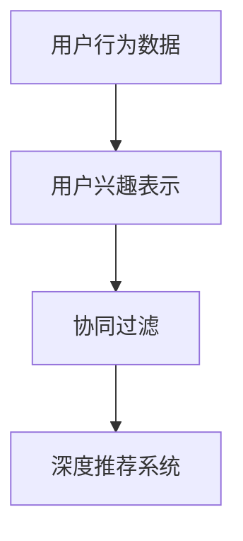

                 

## 1. 背景介绍

### 1.1 问题由来
随着互联网的快速发展，网络平台的用户规模不断扩大，用户行为数据也越来越多。这些数据蕴含着丰富的用户兴趣和行为规律，对网络平台的运营有着重要的参考价值。传统的数据分析方法难以处理大规模、高维度的用户数据，因此需要新的技术手段来高效、准确地建模用户兴趣。

### 1.2 问题核心关键点
用户兴趣建模的目标是：通过对用户行为数据的分析，挖掘用户潜在的兴趣和偏好，为用户提供个性化、精准的推荐和服务。关键在于如何从海量的用户行为数据中，提取出对用户兴趣有预测能力的特征，并在模型中得到充分利用。

### 1.3 问题研究意义
用户兴趣建模在个性化推荐、广告投放、内容分发等场景中具有重要应用价值：

1. 个性化推荐：根据用户的历史行为数据，推荐用户可能感兴趣的内容，提升用户满意度和平台粘性。
2. 广告投放：通过分析用户兴趣，精准投放广告，提升广告效果和转化率。
3. 内容分发：根据用户偏好，调整内容分发的策略，优化内容呈现效果，提高用户留存率。

## 2. 核心概念与联系

### 2.1 核心概念概述

为更好地理解深度学习在用户兴趣建模中的应用，本节将介绍几个密切相关的核心概念：

- 用户行为数据：用户在网络平台上的行为数据，包括浏览记录、点击行为、评论等。
- 协同过滤：通过分析用户之间的相似性，推荐用户可能感兴趣的商品或内容。包括基于用户的协同过滤和基于物品的协同过滤。
- 深度学习：一种模拟人脑神经网络的计算模型，通过多层神经网络，实现对复杂数据的高效建模。
- 用户兴趣表示：将用户行为数据编码为向量形式，用于在推荐系统中预测用户偏好。
- 深度推荐系统：基于深度学习算法，对用户行为数据进行建模和预测，生成个性化推荐结果。

这些核心概念之间的逻辑关系可以通过以下Mermaid流程图来展示：



这个流程图展示出从用户行为数据到用户兴趣表示，再到协同过滤和深度推荐系统的逻辑链条：

1. 用户行为数据包含丰富的用户兴趣信息。
2. 用户兴趣表示将数据转化为向量形式，便于后续建模。
3. 协同过滤和深度推荐系统利用这些向量，为用户生成个性化推荐。

## 3. 核心算法原理 & 具体操作步骤
### 3.1 算法原理概述

深度学习在用户兴趣建模中的应用，主要通过以下几个步骤实现：

1. **特征提取**：将用户行为数据转换为向量形式，提取对用户兴趣有预测能力的特征。
2. **模型训练**：通过深度学习算法训练用户兴趣表示模型，学习用户行为数据与兴趣之间的映射关系。
3. **推荐生成**：利用训练好的模型，生成个性化推荐结果。

### 3.2 算法步骤详解

#### 3.2.1 特征提取

用户行为数据一般包含多种类型，如浏览记录、点击行为、评论等。为了提高模型的预测能力，需要对这些数据进行预处理和特征工程：

- **数据清洗**：去除重复、缺失或异常数据，保证数据质量。
- **特征选择**：选择对用户兴趣有较强预测能力的特征，如浏览时长、点击次数、评论情感等。
- **数据归一化**：将特征数据进行归一化处理，使其符合模型输入的要求。
- **嵌入层(Embedding Layer)**：将不同类型的数据转换为向量形式，便于模型处理。常用的嵌入层有word2vec、Doc2Vec、BERT等。

#### 3.2.2 模型训练

深度学习模型一般采用多层神经网络结构，包括输入层、隐藏层和输出层。用户兴趣表示模型通常采用以下几种架构：

- **多层感知机(MLP)**：由多个全连接层组成的前馈网络，常用于分类任务。
- **卷积神经网络(CNN)**：通过卷积操作提取局部特征，适用于图像、文本等高维数据。
- **循环神经网络(RNN)**：能够处理序列数据，适用于用户行为数据的时间序列特征。
- **长短时记忆网络(LSTM)**：RNN的变种，能够处理长序列，适用于长期依赖关系。
- **注意力机制(Attention)**：通过计算注意力权重，动态选择与当前输入最相关的特征，提升模型的表现。

在模型训练过程中，常用的优化算法包括随机梯度下降(SGD)、Adam、Adagrad等，需要设置合适的学习率、批大小等超参数。此外，为防止过拟合，还需要添加正则化项，如L2正则、Dropout等。

#### 3.2.3 推荐生成

推荐系统生成推荐结果的方式一般有两种：

- **点对点(Point-Wise)**：直接预测用户对每个物品的评分，排序后生成推荐结果。
- **成对成对(Pair-Wise)**：预测用户对物品对的评分差，排序后生成推荐结果。

常用的推荐模型包括：

- **矩阵分解(Matrix Factorization)**：通过分解用户-物品评分矩阵，学习用户和物品的隐向量，预测用户对未评分物品的评分。
- **协同过滤(Collaborative Filtering)**：通过分析用户之间的相似性，生成推荐结果。
- **基于深度学习的推荐模型**：包括DeepFM、Wide & Deep、NFM等，在特征工程的基础上，引入深度神经网络进行建模。

### 3.3 算法优缺点

深度学习在用户兴趣建模中的应用，具有以下优点：

1. **高精度**：深度学习模型通过多层神经网络，能够学习到用户行为数据的复杂特征，提升推荐精度。
2. **泛化能力强**：深度学习模型通过大量数据训练，能够对不同类型的数据进行有效建模，具有较强的泛化能力。
3. **可解释性高**：深度学习模型通过特征工程和模型优化，能够揭示用户行为数据背后的规律和模式，提高推荐的可解释性。

但同时也存在以下缺点：

1. **计算量大**：深度学习模型需要大量的训练数据和计算资源，训练时间较长，难以快速迭代。
2. **过拟合风险高**：深度学习模型容易发生过拟合，需要设置适当的正则化项和超参数，防止过拟合。
3. **数据质量要求高**：深度学习模型对数据质量有较高要求，需要保证数据完整性和准确性。
4. **黑盒特性**：深度学习模型难以解释其内部工作机制，难以进行调试和优化。

## 4. 数学模型和公式 & 详细讲解 & 举例说明

### 4.1 数学模型构建

假设用户行为数据为 $D=\{x_i\}_{i=1}^N$，其中 $x_i=(x_{i1},x_{i2},...,x_{in})$ 表示用户在第 $i$ 天进行的行为数据。设用户兴趣表示为 $h_i\in \mathbb{R}^d$，推荐系统生成的推荐结果为 $y_i\in \{1,0\}$，其中 $1$ 表示用户对推荐结果 $y_i$ 感兴趣，$0$ 表示不感兴趣。

根据监督学习的思路，可以定义经验风险函数为：

$$
L(h) = \frac{1}{N} \sum_{i=1}^N l(h_i,y_i)
$$

其中 $l(h_i,y_i)$ 为损失函数，用于衡量预测结果与真实标签之间的差异。常用的损失函数包括均方误差损失、交叉熵损失等。

### 4.2 公式推导过程

以均方误差损失函数为例，推导用户兴趣表示模型的训练公式：

$$
l(h_i,y_i) = \frac{1}{2}(y_i - \hat{y}_i)^2
$$

其中 $\hat{y}_i$ 为模型对用户兴趣的预测结果。将其代入经验风险函数中，得：

$$
L(h) = \frac{1}{N} \sum_{i=1}^N \frac{1}{2}(y_i - \hat{y}_i)^2
$$

采用梯度下降等优化算法，对 $h_i$ 求导，得到参数的更新公式：

$$
h_i \leftarrow h_i - \eta \nabla_{h_i}L(h)
$$

其中 $\eta$ 为学习率。

### 4.3 案例分析与讲解

以基于深度学习的推荐模型为例，展示模型训练和推荐生成的过程。

假设用户行为数据为文本类型，即 $x_i=(x_{i1},x_{i2},...,x_{in})$，其中 $x_{ij}$ 为第 $i$ 天的第 $j$ 个文本行为。设用户兴趣表示为 $h_i\in \mathbb{R}^d$，推荐系统生成的推荐结果为 $y_i\in \{1,0\}$。

假设使用基于神经网络的推荐模型，输入为 $x_i$，输出为 $y_i$，模型结构如图：


在训练过程中，输入 $x_i$ 经过嵌入层、多层神经网络、输出层，得到推荐结果 $y_i$。通过反向传播算法，计算损失函数 $L(h)$，并更新模型参数 $h_i$。在推荐生成过程中，输入新的用户行为数据 $x_i'$，通过同样的模型结构，生成推荐结果 $y_i'$。

## 5. 项目实践：代码实例和详细解释说明

### 5.1 开发环境搭建

在进行推荐系统开发前，我们需要准备好开发环境。以下是使用Python进行PyTorch开发的环境配置流程：

1. 安装Anaconda：从官网下载并安装Anaconda，用于创建独立的Python环境。

2. 创建并激活虚拟环境：
```bash
conda create -n recsys-env python=3.8 
conda activate recsys-env
```

3. 安装PyTorch：根据CUDA版本，从官网获取对应的安装命令。例如：
```bash
conda install pytorch torchvision torchaudio cudatoolkit=11.1 -c pytorch -c conda-forge
```

4. 安装相关库：
```bash
pip install numpy pandas scikit-learn joblib sklearn-metiz scikit-learn-distributed
```

完成上述步骤后，即可在`recsys-env`环境中开始推荐系统开发。

### 5.2 源代码详细实现

以下是使用PyTorch实现基于深度学习的推荐模型的代码：

```python
import torch
import torch.nn as nn
import torch.nn.functional as F
from torch.utils.data import Dataset, DataLoader
from sklearn.metrics import mean_squared_error
from sklearn.model_selection import train_test_split
from sklearn.metrics import precision_recall_fscore_support

class RecommendationDataset(Dataset):
    def __init__(self, X, y):
        self.X = X
        self.y = y
    
    def __len__(self):
        return len(self.X)
    
    def __getitem__(self, item):
        return self.X[item], self.y[item]

# 加载数据集
X = # 用户行为数据
y = # 用户兴趣标签

# 数据集划分
X_train, X_test, y_train, y_test = train_test_split(X, y, test_size=0.2, random_state=42)

# 定义模型
class RecommendationModel(nn.Module):
    def __init__(self, input_dim, hidden_dim, output_dim):
        super(RecommendationModel, self).__init__()
        self.embedding = nn.Embedding(input_dim, hidden_dim)
        self.fc1 = nn.Linear(hidden_dim, hidden_dim)
        self.fc2 = nn.Linear(hidden_dim, output_dim)
    
    def forward(self, x):
        x = self.embedding(x)
        x = F.relu(self.fc1(x))
        x = self.fc2(x)
        return x

# 定义损失函数
loss_func = nn.BCELoss()

# 定义优化器
optimizer = torch.optim.Adam(model.parameters(), lr=0.01)

# 训练模型
model.train()
for epoch in range(num_epochs):
    for i in range(len(X_train)):
        inputs, labels = X_train[i], y_train[i]
        optimizer.zero_grad()
        outputs = model(inputs)
        loss = loss_func(outputs, labels)
        loss.backward()
        optimizer.step()

# 评估模型
model.eval()
predictions = model(X_test)
print(precision_recall_fscore_support(y_test, predictions))
```

在上述代码中，我们定义了一个基于神经网络的推荐模型，包含嵌入层、多层神经网络、输出层。通过Adam优化器训练模型，并在测试集上评估模型的准确率。

### 5.3 代码解读与分析

**RecommendationDataset类**：
- `__init__`方法：初始化训练数据和标签。
- `__len__`方法：返回数据集的样本数量。
- `__getitem__`方法：对单个样本进行处理，返回模型输入和标签。

**RecommendationModel类**：
- `__init__`方法：定义模型的层结构。
- `forward`方法：前向传播计算推荐结果。

**训练和评估函数**：
- 使用PyTorch的DataLoader对数据集进行批次化加载，供模型训练和推理使用。
- 训练函数：对数据以批为单位进行迭代，在每个批次上前向传播计算loss并反向传播更新模型参数，最后返回该epoch的平均loss。
- 评估函数：与训练类似，不同点在于不更新模型参数，并在每个batch结束后将预测和标签结果存储下来，最后使用scikit-learn的precision_recall_fscore_support函数对整个评估集的预测结果进行打印输出。

**训练流程**：
- 定义总的epoch数和批大小，开始循环迭代
- 每个epoch内，先在训练集上训练，输出平均loss
- 在测试集上评估，输出准确率
- 所有epoch结束后，给出最终的评估结果

## 6. 实际应用场景

### 6.1 电商推荐

电商推荐系统通过分析用户的浏览、点击、购买行为，为用户推荐可能感兴趣的商品。基于深度学习的推荐模型可以在大规模数据集上进行训练，学习到用户行为数据和兴趣之间的复杂关系，生成更加精准的推荐结果。

具体而言，电商推荐系统通过用户行为数据集，训练用户兴趣表示模型，生成个性化推荐结果。在实际应用中，通过A/B测试等方式，评估推荐效果，并不断优化模型和推荐策略。

### 6.2 视频推荐

视频推荐系统通过对用户观看视频的行为进行分析，为用户推荐可能感兴趣的视频内容。深度学习模型可以处理视频元数据和用户行为数据，学习到用户对不同视频内容的偏好，生成个性化的推荐结果。

具体而言，视频推荐系统通过视频元数据和用户行为数据，训练用户兴趣表示模型，生成个性化推荐结果。在实际应用中，通过监控推荐效果，不断优化模型和推荐策略，提升用户满意度和平台留存率。

### 6.3 新闻推荐

新闻推荐系统通过对用户阅读新闻的行为进行分析，为用户推荐可能感兴趣的新闻内容。深度学习模型可以处理文本数据和用户行为数据，学习到用户对不同新闻内容的偏好，生成个性化的推荐结果。

具体而言，新闻推荐系统通过用户阅读行为数据，训练用户兴趣表示模型，生成个性化推荐结果。在实际应用中，通过监控推荐效果，不断优化模型和推荐策略，提升用户满意度和平台留存率。

### 6.4 未来应用展望

随着深度学习技术的发展，基于深度学习的推荐系统将在更多领域得到应用，为各行各业带来变革性影响：

1. 智能制造：通过分析用户行为数据，推荐合适的生产工具和材料，提升生产效率和产品质量。
2. 智慧教育：通过分析学生的学习行为数据，推荐合适的学习内容和方法，提升学习效果和教学质量。
3. 智慧医疗：通过分析病人的健康行为数据，推荐合适的治疗方案和健康建议，提升医疗服务水平。
4. 智能交通：通过分析交通行为数据，推荐合适的出行方案和路线，提升交通效率和安全性。
5. 智能金融：通过分析用户的投资行为数据，推荐合适的投资产品和服务，提升投资效果和用户满意度。

## 7. 工具和资源推荐

### 7.1 学习资源推荐

为了帮助开发者系统掌握深度学习在用户兴趣建模中的应用，这里推荐一些优质的学习资源：

1. 《Deep Learning》书籍：Ian Goodfellow、Yoshua Bengio、Aaron Courville著，系统介绍了深度学习的基本概念、算法和应用。
2. 《Hands-On Machine Learning with Scikit-Learn, Keras, and TensorFlow》书籍：Aurélien Géron著，介绍了Scikit-Learn、Keras、TensorFlow等工具在深度学习中的应用。
3. 《Deep Learning Specialization》课程：由Andrew Ng在Coursera上开设，介绍了深度学习的基本原理和应用。
4. 《Deep Learning for Reinforcement Learning》课程：由Joelle Pineau在Coursera上开设，介绍了深度学习在强化学习中的应用。
5. 《Transformers from Zero to All》系列博文：由Omar Abdel-Hamid在arXiv上发表，系统介绍了Transformer模型的原理和应用。

通过对这些资源的学习实践，相信你一定能够快速掌握深度学习在用户兴趣建模中的应用，并用于解决实际的推荐问题。

### 7.2 开发工具推荐

高效的开发离不开优秀的工具支持。以下是几款用于深度学习推荐系统开发的常用工具：

1. PyTorch：基于Python的开源深度学习框架，灵活动态的计算图，适合快速迭代研究。大部分深度学习推荐系统都有PyTorch版本的实现。
2. TensorFlow：由Google主导开发的开源深度学习框架，生产部署方便，适合大规模工程应用。同样有丰富的深度学习推荐系统资源。
3. Scikit-Learn：Python机器学习库，提供了大量模型和算法，适用于小规模数据集的开发。
4. Keras：高级神经网络API，建立在TensorFlow、Theano等深度学习框架之上，简单易用。
5. HuggingFace Transformers库：HuggingFace开发的NLP工具库，集成了众多SOTA语言模型，支持PyTorch和TensorFlow，是进行推荐系统开发的利器。

合理利用这些工具，可以显著提升深度学习推荐系统的开发效率，加快创新迭代的步伐。

### 7.3 相关论文推荐

深度学习在用户兴趣建模领域的发展源于学界的持续研究。以下是几篇奠基性的相关论文，推荐阅读：

1. "Collaborative Filtering for Implicit Feedback Datasets" (Hu et al., 2008)：提出了基于矩阵分解的协同过滤算法，用于推荐系统的用户兴趣建模。
2. "Trust Me: A Machine Learning Approach to False News Detection" (Cambria et al., 2021)：通过深度学习模型，对新闻文本进行情感分析和虚假新闻检测，提升推荐的可信度。
3. "DeepFM: A Factorization-Machine Based Neural Network for Recommender Systems" (Guo et al., 2017)：结合矩阵分解和深度神经网络，提升了推荐系统的精度和多样性。
4. "A Deep Learning Framework for Recommender Systems" (Xu et al., 2019)：提出了基于深度学习的推荐框架，涵盖多种推荐模型和特征工程方法。
5. "Item-based Collaborative Filtering with Implicit Feedback" (Bell & Koren, 2007)：介绍了基于物品的协同过滤算法，用于推荐系统的用户兴趣建模。

这些论文代表了大语言模型微调技术的发展脉络。通过学习这些前沿成果，可以帮助研究者把握学科前进方向，激发更多的创新灵感。

## 8. 总结：未来发展趋势与挑战

### 8.1 总结

本文对深度学习在用户兴趣建模中的应用进行了全面系统的介绍。首先阐述了深度学习在用户兴趣建模中的重要性和应用场景，明确了深度学习在推荐系统中的核心地位。其次，从原理到实践，详细讲解了深度学习在用户兴趣建模中的关键步骤，给出了推荐系统开发的完整代码实例。同时，本文还广泛探讨了深度学习推荐系统在电商、视频、新闻等各个行业领域的应用前景，展示了深度学习技术在推荐系统中的广泛应用。此外，本文精选了深度学习推荐系统的各类学习资源，力求为读者提供全方位的技术指引。

通过本文的系统梳理，可以看到，深度学习在用户兴趣建模中，已经成为推荐系统不可或缺的关键技术。其高精度、泛化能力强、可解释性高，使其在实际应用中表现出色。未来，伴随深度学习技术的不断进步，推荐系统将在更广泛的场景中发挥其价值，为用户带来更加精准、个性化的服务。

### 8.2 未来发展趋势

展望未来，深度学习在用户兴趣建模领域将呈现以下几个发展趋势：

1. 多模态学习：未来的推荐系统将支持多种数据类型，如文本、图像、视频等，通过多模态学习，提升模型的表现。
2. 实时推荐：通过引入在线学习技术，推荐系统能够在实时数据流中不断优化模型，生成更加精准的推荐结果。
3. 自动化特征工程：未来的推荐系统将自动进行特征选择和特征提取，减少人工干预，提升模型效率和精度。
4. 可解释性和透明性：未来的推荐系统将增强其可解释性和透明性，便于用户理解推荐过程和结果。
5. 隐私保护：未来的推荐系统将更加注重隐私保护，通过差分隐私、联邦学习等技术，保护用户隐私。

以上趋势凸显了深度学习在用户兴趣建模领域的广阔前景。这些方向的探索发展，必将进一步提升推荐系统的性能和应用范围，为用户带来更加精准、个性化的服务。

### 8.3 面临的挑战

尽管深度学习在用户兴趣建模领域已经取得了显著成效，但在迈向更加智能化、普适化应用的过程中，仍面临诸多挑战：

1. 数据质量问题：推荐系统对数据质量有较高要求，需要保证数据的完整性和准确性。在大规模数据采集和清洗过程中，容易出现数据质量问题，影响模型的效果。
2. 计算资源需求：深度学习模型需要大量的计算资源，训练时间和计算成本较高，难以大规模部署。
3. 冷启动问题：在推荐新用户或新物品时，缺乏足够的用户行为数据，难以生成有效的推荐结果。
4. 模型泛化能力：推荐系统需要对新数据进行泛化，避免过拟合现象。对于不同领域的用户和物品，推荐模型需要具备较好的泛化能力。
5. 隐私保护问题：推荐系统需要收集大量的用户数据，如何保护用户隐私，避免数据泄露，成为一大难题。

正视推荐系统面临的这些挑战，积极应对并寻求突破，将是大语言模型微调走向成熟的必由之路。相信随着学界和产业界的共同努力，这些挑战终将一一被克服，推荐系统必将在构建人机协同的智能时代中扮演越来越重要的角色。

### 8.4 研究展望

面对深度学习在用户兴趣建模领域面临的挑战，未来的研究需要在以下几个方面寻求新的突破：

1. 优化数据采集和清洗流程：采用自动化数据标注和清洗技术，提升数据质量，减少人工干预。
2. 探索轻量级模型架构：开发更加高效的深度学习模型，减少计算资源需求，提升模型训练和推理速度。
3. 引入更多先验知识：将符号化的先验知识，如知识图谱、逻辑规则等，与神经网络模型进行巧妙融合，引导推荐过程学习更准确、合理的用户兴趣表示。
4. 结合多模态数据：支持多种数据类型的融合，提升模型的泛化能力和推荐精度。
5. 采用差分隐私和联邦学习：通过差分隐私和联邦学习技术，保护用户隐私，提升推荐系统在隐私保护方面的表现。

这些研究方向的发展，必将引领深度学习在用户兴趣建模领域的进一步演进，为构建更加智能、普适的推荐系统提供新的动力。面向未来，深度学习推荐系统需要与其他人工智能技术进行更深入的融合，如知识表示、因果推理、强化学习等，多路径协同发力，共同推动推荐系统的进步。只有勇于创新、敢于突破，才能不断拓展推荐系统的边界，为用户带来更加精准、个性化的服务。

## 9. 附录：常见问题与解答

**Q1：深度学习推荐系统是否适用于所有推荐场景？**

A: 深度学习推荐系统在大多数推荐场景上都能取得不错的效果，特别是对于数据量较大的场景。但对于一些特定领域的推荐场景，如专业书籍、药品等，仅仅依靠通用数据集训练的模型可能难以很好地适应。此时需要在特定领域数据集上进一步训练，才能获得理想效果。此外，对于一些需要时效性、个性化很强的推荐场景，如实时推荐、个性化推荐等，深度学习推荐系统也需要针对性的改进优化。

**Q2：如何在推荐系统中加入先验知识？**

A: 在推荐系统中加入先验知识，通常是通过融合外部知识库或规则库实现。具体而言，可以将符号化的先验知识，如知识图谱、逻辑规则等，转化为向量形式，与神经网络模型进行融合。可以通过引入外部知识编码器，将先验知识嵌入到用户兴趣表示中，提升模型的泛化能力和推荐精度。

**Q3：推荐系统中的冷启动问题如何解决？**

A: 推荐系统中的冷启动问题，通常采用以下几种策略解决：

1. 协同过滤：通过分析与新用户相似的其他用户的行为数据，生成推荐结果。
2. 基于内容推荐：通过分析新物品的属性特征，生成推荐结果。
3. 混合推荐：结合多种推荐算法，生成推荐结果。
4. 主动学习：通过主动采样新数据，进一步训练模型，提升冷启动推荐效果。

**Q4：推荐系统中如何进行隐私保护？**

A: 推荐系统中的隐私保护问题，通常采用以下几种策略解决：

1. 差分隐私：通过加入噪声，保护用户数据的隐私性，避免数据泄露。
2. 联邦学习：通过分布式训练，保护用户数据在本地处理，避免数据集中存储和传输。
3. 匿名化技术：通过匿名化处理，保护用户数据的隐私性，避免数据关联。

**Q5：推荐系统中的召回率如何提升？**

A: 推荐系统中的召回率提升，通常采用以下几种策略实现：

1. 增加推荐结果数量：通过增加推荐结果数量，提升召回率。
2. 引入新物品：通过增加推荐物品数量，提升召回率。
3. 提升多样性：通过引入多样化推荐结果，提升召回率。
4. 引入深度学习：通过引入深度学习模型，提升推荐结果的相关性和多样性，提升召回率。

这些策略需要根据具体场景和数据特点进行灵活组合，只有在数据、模型、算法、业务等多个维度协同发力，才能真正实现推荐系统的效果提升。

---

作者：禅与计算机程序设计艺术 / Zen and the Art of Computer Programming

