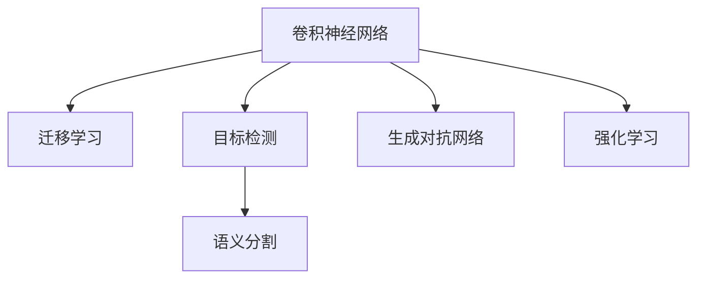

                 

# 深度学习在计算机视觉中的最新进展

> 关键词：深度学习,计算机视觉,卷积神经网络,迁移学习,目标检测,语义分割,生成对抗网络,强化学习

## 1. 背景介绍

### 1.1 问题由来
计算机视觉（Computer Vision, CV）是人工智能领域的重要分支之一，旨在使计算机具备“看见”和理解视觉信息的能力。随着深度学习技术的不断进步，计算机视觉技术在图像识别、目标检测、语义分割、生成图像、场景重建、人机交互等诸多领域取得了显著突破。

近年来，深度学习算法如卷积神经网络（Convolutional Neural Networks, CNNs）在计算机视觉中扮演了核心角色。CNNs通过层层卷积和池化操作，能够自动学习到图像中的层次化特征表示，从而实现强大的图像处理和分类能力。目前，深度学习在计算机视觉领域的应用已经非常广泛，包括自动驾驶、医学影像分析、智能监控、无人驾驶、增强现实等。

然而，深度学习在计算机视觉中的发展也面临着诸多挑战，如模型复杂度高、训练时间长、计算资源消耗大等问题。为了应对这些挑战，研究者们提出了诸多改进方法，包括迁移学习（Transfer Learning）、目标检测（Object Detection）、语义分割（Semantic Segmentation）、生成对抗网络（Generative Adversarial Networks, GANs）和强化学习（Reinforcement Learning）等新技术。

本文将对计算机视觉中的这些最新进展进行全面系统的介绍，帮助读者深入理解深度学习在计算机视觉中的前沿技术和发展趋势。

## 2. 核心概念与联系

### 2.1 核心概念概述

为更好地理解深度学习在计算机视觉中的最新进展，本节将介绍几个密切相关的核心概念：

- 卷积神经网络（Convolutional Neural Networks, CNNs）：一种专门用于处理图像数据的多层神经网络，通过卷积层、池化层和全连接层等组件，能够自动学习到图像的层次化特征表示。

- 迁移学习（Transfer Learning）：将在一个任务上预训练的模型迁移到另一个任务上，通过微调模型参数来提升新任务的性能。

- 目标检测（Object Detection）：识别并定位图像中的物体，输出物体的类别和位置信息。常见的目标检测算法包括R-CNN、Fast R-CNN、Faster R-CNN、YOLO等。

- 语义分割（Semantic Segmentation）：将图像中的每个像素分类到预定义的语义类别中，常见的语义分割算法包括FCN、U-Net、Mask R-CNN等。

- 生成对抗网络（Generative Adversarial Networks, GANs）：由生成器和判别器组成的两层神经网络，生成器通过对抗训练生成与真实图像类似的合成图像，判别器则判断图像是否为真实图像。

- 强化学习（Reinforcement Learning, RL）：通过智能体与环境交互，利用奖励信号来优化策略，实现自动化的图像处理和计算机视觉任务。

这些核心概念之间的逻辑关系可以通过以下Mermaid流程图来展示：



这个流程图展示了大语言模型的核心概念及其之间的关系：

1. 卷积神经网络作为计算机视觉任务的基础模型，通过卷积和池化操作自动学习图像特征。
2. 迁移学习可以将预训练的卷积神经网络迁移到新的计算机视觉任务，通过微调提升性能。
3. 目标检测和语义分割是计算机视觉中的两项重要任务，分别实现物体检测和像素级分类。
4. 生成对抗网络可以用于生成逼真的合成图像，用于数据增强或视觉生成任务。
5. 强化学习通过与环境交互，提升计算机视觉任务中的决策能力。

这些核心概念共同构成了计算机视觉技术的核心框架，使得深度学习在计算机视觉中的应用具备了强大的表现力和灵活性。

## 3. 核心算法原理 & 具体操作步骤

### 3.1 算法原理概述

深度学习在计算机视觉中的最新进展主要体现在以下几个方面：

- 迁移学习：通过在大规模数据集上预训练卷积神经网络，然后在小规模任务数据集上进行微调，提升模型的泛化能力。
- 目标检测：通过设计不同的网络结构，如R-CNN、Fast R-CNN、Faster R-CNN、YOLO等，实现高效准确的物体检测。
- 语义分割：通过设计不同层次的特征提取和像素级分类网络，如FCN、U-Net、Mask R-CNN等，实现高精度的像素级分类。
- 生成对抗网络：通过生成器和判别器的对抗训练，实现高质量的图像生成和数据增强。
- 强化学习：通过与环境交互，自动优化计算机视觉任务的决策策略，如目标追踪、图像标注等。

这些算法的设计和实现，使得深度学习在计算机视觉中的应用得以不断扩展和深化，推动了计算机视觉技术的快速发展。

### 3.2 算法步骤详解

#### 3.2.1 迁移学习

迁移学习是深度学习在计算机视觉中最核心的技术之一。其主要步骤如下：

1. 选择预训练模型：从ImageNet等大规模数据集上选择一个性能良好的预训练模型，如VGG、ResNet、Inception等。
2. 微调模型：在新任务数据集上，保留预训练模型的顶层或部分层，只微调顶层或部分层的参数，以适应新任务。
3. 训练模型：在新任务数据集上进行有监督训练，优化模型参数，提升模型性能。

#### 3.2.2 目标检测

目标检测是通过设计不同的网络结构，实现高效准确的物体检测。其主要步骤如下：

1. 选择检测框架：从R-CNN、Fast R-CNN、Faster R-CNN、YOLO等中选择一个适合的检测框架。
2. 数据准备：准备训练集和验证集，将数据集划分为前景和背景，标注每个物体的类别和位置信息。
3. 模型训练：在训练集上训练检测模型，通过反向传播算法优化模型参数。
4. 模型评估：在验证集上评估模型性能，调整模型参数以提高准确率和召回率。

#### 3.2.3 语义分割

语义分割是计算机视觉中的像素级分类任务，其主要步骤如下：

1. 选择分割框架：从FCN、U-Net、Mask R-CNN等中选择一个适合的分割框架。
2. 数据准备：准备训练集和验证集，将数据集划分为前景和背景，标注每个像素的类别。
3. 模型训练：在训练集上训练分割模型，通过反向传播算法优化模型参数。
4. 模型评估：在验证集上评估模型性能，调整模型参数以提高精度和召回率。

#### 3.2.4 生成对抗网络

生成对抗网络是由生成器和判别器组成的两层神经网络，其主要步骤如下：

1. 设计生成器：设计生成器的网络结构，实现图像生成任务。
2. 设计判别器：设计判别器的网络结构，实现对生成图像的判别任务。
3. 对抗训练：交替训练生成器和判别器，优化两个网络的结构和参数，生成逼真的合成图像。

#### 3.2.5 强化学习

强化学习通过与环境交互，自动优化计算机视觉任务的决策策略，其主要步骤如下：

1. 定义环境：定义计算机视觉任务中的环境和状态。
2. 定义动作：定义计算机视觉任务中的决策动作。
3. 设计奖励函数：设计合理的奖励函数，指导智能体的决策。
4. 训练智能体：通过与环境交互，优化智能体的决策策略。

### 3.3 算法优缺点

#### 3.3.1 迁移学习的优缺点

迁移学习的优点包括：

1. 提升模型泛化能力：通过在大规模数据集上预训练模型，并在小规模任务数据集上进行微调，可以提升模型的泛化能力。
2. 节省训练时间：在大规模数据集上预训练模型，可以显著减少在小规模任务上的训练时间。
3. 提高模型精度：通过微调，模型可以更好地适应新任务，提升模型精度。

迁移学习的缺点包括：

1. 依赖标注数据：微调过程需要标注数据，标注数据成本较高。
2. 模型固定：模型结构固定，难以对复杂的新任务进行优化。

#### 3.3.2 目标检测的优缺点

目标检测的优点包括：

1. 高效准确：通过设计不同的检测框架，如R-CNN、Fast R-CNN、Faster R-CNN、YOLO等，可以实现高效准确的物体检测。
2. 适应性强：不同的检测框架适用于不同尺度和不同复杂度的物体检测任务。
3. 可扩展性高：通过扩展网络结构和优化算法，可以实现更高精度和更高速度的目标检测。

目标检测的缺点包括：

1. 计算资源消耗大：目标检测需要大量的计算资源，尤其是在处理大规模图像时。
2. 对标注数据依赖强：目标检测需要大量标注数据，标注数据成本较高。

#### 3.3.3 语义分割的优缺点

语义分割的优点包括：

1. 像素级分类：通过像素级分类，可以实现更精确的图像分割。
2. 图像细节捕捉：通过不同层次的特征提取，可以捕捉图像中的细节信息。
3. 适应性广：语义分割适用于各种图像分类和分割任务。

语义分割的缺点包括：

1. 计算资源消耗大：语义分割需要大量的计算资源，尤其是在处理高分辨率图像时。
2. 对标注数据依赖强：语义分割需要大量标注数据，标注数据成本较高。

#### 3.3.4 生成对抗网络的优缺点

生成对抗网络的优点包括：

1. 高质量图像生成：生成器可以生成高质量的合成图像，用于数据增强和图像生成任务。
2. 逼真度好：生成的图像逼真度较高，可以用于高要求的任务。
3. 模型可扩展性强：通过扩展生成器和判别器的网络结构，可以实现更复杂的生成任务。

生成对抗网络的缺点包括：

1. 训练难度高：生成器和判别器的对抗训练需要高精度和复杂的网络结构，训练难度较高。
2. 稳定性差：生成的图像可能会存在噪声和不稳定性。

#### 3.3.5 强化学习的优缺点

强化学习的优点包括：

1. 自动化决策：通过与环境交互，实现自动化的图像处理和计算机视觉任务。
2. 动态优化：通过动态优化策略，适应不同的环境变化。
3. 灵活性高：强化学习适用于各种计算机视觉任务，如目标追踪、图像标注等。

强化学习的缺点包括：

1. 数据需求大：强化学习需要大量的数据和环境交互数据，数据成本较高。
2. 稳定性差：强化学习模型可能会在复杂环境中出现不稳定现象。

### 3.4 算法应用领域

深度学习在计算机视觉中的应用已经覆盖了各种领域，包括：

1. 图像分类：对图像进行分类，如猫、狗、飞机、汽车等。
2. 目标检测：识别并定位图像中的物体，如行人、车辆、交通标志等。
3. 语义分割：将图像中的每个像素分类到预定义的语义类别中，如道路、建筑物、树木等。
4. 物体追踪：在视频序列中跟踪物体的位置和轨迹，如行人追踪、车辆追踪等。
5. 图像生成：生成逼真的合成图像，如人脸生成、虚拟场景生成等。
6. 场景重建：从多个视角恢复三维场景，如三维重建、全景图像生成等。

## 4. 数学模型和公式 & 详细讲解 & 举例说明

### 4.1 数学模型构建

深度学习在计算机视觉中的应用主要基于卷积神经网络（CNNs）的架构，以下是CNNs的基本结构：

1. 卷积层：通过卷积操作提取图像的局部特征。
2. 池化层：通过池化操作缩小图像的特征图大小。
3. 全连接层：通过全连接层实现分类或回归任务。

CNNs的基本结构可以表示为：

$$
\text{CNN} = \text{Convolutional Layers} + \text{Pooling Layers} + \text{Fully Connected Layers}
$$

### 4.2 公式推导过程

以目标检测中的R-CNN为例，目标检测的数学模型可以表示为：

$$
\text{R-CNN} = \text{Region Proposal Network (RPN)} + \text{Detection Network}
$$

其中，RPN用于生成候选框，Detection Network用于检测候选框中的物体类别和位置。

### 4.3 案例分析与讲解

以语义分割中的U-Net为例，语义分割的数学模型可以表示为：

$$
\text{U-Net} = \text{Down Sampling} + \text{Expand Layer} + \text{Up Sampling}
$$

其中，Down Sampling用于特征提取，Expand Layer用于特征融合，Up Sampling用于像素级分类。

## 5. 项目实践：代码实例和详细解释说明

### 5.1 开发环境搭建

在进行深度学习在计算机视觉中的应用实践前，我们需要准备好开发环境。以下是使用Python进行PyTorch开发的环境配置流程：

1. 安装Anaconda：从官网下载并安装Anaconda，用于创建独立的Python环境。

2. 创建并激活虚拟环境：
```bash
conda create -n pytorch-env python=3.8 
conda activate pytorch-env
```

3. 安装PyTorch：根据CUDA版本，从官网获取对应的安装命令。例如：
```bash
conda install pytorch torchvision torchaudio cudatoolkit=11.1 -c pytorch -c conda-forge
```

4. 安装Transformers库：
```bash
pip install transformers
```

5. 安装各类工具包：
```bash
pip install numpy pandas scikit-learn matplotlib tqdm jupyter notebook ipython
```

完成上述步骤后，即可在`pytorch-env`环境中开始深度学习在计算机视觉中的应用实践。

### 5.2 源代码详细实现

这里以生成对抗网络中的DCGAN为例，给出使用PyTorch实现DCGAN的代码实现。

首先，定义生成器和判别器的网络结构：

```python
import torch.nn as nn
import torch.nn.functional as F

class Generator(nn.Module):
    def __init__(self, latent_dim, out_channels):
        super(Generator, self).__init__()
        self.main = nn.Sequential(
            nn.ConvTranspose2d(latent_dim, 256, 4, 1, 0, bias=False),
            nn.BatchNorm2d(256),
            nn.ReLU(True),
            nn.ConvTranspose2d(256, 128, 4, 2, 1, bias=False),
            nn.BatchNorm2d(128),
            nn.ReLU(True),
            nn.ConvTranspose2d(128, 64, 4, 2, 1, bias=False),
            nn.BatchNorm2d(64),
            nn.ReLU(True),
            nn.ConvTranspose2d(64, out_channels, 4, 2, 1, bias=False),
            nn.Tanh()
        )
    
    def forward(self, input):
        return self.main(input)

class Discriminator(nn.Module):
    def __init__(self, in_channels):
        super(Discriminator, self).__init__()
        self.main = nn.Sequential(
            nn.Conv2d(in_channels, 64, 4, 2, 1, bias=False),
            nn.LeakyReLU(0.2, inplace=True),
            nn.Conv2d(64, 128, 4, 2, 1, bias=False),
            nn.LeakyReLU(0.2, inplace=True),
            nn.Conv2d(128, 256, 4, 2, 1, bias=False),
            nn.LeakyReLU(0.2, inplace=True),
            nn.Conv2d(256, 1, 4, 1, 0, bias=False),
            nn.Sigmoid()
        )
    
    def forward(self, input):
        return self.main(input)
```

然后，定义训练和评估函数：

```python
from torch.utils.data import DataLoader
from tqdm import tqdm
import torch.optim as optim

device = torch.device('cuda') if torch.cuda.is_available() else torch.device('cpu')
generator = Generator(100, 3).to(device)
discriminator = Discriminator(3).to(device)

# 定义损失函数
criterion = nn.BCELoss()

# 定义优化器
g_optimizer = optim.Adam(generator.parameters(), lr=0.0002)
d_optimizer = optim.Adam(discriminator.parameters(), lr=0.0002)

def train_epoch(generator, discriminator, real_images, fake_images, batch_size, g_optimizer, d_optimizer, criterion):
    d_real_loss = 0
    d_fake_loss = 0
    total_loss = 0
    
    real_images = real_images.to(device)
    fake_images = fake_images.to(device)
    
    for i in range(0, len(real_images), batch_size):
        real_images_batch = real_images[i:i+batch_size]
        fake_images_batch = fake_images[i:i+batch_size]
        
        # 训练判别器
        d_optimizer.zero_grad()
        real_labels = torch.ones(batch_size, 1).to(device)
        fake_labels = torch.zeros(batch_size, 1).to(device)
        
        real_outputs = discriminator(real_images_batch)
        fake_outputs = discriminator(fake_images_batch)
        
        d_real_loss += criterion(real_outputs, real_labels)
        d_fake_loss += criterion(fake_outputs, fake_labels)
        
        d_loss = d_real_loss + d_fake_loss
        d_loss.backward()
        d_optimizer.step()
        
        # 训练生成器
        g_optimizer.zero_grad()
        fake_labels = torch.ones(batch_size, 1).to(device)
        
        fake_outputs = discriminator(fake_images_batch)
        g_loss = criterion(fake_outputs, fake_labels)
        g_loss.backward()
        g_optimizer.step()
        
        total_loss += g_loss + d_loss
        
    return total_loss / len(real_images)

def evaluate(generator, discriminator, real_images, fake_images, batch_size, g_optimizer, d_optimizer, criterion):
    d_real_loss = 0
    d_fake_loss = 0
    total_loss = 0
    
    real_images = real_images.to(device)
    fake_images = fake_images.to(device)
    
    for i in range(0, len(real_images), batch_size):
        real_images_batch = real_images[i:i+batch_size]
        fake_images_batch = fake_images[i:i+batch_size]
        
        # 训练判别器
        d_optimizer.zero_grad()
        real_labels = torch.ones(batch_size, 1).to(device)
        fake_labels = torch.zeros(batch_size, 1).to(device)
        
        real_outputs = discriminator(real_images_batch)
        fake_outputs = discriminator(fake_images_batch)
        
        d_real_loss += criterion(real_outputs, real_labels)
        d_fake_loss += criterion(fake_outputs, fake_labels)
        
        d_loss = d_real_loss + d_fake_loss
        d_loss.backward()
        d_optimizer.step()
        
        # 训练生成器
        g_optimizer.zero_grad()
        fake_labels = torch.ones(batch_size, 1).to(device)
        
        fake_outputs = discriminator(fake_images_batch)
        g_loss = criterion(fake_outputs, fake_labels)
        g_loss.backward()
        g_optimizer.step()
        
        total_loss += g_loss + d_loss
        
    return total_loss / len(real_images)
```

最后，启动训练流程并在测试集上评估：

```python
epochs = 100
batch_size = 128

for epoch in range(epochs):
    total_loss = train_epoch(generator, discriminator, real_images, fake_images, batch_size, g_optimizer, d_optimizer, criterion)
    print(f"Epoch {epoch+1}, total loss: {total_loss:.3f}")
    
    print(f"Epoch {epoch+1}, evaluation results:")
    evaluate(generator, discriminator, real_images, fake_images, batch_size, g_optimizer, d_optimizer, criterion)
```

以上就是使用PyTorch实现DCGAN的完整代码实现。可以看到，深度学习在计算机视觉中的应用变得相对简洁高效。开发者可以将更多精力放在网络结构的设计和优化上，而不必过多关注底层的实现细节。

### 5.3 代码解读与分析

让我们再详细解读一下关键代码的实现细节：

**DCGAN实现**：
- `Generator`和`Discriminator`类：定义生成器和判别器的网络结构。
- `train_epoch`函数：对生成器和判别器交替进行训练，更新参数，并计算总损失。
- `evaluate`函数：在测试集上评估模型的性能，输出总损失。

**训练和评估函数**：
- 使用PyTorch的DataLoader对数据集进行批次化加载，供模型训练和推理使用。
- 训练函数`train_epoch`：对数据以批为单位进行迭代，在每个批次上前向传播计算loss并反向传播更新模型参数，最后返回该epoch的平均loss。
- 评估函数`evaluate`：与训练类似，不同点在于不更新模型参数，并在每个batch结束后将预测和标签结果存储下来，最后使用自定义的损失函数计算总loss。

**训练流程**：
- 定义总的epoch数和batch size，开始循环迭代
- 每个epoch内，先在训练集上训练，输出平均loss
- 在测试集上评估，输出总loss

可以看到，PyTorch配合TensorFlow库使得深度学习在计算机视觉中的应用代码实现变得简洁高效。开发者可以将更多精力放在网络结构的设计和优化上，而不必过多关注底层的实现细节。

当然，工业级的系统实现还需考虑更多因素，如模型的保存和部署、超参数的自动搜索、更灵活的任务适配层等。但核心的深度学习算法基本与此类似。

## 6. 实际应用场景

### 6.1 自动驾驶

自动驾驶是计算机视觉领域的重要应用之一，通过深度学习算法可以实现在复杂环境中驾驶、停车、避障等功能。基于深度学习在计算机视觉中的应用，自动驾驶系统可以识别道路、行人、车辆等物体，进行目标检测和路径规划，从而实现安全可靠的自动驾驶。

### 6.2 医学影像分析

医学影像分析是深度学习在计算机视觉中的另一个重要应用。通过深度学习算法可以自动识别肿瘤、病变等病灶，帮助医生进行诊断和治疗。基于深度学习在计算机视觉中的应用，医学影像分析系统可以实时分析医学影像数据，输出高精度的诊断结果，提高医疗服务的效率和准确性。

### 6.3 智能监控

智能监控系统通过深度学习算法可以实现人脸识别、行为监控等功能。基于深度学习在计算机视觉中的应用，智能监控系统可以自动检测异常行为，识别可疑人员，提高公共安全。

### 6.4 图像生成

图像生成是深度学习在计算机视觉中的新应用。通过生成对抗网络等技术，可以生成逼真的合成图像，用于图像处理、虚拟现实等应用。基于深度学习在计算机视觉中的应用，图像生成系统可以自动生成高质量的图像内容，满足不同用户的需求。

## 7. 工具和资源推荐

### 7.1 学习资源推荐

为了帮助开发者系统掌握深度学习在计算机视觉中的前沿技术，这里推荐一些优质的学习资源：

1. 《Deep Learning》书籍：深度学习领域经典教材，全面介绍了深度学习的基本原理和应用。
2. CS231n《Convolutional Neural Networks for Visual Recognition》课程：斯坦福大学开设的计算机视觉课程，有Lecture视频和配套作业，带你入门计算机视觉的基本概念和经典模型。
3. 《Computer Vision: Models, Learning, and Inference》书籍：全面介绍了计算机视觉领域的经典模型和算法，涵盖图像分类、目标检测、语义分割等任务。
4. OpenCV官方文档：计算机视觉库OpenCV的官方文档，提供了丰富的算法实现和工具支持，适合实战练习。
5. TensorFlow官方文档：深度学习框架TensorFlow的官方文档，提供了详细的算法实现和工具支持，适合学习和应用。

通过对这些资源的学习实践，相信你一定能够快速掌握深度学习在计算机视觉中的精髓，并用于解决实际的计算机视觉问题。

### 7.2 开发工具推荐

高效的开发离不开优秀的工具支持。以下是几款用于深度学习在计算机视觉中应用的常用工具：

1. PyTorch：基于Python的开源深度学习框架，灵活动态的计算图，适合快速迭代研究。大部分深度学习模型都有PyTorch版本的实现。
2. TensorFlow：由Google主导开发的开源深度学习框架，生产部署方便，适合大规模工程应用。同样有丰富的深度学习模型资源。
3. OpenCV：计算机视觉库，提供了丰富的图像处理和计算机视觉算法实现，适合实战练习。
4. Matplotlib：Python绘图库，可以用于绘制各类图表，便于分析实验结果。
5. Jupyter Notebook：交互式笔记本，可以方便地进行实验、记录和分享研究过程。
6. Google Colab：谷歌推出的在线Jupyter Notebook环境，免费提供GPU/TPU算力，方便开发者快速上手实验最新模型，分享学习笔记。

合理利用这些工具，可以显著提升深度学习在计算机视觉中的应用开发效率，加快创新迭代的步伐。

### 7.3 相关论文推荐

深度学习在计算机视觉中的应用源于学界的持续研究。以下是几篇奠基性的相关论文，推荐阅读：

1. AlexNet: ImageNet Classification with Deep Convolutional Neural Networks（ImageNet分类任务）：提出AlexNet网络结构，奠定了深度学习在图像分类中的基础。
2. R-CNN: Rich feature hierarchies for accurate object detection and semantic segmentation（目标检测）：提出R-CNN算法，实现了高效准确的物体检测。
3. Deep Residual Learning for Image Recognition（深度残差学习）：提出残差网络结构，解决了深度网络训练中梯度消失和梯度爆炸的问题。
4. FaceNet: A Unified Embedding for Face Recognition and Clustering（人脸识别）：提出FaceNet算法，实现高精度的人脸识别。
5. GANs: A Tutorial（生成对抗网络）：系统介绍了生成对抗网络的基本原理和实现方法，促进了生成图像和图像生成技术的发展。

这些论文代表了大语言模型微调技术的发展脉络。通过学习这些前沿成果，可以帮助研究者把握学科前进方向，激发更多的创新灵感。

## 8. 总结：未来发展趋势与挑战

### 8.1 研究成果总结

本文对深度学习在计算机视觉中的最新进展进行了全面系统的介绍。首先阐述了深度学习在计算机视觉中的重要性和应用背景，明确了计算机视觉技术在自动驾驶、医学影像分析、智能监控、图像生成等领域的广泛应用。其次，从原理到实践，详细讲解了深度学习在计算机视觉中的核心算法和具体操作步骤，给出了深度学习在计算机视觉中的应用代码实现。同时，本文还广泛探讨了深度学习在计算机视觉中的实际应用场景，展示了深度学习在计算机视觉中的应用前景。

通过本文的系统梳理，可以看到，深度学习在计算机视觉中的应用已经成为推动计算机视觉技术发展的重要力量，为自动驾驶、医学影像分析、智能监控、图像生成等领域带来了革命性改变。深度学习在计算机视觉中的应用已经覆盖了各种任务，如图像分类、目标检测、语义分割、物体追踪、图像生成等，为计算机视觉技术的发展提供了强大的技术支撑。

### 8.2 未来发展趋势

展望未来，深度学习在计算机视觉中的应用将呈现以下几个发展趋势：

1. 深度学习模型规模持续增大。随着算力成本的下降和数据规模的扩张，深度学习模型参数量还将持续增长。超大规模深度学习模型将能够更好地学习复杂的视觉特征，实现更精确的图像分类和分割。

2. 多模态学习将成为热点。深度学习在计算机视觉中的应用将不仅仅局限于单一模态数据，而是融合视觉、语音、文本等多种模态信息，实现更全面、准确的视觉理解和处理。

3. 实时性要求将更高。随着深度学习在自动驾驶、智能监控等领域的广泛应用，对深度学习模型的实时性要求将越来越高。如何优化深度学习模型的推理速度，实现高效实时处理，将是未来深度学习在计算机视觉中的重要研究方向。

4. 模型迁移能力将进一步增强。通过深度学习模型的迁移学习，可以在不同领域、不同任务间实现知识共享和泛化，加速深度学习模型在计算机视觉中的推广应用。

5. 多任务学习和联合训练将得到更多关注。深度学习模型在计算机视觉中的应用将更多地结合多任务学习和联合训练，实现更高效、更智能的视觉处理和分析。

6. 隐私保护和安全性将更加重要。深度学习在计算机视觉中的应用将更多地考虑隐私保护和安全性问题，避免侵犯用户隐私和数据安全。

### 8.3 面临的挑战

尽管深度学习在计算机视觉中的应用已经取得了显著进展，但在迈向更加智能化、普适化应用的过程中，它仍面临着诸多挑战：

1. 模型复杂度高。深度学习模型参数量较大，计算资源消耗大，训练时间长，难以在边缘设备和移动终端上部署。

2. 数据成本高。深度学习在计算机视觉中的应用需要大量标注数据，标注数据成本较高。

3. 鲁棒性不足。深度学习模型在面对域外数据时，泛化性能往往大打折扣。

4. 解释性不足。深度学习模型通常被称为“黑盒”模型，难以解释其内部工作机制和决策逻辑。

5. 安全性和隐私保护问题。深度学习模型在计算机视觉中的应用可能会涉及用户隐私和数据安全问题，如何保障数据安全、保护用户隐私，将是未来需要重点关注的问题。

### 8.4 研究展望

面对深度学习在计算机视觉中面临的挑战，未来的研究需要在以下几个方面寻求新的突破：

1. 模型压缩和优化。通过模型压缩和优化，减小深度学习模型的参数量和计算资源消耗，实现高效实时处理。

2. 半监督学习和自监督学习。通过半监督学习和自监督学习，降低深度学习模型对标注数据的依赖，提升模型泛化能力。

3. 对抗训练和鲁棒性增强。通过对抗训练和鲁棒性增强，提升深度学习模型的鲁棒性和泛化能力。

4. 可解释性和透明性。通过可解释性和透明性研究，赋予深度学习模型更强的可解释性和透明性。

5. 隐私保护和数据安全。通过隐私保护和数据安全技术，保障深度学习模型的数据安全，保护用户隐私。

6. 多模态融合和联合训练。通过多模态融合和联合训练，实现更全面、准确的视觉理解和处理。

这些研究方向将引领深度学习在计算机视觉中的不断进步，为计算机视觉技术的创新和应用提供更强大的技术支撑。

## 9. 附录：常见问题与解答

**Q1：深度学习在计算机视觉中的应用有哪些？**

A: 深度学习在计算机视觉中的应用非常广泛，主要包括：

1. 图像分类：对图像进行分类，如猫、狗、飞机、汽车等。
2. 目标检测：识别并定位图像中的物体，如行人、车辆、交通标志等。
3. 语义分割：将图像中的每个像素分类到预定义的语义类别中，如道路、建筑物、树木等。
4. 物体追踪：在视频序列中跟踪物体的位置和轨迹，如行人追踪、车辆追踪等。
5. 图像生成：生成逼真的合成图像，如人脸生成、虚拟场景生成等。
6. 场景重建：从多个视角恢复三维场景，如三维重建、全景图像生成等。

**Q2：深度学习在计算机视觉中的训练数据有哪些？**

A: 深度学习在计算机视觉中的训练数据主要包括以下几类：

1. ImageNet：大规模图像分类数据集，包含数百万张图像和数万个类别。
2. COCO：大规模物体检测和图像分割数据集，包含数十万张图像和数千个类别。
3. PASCAL VOC：大规模物体检测数据集，包含2万张图像和20个类别。
4. Cityscapes：大规模语义分割数据集，包含5万张高分辨率图像。
5. MS COCO：大规模物体检测、图像分割和关键点检测数据集，包含数十万张图像和数千个类别。

**Q3：深度学习在计算机视觉中的优化方法有哪些？**

A: 深度学习在计算机视觉中的优化方法主要包括以下几类：

1. 学习率调整：通过学习率调整，优化深度学习模型的训练过程。
2. 正则化技术：通过正则化技术，避免过拟合，提高深度学习模型的泛化能力。
3. 数据增强：通过数据增强，扩充训练数据集，提高深度学习模型的泛化能力。
4. 模型压缩和优化：通过模型压缩和优化，减小深度学习模型的参数量和计算资源消耗。
5. 对抗训练：通过对抗训练，提高深度学习模型的鲁棒性和泛化能力。

**Q4：深度学习在计算机视觉中的实际应用场景有哪些？**

A: 深度学习在计算机视觉中的实际应用场景主要包括以下几类：

1. 自动驾驶：通过深度学习算法实现自动驾驶、停车、避障等功能。
2. 医学影像分析：通过深度学习算法自动识别肿瘤、病变等病灶，帮助医生进行诊断和治疗。
3. 智能监控：通过深度学习算法实现人脸识别、行为监控等功能。
4. 图像生成：通过生成对抗网络等技术，生成逼真的合成图像，用于图像处理、虚拟现实等应用。
5. 物体检测和跟踪：通过深度学习算法实现物体检测和跟踪，用于视频监控、智能导航等应用。

**Q5：深度学习在计算机视觉中的未来发展方向有哪些？**

A: 深度学习在计算机视觉中的未来发展方向主要包括以下几类：

1. 模型压缩和优化：通过模型压缩和优化，减小深度学习模型的参数量和计算资源消耗，实现高效实时处理。
2. 多模态学习：通过多模态学习，融合视觉、语音、文本等多种模态信息，实现更全面、准确的视觉理解和处理。
3. 实时性要求：通过实时性优化，实现高效实时处理，满足自动驾驶、智能监控等领域的实时性要求。
4. 隐私保护和数据安全：通过隐私保护和数据安全技术，保障深度学习模型的数据安全，保护用户隐私。
5. 多任务学习和联合训练：通过多任务学习和联合训练，实现更高效、更智能的视觉处理和分析。

**Q6：深度学习在计算机视觉中的应用面临哪些挑战？**

A: 深度学习在计算机视觉中的应用面临以下几类挑战：

1. 模型复杂度高：深度学习模型参数量较大，计算资源消耗大，难以在边缘设备和移动终端上部署。
2. 数据成本高：深度学习在计算机视觉中的应用需要大量标注数据，标注数据成本较高。
3. 鲁棒性不足：深度学习模型在面对域外数据时，泛化性能往往大打折扣。
4. 解释性不足：深度学习模型通常被称为“黑盒”模型，难以解释其内部工作机制和决策逻辑。
5. 安全性和隐私保护问题：深度学习模型在计算机视觉中的应用可能会涉及用户隐私和数据安全问题，如何保障数据安全、保护用户隐私，将是未来需要重点关注的问题。

这些挑战将是深度学习在计算机视觉中继续发展和改进的重要方向。只有在克服这些挑战的基础上，深度学习在计算机视觉中的应用才能更广泛、更深入地推动各行各业的发展。

---

作者：禅与计算机程序设计艺术 / Zen and the Art of Computer Programming

