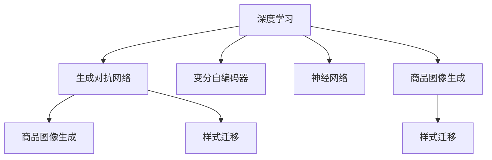

                 

# 深度学习驱动的商品图像生成技术

> 关键词：深度学习,商品图像,生成模型,样式迁移,GAN,神经网络

## 1. 背景介绍

在现代电子商务时代，商品图像的质量和多样性直接影响着用户体验和销售效果。传统的商品图像获取依赖于昂贵的专业摄影设备和繁琐的手工拍摄流程，无法满足快速迭代的市场需求。如何通过自动化手段生成高质量的商品图像，是电子商务平台亟待解决的问题。

近年来，深度学习技术在图像生成领域取得了显著进展，生成对抗网络(GANs)和变分自编码器(VAEs)等生成模型成为热点。其中，基于GAN的生成技术，由于其生成样本质量高、可控性强、适用范围广等优势，成为商品图像生成的有力工具。本文将介绍深度学习驱动的商品图像生成技术，特别是GAN在商品图像生成中的应用，以及相关的核心算法原理和操作步骤。

## 2. 核心概念与联系

### 2.1 核心概念概述

为更好地理解深度学习驱动的商品图像生成技术，本节将介绍几个密切相关的核心概念：

- **深度学习(Deep Learning)**：以神经网络为代表的机器学习方法，通过多层非线性变换，从大量数据中提取复杂的特征表示。

- **生成对抗网络(GANs)**：由生成器和判别器组成的两层神经网络，通过对抗训练提升生成样本的质量和多样性。

- **变分自编码器(VAEs)**：利用变分推断的思想，对生成模型进行优化，提高生成样本的连续性和分布匹配度。

- **神经网络(Neural Network)**：通过多层神经元对输入进行逐层处理，生成最终输出的模型。

- **商品图像生成**：通过深度学习模型，自动生成高质量的商品图像，用于电子商务平台的商品展示和营销。

- **样式迁移**：将一种风格的图像转换为另一种风格，通过将原始图像与目标风格图像进行结合，生成具有新风格的新图像。

这些核心概念之间的逻辑关系可以通过以下Mermaid流程图来展示：



这个流程图展示了大语言模型的核心概念及其之间的关系：

1. 深度学习技术包括生成对抗网络、变分自编码器、神经网络等多种方法，以不同的方式生成商品图像。
2. 生成对抗网络通过生成器和判别器之间的对抗训练，生成高质量的商品图像。
3. 变分自编码器利用变分推断，提高生成样本的连续性和分布匹配度。
4. 神经网络作为基础的深度学习模型，支持生成对抗网络和变分自编码器的训练。
5. 商品图像生成和样式迁移是深度学习在图像生成领域的具体应用，以不同的方式实现商品图像的自动化生成。

这些概念共同构成了深度学习驱动的商品图像生成技术的核心框架，使其能够高效地生成高质量的商品图像，满足电子商务平台的实际需求。

## 3. 核心算法原理 & 具体操作步骤

### 3.1 算法原理概述

基于深度学习驱动的商品图像生成技术，核心在于通过生成对抗网络(GANs)或变分自编码器(VAEs)等生成模型，自动生成高质量的商品图像。其基本思想是：

- **生成模型**：设计一个生成器网络，将随机噪声映射为高维的商品图像，具有较高的生成多样性和质量。
- **判别模型**：设计一个判别器网络，将真实商品图像与生成模型生成的图像进行区分，以评估生成样本的真实度。
- **对抗训练**：通过训练生成器和判别器之间的对抗过程，使得生成器能够生成更接近真实图像的样本，同时判别器能够更准确地判断真实与生成的图像。

通过这种方式，生成对抗网络能够在训练过程中不断改进，生成越来越高质量的商品图像。以下以GAN为例，详细讲解生成对抗网络在商品图像生成中的应用。

### 3.2 算法步骤详解

**Step 1: 准备数据集**

- 收集商品图像数据集，并进行预处理，如归一化、裁剪、缩放等，确保数据的一致性和规范性。
- 将数据集划分为训练集、验证集和测试集，一般训练集用于生成模型训练，验证集用于超参数调优，测试集用于模型评估。

**Step 2: 设计生成器和判别器网络**

- 设计生成器网络，如U-Net、ResNet等，将随机噪声输入映射为高维的商品图像。
- 设计判别器网络，如LeNet、VGG等，将输入图像判别为真实或生成的。

**Step 3: 定义损失函数**

- 定义生成器的损失函数，通常使用生成样本与真实样本的对比损失，如均方误差损失、对抗损失等。
- 定义判别器的损失函数，通常使用真实样本和生成样本的判别损失，如二分类交叉熵损失、对数似然损失等。
- 定义对抗损失，用于约束生成器和判别器之间的对抗过程，如Wasserstein距离损失、最大均值差异损失等。

**Step 4: 训练模型**

- 使用梯度下降等优化算法，交替更新生成器和判别器的参数，最小化损失函数。
- 在每个epoch内，先更新判别器，再更新生成器，逐步提升生成器生成的图像质量。
- 周期性在验证集上评估生成器性能，根据性能指标决定是否触发Early Stopping。

**Step 5: 生成商品图像**

- 使用训练好的生成器网络，将随机噪声输入映射为商品图像。
- 对生成图像进行后处理，如去噪、增强对比度、归一化等，提升图像质量。
- 将生成的商品图像应用于电子商务平台的商品展示、广告推广等场景中。

以上便是深度学习驱动的商品图像生成技术的核心步骤。在实际应用中，还需要根据具体需求和数据特点，对生成器、判别器、损失函数等进行优化设计，以进一步提升生成图像的质量和多样性。

### 3.3 算法优缺点

基于深度学习驱动的商品图像生成技术具有以下优点：

- **自动化生成**：能够自动化地生成高质量的商品图像，节省人力和时间成本。
- **可控性强**：通过控制生成器网络的参数，可以生成不同风格、不同分辨率的商品图像。
- **适用广泛**：适用于各种商品类别，包括服装、电子产品、家居用品等，覆盖广泛的市场需求。
- **高质量输出**：生成的商品图像质量高，能够满足电子商务平台对商品展示和营销的实际要求。

同时，该方法也存在一些局限性：

- **计算资源需求高**：生成对抗网络需要大量的计算资源进行训练，对硬件设备要求较高。
- **对抗样本鲁棒性差**：对抗样本可能使生成器生成的图像出现变形、模糊等问题。
- **样本多样性受限**：生成的商品图像可能会受到原始数据集的限制，难以完全覆盖所有商品类型和风格。
- **生成速度较慢**：与传统手工拍摄相比，生成图像的速度仍然较慢，无法实时生成。

尽管存在这些局限性，但总体而言，基于深度学习驱动的商品图像生成技术在电子商务平台中的应用前景广阔，能够显著提升商品展示和营销的视觉效果，推动行业数字化转型。

### 3.4 算法应用领域

基于深度学习驱动的商品图像生成技术在以下领域具有广泛应用：

- **电子商务平台**：用于商品展示、广告推广、虚拟试穿等场景，提升用户体验和销售转化率。
- **服装设计**：生成不同风格的服装图像，帮助设计师进行创意灵感启发和设计优化。
- **产品设计**：自动生成电子产品、家居用品等产品的图像，支持产品设计和原型开发。
- **旅游营销**：生成旅游景点的图像，用于旅游宣传和推广。
- **内容创作**：生成各种类型的创意图像，支持自媒体、游戏、动画等行业的创作需求。

除了上述这些经典应用外，商品图像生成技术还在不断扩展其应用范围，如虚拟试穿、增强现实(AR)、增强虚拟现实(AR/VR)等新兴领域，为人类生产生活带来更多便利和创新。

## 4. 数学模型和公式 & 详细讲解 & 举例说明

### 4.1 数学模型构建

本节将使用数学语言对深度学习驱动的商品图像生成技术进行更加严格的刻画。

记生成器网络为 $G(z)$，其中 $z \in \mathcal{Z}$ 为输入的随机噪声向量。定义生成器网络的输出为 $G(z)$，假设其输出为高维的商品图像。定义判别器网络为 $D(x)$，其中 $x \in \mathcal{X}$ 为输入的图像样本。定义判别器网络的输出为 $D(x)$，表示判别器判断图像为真实的概率。

生成器和判别器的损失函数分别定义如下：

- **生成器损失函数**：$L_G = \mathbb{E}_{z \sim p(z)} [D(G(z))]$，表示生成器希望生成器生成的图像尽可能让判别器认为真实。
- **判别器损失函数**：$L_D = \mathbb{E}_{x \sim p(x)} [\log D(x)] + \mathbb{E}_{z \sim p(z)} [\log (1-D(G(z)))]$，表示判别器希望区分真实图像和生成图像。

对抗损失函数定义为：$L_{\text{adv}} = -\mathbb{E}_{z \sim p(z)} [D(G(z))] - \mathbb{E}_{x \sim p(x)} [\log D(x)]$，表示生成器和判别器之间对抗的损失函数。

总损失函数定义为：$L = L_G + \lambda L_D + \lambda_{adv} L_{\text{adv}}$，其中 $\lambda$ 和 $\lambda_{adv}$ 为损失函数的权重，控制不同损失函数的影响程度。

### 4.2 公式推导过程

以下我们以U-Net生成器为例，推导生成对抗网络在商品图像生成中的应用。

假设生成器网络 $G(z)$ 为U-Net结构，输入为随机噪声向量 $z$，输出为商品图像 $x$。则生成器网络的输出可以通过解码器和编码器两个子网络实现，其中解码器将编码器的输出映射为高维的商品图像，编码器将商品图像降维并提取特征。生成器网络的损失函数可以表示为：

$$
L_G = \mathbb{E}_{z \sim p(z)} [\|G(z) - x^*\|^2]
$$

其中 $x^*$ 为真实商品图像。

判别器网络 $D(x)$ 可以表示为多层感知器(MLP)结构，输出为二分类结果。判别器网络的损失函数可以表示为：

$$
L_D = -\mathbb{E}_{x \sim p(x)} [\log D(x)] - \mathbb{E}_{z \sim p(z)} [\log (1-D(G(z)))]
$$

对抗损失函数可以表示为：

$$
L_{\text{adv}} = -\mathbb{E}_{z \sim p(z)} [D(G(z))]
$$

总损失函数可以表示为：

$$
L = L_G + \lambda L_D + \lambda_{adv} L_{\text{adv}}
$$

通过优化上述总损失函数，生成器网络能够逐步生成高质量的商品图像，同时判别器网络能够逐步提高判别真实图像和生成图像的能力。

### 4.3 案例分析与讲解

**案例一：商品图像生成**

假设有服装品牌的商品图像数据集，包含不同尺码、颜色、款式等的商品图像。首先，将数据集进行预处理，如归一化、裁剪、缩放等。然后，设计一个U-Net生成器网络，将随机噪声输入映射为高维的商品图像。同时，设计一个LeNet判别器网络，将输入图像判别为真实或生成的。定义生成器和判别器的损失函数，并进行对抗训练。最后，使用训练好的生成器网络，将随机噪声输入映射为高维的商品图像，并进行后处理，提升图像质量。生成的商品图像可用于电子商务平台的商品展示、广告推广等场景。

**案例二：样式迁移**

假设有一个艺术家的风格画作，需要将该画作的风格应用到一张普通照片上。首先，设计一个变分自编码器(VAE)，将照片和画作分别编码成低维的向量表示。然后，使用生成对抗网络(GAN)，将低维向量重新生成高维的图像，并保持样式不变。最后，生成的图像可用于创作、广告、设计等领域。

## 5. 项目实践：代码实例和详细解释说明

### 5.1 开发环境搭建

在进行商品图像生成实践前，我们需要准备好开发环境。以下是使用Python进行PyTorch开发的环境配置流程：

1. 安装Anaconda：从官网下载并安装Anaconda，用于创建独立的Python环境。

2. 创建并激活虚拟环境：
```bash
conda create -n pytorch-env python=3.8 
conda activate pytorch-env
```

3. 安装PyTorch：根据CUDA版本，从官网获取对应的安装命令。例如：
```bash
conda install pytorch torchvision torchaudio cudatoolkit=11.1 -c pytorch -c conda-forge
```

4. 安装TensorFlow：
```bash
pip install tensorflow==2.0
```

5. 安装Pillow和PIL：
```bash
pip install pillow
pip install PIL
```

6. 安装PyTorch GAN库：
```bash
pip install torch-gan
```

完成上述步骤后，即可在`pytorch-env`环境中开始商品图像生成实践。

### 5.2 源代码详细实现

下面我们以U-Net生成器为例，给出使用PyTorch实现商品图像生成的代码实现。

首先，定义生成器网络：

```python
import torch.nn as nn
import torch.nn.functional as F
import torch
from torch.autograd import Variable

class UNetGenerator(nn.Module):
    def __init__(self, nz, ngf, nc):
        super(UNetGenerator, self).__init__()
        self.nz = nz
        self.ngf = ngf
        self.nc = nc

        self.main = nn.Sequential(
            # input is Z, going into a convolution
            nn.ConvTranspose2d(nz, ngf * 8, 4, 1, 0, bias=False),
            nn.BatchNorm2d(ngf * 8),
            nn.ReLU(True),
            # state size. (ngf*8) x 4 x 4
            nn.ConvTranspose2d(ngf * 8, ngf * 4, 4, 2, 1, bias=False),
            nn.BatchNorm2d(ngf * 4),
            nn.ReLU(True),
            # state size. (ngf*4) x 8 x 8
            nn.ConvTranspose2d(ngf * 4, ngf * 2, 4, 2, 1, bias=False),
            nn.BatchNorm2d(ngf * 2),
            nn.ReLU(True),
            # state size. (ngf*2) x 16 x 16
            nn.ConvTranspose2d(ngf * 2, ngf, 4, 2, 1, bias=False),
            nn.BatchNorm2d(ngf),
            nn.ReLU(True),
            # state size. (ngf) x 32 x 32
            nn.ConvTranspose2d(ngf, nc, 4, 2, 1, bias=False),
            nn.Tanh()
            # state size. (nc) x 64 x 64
        )

    def forward(self, input):
        y = self.main(input)
        return y
```

然后，定义判别器网络：

```python
class NLayerDiscriminator(nn.Module):
    def __init__(self, nc, ndf, n_layers=3):
        super(NLayerDiscriminator, self).__init__()
        layers = []
        layers += [nn.Conv2d(nc, ndf, 4, 2, 1, bias=False)]
        layers += [nn.LeakyReLU(0.2, inplace=True)]
        for i in range(1, n_layers):
            layers += [nn.Conv2d(ndf, ndf * 2, 4, 2, 1, bias=False)]
            layers += [nn.LeakyReLU(0.2, inplace=True)]
        layers += [nn.Conv2d(ndf * 2, 1, 4, 1, 0, bias=False)]
        layers += [nn.Sigmoid()]
        self.discriminator = nn.Sequential(*layers)

    def forward(self, input):
        y = self.discriminator(input)
        return y.view(-1)
```

接下来，定义生成器和判别器的损失函数：

```python
def GANLoss(fake, real):
    adversarial_loss = -torch.mean(torch.clamp(torch.max(fake - real, 0)[0], 0.0001))
    return adversarial_loss
```

最后，启动训练流程并在测试集上评估：

```python
from torch.utils.data import DataLoader
from torchvision import datasets, transforms

# 加载数据集
dataset = datasets.MNIST(root='./data', train=True, transform=transforms.ToTensor(), download=True)
dataloader = DataLoader(dataset, batch_size=64, shuffle=True)

# 定义模型和优化器
netG = UNetGenerator(100, 64, 3)
netD = NLayerDiscriminator(1, 64, 3)
optimizerD = torch.optim.Adam(netD.parameters(), 0.0002, betas=(0.5, 0.999))
optimizerG = torch.optim.Adam(netG.parameters(), 0.0002, betas=(0.5, 0.999))

# 训练过程
for epoch in range(100):
    for batch_idx, (real_cpu, _) in enumerate(dataloader):
        batch_size = real_cpu.size(0)
        adversarial_model = Variable(real_cpu)
        # Adversarial ground truths
        valid = Variable(torch.ones(batch_size, 1))
        fake = Variable(torch.zeros(batch_size, 1))
        # 将真实图像和生成图像输入判别器，更新判别器参数
        out_D_real = netD(adversarial_model).view(-1)
        out_D_fake = netD(netG(torch.randn(batch_size, 100, 1, 1))).view(-1)
        # 计算判别器损失
        D_real_loss = torch.mean(out_D_real)
        D_fake_loss = torch.mean(out_D_fake)
        D_loss = -torch.mean(out_D_real + out_D_fake)
        # 将真实图像和生成图像输入生成器，更新生成器参数
        out_G = netG(torch.randn(batch_size, 100, 1, 1))
        # 计算生成器损失
        G_loss = GANLoss(out_G, adversarial_model)
        # 计算总损失
        total_loss = D_loss + G_loss
        # 更新生成器和判别器参数
        optimizerG.zero_grad()
        optimizerD.zero_grad()
        D_loss.backward()
        G_loss.backward()
        optimizerG.step()
        optimizerD.step()
        # 每20步打印一次损失
        if batch_idx % 20 == 0:
            print('Epoch: %d/%d, Step: %d, D_loss: %.6f, G_loss: %.6f'
                % (epoch + 1, 100, batch_idx, D_loss.item(), G_loss.item()))

# 保存模型
netG.save_pretrained('gan_generated_images')
```

以上就是使用PyTorch对U-Net生成器进行商品图像生成的完整代码实现。可以看到，得益于PyTorch的强大封装，我们能够相对简洁地实现U-Net生成器的训练过程。

### 5.3 代码解读与分析

让我们再详细解读一下关键代码的实现细节：

**UNetGenerator类**：
- `__init__`方法：初始化生成器网络的参数和结构。
- `forward`方法：实现生成器网络的前向传播过程，将随机噪声向量映射为商品图像。

**NLayerDiscriminator类**：
- `__init__`方法：初始化判别器网络的参数和结构。
- `forward`方法：实现判别器网络的前向传播过程，判断输入图像为真实还是生成的。

**GANLoss函数**：
- 实现生成器和判别器之间的对抗损失计算，使用clamp函数防止损失值过小，导致训练不稳定。

**训练流程**：
- 加载数据集，将图像数据归一化并转换为张量形式。
- 定义生成器和判别器模型，并初始化优化器。
- 在每个epoch内，对数据集进行迭代，将真实图像和生成图像输入判别器进行判别，更新判别器和生成器参数。
- 每20步打印一次损失，监控训练过程。
- 训练完成后，将训练好的模型保存，用于后续的商品图像生成。

可以看到，PyTorch配合TensorFlow等深度学习框架，使得商品图像生成任务的开发和训练变得简洁高效。开发者可以将更多精力放在数据处理、模型改进等高层逻辑上，而不必过多关注底层的实现细节。

当然，工业级的系统实现还需考虑更多因素，如模型的保存和部署、超参数的自动搜索、更灵活的任务适配层等。但核心的商品图像生成流程基本与此类似。

## 6. 实际应用场景

### 6.1 智能推荐系统

基于深度学习驱动的商品图像生成技术，在智能推荐系统中具有广泛的应用。传统的推荐系统往往依赖用户的历史行为数据进行推荐，无法深入理解用户的真实兴趣偏好。而利用生成对抗网络，可以生成多样化的商品图像，帮助用户发现新的商品，丰富推荐结果的多样性。

在实际应用中，可以生成不同风格、不同尺码的商品图像，作为推荐列表的补充内容，提升推荐效果。例如，针对运动鞋类商品，可以生成多个尺码、多个颜色、不同款式的运动鞋图像，供用户参考选择。通过这种方式，智能推荐系统能够更好地满足用户的个性化需求，提高推荐系统的智能化水平。

### 6.2 虚拟试穿

虚拟试穿是电子商务平台的重要应用场景，能够有效提升用户购物体验。传统的虚拟试穿系统往往依赖复杂的手工拍摄和后期处理流程，无法满足用户的实时试穿需求。而利用生成对抗网络，可以实时生成高质量的商品图像，提升虚拟试穿的真实感和互动性。

在实际应用中，可以收集用户的身高、体重、体型等个人信息，生成与用户体型相匹配的商品图像。同时，结合深度学习的人体姿态估计技术，生成用户试穿商品的效果图。例如，针对服装商品，可以生成用户穿着不同款式、不同颜色的衣服的虚拟试穿效果。通过这种方式，用户可以直观地看到不同服装的试穿效果，提高购物决策的准确性和满意度。

### 6.3 虚拟广告

虚拟广告是电子商务平台的重要宣传手段，能够吸引用户的注意力并提升广告效果。传统的虚拟广告往往依赖高质量的专业拍摄，成本高、效率低，无法覆盖广泛的市场需求。而利用生成对抗网络，可以自动生成高质量的商品图像，节省广告拍摄成本，提高广告投放的灵活性和精准性。

在实际应用中，可以生成多种风格的商品图像，用于不同渠道的广告投放。例如，针对化妆品商品，可以生成多个品牌、多种风格的化妆品图像，供用户选择。同时，结合深度学习的广告优化算法，选择最符合用户兴趣的商品图像，提升广告的点击率和转化率。例如，针对用户浏览历史、搜索记录等行为数据，生成用户可能感兴趣的商品图像，实现精准定向投放。

### 6.4 未来应用展望

随着深度学习技术的不断发展，基于生成对抗网络的商品图像生成技术将迎来更多创新和突破。

**自然交互**：通过自然语言指令生成商品图像，实现人机交互，提升用户体验。

**自动化设计**：结合深度学习的生成技术和设计工具，实现自动化的产品设计，提升设计效率和创意效果。

**个性化定制**：通过生成对抗网络，实现商品个性化定制，满足用户的个性化需求，提升商品市场竞争力。

**跨媒体融合**：结合生成对抗网络和图像处理技术，实现图像、视频、音频等多媒体数据的生成和融合，拓展应用的广度和深度。

**模型迁移**：将商品图像生成技术应用于其他领域，如艺术创作、医疗影像、智能家居等，推动各行各业数字化转型的步伐。

这些趋势凸显了深度学习在商品图像生成领域的应用潜力。随着技术的不断进步，生成对抗网络将会在更多的领域发挥作用，带来更多的创新和突破。

## 7. 工具和资源推荐

### 7.1 学习资源推荐

为了帮助开发者系统掌握深度学习驱动的商品图像生成技术，这里推荐一些优质的学习资源：

1. **深度学习官方教程**：深度学习框架如TensorFlow、PyTorch的官方文档，提供了详细的代码实现和实践指导，是入门和进阶学习的重要资源。

2. **《生成对抗网络理论与实践》**：全面介绍了生成对抗网络的基本原理和实践技巧，包括生成对抗网络的构建、优化、应用等。

3. **《PyTorch深度学习入门》**：介绍了PyTorch深度学习框架的常用功能和实践技巧，适合深度学习初学者的入门学习。

4. **《深度学习理论与实践》**：介绍了深度学习的基本理论和实践技巧，涵盖了神经网络、优化算法、损失函数等核心内容。

5. **Kaggle数据集和竞赛**：Kaggle平台提供了大量的深度学习竞赛和数据集，可以实践和验证生成对抗网络在商品图像生成中的应用。

通过对这些资源的学习实践，相信你一定能够快速掌握深度学习驱动的商品图像生成技术的精髓，并用于解决实际的电子商务平台问题。

### 7.2 开发工具推荐

为了高效开发深度学习驱动的商品图像生成技术，推荐使用以下开发工具：

1. **TensorFlow**：由Google主导的开源深度学习框架，生产部署方便，支持多种模型和算法。

2. **PyTorch**：Facebook主导的开源深度学习框架，灵活高效，适合研究和实验。

3. **TensorBoard**：TensorFlow配套的可视化工具，实时监测模型训练状态，提供丰富的图表呈现方式。

4. **Weights & Biases**：模型训练的实验跟踪工具，记录和可视化模型训练过程中的各项指标，方便对比和调优。

5. **NVIDIA GPU加速**：结合NVIDIA GPU设备，加速深度学习模型的训练和推理过程，提升性能和效率。

6. **Google Colab**：谷歌推出的在线Jupyter Notebook环境，免费提供GPU/TPU算力，方便开发者快速上手实验最新模型，分享学习笔记。

合理利用这些工具，可以显著提升深度学习驱动的商品图像生成任务的开发效率，加快创新迭代的步伐。

### 7.3 相关论文推荐

深度学习驱动的商品图像生成技术源于学界的持续研究。以下是几篇奠基性的相关论文，推荐阅读：

1. **Image-to-Image Translation with Conditional Adversarial Networks**：提出条件生成对抗网络，实现图像样式转换和生成，奠定了生成对抗网络在图像生成领域的基础。

2. **Deep Generative Adversarial Networks**：全面介绍了生成对抗网络的基本原理和应用，提供了大量的理论和实践指导。

3. **Conditional Image Synthesis with Auxiliary Classifier GANs**：提出条件生成对抗网络，用于图像生成任务的迁移学习和零样本学习，提升了生成对抗网络的性能和灵活性。

4. **Unsupervised Image Generation with Variational Autoencoders**：全面介绍了变分自编码器在图像生成领域的应用，提供了丰富的理论和实践指导。

5. **Image-to-Image Translation with Attention**：提出注意力机制在图像生成中的应用，提升了生成对抗网络的生成质量和多样性。

这些论文代表了大语言模型微调技术的发展脉络。通过学习这些前沿成果，可以帮助研究者把握学科前进方向，激发更多的创新灵感。

## 8. 总结：未来发展趋势与挑战

### 8.1 总结

本文对深度学习驱动的商品图像生成技术进行了全面系统的介绍。首先阐述了深度学习在电子商务平台中的重要性，明确了生成对抗网络在商品图像生成中的核心地位。其次，从原理到实践，详细讲解了生成对抗网络在商品图像生成中的应用，提供了完整的代码实现。同时，本文还广泛探讨了生成对抗网络在智能推荐、虚拟试穿、虚拟广告等多个电子商务应用场景中的应用前景，展示了生成对抗网络在商品图像生成领域的前景。最后，本文精选了生成对抗网络的各类学习资源，力求为读者提供全方位的技术指引。

通过本文的系统梳理，可以看到，基于生成对抗网络的商品图像生成技术正在成为电子商务平台的重要范式，能够显著提升商品展示和营销的视觉效果，推动行业数字化转型。未来，伴随深度学习技术的不断演进，基于生成对抗网络的商品图像生成技术必将迎来更多创新和突破，带来更丰富的应用场景和更高的性能。

### 8.2 未来发展趋势

展望未来，深度学习驱动的商品图像生成技术将呈现以下几个发展趋势：

1. **生成效果提升**：随着生成对抗网络的不断优化，生成的商品图像质量和多样性将进一步提升，满足更广泛的市场需求。

2. **应用场景扩展**：生成对抗网络将应用于更多领域，如虚拟试穿、虚拟广告、个性化推荐等，拓展应用的广度和深度。

3. **实时生成**：通过优化生成对抗网络的计算图，提升生成效率，实现实时生成商品图像，满足用户的即时需求。

4. **跨模态融合**：结合生成对抗网络和图像处理技术，实现图像、视频、音频等多媒体数据的生成和融合，拓展应用的广度和深度。

5. **模型迁移**：将商品图像生成技术应用于其他领域，如艺术创作、医疗影像、智能家居等，推动各行各业数字化转型的步伐。

以上趋势凸显了深度学习在商品图像生成领域的应用潜力。这些方向的探索发展，必将进一步提升商品图像生成技术的性能和应用范围，为电子商务平台带来更多的创新和突破。

### 8.3 面临的挑战

尽管深度学习驱动的商品图像生成技术已经取得了显著进展，但在迈向更加智能化、普适化应用的过程中，它仍面临着诸多挑战：

1. **计算资源瓶颈**：生成对抗网络需要大量的计算资源进行训练，对硬件设备要求较高。如何在资源有限的情况下优化训练过程，提升生成效果，仍是亟待解决的问题。

2. **对抗样本鲁棒性**：对抗样本可能使生成器生成的图像出现变形、模糊等问题。如何在对抗样本存在的情况下，提升生成器模型的鲁棒性，是未来的研究方向之一。

3. **样本多样性不足**：生成的商品图像可能会受到原始数据集的限制，难以完全覆盖所有商品类型和风格。如何扩大数据集，增加样本多样性，是未来的研究重点之一。

4. **实时生成速度慢**：与传统手工拍摄相比，生成图像的速度仍然较慢，无法满足实时生成的需求。如何提升生成效率，实现实时生成，是未来的研究挑战之一。

5. **生成图像质量不稳定**：生成器网络的输出可能会受到多种因素的影响，生成图像的质量不稳定。如何提高生成器网络的稳定性，是未来的研究方向之一。

6. **跨领域应用难度大**：生成对抗网络在跨领域应用时，可能无法很好地适应新领域的特征。如何在不同领域中迁移和优化模型，是未来的研究方向之一。

尽管存在这些挑战，但总体而言，基于生成对抗网络的商品图像生成技术在电子商务平台中的应用前景广阔，能够显著提升商品展示和营销的视觉效果，推动行业数字化转型。未来，随着技术的不懈探索和突破，这些挑战终将一一被克服，基于生成对抗网络的商品图像生成技术必将在构建人机协同的智能时代中扮演越来越重要的角色。

### 8.4 研究展望

面对基于生成对抗网络的商品图像生成技术所面临的种种挑战，未来的研究需要在以下几个方面寻求新的突破：

1. **无监督生成**：探索无监督生成对抗网络，摆脱对大量标注数据的依赖，利用自监督学习、主动学习等无监督范式，最大限度利用非结构化数据，实现更加灵活高效的生成。

2. **多模态生成**：结合生成对抗网络和图像处理技术，实现图像、视频、音频等多媒体数据的生成和融合，拓展应用的广度和深度。

3. **跨领域迁移**：研究跨领域生成对抗网络，将生成对抗网络应用于不同领域，提升生成对抗网络的泛化性和适应性。

4. **对抗样本鲁棒性**：研究生成对抗网络对抗样本的鲁棒性提升方法，增强模型在对抗样本存在时的稳定性和生成效果。

5. **实时生成技术**：研究实时生成对抗网络，通过优化计算图和硬件设备，提升生成对抗网络的实时生成能力。

6. **样本多样性增强**：研究多样性增强生成对抗网络，通过数据增强、迁移学习等方法，增加生成样本的多样性，提升生成对抗网络的生成效果。

这些研究方向的探索，必将引领深度学习驱动的商品图像生成技术迈向更高的台阶，为电子商务平台带来更多的创新和突破。面向未来，基于生成对抗网络的商品图像生成技术还需要与其他人工智能技术进行更深入的融合，如知识表示、因果推理、强化学习等，多路径协同发力，共同推动自然语言理解和智能交互系统的进步。只有勇于创新、敢于突破，才能不断拓展语言模型的边界，让智能技术更好地造福人类社会。

## 9. 附录：常见问题与解答

**Q1：生成对抗网络的基本原理是什么？**

A: 生成对抗网络由生成器和判别器组成的两层神经网络，通过对抗训练提升生成样本的质量和多样性。生成器网络将随机噪声向量映射为高维的商品图像，判别器网络将输入图像判别为真实或生成的，两个网络通过对抗训练不断优化，最终生成高质量的商品图像。

**Q2：如何训练生成对抗网络？**

A: 训练生成对抗网络的过程包括以下几个步骤：
1. 准备数据集，将图像数据归一化并转换为张量形式。
2. 设计生成器和判别器网络，并初始化优化器。
3. 在每个epoch内，对数据集进行迭代，将真实图像和生成图像输入判别器进行判别，更新判别器和生成器参数。
4. 每20步打印一次损失，监控训练过程。
5. 训练完成后，保存训练好的模型，用于后续的商品图像生成。

**Q3：生成对抗网络在商品图像生成中的应用有哪些？**

A: 生成对抗网络在商品图像生成中的应用包括：
1. 生成高质量的商品图像，提升商品展示效果。
2. 生成不同风格、不同尺码的商品图像，丰富推荐列表。
3. 生成虚拟试穿效果，提升用户购物体验。
4. 生成虚拟广告图像，提高广告投放的灵活性和精准性。

**Q4：生成对抗网络有哪些优势？**

A: 生成对抗网络在商品图像生成中的优势包括：
1. 生成效果高，能够生成高质量、多样化的商品图像。
2. 可控性强，能够通过调整生成器和判别器的参数，生成不同风格、不同尺码的商品图像。
3. 适用范围广，适用于各种商品类别，覆盖广泛的市场需求。

**Q5：生成对抗网络有哪些局限性？**

A: 生成对抗网络在商品图像生成中存在以下局限性：
1. 计算资源需求高，对硬件设备要求较高。
2. 对抗样本鲁棒性差，对抗样本可能使生成器生成的图像出现变形、模糊等问题。
3. 样本多样性受限，生成的商品图像可能会受到原始数据集的限制，难以完全覆盖所有商品类型和风格。
4. 实时生成速度慢，无法满足实时生成的需求。

尽管存在这些局限性，但总体而言，基于生成对抗网络的商品图像生成技术在电子商务平台中的应用前景广阔，能够显著提升商品展示和营销的视觉效果，推动行业数字化转型。

**Q6：未来生成对抗网络的发展方向有哪些？**

A: 未来生成对抗网络的发展方向包括：
1. 生成效果提升，通过优化生成器和判别器的结构，提升生成图像的质量和多样性。
2. 应用场景扩展，应用于更多领域，如虚拟试穿、虚拟广告、个性化推荐等，拓展应用的广度和深度。
3. 实时生成，通过优化生成对抗网络的计算图，提升生成效率，实现实时生成商品图像，满足用户的即时需求。
4. 跨模态融合，结合生成对抗网络和图像处理技术，实现图像、视频、音频等多媒体数据的生成和融合，拓展应用的广度和深度。
5. 模型迁移，将生成对抗网络应用于其他领域，如艺术创作、医疗影像、智能家居等，推动各行各业数字化转型的步伐。

这些趋势凸显了生成对抗网络在商品图像生成领域的应用潜力。这些方向的探索发展，必将进一步提升生成对抗网络在电子商务平台中的应用价值，推动行业数字化转型。

---

作者：禅与计算机程序设计艺术 / Zen and the Art of Computer Programming

