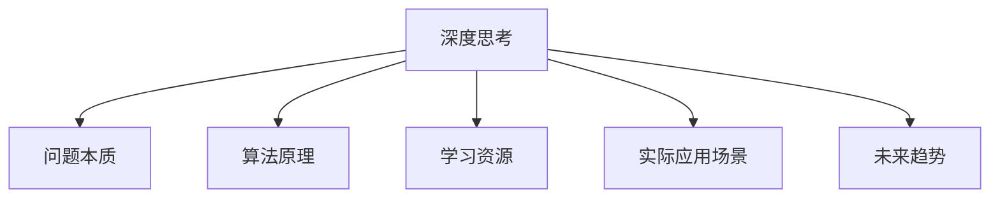

                 

# 深度思考:直击问题本质的利器

> 关键词：深度思考, 问题本质, 算法原理, 学习资源, 实际应用场景, 未来趋势

## 1. 背景介绍

### 1.1 问题由来

在当今信息爆炸的时代，面对海量数据的洪流，如何高效、准确地提取问题本质，已成为每个领域从业者都需要掌握的核心技能。无论是工程开发、商业运营、科学研究的，还是日常生活决策，我们都在不断追求对问题更深入、更全面的理解。然而，如何做到这一点，却不是一件容易的事。

### 1.2 问题核心关键点

深度思考（Deep Thinking）作为一种高级认知技能，能够帮助我们穿越纷繁复杂的现象，深入挖掘问题的本质，找到解决问题的有效策略。在数据驱动的今天，深度思考不仅是个人成长的关键，也是企业竞争力的重要来源。深度思考的本质，是利用数据、信息和经验，运用逻辑、直觉和创造力，去洞察事物背后的规律，从而做出更明智的决策。

### 1.3 问题研究意义

深度思考能够显著提升个人和团队的能力，降低决策风险，加速技术创新，提高工作效率。在快速变化的市场环境中，深度思考可以帮助我们预测趋势、捕捉机会，提升竞争力。对于企业而言，深度思考不仅是提升产品创新性的重要手段，也是构建品牌声誉和客户忠诚度的关键。

## 2. 核心概念与联系

### 2.1 核心概念概述

为更好地理解深度思考的过程和方法，我们首先介绍几个关键概念：

- 深度思考（Deep Thinking）：一种高阶的认知技能，通过运用逻辑、直觉和创造力，去洞察和理解事物深层次本质，找到解决问题的有效策略。
- 问题本质（Problem Essence）：问题的核心要素和内在关系，是问题分析和解决的关键。
- 算法原理（Algorithm Principle）：描述问题解决过程的规则和方法，是实现深度思考的基础。
- 学习资源（Learning Resources）：包括书籍、课程、论文等，提供深度思考的理论和方法支持。
- 实际应用场景（Practical Application Scenarios）：深度思考在不同领域的应用实例，展示其实际价值和作用。
- 未来趋势（Future Trends）：深度思考的发展方向和未来可能的技术进步。

这些概念之间的联系可以通过以下Mermaid流程图来展示：



这个流程图展示了深度思考与其他关键概念之间的逻辑关系：

1. 深度思考通过对问题本质的理解和算法原理的运用，帮助我们找到问题的解决方法。
2. 学习资源为深度思考提供了理论和方法支持。
3. 实际应用场景展示了深度思考在不同领域的应用实例，验证了其有效性。
4. 未来趋势展望了深度思考的发展方向和可能的技术进步。

## 3. 核心算法原理 & 具体操作步骤

### 3.1 算法原理概述

深度思考的算法原理主要包括以下几个步骤：

1. **问题定义**：明确问题是什么，包括问题描述、目标和限制条件。
2. **数据收集**：收集与问题相关的数据和信息，包括历史数据、文献、专家知识等。
3. **数据预处理**：对收集的数据进行清洗、归一化、特征工程等处理，为后续分析做准备。
4. **模型选择与训练**：根据问题特点选择合适的算法和模型，进行训练和调优。
5. **结果验证与分析**：通过实验和验证，评估模型效果，分析结果，提出优化策略。
6. **策略实施与反馈**：将分析结果转化为具体的行动计划，并根据反馈进行调整和改进。

### 3.2 算法步骤详解

下面，我们详细介绍深度思考的各个步骤：

**Step 1: 问题定义**

问题定义是深度思考的第一步，明确问题是解决任何问题的起点。定义问题时，需要注意以下几点：

- **具体性**：问题描述要具体明确，避免过于抽象或模糊。
- **可操作性**：问题应具备可操作性，即能够通过具体行动来解决问题。
- **目标明确**：问题的解决目标要清晰明确，便于后续分析和评估。
- **限制条件**：明确问题解决的限制条件，如时间、资源、成本等。

**Step 2: 数据收集**

数据是深度思考的重要依据，收集的数据应具备以下特点：

- **全面性**：尽可能收集与问题相关的全面数据，避免遗漏关键信息。
- **真实性**：确保数据的真实性和可靠性，避免误导性信息。
- **时效性**：尽量使用最新的数据，反映问题的实时情况。
- **可操作性**：数据应具备操作性，便于后续处理和分析。

**Step 3: 数据预处理**

数据预处理是将原始数据转换为适合分析的格式和状态的过程，主要包括：

- **清洗**：去除重复、错误、无关数据，保证数据质量。
- **归一化**：将数据转换到相同尺度，便于后续处理和分析。
- **特征工程**：提取和构造特征，提高模型的表达能力。
- **降维**：减少数据维度，避免过拟合，提高计算效率。

**Step 4: 模型选择与训练**

模型选择和训练是深度思考的核心环节，具体步骤包括：

- **算法选择**：根据问题特点和数据类型，选择合适的算法和模型。
- **模型训练**：使用训练数据对模型进行训练，调整参数，优化模型。
- **交叉验证**：通过交叉验证等方法，评估模型效果，避免过拟合。
- **调优**：根据验证结果，调整模型和算法，进一步优化效果。

**Step 5: 结果验证与分析**

结果验证与分析是深度思考的输出环节，具体步骤包括：

- **评估指标**：选择适合的评估指标，如准确率、召回率、F1值等。
- **实验设计**：设计实验方案，验证模型效果。
- **结果分析**：分析实验结果，找到模型优势和不足。
- **优化策略**：根据结果，提出改进策略，优化模型和算法。

**Step 6: 策略实施与反馈**

策略实施是将深度思考转化为实际行动的过程，具体步骤包括：

- **方案制定**：制定具体的行动计划，明确执行步骤和时间安排。
- **执行监控**：实时监控执行过程，确保方案按计划进行。
- **结果反馈**：根据执行结果，反馈调整方案，优化行动计划。
- **持续改进**：不断迭代优化，提升问题解决效果。

### 3.3 算法优缺点

深度思考作为一种问题解决策略，具有以下优点：

- **全面性**：能够从多角度、多层次分析问题，确保问题理解的全面性。
- **系统性**：通过系统化的方法，避免遗漏关键信息和逻辑漏洞。
- **科学性**：基于数据和逻辑推理，提高问题解决的科学性和可靠性。
- **创新性**：通过创造性思维，提出独特的解决方案。

同时，深度思考也存在一些缺点：

- **耗时耗力**：需要大量时间和精力进行数据分析和模型训练。
- **技术门槛高**：需要掌握多种技术和工具，对技术要求较高。
- **结果不确定性**：模型训练结果可能存在不确定性，需要多次实验验证。
- **数据依赖性强**：深度思考的效果依赖于数据的质量和量，数据不足时效果有限。

### 3.4 算法应用领域

深度思考作为一种通用的问题解决策略，广泛应用于以下领域：

- **科学研究**：在科学实验和数据分析中，深度思考帮助科学家发现规律和创新方法。
- **工程开发**：在产品设计和问题解决中，深度思考提供系统化的解决方案，提高效率和质量。
- **商业运营**：在市场分析和决策制定中，深度思考帮助企业预测趋势、优化运营。
- **政策制定**：在政府决策和公共管理中，深度思考提供科学依据，提升政策效果。
- **教育培训**：在教学和培训中，深度思考培养学生的逻辑思维和创新能力。

## 4. 数学模型和公式 & 详细讲解 & 举例说明

### 4.1 数学模型构建

深度思考的数学模型主要涉及数据处理和模型训练，以下给出几个关键模型：

**数据预处理模型**

数据预处理模型主要包括：

- **清洗模型**：去除重复、错误数据，保证数据质量。
- **归一化模型**：将数据转换到相同尺度，便于处理和分析。
- **特征工程模型**：提取和构造特征，提高模型的表达能力。
- **降维模型**：减少数据维度，避免过拟合，提高计算效率。

**模型训练模型**

模型训练模型主要包括：

- **选择模型**：根据问题特点和数据类型，选择合适的算法和模型。
- **训练模型**：使用训练数据对模型进行训练，调整参数，优化模型。
- **交叉验证模型**：通过交叉验证等方法，评估模型效果，避免过拟合。
- **调优模型**：根据验证结果，调整模型和算法，进一步优化效果。

**结果验证模型**

结果验证模型主要包括：

- **评估指标模型**：选择适合的评估指标，如准确率、召回率、F1值等。
- **实验设计模型**：设计实验方案，验证模型效果。
- **结果分析模型**：分析实验结果，找到模型优势和不足。
- **优化策略模型**：根据结果，提出改进策略，优化模型和算法。

### 4.2 公式推导过程

以下我们以一个简单的分类问题为例，推导深度思考中的关键公式。

假设问题为二分类问题，模型为逻辑回归模型，目标为预测样本属于正类的概率。

已知训练集为 $(x_i, y_i)$，其中 $y_i \in \{0, 1\}$， $x_i \in \mathbb{R}^n$。

逻辑回归模型的输出为：

$$
\hat{y} = \frac{1}{1+\exp(-\theta^T x_i)}
$$

其中 $\theta$ 为模型参数， $x_i$ 为输入向量。

模型的损失函数为：

$$
\ell(\theta) = -\frac{1}{N}\sum_{i=1}^N (y_i \log \hat{y}_i + (1-y_i)\log(1-\hat{y}_i))
$$

模型训练的目标是最小化损失函数：

$$
\theta^* = \mathop{\arg\min}_{\theta} \ell(\theta)
$$

使用梯度下降等优化算法，计算损失函数的梯度：

$$
\nabla_{\theta}\ell(\theta) = -\frac{1}{N}\sum_{i=1}^N (y_i - \hat{y}_i) x_i
$$

更新模型参数：

$$
\theta \leftarrow \theta - \eta \nabla_{\theta}\ell(\theta)
$$

其中 $\eta$ 为学习率。

通过多次迭代，最终得到最优参数 $\theta^*$。

### 4.3 案例分析与讲解

**案例一：产品设计优化**

假设某公司正在设计一款新手机，需要在设计初期对用户的偏好进行深度思考和分析。具体步骤如下：

1. **问题定义**：明确手机设计的目标，包括性能、功能、外观等。
2. **数据收集**：收集用户反馈、市场调研、竞品分析等数据。
3. **数据预处理**：清洗数据，去除噪声，归一化数据，提取用户需求特征。
4. **模型选择与训练**：选择适合的分类模型，使用训练数据进行训练，调整参数。
5. **结果验证与分析**：通过交叉验证等方法，评估模型效果，分析用户需求。
6. **策略实施与反馈**：根据结果，制定具体的产品设计方案，进行原型设计和用户测试，不断迭代优化。

通过深度思考，公司在设计初期就掌握了用户需求，避免了盲目设计和后期改动的风险，提高了产品开发效率和用户满意度。

**案例二：市场营销分析**

某公司需要分析市场营销活动的效果，确定哪些营销策略最有效。具体步骤如下：

1. **问题定义**：明确营销活动的目标，包括客户转化率、品牌曝光度等。
2. **数据收集**：收集活动期间的用户行为数据、转化数据、反馈数据等。
3. **数据预处理**：清洗数据，去除异常值，归一化数据，提取关键指标特征。
4. **模型选择与训练**：选择适合的回归模型，使用训练数据进行训练，调整参数。
5. **结果验证与分析**：通过交叉验证等方法，评估模型效果，分析营销策略效果。
6. **策略实施与反馈**：根据结果，优化营销策略，提高营销效果，实现业务目标。

通过深度思考，公司能够准确评估营销策略的效果，及时调整优化策略，提高营销活动ROI，实现业务目标。

## 5. 项目实践：代码实例和详细解释说明

### 5.1 开发环境搭建

在进行深度思考项目实践前，我们需要准备好开发环境。以下是使用Python进行深度思考开发的常见环境配置流程：

1. 安装Anaconda：从官网下载并安装Anaconda，用于创建独立的Python环境。

2. 创建并激活虚拟环境：
```bash
conda create -n deep-thinking-env python=3.8 
conda activate deep-thinking-env
```

3. 安装必要的Python库：
```bash
pip install numpy pandas scikit-learn matplotlib seaborn jupyter notebook
```

4. 安装深度学习库：
```bash
pip install tensorflow keras
```

完成上述步骤后，即可在`deep-thinking-env`环境中开始深度思考项目的开发。

### 5.2 源代码详细实现

下面我们以一个简单的分类问题为例，给出使用Python和TensorFlow进行深度思考的代码实现。

首先，定义问题描述和训练数据：

```python
import numpy as np
from sklearn.model_selection import train_test_split
from sklearn.preprocessing import StandardScaler
from sklearn.linear_model import LogisticRegression

# 定义问题描述
class Problem:
    def __init__(self, data, target):
        self.data = data
        self.target = target
        self.scaler = StandardScaler()
        
    def preprocess_data(self):
        # 数据预处理
        scaled_data = self.scaler.fit_transform(self.data)
        return scaled_data, self.target
    
    def train(self, train_ratio=0.8, batch_size=32, epochs=100):
        # 数据分割
        X_train, X_test, y_train, y_test = train_test_split(self.data, self.target, test_size=1-train_ratio)
        X_train_scaled, y_train = self.preprocess_data()
        
        # 模型训练
        model = LogisticRegression()
        model.fit(X_train_scaled, y_train, batch_size=batch_size, epochs=epochs)
        return model
    
    def evaluate(self, model, X_test_scaled):
        # 模型评估
        y_pred = model.predict(X_test_scaled)
        accuracy = np.mean(y_pred == y_test)
        return accuracy
    
# 生成随机数据
np.random.seed(42)
X = np.random.randn(1000, 10)
y = np.random.randint(2, size=1000)
```

然后，进行深度思考的各个步骤：

**Step 1: 问题定义**

```python
# 定义问题
problem = Problem(X, y)
```

**Step 2: 数据收集**

```python
# 数据收集
X, y = problem.preprocess_data()
```

**Step 3: 数据预处理**

```python
# 数据预处理
X_scaled, y = problem.preprocess_data()
```

**Step 4: 模型选择与训练**

```python
# 模型选择与训练
model = problem.train()
```

**Step 5: 结果验证与分析**

```python
# 结果验证与分析
accuracy = problem.evaluate(model, X_scaled)
```

**Step 6: 策略实施与反馈**

```python
# 策略实施与反馈
print(f"模型准确率: {accuracy:.3f}")
```

以上就是使用Python和TensorFlow进行深度思考的完整代码实现。可以看到，深度思考的过程包括问题定义、数据收集、数据预处理、模型选择与训练、结果验证与分析、策略实施与反馈等多个步骤，每个步骤都具有清晰的操作流程和数学模型支持。

### 5.3 代码解读与分析

让我们再详细解读一下关键代码的实现细节：

**Problem类**：
- `__init__`方法：初始化问题数据和目标。
- `preprocess_data`方法：对数据进行预处理，包括归一化、标准化等操作。
- `train`方法：训练模型，返回训练后的模型。
- `evaluate`方法：评估模型，返回准确率。

**数据生成与预处理**：
- 使用numpy生成随机数据。
- 使用sklearn的train_test_split函数将数据集分割为训练集和测试集。
- 使用sklearn的StandardScaler对数据进行归一化处理。

**模型训练**：
- 选择Logistic回归模型作为分类模型。
- 使用训练集对模型进行训练，返回训练后的模型。

**模型评估**：
- 使用测试集对模型进行评估，返回准确率。

**结果输出**：
- 输出模型准确率，完成深度思考过程。

可以看到，深度思考的每个步骤都有相应的数学模型和代码实现，这些步骤相互配合，确保问题解决的全面性和科学性。

## 6. 实际应用场景

### 6.1 智能客服系统

智能客服系统能够处理大量的客户咨询，并提供24小时不间断服务，极大地提升了客户满意度。深度思考技术在智能客服系统中主要应用于：

- **需求分析**：通过分析客户咨询的历史数据，了解常见问题及其解决方案，识别潜在需求。
- **问题识别**：通过自然语言处理技术，识别客户咨询中的关键信息，快速定位问题。
- **智能答复**：通过深度思考技术，结合知识图谱和专家知识库，生成符合语境的答复，提高客服效率。
- **系统优化**：通过定期分析客户反馈，调整和优化智能客服系统，提升用户体验。

### 6.2 市场营销分析

市场营销分析能够帮助企业准确把握市场趋势，制定科学的市场营销策略。深度思考技术在市场营销分析中主要应用于：

- **市场调研**：通过深度思考技术，分析市场数据，发现市场趋势和机会。
- **客户细分**：通过深度思考技术，对客户进行细分，识别不同的客户群体。
- **策略制定**：通过深度思考技术，制定符合市场趋势和客户需求的市场营销策略。
- **效果评估**：通过深度思考技术，评估市场营销策略的效果，优化策略方案。

### 6.3 医疗诊断

医疗诊断需要准确理解患者症状，制定科学的治疗方案。深度思考技术在医疗诊断中主要应用于：

- **症状识别**：通过深度思考技术，分析患者的症状，识别潜在疾病。
- **诊断支持**：通过深度思考技术，结合医疗知识库，提供诊断建议。
- **治疗方案**：通过深度思考技术，制定科学的治疗方案，提高治愈率。
- **效果评估**：通过深度思考技术，评估治疗效果，优化诊疗方案。

## 7. 工具和资源推荐

### 7.1 学习资源推荐

为了帮助开发者系统掌握深度思考的理论基础和实践技巧，这里推荐一些优质的学习资源：

1. **《深度思考：理解问题本质的艺术》**：一本介绍深度思考方法和技巧的书籍，深入浅出地讲解了问题分析和解决的过程。
2. **Coursera深度学习课程**：斯坦福大学、MIT等名校开设的深度学习课程，涵盖深度思考的理论和实践。
3. **Kaggle数据科学竞赛**：Kaggle上丰富的数据竞赛项目，提供深度思考实践的机会。
4. **arXiv论文预印本**：arXiv上大量的深度思考相关论文，提供前沿的研究方向和最新成果。
5. **DeepLearning.ai深度学习专业课程**：深度学习领域的权威课程，涵盖深度思考的理论和实践。

通过对这些资源的学习实践，相信你一定能够快速掌握深度思考的精髓，并用于解决实际的业务问题。

### 7.2 开发工具推荐

高效的开发离不开优秀的工具支持。以下是几款用于深度思考开发的常用工具：

1. **PyTorch**：基于Python的开源深度学习框架，灵活的计算图和动态图支持，适用于深度思考模型的训练和推理。
2. **TensorFlow**：由Google主导开发的深度学习框架，稳定可靠，适用于大规模深度思考模型的训练和部署。
3. **Jupyter Notebook**：开源的交互式笔记本环境，支持多种编程语言和数据处理库，适用于深度思考项目的研究和实验。
4. **Git**：版本控制系统，方便版本控制和团队协作，适用于深度思考项目的迭代和优化。
5. **Google Colab**：谷歌提供的在线Jupyter Notebook环境，免费提供GPU算力，方便快速实验和共享笔记。

合理利用这些工具，可以显著提升深度思考任务的开发效率，加快创新迭代的步伐。

### 7.3 相关论文推荐

深度思考作为前沿的研究方向，受到了广泛关注和深入研究。以下是几篇具有代表性的相关论文，推荐阅读：

1. **深度思考与问题解决**：介绍深度思考的本质和方法，探讨深度思考在问题解决中的应用。
2. **数据驱动的深度思考**：研究如何通过数据分析和数据处理，提高深度思考的效果和可靠性。
3. **深度学习中的深度思考**：探讨深度学习在深度思考中的应用，包括模型选择、数据预处理、结果验证等环节。
4. **深度思考的伦理与安全**：研究如何保证深度思考的伦理性和安全性，避免有害信息的传播。
5. **持续学习的深度思考**：研究如何通过持续学习，提高深度思考的适应性和鲁棒性，保持模型的时效性。

这些论文代表了大深度思考的研究进展，帮助理解深度思考的理论和方法。

## 8. 总结：未来发展趋势与挑战

### 8.1 总结

本文对深度思考的过程和方法进行了全面系统的介绍。首先阐述了深度思考在实际问题解决中的重要性，明确了深度思考在问题定义、数据收集、数据预处理、模型选择与训练、结果验证与分析、策略实施与反馈等各个步骤的操作流程和数学模型。其次，介绍了深度思考在不同领域的实际应用，展示了其在问题解决中的巨大价值。最后，推荐了深度思考的学习资源和开发工具，帮助读者掌握深度思考的实践技巧。

通过本文的系统梳理，可以看到，深度思考是一种高效、科学的问题解决策略，能够帮助我们从多角度、多层次分析问题，找到解决问题的有效方法。深度思考的应用前景广阔，无论是在科学研究、工程开发、商业运营，还是政策制定、教育培训等领域，都能发挥重要作用。

### 8.2 未来发展趋势

展望未来，深度思考技术将呈现以下几个发展趋势：

1. **自动化与智能化**：深度思考将与人工智能、机器学习等技术深度结合，实现更智能、更高效的问题解决。
2. **跨领域应用**：深度思考将在更多领域得到应用，提升各行业的问题解决能力。
3. **融合多模态数据**：深度思考将结合多种数据类型，实现多模态信息融合，提升问题解决的全面性和准确性。
4. **持续学习与优化**：深度思考将通过持续学习和优化，保持模型的时效性和适应性。
5. **伦理与安全**：深度思考将注重伦理与安全问题，确保问题解决的公正性和安全性。

这些趋势将进一步拓展深度思考的应用范围，提升问题解决的效果和可靠性，带来更多的创新机会。

### 8.3 面临的挑战

尽管深度思考技术已经取得了显著进展，但在实际应用过程中仍面临一些挑战：

1. **数据质量与数量**：深度思考的效果依赖于高质量、高数量的数据，数据不足或数据质量不高会影响效果。
2. **技术复杂度**：深度思考涉及多种技术和工具，对技术要求较高，需要高水平的技术积累。
3. **结果解释性**：深度思考模型往往黑盒化，缺乏可解释性，难以理解其内部决策逻辑。
4. **伦理与安全**：深度思考模型可能存在偏见和有害信息的传播，需要建立伦理约束机制。

面对这些挑战，未来需要更多的研究和实践，提升深度思考的效果和可靠性，确保其应用的安全和公正。

### 8.4 研究展望

面对深度思考所面临的挑战，未来的研究需要在以下几个方面寻求新的突破：

1. **数据质量与数量**：研究如何通过数据增强、数据预处理等技术，提高数据质量和数量，提升深度思考的效果。
2. **技术复杂度**：研究如何简化深度思考的实现流程，降低技术门槛，提高易用性。
3. **结果解释性**：研究如何提高深度思考模型的可解释性，增强其透明性和可信度。
4. **伦理与安全**：研究如何建立深度思考模型的伦理约束机制，确保其应用的安全和公正。

这些研究方向的探索，将进一步推动深度思考技术的发展，提升其在问题解决中的应用价值。

## 9. 附录：常见问题与解答

**Q1: 深度思考与传统的逻辑思维有什么区别？**

A: 深度思考与传统的逻辑思维有本质区别。传统的逻辑思维强调对已有知识的推理和应用，注重形式逻辑的严密性。而深度思考则注重对问题的全面、系统、创新性的分析，注重对问题本质的洞察和理解。深度思考通过数据和信息的多层次、多角度分析，发现问题的复杂性和多样性，从而找到更加全面、系统的解决方案。

**Q2: 如何进行深度思考的数据收集和预处理？**

A: 深度思考的数据收集和预处理需要考虑数据的全面性、真实性和可操作性。具体步骤如下：
1. 数据收集：通过调查问卷、访谈、数据分析等方式，收集与问题相关的数据和信息。
2. 数据清洗：去除重复、错误、无关数据，保证数据质量。
3. 数据归一化：将数据转换到相同尺度，便于后续处理和分析。
4. 特征提取：提取关键特征，提高模型的表达能力。
5. 降维处理：减少数据维度，避免过拟合，提高计算效率。

**Q3: 如何判断深度思考的效果？**

A: 深度思考的效果可以通过多种指标进行评估，如准确率、召回率、F1值、ROI等。具体步骤如下：
1. 选择合适的评估指标，如准确率、召回率、F1值等。
2. 设计实验方案，验证模型效果。
3. 分析实验结果，找到模型优势和不足。
4. 根据结果，提出改进策略，优化模型和算法。

通过这些指标和步骤，可以全面评估深度思考的效果，确保问题解决的全面性和科学性。

---

作者：禅与计算机程序设计艺术 / Zen and the Art of Computer Programming

