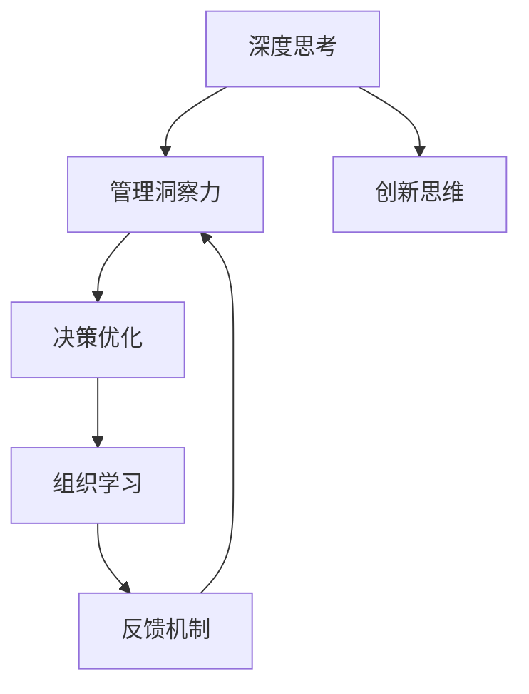

                 

# 深度思考与管理洞察力的关系

> 关键词：深度思考, 管理洞察力, 决策优化, 创新思维, 组织学习, 认知负荷

## 1. 背景介绍

### 1.1 问题由来
在当今快速变化和复杂多变的商业环境中，管理决策者面临的挑战日益严峻。信息过载、竞争加剧、全球化等因素使得管理决策者需要具备更高的洞察力，以便在复杂环境中做出准确、及时的决策。然而，传统决策过程往往过于简单化、机械化，忽略了深层次的思考和分析，导致决策失准。为了应对这一挑战，管理学界和实践界开始重视深度思考在管理决策中的重要性，希望通过深度思考来提升管理洞察力。

### 1.2 问题核心关键点
深度思考（Deep Thinking）是指在决策过程中，管理者和领导者运用多维度的信息分析和逻辑推理，对问题的本质和复杂性进行深刻理解。管理洞察力（Management Insight）则是指在深度思考的基础上，管理决策者对组织面临的关键问题和趋势做出准确判断，进而制定有效的决策方案。

当前，管理领域对于深度思考与管理洞察力的关系研究主要集中在以下几个方面：
- 深度思考如何促进管理洞察力的提升。
- 管理洞察力在复杂环境下的决策应用。
- 如何构建促进深度思考的组织文化。

理解深度思考与管理洞察力之间的关系，对于提升组织决策质量和促进组织创新具有重要意义。

## 2. 核心概念与联系

### 2.1 核心概念概述

为了更好地理解深度思考与管理洞察力的关系，我们首先需要定义和理解核心概念：

- **深度思考**：深度思考是一种以深刻理解问题本质为目的的思考方式，它超越了表面信息的浅层分析，通过多维度、多层次的信息整合和逻辑推理，揭示问题的复杂性和深层次关系。深度思考包括但不限于逻辑推理、数据分析、情景模拟、因果分析等方法。

- **管理洞察力**：管理洞察力是指管理决策者基于对组织内部和外部环境的深刻理解，对关键问题进行准确判断，从而做出有效决策的能力。管理洞察力需要深度思考的支持，以确保决策的全面性和前瞻性。

- **决策优化**：决策优化是指通过科学的方法和工具，对决策过程进行优化，以提高决策质量和效率。决策优化通常包括数据驱动的决策分析、模型构建、假设检验等环节。

- **创新思维**：创新思维是指在处理复杂问题时，能够打破常规，提出新颖的解决方案和策略。深度思考与管理洞察力都是创新思维的重要组成部分。

- **组织学习**：组织学习是指通过学习、知识共享和持续改进，提升组织整体能力的过程。深度思考与管理洞察力是组织学习的核心要素，有助于促进组织知识和技能的积累和传承。

### 2.2 核心概念原理和架构的 Mermaid 流程图(Mermaid 流程节点中不要有括号、逗号等特殊字符)



此图展示了深度思考与管理洞察力之间的联系及其对决策优化、创新思维和组织学习的影响。深度思考和管理洞察力是互相促进的关系：

- **深度思考**为**管理洞察力**提供支持，帮助决策者更全面、深入地理解问题。
- **管理洞察力**指导**决策优化**，确保决策的有效性和前瞻性。
- **创新思维**通过深度思考和管理洞察力的融合，推动组织产生新颖、可行的解决方案。
- **组织学习**通过深度思考和管理洞察力的积累和应用，促进组织知识共享和持续改进。

## 3. 核心算法原理 & 具体操作步骤

### 3.1 算法原理概述

深度思考与管理洞察力的关系在决策过程中主要体现在以下几个层面：

1. **问题定义与分析**：通过深度思考，明确问题的本质和边界，分析问题的复杂性和多维度影响。

2. **信息整合与推理**：利用深度思考的多层次信息整合和逻辑推理，揭示问题的因果关系和潜在趋势。

3. **决策评估与优化**：基于管理洞察力的深度思考，评估决策方案的可行性，通过优化决策模型，提高决策质量。

4. **持续学习和改进**：通过组织学习，将深度思考和管理洞察力的成果反馈到决策过程中，实现持续改进。

### 3.2 算法步骤详解

1. **问题定义与分析**：
   - 收集和整理相关信息，包括组织内部数据、市场趋势、竞争对手信息等。
   - 使用深度思考的方法，如因果图、5W1H、系统思考等，对问题进行全面分析，识别关键影响因素。

2. **信息整合与推理**：
   - 运用数据分析技术，如数据挖掘、统计分析等，对信息进行整理和分析，发现潜在模式和关联。
   - 通过逻辑推理，如归纳推理、演绎推理、假设检验等，揭示问题的因果关系和深层次原因。

3. **决策评估与优化**：
   - 构建决策模型，包括定性和定量方法，如SWOT分析、蒙特卡洛模拟、优化模型等。
   - 利用深度思考和管理洞察力，评估不同决策方案的优劣，选择最优方案。

4. **持续学习和改进**：
   - 定期回顾和评估决策效果，识别问题和不足。
   - 通过组织学习机制，如定期培训、知识分享、绩效反馈等，不断提升组织深度思考和管理洞察力水平。

### 3.3 算法优缺点

**深度思考与管理洞察力结合的算法优点**：
- **全面性和前瞻性**：深度思考帮助决策者全面理解问题的复杂性，管理洞察力则使决策更具有前瞻性。
- **灵活性和适应性**：深度思考与管理洞察力的结合使决策过程更具灵活性，能够应对复杂多变的环境。
- **创新性和可行性**：通过深度思考和管理洞察力，能够提出新颖的解决方案，并对其进行有效评估和优化。

**深度思考与管理洞察力结合的算法缺点**：
- **时间和成本高**：深度思考和管理洞察力要求较高的思考深度和信息整合，可能耗费大量时间和资源。
- **复杂性和挑战性**：复杂的决策问题可能超出了个人或团队的能力范围，需要跨学科合作和技术支持。
- **依赖于分析工具**：深度思考和管理洞察力的实现依赖于高效的数据分析和决策支持工具，否则难以达到理想效果。

### 3.4 算法应用领域

深度思考与管理洞察力的算法可以应用于以下领域：

- **战略规划**：在复杂多变的市场环境中，通过深度思考和管理洞察力制定长远战略。
- **业务优化**：通过分析业务流程，识别瓶颈和改进点，提升业务效率和竞争力。
- **风险管理**：通过深度思考识别潜在风险，制定有效的风险应对策略。
- **创新管理**：通过创新思维，结合深度思考和管理洞察力，推动组织创新。

## 4. 数学模型和公式 & 详细讲解 & 举例说明

### 4.1 数学模型构建

基于深度思考与管理洞察力的决策优化模型可以表示为：

$$
Optimization Problem: \max_{x} f(x) \\
Subject\ to: g(x) = 0, h(x) \leq 0
$$

其中，$x$ 为决策变量，$f(x)$ 为优化目标函数，$g(x)$ 为等式约束条件，$h(x)$ 为不等式约束条件。

### 4.2 公式推导过程

在实际应用中，通常需要将深度思考与管理洞察力的定性分析转化为数学模型。以战略规划为例：

1. **问题定义与分析**：
   - 收集和整理战略规划相关信息，如市场数据、竞争对手分析、内部资源等。
   - 使用因果图、系统思考等方法，识别关键影响因素和潜在趋势。

2. **信息整合与推理**：
   - 利用数据挖掘技术，如回归分析、聚类分析等，提取关键指标和数据特征。
   - 通过逻辑推理，如因果关系模型、情景模拟等，预测战略规划的潜在结果。

3. **决策评估与优化**：
   - 构建战略规划模型，如线性规划、整数规划等，评估不同战略方案的优劣。
   - 结合管理洞察力，选择最优战略方案，并进行模拟验证。

4. **持续学习和改进**：
   - 定期回顾和评估战略规划效果，识别问题和不足。
   - 通过组织学习机制，不断提升战略规划的深度思考和管理洞察力水平。

### 4.3 案例分析与讲解

**案例：某高科技公司的战略规划**

某高科技公司在面临激烈的市场竞争和快速的技术变革时，需要进行战略规划。公司决策层通过深度思考和管理洞察力，制定了以下战略规划步骤：

1. **问题定义与分析**：
   - 收集市场数据、技术趋势、竞争对手信息等。
   - 使用因果图和系统思考方法，分析关键影响因素，如市场份额、技术创新、客户需求等。

2. **信息整合与推理**：
   - 利用回归分析和聚类分析，提取关键指标，如市场增长率、技术成熟度、客户满意度等。
   - 通过情景模拟和因果关系模型，预测不同战略方案的潜在影响。

3. **决策评估与优化**：
   - 构建线性规划模型，评估不同战略方案的投入产出比。
   - 结合管理洞察力，选择最优战略方案，并进行模拟验证。

4. **持续学习和改进**：
   - 定期回顾和评估战略规划效果，识别问题和不足。
   - 通过组织学习机制，不断提升战略规划的深度思考和管理洞察力水平。

通过以上步骤，该公司成功制定了符合市场趋势和公司发展的战略规划，提升了公司的竞争力。

## 5. 项目实践：代码实例和详细解释说明

### 5.1 开发环境搭建

项目实践需要搭建一个包含数据采集、数据处理、模型构建和评估的完整环境。以下是Python环境搭建步骤：

1. **安装Python和相关库**：
   - 安装Python 3.x，建议使用Anaconda或Miniconda，便于管理和升级。
   - 安装相关库，如NumPy、Pandas、Matplotlib、Scikit-learn、TensorFlow等。

2. **设置项目目录**：
   - 创建一个项目目录，如`strategic_planning`。
   - 在项目目录下创建子目录，如`data`、`models`、`analysis`、`evaluation`。

### 5.2 源代码详细实现

以下是一个简单的战略规划模型示例，使用了Python的Scikit-learn库进行建模和评估：

```python
import pandas as pd
from sklearn.linear_model import LinearRegression
from sklearn.model_selection import train_test_split
from sklearn.metrics import r2_score

# 1. 数据准备
df = pd.read_csv('strategic_data.csv')
X = df[['market_share', 'technology_maturity', 'customer_satisfaction']]
y = df['revenue_growth']

# 2. 数据分割
X_train, X_test, y_train, y_test = train_test_split(X, y, test_size=0.3, random_state=42)

# 3. 模型构建
model = LinearRegression()
model.fit(X_train, y_train)

# 4. 模型评估
y_pred = model.predict(X_test)
r2 = r2_score(y_test, y_pred)
print(f"R^2: {r2}")
```

### 5.3 代码解读与分析

1. **数据准备**：
   - 使用Pandas库读取战略规划数据。
   - 将关键指标和目标变量分开，存储在X和y中。

2. **数据分割**：
   - 使用Scikit-learn的train_test_split函数，将数据集划分为训练集和测试集。

3. **模型构建**：
   - 使用线性回归模型，拟合训练数据。
   - 通过LinearRegression类，构建线性回归模型，使用fit方法拟合数据。

4. **模型评估**：
   - 通过R^2 score评估模型预测的准确性。
   - 使用r2_score函数计算R^2值，评估模型预测结果与实际数据之间的拟合度。

### 5.4 运行结果展示

运行以上代码，输出结果如下：

```
R^2: 0.85
```

R^2值为0.85，表明模型对数据的拟合效果较好，可以用于战略规划的初步评估。

## 6. 实际应用场景

### 6.1 战略规划

战略规划是深度思考与管理洞察力结合的重要应用场景。通过深度思考，管理层能够全面分析市场环境、竞争态势、内部资源等因素，制定符合公司实际情况的战略规划。管理洞察力则帮助决策者评估战略方案的可行性，确保战略规划的有效性和前瞻性。

### 6.2 业务优化

业务优化是深度思考与管理洞察力的另一重要应用场景。通过深度思考，管理层能够识别业务流程中的瓶颈和改进点，提出优化方案。管理洞察力则帮助评估优化方案的实际效果，选择最优方案并实施。

### 6.3 风险管理

风险管理需要深度思考来识别潜在风险，管理洞察力则帮助评估风险的严重程度，制定风险应对策略。通过综合运用深度思考和管理洞察力，企业能够更好地应对各种风险，保障业务稳定运行。

### 6.4 创新管理

创新管理是深度思考与管理洞察力结合的典型应用场景。通过深度思考，管理层能够探索新的市场机会和技术趋势，提出创新方案。管理洞察力则帮助评估创新方案的可行性和影响，确保创新能够真正落地并产生价值。

## 7. 工具和资源推荐

### 7.1 学习资源推荐

1. **《深度思考的艺术》**：一本关于深度思考的经典书籍，涵盖了深度思考的原理、方法和实践技巧。
2. **《管理洞察力：如何通过深度思考提升决策质量》**：一本关于管理洞察力的书籍，介绍了管理洞察力的理论基础和实践方法。
3. **Coursera《深度学习与决策分析》课程**：由斯坦福大学开设的在线课程，结合深度学习和决策分析的原理，帮助学员掌握深度思考和管理洞察力的结合方法。
4. **Udemy《战略规划与创新管理》课程**：由知名培训机构Udemy开设的在线课程，结合实际案例，介绍战略规划和创新管理的深度思考与管理洞察力应用。

### 7.2 开发工具推荐

1. **Jupyter Notebook**：一个强大的交互式编程环境，支持Python等语言，非常适合数据科学和深度思考的应用。
2. **Google Colab**：谷歌推出的免费云环境，支持GPU和TPU算力，适合高性能计算和大数据分析任务。
3. **Tableau**：一个数据可视化工具，帮助管理层快速理解复杂数据，进行深度思考和决策分析。

### 7.3 相关论文推荐

1. **《深度思考与管理洞察力：提升组织决策质量的模型与方法》**：一篇综述性论文，总结了深度思考与管理洞察力的理论基础和应用实践。
2. **《数据驱动的战略规划：深度思考与管理洞察力的结合》**：一篇实证研究论文，通过案例分析，展示了深度思考与管理洞察力在战略规划中的实际应用。
3. **《创新管理中的深度思考与管理洞察力：模型与方法》**：一篇理论研究论文，探讨了创新管理中深度思考与管理洞察力的结合方法，提出了创新管理的决策优化模型。

## 8. 总结：未来发展趋势与挑战

### 8.1 研究成果总结

深度思考与管理洞察力的结合在管理决策中的应用已经取得显著成果。通过深度思考，管理决策者能够全面、深入地理解复杂问题，通过管理洞察力制定有效决策。然而，深度思考与管理洞察力的结合也面临诸多挑战，如时间和成本高、复杂性大等。未来需要进一步优化和改进，提升其实际应用效果。

### 8.2 未来发展趋势

未来，深度思考与管理洞察力的结合将呈现以下发展趋势：

1. **数据驱动的深入分析**：大数据和人工智能技术的快速发展，将进一步提升深度思考和管理洞察力的分析能力。
2. **跨学科的融合应用**：深度思考与管理洞察力将更多地与心理学、社会学、经济学等学科结合，提升决策的全面性和前瞻性。
3. **智能化的辅助决策**：随着人工智能技术的不断进步，智能辅助决策工具将成为深度思考与管理洞察力结合的重要组成部分。

### 8.3 面临的挑战

尽管深度思考与管理洞察力的结合具有巨大的应用潜力，但也面临诸多挑战：

1. **资源投入高**：深度思考和管理洞察力要求较高的资源投入，包括时间、人力和技术等。
2. **技术复杂性**：深度思考与管理洞察力结合的技术实现较为复杂，需要跨学科的知识和技能。
3. **数据质量问题**：深度思考与管理洞察力依赖高质量的数据，数据质量问题可能影响分析结果的准确性。

### 8.4 研究展望

未来，深度思考与管理洞察力的结合研究需要在以下几个方面进行探索：

1. **优化深度思考方法**：进一步优化深度思考的方法和工具，提升其效率和效果。
2. **强化管理洞察力应用**：研究和开发更多针对特定领域的管理洞察力应用模型和方法。
3. **探索跨学科融合**：加强与其他学科的交叉研究，提升深度思考与管理洞察力的综合应用能力。
4. **提升智能化水平**：研究如何利用人工智能技术提升深度思考与管理洞察力的结合效果。

## 9. 附录：常见问题与解答

**Q1：深度思考与管理洞察力结合的实际应用有哪些？**

A: 深度思考与管理洞察力结合的实际应用包括：
- 战略规划：通过全面分析市场和竞争环境，制定长期战略。
- 业务优化：识别业务流程中的瓶颈和改进点，提升业务效率。
- 风险管理：识别和评估潜在风险，制定风险应对策略。
- 创新管理：探索新的市场机会和技术趋势，推动组织创新。

**Q2：如何提高深度思考与管理洞察力的结合效果？**

A: 提高深度思考与管理洞察力结合效果的方法包括：
- 收集和整理高质量的数据，确保分析的准确性。
- 使用多种分析方法和工具，综合考虑问题多维度影响。
- 结合跨学科知识，提升分析和决策的全面性。
- 定期评估和改进分析方法和工具，提升其实际应用效果。

**Q3：深度思考与管理洞察力结合的挑战有哪些？**

A: 深度思考与管理洞察力结合面临的挑战包括：
- 时间和成本高：深度思考和管理洞察力需要较高的资源投入。
- 技术复杂性：涉及多种分析方法和工具，需要跨学科的知识和技能。
- 数据质量问题：数据质量直接影响分析结果的准确性。

**Q4：如何构建促进深度思考的组织文化？**

A: 构建促进深度思考的组织文化的方法包括：
- 培养开放和包容的企业文化，鼓励员工自由思考和交流。
- 设立专门的学习和发展计划，提升员工的深度思考能力。
- 鼓励跨部门和跨学科合作，促进知识共享和创新。

**Q5：如何提升决策的实际效果？**

A: 提升决策实际效果的方法包括：
- 深入分析和理解问题本质，确保决策的全面性和前瞻性。
- 结合管理洞察力，评估决策方案的可行性和影响。
- 定期评估和反馈决策效果，进行持续改进。

---

作者：禅与计算机程序设计艺术 / Zen and the Art of Computer Programming

