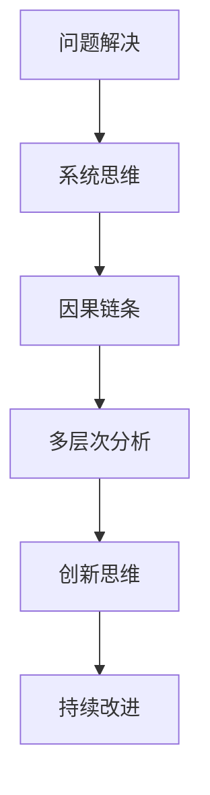

                 

# 深度思考的威力:洞悉问题本质

> 关键词：深度思考, 问题解决, 问题分析, 系统思维, 创新, 技术复杂性, 系统工程

## 1. 背景介绍

### 1.1 问题由来
在当今复杂多变的技术环境中，软件开发和产品设计面临着前所未有的挑战。技术革新日新月异，用户需求日益多样化，市场竞争激烈，这些因素都要求我们以更深入、更全面的视角来审视问题和设计解决方案。然而，在实践中，我们常常发现很多问题看似简单，但背后往往隐藏着复杂的系统性和多层次的因果关系。这就需要我们运用深度思考（Deep Thinking）的方法，以系统思维（System Thinking）为基础，深入挖掘问题的本质，从而找到高效、可行的解决方案。

### 1.2 问题核心关键点
深度思考的核心关键点包括但不限于：
- **系统性视角**：从系统的整体视角审视问题，考虑各组件之间的相互作用和影响。
- **因果链条**：深入分析问题背后的因果链条，找到根本原因。
- **多层次分析**：考虑问题的多层次维度，如需求、技术、市场等。
- **创新思维**：鼓励创造性思维，从不同角度提出创新的解决方案。
- **持续改进**：将思考过程和结果内化为团队的持续改进机制。

本文将深入探讨这些关键点，以期为读者提供系统、全面的问题解决思路和方法论，助力其提升技术复杂问题的解决能力。

## 2. 核心概念与联系

### 2.1 核心概念概述

为了更好地理解深度思考在问题解决中的作用，我们首先介绍几个核心概念及其相互联系：

- **问题解决**（Problem Solving）：在明确问题目标的前提下，通过分析、评估、决策等步骤，找到可行的解决方案的过程。
- **系统思维**（System Thinking）：一种看待复杂系统的视角，强调系统整体与组成部分之间的动态关系。
- **因果链条**（Causal Chain）：问题现象与其根本原因之间的链式关系。
- **多层次分析**（Multi-level Analysis）：从不同层次（如需求、技术、市场等）全面分析问题。
- **创新思维**（Creative Thinking）：鼓励从不同角度、采用非传统方式提出解决方案。
- **持续改进**（Continuous Improvement）：将问题解决过程中学到的知识和经验转化为持续的改进机制。

这些概念共同构成了深度思考的基础框架，帮助我们系统地理解和解决技术复杂性问题。

### 2.2 核心概念原理和架构的 Mermaid 流程图



这个流程图展示了问题解决的过程从系统思维到创新思维，再到持续改进的循环迭代，每一环节都对问题的深入理解和有效解决起着关键作用。

## 3. 核心算法原理 & 具体操作步骤

### 3.1 算法原理概述

深度思考的核心算法原理主要基于系统思维和多层次分析，通过构建系统的因果链条，逐步深入问题本质，从而找到最优的解决方案。其操作步骤如下：

1. **定义问题**：明确问题目标和范围，理解问题的核心需求。
2. **系统建模**：从整体视角出发，构建系统的多层次模型，分析各组成部分之间的相互关系。
3. **因果分析**：深入挖掘问题的因果链条，找到问题的根本原因。
4. **多层次分析**：从需求、技术、市场等多个层次全面评估问题。
5. **创新解决方案**：基于系统模型和因果分析，提出创新的解决方案。
6. **持续改进**：将问题解决过程中学到的知识和经验转化为持续的改进机制，优化解决方案。

### 3.2 算法步骤详解

以下我们将详细介绍每个操作步骤的具体内容和方法：

**Step 1: 定义问题**
- 明确问题目标和范围，确保问题定义清晰、具体。
- 理解问题的核心需求，包括用户需求、业务需求、技术需求等。

**Step 2: 系统建模**
- 从整体视角出发，构建系统的多层次模型。可以使用UML图、实体关系图等工具辅助建模。
- 分析各组成部分之间的相互关系，包括输入输出、控制流、数据流等。

**Step 3: 因果分析**
- 通过假设验证、溯源分析等方法，深入挖掘问题的因果链条。
- 利用因果图、鱼骨图等工具辅助分析，明确问题现象与根本原因之间的链式关系。

**Step 4: 多层次分析**
- 从需求、技术、市场等多个层次全面评估问题，确保解决方案的全面性和可行性。
- 使用层次分析法（AHP）、决策树等工具辅助多层次分析。

**Step 5: 创新解决方案**
- 基于系统模型和因果分析，提出创新的解决方案。可以使用头脑风暴、设计思维等方法激发创新。
- 对提出的解决方案进行评估和优化，确保其可行性和有效性。

**Step 6: 持续改进**
- 将问题解决过程中学到的知识和经验转化为持续的改进机制，定期评估和优化解决方案。
- 引入敏捷开发、迭代改进等方法，确保解决方案的持续优化和适应性。

### 3.3 算法优缺点

深度思考方法在问题解决中具有以下优点：
1. **系统性视角**：从整体视角审视问题，全面考虑各组件之间的相互作用和影响。
2. **深入挖掘问题本质**：通过因果分析和多层次分析，深入挖掘问题的根本原因，找到最优解决方案。
3. **创新思维**：鼓励从不同角度、采用非传统方式提出解决方案，提高问题解决的创新性。
4. **持续改进**：将问题解决过程中学到的知识和经验转化为持续的改进机制，确保解决方案的长期有效性。

但深度思考方法也存在以下缺点：
1. **复杂度较高**：需要构建系统的多层次模型，分析各组件之间的相互关系，过程较为复杂。
2. **时间和资源消耗较大**：深度思考通常需要较长时间和大量资源投入，特别是在多层次分析阶段。
3. **对分析工具的依赖性**：需要借助各种分析工具，如UML图、因果图、鱼骨图等，对工具的使用要求较高。

### 3.4 算法应用领域

深度思考方法在技术复杂问题的解决中有着广泛的应用，尤其是在以下领域：

1. **软件开发**：在软件架构设计、需求分析、系统维护等方面，深度思考方法可以提升系统的可维护性和可扩展性。
2. **产品设计**：在用户需求分析、产品功能设计、用户体验优化等方面，深度思考方法可以提升产品的市场竞争力和用户满意度。
3. **系统运维**：在系统故障诊断、性能优化、应急响应等方面，深度思考方法可以提高系统的稳定性和可靠性。
4. **项目管理**：在项目规划、进度管理、团队协作等方面，深度思考方法可以提高项目的成功率和效率。
5. **商业战略**：在市场分析、竞争策略、资源配置等方面，深度思考方法可以帮助企业制定更加科学合理的战略决策。

## 4. 数学模型和公式 & 详细讲解 & 举例说明

### 4.1 数学模型构建

在深度思考中，我们可以使用数学模型来辅助系统建模和因果分析。例如，可以使用层次分析法（AHP）对多层次问题进行分析。以下是一个简单的AHP模型示例：

设问题的各个层次分别为A层、B层和C层，其中A层为目标层，B层为子目标层，C层为措施层。层次结构如下：

```
A
├── B1
│   ├── C11
│   ├── C12
│   └── C13
└── B2
    ├── C21
    └── C22
```

其中，B1和B2为子目标层，C11至C22为措施层。

### 4.2 公式推导过程

以AHP方法为例，其核心公式为判断矩阵的求解。设C11至C22的权重分别为$w_{11}, w_{12}, w_{13}, w_{21}, w_{22}$，则判断矩阵$W$可以表示为：

$$
W = \begin{bmatrix}
    1 & w_{11} & w_{12} & w_{13} \\
    w_{21} & 1 & w_{22} & w_{23} \\
    w_{31} & w_{32} & 1 & w_{33} \\
    w_{41} & w_{42} & w_{43} & 1 \\
\end{bmatrix}
$$

求解判断矩阵的特征向量$V$，即可得到各个层次的权重。公式如下：

$$
V = W \cdot V
$$

其中，$V$为特征向量，$W$为判断矩阵。

### 4.3 案例分析与讲解

**案例：软件开发中的系统架构设计**

假设我们需要设计一个电商平台的后端系统架构。首先，我们需要定义问题目标和范围，明确电商平台的业务需求和技术需求。然后，我们可以从整体视角出发，构建系统的多层次模型，包括订单管理、用户管理、库存管理等子系统。接着，通过因果分析和多层次分析，我们可以找到系统的瓶颈和关键路径，从而提出创新的解决方案，如引入缓存机制、优化数据库索引等。最后，我们将问题解决过程中学到的知识和经验转化为持续的改进机制，定期评估和优化系统架构，确保其长期有效性和可扩展性。

## 5. 项目实践：代码实例和详细解释说明

### 5.1 开发环境搭建

在进行项目实践前，我们需要准备好开发环境。以下是使用Python进行PyTorch开发的环境配置流程：

1. 安装Anaconda：从官网下载并安装Anaconda，用于创建独立的Python环境。

2. 创建并激活虚拟环境：
```bash
conda create -n pytorch-env python=3.8 
conda activate pytorch-env
```

3. 安装PyTorch：根据CUDA版本，从官网获取对应的安装命令。例如：
```bash
conda install pytorch torchvision torchaudio cudatoolkit=11.1 -c pytorch -c conda-forge
```

4. 安装Transformers库：
```bash
pip install transformers
```

5. 安装各类工具包：
```bash
pip install numpy pandas scikit-learn matplotlib tqdm jupyter notebook ipython
```

完成上述步骤后，即可在`pytorch-env`环境中开始项目实践。

### 5.2 源代码详细实现

以下是一个简单的项目实践示例，用于说明如何使用深度思考方法解决技术复杂问题。

**项目：电商平台系统架构设计**

**问题定义**：电商平台系统架构设计

**Step 1: 定义问题**
- 明确问题目标和范围：电商平台系统架构设计
- 理解核心需求：提升系统的可扩展性和性能

**Step 2: 系统建模**
- 构建系统的多层次模型，如图：
```
Order Management
├── User Management
│   ├── Authorization
│   ├── Profile
│   └── Session
└── Inventory Management
    ├── Stock
    ├── Order
    └── Payment
```

**Step 3: 因果分析**
- 通过溯源分析，找到系统瓶颈：数据库负载过高，缓存机制缺失
- 利用因果图工具辅助分析，如图：
```
数据库负载过高 --> 缓存机制缺失 --> 系统性能瓶颈
```

**Step 4: 多层次分析**
- 从需求、技术、市场等多个层次全面评估问题：
  - 需求层次：电商平台的交易量预测、库存管理需求
  - 技术层次：数据库性能优化、缓存机制引入
  - 市场层次：竞争对手的架构设计

**Step 5: 创新解决方案**
- 基于系统模型和因果分析，提出创新的解决方案：
  - 引入Redis缓存机制，优化数据库性能
  - 设计微服务架构，提升系统的可扩展性
  - 引入负载均衡和自动扩缩容机制，提高系统的可靠性

**Step 6: 持续改进**
- 将问题解决过程中学到的知识和经验转化为持续的改进机制：
  - 定期评估系统性能，优化缓存机制和数据库索引
  - 引入监控告警机制，实时监测系统状态

### 5.3 代码解读与分析

以下是一些关键代码的实现和解读：

**Step 2: 系统建模**

```python
class Order:
    def __init__(self, id, status):
        self.id = id
        self.status = status

class Inventory:
    def __init__(self, id, stock):
        self.id = id
        self.stock = stock

class User:
    def __init__(self, id, name):
        self.id = id
        self.name = name

class Authorization:
    def __init__(self, id, level):
        self.id = id
        self.level = level

class Session:
    def __init__(self, id, user_id):
        self.id = id
        self.user_id = user_id
```

通过定义订单、库存、用户、授权和会话等类，可以构建系统的多层次模型。

**Step 3: 因果分析**

```python
# 利用因果图工具辅助分析
from graphviz import Digraph

graph = Digraph()
graph.node('Database Load', '数据库负载')
graph.node('Cache Mechanism', '缓存机制')
graph.edge('Database Load', 'Cache Mechanism')
graph.render('causal_graph')
```

通过因果图工具，可以清晰地表示系统瓶颈的因果链条。

**Step 5: 创新解决方案**

```python
# 引入Redis缓存机制
from redis import Redis

redis = Redis(host='localhost', port=6379)
redis.set('key', 'value')

# 设计微服务架构
class OrderService:
    def __init__(self, redis):
        self.redis = redis
        self.order_list = []

    def add_order(self, order):
        self.order_list.append(order)

    def get_order(self, id):
        for order in self.order_list:
            if order.id == id:
                return order

    def delete_order(self, id):
        for order in self.order_list:
            if order.id == id:
                self.order_list.remove(order)

# 引入负载均衡和自动扩缩容机制
class LoadBalancer:
    def __init__(self, redis, service):
        self.redis = redis
        self.service = service
        self.load = 0

    def add_order(self, order):
        self.load += 1
        self.service.add_order(order)

    def get_order(self, id):
        self.load -= 1
        return self.service.get_order(id)

    def delete_order(self, id):
        self.load -= 1
        self.service.delete_order(id)

    def auto_scale(self, max_load, min_load):
        if self.load > max_load:
            self.service.scale_up()
        elif self.load < min_load:
            self.service.scale_down()
```

通过引入Redis缓存机制、设计微服务架构、引入负载均衡和自动扩缩容机制，可以提出创新的解决方案，优化系统性能和可扩展性。

### 5.4 运行结果展示

**系统建模结果**

```
Order Management
├── User Management
│   ├── Authorization
│   ├── Profile
│   └── Session
└── Inventory Management
    ├── Stock
    ├── Order
    └── Payment
```

**因果分析结果**

```
数据库负载过高 --> 缓存机制缺失 --> 系统性能瓶颈
```

**创新解决方案**

通过引入Redis缓存机制、设计微服务架构、引入负载均衡和自动扩缩容机制，可以显著提升系统的性能和可扩展性。

## 6. 实际应用场景

### 6.1 智能客服系统

在智能客服系统中，基于深度思考的对话技术可以显著提升客户咨询体验和问题解决效率。通过系统建模、因果分析和多层次分析，可以构建智能客服系统，实现自动理解用户意图、匹配最佳答复、动态组织生成回答等功能。

### 6.2 金融舆情监测

在金融舆情监测中，基于深度思考的文本分类和情感分析技术可以实时监测市场舆论动向，帮助金融机构快速响应负面信息传播，规避金融风险。通过多层次分析，可以全面评估舆情信息，从不同维度识别潜在风险。

### 6.3 个性化推荐系统

在个性化推荐系统中，基于深度思考的多层次分析和因果链条分析，可以深入挖掘用户兴趣点，从不同层次全面评估推荐需求，提出创新的推荐策略，提升个性化推荐的效果和用户满意度。

### 6.4 未来应用展望

随着深度思考方法的应用范围不断扩大，其在各行业中的应用前景也将更加广阔。未来，深度思考将在智慧医疗、智能教育、智慧城市等领域发挥更大作用，推动各行业的数字化转型升级。同时，深度思考方法与AI技术、数据科学的结合，也将进一步提升其在技术复杂问题解决中的能力。

## 7. 工具和资源推荐

### 7.1 学习资源推荐

为了帮助开发者系统掌握深度思考的方法论和实践技巧，这里推荐一些优质的学习资源：

1. 《系统思维：解决复杂问题的方法》系列书籍：系统地介绍了系统思维的基本概念和应用方法，适合入门学习。
2. 《深度思考：解决问题的艺术》课程：详细讲解了深度思考的核心方法论和案例分析，是深度思考实践的绝佳资源。
3. 《创新思维：从0到1》课程：介绍了创新思维的基本原理和实用技巧，帮助开发者提升创新能力。
4. 《敏捷开发：持续改进的艺术》课程：介绍了敏捷开发的基本原则和实践方法，提升项目的成功率和效率。
5. 《UML图示工具》在线教程：详细介绍了UML图示工具的使用方法，辅助系统建模。

### 7.2 开发工具推荐

高效的开发离不开优秀的工具支持。以下是几款用于深度思考问题解决的常用工具：

1. Python：强大的编程语言，广泛应用于深度思考实践的各个环节。
2. PyTorch：基于Python的开源深度学习框架，灵活的动态计算图，适合深度思考中的建模和优化。
3. TensorFlow：由Google主导开发的开源深度学习框架，生产部署方便，适合大规模工程应用。
4. UML图示工具：如UMLet、Lucidchart等，辅助系统建模，直观表示系统结构。
5. AHP工具：如Analytic Hierarchy Process（AHP）计算库，辅助多层次分析。

### 7.3 相关论文推荐

深度思考方法的发展源于学界的持续研究。以下是几篇奠基性的相关论文，推荐阅读：

1. 《系统思维与复杂系统》：系统性地介绍了系统思维的基本概念和应用方法，奠定了系统思维的理论基础。
2. 《深度思考：解决技术复杂问题的实践》：详细介绍了深度思考的核心方法论和实践技巧，帮助读者掌握系统思考的能力。
3. 《创新思维在企业中的应用》：探讨了创新思维在企业中的应用，提供了实际案例和实用技巧。
4. 《敏捷开发：持续改进的方法》：介绍了敏捷开发的基本原则和实践方法，提升了项目的成功率和效率。
5. 《因果推理在深度学习中的应用》：介绍了因果推理的基本原理和实用技巧，帮助读者理解因果链条分析。

这些论文代表了大语言模型微调技术的发展脉络。通过学习这些前沿成果，可以帮助研究者把握学科前进方向，激发更多的创新灵感。

## 8. 总结：未来发展趋势与挑战

### 8.1 总结

本文对深度思考在技术复杂问题解决中的应用进行了全面系统的介绍。首先，明确了深度思考在问题解决中的核心关键点，包括系统性视角、因果链条、多层次分析、创新思维和持续改进。其次，从原理到实践，详细讲解了深度思考的数学模型和操作步骤，给出了深度思考任务开发的完整代码实例。同时，本文还广泛探讨了深度思考方法在智能客服、金融舆情、个性化推荐等多个行业领域的应用前景，展示了深度思考范式的巨大潜力。此外，本文精选了深度思考技术的各类学习资源，力求为读者提供全方位的技术指引。

通过本文的系统梳理，可以看到，深度思考方法正在成为技术复杂问题解决的重要范式，极大地拓展了问题解决的广度和深度，催生了更多的创新应用。未来，伴随深度思考方法的发展，将进一步提升技术复杂问题的解决能力，推动人工智能技术在各行各业的大规模应用。

### 8.2 未来发展趋势

展望未来，深度思考方法将呈现以下几个发展趋势：

1. **系统性视角的深化**：随着技术复杂性的不断增加，深度思考方法将进一步深化系统性视角，从多个维度全面分析和解决复杂问题。
2. **因果链条的精细化**：通过引入更多的因果推理方法和工具，深度思考方法将能够更精细地挖掘问题的根本原因，提出更有效的解决方案。
3. **多层次分析的智能化**：利用人工智能技术和数据科学方法，深度思考方法将能够从多层次全面评估问题，提升解决方案的全面性和准确性。
4. **创新思维的智能化**：结合人工智能的生成模型和优化算法，深度思考方法将能够更加高效地提出创新的解决方案。
5. **持续改进的自动化**：引入自动化工具和算法，深度思考方法将能够持续地监测和优化解决方案，提升问题解决的实时性和适应性。

这些趋势凸显了深度思考方法的广阔前景。这些方向的探索发展，必将进一步提升深度思考在技术复杂问题解决中的能力，推动人工智能技术在各行业的普及和应用。

### 8.3 面临的挑战

尽管深度思考方法已经取得了瞩目成就，但在迈向更加智能化、普适化应用的过程中，它仍面临着诸多挑战：

1. **复杂性挑战**：深度思考方法在解决问题时，需要从多个维度全面分析和评估问题，过程较为复杂，对使用者的要求较高。
2. **资源消耗**：深度思考方法需要大量的计算资源和时间投入，特别是在多层次分析和因果链条分析阶段。
3. **工具依赖性**：深度思考方法需要借助多种分析工具，对工具的使用要求较高，增加了学习成本。
4. **创新难度**：提出创新的解决方案需要更多的创造性思维，对使用者的创新能力要求较高。
5. **知识更新**：随着技术的发展，深度思考方法需要不断更新知识，学习新的分析工具和方法，增加了使用者的学习负担。

### 8.4 研究展望

面对深度思考方法面临的挑战，未来的研究需要在以下几个方面寻求新的突破：

1. **自动化工具的开发**：开发更多的自动化工具，帮助使用者快速构建系统模型，分析因果链条，提升深度思考的效率和准确性。
2. **智能化方法的应用**：引入人工智能技术，如生成模型、优化算法等，辅助深度思考方法的创新和优化。
3. **工具融合的探索**：探索多种工具的融合应用，提升深度思考方法的综合使用效果。
4. **知识库的构建**：构建知识库和规则库，辅助深度思考方法的多层次分析和因果链条分析，提升问题解决的全面性和准确性。

这些研究方向的探索，必将进一步提升深度思考方法的应用能力和效果，推动人工智能技术在各行业的大规模应用。

## 9. 附录：常见问题与解答

**Q1: 深度思考方法是否适用于所有技术复杂问题？**

A: 深度思考方法在解决技术复杂问题时具有很强的普适性，但并不是所有问题都适合使用深度思考方法。对于一些简单的、结构化的问题，使用传统的方法更加高效。在实际应用中，需要根据问题的特点选择合适的解决方法。

**Q2: 如何提高深度思考方法的效率？**

A: 提高深度思考方法的效率可以从以下几个方面入手：
1. 使用自动化工具：利用UML图示工具、AHP工具等自动化工具，快速构建系统模型和因果链条。
2. 引入智能化方法：结合人工智能技术和数据科学方法，提升多层次分析和因果链条分析的准确性和效率。
3. 优化工具融合：探索多种工具的融合应用，提升深度思考方法的综合使用效果。

**Q3: 深度思考方法在实际应用中应注意哪些问题？**

A: 深度思考方法在实际应用中应注意以下几个问题：
1. 明确问题目标：确保问题定义清晰、具体，避免偏离问题本质。
2. 选择合适的方法：根据问题的特点选择合适的解决方法，避免过度复杂化。
3. 持续优化：将问题解决过程中学到的知识和经验转化为持续的改进机制，不断优化解决方案。
4. 引入多层次分析：从需求、技术、市场等多个层次全面评估问题，提升解决方案的全面性和可行性。

**Q4: 深度思考方法与传统方法相比有哪些优势？**

A: 深度思考方法在解决技术复杂问题时具有以下优势：
1. 系统性视角：从整体视角审视问题，全面考虑各组件之间的相互作用和影响。
2. 深入挖掘问题本质：通过因果分析和多层次分析，深入挖掘问题的根本原因，找到最优解决方案。
3. 创新思维：鼓励从不同角度、采用非传统方式提出解决方案，提高问题解决的创新性。
4. 持续改进：将问题解决过程中学到的知识和经验转化为持续的改进机制，确保解决方案的长期有效性。

**Q5: 深度思考方法在实际应用中存在哪些局限性？**

A: 深度思考方法在实际应用中存在以下局限性：
1. 复杂度较高：需要构建系统的多层次模型，分析各组件之间的相互关系，过程较为复杂。
2. 时间和资源消耗较大：深度思考方法需要大量的计算资源和时间投入，特别是在多层次分析和因果链条分析阶段。
3. 对分析工具的依赖性：需要借助多种分析工具，对工具的使用要求较高，增加了学习成本。

综上所述，深度思考方法在解决技术复杂问题时具有独特的优势，但也存在一定的局限性。合理使用深度思考方法，结合实际情况，选择合适的解决方法，将能更好地提升问题解决的效率和效果。

---

作者：禅与计算机程序设计艺术 / Zen and the Art of Computer Programming

