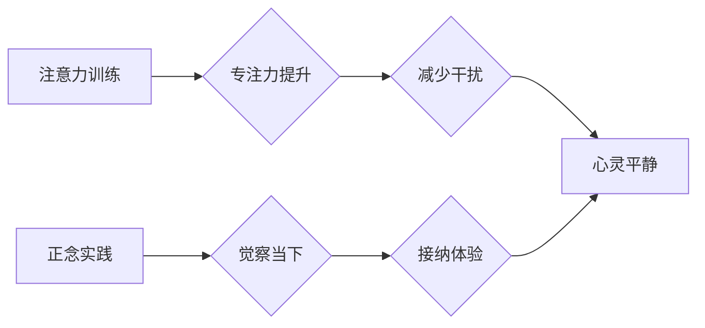

                 

##  注意力训练与正念实践：通过内省和专注增强心灵平和

> 关键词：注意力训练、正念、内省、专注、心灵平和、认知科学、神经科学、冥想、 mindfulness

## 1. 背景介绍

在当今信息爆炸的时代，我们被无休止的通知、信息流和任务所包围。这种持续的刺激和干扰使得专注力变得稀缺，心灵也难以获得平静。注意力训练和正念实践，作为一种古老而有效的精神修养方法，近年来在科学研究和实践中得到了越来越多的关注。

注意力训练旨在增强我们的集中能力，提高对特定目标的关注，并减少对无关信息的干扰。正念实践则强调对当下体验的觉察和接受，不评判地观察自己的思想、感受和身体状态。

将注意力训练与正念实践相结合，可以帮助我们更好地应对现代生活的挑战，提升认知能力，并最终获得心灵的平静和幸福。

## 2. 核心概念与联系

### 2.1 注意力训练

注意力训练是指通过一系列练习和技巧，增强我们对特定目标的关注能力，并减少对无关信息的干扰。

**核心原理：**

注意力训练基于认知科学和神经科学的研究，认为注意力是一种可塑性强的能力，可以通过训练和练习来提升。

**训练方法：**

常见的注意力训练方法包括：

* **冥想：** 通过专注于呼吸、身体感觉或声音等特定对象，训练专注力。
* **专注练习：** 持续关注特定任务或信息，例如阅读、写作或绘画。
* **认知训练游戏：** 利用游戏化的方式，训练注意力、记忆力和执行功能。

### 2.2 正念实践

正念实践是一种基于佛教传统的精神修养方法，强调对当下体验的觉察和接受，不评判地观察自己的思想、感受和身体状态。

**核心原理：**

正念实践的核心是觉察和接受，它认为我们的大脑倾向于沉溺于过去或未来的思绪，而忽略了当下的体验。通过正念练习，我们可以训练自己专注于当下，接纳自己的感受和体验，而不被它们所控制。

**实践方法：**

常见的正念实践方法包括：

* **正念呼吸：** 专注于呼吸的感受，观察吸气和呼气的过程。
* **正念散步：** 在散步时，专注于身体的感受、周围环境的声音和气味。
* **正念饮食：** 在吃饭时，专注于食物的味道、口感和气味。

### 2.3 连接

注意力训练和正念实践相互补充，共同促进心灵的平静和幸福。

注意力训练可以帮助我们更好地专注于当下体验，而正念实践则可以帮助我们接纳和观察自己的思想和感受，从而减少焦虑和压力。

**Mermaid 流程图：**



## 3. 核心算法原理 & 具体操作步骤

### 3.1 算法原理概述

注意力训练和正念实践并非严格意义上的算法，而是基于认知科学和神经科学原理的实践方法。

它们的核心原理在于训练大脑的注意力网络和情绪调节系统，从而提升专注力、情绪稳定性和自我意识。

### 3.2 算法步骤详解

**注意力训练步骤：**

1. **选择训练目标：** 确定需要训练的注意力类型，例如专注力、选择性注意力或切换注意力。
2. **选择训练方法：** 根据目标选择合适的训练方法，例如冥想、专注练习或认知训练游戏。
3. **设定训练计划：** 制定合理的训练计划，包括训练时间、频率和强度。
4. **坚持训练：** 坚持执行训练计划，并逐渐增加训练时间和难度。
5. **评估训练效果：** 定期评估训练效果，并根据需要调整训练计划。

**正念实践步骤：**

1. **找到舒适的姿势：** 找一个舒适的姿势，例如坐或躺下。
2. **专注于呼吸：** 将注意力集中在呼吸的感受，观察吸气和呼气的过程。
3. **觉察身体感受：** 注意身体的任何感觉，例如温度、压力或疼痛。
4. **观察思想和情绪：** 观察自己的思想和情绪，不评判地接纳它们。
5. **回归呼吸：** 当注意力分散时，轻轻地将注意力回归呼吸。

### 3.3 算法优缺点

**注意力训练：**

* **优点：** 可以有效提升专注力、记忆力和执行功能，并改善情绪调节能力。
* **缺点：** 需要坚持练习，效果可能需要一段时间才能显现。

**正念实践：**

* **优点：** 可以帮助减轻压力、焦虑和抑郁症状，提升情绪稳定性和自我意识。
* **缺点：** 需要一定的耐心和练习，初学者可能难以保持专注。

### 3.4 算法应用领域

注意力训练和正念实践的应用领域广泛，包括：

* **教育：** 帮助学生提高专注力、学习效率和情绪调节能力。
* **医疗：** 用于治疗焦虑、抑郁、注意力缺陷多动障碍等心理健康问题。
* **企业：** 提升员工的工作效率、创造力和团队合作能力。
* **个人成长：** 帮助人们获得心灵的平静、幸福和自我实现。

## 4. 数学模型和公式 & 详细讲解 & 举例说明

### 4.1 数学模型构建

注意力机制可以被建模为一个概率分布，其中每个元素代表一个潜在的注意力方向，而分布的峰值代表着当前注意力所集中的地方。

**公式：**

$$
\alpha_i = \frac{exp(e_i^T * h_t)}{\sum_{j=1}^{N} exp(e_j^T * h_t)}
$$

其中：

* $\alpha_i$ 是第 $i$ 个元素的注意力权重。
* $e_i$ 是第 $i$ 个元素的查询向量。
* $h_t$ 是时间步 $t$ 的隐藏状态向量。
* $N$ 是所有元素的数量。

### 4.2 公式推导过程

该公式基于 softmax 函数，它将输入向量映射到一个概率分布，其中每个元素的概率值介于 0 和 1 之间，且所有元素的概率值之和等于 1。

该公式的目的是找到一个注意力权重分布，使得每个元素的权重与其相关性程度成正比。

**举例说明：**

假设我们有一个句子 "我爱学习编程"，我们想要计算每个单词对当前词 "编程" 的注意力权重。

我们可以将每个单词作为查询向量，将 "编程" 作为隐藏状态向量，然后使用上述公式计算每个单词的注意力权重。

结果表明，"学习" 和 "编程" 之间的注意力权重最高，因为它们在语义上密切相关。

### 4.3 案例分析与讲解

注意力机制在自然语言处理、计算机视觉和机器翻译等领域取得了显著的成果。

例如，在机器翻译中，注意力机制可以帮助模型更好地理解句子结构和语义关系，从而提高翻译质量。

在计算机视觉中，注意力机制可以帮助模型关注图像中的重要区域，从而提高目标检测和图像分类的准确率。

## 5. 项目实践：代码实例和详细解释说明

### 5.1 开发环境搭建

为了演示注意力机制的应用，我们可以使用 Python 和 TensorFlow 框架搭建一个简单的项目。

**所需软件：**

* Python 3.x
* TensorFlow 2.x
* Jupyter Notebook

**安装步骤：**

1. 安装 Python 3.x。
2. 使用 pip 安装 TensorFlow 2.x：

```
pip install tensorflow
```

3. 安装 Jupyter Notebook：

```
pip install jupyter
```

### 5.2 源代码详细实现

以下是一个使用 TensorFlow 实现简单注意力机制的代码示例：

```python
import tensorflow as tf

# 定义查询向量
query = tf.constant([[1, 2, 3], [4, 5, 6]])

# 定义键值对
keys = tf.constant([[7, 8, 9], [10, 11, 12]])
values = tf.constant([[13, 14, 15], [16, 17, 18]])

# 计算注意力权重
attention_weights = tf.matmul(query, keys, transpose_b=True)
attention_weights = tf.nn.softmax(attention_weights, axis=-1)

# 计算加权和
output = tf.matmul(attention_weights, values)

# 打印输出
print(output)
```

### 5.3 代码解读与分析

该代码首先定义了查询向量、键值对。然后，使用矩阵乘法计算注意力权重，并使用 softmax 函数将其转换为概率分布。最后，使用注意力权重对值向量进行加权和，得到最终输出。

### 5.4 运行结果展示

运行该代码后，会输出一个注意力权重矩阵和一个加权和矩阵。

注意力权重矩阵表示每个查询元素对每个键值对的注意力权重，加权和矩阵表示每个查询元素对所有键值对的加权和。

## 6. 实际应用场景

### 6.1 自然语言处理

注意力机制在自然语言处理领域有着广泛的应用，例如：

* **机器翻译：** 帮助模型更好地理解句子结构和语义关系，从而提高翻译质量。
* **文本摘要：** 帮助模型识别文本中的重要信息，并生成简洁的摘要。
* **问答系统：** 帮助模型找到与问题相关的关键信息，并给出准确的答案。

### 6.2 计算机视觉

注意力机制也应用于计算机视觉领域，例如：

* **目标检测：** 帮助模型关注图像中的重要区域，从而提高目标检测的准确率。
* **图像分类：** 帮助模型识别图像中的关键特征，从而提高图像分类的准确率。
* **图像分割：** 帮助模型将图像分割成不同的区域，从而提高图像分割的准确率。

### 6.3 其他领域

注意力机制还可以应用于其他领域，例如：

* **语音识别：** 帮助模型关注语音信号中的重要部分，从而提高语音识别的准确率。
* **推荐系统：** 帮助模型理解用户的兴趣偏好，并推荐相关的商品或服务。
* **药物发现：** 帮助模型识别潜在的药物分子，从而加速药物发现过程。

### 6.4 未来应用展望

随着人工智能技术的不断发展，注意力机制的应用场景将会更加广泛。

未来，注意力机制可能被应用于更复杂的任务，例如：

* **自动驾驶：** 帮助车辆更好地理解周围环境，并做出安全可靠的决策。
* **医疗诊断：** 帮助医生更快、更准确地诊断疾病。
* **个性化教育：** 帮助学生根据自己的学习进度和需求，获得个性化的学习体验。

## 7. 工具和资源推荐

### 7.1 学习资源推荐

* **书籍：**
    * 《深度学习》 by Ian Goodfellow, Yoshua Bengio, and Aaron Courville
    * 《Attention Is All You Need》 by Vaswani et al.
* **在线课程：**
    * Coursera: Deep Learning Specialization
    * Udacity: Deep Learning Nanodegree
* **博客和网站：**
    * TensorFlow Blog: https://blog.tensorflow.org/
    * PyTorch Blog: https://pytorch.org/blog/

### 7.2 开发工具推荐

* **TensorFlow:** https://www.tensorflow.org/
* **PyTorch:** https://pytorch.org/
* **Keras:** https://keras.io/

### 7.3 相关论文推荐

* **Attention Is All You Need:** https://arxiv.org/abs/1706.03762
* **BERT: Pre-training of Deep Bidirectional Transformers for Language Understanding:** https://arxiv.org/abs/1810.04805
* **Transformer-XL: Attentive Language Models Beyond a Fixed-Length Context:** https://arxiv.org/abs/1901.08316

## 8. 总结：未来发展趋势与挑战

### 8.1 研究成果总结

注意力机制在人工智能领域取得了显著的成果，并在自然语言处理、计算机视觉等领域得到了广泛应用。

该机制能够帮助模型更好地理解上下文信息，并提高任务的准确率和效率。

### 8.2 未来发展趋势

未来，注意力机制的研究将朝着以下几个方向发展：

* **更强大的注意力机制：** 研究更有效的注意力机制，例如自注意力机制、多头注意力机制等，以提高模型的表达能力和泛化能力。
* **注意力机制的解释性：** 研究如何更好地解释注意力机制的工作原理，以便更好地理解模型的决策过程。
* **注意力机制的应用扩展：** 将注意力机制应用于更多领域，例如自动驾驶、医疗诊断、个性化教育等。

### 8.3 面临的挑战

注意力机制也面临着一些挑战：

* **计算复杂度：** 一些注意力机制的计算复杂度较高，难以在资源有限的设备上运行。
* **训练数据需求：** 训练有效的注意力机制需要大量的训练数据，这对于一些小规模数据集来说是一个挑战。
* **可解释性：** 注意力机制的决策过程相对复杂，难以解释，这对于一些需要透明度和可解释性的应用场景来说是一个挑战。

### 8.4 研究展望

尽管面临着一些挑战，但注意力机制仍然是一个非常有前景的研究方向。

未来，随着人工智能技术的不断发展，注意力机制将会得到更广泛的应用，并为我们带来更多创新和突破。

## 9. 附录：常见问题与解答

**Q1：注意力机制是什么？**

A1：注意力机制是一种模仿人类注意力机制的机器学习技术，它允许模型在处理信息时，将注意力集中在最相关的部分，从而提高效率和准确率。

**Q2：注意力机制有哪些应用场景？**

A2：注意力机制在自然语言处理、计算机视觉、语音识别等领域都有广泛的应用，例如机器翻译、文本摘要、目标检测、图像分类等。

**Q3：如何训练注意力机制？**

A3：训练注意力机制通常需要使用大量的训练数据和复杂的优化算法，例如梯度下降法。

**Q4：注意力机制的优势是什么？**

A4：注意力机制能够提高模型的表达能力、泛化能力和效率，并能够更好地理解上下文信息。

**Q5：注意力机制的局限性是什么？**

A5：注意力机制的计算复杂度较高，训练数据需求量大，并且其决策过程相对复杂，难以解释。


作者：禅与计算机程序设计艺术 / Zen and the Art of Computer Programming<end_of_turn>

