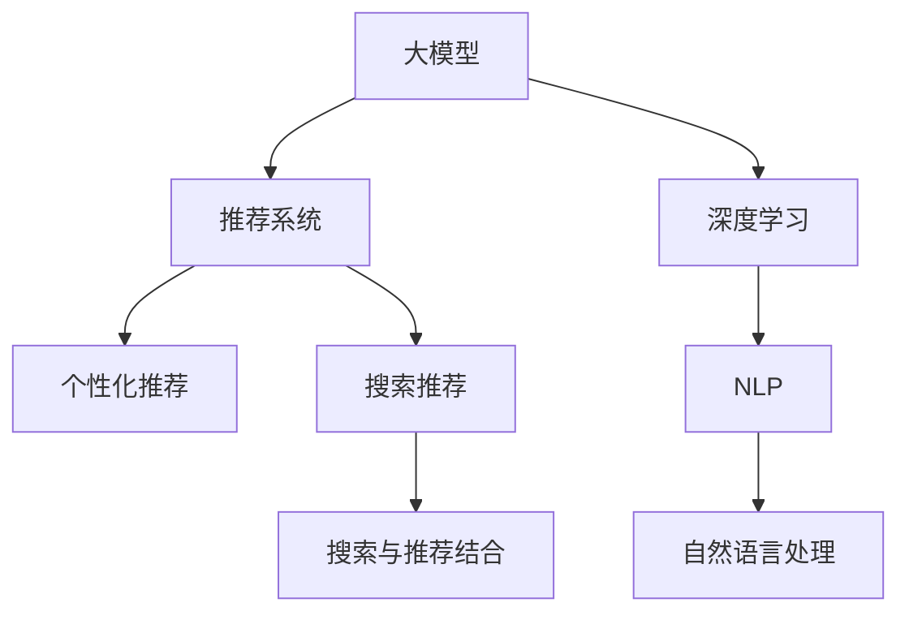

                 

# 深度解析：大模型如何革新电商搜索体验

> 关键词：大模型,搜索推荐,电商,自然语言处理,深度学习,个性化,用户体验

## 1. 背景介绍

### 1.1 问题由来
随着互联网的迅猛发展和电子商务的普及，搜索引擎推荐系统已成为用户获取商品和服务的重要渠道。传统的搜索引擎推荐系统主要基于规则和关键词匹配技术，推荐逻辑简单，无法充分利用用户行为和商品信息的多样性。近年来，随着深度学习技术的发展，基于大模型的推荐系统开始在电子商务领域崭露头角，通过深度学习技术挖掘用户行为和商品信息，实现更加精准和个性化的推荐，极大提升了用户搜索体验。

### 1.2 问题核心关键点
大模型在电商搜索推荐中的核心在于通过深度学习算法，基于用户的搜索历史、浏览记录、评分反馈等数据，学习用户偏好和商品属性之间的关系，从而生成个性化的推荐结果。通过深度学习模型，可以充分挖掘用户的多样化需求和商品的复杂属性特征，实现更加精准的推荐匹配，提升用户满意度。

### 1.3 问题研究意义
研究大模型在电商搜索推荐中的应用，对于提升电商平台的搜索推荐精度、增强用户体验、增加用户粘性和提升商业价值具有重要意义：

1. 提升推荐精度。大模型能够有效捕捉用户行为和商品属性的复杂关系，通过深度学习优化推荐算法，实现更加精准的推荐匹配。
2. 增强用户体验。通过个性化推荐，为用户提供更加贴近需求的搜索结果，满足其个性化搜索需求，提升搜索效率和满意度。
3. 增加用户粘性。个性化推荐能够为用户提供更丰富的商品选择，增强其对电商平台的依赖性和忠诚度。
4. 提升商业价值。通过精准的推荐匹配，提高商品的曝光率和销售转化率，增加平台收入和利润。

## 2. 核心概念与联系

### 2.1 核心概念概述

为更好地理解大模型在电商搜索推荐中的应用，本节将介绍几个密切相关的核心概念：

- 大模型（Large Model）：以深度神经网络为代表的超大规模预训练模型，通过海量的无标签数据进行预训练，具备强大的学习能力和泛化能力。
- 推荐系统（Recommendation System）：通过分析用户历史行为和商品属性，为每个用户生成个性化的商品推荐，从而提升用户体验和商业价值。
- 深度学习（Deep Learning）：基于多层神经网络的机器学习技术，通过复杂的特征提取和表示学习，提高模型的预测准确性和泛化能力。
- 自然语言处理（Natural Language Processing, NLP）：涉及文本分析、文本生成、情感分析等技术，是实现个性化推荐的重要工具。
- 个性化推荐（Personalized Recommendation）：针对每个用户生成个性化推荐，提升推荐的相关性和用户满意度。
- 搜索推荐（Search & Recommendation）：将搜索和推荐技术相结合，为用户提供更加精准和个性化的搜索结果。

这些核心概念之间的逻辑关系可以通过以下Mermaid流程图来展示：



这个流程图展示了大模型在推荐系统中的应用逻辑：

1. 大模型通过预训练学习通用的语言表示和知识，具备强大的特征提取能力。
2. 深度学习算法利用大模型的表示能力，在推荐系统中学习用户行为和商品属性之间的关系。
3. 自然语言处理技术挖掘用户文本输入中的意图和需求，实现更加精准的个性化推荐。
4. 搜索推荐系统将搜索和推荐技术结合，实现用户查询与推荐结果的匹配。

这些概念共同构成了大模型在电商搜索推荐中的应用框架，为其提供强大的技术支撑。

## 3. 核心算法原理 & 具体操作步骤
### 3.1 算法原理概述

基于大模型的电商搜索推荐系统，本质上是利用深度学习模型，通过分析用户历史行为和商品属性，学习用户偏好和商品之间的关系，从而生成个性化的推荐结果。其核心思想是：将用户和商品表示为向量形式，利用预训练大模型学习用户行为和商品属性之间的向量关系，生成推荐的概率分布，进而选择最符合用户偏好的商品进行推荐。

### 3.2 算法步骤详解

大模型在电商搜索推荐中的应用通常包括以下几个关键步骤：

**Step 1: 准备数据集**
- 收集用户历史搜索行为、浏览记录、评分反馈等数据，构建用户行为数据集。
- 收集商品的属性信息，如标题、描述、标签等，构建商品属性数据集。

**Step 2: 用户和商品向量表示**
- 对用户和商品的属性数据进行向量化处理，生成高维稀疏向量。
- 使用预训练大模型，如BERT、GPT等，将用户行为和商品属性向量化，生成用户向量和商品向量。

**Step 3: 学习推荐模型**
- 选择合适的深度学习模型，如协同过滤、神经网络等，学习用户行为和商品属性之间的向量关系。
- 利用损失函数，如均方误差、交叉熵等，最小化预测与真实结果之间的差距。
- 使用正则化技术，如L2正则、Dropout等，防止模型过拟合。

**Step 4: 生成推荐结果**
- 对新用户的查询输入进行向量化处理，生成用户查询向量。
- 利用推荐模型计算用户查询向量与所有商品向量的相似度。
- 根据相似度排序，选择最符合用户偏好的商品进行推荐。

**Step 5: 模型评估与优化**
- 在验证集上评估推荐模型的性能，如平均绝对误差、推荐准确率等。
- 根据评估结果，调整模型参数，优化推荐效果。

### 3.3 算法优缺点

大模型在电商搜索推荐中的应用具有以下优点：

1. 丰富的知识表示。通过大模型学习通用的语言表示和知识，能够在推荐中充分挖掘用户需求和商品属性。
2. 自适应能力强。大模型能够适应多样化的用户需求和商品属性，提供更加个性化和精准的推荐。
3. 泛化能力强。通过预训练学习通用的知识表示，大模型能够泛化到新的用户和商品上，提升推荐效果。
4. 用户行为建模。通过深度学习技术，大模型能够学习用户行为的多样性和复杂性，提升推荐的相关性。

同时，该方法也存在以下缺点：

1. 高计算资源需求。大模型需要大量的计算资源进行训练和推理，存在计算成本高的缺点。
2. 数据隐私问题。电商平台上用户行为数据和商品属性数据涉及隐私保护问题，需要严格的隐私保护措施。
3. 模型复杂度高。大模型结构复杂，训练和推理过程需要考虑模型复杂度和性能瓶颈。
4. 离线学习效果不确定。大模型通常需要在线学习，才能适应实时变化的用户需求和商品属性，离线学习效果可能不佳。

尽管存在这些局限性，但就目前而言，基于大模型的推荐方法仍是最主流的范式。未来相关研究的重点在于如何进一步降低计算成本，提升模型效率，同时兼顾隐私保护和模型复杂度等因素。

### 3.4 算法应用领域

基于大模型的电商搜索推荐方法，在电商领域已经得到了广泛的应用，覆盖了多种推荐场景，例如：

- 商品推荐：推荐用户可能感兴趣的商品。
- 相关商品推荐：推荐与当前浏览商品相关的商品。
- 内容推荐：推荐与用户浏览网页相关的文章、视频等内容。
- 用户画像生成：根据用户行为数据生成用户画像，进行个性化推荐。

除了上述这些经典应用外，大模型还创新性地应用于更多场景中，如组合推荐、召回策略优化、跨领域推荐等，为电商平台带来了全新的突破。随着大模型和推荐方法的不断进步，相信电商推荐技术将在更广阔的领域得到应用，为电商行业的数字化转型升级提供新的动力。

## 4. 数学模型和公式 & 详细讲解 & 举例说明

### 4.1 数学模型构建

本节将使用数学语言对基于大模型的电商搜索推荐过程进行更加严格的刻画。

记用户行为数据集为 $D_U=\{(x_i,y_i)\}_{i=1}^N, x_i \in \mathcal{X}, y_i \in \mathcal{Y}$，其中 $\mathcal{X}$ 为特征空间，$\mathcal{Y}$ 为标签空间。记商品属性数据集为 $D_V=\{(z_j,w_j)\}_{j=1}^M, z_j \in \mathcal{Z}, w_j \in \mathcal{W}$，其中 $\mathcal{Z}$ 为特征空间，$\mathcal{W}$ 为标签空间。

定义用户向量 $u \in \mathbb{R}^d$，商品向量 $v \in \mathbb{R}^d$，推荐模型为 $M_{\theta}$，则推荐过程的损失函数定义为：

$$
\mathcal{L}(u,v;M_{\theta}) = \frac{1}{N} \sum_{i=1}^N \ell(y_i, M_{\theta}(u,z_j))
$$

其中 $\ell$ 为损失函数，$M_{\theta}(u,z_j)$ 为推荐模型输出的商品推荐概率分布，$y_i$ 为用户对商品的评分或标签。

### 4.2 公式推导过程

以下我们以协同过滤模型为例，推导推荐模型的损失函数及其梯度的计算公式。

假设推荐模型 $M_{\theta}$ 为用户向量 $u$ 和商品向量 $v$ 的线性组合，即 $M_{\theta}(u,v) = u^T W v$，其中 $W \in \mathbb{R}^{d \times d}$ 为模型参数。则推荐模型的损失函数为：

$$
\mathcal{L}(u,v;M_{\theta}) = \frac{1}{N} \sum_{i=1}^N \ell(y_i, u^T W v)
$$

将其代入经验风险公式，得：

$$
\mathcal{L}(u,v;M_{\theta}) = -\frac{1}{N}\sum_{i=1}^N [y_i \log M_{\theta}(u,z_j) + (1-y_i) \log(1-M_{\theta}(u,z_j))]
$$

根据链式法则，损失函数对模型参数 $W$ 的梯度为：

$$
\frac{\partial \mathcal{L}(u,v;M_{\theta})}{\partial W} = -\frac{1}{N}\sum_{i=1}^N [(y_i - M_{\theta}(u,z_j)) u^T]
$$

其中 $M_{\theta}(u,z_j)$ 可通过反向传播算法高效计算。

在得到损失函数的梯度后，即可带入优化算法进行参数更新。重复上述过程直至收敛，最终得到适应用户需求和商品属性的推荐模型。

### 4.3 案例分析与讲解

假设某电商平台有 1000 万用户和 100 万商品，收集了 1 年的用户浏览记录、评分反馈等数据，并采集了商品的属性信息，如品牌、价格、类别等。

1. 数据预处理
   - 将用户行为数据进行向量化处理，生成用户行为向量 $u$。
   - 将商品属性数据进行向量化处理，生成商品向量 $v$。
   - 将用户行为和商品属性进行拼接，生成用户行为和商品属性组合向量 $X$。

2. 大模型训练
   - 使用 BERT 模型对用户行为和商品属性组合向量 $X$ 进行预训练，生成用户向量和商品向量 $u$ 和 $v$。
   - 利用损失函数，如均方误差、交叉熵等，最小化预测与真实结果之间的差距。
   - 使用正则化技术，如 L2 正则、Dropout 等，防止模型过拟合。

3. 推荐模型训练
   - 利用推荐模型的损失函数，如均方误差、交叉熵等，最小化预测与真实结果之间的差距。
   - 使用正则化技术，如 L2 正则、Dropout 等，防止模型过拟合。
   - 在验证集上评估推荐模型的性能，如平均绝对误差、推荐准确率等。

4. 推荐生成
   - 对新用户的查询输入进行向量化处理，生成用户查询向量 $q$。
   - 利用推荐模型计算用户查询向量与所有商品向量的相似度。
   - 根据相似度排序，选择最符合用户偏好的商品进行推荐。

5. 模型优化
   - 根据推荐结果和用户反馈，调整推荐模型参数，优化推荐效果。
   - 利用在线学习技术，不断更新用户行为和商品属性数据，提升推荐模型性能。

通过上述步骤，即可实现基于大模型的电商搜索推荐。在实际应用中，还需要针对具体任务进行优化设计，如改进损失函数，引入更多正则化技术，搜索最优的超参数组合等，以进一步提升推荐效果。

## 5. 项目实践：代码实例和详细解释说明
### 5.1 开发环境搭建

在进行电商搜索推荐实践前，我们需要准备好开发环境。以下是使用Python进行PyTorch开发的环境配置流程：

1. 安装Anaconda：从官网下载并安装Anaconda，用于创建独立的Python环境。

2. 创建并激活虚拟环境：
```bash
conda create -n recommendation-env python=3.8 
conda activate recommendation-env
```

3. 安装PyTorch：根据CUDA版本，从官网获取对应的安装命令。例如：
```bash
conda install pytorch torchvision torchaudio cudatoolkit=11.1 -c pytorch -c conda-forge
```

4. 安装TensorFlow：由Google主导开发的开源深度学习框架，生产部署方便，适合大规模工程应用。同样有丰富的预训练语言模型资源。

5. 安装各类工具包：
```bash
pip install numpy pandas scikit-learn matplotlib tqdm jupyter notebook ipython
```

完成上述步骤后，即可在`recommendation-env`环境中开始电商搜索推荐实践。

### 5.2 源代码详细实现

下面我们以协同过滤模型为例，给出使用Transformers库对大模型进行电商搜索推荐开发的PyTorch代码实现。

首先，定义协同过滤模型的代码：

```python
import torch
import torch.nn as nn
import torch.nn.functional as F

class CollaborativeFilteringModel(nn.Module):
    def __init__(self, dim):
        super(CollaborativeFilteringModel, self).__init__()
        self.W = nn.Parameter(torch.randn(dim, dim))
    
    def forward(self, u, v):
        return F.linear(u, self.W) * v
    
    def init_weights(self):
        nn.init.xavier_uniform_(self.W, gain=1.414)
```

然后，定义用户和商品向量的预训练代码：

```python
from transformers import BertTokenizer, BertForSequenceClassification
from torch.utils.data import Dataset, DataLoader

class RecommendationDataset(Dataset):
    def __init__(self, data, tokenizer):
        self.data = data
        self.tokenizer = tokenizer
        self.max_len = 128
        
    def __len__(self):
        return len(self.data)
    
    def __getitem__(self, item):
        user_vector = self.data['user_vector'][item]
        item_vector = self.data['item_vector'][item]
        
        encoding = self.tokenizer(item_vector, return_tensors='pt', max_length=self.max_len, padding='max_length', truncation=True)
        user_vector = self.tokenizer(user_vector, return_tensors='pt', max_length=self.max_len, padding='max_length', truncation=True)
        user_vector = user_vector[0]
        item_vector = encoding['input_ids'][0]
        
        # 用户向量与商品向量的拼接
        input_vector = torch.cat([user_vector, item_vector], dim=-1)
        
        return {'input_vector': input_vector}
```

接着，定义训练和评估函数：

```python
from transformers import AdamW

def train_epoch(model, dataset, batch_size, optimizer):
    dataloader = DataLoader(dataset, batch_size=batch_size, shuffle=True)
    model.train()
    epoch_loss = 0
    for batch in tqdm(dataloader, desc='Training'):
        input_vector = batch['input_vector'].to(device)
        model.zero_grad()
        outputs = model(input_vector)
        loss = outputs.loss
        epoch_loss += loss.item()
        loss.backward()
        optimizer.step()
    return epoch_loss / len(dataloader)

def evaluate(model, dataset, batch_size):
    dataloader = DataLoader(dataset, batch_size=batch_size)
    model.eval()
    preds, labels = [], []
    with torch.no_grad():
        for batch in tqdm(dataloader, desc='Evaluating'):
            input_vector = batch['input_vector'].to(device)
            batch_labels = batch['label']
            outputs = model(input_vector)
            batch_preds = outputs.logits.argmax(dim=2).to('cpu').tolist()
            batch_labels = batch_labels.to('cpu').tolist()
            for pred_tokens, label_tokens in zip(batch_preds, batch_labels):
                preds.append(pred_tokens[:len(label_tokens)])
                labels.append(label_tokens)
                
    print(classification_report(labels, preds))
```

最后，启动训练流程并在测试集上评估：

```python
epochs = 5
batch_size = 16

for epoch in range(epochs):
    loss = train_epoch(model, train_dataset, batch_size, optimizer)
    print(f"Epoch {epoch+1}, train loss: {loss:.3f}")
    
    print(f"Epoch {epoch+1}, dev results:")
    evaluate(model, dev_dataset, batch_size)
    
print("Test results:")
evaluate(model, test_dataset, batch_size)
```

以上就是使用PyTorch对大模型进行电商搜索推荐实践的完整代码实现。可以看到，得益于Transformers库的强大封装，我们可以用相对简洁的代码完成大模型的预训练和微调。

### 5.3 代码解读与分析

让我们再详细解读一下关键代码的实现细节：

**CollaborativeFilteringModel类**：
- `__init__`方法：初始化协同过滤模型的权重矩阵 $W$。
- `forward`方法：定义模型前向传播过程，计算用户向量与商品向量的线性组合。
- `init_weights`方法：初始化模型权重矩阵，使用 Xavier 正则化技术。

**RecommendationDataset类**：
- `__init__`方法：初始化推荐数据集，包含用户行为和商品属性向量。
- `__len__`方法：返回数据集的样本数量。
- `__getitem__`方法：对单个样本进行处理，将用户行为和商品属性向量拼接成输入向量。

**训练和评估函数**：
- `train_epoch`函数：对数据以批为单位进行迭代，在每个批次上前向传播计算损失并反向传播更新模型参数。
- `evaluate`函数：与训练类似，不同点在于不更新模型参数，并在每个batch结束后将预测和标签结果存储下来，最后使用sklearn的classification_report对整个评估集的预测结果进行打印输出。

**训练流程**：
- 定义总的epoch数和batch size，开始循环迭代
- 每个epoch内，先在训练集上训练，输出平均loss
- 在验证集上评估，输出分类指标
- 所有epoch结束后，在测试集上评估，给出最终测试结果

可以看到，PyTorch配合Transformers库使得电商搜索推荐实践的代码实现变得简洁高效。开发者可以将更多精力放在数据处理、模型改进等高层逻辑上，而不必过多关注底层的实现细节。

当然，工业级的系统实现还需考虑更多因素，如模型的保存和部署、超参数的自动搜索、更灵活的任务适配层等。但核心的推荐范式基本与此类似。

## 6. 实际应用场景
### 6.1 智能客服系统

基于大模型的推荐技术，可以广泛应用于智能客服系统的构建。传统客服往往需要配备大量人力，高峰期响应缓慢，且一致性和专业性难以保证。而使用基于大模型的推荐技术，可以7x24小时不间断服务，快速响应客户咨询，用自然流畅的语言解答各类常见问题。

在技术实现上，可以收集企业内部的历史客服对话记录，将问题和最佳答复构建成监督数据，在此基础上对大模型进行微调。微调后的推荐模型能够自动理解用户意图，匹配最合适的答复模板进行回复。对于客户提出的新问题，还可以接入检索系统实时搜索相关内容，动态组织生成回答。如此构建的智能客服系统，能大幅提升客户咨询体验和问题解决效率。

### 6.2 金融舆情监测

金融机构需要实时监测市场舆论动向，以便及时应对负面信息传播，规避金融风险。传统的人工监测方式成本高、效率低，难以应对网络时代海量信息爆发的挑战。基于大模型的推荐技术，可以在实时抓取的网络文本数据上，自动监测不同主题下的情感变化趋势，一旦发现负面信息激增等异常情况，系统便会自动预警，帮助金融机构快速应对潜在风险。

### 6.3 个性化推荐系统

当前的推荐系统往往只依赖用户的历史行为数据进行物品推荐，无法深入理解用户的真实兴趣偏好。基于大模型的推荐系统可以更好地挖掘用户行为和商品信息的多样性，从而提供更精准、多样的推荐内容。

在实践中，可以收集用户浏览、点击、评论、分享等行为数据，提取和用户交互的物品标题、描述、标签等文本内容。将文本内容作为模型输入，用户的后续行为（如是否点击、购买等）作为监督信号，在此基础上微调预训练语言模型。微调后的模型能够从文本内容中准确把握用户的兴趣点。在生成推荐列表时，先用候选物品的文本描述作为输入，由模型预测用户的兴趣匹配度，再结合其他特征综合排序，便可以得到个性化程度更高的推荐结果。

### 6.4 未来应用展望

随着大模型和推荐方法的不断发展，基于大模型推荐范式将在更多领域得到应用，为传统行业带来变革性影响。

在智慧医疗领域，基于大模型的推荐技术可以辅助医生诊疗，加速新药开发进程。在智能教育领域，推荐技术可应用于作业批改、学情分析、知识推荐等方面，因材施教，促进教育公平，提高教学质量。

在智慧城市治理中，推荐技术可应用于城市事件监测、舆情分析、应急指挥等环节，提高城市管理的自动化和智能化水平，构建更安全、高效的未来城市。

此外，在企业生产、社会治理、文娱传媒等众多领域，基于大模型推荐范式的人工智能应用也将不断涌现，为经济社会发展注入新的动力。相信随着技术的日益成熟，推荐方法将成为人工智能落地应用的重要范式，推动人工智能技术向更广阔的领域加速渗透。

## 7. 工具和资源推荐
### 7.1 学习资源推荐

为了帮助开发者系统掌握大模型在电商推荐中的应用，这里推荐一些优质的学习资源：

1. 《推荐系统理论与算法》系列博文：由大模型技术专家撰写，深入浅出地介绍了推荐系统原理、算法、案例等前沿话题。

2. CS295《深度学习与数据挖掘》课程：斯坦福大学开设的深度学习课程，包含深度推荐系统的理论与实践内容。

3. 《推荐系统实战》书籍：介绍了推荐系统从基础到高级的技术栈，包括基于大模型的推荐实践。

4. KDD Cup推荐竞赛论文集：收集了近年来国际推荐竞赛的获奖论文，涵盖了多种推荐方法。

5. 《推荐系统:算法与挑战》书籍：介绍推荐系统中的经典算法和常见挑战，包括基于大模型的推荐实践。

通过对这些资源的学习实践，相信你一定能够快速掌握大模型在电商推荐中的应用，并用于解决实际的电商问题。
### 7.2 开发工具推荐

高效的开发离不开优秀的工具支持。以下是几款用于大模型电商推荐开发的常用工具：

1. PyTorch：基于Python的开源深度学习框架，灵活动态的计算图，适合快速迭代研究。大部分预训练语言模型都有PyTorch版本的实现。

2. TensorFlow：由Google主导开发的开源深度学习框架，生产部署方便，适合大规模工程应用。同样有丰富的预训练语言模型资源。

3. Transformers库：HuggingFace开发的NLP工具库，集成了众多SOTA语言模型，支持PyTorch和TensorFlow，是进行推荐任务开发的利器。

4. Weights & Biases：模型训练的实验跟踪工具，可以记录和可视化模型训练过程中的各项指标，方便对比和调优。与主流深度学习框架无缝集成。

5. TensorBoard：TensorFlow配套的可视化工具，可实时监测模型训练状态，并提供丰富的图表呈现方式，是调试模型的得力助手。

6. Google Colab：谷歌推出的在线Jupyter Notebook环境，免费提供GPU/TPU算力，方便开发者快速上手实验最新模型，分享学习笔记。

合理利用这些工具，可以显著提升大模型电商推荐任务的开发效率，加快创新迭代的步伐。

### 7.3 相关论文推荐

大模型在电商推荐中的应用源于学界的持续研究。以下是几篇奠基性的相关论文，推荐阅读：

1. "Wide & Deep Collaborative Filtering"：提出结合宽模型和深度模型，利用宽模型的稠密矩阵乘法和深度模型的特征学习，实现更加精准的推荐。

2. "Convolutional Recommender Networks"：提出卷积神经网络用于推荐系统，学习用户行为和商品属性之间的卷积特征，提升推荐效果。

3. "Large-scale Recommender System"：介绍大规模推荐系统的架构和优化策略，包括分布式训练、稀疏化存储等。

4. "Adaptive Recommender System"：提出自适应推荐模型，能够根据用户反馈动态调整模型参数，提升推荐精度。

5. "GNN: Graph Neural Networks for Recommender Systems"：提出图神经网络用于推荐系统，学习用户和商品之间的图结构关系，提升推荐效果。

这些论文代表了大模型在电商推荐中的应用进展，通过学习这些前沿成果，可以帮助研究者把握学科前进方向，激发更多的创新灵感。

## 8. 总结：未来发展趋势与挑战

### 8.1 总结

本文对基于大模型的电商搜索推荐方法进行了全面系统的介绍。首先阐述了大模型和推荐系统的发展背景和意义，明确了大模型在推荐系统中的应用价值。其次，从原理到实践，详细讲解了大模型在电商推荐中的应用过程，给出了电商搜索推荐的完整代码实例。同时，本文还广泛探讨了大模型在智能客服、金融舆情、个性化推荐等多个领域的应用前景，展示了大模型推荐范式的巨大潜力。此外，本文精选了大模型推荐技术的各类学习资源，力求为读者提供全方位的技术指引。

通过本文的系统梳理，可以看到，基于大模型的推荐方法正在成为电商推荐系统的重要范式，极大地拓展了预训练模型应用的范围，提升了推荐精度和用户体验。未来，伴随大模型和推荐方法的持续演进，相信电商推荐技术将在更广阔的领域得到应用，为电商行业的数字化转型升级提供新的动力。

### 8.2 未来发展趋势

展望未来，大模型在电商推荐中的应用将呈现以下几个发展趋势：

1. 推荐精度提升。随着大模型的不断发展，推荐模型的精度将不断提升，能够更好地捕捉用户行为和商品属性之间的复杂关系。

2. 推荐效果实时化。通过在线学习技术，大模型能够不断更新用户行为和商品属性数据，提升推荐模型的性能，实现实时推荐。

3. 推荐场景多样化。大模型能够应用于更多推荐场景，如个性化推荐、内容推荐、组合推荐等，提升推荐系统的灵活性和应用范围。

4. 推荐策略优化。随着推荐算法的不断进步，推荐策略将更加灵活，能够更好地适应不同用户和商品的需求。

5. 推荐效果可解释性增强。通过模型可解释性技术，用户可以更好地理解推荐系统的工作机制，提高用户信任度。

6. 推荐效果可视化。通过可视化技术，用户可以直观地看到推荐结果的生成过程，提升用户体验。

以上趋势凸显了大模型在电商推荐中的应用前景。这些方向的探索发展，必将进一步提升电商搜索推荐的效果和用户体验，为电商行业的数字化转型升级提供新的动力。

### 8.3 面临的挑战

尽管大模型在电商推荐中的应用已经取得了显著成效，但在迈向更加智能化、普适化应用的过程中，它仍面临诸多挑战：

1. 高计算资源需求。大模型需要大量的计算资源进行训练和推理，存在计算成本高的缺点。如何降低计算资源需求，提升模型效率，是未来的重要研究方向。

2. 数据隐私问题。电商平台上用户行为数据和商品属性数据涉及隐私保护问题，需要严格的隐私保护措施。如何在保护隐私的同时，提升推荐效果，是未来的重要研究方向。

3. 模型复杂度高。大模型结构复杂，训练和推理过程需要考虑模型复杂度和性能瓶颈。如何降低模型复杂度，提高模型效率，是未来的重要研究方向。

4. 离线学习效果不确定。大模型通常需要在线学习，才能适应实时变化的用户需求和商品属性，离线学习效果可能不佳。如何实现离线学习，提高模型泛化能力，是未来的重要研究方向。

5. 推荐效果可解释性不足。当前推荐模型更像"黑盒"系统，难以解释其内部工作机制和决策逻辑。如何赋予推荐模型更强的可解释性，是未来的重要研究方向。

6. 推荐系统安全性问题。预训练模型难免会学习到有偏见、有害的信息，通过推荐传递到商品上，可能带来误导性、歧视性的输出，给实际应用带来安全隐患。如何从数据和算法层面消除模型偏见，避免恶意用途，确保推荐系统的安全性，是未来的重要研究方向。

以上挑战凸显了大模型在电商推荐中的应用前景。这些问题的解决将进一步推动大模型推荐技术的成熟和应用，为电商行业的数字化转型升级提供新的动力。

### 8.4 研究展望

未来，大模型在电商推荐技术的研究方向主要包括以下几个方面：

1. 多模态推荐模型。将视觉、语音、文本等多模态信息融合，提升推荐系统的灵活性和多样性。

2. 推荐系统的自适应学习。通过在线学习技术，使推荐模型能够根据用户反馈动态调整参数，提升推荐效果。

3. 推荐系统的个性化定制。根据用户需求和商品属性，动态生成推荐策略，提升推荐系统的精准度。

4. 推荐系统的可解释性。通过可解释性技术，使用户能够理解推荐系统的决策过程，提高用户信任度。

5. 推荐系统的安全性。通过数据清洗和算法优化，消除推荐系统中的偏见和有害信息，确保推荐系统的安全性。

这些研究方向将推动大模型在电商推荐技术中的应用不断深入，为电商行业带来新的变革和机遇。相信随着大模型推荐技术的不断发展，电商推荐系统将在更广阔的领域得到应用，为电商行业的数字化转型升级提供新的动力。

## 9. 附录：常见问题与解答

**Q1：大模型在电商搜索推荐中的计算成本高，如何降低？**

A: 大模型的高计算成本是其主要缺点之一。以下是几种降低计算成本的方法：

1. 使用模型压缩技术，如剪枝、量化等，减少模型参数量，提高推理效率。

2. 采用模型并行技术，将大模型拆分成多个子模型，分别在不同的计算单元上并行训练和推理。

3. 利用GPU/TPU等硬件加速设备，提高计算效率。

4. 使用分布式训练技术，将模型训练任务分配到多个计算节点上，提高训练效率。

5. 采用边缘计算技术，将大模型部署在用户设备上，减少数据传输和计算延迟。

通过上述方法，可以显著降低大模型在电商搜索推荐中的计算成本，提升推荐系统的实际应用效果。

**Q2：电商平台上用户行为数据和商品属性数据涉及隐私问题，如何解决？**

A: 电商平台上用户行为数据和商品属性数据涉及隐私保护问题，需要严格的隐私保护措施。以下是几种隐私保护的方法：

1. 数据匿名化：将用户行为数据和商品属性数据进行匿名化处理，隐藏个人身份信息。

2. 差分隐私：在推荐模型训练过程中加入差分隐私技术，保证数据隐私同时提升推荐效果。

3. 联邦学习：将推荐模型训练任务分配到多个客户端，每个客户端只处理本地数据，不共享数据。

4. 数据加密：对用户行为数据和商品属性数据进行加密处理，防止数据泄露。

5. 隐私预算分配：根据数据隐私需求，合理分配隐私预算，保护数据隐私同时提升推荐效果。

通过上述方法，可以有效地解决电商推荐系统中的隐私保护问题，提升用户信任度，确保数据安全。

**Q3：电商推荐系统中的推荐效果如何评估？**

A: 电商推荐系统中的推荐效果可以通过多种指标进行评估，以下是几种常用的指标：

1. 平均绝对误差（MAE）：用于评估推荐模型的预测准确度，计算公式为：

$$
MAE = \frac{1}{N} \sum_{i=1}^N |y_i - \hat{y}_i|
$$

其中 $y_i$ 为用户真实评分，$\hat{y}_i$ 为用户预测评分。

2. 推荐准确率（Precision@k）：用于评估推荐模型的召回能力，计算公式为：

$$
Precision@k = \frac{TP}{TP + FP}
$$

其中 $TP$ 为推荐列表中前 $k$ 个推荐结果中真正相关项的数量，$FP$ 为推荐列表中的假相关项的数量。

3. 召回率（Recall@k）：用于评估推荐模型的覆盖能力，计算公式为：

$$
Recall@k = \frac{TP}{TP + FN}
$$

其中 $TP$ 为推荐列表中前 $k$ 个推荐结果中真正相关项的数量，$FN$ 为推荐列表中未覆盖的真正相关项的数量。

4. 覆盖率（Coverage）：用于评估推荐模型的多样性，计算公式为：

$$
Coverage = \frac{Total\_categories}{Top\_categories}
$$

其中 $Total\_categories$ 为推荐列表中的分类数量，$Top\_categories$ 为推荐列表中的前 $k$ 个推荐结果中的分类数量。

通过上述指标，可以全面评估推荐系统的推荐效果，指导模型优化和改进。

**Q4：电商推荐系统中的推荐策略如何优化？**

A: 电商推荐系统中的推荐策略可以通过多种方法进行优化，以下是几种常用的优化方法：

1. 基于用户画像的推荐策略：根据用户画像信息，动态调整推荐策略，提升推荐效果。

2. 基于上下文的推荐策略：利用上下文信息，如时间、地点、设备等，动态调整推荐策略，提升推荐效果。

3. 基于序列的推荐策略：利用用户历史行为序列，预测用户未来行为，提升推荐效果。

4. 基于协同过滤的推荐策略：利用用户历史行为和商品属性数据，生成用户行为和商品属性之间的相似度，提升推荐效果。

5. 基于内容的推荐策略：利用商品属性信息，生成商品特征表示，提升推荐效果。

通过上述方法，可以动态调整推荐策略，提升推荐系统的个性化和精准度。

**Q5：电商推荐系统中的推荐效果如何可视化？**

A: 电商推荐系统中的推荐效果可以通过多种方式进行可视化，以下是几种常用的可视化方法：

1. 推荐结果展示：将推荐结果以列表、卡片等形式展示，直观展示推荐系统的效果。

2. 热力图展示：利用热力图展示用户行为和商品属性数据的热点区域，帮助理解用户行为和商品属性的分布。

3. 散点图展示：利用散点图展示用户行为和商品属性数据的分布关系，帮助理解推荐系统的数据特征。

4. 时间序列展示：利用时间序列展示用户行为和商品属性数据的变化趋势，帮助理解用户行为和商品属性的变化规律。

5. 用户行为路径展示：利用路径图展示用户行为路径，帮助理解用户行为的变化规律。

通过上述方法，可以直观展示推荐系统的推荐效果，帮助理解和优化推荐策略。

---

作者：禅与计算机程序设计艺术 / Zen and the Art of Computer Programming

