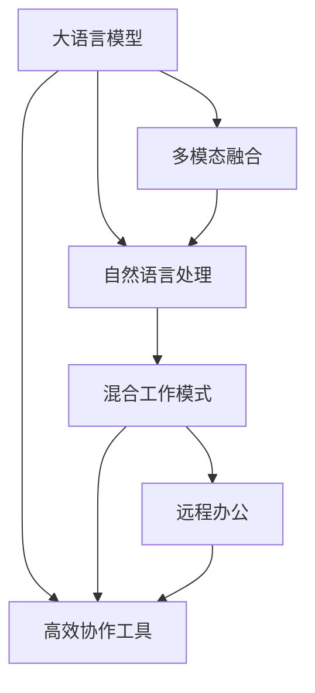

                 

# 混合工作模式与 LLM：高效的远程协作

> 关键词：远程协作,混合工作模式,大语言模型,远程办公,团队协作,知识共享,多模态融合,高效协作工具

## 1. 背景介绍

随着信息技术的发展，远程工作模式正在逐渐成为企业新的常态。而新冠疫情的爆发，更使得全球范围内的企业加速向远程协作转变。然而，传统的远程协作方式，由于沟通不顺畅、信息碎片化等问题，使得工作效率降低，团队协作难度加大。

在这样的背景下，大语言模型（Large Language Model, LLM）应运而生，以其强大的自然语言处理能力，为混合工作模式下的远程协作提供了全新的可能性。基于大语言模型的协作工具和平台，能够帮助团队成员高效沟通、快速获取信息、协同完成任务，从而大幅提升远程工作的效率和效果。

## 2. 核心概念与联系

### 2.1 核心概念概述

为了更好地理解基于大语言模型的混合工作模式，本节将介绍几个密切相关的核心概念：

- 大语言模型（LLM）：一种基于自回归或自编码模型的大规模预训练语言模型，如GPT、BERT等。通过在海量无标签文本数据上进行预训练，LLM可以学习到丰富的语言知识，具备强大的自然语言处理能力。

- 混合工作模式（Hybrid Work Mode）：结合远程工作和现场工作的优势，既享受远程工作的灵活性，又保留现场工作的互动性。在远程协作中，大语言模型能够发挥重要作用，帮助团队成员更好地沟通和协作。

- 自然语言处理（Natural Language Processing, NLP）：一门涉及计算机科学、人工智能和语言学的交叉学科，旨在让计算机能够理解、处理和生成自然语言。大语言模型是NLP技术的最新突破。

- 多模态融合（Multimodal Fusion）：指将文本、图像、视频、语音等多模态信息进行整合，提升信息处理能力和用户体验。大语言模型能够利用多模态信息进行更全面、精准的推理和生成。

- 高效协作工具（Efficient Collaboration Tools）：基于大语言模型的协作工具，如聊天机器人、文档编辑器、任务管理平台等，能够帮助团队成员高效沟通、协同完成任务。

这些核心概念之间的逻辑关系可以通过以下Mermaid流程图来展示：



这个流程图展示了大语言模型的核心概念及其之间的关系：

1. 大语言模型通过自然语言处理，可以理解、处理和生成自然语言。
2. 多模态融合使得大语言模型能够整合文本、图像、视频、语音等多种信息源，提升信息处理能力。
3. 基于大语言模型的协作工具，为混合工作模式下的远程协作提供了基础。
4. 混合工作模式将远程工作与现场工作的优势相结合，提升了团队协作效率。
5. 远程办公则是在技术支持下，员工可以灵活安排工作时间和地点，提高工作效率。

## 3. 核心算法原理 & 具体操作步骤

### 3.1 算法原理概述

基于大语言模型的混合工作模式，本质上是一种利用人工智能技术，优化团队协作流程的方法。其核心思想是：通过大语言模型对自然语言的处理和生成能力，为远程协作提供智能化的工具和平台，使得团队成员能够更加高效地进行沟通和协作。

形式化地，假设远程协作中存在 $N$ 个参与者，每个参与者 $i$ 的输入为 $x_i$，输出为 $y_i$。大语言模型 $M_{\theta}$ 通过处理输入 $x_i$，生成输出 $y_i$，使得团队成员能够相互理解、协同工作。

大语言模型在处理自然语言时，通常会使用自回归或自编码的方式。其中，自回归模型 $M_{\theta}$ 通过计算当前词的条件概率，预测下一个词的分布，如GPT模型。自编码模型则通过压缩输入数据，然后再解码恢复原数据，如BERT模型。

### 3.2 算法步骤详解

基于大语言模型的混合工作模式，一般包括以下几个关键步骤：

**Step 1: 准备协作工具和平台**
- 选择合适的协作工具和平台，如聊天机器人、文档编辑器、任务管理平台等。
- 集成大语言模型，使工具和平台具备智能化的自然语言处理能力。

**Step 2: 数据收集和预处理**
- 收集团队协作过程中的文本、语音、图像等数据。
- 对数据进行清洗、标注和标准化，使其适用于大语言模型的训练。

**Step 3: 训练和微调大语言模型**
- 使用标注数据对大语言模型进行预训练和微调，使其能够理解团队协作的语言模式。
- 根据任务特点，设计合适的任务适配层，优化模型在特定任务上的性能。

**Step 4: 部署和测试**
- 将训练好的大语言模型部署到协作工具和平台上。
- 在真实协作场景中进行测试，评估工具和平台的性能，优化用户体验。

**Step 5: 持续优化**
- 定期收集用户反馈，更新模型和平台功能。
- 不断优化模型参数和超参数，提高协作效率。

以上是基于大语言模型的混合工作模式的一般流程。在实际应用中，还需要根据具体团队协作需求，对微调过程的各个环节进行优化设计，如改进训练目标函数，引入更多的正则化技术，搜索最优的超参数组合等，以进一步提升模型性能。

### 3.3 算法优缺点

基于大语言模型的混合工作模式具有以下优点：
1. 提升沟通效率。大语言模型能够自动理解自然语言，快速处理信息，帮助团队成员高效沟通。
2. 降低协作成本。使用智能化的协作工具，可以节省人力和时间成本，提高协作效率。
3. 增强信息共享。多模态融合使得团队成员能够共享和获取更全面、准确的信息。
4. 提高决策质量。大语言模型能够综合多源信息，提供更全面、精准的决策支持。

同时，该方法也存在一定的局限性：
1. 对数据质量依赖高。大语言模型的效果很大程度上取决于数据的质量和量，获取高质量数据成本较高。
2. 数据隐私风险。在处理敏感数据时，需注意数据隐私和安全问题，避免信息泄露。
3. 模型鲁棒性不足。当数据分布差异较大时，模型的泛化性能有限，需要不断优化模型。
4. 系统复杂度大。多模态融合和大规模协作数据处理，增加了系统的复杂度和维护难度。

尽管存在这些局限性，但就目前而言，基于大语言模型的混合工作模式仍是大规模协作的最佳范式。未来相关研究的重点在于如何进一步降低对数据的质量和量的依赖，提高模型的鲁棒性和可解释性，同时兼顾数据隐私和安全性等因素。

### 3.4 算法应用领域

基于大语言模型的混合工作模式在多个行业领域都有广泛的应用，例如：

- 企业办公：利用智能化的文档编辑器和任务管理平台，帮助团队成员协同办公，提高工作效率。
- 教育行业：通过智能化的聊天机器人，辅助教师管理课堂，解答学生问题，提高教学质量。
- 医疗行业：使用大语言模型进行病历记录、诊断和治疗方案生成，提升医疗服务的智能化水平。
- 金融行业：借助智能化的理财顾问和客服机器人，提供个性化的金融服务，提高用户体验。
- 媒体娱乐：利用多模态融合技术，实现视频内容自动生成、语音交互等，提升用户体验。

除了上述这些经典应用外，大语言模型在更多领域中都有创新性的应用，为各行业的数字化转型提供了新的解决方案。

## 4. 数学模型和公式 & 详细讲解

### 4.1 数学模型构建

本节将使用数学语言对基于大语言模型的混合工作模式进行更加严格的刻画。

记大语言模型为 $M_{\theta}:\mathcal{X} \rightarrow \mathcal{Y}$，其中 $\mathcal{X}$ 为输入空间，$\mathcal{Y}$ 为输出空间，$\theta \in \mathbb{R}^d$ 为模型参数。假设混合工作模式中，团队成员 $i$ 的输入为 $x_i \in \mathcal{X}$，输出为 $y_i \in \mathcal{Y}$。则混合工作模式的效果可以用损失函数 $\ell_i$ 来衡量，即：

$$
\ell_i = \ell(M_{\theta}(x_i),y_i)
$$

其中 $\ell$ 为模型的损失函数，通常为交叉熵损失。

通过多任务学习的方法，可以将多个团队成员的协作效果综合起来，形成总体损失函数 $\mathcal{L}$：

$$
\mathcal{L} = \frac{1}{N} \sum_{i=1}^N \ell_i
$$

最小化总体损失函数 $\mathcal{L}$，可以得到最优参数：

$$
\theta^* = \mathop{\arg\min}_{\theta} \mathcal{L}
$$

### 4.2 公式推导过程

以下我们以企业办公协作为例，推导基于大语言模型的混合工作模式的数学公式。

假设企业办公中有 $N$ 个员工，每个员工 $i$ 的输入为 $x_i$，输出为 $y_i$。员工 $i$ 的工作日志、邮件、任务报告等文本数据可以作为模型的输入，而员工之间的沟通、协作、任务完成情况等可以作为模型的输出。

定义员工 $i$ 的工作日志为 $L_i = \{x_i^1, x_i^2, ..., x_i^M\}$，其中 $x_i^m$ 表示第 $m$ 次沟通日志。每个沟通日志 $x_i^m$ 可以表示为：

$$
x_i^m = (w_i^m, h_i^m)
$$

其中 $w_i^m$ 表示日志内容的词向量表示，$h_i^m$ 表示日志时间戳。

对于每个员工 $i$，其输出 $y_i$ 可以表示为：

$$
y_i = (g_i, t_i)
$$

其中 $g_i$ 表示员工 $i$ 的工作量，$t_i$ 表示员工 $i$ 的协作完成情况。

模型的输入和输出可以通过多任务学习的框架表示为：

$$
x = \{x_i^1, x_i^2, ..., x_i^M\}
$$

$$
y = (g_1, t_1, ..., g_N, t_N)
$$

通过大语言模型 $M_{\theta}$ 对输入 $x$ 进行处理，生成输出 $y$，可以得到损失函数：

$$
\ell_i = \log\mathcal{L}(M_{\theta}(x_i), y_i)
$$

将 $i$ 个员工的损失函数综合起来，得到总体损失函数：

$$
\mathcal{L} = \frac{1}{N} \sum_{i=1}^N \ell_i
$$

最小化总体损失函数 $\mathcal{L}$，得到最优参数：

$$
\theta^* = \mathop{\arg\min}_{\theta} \mathcal{L}
$$

在得到最优参数后，可以将模型部署到协作工具和平台中，对员工的工作日志、邮件等进行自动处理，提供协同办公、任务管理等功能，从而提升团队的协作效率。

## 5. 项目实践：代码实例和详细解释说明

### 5.1 开发环境搭建

在进行大语言模型混合工作模式的实践前，我们需要准备好开发环境。以下是使用Python进行PyTorch开发的环境配置流程：

1. 安装Anaconda：从官网下载并安装Anaconda，用于创建独立的Python环境。

2. 创建并激活虚拟环境：
```bash
conda create -n pytorch-env python=3.8 
conda activate pytorch-env
```

3. 安装PyTorch：根据CUDA版本，从官网获取对应的安装命令。例如：
```bash
conda install pytorch torchvision torchaudio cudatoolkit=11.1 -c pytorch -c conda-forge
```

4. 安装Transformers库：
```bash
pip install transformers
```

5. 安装各类工具包：
```bash
pip install numpy pandas scikit-learn matplotlib tqdm jupyter notebook ipython
```

完成上述步骤后，即可在`pytorch-env`环境中开始混合工作模式的实践。

### 5.2 源代码详细实现

下面我们以企业办公协作为例，给出使用Transformers库对BERT模型进行混合工作模式开发的PyTorch代码实现。

首先，定义协作任务的数据处理函数：

```python
from transformers import BertTokenizer
from torch.utils.data import Dataset
import torch

class OfficeTaskDataset(Dataset):
    def __init__(self, logs, emails, tags, tokenizer, max_len=128):
        self.logs = logs
        self.emails = emails
        self.tags = tags
        self.tokenizer = tokenizer
        self.max_len = max_len
        
    def __len__(self):
        return len(self.logs)
    
    def __getitem__(self, item):
        log = self.logs[item]
        email = self.emails[item]
        tag = self.tags[item]
        
        # 对日志和邮件进行分词和编码
        log_tokens = self.tokenizer(log, return_tensors='pt', max_length=self.max_len, padding='max_length', truncation=True)
        email_tokens = self.tokenizer(email, return_tensors='pt', max_length=self.max_len, padding='max_length', truncation=True)
        log_input_ids = log_tokens['input_ids'][0]
        email_input_ids = email_tokens['input_ids'][0]
        log_attention_mask = log_tokens['attention_mask'][0]
        email_attention_mask = email_tokens['attention_mask'][0]
        
        # 对标签进行编码
        encoded_tags = [tag2id[tag] for tag in tag] 
        encoded_tags.extend([tag2id['O']] * (self.max_len - len(encoded_tags)))
        labels = torch.tensor(encoded_tags, dtype=torch.long)
        
        return {'log_input_ids': log_input_ids,
                'log_attention_mask': log_attention_mask,
                'email_input_ids': email_input_ids,
                'email_attention_mask': email_attention_mask,
                'labels': labels}

# 标签与id的映射
tag2id = {'O': 0, 'B-WORK': 1, 'I-WORK': 2, 'B-CLIENT': 3, 'I-CLIENT': 4, 'B-MEETING': 5, 'I-MEETING': 6, 'B-PROJECT': 7, 'I-PROJECT': 8, 'B-REPORT': 9, 'I-REPORT': 10}
id2tag = {v: k for k, v in tag2id.items()}

# 创建dataset
tokenizer = BertTokenizer.from_pretrained('bert-base-cased')

train_dataset = OfficeTaskDataset(train_logs, train_emails, train_tags, tokenizer)
dev_dataset = OfficeTaskDataset(dev_logs, dev_emails, dev_tags, tokenizer)
test_dataset = OfficeTaskDataset(test_logs, test_emails, test_tags, tokenizer)
```

然后，定义模型和优化器：

```python
from transformers import BertForTokenClassification, AdamW

model = BertForTokenClassification.from_pretrained('bert-base-cased', num_labels=len(tag2id))

optimizer = AdamW(model.parameters(), lr=2e-5)
```

接着，定义训练和评估函数：

```python
from torch.utils.data import DataLoader
from tqdm import tqdm
from sklearn.metrics import classification_report

device = torch.device('cuda') if torch.cuda.is_available() else torch.device('cpu')
model.to(device)

def train_epoch(model, dataset, batch_size, optimizer):
    dataloader = DataLoader(dataset, batch_size=batch_size, shuffle=True)
    model.train()
    epoch_loss = 0
    for batch in tqdm(dataloader, desc='Training'):
        log_input_ids = batch['log_input_ids'].to(device)
        log_attention_mask = batch['log_attention_mask'].to(device)
        email_input_ids = batch['email_input_ids'].to(device)
        email_attention_mask = batch['email_attention_mask'].to(device)
        labels = batch['labels'].to(device)
        model.zero_grad()
        outputs = model(log_input_ids, log_attention_mask=log_attention_mask, email_input_ids=email_input_ids, email_attention_mask=email_attention_mask)
        loss = outputs.loss
        epoch_loss += loss.item()
        loss.backward()
        optimizer.step()
    return epoch_loss / len(dataloader)

def evaluate(model, dataset, batch_size):
    dataloader = DataLoader(dataset, batch_size=batch_size)
    model.eval()
    preds, labels = [], []
    with torch.no_grad():
        for batch in tqdm(dataloader, desc='Evaluating'):
            log_input_ids = batch['log_input_ids'].to(device)
            log_attention_mask = batch['log_attention_mask'].to(device)
            email_input_ids = batch['email_input_ids'].to(device)
            email_attention_mask = batch['email_attention_mask'].to(device)
            batch_labels = batch['labels']
            outputs = model(log_input_ids, log_attention_mask=log_attention_mask, email_input_ids=email_input_ids, email_attention_mask=email_attention_mask)
            batch_preds = outputs.logits.argmax(dim=2).to('cpu').tolist()
            batch_labels = batch_labels.to('cpu').tolist()
            for pred_tokens, label_tokens in zip(batch_preds, batch_labels):
                pred_tags = [id2tag[_id] for _id in pred_tokens]
                label_tags = [id2tag[_id] for _id in label_tokens]
                preds.append(pred_tags[:len(label_tags)])
                labels.append(label_tags)
                
    print(classification_report(labels, preds))
```

最后，启动训练流程并在测试集上评估：

```python
epochs = 5
batch_size = 16

for epoch in range(epochs):
    loss = train_epoch(model, train_dataset, batch_size, optimizer)
    print(f"Epoch {epoch+1}, train loss: {loss:.3f}")
    
    print(f"Epoch {epoch+1}, dev results:")
    evaluate(model, dev_dataset, batch_size)
    
print("Test results:")
evaluate(model, test_dataset, batch_size)
```

以上就是使用PyTorch对BERT进行企业办公协作任务混合工作模式的完整代码实现。可以看到，得益于Transformers库的强大封装，我们可以用相对简洁的代码完成BERT模型的加载和混合工作模式的开发。

### 5.3 代码解读与分析

让我们再详细解读一下关键代码的实现细节：

**OfficeTaskDataset类**：
- `__init__`方法：初始化日志、邮件、标签、分词器等关键组件。
- `__len__`方法：返回数据集的样本数量。
- `__getitem__`方法：对单个样本进行处理，将日志和邮件输入编码为token ids，将标签编码为数字，并对其进行定长padding，最终返回模型所需的输入。

**tag2id和id2tag字典**：
- 定义了标签与数字id之间的映射关系，用于将token-wise的预测结果解码回真实的标签。

**训练和评估函数**：
- 使用PyTorch的DataLoader对数据集进行批次化加载，供模型训练和推理使用。
- 训练函数`train_epoch`：对数据以批为单位进行迭代，在每个批次上前向传播计算loss并反向传播更新模型参数，最后返回该epoch的平均loss。
- 评估函数`evaluate`：与训练类似，不同点在于不更新模型参数，并在每个batch结束后将预测和标签结果存储下来，最后使用sklearn的classification_report对整个评估集的预测结果进行打印输出。

**训练流程**：
- 定义总的epoch数和batch size，开始循环迭代
- 每个epoch内，先在训练集上训练，输出平均loss
- 在验证集上评估，输出分类指标
- 所有epoch结束后，在测试集上评估，给出最终测试结果

可以看到，PyTorch配合Transformers库使得BERT混合工作模式的代码实现变得简洁高效。开发者可以将更多精力放在数据处理、模型改进等高层逻辑上，而不必过多关注底层的实现细节。

当然，工业级的系统实现还需考虑更多因素，如模型的保存和部署、超参数的自动搜索、更灵活的任务适配层等。但核心的混合工作模式基本与此类似。

## 6. 实际应用场景

### 6.1 智能客服系统

基于大语言模型的混合工作模式，可以广泛应用于智能客服系统的构建。传统客服往往需要配备大量人力，高峰期响应缓慢，且一致性和专业性难以保证。而使用混合工作模式的智能客服系统，可以7x24小时不间断服务，快速响应客户咨询，用自然流畅的语言解答各类常见问题。

在技术实现上，可以收集企业内部的历史客服对话记录，将问题和最佳答复构建成监督数据，在此基础上对预训练客服模型进行混合工作模式的微调。微调后的客服模型能够自动理解用户意图，匹配最合适的答案模板进行回复。对于客户提出的新问题，还可以接入检索系统实时搜索相关内容，动态组织生成回答。如此构建的智能客服系统，能大幅提升客户咨询体验和问题解决效率。

### 6.2 金融舆情监测

金融机构需要实时监测市场舆论动向，以便及时应对负面信息传播，规避金融风险。传统的人工监测方式成本高、效率低，难以应对网络时代海量信息爆发的挑战。基于大语言模型的混合工作模式的文本分类和情感分析技术，为金融舆情监测提供了新的解决方案。

具体而言，可以收集金融领域相关的新闻、报道、评论等文本数据，并对其进行主题标注和情感标注。在此基础上对预训练语言模型进行混合工作模式的微调，使其能够自动判断文本属于何种主题，情感倾向是正面、中性还是负面。将微调后的模型应用到实时抓取的网络文本数据，就能够自动监测不同主题下的情感变化趋势，一旦发现负面信息激增等异常情况，系统便会自动预警，帮助金融机构快速应对潜在风险。

### 6.3 个性化推荐系统

当前的推荐系统往往只依赖用户的历史行为数据进行物品推荐，无法深入理解用户的真实兴趣偏好。基于大语言模型的混合工作模式个性化推荐系统，可以更好地挖掘用户行为背后的语义信息，从而提供更精准、多样的推荐内容。

在实践中，可以收集用户浏览、点击、评论、分享等行为数据，提取和用户交互的物品标题、描述、标签等文本内容。将文本内容作为模型输入，用户的后续行为（如是否点击、购买等）作为监督信号，在此基础上混合工作模式微调预训练语言模型。微调后的模型能够从文本内容中准确把握用户的兴趣点。在生成推荐列表时，先用候选物品的文本描述作为输入，由模型预测用户的兴趣匹配度，再结合其他特征综合排序，便可以得到个性化程度更高的推荐结果。

### 6.4 未来应用展望

随着大语言模型和混合工作模式的不断发展，基于混合工作模式的远程协作技术将呈现以下几个发展趋势：

1. 模型规模持续增大。随着算力成本的下降和数据规模的扩张，预训练语言模型的参数量还将持续增长。超大规模语言模型蕴含的丰富语言知识，有望支撑更加复杂多变的远程协作任务。

2. 多模态融合成为常态。当前的混合工作模式主要聚焦于文本数据，未来会进一步拓展到图像、视频、语音等多模态数据融合。多模态信息的融合，将显著提升语言模型对现实世界的理解和建模能力。

3. 系统复杂度降低。随着大语言模型的日益成熟，其智能化的协作工具和平台也会更加易于使用，降低团队协作的复杂度和门槛。

4. 数据隐私保护更加重视。在处理敏感数据时，需注意数据隐私和安全问题，避免信息泄露。引入差分隐私等技术，可以在不降低模型性能的前提下，保护用户隐私。

5. 实时交互增强。通过引入即时通讯技术，增强远程团队成员的实时互动，提升协作效率和用户体验。

6. 自动化管理优化。通过机器学习和大数据技术，对协作任务进行智能调度和管理，优化资源配置，提高协作效率。

这些趋势凸显了混合工作模式的大语言模型技术的广阔前景。这些方向的探索发展，必将进一步提升远程协作的效率和效果，为人类社会的数字化转型提供新的动力。

## 7. 工具和资源推荐

### 7.1 学习资源推荐

为了帮助开发者系统掌握大语言模型混合工作模式的理论基础和实践技巧，这里推荐一些优质的学习资源：

1. 《Transformer从原理到实践》系列博文：由大模型技术专家撰写，深入浅出地介绍了Transformer原理、BERT模型、混合工作模式等前沿话题。

2. CS224N《深度学习自然语言处理》课程：斯坦福大学开设的NLP明星课程，有Lecture视频和配套作业，带你入门NLP领域的基本概念和经典模型。

3. 《Natural Language Processing with Transformers》书籍：Transformers库的作者所著，全面介绍了如何使用Transformers库进行NLP任务开发，包括混合工作模式在内的诸多范式。

4. HuggingFace官方文档：Transformers库的官方文档，提供了海量预训练模型和完整的混合工作模式样例代码，是上手实践的必备资料。

5. CLUE开源项目：中文语言理解测评基准，涵盖大量不同类型的中文NLP数据集，并提供了基于混合工作模式的baseline模型，助力中文NLP技术发展。

通过对这些资源的学习实践，相信你一定能够快速掌握大语言模型混合工作模式的精髓，并用于解决实际的NLP问题。

### 7.2 开发工具推荐

高效的开发离不开优秀的工具支持。以下是几款用于大语言模型混合工作模式开发的常用工具：

1. PyTorch：基于Python的开源深度学习框架，灵活动态的计算图，适合快速迭代研究。大部分预训练语言模型都有PyTorch版本的实现。

2. TensorFlow：由Google主导开发的开源深度学习框架，生产部署方便，适合大规模工程应用。同样有丰富的预训练语言模型资源。

3. Transformers库：HuggingFace开发的NLP工具库，集成了众多SOTA语言模型，支持PyTorch和TensorFlow，是进行混合工作模式开发的利器。

4. Weights & Biases：模型训练的实验跟踪工具，可以记录和可视化模型训练过程中的各项指标，方便对比和调优。与主流深度学习框架无缝集成。

5. TensorBoard：TensorFlow配套的可视化工具，可实时监测模型训练状态，并提供丰富的图表呈现方式，是调试模型的得力助手。

6. Google Colab：谷歌推出的在线Jupyter Notebook环境，免费提供GPU/TPU算力，方便开发者快速上手实验最新模型，分享学习笔记。

合理利用这些工具，可以显著提升大语言模型混合工作模式的开发效率，加快创新迭代的步伐。

### 7.3 相关论文推荐

大语言模型和混合工作模式的不断发展源于学界的持续研究。以下是几篇奠基性的相关论文，推荐阅读：

1. Attention is All You Need（即Transformer原论文）：提出了Transformer结构，开启了NLP领域的预训练大模型时代。

2. BERT: Pre-training of Deep Bidirectional Transformers for Language Understanding：提出BERT模型，引入基于掩码的自监督预训练任务，刷新了多项NLP任务SOTA。

3. Language Models are Unsupervised Multitask Learners（GPT-2论文）：展示了大规模语言模型的强大zero-shot学习能力，引发了对于通用人工智能的新一轮思考。

4. Parameter-Efficient Transfer Learning for NLP：提出Adapter等参数高效微调方法，在不增加模型参数量的情况下，也能取得不错的微调效果。

5. Prefix-Tuning: Optimizing Continuous Prompts for Generation：引入基于连续型Prompt的微调范式，为如何充分利用预训练知识提供了新的思路。

6. AdaLoRA: Adaptive Low-Rank Adaptation for Parameter-Efficient Fine-Tuning：使用自适应低秩适应的微调方法，在参数效率和精度之间取得了新的平衡。

这些论文代表了大语言模型混合工作模式的发展脉络。通过学习这些前沿成果，可以帮助研究者把握学科前进方向，激发更多的创新灵感。

## 8. 总结：未来发展趋势与挑战

### 8.1 总结

本文对基于大语言模型的混合工作模式进行了全面系统的介绍。首先阐述了混合工作模式和大语言模型的研究背景和意义，明确了混合工作模式在远程协作中的独特价值。其次，从原理到实践，详细讲解了混合工作模式的数学原理和关键步骤，给出了混合工作模式任务开发的完整代码实例。同时，本文还广泛探讨了混合工作模式在智能客服、金融舆情、个性化推荐等多个行业领域的应用前景，展示了混合工作模式的巨大潜力。此外，本文精选了混合工作模式的各类学习资源，力求为读者提供全方位的技术指引。

通过本文的系统梳理，可以看到，基于大语言模型的混合工作模式正在成为远程协作的最佳范式，极大地提升了远程工作的效率和效果。未来，伴随大语言模型和混合工作模式技术的不断发展，远程协作系统必将迎来更广阔的应用场景和更高的智能化水平。

### 8.2 未来发展趋势

展望未来，大语言模型混合工作模式将呈现以下几个发展趋势：

1. 模型规模持续增大。随着算力成本的下降和数据规模的扩张，预训练语言模型的参数量还将持续增长。超大规模语言模型蕴含的丰富语言知识，有望支撑更加复杂多变的远程协作任务。

2. 混合工作模式变得更加智能。引入多模态融合、因果推断等技术，提升语言模型的理解和生成能力，实现更加智能化的协作体验。

3. 实时交互能力增强。引入即时通讯技术，增强远程团队成员的实时互动，提升协作效率和用户体验。

4. 自动化管理优化。通过机器学习和大数据技术，对协作任务进行智能调度和管理，优化资源配置，提高协作效率。

5. 数据隐私保护更加重视。在处理敏感数据时，需注意数据隐私和安全问题，避免信息泄露。引入差分隐私等技术，可以在不降低模型性能的前提下，保护用户隐私。

6. 持续学习成为常态。随着数据分布的不断变化，混合工作模式模型也需要持续学习新知识以保持性能。如何在不遗忘原有知识的同时，高效吸收新样本信息，将成为重要的研究课题。

7. 跨领域融合更加深入。混合工作模式将更多地应用于跨领域协作中，如跨行业、跨学科、跨语言等，提升协作的多样性和灵活性。

这些趋势凸显了大语言模型混合工作模式的广阔前景。这些方向的探索发展，必将进一步提升远程协作的效率和效果，为人类社会的数字化转型提供新的动力。

### 8.3 面临的挑战

尽管大语言模型混合工作模式已经取得了瞩目成就，但在迈向更加智能化、普适化应用的过程中，它仍面临着诸多挑战：

1. 对数据质量依赖高。混合工作模式的效果很大程度上取决于数据的质量和量，获取高质量数据成本较高。如何进一步降低对数据的质量和量的依赖，将是一大难题。

2. 模型鲁棒性不足。当数据分布差异较大时，模型的泛化性能有限，需要不断优化模型。如何提高混合工作模式模型的鲁棒性，避免灾难性遗忘，还需要更多理论和实践的积累。

3. 实时交互能力提升难度大。尽管即时通讯技术正在快速发展，但在复杂协作场景中，仍面临通讯延迟、带宽限制等问题。如何提升实时交互能力，还需进一步优化算法和硬件。

4. 数据隐私风险高。在处理敏感数据时，需注意数据隐私和安全问题，避免信息泄露。如何保护数据隐私，确保用户安全，将成为重要的研究方向。

5. 自动化管理复杂度大。随着协作任务的复杂度增加，混合工作模式模型的自动化管理也变得更加复杂。如何设计高效的管理算法，优化资源配置，提升协作效率，还需进一步探索。

尽管存在这些挑战，但随着大语言模型混合工作模式技术的不断进步，这些难题终将逐一被攻克，混合工作模式必将在构建人机协同的智能时代中扮演越来越重要的角色。

### 8.4 研究展望

面向未来，大语言模型混合工作模式的研究需要集中在以下几个方面：

1. 探索无监督和半监督混合工作模式方法。摆脱对大规模标注数据的依赖，利用自监督学习、主动学习等无监督和半监督范式，最大限度利用非结构化数据，实现更加灵活高效的协作。

2. 研究参数高效和计算高效的混合工作模式范式。开发更加参数高效的混合工作模式方法，在固定大部分预训练参数的同时，只更新极少量的任务相关参数。同时优化混合工作模式模型的计算图，减少前向传播和反向传播的资源消耗，实现更加轻量级、实时性的部署。

3. 融合因果和对比学习范式。通过引入因果推断和对比学习思想，增强混合工作模式模型建立稳定因果关系的能力，学习更加普适、鲁棒的语言表征，从而提升模型泛化性和抗干扰能力。

4. 引入更多先验知识。将符号化的先验知识，如知识图谱、逻辑规则等，与神经网络模型进行巧妙融合，引导混合工作模式过程学习更准确、合理的语言模型。同时加强不同模态数据的整合，实现视觉、语音等多模态信息与文本信息的协同建模。

5. 结合因果分析和博弈论工具。将因果分析方法引入混合工作模式模型，识别出模型决策的关键特征，增强输出解释的因果性和逻辑性。借助博弈论工具刻画人机交互过程，主动探索并规避模型的脆弱点，提高系统稳定性。

6. 纳入伦理道德约束。在混合工作模式模型的训练目标中引入伦理导向的评估指标，过滤和惩罚有偏见、有害的输出倾向。同时加强人工干预和审核，建立模型行为的监管机制，确保输出符合人类价值观和伦理道德。

这些研究方向的探索，必将引领大语言模型混合工作模式技术迈向更高的台阶，为构建安全、可靠、可解释、可控的智能系统铺平道路。面向未来，大语言模型混合工作模式还需要与其他人工智能技术进行更深入的融合，如知识表示、因果推理、强化学习等，多路径协同发力，共同推动自然语言理解和智能交互系统的进步。只有勇于创新、敢于突破，才能不断拓展语言模型的边界，让智能技术更好地造福人类社会。

## 9. 附录：常见问题与解答

**Q1：混合工作模式是否适用于所有团队协作场景？**

A: 混合工作模式在大规模协作场景中表现优异，但并不适用于所有团队协作场景。对于一些需要高强度现场互动、高度信任的协作任务，现场协作仍具有不可替代的优势。而对于那些数据分散、资源跨区域共享的协作任务，混合工作模式则能大幅提升协作效率。

**Q2：如何选择合适的混合工作模式模型？**

A: 选择混合工作模式模型时，需综合考虑数据量、任务类型、资源限制等因素。一般而言，大数据量、复杂任务、资源丰富的场景下，应选择参数量较大的预训练语言模型。对于数据量较小、资源受限的场景，则应选择参数量较小、计算效率更高的预训练语言模型。

**Q3：混合工作模式中的数据隐私如何保护？**

A: 在处理敏感数据时，需注意数据隐私和安全问题，避免信息泄露。引入差分隐私等技术，可以在不降低模型性能的前提下，保护用户隐私。此外，应加强对数据源的管控，确保数据的安全性。

**Q4：混合工作模式中的实时交互能力如何提升？**

A: 提升实时交互能力，需从算法和硬件两个方面进行优化。在算法层面，应引入即时通讯技术，如WebSocket、RTCPeerConnection等，确保信息的实时传输和低延迟。在硬件层面，应优化网络带宽和传输协议，减少数据传输的延迟和抖动。

**Q5：混合工作模式中的自动化管理如何实现？**

A: 实现混合工作模式中的自动化管理，需引入机器学习和大数据技术。通过分析历史协作数据，建立协作任务的管理模型，实现任务智能调度和资源优化。同时，应设计灵活的监控告警机制，及时发现协作过程中的异常情况，保证协作效率。

这些问题的解答，可以帮助研究者更好地理解和使用大语言模型的混合工作模式，加速其在各行业领域的落地应用。相信随着技术的不断进步，大语言模型的混合工作模式将发挥更大的作用，为远程协作带来更高的效率和体验。

---

作者：禅与计算机程序设计艺术 / Zen and the Art of Computer Programming

