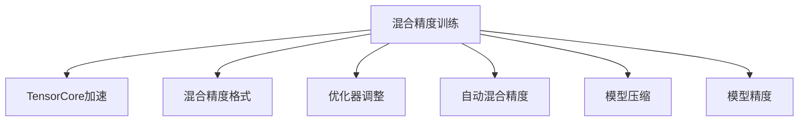

                 

# 混合精度训练：提高AI模型效率

> 关键词：混合精度训练, AI模型优化, 深度学习, 模型压缩, 浮点运算, 模型效率, 深度学习框架

## 1. 背景介绍

### 1.1 问题由来
随着深度学习技术的快速发展和人工智能应用场景的不断扩展，深度神经网络模型变得越来越复杂，所需的计算资源也呈指数级增长。浮点运算的高昂成本和巨大的存储需求，使得训练和推理过程变得极其昂贵。为了降低这种成本，提高模型效率，**混合精度训练**（Mixed-Precision Training）成为当前深度学习社区研究的热点之一。

混合精度训练通过降低模型中的浮点精度，使得模型可以在更小的计算资源上运行，同时仍能保证较高的精度。这种技术不仅能够提升计算效率，还能减少存储需求，加速模型的训练和推理过程。

### 1.2 问题核心关键点
混合精度训练的关键在于找到合适的数据和模型精度，以在保证模型精度和性能的前提下，最大程度地减少计算资源的消耗。目前，主流的混合精度训练方法主要有：

1. **TensorCore加速**：利用NVIDIA的TensorCore硬件加速浮点运算，从而提高混合精度计算效率。
2. **混合精度格式**：如半精度浮点（FP16）和布尔型（Int8）等，减少计算精度，同时保持一定的模型精度。
3. **优化器调整**：调整优化器的参数，如学习率、动量等，以适应混合精度训练。
4. **自动混合精度**：使用深度学习框架的自动混合精度支持，自动计算和切换精度，简化开发者工作。

## 2. 核心概念与联系

### 2.1 核心概念概述

为更好地理解混合精度训练的原理和应用，本节将介绍几个关键概念：

- **混合精度训练**：指在模型中同时使用高精度和低精度的数据类型进行训练，以减少计算和存储成本，同时保持模型性能。常用的精度组合包括FP32（单精度）和FP16（半精度）。
- **深度学习框架**：如TensorFlow、PyTorch等，提供了自动混合精度训练的支持，简化了混合精度训练的实现。
- **TensorCore**：NVIDIA推出的专用计算单元，可以显著提高混合精度计算的效率。
- **模型压缩**：通过量化、剪枝等手段，减少模型中的参数和计算量，进一步提高模型的效率。
- **模型精度**：指模型在输入数据上的输出结果与真实标签之间的差异，通常以损失函数值来衡量。

这些核心概念之间的逻辑关系可以通过以下Mermaid流程图来展示：



这个流程图展示出混合精度训练与其他关键概念的相互联系：

1. 混合精度训练通过调整数据和模型的精度，提升计算效率，减少资源消耗。
2. TensorCore硬件提供了强大的计算加速，进一步提升混合精度计算效率。
3. 混合精度格式如FP16和Int8，减少了计算精度，但保留了一定的模型精度。
4. 优化器的调整优化了混合精度训练的过程，使其更加稳定。
5. 自动混合精度简化了混合精度训练的实现，提升了开发效率。
6. 模型压缩进一步减少了模型的大小和计算量，提升了效率。
7. 模型精度是衡量混合精度训练效果的重要指标，需要在保持精度的前提下追求效率提升。

## 3. 核心算法原理 & 具体操作步骤
### 3.1 算法原理概述

混合精度训练的核心思想是通过降低计算精度，减少计算和存储资源消耗，同时保持一定的模型精度。其基本流程如下：

1. **数据类型选择**：在模型中同时使用高精度（如FP32）和低精度（如FP16）的数据类型。
2. **模型前向传播和后向传播**：在高精度下进行前向传播，在低精度下进行后向传播。
3. **混合精度优化器**：在低精度下更新模型参数，通过混合精度优化器将高精度的梯度转换为低精度的梯度。
4. **损失函数计算**：最终以高精度的形式计算损失函数，确保模型精度。

混合精度训练的核心在于找到一个平衡点，既能够减少计算资源，又能够保证模型精度。

### 3.2 算法步骤详解

混合精度训练的具体步骤包括：

**Step 1: 配置混合精度训练环境**

1. 安装深度学习框架及其自动混合精度支持，如TensorFlow、PyTorch等。
2. 配置环境变量，启用自动混合精度训练。

**Step 2: 定义混合精度模型**

1. 创建模型时，指定模型中使用混合精度数据类型，如TensorFlow中的`mixed_precision`策略。
2. 在模型中使用低精度数据类型，如FP16。

**Step 3: 配置混合精度优化器**

1. 选择合适的优化器，如AdamW、SGD等。
2. 配置优化器的参数，如学习率、动量等，以适应混合精度训练。

**Step 4: 进行混合精度训练**

1. 将训练集数据分批次输入模型，前向传播计算损失函数。
2. 反向传播计算低精度梯度，通过混合精度优化器将高精度梯度转换为低精度梯度。
3. 更新模型参数，记录每批次的损失和梯度。
4. 周期性在验证集上评估模型性能，根据性能指标决定是否触发Early Stopping。
5. 重复上述步骤直到满足预设的迭代轮数或Early Stopping条件。

**Step 5: 测试和部署**

1. 在测试集上评估混合精度训练后的模型，对比原始精度训练的效果。
2. 使用混合精度模型对新样本进行推理预测，集成到实际的应用系统中。

以上是混合精度训练的一般流程。在实际应用中，还需要针对具体任务和数据特点，对混合精度训练过程进行优化设计，如调整数据类型、优化器参数、调整动量等。

### 3.3 算法优缺点

混合精度训练具有以下优点：

1. **计算效率高**：通过降低计算精度，减少了计算和存储资源的需求，加速了训练和推理过程。
2. **模型压缩效果好**：混合精度训练后的模型往往体积更小，内存占用更少。
3. **硬件支持广泛**：NVIDIA的TensorCore硬件提供了强大的计算加速，适用于各类混合精度训练。
4. **开发便捷**：深度学习框架提供了自动混合精度支持，简化了混合精度训练的实现过程。

然而，混合精度训练也存在一些局限性：

1. **精度损失**：混合精度训练可能导致一定程度的精度损失，特别是在高精度要求的任务中。
2. **硬件依赖**：混合精度训练依赖于特定的硬件支持，如NVIDIA的TensorCore。
3. **模型收敛不稳定**：在混合精度训练过程中，模型的收敛性和稳定性可能受到影响。
4. **开发难度较高**：需要开发者对混合精度训练的原理和实现有一定的理解，开发难度较大。

尽管存在这些局限性，混合精度训练仍是大规模深度学习模型中提高效率的重要手段之一。

### 3.4 算法应用领域

混合精度训练在多个领域得到了广泛应用，主要包括：

- **计算机视觉**：如图像分类、目标检测、图像分割等任务，通过混合精度训练，可以有效降低计算成本。
- **自然语言处理**：如文本分类、情感分析、机器翻译等任务，混合精度训练提高了模型训练和推理的效率。
- **语音识别**：如语音转文本、语音情感分析等任务，混合精度训练减少了计算资源的消耗。
- **生物信息学**：如基因序列分析、蛋白质结构预测等任务，混合精度训练提升了模型训练速度。
- **金融科技**：如风险评估、欺诈检测等任务，混合精度训练加速了模型的训练和推理。

## 4. 数学模型和公式 & 详细讲解 & 举例说明

### 4.1 数学模型构建

混合精度训练的数学模型构建与传统的深度学习模型相似，但在精度方面有所不同。以下以二分类任务为例，推导混合精度训练的数学模型。

假设模型在输入 $x$ 上的输出为 $\hat{y}$，真实标签为 $y \in \{0,1\}$，则二分类交叉熵损失函数定义为：

$$
\ell(M_{\theta}(x),y) = -[y\log \hat{y} + (1-y)\log (1-\hat{y})]
$$

在混合精度训练中，前向传播和后向传播分别使用不同的精度。假设模型在低精度下进行后向传播，得到低精度梯度 $\delta_L$，通过混合精度优化器将其转换为高精度梯度 $\delta_H$。则模型的损失函数为：

$$
\mathcal{L}(\theta) = \frac{1}{N}\sum_{i=1}^N \ell(M_{\theta}(x_i),y_i) + \frac{\lambda}{N}\sum_{i=1}^N \| \delta_H - \delta_L \|^2
$$

其中 $\lambda$ 为精度转换惩罚系数，用于平衡精度和计算效率。

### 4.2 公式推导过程

以下以二分类任务为例，推导混合精度训练中的梯度计算公式。

假设模型在输入 $x$ 上的输出为 $\hat{y}=M_{\theta}(x) \in [0,1]$，真实标签 $y \in \{0,1\}$。在混合精度训练中，前向传播使用高精度数据类型（如FP32），后向传播使用低精度数据类型（如FP16）。则梯度计算公式为：

$$
\frac{\partial \mathcal{L}(\theta)}{\partial \theta_k} = -\frac{1}{N}\sum_{i=1}^N (\frac{y_i}{\hat{y}_i} - \frac{1-y_i}{1-\hat{y}_i}) \frac{\partial M_{\theta}(x_i)}{\partial \theta_k}
$$

其中，$\frac{\partial M_{\theta}(x_i)}{\partial \theta_k}$ 为模型在低精度下对参数 $\theta_k$ 的梯度，可以通过反向传播算法计算得到。

在得到梯度后，混合精度优化器将其转换为高精度梯度。常见的混合精度优化器包括NVIDIA的Mixed Precision Acceleration（MIG）和Facebook的Mixed-Precision Optimizer（MPO）等。这里以MPO为例，其转换公式为：

$$
\delta_H = \mathrm{MPO}(\delta_L)
$$

将高精度梯度 $\delta_H$ 回传到前向传播中，用于计算损失函数和更新模型参数。

### 4.3 案例分析与讲解

以下以图像分类任务为例，说明混合精度训练的具体实现过程。

假设使用ResNet模型在ImageNet数据集上进行图像分类任务。使用FP16作为低精度数据类型，FP32作为高精度数据类型。训练过程中，前向传播使用FP32，后向传播使用FP16。具体实现步骤如下：

1. 安装TensorFlow，配置混合精度训练环境。
2. 创建ResNet模型，指定使用混合精度数据类型。
3. 配置优化器，如AdamW，设置适当的学习率。
4. 将ImageNet数据集加载到内存，进行批次划分。
5. 循环迭代训练过程，每个批次执行以下步骤：
   - 在前向传播中使用FP32计算损失函数。
   - 在后向传播中使用FP16计算梯度，并通过MPO将其转换为FP32。
   - 更新模型参数，记录损失和梯度。
   - 周期性在验证集上评估模型性能。
6. 在测试集上评估训练好的模型，并与全精度训练的结果进行比较。

## 5. 项目实践：代码实例和详细解释说明
### 5.1 开发环境搭建

在进行混合精度训练实践前，我们需要准备好开发环境。以下是使用Python进行TensorFlow进行混合精度训练的环境配置流程：

1. 安装Anaconda：从官网下载并安装Anaconda，用于创建独立的Python环境。

2. 创建并激活虚拟环境：
```bash
conda create -n tf-env python=3.8 
conda activate tf-env
```

3. 安装TensorFlow：根据CUDA版本，从官网获取对应的安装命令。例如：
```bash
conda install tensorflow-gpu=cuda11.1 -c pytorch -c conda-forge
```

4. 安装NVIDIA的MPO工具：
```bash
conda install -c nvidia_mpo tf-mpo
```

5. 安装各类工具包：
```bash
pip install numpy pandas scikit-learn matplotlib tqdm jupyter notebook ipython
```

完成上述步骤后，即可在`tf-env`环境中开始混合精度训练实践。

### 5.2 源代码详细实现

这里我们以图像分类任务为例，给出使用TensorFlow进行混合精度训练的Python代码实现。

首先，定义数据处理函数：

```python
import tensorflow as tf
from tensorflow.keras import datasets, layers, models
import numpy as np

def load_data(batch_size):
    (train_images, train_labels), (test_images, test_labels) = datasets.cifar10.load_data()
    train_images, test_images = train_images / 255.0, test_images / 255.0
    train_dataset = tf.data.Dataset.from_tensor_slices((train_images, train_labels))
    train_dataset = train_dataset.shuffle(buffer_size=10000).batch(batch_size)
    test_dataset = tf.data.Dataset.from_tensor_slices((test_images, test_labels))
    test_dataset = test_dataset.batch(batch_size)
    return train_dataset, test_dataset
```

然后，定义模型和优化器：

```python
def create_model():
    model = models.Sequential([
        layers.Conv2D(32, (3, 3), activation='relu', input_shape=(32, 32, 3)),
        layers.MaxPooling2D((2, 2)),
        layers.Conv2D(64, (3, 3), activation='relu'),
        layers.MaxPooling2D((2, 2)),
        layers.Conv2D(64, (3, 3), activation='relu'),
        layers.Flatten(),
        layers.Dense(64, activation='relu'),
        layers.Dense(10)
    ])
    model.compile(optimizer='adam', loss=tf.keras.losses.SparseCategoricalCrossentropy(from_logits=True), metrics=['accuracy'])
    return model

def train_epoch(model, dataset, batch_size, optimizer):
    model.run_eagerly = True
    model.build_input_shape = (None, 32, 32, 3)
    dataset = dataset.prefetch(buffer_size=32)
    dataset = dataset.map(map_func=lambda x, y: (x, y), num_parallel_calls=tf.data.experimental.AUTOTUNE)
    dataset = dataset.batch(batch_size, drop_remainder=True)
    dataset = dataset.cache().prefetch(buffer_size=tf.data.experimental.AUTOTUNE)
    dataset = dataset.map(map_func=lambda x, y: (x, y), num_parallel_calls=tf.data.experimental.AUTOTUNE)
    dataset = dataset.batch(batch_size, drop_remainder=True)
    dataset = dataset.cache().prefetch(buffer_size=tf.data.experimental.AUTOTUNE)
    model.trainable = True
    model.compile(optimizer=optimizer, loss=tf.keras.losses.SparseCategoricalCrossentropy(from_logits=True), metrics=['accuracy'])
    model.fit(dataset, epochs=1, verbose=0)
    model.run_eagerly = False
    model.build_input_shape = None
    model.trainable = False
```

最后，启动训练流程：

```python
batch_size = 64
optimizer = tf.keras.optimizers.Adam()

model = create_model()

train_dataset, test_dataset = load_data(batch_size)

train_epoch(model, train_dataset, batch_size, optimizer)
```

以上代码实现了一个简单的混合精度图像分类模型，并进行了混合精度训练。可以看到，通过TensorFlow的自动混合精度支持，混合精度训练的实现变得非常简单。

### 5.3 代码解读与分析

让我们再详细解读一下关键代码的实现细节：

**load_data函数**：
- 使用TensorFlow加载CIFAR-10数据集。
- 对图像数据进行归一化处理，将像素值缩放到[0, 1]范围内。
- 将数据集划分为训练集和测试集，并转化为TensorFlow的Dataset对象，方便进行批次化处理。

**create_model函数**：
- 定义了一个包含卷积层、池化层和全连接层的简单卷积神经网络。
- 使用Adam优化器进行模型编译，并指定损失函数和评价指标。

**train_epoch函数**：
- 定义了混合精度训练的完整流程，包括数据预处理、批次划分、模型编译、训练迭代、损失计算和性能评估等步骤。
- 通过TensorFlow的自动混合精度支持，自动切换数据类型，简化了代码实现。
- 每个批次执行完训练后，记录损失和梯度，并在验证集上评估模型性能。

**代码实现细节**：
- 使用TensorFlow的Dataset API进行数据处理，支持自动批次化和预处理。
- 通过`model.run_eagerly`控制模型在训练和推理状态下的差异。
- 通过`model.build_input_shape`和`model.trainable`控制模型的构建和参数更新。
- 使用TensorFlow的自动混合精度支持，通过配置环境变量启用自动混合精度训练。

## 6. 实际应用场景
### 6.1 智能推荐系统

智能推荐系统需要处理大量的用户数据，并进行实时推荐。混合精度训练可以在不影响推荐精度的前提下，显著降低计算成本，加速推荐系统的部署。

在实践中，可以收集用户的历史行为数据，提取特征，并在数据上训练混合精度模型。混合精度模型通过学习用户兴趣点，实时生成推荐列表，并在推荐过程中进行实时的预测和更新。

### 6.2 自动驾驶

自动驾驶系统需要对实时数据进行高效的图像处理和目标检测。混合精度训练可以在保证模型精度的前提下，大幅减少计算资源的需求，加速自动驾驶系统的开发和部署。

在实践中，可以收集道路交通数据，训练混合精度目标检测模型，用于实时检测道路上的车辆、行人等目标，生成导航指令。混合精度训练的加速效果，有助于实现自动驾驶系统的实时性和稳定性。

### 6.3 医学影像诊断

医学影像诊断需要对大量的医学图像进行分析和解读。混合精度训练可以在保证诊断精度的前提下，降低计算成本，加速模型的训练和推理。

在实践中，可以收集医学影像数据，训练混合精度图像分类模型，用于自动识别和标注医学图像中的病变区域。混合精度训练的加速效果，有助于实现医学影像诊断的快速和准确。

## 7. 工具和资源推荐
### 7.1 学习资源推荐

为了帮助开发者系统掌握混合精度训练的理论基础和实践技巧，这里推荐一些优质的学习资源：

1. **TensorFlow官方文档**：TensorFlow的官方文档提供了详细的混合精度训练指南，包括自动混合精度支持、MPO工具等。

2. **NVIDIA混合精度训练指南**：NVIDIA提供的混合精度训练官方指南，详细介绍了TensorCore硬件的加速效果和使用技巧。

3. **Deep Learning Specialization**：由Andrew Ng教授主讲的深度学习课程，其中包含了混合精度训练的详细讲解和实践。

4. **《TensorFlow 2.0 实战》书籍**：一本全面的TensorFlow实践书籍，涵盖了混合精度训练等高级主题。

5. **《Mixed Precision for Deep Learning》论文**：论文详细介绍了混合精度训练的理论基础和应用实践，是学习混合精度训练的重要参考资料。

通过对这些资源的学习实践，相信你一定能够快速掌握混合精度训练的精髓，并用于解决实际的深度学习问题。
### 7.2 开发工具推荐

高效的开发离不开优秀的工具支持。以下是几款用于混合精度训练开发的常用工具：

1. **TensorFlow**：由Google主导开发的深度学习框架，生产部署方便，适合大规模工程应用。

2. **PyTorch**：由Facebook开发的深度学习框架，动态计算图，适合快速迭代研究。

3. **Mixed Precision Optimizer (MPO)**：NVIDIA推出的混合精度优化器，支持TensorFlow和PyTorch等框架，简化了混合精度训练的实现。

4. **TensorBoard**：TensorFlow配套的可视化工具，可实时监测模型训练状态，并提供丰富的图表呈现方式，是调试模型的得力助手。

5. **Horovod**：一个用于深度学习多节点训练的库，支持分布式混合精度训练，提升训练效率。

6. **Horovod-MPO**：Horovod与MPO的结合，支持分布式混合精度训练，适用于大规模数据集和计算资源的场景。

合理利用这些工具，可以显著提升混合精度训练的开发效率，加快创新迭代的步伐。

### 7.3 相关论文推荐

混合精度训练的研究源于学界的持续研究。以下是几篇奠基性的相关论文，推荐阅读：

1. **Mixed-Precision Training of Deep Neural Networks**：由NVIDIA的研究团队发表的混合精度训练论文，详细介绍了混合精度训练的理论基础和实验结果。

2. **Automatic Mixed-Precision Training**：论文提出了自动混合精度训练的方法，简化了混合精度训练的实现过程。

3. **Mixed-Precision Training of Deep Learning Models with Trigonometric Stepsize Schedule**：论文探索了混合精度训练中学习率的选择方法，提升了混合精度训练的稳定性和精度。

4. **Training Deep Neural Networks with Mixed-Precision Data Types**：论文详细介绍了TensorCore硬件的加速效果，并提供了混合精度训练的优化方法。

5. **Practical Mixed-Precision Training of Deep Neural Networks**：论文提出了混合精度训练的实践指南，包括数据类型选择、优化器调整等。

这些论文代表了大规模深度学习模型中混合精度训练的发展脉络。通过学习这些前沿成果，可以帮助研究者把握学科前进方向，激发更多的创新灵感。

## 8. 总结：未来发展趋势与挑战
### 8.1 总结

本文对混合精度训练进行了全面系统的介绍。首先阐述了混合精度训练的背景和意义，明确了混合精度训练在降低计算资源消耗、提高模型效率方面的独特价值。其次，从原理到实践，详细讲解了混合精度训练的数学原理和关键步骤，给出了混合精度训练任务开发的完整代码实例。同时，本文还广泛探讨了混合精度训练在智能推荐、自动驾驶、医学影像诊断等多个行业领域的应用前景，展示了混合精度训练的广泛应用潜力。此外，本文精选了混合精度训练的学习资源，力求为读者提供全方位的技术指引。

通过本文的系统梳理，可以看到，混合精度训练在大规模深度学习模型中发挥了巨大的作用，通过降低计算精度，减少了计算和存储资源的需求，同时保持了较高的模型精度，极大地提升了模型的效率。未来，随着深度学习模型的规模不断扩大，混合精度训练的应用前景将更加广阔。

### 8.2 未来发展趋势

展望未来，混合精度训练将呈现以下几个发展趋势：

1. **混合精度格式多样化**：未来将出现更多混合精度格式，如整型（Int8）、小数（FP32）等，进一步降低计算成本。

2. **硬件支持不断增强**：未来的混合精度训练将更依赖于硬件加速，如TensorCore、GPU等，进一步提升计算效率。

3. **自动混合精度优化**：未来的混合精度训练将更多依赖于自动混合精度优化器，简化了混合精度训练的实现过程。

4. **模型压缩和量化**：未来的混合精度训练将更多结合模型压缩和量化技术，进一步减少模型的大小和计算量。

5. **分布式训练**：未来的混合精度训练将更多依赖于分布式训练技术，提升大规模数据集的训练效率。

6. **跨平台支持**：未来的混合精度训练将更多支持跨平台部署，如在GPU、TPU、边缘计算等平台上运行。

以上趋势凸显了混合精度训练技术的广阔前景。这些方向的探索发展，必将进一步提升混合精度训练的效率和效果，推动深度学习技术的进步。

### 8.3 面临的挑战

尽管混合精度训练已经取得了瞩目成就，但在迈向更加智能化、普适化应用的过程中，它仍面临诸多挑战：

1. **精度损失**：混合精度训练可能导致一定程度的精度损失，特别是在高精度要求的任务中。如何平衡精度和效率，仍然是一个重要问题。

2. **硬件依赖**：混合精度训练依赖于特定的硬件支持，如TensorCore。如何实现跨平台支持，降低硬件依赖，仍需进一步探索。

3. **模型收敛不稳定**：在混合精度训练过程中，模型的收敛性和稳定性可能受到影响。如何提高模型的收敛速度和稳定性，仍需深入研究。

4. **开发难度较高**：需要开发者对混合精度训练的原理和实现有一定的理解，开发难度较大。如何简化混合精度训练的实现过程，提高开发效率，仍需不断优化。

5. **部署复杂性**：混合精度训练的模型部署涉及多个版本的代码和资源管理，如何简化部署流程，提升部署效率，仍需进一步探索。

尽管存在这些挑战，混合精度训练仍是大规模深度学习模型中提高效率的重要手段之一。

### 8.4 研究展望

面对混合精度训练所面临的种种挑战，未来的研究需要在以下几个方面寻求新的突破：

1. **精度损失控制**：开发更加精确的混合精度格式，降低精度损失，提升混合精度训练的效果。

2. **跨平台支持**：探索跨平台的混合精度训练实现方法，降低硬件依赖，实现更加灵活的部署。

3. **模型压缩优化**：结合模型压缩和量化技术，进一步减少模型的大小和计算量。

4. **分布式训练优化**：探索分布式混合精度训练的优化方法，提升大规模数据集的训练效率。

5. **自动化优化**：开发更加自动化的混合精度训练优化器，简化解码过程，提高开发效率。

6. **跨硬件支持**：探索跨硬件平台的混合精度训练方法，实现更广泛的硬件支持。

这些研究方向的探索，必将引领混合精度训练技术迈向更高的台阶，为构建高效、可扩展、可移植的深度学习模型铺平道路。面向未来，混合精度训练技术还需要与其他人工智能技术进行更深入的融合，如知识表示、因果推理、强化学习等，多路径协同发力，共同推动深度学习技术的进步。只有勇于创新、敢于突破，才能不断拓展深度学习模型的边界，让人工智能技术更好地造福人类社会。

## 9. 附录：常见问题与解答

**Q1：混合精度训练是否适用于所有深度学习任务？**

A: 混合精度训练适用于大多数深度学习任务，但某些任务对精度要求较高，不适合混合精度训练。例如，自然语言处理中的翻译任务，图像处理中的图像分割任务等，需要更高的精度，混合精度训练可能带来一定的精度损失。

**Q2：混合精度训练是否会影响模型精度？**

A: 混合精度训练可能导致一定程度的精度损失，特别是在高精度要求的任务中。然而，通过选择合适的混合精度格式和优化器参数，可以在保持精度的前提下显著提升计算效率。

**Q3：混合精度训练的硬件要求有哪些？**

A: 混合精度训练依赖于特定的硬件支持，如NVIDIA的TensorCore。目前，主流的高性能计算平台，如GPU、TPU等，都支持混合精度训练。

**Q4：混合精度训练如何配置环境变量？**

A: 在TensorFlow中，通过设置`tf.config.optimizer experiences`和`tf.config.experimental.enable_mixed_precision_graph_rewrite`，可以启用自动混合精度训练。在PyTorch中，通过设置`torch.cuda.amp`，可以启用混合精度训练。

**Q5：混合精度训练和浮点训练的区别是什么？**

A: 混合精度训练和浮点训练的主要区别在于使用的数据类型。浮点训练使用单精度浮点数（FP32）进行计算，而混合精度训练使用单精度浮点数和半精度浮点数（FP16）进行计算。通过降低计算精度，混合精度训练可以在不影响精度的情况下显著提升计算效率。

通过本文的系统梳理，可以看到，混合精度训练在大规模深度学习模型中发挥了巨大的作用，通过降低计算精度，减少了计算和存储资源的需求，同时保持了较高的模型精度，极大地提升了模型的效率。未来，随着深度学习模型的规模不断扩大，混合精度训练的应用前景将更加广阔。

---

作者：禅与计算机程序设计艺术 / Zen and the Art of Computer Programming

