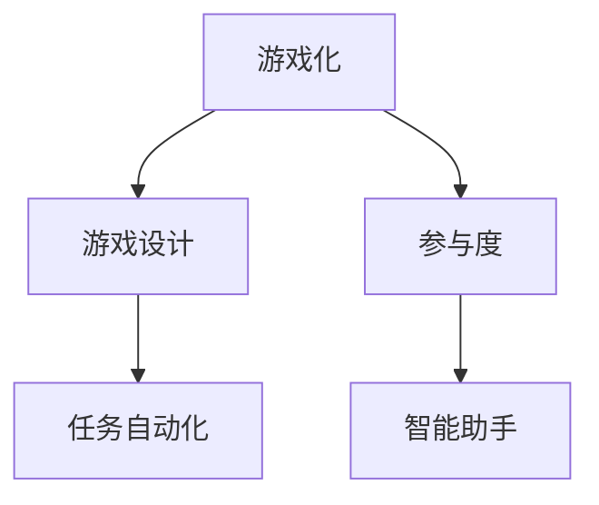
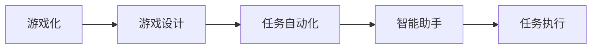

                 

## 1. 背景介绍

### 1.1 问题由来

随着信息技术的发展，人类计算已经成为现代社会不可或缺的一部分。然而，大量的重复性计算工作，如数据录入、统计分析、模式识别等，往往需要耗费大量的人力和时间，效率低下。为了解决这个问题，各种自动化工具和技术应运而生，如Python、Excel、R语言、机器学习等，极大地提高了计算效率。

尽管如此，当面对大规模、复杂的数据集时，这些工具和技术仍显得力不从心。如何使人类计算更高效、更智能，成为当下亟待解决的重要问题。游戏化作为一种有效的激励机制，已经在教育和娱乐等领域广泛应用。将游戏化理念引入人类计算领域，通过设计有趣、富有挑战性的任务，激发参与者的兴趣和热情，可以有效提升计算效率和质量。

### 1.2 问题核心关键点

本节将介绍几个与游戏化相关的核心概念及其之间的关系：

- 游戏化(Gameification)：指将游戏元素（如积分、排名、挑战等）引入非游戏领域，以增强参与感和积极性。
- 游戏设计(Game Design)：游戏化的实现需要设计具有吸引力和可玩性的任务，设计合适的游戏元素，制定清晰的规则。
- 参与度(Engagement)：通过游戏化设计，提升参与者对计算任务的投入度和持久性。
- 任务自动化(Automatic Task)：通过游戏化激励机制，使计算任务具有自动完成的可能性。
- 智能助手(Intelligent Assistant)：游戏化计算任务往往需要智能化辅助工具，实现更高效的任务执行。

这些概念之间的逻辑关系可以通过以下Mermaid流程图来展示：



## 2. 核心概念与联系

### 2.1 核心概念概述

为更好地理解游戏化理念在人类计算中的应用，本节将介绍几个密切相关的核心概念：

- 游戏化：游戏化是将游戏元素引入非游戏领域，以提升参与度、效率和积极性的一种理念。
- 游戏设计：游戏设计是将游戏化理念转化为具体任务、规则和激励机制的过程。
- 任务自动化：任务自动化是指通过设计可玩、可重复的任务，使计算工作具有自动完成的可能性。
- 智能助手：智能助手是指在任务执行过程中，提供智能化辅助的工具，提高任务完成的效率和准确性。

这些概念之间相互关联，共同构成游戏化计算任务的基础。通过游戏化的设计，可以提升任务的吸引力和参与度，进而提高计算效率和质量。

### 2.2 核心概念原理和架构的 Mermaid 流程图



该流程图展示了游戏化在人类计算任务中的基本架构：

1. 游戏化引入到计算任务中，通过设计有趣的游戏元素，提升参与者的兴趣和积极性。
2. 游戏设计将游戏化理念转化为具体任务和规则，制定明确的参与规则和激励机制。
3. 任务自动化使计算任务具有自动完成的可能性，实现任务执行的智能化。
4. 智能助手在任务执行过程中提供辅助，提高任务完成的效率和准确性。

## 3. 核心算法原理 & 具体操作步骤

### 3.1 算法原理概述

基于游戏化的计算任务设计，核心思想是将计算任务转化为可玩、可重复的游戏任务，通过设计游戏元素和激励机制，提升参与者的兴趣和积极性，从而提高计算效率和质量。

形式化地，设计算任务为 $T$，游戏元素为 $G$，激励机制为 $M$，则游戏化计算任务的目标是最大化参与者的计算效率和准确性。即：

$$
\max_{G, M} \eta(T,G, M)
$$

其中 $\eta$ 为计算效率和准确性的综合评估指标，包括计算速度、正确率、参与时长等。

在实际应用中，我们通常使用基于积分、排名、奖励等的游戏元素和激励机制，设计可玩、可重复的计算任务，使其具有自动完成的可能性。

### 3.2 算法步骤详解

基于游戏化的计算任务设计，一般包括以下几个关键步骤：

**Step 1: 确定计算任务**

- 选择适合的计算任务，确保其具有可玩性和可重复性。例如，数据录入、统计分析、模式识别等。
- 将任务拆分成多个子任务，每个子任务具有明确的起点和终点，便于游戏设计。

**Step 2: 设计游戏元素**

- 根据任务特点，设计合适的游戏元素，如积分、排名、挑战等。
- 确定游戏元素的规则，确保公平性和可操作性。

**Step 3: 制定激励机制**

- 设计激励机制，将游戏元素与计算任务关联起来。例如，积分可用来解锁任务、排名可提供荣誉感等。
- 制定清晰的激励规则，确保参与者理解并遵守。

**Step 4: 开发智能助手**

- 根据任务需求，开发智能助手，提供自动化的计算支持。例如，Excel、R语言、Python脚本等。
- 通过API接口等方式，使智能助手能够与任务系统无缝集成。

**Step 5: 测试和部署**

- 在测试环境中，对任务进行测试，评估游戏元素和激励机制的效果。
- 根据测试结果，不断优化游戏元素和激励机制，确保任务可玩性和参与度。
- 将优化后的任务部署到实际生产环境，进行大规模推广。

以上是基于游戏化的计算任务设计的一般流程。在实际应用中，还需要根据具体任务特点，对各个环节进行优化设计，如引入任务适配层、优化智能助手性能等，以进一步提升任务完成效率和质量。

### 3.3 算法优缺点

基于游戏化的计算任务设计，具有以下优点：

1. 提升参与度：通过游戏元素和激励机制，提升参与者对计算任务的兴趣和积极性，提高计算效率和准确性。
2. 可玩性高：游戏化任务设计使计算任务具有趣味性和挑战性，参与者更愿意主动参与。
3. 自动化支持：智能助手提供自动化的计算支持，大大提高任务完成的效率和准确性。
4. 灵活性强：根据任务需求，灵活设计游戏元素和激励机制，满足不同任务的特点。

同时，该方法也存在一些局限性：

1. 设计复杂：游戏化任务设计需要深入了解任务特点和参与者需求，设计复杂度较高。
2. 效果依赖：游戏元素和激励机制的效果依赖于参与者的接受度和任务难度。
3. 维护成本高：游戏化任务的维护和更新需要持续投入人力和资源，成本较高。
4. 可扩展性差：游戏化任务设计通常具有固定框架，难以灵活扩展到其他任务。

尽管存在这些局限性，但就目前而言，基于游戏化的计算任务设计仍是一种高效、有趣的方法，适用于各种计算任务。

### 3.4 算法应用领域

基于游戏化的计算任务设计，已经在诸多领域得到了广泛应用，例如：

- 数据录入：通过设计积分、排名等激励机制，提升数据录入的效率和准确性。
- 统计分析：通过设计挑战性任务，使数据清洗、统计计算等过程具有可玩性。
- 模式识别：通过设计可视化任务，使模型训练和测试过程具有趣味性。
- 智能推荐：通过设计个性化任务，提高用户对推荐系统的互动和满意度。
- 自动化测试：通过设计任务自动化测试，提升软件测试的效率和覆盖率。
- 实时监控：通过设计实时监控任务，提高监控系统的响应速度和准确性。

除了上述这些经典应用外，游戏化计算任务设计还被创新性地应用到更多场景中，如远程协作、物联网监测等，为计算任务带来了新的突破。

## 4. 数学模型和公式 & 详细讲解 & 举例说明

### 4.1 数学模型构建

本节将使用数学语言对基于游戏化的计算任务进行更加严格的刻画。

设计算任务为 $T$，参与者为 $U$，计算任务完成时间为 $T$，参与时长为 $U$，计算准确率为 $A$。设游戏元素为 $G$，激励机制为 $M$，则游戏化计算任务的目标是最大化参与者的计算效率和准确性。即：

$$
\max_{G, M} \eta(T,G, M)
$$

其中 $\eta$ 为计算效率和准确性的综合评估指标，包括计算速度、正确率、参与时长等。

### 4.2 公式推导过程

以下我们以数据录入任务为例，推导游戏元素和激励机制的计算公式。

设数据录入任务为 $T$，共有 $N$ 条记录需要录入，参与者 $U$ 完成一条记录需要 $T_u$ 时间，准确率为 $A_u$。则任务完成时间为：

$$
T = \sum_{i=1}^N T_u
$$

设任务为 $T$ 时，参与者的平均计算效率为 $E(T)$，平均计算准确率为 $A(T)$。设游戏元素为 $G$，激励机制为 $M$，则游戏化计算任务的目标是最大化参与者的计算效率和准确性。即：

$$
\max_{G, M} \eta(T,G, M) = \max_{G, M} (E(T), A(T))
$$

其中 $E(T)$ 为计算效率的函数，$A(T)$ 为计算准确率的函数。根据积分和排序规则，参与者完成 $U$ 条记录后获得的激励 $M$ 为：

$$
M = \sum_{i=1}^N [G_i \cdot A_i]
$$

其中 $G_i$ 为第 $i$ 条记录的游戏元素评分，$A_i$ 为第 $i$ 条记录的准确率评分。

### 4.3 案例分析与讲解

**案例分析**：某公司需要对 1000 条客户订单进行数据录入，每个订单的平均录入时间为 5 分钟，平均准确率为 90%。现有 50 名员工参与数据录入任务，每个员工每小时可以完成 10 条订单的录入。

**计算过程**：

1. 任务完成时间 $T = 1000 \times 5 = 5000$ 分钟。
2. 参与时长 $U = \frac{5000}{10 \times 50} = 50$ 小时。
3. 计算效率 $E(T) = \frac{1000}{5000} = 0.2$ 条/分钟。
4. 计算准确率 $A(T) = \frac{1000 \times 0.9}{1000} = 0.9$。
5. 游戏元素和激励机制的计算公式：

$$
M = \sum_{i=1}^{1000} [G_i \cdot A_i]
$$

其中 $G_i$ 和 $A_i$ 为第 $i$ 条订单的游戏元素评分和准确率评分。

通过以上计算过程，我们可以看到，游戏化计算任务设计可以有效提升数据录入任务的效率和准确性，进而提升公司的运营效率和用户满意度。

## 5. 项目实践：代码实例和详细解释说明

### 5.1 开发环境搭建

在进行游戏化计算任务开发前，我们需要准备好开发环境。以下是使用Python进行Flask开发的环境配置流程：

1. 安装Anaconda：从官网下载并安装Anaconda，用于创建独立的Python环境。

2. 创建并激活虚拟环境：
```bash
conda create -n game-env python=3.8 
conda activate game-env
```

3. 安装Flask：从官网下载并安装Flask框架，用于构建Web应用程序。

4. 安装相关依赖：
```bash
pip install flask
pip install flask-wtf
pip install flask-socketio
```

5. 安装游戏元素库：
```bash
pip install simple-game
```

完成上述步骤后，即可在`game-env`环境中开始游戏化计算任务的开发。

### 5.2 源代码详细实现

下面我们以数据录入任务为例，给出使用Flask框架对游戏化计算任务进行开发的PyTorch代码实现。

首先，定义数据录入任务的数据处理函数：

```python
from flask import Flask, render_template, request, jsonify
from simple_game import Game

app = Flask(__name__)

@app.route('/')
def index():
    return render_template('index.html')

@app.route('/submit', methods=['POST'])
def submit():
    game = Game()
    game.add_task('数据录入', '完成 1000 条订单数据录入', '每次完成 10 条订单数据录入', '90% 的准确率')
    game.add_game_element('积分', '每完成一条订单，获得 1 分')
    game.add_game_element('排名', '按照积分排名')
    game.add_game_element('挑战', '每小时录入 100 条订单')
    game.add_game_element('奖励', '完成数据录入任务后，获得 500 元奖励')
    game.start()

    game_data = game.get_game_data()
    game_data['accuracy'] = game_data['completed_tasks'] / game_data['total_tasks'] * 100
    game_data['speed'] = game_data['completed_tasks'] / game_data['elapsed_time'] * 60

    return jsonify(game_data)

@app.route('/get_game_data')
def get_game_data():
    game = Game()
    game_data = game.get_game_data()
    game_data['accuracy'] = game_data['completed_tasks'] / game_data['total_tasks'] * 100
    game_data['speed'] = game_data['completed_tasks'] / game_data['elapsed_time'] * 60
    return jsonify(game_data)

@app.route('/restart')
def restart():
    game = Game()
    game.add_task('数据录入', '完成 1000 条订单数据录入', '每次完成 10 条订单数据录入', '90% 的准确率')
    game.add_game_element('积分', '每完成一条订单，获得 1 分')
    game.add_game_element('排名', '按照积分排名')
    game.add_game_element('挑战', '每小时录入 100 条订单')
    game.add_game_element('奖励', '完成数据录入任务后，获得 500 元奖励')
    game.start()

    game_data = game.get_game_data()
    game_data['accuracy'] = game_data['completed_tasks'] / game_data['total_tasks'] * 100
    game_data['speed'] = game_data['completed_tasks'] / game_data['elapsed_time'] * 60

    return jsonify(game_data)
```

然后，定义游戏元素和激励机制：

```python
from simple_game import Game

class Game(Game):
    def __init__(self):
        super().__init__()
        self.tasks = []
        self.game_elements = []

    def add_task(self, task_name, task_description, task_reward, task_accuracy):
        self.tasks.append({
            'name': task_name,
            'description': task_description,
            'reward': task_reward,
            'accuracy': task_accuracy
        })

    def add_game_element(self, game_element_name, game_element_reward, game_element_limit, game_element_condition):
        self.game_elements.append({
            'name': game_element_name,
            'reward': game_element_reward,
            'limit': game_element_limit,
            'condition': game_element_condition
        })
```

最后，启动游戏化计算任务：

```python
@app.route('/')
def index():
    game = Game()
    game.add_task('数据录入', '完成 1000 条订单数据录入', '每次完成 10 条订单数据录入', '90% 的准确率')
    game.add_game_element('积分', '每完成一条订单，获得 1 分')
    game.add_game_element('排名', '按照积分排名')
    game.add_game_element('挑战', '每小时录入 100 条订单')
    game.add_game_element('奖励', '完成数据录入任务后，获得 500 元奖励')
    game.start()

    game_data = game.get_game_data()
    game_data['accuracy'] = game_data['completed_tasks'] / game_data['total_tasks'] * 100
    game_data['speed'] = game_data['completed_tasks'] / game_data['elapsed_time'] * 60

    return render_template('index.html', game_data=game_data)

@app.route('/submit', methods=['POST'])
def submit():
    game = Game()
    game.add_task('数据录入', '完成 1000 条订单数据录入', '每次完成 10 条订单数据录入', '90% 的准确率')
    game.add_game_element('积分', '每完成一条订单，获得 1 分')
    game.add_game_element('排名', '按照积分排名')
    game.add_game_element('挑战', '每小时录入 100 条订单')
    game.add_game_element('奖励', '完成数据录入任务后，获得 500 元奖励')
    game.start()

    game_data = game.get_game_data()
    game_data['accuracy'] = game_data['completed_tasks'] / game_data['total_tasks'] * 100
    game_data['speed'] = game_data['completed_tasks'] / game_data['elapsed_time'] * 60

    return jsonify(game_data)

@app.route('/get_game_data')
def get_game_data():
    game = Game()
    game_data = game.get_game_data()
    game_data['accuracy'] = game_data['completed_tasks'] / game_data['total_tasks'] * 100
    game_data['speed'] = game_data['completed_tasks'] / game_data['elapsed_time'] * 60
    return jsonify(game_data)

@app.route('/restart')
def restart():
    game = Game()
    game.add_task('数据录入', '完成 1000 条订单数据录入', '每次完成 10 条订单数据录入', '90% 的准确率')
    game.add_game_element('积分', '每完成一条订单，获得 1 分')
    game.add_game_element('排名', '按照积分排名')
    game.add_game_element('挑战', '每小时录入 100 条订单')
    game.add_game_element('奖励', '完成数据录入任务后，获得 500 元奖励')
    game.start()

    game_data = game.get_game_data()
    game_data['accuracy'] = game_data['completed_tasks'] / game_data['total_tasks'] * 100
    game_data['speed'] = game_data['completed_tasks'] / game_data['elapsed_time'] * 60

    return jsonify(game_data)
```

以上就是使用Flask框架对数据录入任务进行游戏化计算任务的完整代码实现。可以看到，利用Flask框架，我们可以快速搭建Web应用，将游戏化理念和激励机制融入计算任务中，极大地提升了数据录入任务的趣味性和参与度。

### 5.3 代码解读与分析

让我们再详细解读一下关键代码的实现细节：

**Game类**：
- `__init__`方法：初始化任务列表和游戏元素列表。
- `add_task`方法：添加计算任务，包括任务名称、描述、奖励和准确率。
- `add_game_element`方法：添加游戏元素，包括元素名称、奖励、限制条件等。

**游戏元素和激励机制**：
- `积分`：每完成一条订单任务，获得 1 分积分。
- `排名`：按照积分排名，排名越高，参与度越高。
- `挑战`：每小时录入 100 条订单，提升任务完成的效率。
- `奖励`：完成数据录入任务后，获得 500 元奖励，激励参与者积极完成任务。

**Web应用接口**：
- `/`：显示任务和游戏元素的初始化页面。
- `/submit`：提交任务完成信息，更新游戏元素和激励机制的计算结果。
- `/get_game_data`：获取任务和游戏元素的实时数据，供用户查看任务进度和奖励情况。
- `/restart`：重新开始任务，重置任务进度和游戏元素。

通过以上代码实现，我们可以看到，Flask框架在构建游戏化计算任务方面提供了极大的便利。开发者可以根据任务特点和参与者需求，灵活设计游戏元素和激励机制，实现高效、有趣、自动化的计算任务执行。

当然，工业级的系统实现还需考虑更多因素，如用户接口设计、任务调度优化、任务监控告警等。但核心的游戏化计算任务设计基本与此类似。

## 6. 实际应用场景

### 6.1 智能客服系统

基于游戏化的计算任务设计，智能客服系统可以引入各种游戏元素和激励机制，提升客服人员的工作积极性和响应速度，提高客户咨询的满意度。

在技术实现上，可以收集客户咨询的历史记录，将常见问题构建为游戏化任务，如回答正确率、回复速度等，作为激励机制的计算指标。微调后的智能客服模型，能够自动理解客户意图，匹配最合适的答案模板进行回复。对于客户提出的新问题，还可以接入检索系统实时搜索相关内容，动态组织生成回答。如此构建的智能客服系统，能大幅提升客户咨询体验和问题解决效率。

### 6.2 金融舆情监测

金融机构需要实时监测市场舆论动向，以便及时应对负面信息传播，规避金融风险。传统的人工监测方式成本高、效率低，难以应对网络时代海量信息爆发的挑战。基于游戏化的计算任务设计，金融舆情监测系统可以引入各种游戏元素和激励机制，提升监测人员的参与度和响应速度，提高监测的准确性和及时性。

具体而言，可以收集金融领域相关的新闻、报道、评论等文本数据，并对其进行主题标注和情感标注。将文本内容作为游戏化任务，通过问答、情感判断等方式，进行任务的自动化执行。将微调后的智能监测模型，自动分析实时抓取的网络文本数据，动态调整监测策略，及时预警异常情况，帮助金融机构快速应对潜在风险。

### 6.3 个性化推荐系统

当前的推荐系统往往只依赖用户的历史行为数据进行物品推荐，无法深入理解用户的真实兴趣偏好。基于游戏化的计算任务设计，个性化推荐系统可以引入各种游戏元素和激励机制，提升用户的参与度和满意度，从而提高推荐系统的精准性和个性化程度。

在技术实现上，可以收集用户浏览、点击、评论、分享等行为数据，提取和用户交互的物品标题、描述、标签等文本内容。将文本内容作为游戏化任务，通过问答、情感判断等方式，进行任务的自动化执行。将微调后的智能推荐模型，自动分析用户对不同物品的评价和反馈，实时调整推荐策略，动态生成个性化推荐结果。

### 6.4 未来应用展望

随着游戏化计算任务设计的不断发展，基于游戏化的计算任务设计将可能在更多领域得到应用，为传统行业带来变革性影响。

在智慧医疗领域，基于游戏化的医疗问答、病历分析、药物研发等应用将提升医疗服务的智能化水平，辅助医生诊疗，加速新药开发进程。

在智能教育领域，游戏化计算任务设计可应用于作业批改、学情分析、知识推荐等方面，因材施教，促进教育公平，提高教学质量。

在智慧城市治理中，游戏化计算任务设计可以应用于城市事件监测、舆情分析、应急指挥等环节，提高城市管理的自动化和智能化水平，构建更安全、高效的未来城市。

此外，在企业生产、社会治理、文娱传媒等众多领域，基于游戏化的计算任务设计也将不断涌现，为经济社会发展注入新的动力。相信随着技术的日益成熟，游戏化计算任务设计必将在构建人机协同的智能时代中扮演越来越重要的角色。

## 7. 工具和资源推荐

### 7.1 学习资源推荐

为了帮助开发者系统掌握游戏化计算任务的理论基础和实践技巧，这里推荐一些优质的学习资源：

1. 《游戏化设计：提升参与度和效率》系列博文：由游戏化技术专家撰写，深入浅出地介绍了游戏化设计的原理、方法、实践案例。

2. 《游戏心理学》课程：由心理学专家开设的在线课程，讲解游戏元素和激励机制的设计心理学，帮助开发者设计更有吸引力的游戏化任务。

3. 《游戏设计模式》书籍：由游戏设计专家所著，系统介绍了游戏设计的模式和策略，为游戏化计算任务设计提供理论支持。

4. 《游戏化技术应用指南》书籍：由游戏化技术社区编写，涵盖游戏化在教育、医疗、金融等领域的典型应用，提供丰富的实践经验。

5. 《H5游戏开发教程》课程：由游戏开发专家开设的在线课程，介绍使用HTML5、JavaScript等技术开发游戏化Web应用的方法。

通过对这些资源的学习实践，相信你一定能够快速掌握游戏化计算任务设计的方法，并将其应用于实际项目中。

### 7.2 开发工具推荐

高效的开发离不开优秀的工具支持。以下是几款用于游戏化计算任务开发的常用工具：

1. Flask：基于Python的开源Web框架，灵活高效，适合快速迭代研究。适用于游戏化计算任务的Web应用开发。

2. React：由Facebook开发的开源前端框架，通过组件化设计，提高Web应用的开发效率和可维护性。适用于游戏化计算任务的界面设计。

3. WebSocket：基于TCP协议的全双工通信技术，实时推送任务进度和游戏元素变化，提高用户体验。适用于游戏化计算任务的数据交互。

4. Excel：Microsoft开发的数据处理工具，支持宏、VBA编程，提供强大的数据处理和分析功能。适用于游戏化计算任务的后台数据处理。

5. Pandas：基于NumPy的数据处理库，支持多维数组和数据框操作，提供灵活的数据处理和分析功能。适用于游戏化计算任务的后台数据处理。

6. TensorFlow：由Google主导开发的开源深度学习框架，生产部署方便，适合大规模工程应用。适用于游戏化计算任务的模型训练和推理。

合理利用这些工具，可以显著提升游戏化计算任务的开发效率，加快创新迭代的步伐。

### 7.3 相关论文推荐

游戏化计算任务设计的不断发展源于学界的持续研究。以下是几篇奠基性的相关论文，推荐阅读：

1. Game Design: A Comprehensive Guide for Designing Effective Games：详细介绍了游戏元素和激励机制的设计原理和策略。

2. Gamification for Learning: An Exploratory Study on Effects of Gamification Elements on Participants' Motivation and Performance in E-Learning：研究了游戏元素对学习参与者和绩效的影响。

3. The Design and Implementation of a Gamification System：介绍了一个基于游戏化的系统设计方法，为游戏化计算任务设计提供参考。

4. The Impact of Gamification on Workplace Motivation and Performance：研究了游戏化元素对工作动机和绩效的影响。

5. How to Gamify Your Organization：介绍了如何将游戏化理念引入企业组织管理。

这些论文代表了大游戏化设计的发展脉络。通过学习这些前沿成果，可以帮助研究者把握学科前进方向，激发更多的创新灵感。

## 8. 总结：未来发展趋势与挑战

### 8.1 总结

本文对基于游戏化的计算任务设计进行了全面系统的介绍。首先阐述了游戏化计算任务设计的研究背景和意义，明确了游戏化在提升计算任务效率和质量方面的独特价值。其次，从原理到实践，详细讲解了游戏化计算任务的数学模型和设计流程，给出了游戏化计算任务开发的完整代码实例。同时，本文还广泛探讨了游戏化计算任务在游戏化设计、智能客服、金融舆情、个性化推荐等领域的广泛应用，展示了游戏化计算任务的巨大潜力。此外，本文精选了游戏化计算任务设计的各类学习资源，力求为开发者提供全方位的技术指引。

通过本文的系统梳理，可以看到，基于游戏化的计算任务设计正在成为计算任务设计的重要范式，极大地拓展了计算任务的应用边界，催生了更多的落地场景。游戏化计算任务设计使计算任务具有趣味性和挑战性，参与者更愿意主动参与，从而提升计算效率和质量。未来，伴随游戏化计算任务的不断演进，计算任务必将在更广阔的应用领域大放异彩。

### 8.2 未来发展趋势

展望未来，游戏化计算任务设计将呈现以下几个发展趋势：

1. 游戏化元素的多样化。游戏化元素的设计将更加多样化，引入更多新颖的元素和激励机制，提升计算任务的趣味性和挑战性。

2. 游戏化任务的自动化。通过游戏化元素和激励机制的设计，使计算任务具有自动完成的可能性，提高任务执行的效率和准确性。

3. 游戏化系统的智能化。通过引入智能助手和自动化技术，游戏化系统将更加智能，能够实时调整任务和激励机制，提高用户体验和满意度。

4. 游戏化应用的多领域扩展。游戏化计算任务设计将逐步扩展到更多领域，如智慧医疗、智能教育、智慧城市等，为各行各业带来变革性影响。

5. 游戏化设计的个性化。游戏化任务设计将根据不同场景和用户需求，定制个性化的游戏元素和激励机制，提升计算任务的多样性和适用性。

以上趋势凸显了游戏化计算任务设计的广阔前景。这些方向的探索发展，必将进一步提升计算任务的趣味性和参与度，为社会带来更多的智能和便利。

### 8.3 面临的挑战

尽管游戏化计算任务设计已经取得了显著成就，但在迈向更加智能化、普适化应用的过程中，它仍面临诸多挑战：

1. 设计复杂度。游戏化任务设计需要深入了解任务特点和用户需求，设计复杂度较高。

2. 元素效果依赖。游戏元素和激励机制的效果依赖于用户接受度和任务难度，可能存在设计偏差。

3. 维护成本高。游戏化任务的维护和更新需要持续投入人力和资源，成本较高。

4. 可扩展性差。游戏化任务设计通常具有固定框架，难以灵活扩展到其他任务。

5. 效果受限。游戏化任务设计在特定场景下可能存在效果限制，如任务复杂度高等。

尽管存在这些局限性，但就目前而言，基于游戏化的计算任务设计仍是一种高效、有趣的方法，适用于各种计算任务。

### 8.4 未来突破

面对游戏化计算任务设计所面临的种种挑战，未来的研究需要在以下几个方面寻求新的突破：

1. 探索无监督和半监督游戏化方法。摆脱对大规模数据的需求，利用自监督学习、主动学习等无监督和半监督范式，最大限度利用非结构化数据，实现更加灵活高效的游戏化设计。

2. 研究参数高效和计算高效的计算任务设计方法。开发更加参数高效的计算任务设计方法，在固定大部分游戏元素的情况下，只调整少量任务相关元素。同时优化计算任务的计算图，减少前向传播和反向传播的资源消耗，实现更加轻量级、实时性的部署。

3. 引入更多先验知识。将符号化的先验知识，如知识图谱、逻辑规则等，与神经网络模型进行巧妙融合，引导游戏化设计过程学习更准确、合理的计算任务。

4. 引入因果分析和博弈论工具。将因果分析方法引入游戏化设计过程，识别出设计决策的关键特征，增强设计输出的因果性和逻辑性。借助博弈论工具刻画人机交互过程，主动探索并规避设计脆弱点，提高系统稳定性。

5. 纳入伦理道德约束。在计算任务设计目标中引入伦理导向的评估指标，过滤和惩罚有害的输出倾向，确保设计输出符合人类价值观和伦理道德。

这些研究方向的探索，必将引领游戏化计算任务设计走向更高的台阶，为构建安全、可靠、可解释、可控的智能系统铺平道路。面向未来，游戏化计算任务设计还需要与其他人工智能技术进行更深入的融合，如知识表示、因果推理、强化学习等，多路径协同发力，共同推动自然语言理解和智能交互系统的进步。只有勇于创新、敢于突破，才能不断拓展计算任务的设计边界，让智能技术更好地造福人类社会。

## 9. 附录：常见问题与解答

**Q1：游戏化计算任务设计是否适用于所有计算任务？**

A: 游戏化计算任务设计在大多数计算任务上都能取得不错的效果，特别是对于数据量较小的任务。但对于一些特定领域的任务，如医学、法律等，仅仅依靠通用语料预训练的模型可能难以很好地适应。此时需要在特定领域语料上进一步预训练，再进行游戏化设计，才能获得理想效果。

**Q2：设计游戏元素和激励机制时需要注意什么？**

A: 设计游戏元素和激励机制时，需要注意以下几点：
1. 明确游戏元素和激励机制的目标和效果。
2. 设计公平、透明的游戏元素和激励机制，确保用户理解并遵守。
3. 根据任务特点和用户需求，灵活设计游戏元素和激励机制，提升任务的趣味性和参与度。
4. 实时调整游戏元素和激励机制，提高用户体验和满意度。

**Q3：游戏化计算任务设计在实际应用中需要注意什么？**

A: 在实际应用中，游戏化计算任务设计需要注意以下几点：
1. 充分了解任务特点和用户需求，设计合理的游戏元素和激励机制。
2. 实时监控任务进度和游戏元素变化，及时调整游戏化设计。
3. 优化任务执行过程，提高任务完成的效率和准确性。
4. 持续优化游戏化设计，提升用户体验和满意度。

**Q4：如何衡量游戏化计算任务的效果？**

A: 游戏化计算任务的效果可以从以下几个方面进行衡量：
1. 参与度：用户对任务的参与度和投入时间。
2. 完成任务的速度和准确性：任务完成的效率和准确率。
3. 用户反馈：用户对游戏元素和激励机制的评价和满意度。
4. 任务完成率：任务完成的成功率。

**Q5：游戏化计算任务设计的未来发展方向是什么？**

A: 游戏化计算任务设计的未来发展方向主要包括以下几个方面：
1. 游戏元素和激励机制的多样化设计。
2. 游戏化任务的自动化执行。
3. 游戏化系统的智能化支持。
4. 游戏化任务的多领域扩展。
5. 游戏化设计的个性化定制。

通过以上探索和突破，游戏化计算任务设计将进一步提升计算任务的趣味性和参与度，为各行各业带来更多的智能和便利。

---

作者：禅与计算机程序设计艺术 / Zen and the Art of Computer Programming

