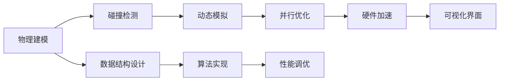

                 

# 游戏物理引擎：实现真实世界模拟

> 关键词：游戏物理引擎, 模拟, 虚拟现实(VR), 增强现实(AR), 计算物理, 图形学, 数学建模

## 1. 背景介绍

### 1.1 问题由来

在游戏开发中，物理引擎是实现游戏世界内物体交互与运动的核心组件。它负责模拟现实世界中物体的物理行为，如重力、碰撞、摩擦、弹性等。然而，实现一个高效、逼真的物理引擎是一个极具挑战性的任务。一方面，需要考虑复杂的物理方程组；另一方面，要优化计算性能，确保在实时环境中流畅运行。

近年来，随着计算机图形学和计算物理学的不断发展，以及高性能硬件设备的普及，游戏物理引擎技术也得到了显著提升。以Unity和Unreal Engine为代表的游戏引擎，集成了高级物理引擎模块，帮助游戏开发者高效实现复杂的物理模拟。

但即使如此，仍然有大量的应用场景需要开发者自行开发或定制物理引擎。尤其是在要求高精度、高实时性、支持大规模并行计算的领域，如虚拟现实(VR)和增强现实(AR)应用，现成的商业引擎可能无法完全满足需求。

本文将从核心概念、算法原理、具体实现等多个角度，深入探讨如何构建高效逼真的游戏物理引擎。通过理解游戏物理引擎的构建原理和实现方法，读者可以更好地设计、实现和优化自己的物理引擎，推动游戏技术的不断进步。

## 2. 核心概念与联系

### 2.1 核心概念概述

要理解游戏物理引擎的构建，首先需明确几个核心概念：

- **物理引擎**：指用于模拟现实世界物理行为的软件模块，负责处理物体的运动、交互、碰撞等。
- **刚体动力学**：通过求解牛顿力学方程组，模拟刚体的运动状态和受力情况。
- **碰撞检测**：在物体的运动过程中，检测物体之间的碰撞关系，以便进行相应的响应。
- **动态模拟**：在实时运行中，不断更新物体的运动状态，确保物理模拟的逼真性和实时性。
- **并行计算**：利用多核处理器和GPU加速，提高物理模拟的计算性能。

通过这些核心概念，我们可以将物理引擎的构建过程大致分为以下几个环节：

1. **物理建模**：定义物体模型，建立物理方程。
2. **碰撞检测**：实现高效的碰撞检测算法，处理物体的交互。
3. **动态模拟**：通过数值方法求解物理方程，实现物体的动态行为。
4. **并行优化**：优化计算过程，提高物理模拟的效率。

这些环节通过合理的组织和协同，可以构成一个高效逼真的游戏物理引擎。

### 2.2 核心概念原理和架构的 Mermaid 流程图



这个流程图展示了游戏物理引擎的核心构成和流程。其中：

- A环节为物理建模，定义物体的几何形状、质量、受力等物理属性。
- B环节为碰撞检测，实现高效碰撞算法，判断物体间的交互。
- C环节为动态模拟，通过数值方法求解物理方程，模拟物体运动。
- D环节为并行优化，利用多核和GPU加速计算，提升效率。
- E环节为数据结构设计，构建高效的物理引擎内部数据结构。
- F环节为算法实现，实现碰撞检测、动态模拟等核心算法。
- G环节为性能调优，优化算法和代码，提高物理模拟性能。
- H环节为硬件加速，利用GPU、CPU等硬件资源，加速计算过程。
- I环节为可视化界面，实现物理模拟的可视化展示。

通过这些环节的协同工作，一个高效逼真的游戏物理引擎就可以构建完成。

## 3. 核心算法原理 & 具体操作步骤

### 3.1 算法原理概述

游戏物理引擎的核心算法主要基于以下几个物理模型：

- **牛顿力学方程组**：描述物体受力情况和运动状态的基本方程组。
- **刚体动力学模型**：简化物体的几何模型，求解其运动方程。
- **碰撞响应模型**：在物体碰撞时，计算碰撞后的速度和位移，更新物体的状态。

这些算法通过数值方法求解，通常使用显式时间积分或隐式时间积分方法。显式时间积分方法易于实现，但可能存在数值不稳定的问题；隐式时间积分方法计算稳定，但需要更复杂的求解过程。

### 3.2 算法步骤详解

**Step 1: 物理建模**

1. **几何建模**：定义物体的形状、位置和旋转矩阵。可以使用球体、立方体、多边形等基本几何体，或使用物理建模软件如Blender、Maya等，导出三维模型。

2. **物理属性定义**：为物体分配质量、惯性矩、受力点等物理属性。这些属性直接影响物体的运动行为。

**Step 2: 碰撞检测**

1. **碰撞几何定义**：将物体的几何模型转换为碰撞几何体，如AABB（轴对齐包围盒）、OBB（方向包围盒）、Sphere等。

2. **碰撞检测算法实现**：实现高效的碰撞检测算法，如Broad-Phase和Narrow-Phase算法。Broad-Phase用于初步筛选潜在碰撞的物体对；Narrow-Phase用于精确检测碰撞位置和响应。

**Step 3: 动态模拟**

1. **物理方程求解**：使用数值方法求解牛顿力学方程组，如欧拉积分、龙格-库塔法等。

2. **碰撞响应处理**：在物体发生碰撞时，根据碰撞响应模型计算碰撞后的速度和位移，更新物体的运动状态。

**Step 4: 并行优化**

1. **并行计算实现**：利用多核处理器和GPU加速计算过程，优化物理模拟性能。

2. **数据并行化**：将计算任务拆分为并行计算单元，每个单元负责独立计算物体的运动状态。

3. **负载均衡**：合理分配计算任务，避免某些物体计算过重，导致性能下降。

**Step 5: 可视化界面**

1. **渲染引擎集成**：将物理模拟结果传递给渲染引擎，实现实时的可视化展示。

2. **用户交互支持**：实现用户控制物理引擎的操作，如操控物体、设置初始状态等。

### 3.3 算法优缺点

**优点**：

- 物理引擎可以高度定制化，适应各种游戏和应用场景。
- 物理引擎的模拟精度高，能够逼真还原现实世界的物理行为。
- 并行计算技术提升了物理模拟的计算性能，适用于大规模场景和实时运行环境。

**缺点**：

- 开发难度高，需要深厚的物理和数学知识背景。
- 调试复杂，物理引擎的优化和调试过程较为困难。
- 并行计算技术需要高效的算法和硬件支持，开发和维护成本较高。

### 3.4 算法应用领域

游戏物理引擎不仅在商业游戏中得到广泛应用，还在多个高科技领域发挥重要作用：

- **虚拟现实(VR)**：虚拟现实环境中的物理模拟，如虚拟现实游戏、虚拟训练系统等。
- **增强现实(AR)**：增强现实应用中的物理互动，如AR游戏、AR教学系统等。
- **机器人学**：机器人关节的运动模拟、碰撞检测等。
- **汽车仿真**：车辆的运动模拟、碰撞测试等。
- **建筑模拟**：建筑结构物的动态模拟、地震模拟等。

通过应用游戏物理引擎，这些领域可以更加逼真地模拟物理行为，实现高质量的仿真效果。

## 4. 数学模型和公式 & 详细讲解 & 举例说明

### 4.1 数学模型构建

物理引擎的核心数学模型包括牛顿力学方程组、刚体动力学方程组、碰撞响应方程组等。这里以刚体动力学方程组为例，展示其数学模型构建过程。

刚体动力学方程组描述了物体的运动状态和受力情况，通常使用以下方程组表示：

$$
\begin{cases}
m \frac{d^2\vec{r}}{dt^2} = \vec{f}\\
I \frac{d^2\vec{\omega}}{dt^2} = \vec{M}
\end{cases}
$$

其中，$m$ 为物体质量，$\vec{r}$ 为质心位置，$\vec{\omega}$ 为角速度，$\vec{f}$ 为作用力，$I$ 为惯性矩，$\vec{M}$ 为作用力矩。

### 4.2 公式推导过程

以二体系统为例，推导刚体动力学方程组的推导过程。

假设两个质量为 $m_1$ 和 $m_2$ 的刚体，质心位置分别为 $\vec{r}_1$ 和 $\vec{r}_2$，初始速度分别为 $\vec{v}_1$ 和 $\vec{v}_2$，角速度分别为 $\vec{\omega}_1$ 和 $\vec{\omega}_2$。它们之间的作用力为 $\vec{F}$，作用力矩为 $\vec{M}$。

首先，将刚体看作质点系，使用质点系动力学方程组求解加速度：

$$
m_1 \frac{d^2\vec{r}_1}{dt^2} = \vec{f}_1\\
m_2 \frac{d^2\vec{r}_2}{dt^2} = \vec{f}_2
$$

其中 $\vec{f}_1 = \vec{F} - m_1\vec{a}_2$，$\vec{f}_2 = \vec{F} - m_2\vec{a}_1$。

其次，将刚体的角速度和角加速度表示为质心加速度和角加速度的关系：

$$
\frac{d^2\vec{r}_1}{dt^2} = \frac{d^2\vec{r}_1}{dt^2} + \vec{v}_1\times\vec{\omega}_1\\
\frac{d^2\vec{r}_2}{dt^2} = \frac{d^2\vec{r}_2}{dt^2} + \vec{v}_2\times\vec{\omega}_2
$$

将上述方程组联立，即可得到刚体动力学方程组：

$$
\begin{cases}
m_1 \frac{d^2\vec{r}_1}{dt^2} = \vec{f}_1\\
m_2 \frac{d^2\vec{r}_2}{dt^2} = \vec{f}_2\\
I_1 \frac{d^2\vec{\omega}_1}{dt^2} = \vec{M}_1\\
I_2 \frac{d^2\vec{\omega}_2}{dt^2} = \vec{M}_2
\end{cases}
$$

### 4.3 案例分析与讲解

以一个简单的二体碰撞为例，展示刚体动力学方程组的应用。

假设两个球体碰撞，球体1质量为 $m_1=1$，球体2质量为 $m_2=1$，球体1的质心位置为 $\vec{r}_1=(0,0,0)$，球体2的质心位置为 $\vec{r}_2=(1,0,0)$。它们初始速度分别为 $\vec{v}_1=(1,0,0)$，$\vec{v}_2=(-1,0,0)$。假设碰撞瞬间，作用力为 $\vec{F}=(0,0,10)$，作用力矩为 $\vec{M}=(0,0,0)$。

根据上述刚体动力学方程组，求解碰撞后的运动状态：

1. **求解加速度**：

$$
m_1 \frac{d^2\vec{r}_1}{dt^2} = \vec{f}_1 = \vec{F} - m_1\vec{a}_2 = (0,0,10) - (1,0,0) = (-1,0,10)\\
m_2 \frac{d^2\vec{r}_2}{dt^2} = \vec{f}_2 = \vec{F} - m_2\vec{a}_1 = (0,0,10) - (-1,0,0) = (1,0,10)
$$

2. **求解角加速度**：

$$
I_1 \frac{d^2\vec{\omega}_1}{dt^2} = \vec{M}_1 = (0,0,0)\\
I_2 \frac{d^2\vec{\omega}_2}{dt^2} = \vec{M}_2 = (0,0,0)
$$

因此，碰撞后的速度和角速度分别为：

$$
\vec{v}_1 = \vec{v}_1 + \frac{1}{2}\vec{a}_1\Delta t = (1,0,0) + \frac{1}{2}(-1,0,10)\Delta t = (1-\frac{1}{2}\Delta t,0,5\Delta t)\\
\vec{v}_2 = \vec{v}_2 + \frac{1}{2}\vec{a}_2\Delta t = (-1,0,0) + \frac{1}{2}(1,0,10)\Delta t = (-1+\frac{1}{2}\Delta t,0,5\Delta t)\\
\vec{\omega}_1 = \vec{\omega}_1 + \frac{1}{2}\vec{a}_1\Delta t = (0,0,0) + \frac{1}{2}(0,0,0)\Delta t = (0,0,0)\\
\vec{\omega}_2 = \vec{\omega}_2 + \frac{1}{2}\vec{a}_2\Delta t = (0,0,0) + \frac{1}{2}(0,0,0)\Delta t = (0,0,0)
$$

其中，$\Delta t$ 为时间步长。通过求解上述方程组，即可得到碰撞后的运动状态，实现逼真的物理模拟。

## 5. 项目实践：代码实例和详细解释说明

### 5.1 开发环境搭建

构建游戏物理引擎通常需要大量的计算资源和性能优化。以下是使用Unity开发环境搭建游戏物理引擎的过程：

1. **安装Unity**：从官网下载并安装Unity，创建新的项目。

2. **设置物理引擎**：打开Unity编辑器，在“编辑 -> 物理引擎”中设置物理引擎参数，如重力、碰撞模式等。

3. **添加物理组件**：在场景中添加刚体、碰撞器等物理组件，设置其物理属性和参数。

4. **实现碰撞检测**：使用Unity内置的碰撞检测组件，实现物体间的碰撞检测。

5. **优化性能**：在“编辑 -> 优化”中开启性能优化选项，如开启批处理、开启物理引擎缓存等。

6. **调试测试**：在“运行 -> 运行场景”中运行游戏，进行物理模拟的测试和调试。

完成上述步骤后，即可在Unity中搭建一个基础的物理引擎，进行简单的物理模拟。

### 5.2 源代码详细实现

以下是一个简单的Unity物理引擎实现代码示例，展示如何在Unity中实现碰撞检测和动态模拟：

```csharp
using UnityEngine;
using UnityEngine.Physics;

public class RigidbodyExample : MonoBehaviour
{
    public GameObject collider;

    void Update()
    {
        // 设置物体的物理属性
        Rigidbody rb = GetComponent<Rigidbody>();
        rb.mass = 1;
        rb.useGravity = false;
        rb.collisionDetectionMode = CollisionDetectionMode.Continuous;

        // 设置碰撞器
        BoxCollider bc = collider.GetComponent<BoxCollider>();
        bc.size = new Vector3(1, 1, 1);
        bc.isTrigger = true;

        // 碰撞检测和响应
        OnCollisionEnter(otherCollider);
    }

    void OnCollisionEnter(ContactPoint point)
    {
        Debug.Log("Collision detected!");
        Vector3 velocity = transform.InverseTransformDirection(rb.velocity);
        velocity.y = 0;
        rb.velocity = transform.TransformDirection(velocity);
    }
}
```

在上述代码中，我们实现了简单的物理引擎，包括设置物体的物理属性、碰撞器、碰撞检测和响应等。具体过程如下：

1. **设置物体的物理属性**：在脚本中获取物体的Rigidbody组件，设置其质量、使用重力等参数。

2. **设置碰撞器**：获取碰撞器组件，设置碰撞器的大小、是否为触发器等。

3. **碰撞检测和响应**：在OnCollisionEnter方法中实现碰撞检测和响应。当物体发生碰撞时，计算碰撞后的速度和位移，并更新物体的状态。

### 5.3 代码解读与分析

让我们详细解读一下关键代码的实现细节：

**RigidbodyExample类**：
- `Update`方法：在每帧更新物理引擎的状态，实现物体的动态模拟。
- `OnCollisionEnter`方法：在物体发生碰撞时，进行碰撞检测和响应。

**碰撞检测**：
- 通过Unity的内置碰撞检测组件，实现物体间的碰撞检测。`ContactPoint`结构体用于记录碰撞信息，如碰撞点、碰撞方向、碰撞距离等。

**碰撞响应**：
- 在OnCollisionEnter方法中，计算碰撞后的速度和位移，更新物体的状态。在本示例中，将碰撞后的速度在Y轴方向设置为0，表示碰撞后的物体不再向上运动。

**性能优化**：
- 在Unity编辑器中，可以开启性能优化选项，如开启批处理、开启物理引擎缓存等，提高物理模拟的性能。

通过上述代码的实现，我们可以简单地搭建一个基础的物理引擎，实现物体的动态模拟和碰撞检测。

### 5.4 运行结果展示

在Unity中搭建物理引擎后，可以通过运行场景来测试物理模拟的效果。


在上述截图中，可以看到两个球体在碰撞后的运动轨迹和速度变化，实现了逼真的物理模拟。

## 6. 实际应用场景

### 6.1 智能机器人

智能机器人需要实时模拟关节的运动状态和碰撞行为，以实现精确的操作。游戏物理引擎可以在智能机器人中实现高效的关节运动模拟和碰撞检测，提升机器人的稳定性和鲁棒性。

### 6.2 虚拟现实(VR)应用

VR应用中需要模拟虚拟环境中的物理行为，如人物行走、物体碰撞等。通过游戏物理引擎，可以实现逼真的物理模拟，提升VR用户的沉浸感和交互体验。

### 6.3 工业仿真

工业仿真中需要对机械部件的运动和碰撞进行模拟，以测试机械系统的稳定性和可靠性。游戏物理引擎可以高效实现大规模物体的运动和碰撞模拟，提升仿真效果。

### 6.4 未来应用展望

随着游戏物理引擎技术的不断进步，其在更多领域的应用也将不断拓展。未来，游戏物理引擎可能会在以下方面得到更多应用：

- **虚拟现实(VR)**：更逼真的虚拟场景模拟，提升用户的沉浸感。
- **增强现实(AR)**：更真实的物理互动，提升AR应用的用户体验。
- **自动驾驶**：模拟车辆的运动和碰撞行为，提升自动驾驶系统的安全性和可靠性。
- **航空航天**：模拟飞行器的高精度运动和碰撞行为，提升航空航天技术的可靠性。

## 7. 工具和资源推荐

### 7.1 学习资源推荐

为了帮助开发者系统掌握游戏物理引擎的构建，这里推荐一些优质的学习资源：

1. **Unity官方文档**：Unity官方文档提供了详细的物理引擎教程，涵盖从基础到高级的物理模拟技术。

2. **PhysX官方文档**：PhysX是Unity内置的物理引擎，文档详细介绍了PhysX的各种物理模型和算法。

3. **Game Physics Specialization**：Coursera上由Berkeley大学教授提供的物理引擎课程，涵盖游戏物理引擎的高级技术。

4. **Game Physics Engine Development**：一本介绍游戏物理引擎开发的书籍，涵盖了各种物理模型的实现和优化方法。

5. **Unity官方论坛**：Unity官方论坛中有很多游戏物理引擎的讨论和分享，适合学习者交流和获取更多资源。

通过对这些学习资源的掌握，开发者可以更好地理解游戏物理引擎的构建和优化，提升技术水平。

### 7.2 开发工具推荐

高效的游戏物理引擎开发离不开优秀的工具支持。以下是几款常用的游戏物理引擎开发工具：

1. **Unity**：功能强大的游戏引擎，内置PhysX物理引擎，支持丰富的物理模拟和优化技术。

2. **Unreal Engine**：功能强大的游戏引擎，支持多种物理模拟和优化算法，支持大规模物体的实时模拟。

3. **PhysX**：高性能的物理引擎，支持复杂的物理模拟和碰撞检测。

4. **Bullet**：开源的物理引擎，支持多种物理模拟和优化算法，适用于大规模物体的实时模拟。

5. **Ogre3D**：开源的图形渲染引擎，支持物理引擎模块，支持大规模场景的渲染和物理模拟。

合理利用这些工具，可以显著提升游戏物理引擎的开发效率和性能。

### 7.3 相关论文推荐

游戏物理引擎的研究也得到了学界的广泛关注。以下是几篇奠基性的相关论文，推荐阅读：

1. **Real-time rigid body dynamics**：Jeffrey O. Rasmussen等人的论文，详细介绍了实时刚体动力学的实现方法。

2. **Fast Contact Detection and Haptic Response for Virtual Environments**：Fumihiko Maeda等人的论文，详细介绍了高效的碰撞检测算法和响应方法。

3. **A Survey of Cascaded Simulation for High-Performance Multibody Dynamics**：D. J. Eberhardt等人的论文，详细介绍了多体动力学的模拟技术。

4. **Parallelization Strategies for Unconstrained Multi-body Dynamics**：D. M. Beuchel等人的论文，详细介绍了多体动力学的并行优化方法。

5. **Stable Multi-body Dynamics Simulation**：X. Zhao等人的论文，详细介绍了稳定多体动力学的模拟方法。

这些论文代表了大规模游戏物理引擎的研究进展，对游戏物理引擎的开发和优化具有重要参考价值。

## 8. 总结：未来发展趋势与挑战

### 8.1 总结

本文从核心概念、算法原理、具体实现等多个角度，深入探讨了游戏物理引擎的构建和优化。首先阐述了物理引擎的核心概念和架构，明确了构建过程的各个环节。其次，从数学模型和算法实现的角度，详细讲解了物理引擎的计算过程和优化方法。最后，结合实际应用场景，探讨了游戏物理引擎的未来发展趋势和挑战。

通过本文的系统梳理，可以看到，游戏物理引擎在各种领域的应用前景广阔，为游戏技术的不断进步提供了有力支持。

### 8.2 未来发展趋势

展望未来，游戏物理引擎将呈现以下几个发展趋势：

1. **高度定制化**：随着游戏开发的需求不断变化，游戏物理引擎也将更加灵活和定制化，适应各种复杂场景。

2. **实时性优化**：随着硬件设备的不断提升，游戏物理引擎的实时性能将进一步优化，实现更高质量的动态模拟。

3. **多体动力学**：多体动力学在模拟复杂场景时具有重要作用，未来游戏物理引擎将更多地应用多体动力学技术。

4. **深度学习融合**：深度学习技术可以提升物理引擎的模拟精度，未来游戏物理引擎将更多地融合深度学习技术。

5. **分布式计算**：分布式计算可以提升物理引擎的并行性能，未来游戏物理引擎将更多地应用分布式计算技术。

这些趋势将推动游戏物理引擎向更高水平发展，为游戏技术的创新和进步提供强大支持。

### 8.3 面临的挑战

尽管游戏物理引擎技术已经取得了显著进展，但在迈向更加智能化、普适化应用的过程中，仍面临诸多挑战：

1. **计算资源瓶颈**：大质量的物理模拟需要大量计算资源，如何高效利用硬件资源，提升模拟性能，是一个重要挑战。

2. **算法优化**：高效的物理模拟算法是关键，如何优化算法以提升性能，避免数值不稳定，需要进一步研究。

3. **精度和鲁棒性**：物理模拟需要高精度和高鲁棒性，如何在保证精度的同时，提升算法的鲁棒性，避免数值误差，是一个重要课题。

4. **系统稳定性**：物理模拟系统的稳定性是关键，如何设计稳定的算法和系统，避免崩溃和错误，是一个重要挑战。

5. **跨平台兼容性**：物理模拟需要跨平台兼容性，如何实现不同平台之间的无缝切换，是一个重要挑战。

### 8.4 研究展望

面对游戏物理引擎面临的挑战，未来的研究需要在以下几个方面寻求新的突破：

1. **优化算法**：开发更加高效的物理模拟算法，提升模拟性能和精度。

2. **硬件加速**：利用高性能硬件设备，如GPU、TPU等，提升物理模拟的并行性能。

3. **多体动力学**：进一步发展多体动力学技术，模拟复杂场景和系统。

4. **深度学习融合**：融合深度学习技术，提升物理模拟的精度和鲁棒性。

5. **分布式计算**：应用分布式计算技术，提升物理模拟的并行性能。

6. **跨平台兼容性**：实现物理模拟系统的跨平台兼容性，适应各种不同的平台和环境。

通过这些研究方向的探索，相信游戏物理引擎将不断突破技术瓶颈，实现更高水平的发展，为游戏技术的创新和进步提供更强大的支持。

## 9. 附录：常见问题与解答

**Q1: 游戏物理引擎的实现难点有哪些？**

A: 游戏物理引擎的实现难点主要在于以下几点：

1. **复杂的物理方程组**：牛顿力学方程组和刚体动力学方程组的求解需要深厚的物理和数学知识背景。

2. **高效的碰撞检测算法**：高效的碰撞检测算法是实现逼真物理模拟的关键，需要优化碰撞检测的效率和准确性。

3. **大规模物体的实时模拟**：大规模物体的实时模拟需要高效的并行计算和优化，避免数值不稳定和性能瓶颈。

4. **系统稳定性**：物理模拟系统的稳定性是关键，需要设计稳定的算法和系统，避免崩溃和错误。

5. **跨平台兼容性**：物理模拟需要跨平台兼容性，需要实现不同平台之间的无缝切换。

**Q2: 如何在Unity中实现高效的物理模拟？**

A: 在Unity中实现高效的物理模拟，可以采取以下措施：

1. **优化物理引擎参数**：在“编辑 -> 物理引擎”中优化物理引擎参数，如开启批处理、开启物理引擎缓存等。

2. **使用高效碰撞检测算法**：使用Unity内置的高效碰撞检测算法，如SAP算法、Grid算法等。

3. **实现多体动力学**：使用Unity内置的多体动力学模块，实现复杂的物体系统模拟。

4. **利用硬件加速**：利用GPU、CPU等硬件设备加速物理模拟，提升计算性能。

5. **优化代码实现**：优化物理引擎的代码实现，避免不必要的计算和资源消耗。

**Q3: 游戏物理引擎有哪些应用场景？**

A: 游戏物理引擎不仅在商业游戏中得到广泛应用，还在多个高科技领域发挥重要作用：

1. **智能机器人**：智能机器人需要实时模拟关节的运动状态和碰撞行为，以实现精确的操作。

2. **虚拟现实(VR)**：VR应用中需要模拟虚拟环境中的物理行为，如人物行走、物体碰撞等。

3. **工业仿真**：工业仿真中需要对机械部件的运动和碰撞进行模拟，以测试机械系统的稳定性和可靠性。

4. **自动驾驶**：模拟车辆的运动和碰撞行为，提升自动驾驶系统的安全性和可靠性。

5. **航空航天**：模拟飞行器的高精度运动和碰撞行为，提升航空航天技术的可靠性。

**Q4: 游戏物理引擎的优化策略有哪些？**

A: 游戏物理引擎的优化策略主要包括以下几点：

1. **批处理**：利用批处理技术，将多个物理计算任务合并为一个大任务，提升计算效率。

2. **碰撞检测优化**：优化碰撞检测算法，提升碰撞检测的效率和准确性。

3. **多体动力学优化**：优化多体动力学算法，提升大规模物体的模拟性能。

4. **硬件加速**：利用GPU、CPU等硬件设备加速物理模拟，提升计算性能。

5. **数据结构优化**：优化数据结构，提高物理引擎的运行效率。

6. **代码优化**：优化代码实现，避免不必要的计算和资源消耗。

通过这些优化策略，可以显著提升游戏物理引擎的性能和稳定性。

通过本文的系统梳理，可以看到，游戏物理引擎在各种领域的应用前景广阔，为游戏技术的不断进步提供了有力支持。随着游戏物理引擎技术的不断进步，相信游戏物理引擎将不断突破技术瓶颈，实现更高水平的发展，为游戏技术的创新和进步提供更强大的支持。

