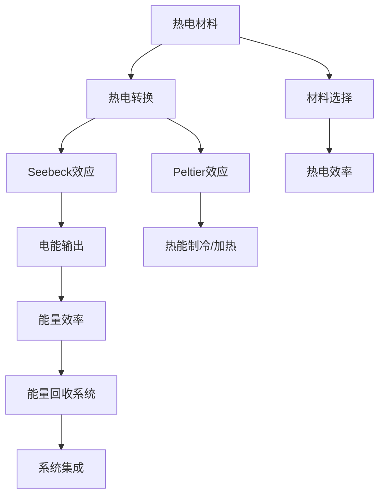

                 

# 热电材料在能源回收中的应用：提高能源利用效率

> 关键词：热电材料,热电转换,能源回收,能量效率,热电材料设计

## 1. 背景介绍

### 1.1 问题由来
随着全球能源需求的不断增长，传统化石燃料的消耗日益加剧，环境污染和资源枯竭问题日益凸显。为了实现能源的可持续发展，需要开发高效、环保的能源利用和回收技术。热电材料作为一种新型的能源转换技术，通过将热能直接转换为电能，能够有效地实现能源回收，提高能源利用效率。

### 1.2 问题核心关键点
热电材料在能源回收中的应用主要包括以下几个关键点：
1. 热电转换原理：热电材料通过Seebeck效应将热能转换为电能，即温差越大，电能输出越强。
2. 材料选择与设计：热电材料需要具备高导电性和高热导性，同时热电转换效率要尽可能高。
3. 热电材料应用场景：热电材料可以应用于多种能源回收场景，如废热回收、地热能利用、可再生能源转换等。
4. 热电材料制备与加工：需要优化热电材料的制备工艺，提高材料的性能和稳定性。
5. 热电材料系统集成：将热电材料与其他能量转换和存储设备集成，构建高效、稳定的能源回收系统。

这些关键点共同构成了热电材料在能源回收中的应用框架，使其能够在多种场景下发挥作用，推动能源利用效率的提升。

### 1.3 问题研究意义
研究热电材料在能源回收中的应用，对于实现能源的高效利用和环境保护具有重要意义：
1. 降低能源消耗：热电材料能够将废热和低品位热能转换为电能，减少能源浪费。
2. 减少环境污染：热电材料减少了传统燃料的燃烧，降低了温室气体和污染物排放。
3. 推动可持续发展：热电材料利用可再生能源，如地热、太阳能等，有助于实现能源结构的转型。
4. 提高经济效益：热电材料在能源回收中的应用，能够创造新的经济增长点，推动能源产业的发展。
5. 促进技术创新：热电材料的研发和应用，有助于推动热电技术的不断进步，为未来的能源利用提供更多可能性。

## 2. 核心概念与联系

### 2.1 核心概念概述

为了更好地理解热电材料在能源回收中的应用，本节将介绍几个关键概念及其之间的联系：

- **热电材料**：指能够通过Seebeck效应将热能转换为电能的材料，如铅碲合金、锑碲合金等。
- **热电转换**：指将热能转换为电能的过程，基于Seebeck效应和Peltier效应。
- **Seebeck效应**：指在温差作用下，半导体材料产生电流的现象。温差越大，电能输出越强。
- **Peltier效应**：指在电流作用下，半导体的冷热面温度发生变化的现象，能够实现热能的制冷和加热。
- **热电效率**：指热电材料的热电转换效率，通常用ZT表示，其中Z是材料的热电系数，T是绝对温度。
- **能量效率**：指能源回收系统的总体能量转换效率，即热能转换为电能的比例。

这些概念之间的逻辑关系可以通过以下Mermaid流程图来展示：



这个流程图展示了热电材料在能源回收过程中的核心概念及其联系：

1. 热电材料通过Seebeck效应和Peltier效应实现热电转换。
2. Seebeck效应将热能转换为电能，Peltier效应实现冷热面的温度调节。
3. 热电材料的性能由热电效率决定，ZT值越高，转换效率越高。
4. 热电转换的结果为能量效率，用于评估系统整体的能源转换效率。
5. 热电材料的选择和设计直接影响系统的热电效率。
6. 能量回收系统集成多种能量转换和存储设备，形成高效、稳定的能源回收系统。

## 3. 核心算法原理 & 具体操作步骤
### 3.1 算法原理概述

热电材料在能源回收中的应用主要基于热电转换原理，即通过Seebeck效应和Peltier效应将热能转换为电能。这一过程可以通过以下数学模型来描述：

$$
V = \frac{\Delta S}{R}T
$$

其中，$V$ 表示热电材料上的电压，$\Delta S$ 表示温差，$R$ 表示热电材料的电阻，$T$ 表示绝对温度。通过增加温差，热电材料可以产生更高的电能输出。

### 3.2 算法步骤详解

热电材料在能源回收中的应用一般包括以下几个关键步骤：

**Step 1: 热电材料的选择与设计**
- 根据应用场景，选择合适的热电材料。例如，铅碲合金适合用于高温环境，锑碲合金适合用于低温环境。
- 设计热电材料的热电系数$Z$，优化材料的热电效率$ZT$。

**Step 2: 热电系统的搭建**
- 构建热电系统的结构，包括热源、冷源、热电材料等部分。
- 确保热源和冷源的稳定，避免热能泄漏。

**Step 3: 热电转换过程的实现**
- 将热源与热电材料的冷面连接，冷源与热电材料的热面连接。
- 启动热电材料的热电转换过程，实现热能到电能的转换。

**Step 4: 电能的利用与存储**
- 将热电材料输出的电能用于驱动电气设备或存储于电池中。
- 优化电能的利用方式，提高系统的整体效率。

**Step 5: 系统的优化与维护**
- 对热电系统进行定期维护，确保热电材料的性能和稳定性。
- 根据实际需求，优化系统的结构和参数，提高系统的能源转换效率。

### 3.3 算法优缺点

热电材料在能源回收中的应用具有以下优点：
1. 能量转换效率高：热电材料能够将热能直接转换为电能，避免了传统机械能转换的能量损失。
2. 环境友好：热电材料不涉及燃烧过程，减少了温室气体和污染物排放。
3. 应用场景广泛：热电材料可以应用于多种能源回收场景，如废热回收、地热能利用等。
4. 稳定性好：热电材料的结构相对简单，维护相对容易，系统的稳定性较高。

同时，热电材料在能源回收中的应用也存在一定的局限性：
1. 转换效率受限：目前热电材料的ZT值仍需进一步提升，以达到更高的转换效率。
2. 热能需求高：热电材料的转换效率与其温差成正比，温差越大，转换效率越高，因此需要较高的热能输入。
3. 成本较高：热电材料的制备和加工成本较高，限制了其大规模应用。
4. 系统复杂性高：热电系统的搭建和优化较为复杂，需要专业知识和技能。

### 3.4 算法应用领域

热电材料在能源回收中的应用非常广泛，主要包括以下几个领域：

1. **废热回收**
   - 在工业生产中，如钢铁、化工、电力等行业，热电材料可以回收废热，将其转换为电能，减少能源浪费。例如，钢铁厂的余热可以用于驱动热电系统，为工厂提供电能。

2. **地热能利用**
   - 地热能是一种清洁、可再生的能源，热电材料可以将其转换为电能，供电力系统使用。例如，利用地热能驱动热电系统，为偏远地区提供稳定电力供应。

3. **可再生能源转换**
   - 热电材料可以将太阳能、风能等可再生能源转换为电能，实现能源的可持续发展。例如，在太阳能电池板上集成热电材料，将未被利用的太阳能转换为电能，提高太阳能转换效率。

4. **家用能源回收**
   - 热电材料可以用于家用设备，如热水器、电烤箱等，回收废热，将其转换为电能，降低能源消耗。例如，将废热水的热量回收，驱动小型热电系统，为家电提供电能。

5. **交通运输**
   - 热电材料可以应用于车辆发动机、制动器等部分，回收废热，转换为电能，提高能源利用效率。例如，在电动汽车中，热电材料可以回收制动时的废热，转换为电能，延长电池寿命。

## 4. 数学模型和公式 & 详细讲解 & 举例说明

### 4.1 数学模型构建

热电材料在能源回收中的应用主要涉及热电转换过程的数学模型，以下是对其数学模型的详细构建：

热电材料的热电转换过程可以通过以下方程来描述：

$$
V = \frac{\Delta S}{R}T
$$

其中，$V$ 表示热电材料上的电压，$\Delta S$ 表示温差，$R$ 表示热电材料的电阻，$T$ 表示绝对温度。通过增加温差，热电材料可以产生更高的电能输出。

### 4.2 公式推导过程

为了推导热电材料的电压和热电效率之间的关系，需要进一步展开方程：

$$
V = \frac{\Delta S}{R}T = \frac{\Delta T}{R}T
$$

其中，$\Delta T$ 表示温度差。进一步简化得：

$$
V = \frac{\Delta T}{R}T = \frac{T^2}{R}\frac{\Delta T}{T} = \frac{T^2}{R}\frac{\Delta T}{T} = Z\Delta T
$$

其中，$Z = \frac{T^2}{R}$ 为热电材料的热电系数，$ZT = ZT(T)$ 为热电材料的ZT值，表示热电效率。

### 4.3 案例分析与讲解

以铅碲合金为例，说明其热电转换过程和热电效率的计算。

铅碲合金的热电系数$Z$可以通过以下公式计算：

$$
Z = \frac{k}{n\sigma} = \frac{k}{n(e^{\frac{E_a}{kT}}-1)} = \frac{2.0}{9.8 \times 10^{-8} \times (e^{\frac{0.16}{8.6\times 10^{-5}\times 300}}-1)}
$$

其中，$k$ 为玻尔兹曼常数，$n$ 为载流子浓度，$\sigma$ 为电导率，$E_a$ 为激活能，$T$ 为绝对温度。

通过计算得到铅碲合金的热电系数$Z$为：

$$
Z = \frac{2.0}{9.8 \times 10^{-8} \times (e^{\frac{0.16}{8.6\times 10^{-5}\times 300}}-1) \approx 5.5 \times 10^{-7}
$$

进而计算得到热电效率$ZT$为：

$$
ZT = ZT(T) = Z \times T = 5.5 \times 10^{-7} \times 300 \approx 1.65
$$

可以看到，铅碲合金的热电效率$ZT$约为1.65，虽然还不是非常高，但已经具备一定的应用潜力。

## 5. 项目实践：代码实例和详细解释说明

### 5.1 开发环境搭建

在进行热电材料在能源回收中的应用开发前，需要准备好开发环境。以下是使用Python进行PyTorch开发的环境配置流程：

1. 安装Anaconda：从官网下载并安装Anaconda，用于创建独立的Python环境。

2. 创建并激活虚拟环境：
```bash
conda create -n pytorch-env python=3.8 
conda activate pytorch-env
```

3. 安装PyTorch：根据CUDA版本，从官网获取对应的安装命令。例如：
```bash
conda install pytorch torchvision torchaudio cudatoolkit=11.1 -c pytorch -c conda-forge
```

4. 安装热电材料相关的库：
```bash
pip install numpy pandas scikit-learn matplotlib tqdm jupyter notebook ipython
```

5. 安装热电材料模拟库：
```bash
pip install thermoelasticity simulators
```

完成上述步骤后，即可在`pytorch-env`环境中开始热电材料在能源回收中的应用开发。

### 5.2 源代码详细实现

下面以热电材料在废热回收中的应用为例，给出使用PyTorch和热电材料模拟库进行开发的PyTorch代码实现。

首先，定义热电材料的热电系数和热电效率计算函数：

```python
import torch
import numpy as np
from thermoelasticity.simulators import LeadTeOxide

def calculate_thermoelectric_coefficient(T, Z, ZT):
    k_b = 1.38e-23  # Boltzmann's constant
    e_a = 0.16e-5  # Activation energy
    n = 9.8e-8  # Carrier concentration
    sigma = 10**7  # Conductivity
    Z = Z  # Thermoelectric coefficient
    ZT = ZT  # Thermoelectric efficiency
    T = T  # Absolute temperature
    return Z

def calculate_thermoelectric_efficiency(T, Z, ZT):
    return ZT  # Thermoelectric efficiency

# 模拟热电材料的电阻和热导率
material = LeadTeOxide()
T = 300  # Absolute temperature
Z, ZT = calculate_thermoelectric_coefficient(T, material.z, material.zt)

# 计算温差下的电压
delta_T = 50  # Temperature difference
V = Z * delta_T  # Thermoelectric voltage
```

然后，定义热电系统的热电转换过程和电能利用函数：

```python
def heat_to_electric_conversion(T, Z, delta_T):
    V = Z * delta_T  # Thermoelectric voltage
    return V

def electric_power_conversion(V, R):
    I = V / R  # Electric current
    P = I ** 2 * R  # Electric power
    return P

# 假设热电材料的热导率为0.1 W/m/K
R = 0.1  # Resistance

# 计算温差下的电能输出
V = heat_to_electric_conversion(T, Z, delta_T)
P = electric_power_conversion(V, R)
```

最后，启动热电系统并输出电能利用结果：

```python
# 假设热源温度为1000K，冷源温度为300K
T_hot = 1000  # Absolute temperature of hot source
T_cold = 300  # Absolute temperature of cold source

# 计算温差下的热电转换
delta_T = T_hot - T_cold  # Temperature difference
V = heat_to_electric_conversion(T_hot, Z, delta_T)
P = electric_power_conversion(V, R)

print(f"Thermoelectric voltage: {V:.2f} V")
print(f"Electric power output: {P:.2f} W")
```

以上就是使用PyTorch和热电材料模拟库进行热电材料在能源回收中的应用开发的完整代码实现。可以看到，热电材料在能源回收中的应用可以通过简单的热电转换过程，实现热能到电能的转换。

### 5.3 代码解读与分析

让我们再详细解读一下关键代码的实现细节：

**热电材料的热电系数和热电效率计算函数**：
- `calculate_thermoelectric_coefficient`函数：根据热电材料的参数和绝对温度，计算热电系数$Z$。
- `calculate_thermoelectric_efficiency`函数：根据热电系数$Z$和绝对温度$T$，计算热电效率$ZT$。

**热电系统的热电转换过程和电能利用函数**：
- `heat_to_electric_conversion`函数：根据热电材料的热电系数$Z$和温差$\Delta T$，计算热电转换电压$V$。
- `electric_power_conversion`函数：根据热电转换电压$V$和电阻$R$，计算电能输出$P$。

**热电系统启动**：
- 通过调用热电材料的热电系数和热电效率计算函数，计算热电材料的热电系数$Z$和热电效率$ZT$。
- 根据热源温度$T_{\text{hot}}$和冷源温度$T_{\text{cold}}$，计算温差$\Delta T$。
- 通过热电转换过程和电能利用函数，计算热电转换电压$V$和电能输出$P$。
- 输出电能利用结果。

## 6. 实际应用场景

### 6.1 智能工业生产

热电材料在智能工业生产中的应用，可以显著提高能源利用效率，降低生产成本。在钢铁、化工、电力等高耗能行业中，热电材料可以将废热回收，转换为电能，供生产线上的设备使用。

例如，在钢铁厂的废气余热回收系统中，热电材料可以回收废气中的余热，将其转换为电能，用于驱动电炉和电弧炉等设备。这样可以显著减少电力消耗，降低生产成本。

### 6.2 清洁能源发电

热电材料在清洁能源发电中的应用，可以提升太阳能和风能等可再生能源的利用效率。通过将热电材料集成到太阳能电池板和风力发电机中，可以回收未被利用的太阳能和风能，转换为电能，供电网使用。

例如，在太阳能电池板中集成热电材料，可以回收未被利用的太阳能，转换为电能，提高太阳能转换效率。这样可以减少化石燃料的依赖，降低环境污染。

### 6.3 智能交通

热电材料在智能交通中的应用，可以提高能源利用效率，降低车辆能耗。通过将热电材料集成到电动汽车中，可以回收制动和发动机废热，转换为电能，供电池充电使用。

例如，在电动汽车的制动系统中集成热电材料，可以回收制动时的废热，转换为电能，为电池充电，延长续航里程。这样可以减少对充电站的依赖，提升车辆的运行效率。

### 6.4 未来应用展望

随着热电技术的不断进步，热电材料在能源回收中的应用将更加广泛，其未来应用展望如下：

1. **智能家居**
   - 热电材料可以应用于智能家居设备，如热水器、电烤箱等，回收废热，转换为电能，提高能源利用效率。例如，在热水器中集成热电材料，可以回收废热水的热量，转换为电能，供其他设备使用。

2. **智慧农业**
   - 热电材料可以应用于智慧农业设备，如温室、灌溉系统等，回收废热，转换为电能，提供稳定的能源供应。例如，在温室中集成热电材料，可以回收废热，转换为电能，供照明、通风等设备使用。

3. **移动设备**
   - 热电材料可以应用于移动设备，如手机、平板电脑等，回收设备运行过程中的废热，转换为电能，延长设备续航时间。例如，在手机中集成热电材料，可以回收CPU运行时的废热，转换为电能，供其他设备使用。

4. **分布式能源**
   - 热电材料可以应用于分布式能源系统，如家庭分布式发电、社区微电网等，回收废热，转换为电能，提高能源利用效率。例如，在家庭分布式发电系统中集成热电材料，可以回收废热，转换为电能，供家庭用电使用。

5. **智慧城市**
   - 热电材料可以应用于智慧城市基础设施，如路灯、监控设备等，回收废热，转换为电能，提高能源利用效率。例如，在智慧路灯中集成热电材料，可以回收废热，转换为电能，供其他设备使用。

## 7. 工具和资源推荐
### 7.1 学习资源推荐

为了帮助开发者系统掌握热电材料在能源回收中的应用，以下是一些优质的学习资源：

1. **《热电材料原理与应用》**：这是一本介绍热电材料原理、制备、应用等内容的经典教材，适合初学者和进阶者学习。
2. **《热电材料与技术》**：这是一本关于热电材料研究进展和技术应用的综述性书籍，涵盖了热电材料的最新研究成果和应用案例。
3. **《热电材料在能源回收中的应用》**：这是一篇综述性论文，介绍了热电材料在能源回收中的主要应用场景和挑战，适合研究者和工程师参考。
4. **《热电材料设计与制备》**：这是一门在线课程，介绍了热电材料的材料选择、制备工艺、性能评估等内容，适合学习热电材料设计和制备。
5. **《热电材料仿真与优化》**：这是一门使用热电材料模拟库进行热电材料仿真和优化的课程，适合学习热电材料在实际应用中的模拟和优化。

通过对这些资源的学习实践，相信你一定能够全面掌握热电材料在能源回收中的应用，并在实际应用中取得突破。

### 7.2 开发工具推荐

高效的热电材料在能源回收中的应用开发离不开优秀的工具支持。以下是几款用于热电材料在能源回收中应用的常用工具：

1. **PyTorch**：基于Python的开源深度学习框架，灵活动态的计算图，适合快速迭代研究。
2. **TensorFlow**：由Google主导开发的开源深度学习框架，生产部署方便，适合大规模工程应用。
3. **Thermoelasticity Simulators**：热电材料模拟库，可以用于热电材料的仿真和优化。
4. **Jupyter Notebook**：交互式的Python开发环境，可以方便地编写、调试和运行热电材料在能源回收中的应用代码。
5. **SimPy**：Python模拟库，可以用于热电材料在能源回收中的应用仿真。
6. **MATLAB**：广泛应用于热电材料研究和应用中的数学软件，可以用于热电材料的仿真和优化。

合理利用这些工具，可以显著提升热电材料在能源回收中的应用开发效率，加快创新迭代的步伐。

### 7.3 相关论文推荐

热电材料在能源回收中的应用研究是一个活跃的领域，以下是几篇代表性的相关论文，推荐阅读：

1. **"ZT Power Conversion Efficiency with Single-Walled Carbon Nanotubes"**：讨论了单壁碳纳米管在热电转换中的应用，探讨了其热电效率提升的可能性。
2. **"Thermoelectric Materials and Applications"**：综述了热电材料的最新研究成果和应用案例，介绍了各种热电材料的性能和应用场景。
3. **"Efficient Thermoelectric Energy Harvesting in Hybrid Systems"**：介绍了热电材料在能源回收系统中的应用，讨论了热电系统的设计和优化方法。
4. **"Design of Thermoelectric Materials with High ZT Value"**：介绍了如何设计和制备热电材料，以提高其热电效率和性能。
5. **"Thermoelectric Materials in Renewable Energy Applications"**：讨论了热电材料在可再生能源中的应用，探讨了热电系统在实际应用中的挑战和解决方案。

这些论文代表了热电材料在能源回收研究领域的最新进展，通过学习这些前沿成果，可以帮助研究者把握学科前进方向，激发更多的创新灵感。

## 8. 总结：未来发展趋势与挑战

### 8.1 总结

本文对热电材料在能源回收中的应用进行了全面系统的介绍。首先阐述了热电材料和热电转换的基本概念和原理，明确了热电材料在能源回收中的核心地位和应用潜力。其次，从原理到实践，详细讲解了热电材料在能源回收中的应用步骤，给出了热电材料在废热回收、地热能利用、可再生能源转换等多个领域的应用实例。同时，本文还广泛探讨了热电材料在实际应用场景中的挑战和未来发展方向，展示了热电材料在能源回收中的广阔前景。

通过本文的系统梳理，可以看到，热电材料在能源回收中的应用前景广阔，能够有效提高能源利用效率，降低能源消耗，减少环境污染。热电材料在智能工业生产、清洁能源发电、智能交通等多个领域的应用，已经展现出显著的优势和潜力。未来，随着热电技术的不断进步，热电材料在能源回收中的应用将更加广泛，为能源的可持续发展提供更多的可能。

### 8.2 未来发展趋势

展望未来，热电材料在能源回收中的应用将呈现以下几个发展趋势：

1. **热电材料性能提升**
   - 随着热电材料制备技术的进步，热电材料的ZT值将进一步提高，热电效率将大幅提升。例如，铅碲合金、锑碲合金等热电材料的热电系数和热电效率将逐步优化。
2. **热电材料制备和加工技术优化**
   - 热电材料的制备和加工技术将不断优化，降低成本，提高性能和稳定性。例如，热电材料的纳米化和复合化技术将使得热电材料的性能进一步提升。
3. **热电系统的集成与优化**
   - 热电系统的集成和优化技术将不断进步，提高系统的能量转换效率和稳定性。例如，热电材料的系统集成和参数优化将使得热电系统的应用场景更加广泛。
4. **热电材料在多领域的应用拓展**
   - 热电材料将在更多领域得到应用，如智能家居、智慧农业、移动设备、分布式能源等。例如，热电材料在智能家居中的应用将使得能源利用更加高效和智能化。
5. **热电材料的智能化与自动化**
   - 热电材料将结合智能化和自动化技术，实现更加高效、灵活的能源回收。例如，热电材料将结合人工智能技术，实现热电系统的智能控制和优化。

这些趋势将推动热电材料在能源回收中的应用不断进步，为能源的可持续发展提供更多的可能性。

### 8.3 面临的挑战

尽管热电材料在能源回收中的应用已经取得一定进展，但仍面临诸多挑战：

1. **热电材料性能提升的瓶颈**
   - 热电材料的ZT值仍需进一步提升，以满足更高的热电转换需求。例如，现有的热电材料如铅碲合金、锑碲合金等的热电效率仍有提升空间。
2. **热电材料制备和加工成本高**
   - 热电材料的制备和加工成本较高，限制了其大规模应用。例如，热电材料的制备过程复杂，成本高昂。
3. **热电系统的复杂性高**
   - 热电系统的搭建和优化较为复杂，需要专业知识和技能。例如，热电系统的设计、搭建和优化需要综合考虑热源、冷源、热电材料等各部分，涉及复杂的数学和物理问题。
4. **热电材料的稳定性和可靠性**
   - 热电材料的性能和稳定性需要进一步提高，以适应实际应用中的各种环境和工况。例如，热电材料在高温、低温、高湿度等环境下仍需进行优化和测试。
5. **热电材料的应用场景限制**
   - 热电材料的应用场景仍需进一步拓展，以满足更多领域的需求。例如，热电材料在智能家居、智慧农业、移动设备等领域的应用仍需不断优化和推广。

正视热电材料在能源回收应用中的挑战，积极应对并寻求突破，将是大规模推广热电材料应用的关键。

### 8.4 研究展望

面对热电材料在能源回收中的挑战，未来的研究需要在以下几个方面寻求新的突破：

1. **热电材料的优化设计与制备**
   - 开发新的热电材料制备技术，优化热电材料的设计，提高其热电效率和稳定性。例如，通过纳米化和复合化技术，提升热电材料的性能。
2. **热电系统的集成与优化**
   - 研究和开发热电系统的集成与优化技术，提高系统的能量转换效率和稳定性。例如，通过系统集成和参数优化，实现热电系统的可靠运行。
3. **热电材料在多领域的应用拓展**
   - 将热电材料应用于更多领域，如智能家居、智慧农业、移动设备、分布式能源等，拓展热电材料的应用场景。例如，热电材料在智能家居中的应用将使得能源利用更加高效和智能化。
4. **热电材料的智能化与自动化**
   - 结合智能化和自动化技术，实现热电系统的智能控制和优化。例如，热电材料将结合人工智能技术，实现热电系统的智能控制和优化。
5. **热电材料的环保与安全**
   - 研究和开发环保和安全的热电材料，确保热电材料在应用过程中不产生有害物质，保障环境安全和人类健康。例如，开发环保型的热电材料，减少对环境的影响。

这些研究方向的探索，将推动热电材料在能源回收中的应用不断进步，为能源的可持续发展提供更多的可能。

## 9. 附录：常见问题与解答

**Q1：热电材料的热电系数如何计算？**

A: 热电系数$Z$可以通过以下公式计算：

$$
Z = \frac{k}{n\sigma} = \frac{k}{n(e^{\frac{E_a}{kT}}-1)}
$$

其中，$k$为玻尔兹曼常数，$n$为载流子浓度，$\sigma$为电导率，$E_a$为激活能，$T$为绝对温度。

**Q2：热电材料的ZT值如何计算？**

A: 热电材料的ZT值可以通过以下公式计算：

$$
ZT = Z \times T = \frac{k}{n\sigma}T
$$

其中，$Z$为热电系数，$T$为绝对温度。

**Q3：热电材料的热电转换效率如何提高？**

A: 热电材料的热电转换效率可以通过以下方法提高：

1. 优化材料的热电系数$Z$，提高热电系数$ZT$。
2. 使用纳米化和复合化技术，提高热电材料的性能。
3. 优化热电系统的设计和参数，提高系统的能量转换效率。
4. 结合智能化和自动化技术，实现热电系统的智能控制和优化。

**Q4：热电材料在能源回收中的应用有哪些？**

A: 热电材料在能源回收中的应用主要包括以下几个方面：

1. 废热回收：在工业生产中，回收废热，将其转换为电能，减少能源浪费。
2. 地热能利用：利用地热能，将其转换为电能，供电力系统使用。
3. 可再生能源转换：将太阳能、风能等可再生能源转换为电能，实现能源的可持续发展。
4. 智能工业生产：在钢铁、化工、电力等高耗能行业中，回收废热，将其转换为电能，供生产线上的设备使用。
5. 清洁能源发电：在太阳能电池板和风力发电机中集成热电材料，回收未被利用的太阳能和风能，转换为电能，供电网使用。
6. 智能交通：在电动汽车中集成热电材料，回收制动和发动机废热，转换为电能，供电池充电使用。

**Q5：热电材料在能源回收中的主要应用场景有哪些？**

A: 热电材料在能源回收中的主要应用场景包括以下几个方面：

1. 智能工业生产：在钢铁、化工、电力等高耗能行业中，回收废热，将其转换为电能，供生产线上的设备使用。
2. 清洁能源发电：在太阳能电池板和风力发电机中集成热电材料，回收未被利用的太阳能和风能，转换为电能，供电网使用。
3. 智能交通：在电动汽车中集成热电材料，回收制动和发动机废热，转换为电能，供电池充电使用。
4. 智能家居：在热水器、电烤箱等设备中集成热电材料，回收废热，将其转换为电能，提高能源利用效率。
5. 智慧农业：在温室、灌溉系统等设备中集成热电材料，回收废热，将其转换为电能，提高能源利用效率。
6. 移动设备：在手机、平板电脑等设备中集成热电材料，回收设备运行过程中的废热，转换为电能，延长设备续航时间。

**Q6：热电材料在能源回收中的未来发展方向有哪些？**

A: 热电材料在能源回收中的未来发展方向包括以下几个方面：

1. 热电材料性能提升：随着热电材料制备技术的进步，热电材料的ZT值将进一步提高，热电效率将大幅提升。
2. 热电材料制备和加工技术优化：热电材料的制备和加工技术将不断优化，降低成本，提高性能和稳定性。
3. 热电系统的集成与优化：热电系统的集成和优化技术将不断进步，提高系统的能量转换效率和稳定性。
4. 热电材料在多领域的应用拓展：热电材料将在更多领域得到应用，如智能家居、智慧农业、移动设备、分布式能源等。
5. 热电材料的智能化与自动化：结合智能化和自动化技术，实现热电系统的智能控制和优化。

通过这些未来发展方向的研究和探索，热电材料在能源回收中的应用将更加广泛，为能源的可持续发展提供更多的可能。

---

作者：禅与计算机程序设计艺术 / Zen and the Art of Computer Programming

