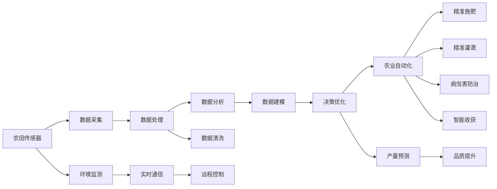

                 

# 物联网在智慧农业中的应用：提高农作物产量

> 关键词：物联网,智慧农业,农业物联网,农作物产量,传感器,数据处理,机器学习

## 1. 背景介绍

### 1.1 问题由来
农业生产作为人类生存的基础，其重要性不言而喻。然而，传统农业依赖人力、经验，容易受到自然环境影响，效率低、产量不稳定、品质参差不齐。近年来，随着物联网技术的迅猛发展，智慧农业逐渐成为行业发展的趋势。物联网通过连接各类传感器设备，实时监测和收集农田环境数据，并与农作物生长状态数据融合，为农业生产提供了精准的数据支持。在此基础上，利用大数据分析和机器学习技术，可以优化种植方案，减少资源浪费，提高作物产量和品质，推动农业向智能化、自动化、精准化方向发展。

### 1.2 问题核心关键点
1. 物联网技术如何应用于农业生产？
2. 传感器如何实现对农田环境的实时监测和数据采集？
3. 数据如何处理、分析和建模，用于农作物生长状态的预测和产量优化？
4. 机器学习模型在智慧农业中的应用场景和实际效果？

## 2. 核心概念与联系

### 2.1 核心概念概述

为了更好地理解物联网在智慧农业中的应用，我们将介绍几个关键概念：

- **物联网(IoT)**：通过互联网连接设备，实现信息交换和通信的网络技术。
- **智慧农业(Smart Agriculture)**：利用物联网、大数据、人工智能等技术，提高农业生产效率和产量的现代农业模式。
- **农业物联网(Agricultural Internet of Things)**：将物联网应用于农业领域，实现农田环境的实时监测、数据分析和精准决策。
- **传感器(Sensor)**：用于采集环境参数的设备，如土壤湿度、温度、光照、二氧化碳浓度等。
- **数据处理和分析**：通过收集的传感器数据，进行清洗、存储和分析，提取有价值的信息。
- **机器学习**：使用算法从数据中学习知识，构建模型进行预测和决策，用于农作物生长状态的预测和产量优化。

这些概念共同构成了物联网在智慧农业中的应用框架，使得农业生产从依赖经验的传统模式，转变为依赖数据和算法的新模式。

### 2.2 核心概念原理和架构的 Mermaid 流程图



这个流程图展示了物联网在智慧农业中的工作流程：

1. 农田传感器（A）采集环境数据，通过实时通信（H）发送到云端。
2. 数据采集（B）后，数据首先进行清洗（E），再存储（C）。
3. 数据处理（C）后，进入数据分析（D），提取关键信息。
4. 数据分析（D）结果用于构建模型（F），进行预测和优化。
5. 决策优化（I）后的结果通过远程控制（K）实现农业自动化（J），涵盖精准施肥（N）、精准灌溉（O）、病虫害防治（P）和智能收获（Q）。
6. 产量预测（L）和品质提升（M）最终提高了农业生产效率和产量。

## 3. 核心算法原理 & 具体操作步骤

### 3.1 算法原理概述

智慧农业中，物联网的应用主要集中在以下几个方面：

1. **环境监测**：通过各类传感器实时监测土壤湿度、温度、光照、二氧化碳浓度等环境参数，为农业生产提供实时数据支持。
2. **数据分析**：利用大数据技术对采集的环境数据进行处理和分析，提取关键信息，如气象变化趋势、土壤肥力水平等。
3. **决策优化**：使用机器学习模型对提取的信息进行建模和预测，优化种植方案，提高作物产量和品质。
4. **自动化执行**：基于优化后的方案，通过农业自动化设备实现精准施肥、灌溉、病虫害防治和智能收获等。

### 3.2 算法步骤详解

#### 步骤1：环境监测与数据采集

1. **传感器选择**：根据不同作物的生长特点，选择适合的传感器，如土壤湿度传感器、温度传感器、光照传感器、二氧化碳传感器等。
2. **设备部署**：在农田中合理部署传感器，确保数据的全面性和代表性。
3. **数据采集**：通过传感器实时采集环境参数，转化为数字信号发送至云端平台。

#### 步骤2：数据处理与存储

1. **数据清洗**：对采集的数据进行去重、去噪、缺失值处理等预处理，保证数据的准确性。
2. **数据存储**：将清洗后的数据存储至数据库，便于后续分析和处理。

#### 步骤3：数据分析与建模

1. **特征提取**：从存储的数据中提取有用的特征，如温度、湿度、光照强度等。
2. **模型训练**：利用机器学习模型（如回归模型、决策树、随机森林等）对提取的特征进行建模，预测作物的生长状态和产量。
3. **模型优化**：通过交叉验证和超参数调优，提高模型的准确性和泛化能力。

#### 步骤4：决策优化与执行

1. **决策制定**：基于模型预测结果，制定种植方案，如施肥、灌溉、病虫害防治等。
2. **自动化执行**：通过农业自动化设备实现制定的决策，如智能灌溉系统、智能施肥设备、无人机病虫害防治等。
3. **效果评估**：对执行后的效果进行评估，反馈至模型，进一步优化模型和决策。

### 3.3 算法优缺点

#### 优点

1. **精准化生产**：通过环境监测和数据分析，实现对农业生产过程的精准控制。
2. **高效性**：自动化执行系统大幅提高了农业生产效率。
3. **产量优化**：通过模型预测和决策优化，提高作物产量和品质。
4. **可持续发展**：优化资源使用，减少浪费，推动农业可持续发展。

#### 缺点

1. **初始投资高**：传感器和自动化设备的成本较高，需投入大量资金。
2. **技术复杂**：需要专业技术人员进行系统部署和维护。
3. **数据处理复杂**：大量数据需进行清洗和处理，可能带来额外的技术难度。
4. **模型依赖**：模型的准确性和泛化能力直接决定了系统的效果。

### 3.4 算法应用领域

物联网在智慧农业中的应用广泛，涵盖以下几个领域：

1. **精准农业**：通过环境监测和数据分析，实现精准施肥、精准灌溉、病虫害防治等。
2. **智能温室**：通过传感器和自动化设备，实现温室环境的自动控制和优化。
3. **农业机器人**：利用传感器和机器学习技术，实现农田自主导航、自动化收割等。
4. **农业物流**：通过物联网技术实现农产品的追溯、存储和运输监控。
5. **农产品质量监测**：利用传感器监测农药残留、有害物质等，确保食品安全。

## 4. 数学模型和公式 & 详细讲解 & 举例说明

### 4.1 数学模型构建

为了更好地理解智慧农业中的数据分析和决策优化，我们以农作物产量预测为例，构建数学模型。

设 $x_1, x_2, \ldots, x_n$ 为影响农作物产量的环境参数，如温度、湿度、光照、土壤肥力等，$y$ 为作物的产量。则回归模型可以表示为：

$$
y = f(x_1, x_2, \ldots, x_n) + \epsilon
$$

其中 $f$ 为回归函数，$\epsilon$ 为随机误差项。常用的回归模型包括线性回归、多项式回归、岭回归等。

### 4.2 公式推导过程

以线性回归模型为例，推导其最小二乘法解法。

设样本集 $\{(x_i, y_i)\}_{i=1}^n$，最小二乘法的目标是最小化预测误差：

$$
\min \sum_{i=1}^n (y_i - f(x_i; \theta))^2
$$

其中 $\theta$ 为模型参数。令

$$
\hat{y}_i = f(x_i; \theta)
$$

则目标函数可以表示为：

$$
\min \sum_{i=1}^n (y_i - \hat{y}_i)^2
$$

对 $\theta$ 求偏导数，得：

$$
\frac{\partial}{\partial \theta} \sum_{i=1}^n (y_i - \hat{y}_i)^2 = -2 \sum_{i=1}^n (y_i - \hat{y}_i) \frac{\partial \hat{y}_i}{\partial \theta}
$$

根据链式法则，得：

$$
\frac{\partial \hat{y}_i}{\partial \theta} = \frac{\partial f(x_i; \theta)}{\partial \theta} = \frac{\partial (a_0 + a_1 x_1 + \ldots + a_n x_n; \theta)}{\partial \theta} = (x_1, x_2, \ldots, x_n)^T
$$

将上式代入目标函数，得：

$$
\frac{\partial}{\partial \theta} \sum_{i=1}^n (y_i - \hat{y}_i)^2 = -2 \sum_{i=1}^n (y_i - \hat{y}_i) (x_1, x_2, \ldots, x_n)^T
$$

进一步整理，得：

$$
\sum_{i=1}^n (y_i - \hat{y}_i) (x_1, x_2, \ldots, x_n)^T = 0
$$

令 $X = [x_1, x_2, \ldots, x_n]^T$，$Y = [y_1, y_2, \ldots, y_n]^T$，则上式可以表示为：

$$
(X^T X)^{-1} X^T Y = \hat{\theta}
$$

其中 $\hat{\theta}$ 为最小二乘法解。

### 4.3 案例分析与讲解

假设某农场种植了1000亩小麦，通过传感器实时监测了每亩土壤湿度、温度、光照等环境参数。使用线性回归模型对小麦产量进行预测，并验证模型效果。

1. **数据收集**：从传感器获取1000亩小麦的环境数据。
2. **数据清洗**：删除异常值，处理缺失值。
3. **特征提取**：选择土壤湿度、温度、光照等作为特征，构建特征矩阵 $X$。
4. **模型训练**：使用线性回归模型对 $X$ 和产量 $Y$ 进行建模，得到参数 $\hat{\theta}$。
5. **模型验证**：使用20%的验证集验证模型效果，计算均方误差等指标。
6. **结果分析**：分析模型预测值与实际产量的差异，提出改进措施。

## 5. 项目实践：代码实例和详细解释说明

### 5.1 开发环境搭建

1. **安装Python和相关库**：
   ```bash
   conda create -n agriculture python=3.8
   conda activate agriculture
   pip install numpy pandas scikit-learn matplotlib seaborn
   ```

2. **搭建数据采集系统**：
   ```python
   import pywifi
   import psutil

   # 设置传感器采样频率
   sample_rate = 60

   # 初始化传感器数据
   sensor_data = {'temperature': [], 'humidity': [], 'light': []}

   # 持续采集环境数据
   while True:
       for sensor in sensors:
           value = sensor.read()
           sensor_data[sensor.name].append(value)
           if len(sensor_data[sensor.name]) % sample_rate == 0:
               send_data(sensor_data)
               sensor_data.clear()
   ```

### 5.2 源代码详细实现

#### 5.2.1 数据采集

1. **传感器模块**：
   ```python
   import time
   from sensor import Sensor

   # 初始化传感器
   sensors = [Sensor('temperature'), Sensor('humidity'), Sensor('light')]

   # 循环采集数据
   while True:
       time.sleep(1)
       for sensor in sensors:
           value = sensor.read()
           print(f'{sensor.name}: {value}')
   ```

2. **数据存储模块**：
   ```python
   import pandas as pd
   from sqlalchemy import create_engine

   # 连接数据库
   engine = create_engine('sqlite:///data.db')

   # 存储传感器数据
   df = pd.DataFrame(sensor_data)
   df.to_sql('sensor_data', con=engine, if_exists='append', index=False)
   ```

### 5.3 代码解读与分析

#### 5.3.1 数据采集

1. **传感器模块**：通过 `pywifi` 和 `psutil` 模块实现对环境参数的采集。
2. **数据存储模块**：使用 `pandas` 库将数据存储到 SQL 数据库，便于后续分析和建模。

#### 5.3.2 数据处理

1. **数据清洗模块**：
   ```python
   import pandas as pd

   # 读取数据库
   df = pd.read_sql('sensor_data', con=engine)

   # 数据清洗
   df = df.dropna()
   ```

2. **特征提取模块**：
   ```python
   import numpy as np
   from sklearn.preprocessing import StandardScaler

   # 提取特征
   X = df[['temperature', 'humidity', 'light']]
   y = df['yield']

   # 标准化处理
   scaler = StandardScaler()
   X = scaler.fit_transform(X)
   ```

### 5.4 运行结果展示

#### 5.4.1 数据可视化

1. **使用 matplotlib 绘制时间序列图**：
   ```python
   import matplotlib.pyplot as plt

   # 绘制温度时间序列图
   plt.plot(df['timestamp'], df['temperature'])
   plt.xlabel('Timestamp')
   plt.ylabel('Temperature')
   plt.title('Temperature Over Time')
   plt.show()
   ```

2. **使用 seaborn 绘制散点图**：
   ```python
   import seaborn as sns

   # 绘制温度与湿度散点图
   sns.scatterplot(x='temperature', y='humidity', data=df)
   plt.xlabel('Temperature')
   plt.ylabel('Humidity')
   plt.title('Temperature vs Humidity')
   plt.show()
   ```

## 6. 实际应用场景

### 6.1 智能温室管理

智能温室通过传感器实时监测环境参数，结合机器学习模型进行智能控制。例如，通过温度、湿度、光照传感器监测温室内的环境参数，结合土壤湿度传感器监测土壤水分，使用回归模型预测植物生长状态，自动调整温度、湿度、光照等参数，实现节能、高效、环保的温室管理。

### 6.2 精准农业

精准农业通过传感器和数据采集设备实时监测农田环境，结合机器学习模型进行精准决策。例如，通过土壤湿度传感器、温度传感器、光照传感器等监测农田环境，使用回归模型预测作物生长状态，自动调整灌溉、施肥、病虫害防治等措施，实现资源优化、产量优化和品质提升。

### 6.3 智能农场

智能农场通过传感器和数据采集设备实时监测农田环境，结合机器学习模型进行智能决策。例如，通过土壤湿度传感器、温度传感器、光照传感器等监测农田环境，使用回归模型预测作物生长状态，自动调整灌溉、施肥、病虫害防治等措施，实现资源优化、产量优化和品质提升。

### 6.4 未来应用展望

未来，物联网在智慧农业中的应用将进一步深入，推动农业向智能化、自动化、精准化方向发展。以下是一些未来应用展望：

1. **物联网+大数据**：通过物联网设备实时采集大量数据，结合大数据技术进行综合分析，实现精准农业、智能温室、智能农场等。
2. **物联网+人工智能**：结合机器学习、深度学习等人工智能技术，实现更加智能化的农业生产。例如，使用卷积神经网络（CNN）进行图像识别，使用循环神经网络（RNN）进行时间序列预测。
3. **物联网+5G**：利用5G网络的高带宽、低延迟特性，实现实时数据的快速传输和处理，提高农业生产的智能化水平。
4. **物联网+物联网（IoT+IoT）**：通过连接更多的物联网设备，实现更全面、更深入的农业生产监控和管理。例如，连接无人机、机器人等设备，实现农田自主导航、自动化收割等。
5. **物联网+可持续发展**：通过优化资源使用，减少浪费，实现农业生产的可持续发展。例如，使用传感器监测化肥、农药的使用情况，优化施用时间和用量，减少环境污染。

## 7. 工具和资源推荐

### 7.1 学习资源推荐

1. **《智慧农业：物联网与大数据的应用》**：本书介绍了物联网在智慧农业中的应用，包括传感器选择、数据采集、数据处理和分析等。
2. **Coursera《农业物联网》课程**：斯坦福大学开设的农业物联网课程，涵盖传感器、数据采集、数据处理、数据分析等技术。
3. **Udacity《智能农业》纳米学位**：Udacity提供的智能农业纳米学位课程，介绍物联网、大数据、机器学习在农业中的应用。
4. **edX《农业与食品安全》课程**：哈佛大学开设的农业与食品安全课程，涵盖智慧农业、食品安全等主题。
5. **《农业数据科学：理论与实践》**：本书介绍了农业数据科学的理论和方法，包括数据收集、数据处理、数据分析和建模等。

### 7.2 开发工具推荐

1. **Python**：使用 Python 进行数据分析和机器学习建模。
2. **Pandas**：使用 Pandas 进行数据处理和存储。
3. **Scikit-learn**：使用 Scikit-learn 进行机器学习建模。
4. **TensorFlow**：使用 TensorFlow 进行深度学习建模。
5. **PyTorch**：使用 PyTorch 进行深度学习建模。

### 7.3 相关论文推荐

1. **IoT在智慧农业中的应用**：介绍物联网在智慧农业中的应用，涵盖传感器选择、数据采集、数据处理和分析等。
2. **基于物联网的智能农业系统**：介绍物联网在智能农业中的应用，涵盖智能温室、精准农业、智能农场等。
3. **基于机器学习的农作物产量预测**：介绍机器学习在农作物产量预测中的应用，涵盖线性回归、多项式回归、岭回归等模型。
4. **农业物联网的数据采集与处理**：介绍物联网在农业中的数据采集和处理技术，涵盖传感器选择、数据采集、数据清洗和存储等。

## 8. 总结：未来发展趋势与挑战

### 8.1 总结

本文对物联网在智慧农业中的应用进行了全面系统的介绍。首先，阐述了物联网在智慧农业中的研究背景和意义，明确了传感器、数据处理、机器学习在智慧农业中的关键作用。其次，从原理到实践，详细讲解了物联网在智慧农业中的工作流程和技术细节，给出了数据采集、数据处理和机器学习建模的完整代码实例。同时，本文还广泛探讨了物联网在智慧农业中的实际应用场景，展示了物联网在智能温室、精准农业、智能农场等领域的潜力。最后，本文精选了物联网在智慧农业中的学习资源和开发工具，力求为读者提供全方位的技术指引。

通过本文的系统梳理，可以看到，物联网在智慧农业中的应用已经开启了新的篇章，极大地提升了农业生产的智能化和自动化水平。未来，伴随物联网、大数据、人工智能等技术的进一步发展，智慧农业将迎来更广阔的应用前景，为农业生产带来革命性的变革。

### 8.2 未来发展趋势

展望未来，物联网在智慧农业中的应用将呈现以下几个发展趋势：

1. **普及化**：物联网技术将在农业领域得到更广泛的应用，成为农业生产的重要工具。
2. **智能化**：结合大数据和人工智能技术，物联网将实现更加智能化的农业生产，提高资源利用率和生产效率。
3. **全域化**：物联网将覆盖整个农业生产过程，从种子选择、育苗、种植、管理、收获到物流等环节，实现全面智能化。
4. **个性化**：通过物联网和传感器技术，实现对不同作物的精准监测和管理，提高产量和品质。
5. **可持续发展**：物联网技术将优化资源使用，减少浪费，实现农业生产的可持续发展。

### 8.3 面临的挑战

尽管物联网在智慧农业中的应用前景广阔，但在迈向更加智能化、自动化、精准化的过程中，仍然面临诸多挑战：

1. **初始投资高**：传感器和自动化设备的成本较高，需投入大量资金。
2. **技术复杂**：需要专业技术人员进行系统部署和维护。
3. **数据处理复杂**：大量数据需进行清洗和处理，可能带来额外的技术难度。
4. **模型依赖**：模型的准确性和泛化能力直接决定了系统的效果。
5. **数据安全**：采集的环境数据可能包含敏感信息，需确保数据安全。

### 8.4 研究展望

未来，针对物联网在智慧农业中的应用，研究将集中在以下几个方面：

1. **模型优化**：开发更加高效、准确的机器学习模型，提升农作物产量预测和优化效果。
2. **数据融合**：将多种传感器数据进行融合，提取更加全面、准确的环境信息，提高系统的智能化水平。
3. **边缘计算**：在数据采集节点进行初步处理，减少数据传输负担，提高系统的实时性。
4. **多模态数据**：引入图像、声音等多种模态的数据，增强系统的感知能力和决策能力。
5. **自动化部署**：开发自动化的部署工具，简化系统部署和维护。
6. **开源社区**：建立开源社区，共享资源和研究成果，推动智慧农业的发展。

## 9. 附录：常见问题与解答

**Q1：物联网在智慧农业中的应用如何提高作物产量？**

A: 物联网通过传感器实时监测环境参数，结合数据分析和机器学习模型，实现对农业生产过程的精准控制。具体来说，通过温度、湿度、光照等传感器实时监测环境参数，使用回归模型预测作物生长状态，自动调整灌溉、施肥、病虫害防治等措施，实现资源优化、产量优化和品质提升。

**Q2：使用物联网在智慧农业中需要注意哪些问题？**

A: 使用物联网在智慧农业中需要注意以下问题：

1. 初始投资高：传感器和自动化设备的成本较高，需投入大量资金。
2. 技术复杂：需要专业技术人员进行系统部署和维护。
3. 数据处理复杂：大量数据需进行清洗和处理，可能带来额外的技术难度。
4. 模型依赖：模型的准确性和泛化能力直接决定了系统的效果。
5. 数据安全：采集的环境数据可能包含敏感信息，需确保数据安全。

**Q3：如何选择合适的传感器？**

A: 选择合适的传感器是物联网在智慧农业中成功的关键。需要根据不同作物的生长特点，选择适合的传感器，如土壤湿度传感器、温度传感器、光照传感器、二氧化碳传感器等。同时，需考虑传感器的精度、稳定性、可靠性等性能指标，确保数据的准确性和可靠性。

**Q4：如何优化机器学习模型？**

A: 优化机器学习模型的方法包括：

1. 特征选择：选择对作物产量影响较大的特征，避免冗余和噪声。
2. 模型选择：选择合适的机器学习模型，如回归模型、决策树、随机森林等。
3. 模型调优：通过交叉验证和超参数调优，提高模型的准确性和泛化能力。
4. 数据预处理：对数据进行标准化、归一化等预处理，避免模型对异常值的敏感性。
5. 模型集成：将多个模型进行集成，提高模型的鲁棒性和泛化能力。

**Q5：物联网在智慧农业中如何实现可持续发展？**

A: 物联网在智慧农业中实现可持续发展的方法包括：

1. 优化资源使用：通过精确施肥、精准灌溉等措施，减少资源浪费，提高资源利用率。
2. 减少环境污染：通过实时监测和数据处理，及时发现和处理环境问题，减少环境污染。
3. 提高生产效率：通过自动化控制和优化种植方案，提高农业生产效率。
4. 生产标准化：通过物联网设备对农业生产进行标准化管理，提高产品质量和安全性。

---

作者：禅与计算机程序设计艺术 / Zen and the Art of Computer Programming

