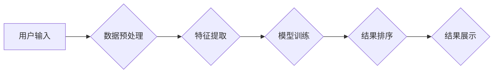

                 

## 电商平台中AI大模型的搜索结果个性化推荐

> 关键词：电商平台、AI大模型、搜索结果个性化、推荐系统、深度学习、用户行为分析、自然语言处理

## 1. 背景介绍

在当今数据爆炸的时代，电商平台面临着海量商品和用户需求的挑战。传统的搜索引擎依靠关键词匹配，难以满足用户个性化需求，搜索结果往往缺乏针对性和精准度。因此，如何利用人工智能技术提升搜索结果的个性化推荐能力，成为电商平台发展的重要方向。

AI大模型凭借其强大的学习和推理能力，在搜索结果个性化推荐方面展现出巨大的潜力。通过对用户行为、商品信息、搜索历史等数据的深度学习，AI大模型可以构建用户画像，理解用户需求，并推荐更符合用户偏好的商品。

## 2. 核心概念与联系

### 2.1 搜索结果个性化推荐

搜索结果个性化推荐是指根据用户的个人特征、兴趣爱好、购买历史等信息，为用户提供定制化的搜索结果，提升用户搜索体验和转化率。

### 2.2 AI大模型

AI大模型是指在海量数据上训练的深度学习模型，具有强大的泛化能力和学习能力。常见的AI大模型包括BERT、GPT、T5等。

### 2.3 核心架构

电商平台的搜索结果个性化推荐系统通常由以下几个模块组成：



**流程说明：**

1. **用户输入：** 用户输入搜索关键词。
2. **数据预处理：** 对用户输入进行清洗、格式化等处理，提取关键词和相关信息。
3. **特征提取：** 从用户行为、商品信息、搜索历史等数据中提取特征，构建用户画像和商品描述向量。
4. **模型训练：** 利用AI大模型对提取的特征进行训练，学习用户偏好和商品关系。
5. **结果排序：** 根据模型预测结果，对搜索结果进行排序，推荐最符合用户需求的商品。
6. **结果展示：** 将排序后的搜索结果展示给用户。

## 3. 核心算法原理 & 具体操作步骤

### 3.1 算法原理概述

搜索结果个性化推荐系统通常采用基于深度学习的推荐算法，例如协同过滤、内容过滤、混合推荐等。

* **协同过滤：** 基于用户的历史行为和商品评分数据，预测用户对特定商品的兴趣。
* **内容过滤：** 基于商品的属性和描述信息，推荐与用户兴趣相符的商品。
* **混合推荐：** 结合协同过滤和内容过滤的优势，构建更精准的推荐模型。

### 3.2 算法步骤详解

**以协同过滤算法为例，其具体操作步骤如下：**

1. **数据收集：** 收集用户行为数据，例如用户对商品的评分、购买记录、浏览历史等。
2. **数据预处理：** 对数据进行清洗、格式化、缺失值处理等操作。
3. **用户-商品矩阵构建：** 将用户和商品映射到矩阵中，每个元素表示用户对商品的评分或交互行为。
4. **相似度计算：** 计算用户之间的相似度或商品之间的相似度，可以使用余弦相似度、皮尔逊相关系数等方法。
5. **推荐生成：** 根据用户相似度或商品相似度，推荐用户可能感兴趣的商品。

### 3.3 算法优缺点

**协同过滤算法的优点：**

* 可以发现用户隐性偏好，推荐个性化商品。
* 不需要商品的显式特征信息，可以推荐新商品。

**协同过滤算法的缺点：**

* 数据稀疏性问题：当用户行为数据较少时，难以计算出准确的相似度。
* 冷启动问题：对于新用户或新商品，难以进行推荐。

### 3.4 算法应用领域

协同过滤算法广泛应用于电商平台、视频网站、音乐平台等场景，用于商品推荐、内容推荐、用户画像等。

## 4. 数学模型和公式 & 详细讲解 & 举例说明

### 4.1 数学模型构建

协同过滤算法的核心是用户-商品矩阵，可以使用矩阵分解技术进行模型构建。假设用户集合为U，商品集合为I，用户-商品矩阵为R，其中R(u,i)表示用户u对商品i的评分或交互行为。

**矩阵分解模型：**

$$R \approx U V^T$$

其中，U为用户特征矩阵，V为商品特征矩阵。

### 4.2 公式推导过程

目标是找到最优的U和V矩阵，使得预测评分与实际评分之间的误差最小。可以使用最小二乘法或梯度下降法进行优化。

**损失函数：**

$$L(U, V) = \sum_{u \in U, i \in I} (R(u, i) - \hat{R}(u, i))^2$$

其中，$\hat{R}(u, i)$为预测评分。

### 4.3 案例分析与讲解

假设有一个用户-商品矩阵，其中用户集合为{1, 2, 3}, 商品集合为{A, B, C}, 矩阵如下：

```
R = [
    [5, 3, 4],
    [4, 5, 2],
    [3, 2, 5]
]
```

可以使用矩阵分解模型对该矩阵进行分解，得到用户特征矩阵U和商品特征矩阵V。然后，可以使用预测评分$\hat{R}(u, i)$来推荐商品。

## 5. 项目实践：代码实例和详细解释说明

### 5.1 开发环境搭建

* Python 3.x
* TensorFlow/PyTorch
* Jupyter Notebook

### 5.2 源代码详细实现

```python
import tensorflow as tf

# 定义用户-商品矩阵
R = tf.constant([
    [5, 3, 4],
    [4, 5, 2],
    [3, 2, 5]
])

# 定义用户特征矩阵和商品特征矩阵
U = tf.Variable(tf.random.normal([3, 2]))
V = tf.Variable(tf.random.normal([3, 2]))

# 定义预测评分函数
def predict(u, i):
    return tf.reduce_sum(U[u] * V[i])

# 定义损失函数
def loss(R, U, V):
    predictions = predict(tf.range(R.shape[0]), tf.range(R.shape[1]))
    return tf.reduce_mean(tf.square(R - predictions))

# 定义优化器
optimizer = tf.keras.optimizers.Adam()

# 训练模型
for epoch in range(100):
    with tf.GradientTape() as tape:
        loss_value = loss(R, U, V)
    gradients = tape.gradient(loss_value, [U, V])
    optimizer.apply_gradients(zip(gradients, [U, V]))

# 打印训练结果
print(loss(R, U, V))
```

### 5.3 代码解读与分析

* 代码首先定义了用户-商品矩阵R，以及用户特征矩阵U和商品特征矩阵V。
* 然后定义了预测评分函数predict和损失函数loss。
* 使用Adam优化器对模型进行训练，并打印训练结果。

### 5.4 运行结果展示

训练完成后，可以利用预测评分函数对新的用户和商品进行推荐。

## 6. 实际应用场景

### 6.1 商品推荐

电商平台可以利用AI大模型对用户历史购买记录、浏览记录、收藏记录等数据进行分析，推荐用户可能感兴趣的商品。

### 6.2 搜索结果排序

AI大模型可以根据用户搜索关键词、历史搜索记录、用户画像等信息，对搜索结果进行排序，提升搜索结果的精准度和相关性。

### 6.3 个性化广告

AI大模型可以根据用户的兴趣爱好、购买行为等信息，精准投放个性化广告，提升广告点击率和转化率。

### 6.4 未来应用展望

随着AI技术的不断发展，AI大模型在电商平台的应用场景将更加广泛，例如：

* **智能客服：** 利用AI大模型构建智能客服系统，为用户提供更便捷的购物体验。
* **商品画像：** 利用AI大模型对商品进行画像，分析商品属性、用户评价等信息，为商品定价、营销等提供数据支持。
* **供应链优化：** 利用AI大模型预测商品需求、优化库存管理等，提升供应链效率。

## 7. 工具和资源推荐

### 7.1 学习资源推荐

* **书籍：**
    * 深度学习
    * 自然语言处理
* **在线课程：**
    * Coursera
    * edX
    * Udacity

### 7.2 开发工具推荐

* **TensorFlow:** 开源深度学习框架
* **PyTorch:** 开源深度学习框架
* **Jupyter Notebook:** 交互式编程环境

### 7.3 相关论文推荐

* BERT: Pre-training of Deep Bidirectional Transformers for Language Understanding
* GPT-3: Language Models are Few-Shot Learners
* T5: Text-to-Text Transfer Transformer

## 8. 总结：未来发展趋势与挑战

### 8.1 研究成果总结

AI大模型在电商平台的搜索结果个性化推荐方面取得了显著成果，能够提升用户体验和转化率。

### 8.2 未来发展趋势

* **模型规模和能力提升：** 未来AI大模型规模将进一步扩大，能力将更加强大，能够处理更复杂的数据和任务。
* **多模态融合：** 将文本、图像、音频等多模态数据融合到推荐模型中，提升推荐的精准度和多样性。
* **个性化定制：** 基于用户的个性化需求，定制化推荐商品和服务。

### 8.3 面临的挑战

* **数据隐私和安全：** AI大模型需要大量用户数据进行训练，如何保护用户隐私和数据安全是一个重要挑战。
* **算法公平性和可解释性：** AI大模型的推荐结果可能存在偏差和不可解释性，需要研究如何保证算法公平性和可解释性。
* **模型部署和维护：** 将AI大模型部署到生产环境中，并进行持续维护和更新是一个技术挑战。

### 8.4 研究展望

未来，AI大模型在电商平台的应用将更加广泛和深入，需要不断探索新的算法、模型和应用场景，以更好地服务用户和推动电商行业发展。

## 9. 附录：常见问题与解答

* **Q1：AI大模型的训练需要多少数据？**

A1：AI大模型的训练数据量取决于模型规模和复杂度，一般需要海量数据才能达到良好的效果。

* **Q2：如何评估AI大模型的推荐效果？**

A2：可以使用点击率、转化率、用户满意度等指标来评估AI大模型的推荐效果。

* **Q3：如何解决AI大模型的冷启动问题？**

A3：可以使用协同过滤算法中的基于内容过滤的方法，或者利用用户的其他信息进行补充。


作者：禅与计算机程序设计艺术 / Zen and the Art of Computer Programming 
<end_of_turn>

