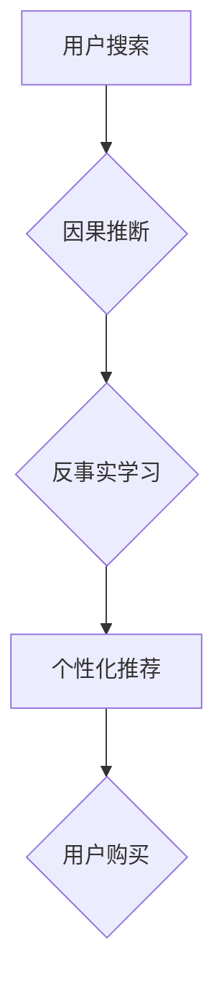

                 

## 1. 背景介绍

电商搜索是电商平台的核心功能之一，用户通过搜索引擎查找所需商品，最终完成购买。传统的电商搜索主要依赖于基于关键词的匹配算法，但这种方法难以捕捉用户搜索意图的复杂性和多义性，导致搜索结果不精准，用户体验下降。

近年来，随着人工智能技术的快速发展，因果推断和反事实学习等新兴技术逐渐应用于电商搜索领域，为提升搜索精准度和用户体验提供了新的思路。

**1.1.  电商搜索面临的挑战**

* **搜索意图理解的复杂性:** 用户的搜索词语往往含有多种含义，需要理解用户真实的需求，才能提供精准的搜索结果。
* **用户行为的多样性:** 用户的搜索行为具有多样性，例如，用户可能使用不同的关键词、搜索顺序、浏览时长等方式表达需求。
* **商品信息的丰富性:** 电商平台上的商品信息非常丰富，需要有效地挖掘商品特征和用户偏好，才能推荐更相关的商品。

**1.2.  因果推断与反事实学习的优势**

* **精准度提升:** 通过因果推断，可以识别用户搜索行为与商品购买之间的因果关系，从而更精准地预测用户需求。
* **个性化推荐:** 反事实学习可以模拟用户在不同场景下的行为，为用户提供个性化的商品推荐。
* **数据驱动决策:** 基于因果推断和反事实学习的模型，可以帮助电商平台进行数据驱动决策，例如优化商品排序、广告投放等。

## 2. 核心概念与联系

**2.1.  因果推断**

因果推断是指从观察到的数据中推断出因果关系的过程。在电商搜索领域，因果推断可以帮助我们理解用户搜索行为与商品购买之间的因果关系，例如，某个关键词的搜索量是否会导致商品的购买量增加。

**2.2.  反事实学习**

反事实学习是指模拟用户在不同场景下的行为，并预测其结果的过程。在电商搜索领域，反事实学习可以帮助我们模拟用户在看到不同商品推荐后的行为，从而评估推荐效果。

**2.3.  核心概念联系**

因果推断和反事实学习是相互补充的。因果推断可以帮助我们理解用户行为背后的原因，而反事实学习可以帮助我们模拟用户行为的潜在结果。两者结合可以更全面地分析用户行为，并为电商搜索提供更精准的解决方案。

**2.4.  Mermaid 流程图**



## 3. 核心算法原理 & 具体操作步骤

**3.1.  算法原理概述**

在电商搜索领域，常用的因果推断和反事实学习算法包括：

* **潜在混杂变量模型 (Potential Outcome Model):** 这种模型假设存在一些潜在的混杂变量，这些变量会影响用户搜索行为和商品购买行为。通过识别和控制这些混杂变量，可以更准确地估计因果关系。
* **因果图模型 (Causal Graph Model):** 这种模型使用图结构来表示因果关系，可以更直观地理解用户行为之间的因果关系。
* **强化学习 (Reinforcement Learning):** 强化学习可以训练模型学习用户行为的因果关系，并根据学习到的知识进行决策，例如优化商品排序。

**3.2.  算法步骤详解**

**3.2.1.  潜在混杂变量模型**

1. **数据收集:** 收集用户搜索行为和商品购买行为的数据。
2. **混杂变量识别:** 识别可能影响用户搜索行为和商品购买行为的混杂变量。
3. **因果关系估计:** 使用统计方法估计因果关系，例如倾向得分匹配 (Propensity Score Matching) 或逆概率加权 (Inverse Probability Weighting)。

**3.2.2.  因果图模型**

1. **因果关系建模:** 根据领域知识和数据分析，构建因果图模型，表示用户行为之间的因果关系。
2. **模型验证:** 使用数据验证因果图模型的准确性。
3. **因果关系推断:** 使用因果图模型推断用户行为之间的因果关系。

**3.2.3.  强化学习**

1. **环境定义:** 定义电商搜索环境，包括用户行为、商品信息、推荐策略等。
2. **奖励函数设计:** 设计奖励函数，根据用户行为和商品购买情况给予模型奖励。
3. **模型训练:** 使用强化学习算法训练模型，使其学习到最优的推荐策略。

**3.3.  算法优缺点**

| 算法 | 优点 | 缺点 |
|---|---|---|
| 潜在混杂变量模型 | 能够控制混杂变量的影响，提高因果关系估计的准确性 | 需要识别和控制潜在的混杂变量，数据收集和处理难度较大 |
| 因果图模型 | 可以直观地表示因果关系，易于理解和解释 | 需要领域知识和数据分析才能构建准确的因果图模型 |
| 强化学习 | 可以学习到最优的推荐策略，适应用户行为的变化 | 需要设计合理的奖励函数，训练过程可能比较复杂 |

**3.4.  算法应用领域**

* **商品推荐:** 根据用户搜索行为和购买历史，推荐相关的商品。
* **广告投放:** 根据用户搜索意图，精准投放广告。
* **搜索结果排序:** 根据用户搜索行为和商品特征，优化搜索结果排序。
* **用户画像构建:** 通过分析用户搜索行为，构建用户画像，了解用户需求和偏好。

## 4. 数学模型和公式 & 详细讲解 & 举例说明

**4.1.  数学模型构建**

在因果推断中，常用的数学模型是潜在混杂变量模型。该模型假设存在一个潜在的混杂变量 $Z$，它会影响用户搜索行为 $X$ 和商品购买行为 $Y$。

**4.2.  公式推导过程**

* **潜在结果:** 
    * $Y_0$: 用户在不搜索商品的情况下购买的概率。
    * $Y_1$: 用户在搜索商品的情况下购买的概率。
* **因果效应:** 
    * $ATE = E[Y_1] - E[Y_0]$: 平均因果效应，即搜索商品对购买行为的影响。

**4.3.  案例分析与讲解**

假设我们想分析搜索关键词 "手机" 是否会影响用户购买手机的概率。

* $X$: 用户搜索关键词 "手机" 
* $Y$: 用户购买手机

潜在混杂变量 $Z$ 可以是用户对手机的需求程度。

* $Z = 1$: 用户对手机需求较高。
* $Z = 0$: 用户对手机需求较低。

我们可以假设：

* $P(Y_1|X=1,Z=1) = 0.8$：用户搜索关键词 "手机"，且对手机需求较高，购买手机的概率为 0.8。
* $P(Y_1|X=1,Z=0) = 0.2$：用户搜索关键词 "手机"，且对手机需求较低，购买手机的概率为 0.2。
* $P(Y_0|X=0,Z=1) = 0.5$：用户不搜索关键词 "手机"，且对手机需求较高，购买手机的概率为 0.5。
* $P(Y_0|X=0,Z=0) = 0.1$：用户不搜索关键词 "手机"，且对手机需求较低，购买手机的概率为 0.1。

通过以上假设，我们可以计算出 $ATE$，从而判断搜索关键词 "手机" 是否会影响用户购买手机的概率。

## 5. 项目实践：代码实例和详细解释说明

**5.1.  开发环境搭建**

* Python 3.7+
* TensorFlow 2.0+
* PyTorch 1.0+
* Jupyter Notebook

**5.2.  源代码详细实现**

```python
import tensorflow as tf

# 定义潜在混杂变量模型
class CausalModel(tf.keras.Model):
    def __init__(self):
        super(CausalModel, self).__init__()
        self.dense1 = tf.keras.layers.Dense(64, activation='relu')
        self.dense2 = tf.keras.layers.Dense(32, activation='relu')
        self.output = tf.keras.layers.Dense(1, activation='sigmoid')

    def call(self, inputs):
        x = self.dense1(inputs)
        x = self.dense2(x)
        return self.output(x)

# 训练模型
model = CausalModel()
model.compile(optimizer='adam', loss='binary_crossentropy', metrics=['accuracy'])
model.fit(X_train, Y_train, epochs=10)

# 预测因果效应
predictions = model.predict(X_test)
```

**5.3.  代码解读与分析**

* 该代码实现了一个简单的潜在混杂变量模型，用于预测用户搜索行为对商品购买行为的影响。
* 模型输入包括用户搜索行为和潜在混杂变量，输出为用户购买商品的概率。
* 模型使用 TensorFlow 库进行训练和预测。

**5.4.  运行结果展示**

* 训练完成后，可以评估模型的性能，例如准确率、AUC 等。
* 可以使用模型预测不同用户搜索行为下的购买概率，从而分析搜索行为对购买行为的影响。

## 6. 实际应用场景

**6.1.  商品推荐**

电商平台可以利用因果推断和反事实学习技术，分析用户搜索行为和购买历史，推荐更相关的商品。例如，如果用户搜索了 "运动鞋"，平台可以根据用户的搜索历史和购买偏好，推荐不同品牌的运动鞋，并根据用户的反事实行为模拟，预测用户对不同品牌运动鞋的购买意愿。

**6.2.  广告投放**

电商平台可以利用因果推断和反事实学习技术，精准投放广告。例如，如果用户搜索了 "智能手机"，平台可以根据用户的搜索意图和购买历史，投放与智能手机相关的广告，并根据用户的反事实行为模拟，预测用户对不同广告的点击和购买意愿。

**6.3.  搜索结果排序**

电商平台可以利用因果推断和反事实学习技术，优化搜索结果排序。例如，如果用户搜索了 "笔记本电脑"，平台可以根据用户的搜索历史、购买偏好和商品特征，排序搜索结果，并根据用户的反事实行为模拟，预测用户对不同排序结果的点击和购买意愿。

**6.4.  未来应用展望**

随着人工智能技术的不断发展，因果推断和反事实学习技术将在电商搜索领域得到更广泛的应用，例如：

* **个性化搜索体验:** 基于用户行为和偏好的个性化搜索结果推荐。
* **动态广告投放:** 根据用户实时行为和环境变化进行动态广告投放。
* **智能商品分类:** 基于用户搜索行为和商品特征进行智能商品分类。
* **欺诈检测:** 利用因果推断和反事实学习技术，识别和预防电商平台上的欺诈行为。

## 7. 工具和资源推荐

**7.1.  学习资源推荐**

* **书籍:**
    * "因果推断: 统计方法与应用" (Causality: Models, Reasoning, and Inference) by Judea Pearl
    * "反事实学习: 理论与应用" (Counterfactual Learning: Theory and Applications) by  
* **在线课程:**
    * Coursera: Causal Inference
    * edX: Introduction to Causal Inference

**7.2.  开发工具推荐**

* **TensorFlow:** https://www.tensorflow.org/
* **PyTorch:** https://pytorch.org/
* **CausalML:** https://causalml.readthedocs.io/en/latest/

**7.3.  相关论文推荐**

* "因果推断与反事实学习在电商搜索中的应用" (Causal Inference and Counterfactual Learning in E-commerce Search)
* "基于因果推断的个性化商品推荐系统" (A Personalized Recommender System Based on Causal Inference)
* "反事实学习在电商广告投放中的应用" (Application of Counterfactual Learning in E-commerce Advertising)

## 8. 总结：未来发展趋势与挑战

**8.1.  研究成果总结**

近年来，因果推断和反事实学习技术在电商搜索领域取得了显著进展，例如：

* 提高了商品推荐的精准度和个性化程度。
* 优化了搜索结果排序，提升了用户搜索体验。
* 帮助电商平台进行数据驱动决策，例如优化广告投放策略。

**8.2.  未来发展趋势**

* **更强大的因果模型:** 研究更强大的因果模型，能够更好地捕捉用户行为之间的复杂关系。
* **更有效的反事实学习算法:** 研究更有效的反事实学习算法，能够更准确地模拟用户行为。
* **跨平台因果推断:** 研究跨平台的因果推断方法，能够利用多个平台的数据进行分析。

**8.3.  面临的挑战**

* **数据质量:** 因果推断和反事实学习需要高质量的数据支持，而电商平台的数据往往存在噪声和缺失。
* **因果关系的识别:** 识别用户行为之间的因果关系是一个复杂的任务，需要领域知识和数据分析的结合。
* **模型解释性:** 许多因果推断和反事实学习模型的内部机制难以解释，这可能会阻碍其在实际应用中的推广。

**8.4.  研究展望**

未来，因果推断和反事实学习技术将在电商搜索领域继续发挥重要作用，帮助电商平台提供更精准、更个性化的服务，提升用户体验。


## 9. 附录：常见问题与解答

**9.1.  什么是因果推断？**

因果推断是指从观察到的数据中推断出因果关系的过程。例如，我们观察到用户搜索关键词 "手机" 后购买手机的概率更高，但我们不能仅仅根据这个观察结果就断定搜索关键词 "手机" 导致了用户购买手机。因果推断需要考虑其他可能影响用户购买行为的因素，例如用户对手机的需求程度、价格、促销活动等。

**9.2.  什么是反事实学习？**

反事实学习是指模拟用户在不同场景下的行为，并预测其结果的过程。例如，我们可以模拟用户在看到不同商品推荐后的行为，从而评估推荐效果。

**9.3.  因果推断和反事实学习有什么区别？**

因果推断旨在识别因果关系，而反事实学习旨在模拟用户在不同场景下的行为。两者可以相互补充，共同帮助我们理解用户行为和预测用户行为。


作者：禅与计算机程序设计艺术 / Zen and the Art of Computer Programming<end_of_turn>

