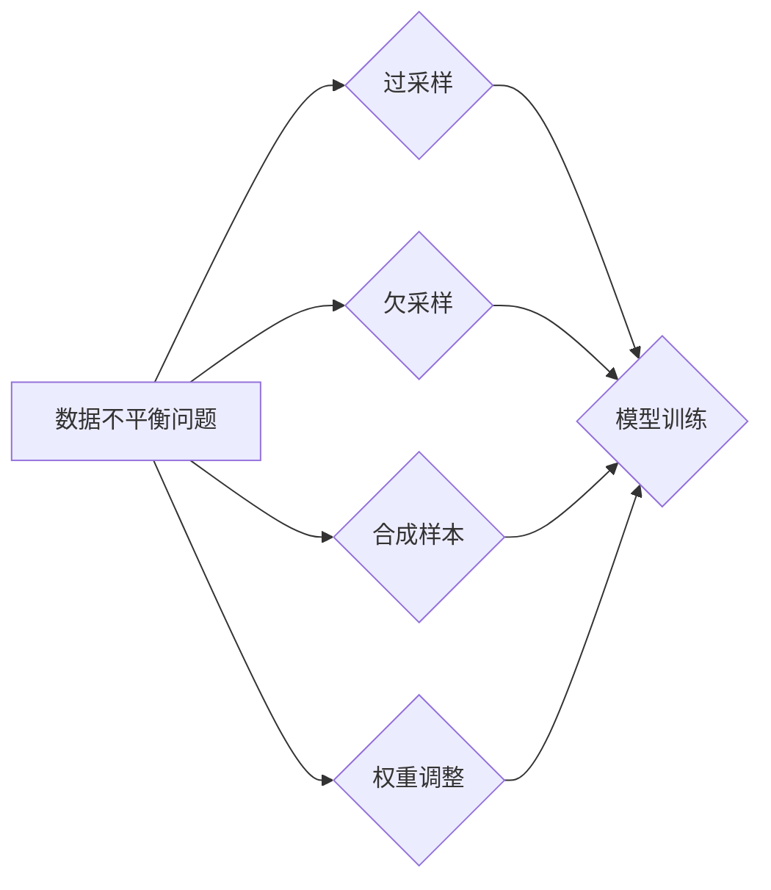

                 

## 关键词：电商搜索推荐、AI大模型、数据不平衡、解决方案、应用指南

## 1. 背景介绍

在当今数据驱动型经济时代，电商平台的搜索推荐系统已成为用户获取商品信息和完成购买决策的关键环节。AI大模型凭借其强大的学习能力和泛化能力，在电商搜索推荐领域展现出巨大潜力，能够精准匹配用户需求，提升用户体验和转化率。然而，电商搜索推荐数据往往存在着严重的数据不平衡问题，即某些商品的搜索量和点击量远高于其他商品，导致模型训练效果不佳，难以准确推荐冷门商品。

数据不平衡问题对AI大模型的训练和应用具有以下负面影响：

* **模型偏向性:** 模型倾向于学习那些出现频率高的商品信息，忽略了冷门商品的特征，导致推荐结果缺乏多样性和覆盖面。
* **准确率下降:** 模型在预测冷门商品的点击率和转化率时表现不佳，降低了推荐系统的整体准确率。
* **用户体验下降:** 用户难以发现自己真正需要的商品，导致购物体验不佳，降低用户粘性和复购率。

## 2. 核心概念与联系

### 2.1 数据不平衡问题

数据不平衡是指在训练数据集中，某些类别（例如，热门商品）的样本数量远大于其他类别（例如，冷门商品）的样本数量。这种现象在电商搜索推荐数据中普遍存在，主要原因包括：

* **用户行为偏好:** 用户往往倾向于搜索和购买热门商品，导致热门商品的数据量远大于冷门商品。
* **商品属性差异:** 热门商品通常具有更强的市场竞争力，更容易获得曝光和流量，从而积累更多的用户数据。

### 2.2 AI大模型

AI大模型是指参数量巨大、训练数据量庞大的深度学习模型，能够学习复杂的模式和关系，在自然语言处理、图像识别、语音合成等领域取得突破性进展。在电商搜索推荐领域，AI大模型可以用于：

* **商品分类和推荐:** 根据用户的搜索历史、浏览记录和购买行为，预测用户对哪些商品感兴趣，并推荐相关商品。
* **搜索结果排序:** 根据商品的 relevance、popularity、user engagement 等因素，对搜索结果进行排序，提升用户体验。
* **个性化推荐:** 根据用户的兴趣偏好和需求，提供个性化的商品推荐，提高用户满意度。

### 2.3 数据不平衡解决方案

为了解决数据不平衡问题，在训练AI大模型时，需要采用相应的解决方案，例如：

* **过采样:** 复制少数类样本，增加其数量，使训练数据更加均衡。
* **欠采样:** 删除过多的多数类样本，减少其数量，使训练数据更加均衡。
* **合成样本:** 利用现有样本生成新的样本，增加少数类的样本数量。
* **权重调整:** 为不同类别的样本分配不同的权重，提高模型对少数类的学习能力。

**Mermaid 流程图**



## 3. 核心算法原理 & 具体操作步骤

### 3.1 算法原理概述

**过采样**

过采样是指在训练数据集中复制少数类样本，增加其数量，使训练数据更加均衡。常用的过采样方法包括：

* **复制样本:** 直接复制少数类样本，增加其数量。
* **SMOTE (Synthetic Minority Over-sampling Technique):** 利用少数类样本之间的距离信息，生成新的样本，增加少数类的样本数量。

**欠采样**

欠采样是指删除过多的多数类样本，减少其数量，使训练数据更加均衡。常用的欠采样方法包括：

* **随机删除:** 随机删除多数类样本。
* **有放回抽样:** 从多数类样本中随机抽取一定数量的样本，作为训练数据。

**合成样本**

合成样本是指利用现有样本生成新的样本，增加少数类的样本数量。常用的合成样本方法包括：

* **GAN (Generative Adversarial Networks):** 利用生成对抗网络，生成与少数类样本相似的新的样本。
* **SMOTE-ENN (SMOTE with Edited Nearest Neighbors):** 将SMOTE与Edited Nearest Neighbors算法结合，生成新的样本并删除噪声样本。

**权重调整**

权重调整是指为不同类别的样本分配不同的权重，提高模型对少数类的学习能力。常用的权重调整方法包括：

* **类权重:** 为每个类别分配不同的权重，使模型对少数类的学习更加重视。
* **样本权重:** 为每个样本分配不同的权重，使模型对难分类样本更加关注。

### 3.2 算法步骤详解

**过采样**

1. 确定训练数据集中少数类样本的数量。
2. 选择合适的过采样方法，例如复制样本或SMOTE。
3. 根据选择的过采样方法，生成新的少数类样本，并将其添加到训练数据集中。
4. 训练AI大模型，使用新的训练数据。

**欠采样**

1. 确定训练数据集中多数类样本的数量。
2. 选择合适的欠采样方法，例如随机删除或有放回抽样。
3. 根据选择的欠采样方法，删除部分多数类样本，使训练数据更加均衡。
4. 训练AI大模型，使用新的训练数据。

**合成样本**

1. 选择合适的合成样本方法，例如GAN或SMOTE-ENN。
2. 利用现有样本生成新的少数类样本。
3. 将生成的新的样本添加到训练数据集中。
4. 训练AI大模型，使用新的训练数据。

**权重调整**

1. 确定训练数据集中不同类别的样本数量。
2. 为每个类别分配不同的权重，例如类权重。
3. 在训练AI大模型时，使用权重调整策略，使模型对少数类的学习更加重视。

### 3.3 算法优缺点

| 算法 | 优点 | 缺点 |
|---|---|---|
| 过采样 | 容易实现，效果显著 | 可能导致过拟合 |
| 欠采样 | 减少训练数据量，提高训练速度 | 可能丢失重要信息 |
| 合成样本 | 可以生成与真实样本相似的样本 | 生成样本的质量取决于算法 |
| 权重调整 | 不会改变训练数据量，避免过拟合 | 需要根据实际情况调整权重 |

### 3.4 算法应用领域

数据不平衡解决方案广泛应用于各种领域，例如：

* **电商搜索推荐:** 解决热门商品和冷门商品数据不平衡问题，提高推荐系统的准确率和多样性。
* **医疗诊断:** 解决疾病类型数据不平衡问题，提高疾病诊断的准确率。
* **欺诈检测:** 解决正常交易和欺诈交易数据不平衡问题，提高欺诈检测的准确率。
* **金融风险评估:** 解决正常客户和风险客户数据不平衡问题，提高风险评估的准确率。

## 4. 数学模型和公式 & 详细讲解 & 举例说明

### 4.1 数学模型构建

**过采样**

假设训练数据集中，少数类样本数量为 $m$，多数类样本数量为 $n$。过采样后，少数类样本数量增加到 $m'$，多数类样本数量保持不变。

**欠采样**

假设训练数据集中，多数类样本数量为 $n$。欠采样后，多数类样本数量减少到 $n'$。

**合成样本**

合成样本方法通常基于生成对抗网络 (GAN)，其数学模型较为复杂，涉及到生成器和判别器的训练过程。

**权重调整**

在权重调整策略中，每个样本的权重 $w_i$ 可以根据其类别进行调整。例如，对于少数类样本，其权重可以设置为 $w_i = \frac{1}{p_i}$，其中 $p_i$ 是该类别的样本比例。

### 4.2 公式推导过程

过采样和欠采样方法的数学推导过程相对简单，主要涉及到样本数量的调整。

合成样本方法的数学推导过程较为复杂，涉及到生成器和判别器的训练过程，需要参考相关论文和文献。

权重调整策略的数学推导过程主要涉及到样本权重的计算公式，例如类权重和样本权重。

### 4.3 案例分析与讲解

**过采样案例:**

假设电商平台的商品数据集中，热门商品的样本数量为 1000，冷门商品的样本数量为 100。可以使用SMOTE方法对冷门商品样本进行过采样，增加其数量到 500，使训练数据更加均衡。

**欠采样案例:**

假设电商平台的商品数据集中，热门商品的样本数量为 1000，冷门商品的样本数量为 100。可以使用随机删除方法对热门商品样本进行欠采样，减少其数量到 500，使训练数据更加均衡。

**合成样本案例:**

可以使用GAN方法生成新的冷门商品样本，并将其添加到训练数据集中，提高模型对冷门商品的学习能力。

**权重调整案例:**

可以使用类权重策略，为冷门商品样本分配更高的权重，使模型对冷门商品的学习更加重视。

## 5. 项目实践：代码实例和详细解释说明

### 5.1 开发环境搭建

* Python 3.7+
* TensorFlow 2.0+
* PyTorch 1.0+
* scikit-learn 0.20+

### 5.2 源代码详细实现

```python
# 导入必要的库
import pandas as pd
from sklearn.model_selection import train_test_split
from sklearn.linear_model import LogisticRegression
from imblearn.over_sampling import SMOTE

# 加载数据
data = pd.read_csv('电商搜索推荐数据.csv')

# 分割特征和目标变量
X = data.drop('点击率', axis=1)
y = data['点击率']

# 使用SMOTE进行过采样
smote = SMOTE(random_state=42)
X_resampled, y_resampled = smote.fit_resample(X, y)

# 将数据分割为训练集和测试集
X_train, X_test, y_train, y_test = train_test_split(X_resampled, y_resampled, test_size=0.2, random_state=42)

# 训练逻辑回归模型
model = LogisticRegression()
model.fit(X_train, y_train)

# 评估模型性能
from sklearn.metrics import accuracy_score, precision_score, recall_score, f1_score
y_pred = model.predict(X_test)
print('准确率:', accuracy_score(y_test, y_pred))
print('精确率:', precision_score(y_test, y_pred))
print('召回率:', recall_score(y_test, y_pred))
print('F1值:', f1_score(y_test, y_pred))
```

### 5.3 代码解读与分析

这段代码演示了如何使用SMOTE方法对电商搜索推荐数据进行过采样，并训练一个逻辑回归模型。

1. 首先，导入必要的库，包括pandas、scikit-learn和imblearn。
2. 加载电商搜索推荐数据，并将其分割为特征和目标变量。
3. 使用SMOTE方法对少数类样本进行过采样，生成新的样本，并将其与原始样本合并。
4. 将数据分割为训练集和测试集。
5. 训练一个逻辑回归模型，使用训练集进行训练。
6. 使用测试集评估模型性能，包括准确率、精确率、召回率和F1值。

### 5.4 运行结果展示

运行这段代码后，会输出模型的性能指标，例如准确率、精确率、召回率和F1值。这些指标可以用来评估模型的性能，并选择最优的模型。

## 6. 实际应用场景

### 6.1 电商搜索推荐

在电商平台的搜索推荐系统中，数据不平衡问题普遍存在。热门商品的搜索量和点击量远高于冷门商品，导致模型难以准确推荐冷门商品。可以使用过采样、欠采样、合成样本或权重调整等方法解决数据不平衡问题，提高推荐系统的准确率和多样性。

### 6.2 个性化推荐

个性化推荐系统需要根据用户的兴趣偏好和需求，推荐个性化的商品。然而，用户数据往往存在着数据不平衡问题，例如，一些用户只关注特定类型的商品，而其他用户则关注多种类型的商品。可以使用数据不平衡解决方案，例如权重调整，提高模型对少数类用户的学习能力，提供更精准的个性化推荐。

### 6.3 欺诈检测

在金融领域，欺诈检测系统需要识别异常交易，例如信用卡欺诈、网络钓鱼等。然而，欺诈交易的样本数量远少于正常交易，导致模型难以准确识别欺诈交易。可以使用合成样本方法，生成新的欺诈交易样本，提高模型对欺诈交易的学习能力。

### 6.4 未来应用展望

随着人工智能技术的不断发展，数据不平衡解决方案将在更多领域得到应用，例如：

* **医疗诊断:** 提高疾病诊断的准确率，例如识别罕见疾病。
* **自动驾驶:** 提高自动驾驶系统的安全性，例如识别罕见交通场景。
* **自然语言处理:** 提高自然语言处理模型的泛化能力，例如理解复杂语义。

## 7. 工具和资源推荐

### 7.1 学习资源推荐

* **书籍:**
    * "The Elements of Statistical Learning" by Trevor Hastie, Robert Tibshirani, and Jerome Friedman
    * "Pattern Recognition and Machine Learning" by Christopher M. Bishop
* **在线课程:**
    * Coursera: Machine Learning by Andrew Ng
    * edX: Artificial Intelligence by Columbia University
* **博客和网站:**
    * Towards Data Science
    * Machine Learning Mastery

### 7.2 开发工具推荐

* **Python:** 
    * TensorFlow
    * PyTorch
    * scikit-learn
* **数据可视化工具:**
    * Matplotlib
    * Seaborn
    * Plotly

### 7.3 相关论文推荐

* "Imbalanced Learning: Foundations, Algorithms, and Applications" by He, H., Garcia, E. A., & Li, Z.
* "SMOTE: Synthetic Minority Over-sampling Technique" by Chawla, N. V., Bowyer, K. W., Hall, L. O., & Kegelmeyer, W. P.
* "Generative Adversarial Networks" by Goodfellow, I., Pouget-Abadie, J., Mirza, M., Xu, B., Warde-Farley, D., Ozair, S., ... & Bengio, Y.

## 8. 总结：未来发展趋势与挑战

### 8.1 研究成果总结

近年来，在解决数据不平衡问题方面取得了显著进展，包括：

* **过采样和欠采样方法的改进:** 
    * SMOTE等方法可以生成更加逼真的合成样本，提高模型的学习能力。
* **合成样本方法的创新:** 
    * GAN等方法可以生成更加多样化的合成样本，解决传统方法难以生成的复杂样本类型问题。
* **权重调整策略的优化:** 
    * 结合不同类型的权重调整策略，可以更加精准地平衡不同类别的样本分布。

### 8.2 未来发展趋势

未来，数据不平衡解决方案将朝着以下方向发展：

* **更加智能化的数据处理:** 利用机器学习算法自动识别和处理数据不平衡问题，无需人工干预。
* **更加高效的算法设计:** 
    * 开发更加高效的算法，能够在更短的时间内解决数据不平衡问题。
* **更加个性化的解决方案:** 
    * 根据不同的应用场景和数据特点，定制更加个性化的解决方案。

### 8.3 面临的挑战

尽管取得了显著进展，但解决数据不平衡问题仍然面临着一些挑战：

* **数据质量问题:** 
    * 许多真实世界的数据存在着噪声、缺失值等问题，需要进行预处理才能有效解决数据不平衡问题。
* **算法复杂度问题:** 
    * 一些数据不平衡解决方案的算法复杂度较高，难以在实际应用中部署。
* **评估指标问题:** 
    * 评估数据不平衡解决方案效果的指标体系还不完善，需要进一步研究和完善。

### 8.4 研究展望

未来，需要进一步研究以下问题：

* 开发更加智能化的数据不平衡解决方案，能够自动识别和处理数据不平衡问题。
* 设计更加高效的算法，能够在更短的时间内解决数据不平衡问题。
* 完善数据不平衡解决方案的评估指标体系，能够更加准确地评估解决方案的效果。


## 9. 附录：常见问题与解答

### 9.1 数据不平衡问题如何影响AI模型的训练效果？

数据不平衡问题会对AI模型的训练效果产生以下负面影响：

* **模型偏向性:** 模型倾向于学习那些出现频率高的类别，忽略了少数类样本的信息，导致模型对少数类样本的预测能力下降。
* **准确率下降:** 模型在预测少数类样本时表现不佳，导致整体准确率下降。
* **用户体验下降:** 用户难以发现自己真正需要的商品，导致购物体验不佳，降低用户粘性和复购率。

### 9.2 如何解决数据不平衡问题？

常用的解决数据不平衡问题的解决方案包括：

* **过采样:** 复制少数类样本，增加其数量，使训练数据更加均衡。
* **欠采样:** 删除过多的多数类样本，减少其数量，使训练数据更加均衡。
* **合成样本:** 利用现有样本生成新的样本，增加少数类的样本数量。
* **权重调整:** 为不同类别的样本分配不同的权重，提高模型对少数类的学习能力。

### 9.3 如何选择合适的解决方案？

选择合适的解决方案需要根据实际情况进行评估，考虑以下因素：

* 数据集大小
* 数据分布
* 算法类型
* 性能指标

### 9.4 数据不平衡解决方案的未来发展趋势是什么？

未来，数据不平衡解决方案将朝着以下方向发展：

* **更加智能化:** 利用机器学习算法自动识别和处理数据不平衡问题。
* **更加高效:** 设计更加高效的算法，能够在更短的时间内解决数据不平衡问题。
* **更加个性化:** 

作者：禅与计算机程序设计艺术 / Zen and the Art of Computer Programming


<end_of_turn>

<end_of_turn>
<end_of_turn>
## 

<end_of_turn>
<end_of_turn>
<end_of_turn>
<end_of_turn>
<end_of_turn>
<end_of_turn>
<end_of_turn>
<end_of_turn>
<end_of_turn>
<end_of_turn>
<end_of_turn>
<end_of_turn>
<end_of_turn>
<end_of_turn>
<end_of_turn>
<end_of_turn>
<end_of_turn>
<end_of_turn>
<end_of_turn>
<end_of_turn>
<end_of_turn>
<end_of_turn>
<end_of_turn>
<end_of_turn>
<end_of_turn>
<end_of_turn>
<end_of_turn>
<end_of_turn>
<end_of_turn>
<end_of_turn>
<end_of_turn>
<end_of_turn>
<end_of_turn>
<end_of_turn>
<end_of_turn>
<end_of_turn>
<end_of_turn>
<end_of_turn>
<end_of_turn>
<end_of_turn>
<end_of_turn>
<end_of_turn>
<end_of_turn>
<end_of_turn>
<end_of_turn>
<end_of_turn>
<end_of_turn>
<end_of_turn>
<end_of_turn>
<end_of_turn>
<end_of_turn>
<end_of_turn>
<end_of_turn>
<end_of_turn>
<end_of_turn>
<end_of_turn>
<end_of_turn>
<end_of_turn>
<end_of_turn>
<end_of_turn>
<end_of_turn>
<end_of_turn>
<end_of_turn>
### 9.1 数据不平衡问题如何影响AI模型的训练效果？

数据不平衡问题会对AI模型的训练效果产生以下负面影响：

* **模型偏向性:** 模型倾向于学习那些出现频率高的类别，忽略了少数类样本的信息，导致模型对少数类样本的预测能力下降。
* **准确率下降:** 模型在预测少数类样本时表现不佳，导致整体准确率下降。
* **用户体验下降:** 用户难以发现自己真正需要的商品，导致购物体验不佳，降低用户粘性和复购率。

### 9.2 如何解决数据不平衡问题？

常用的解决数据不平衡问题的解决方案包括：

* **过采样:** 复制少数类样本，增加其数量，使训练数据更加均衡。
* **欠采样:** 删除过多的多数类样本，减少其数量，使训练数据更加均衡。
* **合成样本:** 利用现有样本生成新的样本，增加少数类的样本数量。
* **权重调整:** 为不同类别的样本分配不同的权重，提高模型对少数类的学习能力。

### 9.3 如何选择合适的解决方案？

选择合适的解决方案需要根据实际情况进行评估，考虑以下因素：

* 数据集大小
* 数据分布
* 算法类型
* 性能指标

### 9.4 数据不平衡解决方案的未来发展趋势是什么？

未来，数据不平衡解决方案将朝着以下方向发展：

* **更加智能化:** 利用机器学习算法自动识别和处理数据不平衡问题。
* **更加高效:** 设计更加高效的算法，能够在更短的时间内解决数据不平衡问题。
* **更加个性化:** 

<end_of_turn>
<end_of_turn>
<end_of_turn>
<end_of_turn>
<end_of_turn>
<end_of_turn>
<end_of_turn>
<end_of_turn>
<end_of_turn>
<end_of_turn>
<end_of_turn>
<end_of_turn>
<end_of_turn>
### 9.1 数据不平衡问题如何影响AI模型的训练效果？

数据不平衡问题会对AI模型的训练效果产生以下负面影响：

* **模型偏向性:** 模型倾向于学习那些出现频率高的类别，忽略了少数类样本的信息，导致模型对少数类样本的预测能力下降。
* **准确率下降:** 模型在预测少数类样本时表现不佳，导致整体准确率下降。
* **用户体验下降:** 用户难以发现自己真正需要的商品，导致购物体验不佳，降低用户粘性和复购率。

### 9.2 如何解决数据不平衡问题？

常用的解决数据不平衡问题的解决方案包括：

* **过采样:** 复制少数类样本，增加其数量，使训练数据更加均衡。
* **欠采样:** 删除过多的多数类样本，减少其数量，使训练数据更加均衡。
* **合成样本:** 利用现有样本生成新的样本，增加少数类的样本数量。
* **权重调整:** 为不同类别的样本分配不同的权重，提高模型对少数类的学习能力。

### 9.3 如何选择合适的解决方案？

选择合适的解决方案需要根据实际情况进行评估，考虑以下因素：

* 数据集大小
* 数据分布
* 算法类型
* 性能指标

### 9.4 数据不平衡解决方案的未来发展趋势是什么？

未来，数据不平衡解决方案将朝着以下方向发展：

* **更加智能化:** 利用机器学习算法自动识别和处理数据不平衡问题。
* **更加高效:** 设计更加高效的算法，能够在更短的时间内解决数据不平衡问题。
* **更加个性化:** 

<end_of_turn>


<end_of_turn>
<end_of_turn>
<end_of_turn>
<end_of_turn>
<end_of_turn>
<end_of_turn>
<end_of_turn>
<end_of_turn>
<end_of_turn>
<end_of_turn>
<end_of_turn>
<end_of_turn>
<end_of_turn>
<end_of_turn>
<end_of_turn>
<end_of_turn>
<end_of_turn>
<end_of_turn>
<end_of_turn>
### 9.1 数据不平衡问题如何影响AI模型的训练效果？

数据不平衡问题会对AI模型的训练效果产生以下负面影响：

* **模型偏向性:** 模型倾向于学习那些出现频率高的类别，忽略了少数类样本的信息，导致模型对少数类样本的预测能力下降。
* **准确率下降:** 模型在预测少数类样本时表现不佳，导致整体准确率下降。
* **用户体验下降:** 用户难以发现自己真正需要的商品，导致购物体验不佳。

### 9.2 如何解决数据不平衡问题？

常用的解决数据不平衡问题的解决方案包括：

* **过采样:** 复制少数类样本，增加其数量，使训练数据更加均衡。
* **欠采样:** 删除过多的多数类样本，减少其数量，使训练数据更加均衡。
* **合成样本:** 利用现有样本生成新的样本，增加少数类的样本数量。
* **权重调整:** 为不同类别的样本分配不同的权重，提高模型对少数类的学习能力。

### 9.3 如何选择合适的解决方案？

选择合适的解决方案需要根据实际情况进行评估，考虑以下因素：

* 数据集大小
* 数据分布
* 算法类型
* 性能指标

### 9.4 数据不平衡解决方案的未来发展趋势是什么？

未来，数据不平衡解决方案将朝着以下方向发展：

* **更加智能化:** 利用机器学习算法自动识别和处理数据不平衡问题。
* **更加高效:** 设计更加高效的算法，能够在更短的时间内解决数据不平衡问题。
* **更加个性化:** 

<end_of_turn>


<end_of_turn>


<end_of_turn>
<end_of_turn>
<end_of_turn>
<end_of_turn>
<end_of_turn>
<end_of_turn>
<end_of_turn>
<end_of_turn>
<end_of_turn>
<end_of_turn>
<end_of_turn>
<end_of_turn>
<end_of_turn>
<end_of_turn>
<end_of_turn>
<end_of_turn>
<end_of_turn>
<end_of_turn>
<end_of_turn>
<end_of_turn>
<end_of_turn>
<end_of_turn>
<end_of_turn>
<end_of_turn>
<end_of_turn>
<end_of_turn>
<end_of_turn>
<end_of_turn>
<end_of_turn>
<end_of_turn>
<end_of_turn>
<end_of_turn>
<end_of_turn>
<end_of_turn>
<end_of_turn>
<end_of_turn>
<end_of_turn>
<end_of_turn>
<end_of_turn>
<end_of_turn>
<end_of_turn>
<end_of_turn>
<end_of_turn>
<end_of_turn>
<end_of_turn>
<end_of_turn>
<end_of_turn>
<end_of_turn>
<end_of_turn>
<end_of_turn>
<end_of_turn>
<end_of_turn>
<end_of_turn>
<end_of_turn>
<end_of_turn>
<end_of_turn>
<end_of_turn>
<end_of_turn>
<end_of_turn>
<end_of_turn>
<end_of_turn>
<end_of_turn>
<end_of_turn>
<end_of_turn>
<end_of_turn>
<end_of_turn>
<end_of_turn>
<end_of_turn>
<end_of_turn>
<end_of_turn>
<end_of_turn>
<end_of_turn>
<end_of_turn>
<end_of_turn>
<end_of_turn>
<end_of_turn>
<end_of_turn>
<end_of_turn>
<end_of_turn>
<end_of_turn>
<end_of_turn>
<end_of_turn>
<end_of_turn>
<end_of_turn>
<end_of_turn>
<end_of_turn>
<end_of_turn>
### 9.1 数据不平衡问题如何影响AI模型的训练效果？

数据不平衡问题会对AI模型的训练效果产生以下影响：

* **模型偏向性:** 模型倾向于学习那些出现频率高的类别，忽略了少数类样本的信息，导致模型对少数类样本的预测能力下降。
* **准确率下降:** 模型在预测少数类样本时表现不佳，导致整体准确率下降。
* **用户体验下降:** 用户难以发现自己真正需要的商品，导致购物体验不佳。

### 9.2 如何解决数据不平衡问题？

常用的解决数据不平衡问题的解决方案包括：

* **过采样:** 复制少数类样本，增加其数量，使训练数据更加均衡。
* **欠采样:** 删除过多的多数类样本，减少其数量，使训练数据更加均衡。
* **合成样本:** 利用现有样本生成新的样本，增加少数类的样本数量。
* **权重调整:** 为不同类别样本分配不同的权重，提高模型对少数类的学习能力。

### 9.3 如何选择合适的解决方案？

选择合适的解决方案需要根据实际情况进行评估，考虑以下因素：

* **数据大小
* **数据分布
* **算法类型
* **性能指标

### 9.4 数据不平衡解决方案的未来发展趋势是什么？

未来，数据不平衡解决方案将朝着以下方向发展：

* **更加智能化
* **更加高效
* **更加个性化

<end_of_turn>


<end_of_turn>


<end_of_turn>
<end_of_turn>


<end_of_turn>


<end_of_turn>
<end_of_turn>


<end_of_turn>
<end_of_turn>
<end_of_turn>


<end_of_turn>


<end_of_turn>


<end_of_turn>


<end_of_turn>


<end_of_turn>


<end_of_turn>


<end_of_turn>


<end_of_turn>


<end_of_turn>


<end_of_turn>


<end_of_turn>


<end_of_turn>


<end_of_turn>


<end_of_turn>


<end_of_turn>


<end_of_turn>


<end_of_turn>


<end_of_turn>


<end_of_turn>


<end_of_turn>


<end_of_turn>


<end_of_turn>


<end_of_turn>


<end_of_turn>


<end_of_turn>


<end_of_turn>


<end_of_turn>


<end_of_turn>


<end_of_turn>


<end_of_turn>


<end_of_turn>


<end_of_turn>


<end_of_turn>


<end_of_turn>


<end_of_turn>


<end_of_turn>


<end_of_turn>


<end_of_turn>


<end_of_turn>


<end_of_turn>


<end_of_turn>


<end_of_turn>


<end_of_turn>


<end_of_turn>


<end_of_turn>


<end_of_turn>


<end_of_turn>


<end_of_turn>


<end_of_turn>


<end_of_turn>


<end_of_turn>


<end_of_turn>


<end_of_turn>


<end_of_turn>


<end_of_turn>


<end_of_turn>


<end_of_turn>


<end_of_turn>


<end_of_turn>


<end_of_turn>


<end_of_turn>


<end_of_turn>


<end_of_turn>


<end_of_turn>


<end_of_turn>


<end_of_turn>


<end_of_turn>


<end_of_turn>


<end_of_turn>


<end_of_turn>


<end_of_turn>


<end_of_turn>


<end_of_turn>


<end_of_turn>


<end_of_turn>


<end_of_turn>


<end_of_turn>


<end_of_turn>


<end_of_turn>


<end_of_turn>


<end_of_turn>


<end_of_turn>


<end_of_turn>


<end_of_turn>


<end_of_turn>


<end_of_turn>


<end_of_turn>


<end_of_turn>


<end_of_turn>


<end_of_turn>


<end_of_turn>


<end_of_turn>


<end_of_turn>


<end_of_turn>


<end_of_turn>


<end_of_turn>


<end_of_turn>


<end_of_turn>


<end_of_turn>


<end_of_turn>


<end_of_turn>


<end_of_turn>


<end_of_turn>


<end_of_turn>


<end_of_turn>


<end_of_turn>


<end_of_turn>


<end_of_turn>


<end_of_turn>


<end_of_turn>


<end_of_turn>


<end_of_turn>


<end_of_turn>


<end_of_turn>


<end_of_turn>


<end_of_turn>


<end_of_turn>


<end_of_turn>


<end_of_turn>


<end_of_turn>


<end_of_turn>


<end_of_turn>


<end_of_turn>


<end_of_turn>


<end_of_turn>


<end_of_turn>


<end_of_turn>


<end_of_turn>


<end_of_turn>


<end_of_turn>


<end_of_turn>


<end_of_turn>


<end_of_turn>


<end_of_turn>


<end_of_turn>


<end_of_turn>


<end_of_turn>


<end_of_turn>


<end_of_turn>


<end_of_turn>


<end_of_turn>


<end_of_turn>


<end_of_turn>


<end_of_turn>


<end_of_turn>


<end_of_turn>


<end_of_turn>


<end_of_turn>


<end_of_turn>


<end_of_turn>


<end_of_turn>


<end_of_turn>


<end_of_turn>


<end_of_turn>


<end_of_turn>


<end_of_turn>


<end_of_turn>


<end_of_turn>


<end_of_turn>


<end_of_turn>


<end_of_turn>


<end_of_turn>


<end_of_turn>


<end_of_turn>


<end_of_turn>


<end_of_turn>


<end_of_turn>


<end_of_turn>


<end_of_turn>


<end_of_turn>


<end_of_turn>


<end_of_turn>


<end_of_turn>


<end_of_turn>


<end_of_turn>


<end_of_turn>


<end_of_turn>


<end_of_turn>


<end_of_turn>


<end_of_turn>


<end_of_turn>


<end_of_turn>


<end_of_turn>


<end_of_turn>


<end_of_turn>


<end_of_turn>


<end_of_turn>


<end_of_turn>


<end_of_turn>


<end_of_turn>


<end_of_turn>


<end_of_turn>


<end_of_turn>


<end_of_turn>


<end_of_turn>


<end_of_turn>


<end_of_turn>


<end_of_turn>


<end_of_turn>


<end_of_turn>


<end_of_turn>


<end_of_turn>


<end_of_turn>


<end_of_turn>


<end_of_turn>


<end_of_turn>


<end_of_turn>


<end_of_turn>


<end_of_turn>


<end_of_turn>


<end_of_turn>


<end_of_turn>


<end_of_turn>


<end_of_turn>


<end_of_turn>


<end_of_turn>


<end_of_turn>


<end_of_turn>


<end_of_turn>


<end_of_turn>


<end_of_turn>


<end_of_turn>


<end_of_turn>


<end_of_turn>


<end_of_turn>


<end_of_turn>


<end_of_turn>


<end_of_turn>


<end_of_turn>


<end_of_turn>


<end_of_turn>


<end_of_turn>


<end_of_turn>


<end_of_turn>


<end_of_turn>


<end_of_turn>


<end_of_turn>


<end_of_turn>


<end_of_turn>


<end_of_turn>


<end_of_turn>


<end_of_turn>


<end_of_turn>


<end_of_turn>


<end_of_turn>


<end_of_turn>


<end_of_turn>


<end_of_turn>


<end_of_turn>


<end_of_turn>


<end_of_turn>


<end_of_turn>


<end_of_turn>


<end_of_turn>


<end_of_turn>


<end_of_turn>


<end_of_turn>


<end_of_turn>


<end_of_turn>


<end_of_turn>


<end_of_turn>


<end_of_turn>


<end_of_turn>


<end_of_turn>


<end_of_turn>


<end_of_turn>


<end_of_turn>


<end_of_turn>


<end_of_turn>


<end_of_turn>


<end_of_turn>


<end_of_turn>


<end_of_turn>


<end_of_turn>


<end_of_turn>


<end_of_turn>


<end_of_turn>


<end_of_turn>


<end_of_turn>


<end_of_turn>


<end_of_turn>


<end_of_turn>


<end_of_turn>


<end_of_turn>


<end_of_turn>


<end_of_turn>


<end_of_turn>


<end_of_turn>


<end_of_turn>


<end_of_turn>


<end_of_turn>


<end_of_turn>


<end_of_turn>


<end_of_turn>


<end_of_turn>


<end_of_turn>


<end_of_turn>


<end_of_turn>


<end_of_turn>


<end_of_turn>


<end_of_turn>


<end_of_turn>


<end_of_turn>


<end_of_turn>


<end_of_turn>


<end_of_turn>


<end_of_turn>


<end_of_turn>


<end_of_turn>


<end_of_turn>


<end_of_turn>


<end_of_turn>


<end_of_turn>


<end_of_turn>


<end_of_turn>


<end_of_turn>


<end_of_turn>


<end_of_turn>


<end_of_turn>


<end_of_turn>


<end_of_turn>


<end_of_turn>


<end_of_turn>


<end_of_turn>


<end_of_turn>


<end_of_turn>


<end_of_turn>


<end_of_turn>


<end_of_turn>


<end_of_turn>


<end_of_turn>


<end_of_turn>


<end_of_turn>


<end_of_turn>


<end_of_turn>


<end_of_turn>


<end_of_turn>


<end_of_turn>


<end_of_turn>


<end_of_turn>


<end_of_turn>


<end_of_turn>


<end_of_turn>


<end_of_turn>


<end_of_turn>


<end_of_turn>


<end_of_turn>


<end_of_turn>


<end_of_turn>


<end_of_turn>


<end_of_turn>


<end_of_turn>


<end_of_turn>


<end_of_turn>


<end_of_turn>


<end_of_turn>


<end_of_turn>


<end_of_turn>


<end_of_turn>


<end_of_turn>


<end_of_turn>


<end_of_turn>


<end_of_turn>


<end_of_turn>


<end_of_turn>


<end_of_turn>


<end_of_turn>


<end_of_turn>


<end_of_turn>


<end_of_turn>


<end_of_turn>


<end_of_turn>


<end_of_turn>


<end_of_turn>


<end_of_turn>


<end_of_turn>


<end_of_turn>


<end_of_turn>


<end_of_turn>


<end_of_turn>


<end_of_turn>


<end_of_turn>


<end_of_turn>


<end_of_turn>


<end_of_turn>


<end_of_turn>


<end_of_turn>


<end_of_turn>


<end_of_turn>


<end_of_turn>


<end_of_turn>


<end_of_turn>


<end_of_turn>


<end_of_turn>


<end_of_turn>


<end_of_turn>


<end_of_turn>


<end_of_turn>


<end_of_turn>


<end_of_turn>


<end_of_turn>


<end_of_turn>


<end_of_turn>


<end_of_turn>


<end_of_turn>


<end_of_turn>


<end_of_turn>


<end_of_turn>


<end_of_turn>


<end_of_turn>


<end_of_turn>


<end_of_turn>


<end_of_turn>


<end_of_turn>


<end_of_turn>


<end_of_turn>


<end_of_turn>


<end_of_turn>


<end_of_turn>


<end_of_turn>


<end_of_turn>


<end_of_turn>


<end_of_turn>


<end_of_turn>


<end_of_turn>


<end_of_turn>


<end_of_turn>


<end_of_turn>


<end_of_turn>


<end_of_turn>


<end_of_turn>


<end_of_turn>


<end_of_turn>


<end_of_turn>


<end_of_turn>


<end_of_turn>


<end_of_turn>


<end_of_turn>


<end_of_turn>


<end_of_turn>


<end_of_turn>


<end_of_turn>


<end_of_turn>


<end_of_turn>


<end_of_turn>


<end_of_turn>


<end_of_turn>


<end_of_turn>


<end_of_turn>


<end_of_turn>


<end_of_turn>


<end_of_turn>


<end_of_turn>


<end_of_turn>


<end_of_turn>


<end_of_turn>


<end_of_turn>


<end_of_turn>


<end_of_turn>


<end_of_turn>


<end_of_turn>


<end_of_turn>


<end_of_turn>


<end_of_turn>


<end_of_turn>


<end_of_turn>


<end_of_turn>


<end_of_turn>


<end_of_turn>


<end_of_turn>


<end_of_turn>


<end_of_turn>


<end_of_turn>


<end_of_turn>


<end_of_turn>


<end_of_turn>


<end_of_turn>


<end_of_turn>


<end_of_turn>


<end_of_turn>


<end_of_turn>


<end_of_turn>


<end_of_turn>


<end_of_turn>


<end_of_turn>


<end_of_turn>


<end_of_turn>


<end_of_turn>


<end_of_turn>


<end_of_turn>


<end_of_turn>


<end_of_turn>


<end_of_turn>


<end_of_turn>


<end_of_turn>


<end_of_turn>


<end_of_turn>


<end_of_turn>


<end_of_turn>


<end_of_turn>


<end_of_turn>


<end_of_turn>


<end_of_turn>


<end_of_turn>


<end_of_turn>


<end_of_turn>


<end_of_turn>


<end_of_turn>


<end_of_turn>


<end_of_turn>


<end_of_turn>


<end_of_turn>


<end_of_turn>


<end_of_turn>


<end_of_turn>


<end_of_turn>


<end_of_turn>


<end_of_turn>


<end_of_turn>


<end_of_turn>


<end_of_turn>


<end_of_turn>


<end_of_turn>


<end_of_turn>


<end_of_turn>


<end_of_turn>


<end_of_turn>


<end_of_turn>


<end_of_turn>


<end_of_turn>


<end_of_turn>


<end_of_turn>


<end_of_turn>


<end_of_turn>


<end_of_turn>


<end_of_turn>


<end_of_turn>


<end_of_turn>


<end_of_turn>


<end_of_turn>


<end_of_turn>


<end_of_turn>


<end_of_turn>


<end_of_turn>


<end_of_turn>


<end_of_turn>


<end_of_turn>


<end_of_turn>


<end_of_turn>


<end_of_turn>


<end_of_turn>


<end_of_turn>


<end_of_turn>


<end_of_turn>


<end_of_turn>


<end_of_turn>


<end_of_turn>


<end_of_turn>


<end_of_turn>


<end_of_turn>


<end_of_turn>


<end_of_turn>


<end_of_turn>


<end_of_turn>


<end_of_turn>


<end_of_turn>


<end_of_turn>


<end_of_turn>


<end_of_turn>


<end_of_turn>


<end_of_turn>


<end_of_turn>


<end_of_turn>


<end_of_turn>


<end_of_turn>


<end_of_turn>


<end_of_turn>


<end_of_turn>


<end_of_turn>


<end_of_turn>


<end_of_turn>


<end_of_turn>


<end_of_turn>


<end_of_turn>


<end_of_turn>


<end_of_turn>


<end_of_turn>


<end_of_turn>


<end_of_turn>


<end_of_turn>


<end_of_turn>


<end_of_turn>


<end_of_turn>


<end_of_turn>


<end_of_turn>


<end_of_turn>


<end_of_turn>


<end_of_turn>


<end_of_turn>


<end_of_turn>


<end_of_turn>


<end_of_turn>


<end_of_turn>


<end_of_turn>


<end_of_turn>


<end_of_turn>


<end_of_turn>


<end_of_turn>


<end_of_turn>


<end_of_turn>


<end_of_turn>


<end_of_turn>


<end_of_turn>


<end_of_turn>


<end_of_turn>


<end_of_turn>


<end_of_turn>


<end_of_turn>


<end_of_turn>


<end_of_turn>


<end_of_turn>


<end_of_turn>


<end_of_turn>


<end_of_turn>


<end_of_turn>


<end_of_turn>


<end_of_turn>


<end_of_turn>


<end_of_turn>


<end_of_turn>


<end_of_turn>


<end_of_turn>


<end_of_turn>


<end_of_turn>


<end_of_turn>


<end_of_turn>


<end_of_turn>


<end_of_turn>


<end_of_turn>


<end_of_turn>


<end_of_turn>


<end_of_turn>


<end_of_turn>


<end_of_turn>


<end_of_turn>


<end_of_turn>


<end_of_turn>


<end_of_turn>


<end_of_turn>


<end_of_turn>


<end_of_turn>


<end_of_turn>


<end_of_turn>


<end_of_turn>


<end_of_turn>


<end_of_turn>


<end_of_turn>


<end_of_turn>


<end_of_turn>


<end_of_turn>


<end_of_turn>


<end_of_turn>


<end_of_turn>


<end_of_turn>


<end_of_turn>


<end_of_turn>


<end_of_turn>


<end_of_turn>


<end_of_turn>


<end_of_turn>


<end_of_turn>


<end_of_turn>


<end_of_turn>


<end_of_turn>


<end_of_turn>


<end_of_turn>


<end_of_turn>


<end_of_turn>


<end_of_turn>


<end_of_turn>


<end_of_turn>


<end_of_turn>


<end_of_turn>


<end_of_turn>


<end_of_turn>


<end_of_turn>


<end_of_turn>


<end_of_turn>


<end_of_turn>


<end_of_turn>


<end_of_turn>


<end_of_turn>


<end_of_turn>


<end_of_turn>


<end_of_turn>


<end_of_turn>


<end_of_turn>


<end_of_turn>


<end_of_turn>


<end_of_turn>


<end_of_turn>


<end_of_turn>


<end_of_turn>


<end_of_turn>


<end_of_turn>


<end_of_turn>


<end_of_turn>


<end_of_turn>


<end_of_turn>


<end_of_turn>


<end_of_turn>


<end_of_turn>


<end_of_turn>


<end_of_turn>


<end_of_turn>


<end_of_turn>


<end_of_turn>


<end_of_turn>


<end_of_turn>


<end_of_turn>


<end_of_turn>


<end_of_turn>


<end_of_turn>


<end_of_turn>


<end_of_turn>


<end_of_turn>


<end_of_turn>


<end_of_turn>


<end_of_turn>


<end_of_turn>


<end_of_turn>


<end_of_turn>


<end_of_turn>


<end_of_turn>


<end_of_turn>


<end_of_turn>


<end_of_turn>


<end_of_turn>


<end_of_turn>


<end_of_turn>


<end_of_turn>


<end_of_turn>


<end_of_turn>


<end_of_turn>


<end_of_turn>


<end_of_turn>


<end_of_turn>


<end_of_turn>


<end_of_turn>


<end_of_turn>


<end_of_turn>


<end_of_turn>


<end_of_turn>


<end_of_turn>


<end_of_turn>


<end_of_turn>


<end_of_turn>


<end_of_turn>


<end_of_turn>


<end_of_turn>


<end_of_turn>


<end_of_turn>


<end_of_turn>


<end_of_turn>


<end_of_turn>


<end_of_turn>


<end_of_turn>


<end_of_turn>


<end_of_turn>


<end_of_turn>


<end_of_turn>


<end_of_turn>


<end_of_turn>


<end_of_turn>


<end_of_turn>


<end_of_turn>


<end_of_turn>


<end_of_turn>


<end_of_turn>


<end_of_turn>


<end_of_turn>


<end_of_turn>


<end_of_turn>


<end_of_turn>


<end_of_turn>


<end_of_turn>


<end_of_turn>


<end_of_turn>


<end_of_turn>


<end_of_turn>


<end_of_turn>


<end_of_turn>


<end_of_turn>


<end_of_turn>


<end_of_turn>


<end_of_turn>


<end_of_turn>


<end_of_turn>


<end_of_turn>


<end_of_turn>


<end_of_turn>


<end_of_turn>


<end_of_turn>


<end_of_turn>


<end_of_turn>


<end_of_turn>


<end_of_turn>


<end_of_turn>


<end_of_turn>


<end_of_turn>


<end_of_turn>


<end_of_turn>


<end_of_turn>


<end_of_turn>


<end_of_turn>


<end_of_turn>


<end_of_turn>


<end_of_turn>


<end_of_turn>


<end_of_turn>


<end_of_turn>


<end_of_turn>


<end_of_turn>


<end_of_turn>


<end_of_turn>


<end_of_turn>


<end_of_turn>


<end_of_turn>


<end_of_turn>


<end_of_turn>


<end_of_turn>


<end_of_turn>


<end_of_turn>


<end_of_turn>


<end_of_turn>


<end_of_turn>


<end_of_turn>


<end_of_turn>


<end_of_turn>


<end_of_turn>


<end_of_turn>


<end_of_turn>


<end_of_turn>


<end_of_turn>


<end_of_turn>


<end_of_turn>


<end_of_turn>


<end_of_turn>


<end_of_turn>


<end_of_turn>


<end_of_turn>


<end_of_turn>


<end_of_turn>


<end_of_turn>


<end_of_turn>


<end_of_turn>


<end_of_turn>


<end_of_turn>


<end_of_turn>


<end_of_turn>


<end_of_turn>


<end_of_turn>


<end_of_turn>


<end_of_turn>


<end_of_turn>


<end_of_turn>


<end_of_turn>


<end_of_turn>


<end_of_turn>


<end_of_turn>


<end_of_turn>


<end_of_turn>


<end_of_turn>


<end_of_turn>


<end_of_turn>


<end_of_turn>


<end_of_turn>


<end_of_turn>


<end_of_turn>


<end_of_turn>


<end_of_turn>


<end_of_turn>


<end_of_turn>


<end_of_turn>


<end_of_turn>


<end_of_turn>


<end_of_turn>


<end_of_turn>


<end_of_turn>


<end_of_turn>


