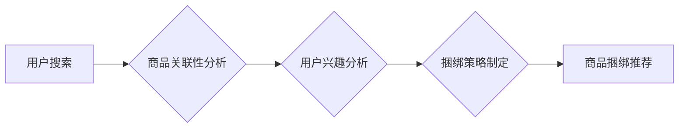

                 

## 电商搜索的商品捆绑推荐与搭配优化

> 关键词：电商搜索、商品捆绑推荐、搭配优化、协同过滤、深度学习、推荐系统

## 1. 背景介绍

在当今电子商务时代，用户搜索商品的体验至关重要。传统的搜索结果往往只展示与用户搜索关键词最直接相关的商品，缺乏对用户潜在需求的理解和挖掘。商品捆绑推荐与搭配优化技术应运而生，旨在根据用户搜索行为、浏览历史、购买记录等数据，推荐与用户搜索商品相关的其他商品，形成具有价值的商品组合，从而提升用户购物体验，促进销售额增长。

商品捆绑推荐与搭配优化技术在电商平台的应用场景广泛，例如：

* **关联推荐:** 在商品详情页推荐与当前商品相关的其他商品，例如“顾客也购买了”或“您可能也喜欢”。
* **套餐推荐:**  根据用户需求，推荐预先组合好的商品套餐，例如“家庭影院套装”或“学生必备文具包”。
* **个性化推荐:**  根据用户的兴趣偏好、购买历史等数据，推荐个性化的商品组合，例如“根据您的浏览记录，我们推荐您购买以下商品”。

## 2. 核心概念与联系

商品捆绑推荐与搭配优化技术的核心概念包括：

* **商品关联性:**  指不同商品之间存在的潜在联系，例如同类商品、互补商品、替代商品等。
* **用户兴趣:**  指用户对特定商品或商品类别感兴趣的程度，可以通过用户搜索行为、浏览历史、购买记录等数据进行挖掘。
* **捆绑策略:**  指将商品组合成套餐的策略，例如基于关联性、用户兴趣、促销活动等因素进行组合。

**核心概念架构：**



## 3. 核心算法原理 & 具体操作步骤

### 3.1  算法原理概述

商品捆绑推荐与搭配优化算法通常基于以下两种主要原理：

* **协同过滤:**  根据用户对商品的评分或购买行为，预测用户对其他商品的兴趣。
* **基于内容的推荐:**  根据商品的属性特征，推荐与用户兴趣相符的商品。

### 3.2  算法步骤详解

**协同过滤算法步骤:**

1. **数据收集:**  收集用户对商品的评分或购买行为数据。
2. **用户相似度计算:**  根据用户对商品的评分或购买行为，计算用户之间的相似度。
3. **商品相似度计算:**  根据用户对商品的评分或购买行为，计算商品之间的相似度。
4. **推荐生成:**  根据用户相似度和商品相似度，推荐用户可能感兴趣的商品。

**基于内容的推荐算法步骤:**

1. **商品特征提取:**  提取商品的属性特征，例如商品类别、品牌、价格、描述等。
2. **用户兴趣建模:**  根据用户的浏览历史、购买记录等数据，构建用户的兴趣模型。
3. **推荐生成:**  根据商品特征和用户兴趣模型，推荐与用户兴趣相符的商品。

### 3.3  算法优缺点

**协同过滤算法:**

* **优点:**  能够发现用户隐性需求，推荐个性化商品。
* **缺点:**  数据稀疏性问题，新用户新商品推荐效果差。

**基于内容的推荐算法:**

* **优点:**  能够解释推荐结果，推荐结果更易理解。
* **缺点:**  难以捕捉用户隐性需求，推荐结果可能过于单一。

### 3.4  算法应用领域

商品捆绑推荐与搭配优化算法广泛应用于以下领域：

* **电商平台:**  推荐关联商品、套餐商品、个性化商品组合。
* **社交媒体:**  推荐用户可能感兴趣的内容、商品、活动。
* **音乐平台:**  推荐用户可能喜欢的歌曲、专辑、艺术家。
* **视频平台:**  推荐用户可能喜欢的视频、节目、电影。

## 4. 数学模型和公式 & 详细讲解 & 举例说明

### 4.1  数学模型构建

协同过滤算法的核心是用户-商品评分矩阵，其中每个元素表示用户对商品的评分。

**用户-商品评分矩阵:**

```
| 用户 | 商品1 | 商品2 | 商品3 |
|---|---|---|---|
| 用户1 | 5 | 3 | 4 |
| 用户2 | 4 | 5 | 2 |
| 用户3 | 3 | 4 | 5 |
```

### 4.2  公式推导过程

**用户相似度计算:**

可以使用余弦相似度来计算用户之间的相似度。

$$
\text{相似度}(u_i, u_j) = \frac{\sum_{k=1}^{n} r_{ik} \cdot r_{jk}}{\sqrt{\sum_{k=1}^{n} r_{ik}^2} \cdot \sqrt{\sum_{k=1}^{n} r_{jk}^2}}
$$

其中：

* $u_i$ 和 $u_j$ 表示两个用户。
* $r_{ik}$ 表示用户 $u_i$ 对商品 $k$ 的评分。
* $n$ 表示商品总数。

**商品相似度计算:**

可以使用余弦相似度来计算商品之间的相似度。

$$
\text{相似度}(p_i, p_j) = \frac{\sum_{k=1}^{m} r_{ik} \cdot r_{jk}}{\sqrt{\sum_{k=1}^{m} r_{ik}^2} \cdot \sqrt{\sum_{k=1}^{m} r_{jk}^2}}
$$

其中：

* $p_i$ 和 $p_j$ 表示两个商品。
* $r_{ik}$ 表示用户 $k$ 对商品 $i$ 的评分。
* $m$ 表示用户总数。

### 4.3  案例分析与讲解

假设有两个用户，用户 1 对商品 A 和商品 B 的评分分别为 5 和 3，用户 2 对商品 A 和商品 B 的评分分别为 4 和 5。

根据公式，可以计算出用户 1 和用户 2 的相似度为：

$$
\text{相似度}(u_1, u_2) = \frac{(5 \cdot 4) + (3 \cdot 5)}{\sqrt{(5^2 + 3^2)} \cdot \sqrt{(4^2 + 5^2)}} = \frac{35}{\sqrt{34} \cdot \sqrt{41}}
$$

## 5. 项目实践：代码实例和详细解释说明

### 5.1  开发环境搭建

* Python 3.x
* scikit-learn
* pandas
* numpy

### 5.2  源代码详细实现

```python
import pandas as pd
from sklearn.metrics.pairwise import cosine_similarity

# 加载用户-商品评分数据
data = pd.read_csv('user_item_rating.csv')

# 计算用户相似度矩阵
user_similarity = cosine_similarity(data.T)

# 计算商品相似度矩阵
item_similarity = cosine_similarity(data)

# 根据用户相似度推荐商品
def recommend_items(user_id, top_n=5):
    # 获取用户相似用户
    similar_users = user_similarity[user_id].argsort()[:-top_n-1:-1]

    # 获取相似用户喜欢的商品
    recommended_items = data.iloc[similar_users].mean().sort_values(ascending=False).index

    return recommended_items

# 根据商品相似度推荐商品
def recommend_items_by_item(item_id, top_n=5):
    # 获取相似商品
    similar_items = item_similarity[item_id].argsort()[:-top_n-1:-1]

    # 获取相似商品的评分
    recommended_items = data.iloc[similar_items].mean().sort_values(ascending=False).index

    return recommended_items

# 示例
user_id = 0
recommended_items = recommend_items(user_id)
print(f"推荐给用户 {user_id} 的商品：{recommended_items}")

item_id = 0
recommended_items = recommend_items_by_item(item_id)
print(f"推荐与商品 {item_id} 相似的商品：{recommended_items}")
```

### 5.3  代码解读与分析

* 代码首先加载用户-商品评分数据。
* 然后使用余弦相似度计算用户相似度矩阵和商品相似度矩阵。
* `recommend_items()` 函数根据用户相似度推荐商品，找到与目标用户评分相似度最高的其他用户，并推荐他们喜欢的商品。
* `recommend_items_by_item()` 函数根据商品相似度推荐商品，找到与目标商品评分相似度最高的商品，并推荐它们。
* 最后，代码示例展示了如何使用这两个函数推荐商品。

### 5.4  运行结果展示

运行代码后，会输出推荐给目标用户和目标商品的商品列表。

## 6. 实际应用场景

### 6.1  电商平台

* **关联推荐:** 在商品详情页推荐与当前商品相关的其他商品，例如“顾客也购买了”或“您可能也喜欢”。
* **套餐推荐:**  根据用户需求，推荐预先组合好的商品套餐，例如“家庭影院套装”或“学生必备文具包”。
* **个性化推荐:**  根据用户的兴趣偏好、购买历史等数据，推荐个性化的商品组合，例如“根据您的浏览记录，我们推荐您购买以下商品”。

### 6.2  社交媒体

* **内容推荐:**  推荐用户可能感兴趣的内容，例如文章、视频、图片等。
* **商品推荐:**  推荐用户可能喜欢的商品，例如服装、电子产品、书籍等。
* **活动推荐:**  推荐用户可能感兴趣的活动，例如音乐会、展览、演出等。

### 6.3  音乐平台

* **歌曲推荐:**  推荐用户可能喜欢的歌曲，例如根据用户喜欢的歌手、专辑、风格等进行推荐。
* **专辑推荐:**  推荐用户可能喜欢的专辑，例如根据用户喜欢的歌手、风格等进行推荐。
* **艺术家推荐:**  推荐用户可能喜欢的艺术家，例如根据用户喜欢的歌曲、专辑等进行推荐。

### 6.4  未来应用展望

随着人工智能技术的不断发展，商品捆绑推荐与搭配优化技术将更加智能化、个性化。未来，我们可以期待以下应用场景：

* **基于多模态数据的推荐:**  结合文本、图像、音频等多模态数据，进行更精准的商品推荐。
* **实时个性化推荐:**  根据用户的实时行为，动态调整推荐结果，提供更个性化的购物体验。
* **智能捆绑策略制定:**  利用机器学习算法，自动学习用户需求和商品关联性，制定更有效的捆绑策略。

## 7. 工具和资源推荐

### 7.1  学习资源推荐

* **书籍:**
    * 《推荐系统实践》
    * 《机器学习》
    * 《深度学习》
* **在线课程:**
    * Coursera: Recommender Systems
    * Udacity: Machine Learning Engineer Nanodegree
* **博客:**
    * Recommenderlab
    * KDnuggets

### 7.2  开发工具推荐

* **Python:**  一个开源的编程语言，广泛应用于数据科学和机器学习领域。
* **scikit-learn:**  一个用于机器学习的 Python 库，提供各种算法和工具。
* **pandas:**  一个用于数据分析和处理的 Python 库。
* **numpy:**  一个用于数值计算的 Python 库。

### 7.3  相关论文推荐

* **Collaborative Filtering for Implicit Feedback Datasets**
* **Matrix Factorization Techniques for Recommender Systems**
* **Deep Learning for Recommender Systems**

## 8. 总结：未来发展趋势与挑战

### 8.1  研究成果总结

商品捆绑推荐与搭配优化技术在电商平台、社交媒体、音乐平台等领域取得了显著的成果，能够有效提升用户体验和促进销售额增长。

### 8.2  未来发展趋势

* **多模态数据融合:**  结合文本、图像、音频等多模态数据，进行更精准的商品推荐。
* **实时个性化推荐:**  根据用户的实时行为，动态调整推荐结果，提供更个性化的购物体验。
* **智能捆绑策略制定:**  利用机器学习算法，自动学习用户需求和商品关联性，制定更有效的捆绑策略。

### 8.3  面临的挑战

* **数据稀疏性问题:**  用户-商品评分数据往往是稀疏的，难以训练有效的推荐模型。
* **冷启动问题:**  对于新用户和新商品，难以获取足够的评分数据进行推荐。
* **推荐结果的解释性:**  一些深度学习模型的推荐结果难以解释，难以获得用户的信任。

### 8.4  研究展望

未来，商品捆绑推荐与搭配优化技术将继续朝着更智能化、个性化、可解释的方向发展。研究者将继续探索新的算法和模型，解决数据稀疏性、冷启动问题，提高推荐结果的准确性和解释性。

## 9. 附录：常见问题与解答

**Q1:  协同过滤算法和基于内容的推荐算法哪个更好？**

**A1:**  没有绝对的好坏之分，两种算法各有优缺点。协同过滤算法能够发现用户隐性需求，推荐个性化商品，但数据稀疏性问题较为突出。基于内容的推荐算法能够解释推荐结果，但难以捕捉用户隐性需求。

**Q2:  如何解决数据稀疏性问题？**

**A2:**  可以使用以下方法解决数据稀疏性问题：

* **利用用户行为数据:**  除了评分数据，还可以利用用户浏览历史、购买记录等行为数据进行推荐。
* **使用矩阵分解技术:**  将用户-商品评分矩阵分解成低维矩阵，降低数据维度，提高模型训练效率。
* **使用混合推荐算法:**  将协同过滤算法和基于内容的推荐算法结合起来，发挥各自优势，解决数据稀疏性问题。


作者：禅与计算机程序设计艺术 / Zen and the Art of Computer Programming<end_of_turn>

