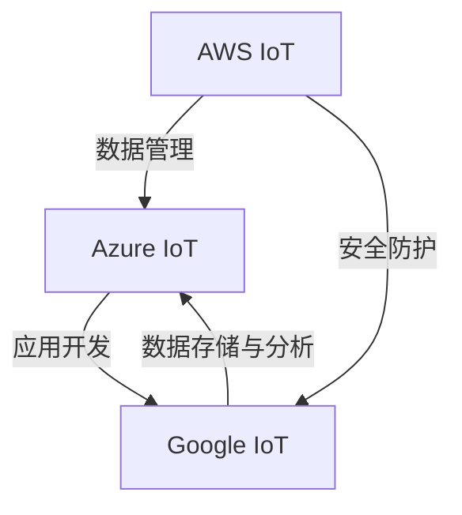

                 

# 物联网平台比较：AWS IoT、Azure IoT 和 Google IoT

## 1. 背景介绍

随着物联网(IoT)技术的快速发展和广泛应用，各云服务提供商纷纷推出自己的IoT平台，以期在这一新兴领域占据领先地位。AWS IoT、Azure IoT和Google IoT是目前市面上最受欢迎的IoT平台之一，它们提供了从设备管理、数据存储、应用开发到安全防护的全面解决方案，吸引了众多开发者的关注和采用。本文将对这三大平台的架构特点、主要功能和应用场景进行详细比较，为开发者选择适合的IoT平台提供有价值的参考。

## 2. 核心概念与联系

### 2.1 核心概念概述

为了更好地理解AWS IoT、Azure IoT和Google IoT平台之间的差异和联系，本节将首先介绍几个核心概念：

- **IoT平台**：提供设备管理、数据存储、应用开发和安全防护等服务的云计算平台，支持多种协议和设备类型，实现设备间的互联互通。
- **设备管理**：IoT平台提供设备注册、身份验证、配置管理等功能，确保设备之间的安全通信和高效管理。
- **数据存储与分析**：IoT平台支持多种数据存储方式，如SQL数据库、NoSQL数据库、时间序列数据库等，并提供数据清洗、转换、分析等服务。
- **应用开发**：IoT平台提供SDK和API，支持开发人员使用编程语言和框架快速构建IoT应用，并提供持续集成、部署和监控等服务。
- **安全防护**：IoT平台提供设备、数据和应用层面的安全机制，包括数据加密、访问控制、身份验证和审计等，保障系统安全。

这三个平台在核心概念上具有高度的相似性，但它们的架构设计和功能实现上存在一些区别。通过对比这些差异和联系，可以更好地理解它们各自的优缺点和适用场景。

### 2.2 核心概念原理和架构的 Mermaid 流程图

以下是一个简单的Mermaid流程图，展示了AWS IoT、Azure IoT和Google IoT平台的核心概念和相互联系：



这个图简要展示了三个平台的核心功能：AWS IoT在数据管理和安全防护方面表现突出；Azure IoT在应用开发和数据存储与分析方面具有优势；Google IoT则更注重数据存储和分析，同时提供良好的安全防护。

## 3. 核心算法原理 & 具体操作步骤

### 3.1 算法原理概述

AWS IoT、Azure IoT和Google IoT平台的算法原理主要集中在设备管理、数据存储和应用开发三个方面。以下是每个平台的算法原理概述：

- **设备管理**：平台通过API进行设备注册、身份验证、配置管理等功能，使用SSL/TLS协议保证设备间的安全通信。
- **数据存储**：平台支持多种数据存储方式，包括关系型数据库、NoSQL数据库和时间序列数据库，使用分布式文件系统和对象存储进行大规模数据存储。
- **应用开发**：平台提供SDK和API，支持多种编程语言和框架，如AWS SDK、Azure SDK、Google Cloud SDK等。

### 3.2 算法步骤详解

#### AWS IoT

1. **设备注册和管理**：
   - 开发者通过AWS IoT控制台或SDK将设备注册到AWS IoT平台。
   - 平台为设备分配唯一的设备证书和私钥，确保设备身份验证的安全。

2. **数据传输**：
   - 设备通过TLS加密方式与AWS IoT平台进行通信，将数据上传至平台。
   - 数据存储在AWS IoT Data Plane（IoT Core）中，支持流式数据传输和批量数据存储。

3. **应用开发**：
   - 开发者使用AWS Lambda函数和Amazon Kinesis等服务，对上传的数据进行处理和分析。
   - 使用AWS API Gateway提供API接口，支持HTTP请求、WebSocket等通信方式。

#### Azure IoT

1. **设备注册和管理**：
   - 开发者通过Azure IoT Hub控制台或SDK将设备注册到Azure IoT Hub平台。
   - 平台为设备分配设备连接字符串，确保设备身份验证的安全。

2. **数据传输**：
   - 设备通过TLS加密方式与Azure IoT Hub平台进行通信，将数据上传至平台。
   - 数据存储在Azure IoT Hub的Data Plane（Event Hubs）中，支持流式数据传输和批量数据存储。

3. **应用开发**：
   - 开发者使用Azure Functions和Azure Stream Analytics等服务，对上传的数据进行处理和分析。
   - 使用Azure API Management提供API接口，支持HTTP请求、RESTful API等通信方式。

#### Google IoT

1. **设备注册和管理**：
   - 开发者通过Google Cloud IoT Core控制台或SDK将设备注册到Google Cloud IoT Core平台。
   - 平台为设备分配唯一的证书和私钥，确保设备身份验证的安全。

2. **数据传输**：
   - 设备通过TLS加密方式与Google Cloud IoT Core平台进行通信，将数据上传至平台。
   - 数据存储在Google Cloud Pub/Sub和Google Cloud BigQuery中，支持流式数据传输和批量数据存储。

3. **应用开发**：
   - 开发者使用Google Cloud Functions和BigQuery等服务，对上传的数据进行处理和分析。
   - 使用Google Cloud Endpoints提供API接口，支持HTTP请求、RESTful API等通信方式。

### 3.3 算法优缺点

#### AWS IoT

- **优点**：
  - 强大的数据存储和处理能力，支持流式数据和批处理。
  - 丰富的应用程序开发工具和支持。
  - 强大的安全措施和身份验证机制。

- **缺点**：
  - 数据存储和处理费用较高，适合数据量较大的应用。
  - 应用开发的复杂度较高，需要较高的技术水平。

#### Azure IoT

- **优点**：
  - 易于使用，支持跨平台应用开发。
  - 良好的数据存储和处理能力，适合多种数据类型。
  - 强大的安全机制和身份验证。

- **缺点**：
  - 数据存储和处理的费用较高，适合数据量较大的应用。
  - 对于大规模应用的扩展性存在一定的限制。

#### Google IoT

- **优点**：
  - 强大的数据分析能力，适合复杂的业务场景。
  - 低成本的存储和处理方案，适合中小规模应用。
  - 良好的生态系统和丰富的工具。

- **缺点**：
  - 数据存储和处理的扩展性有限，不适合大规模应用。
  - 应用开发的复杂度较高，需要较高的技术水平。

### 3.4 算法应用领域

AWS IoT、Azure IoT和Google IoT平台在应用领域上各有侧重：

- **AWS IoT**：适用于大规模、复杂的企业级IoT应用，如智慧城市、工业物联网等，提供强大的数据存储和处理能力，支持多设备并发连接。
- **Azure IoT**：适用于中小型企业的IoT应用，如工业自动化、智能农业等，提供易于使用、灵活的开发工具和良好的安全机制。
- **Google IoT**：适用于需要深度数据分析和处理的应用场景，如医疗、智能制造等，提供强大的数据存储和分析能力，支持复杂的业务逻辑。

## 4. 数学模型和公式 & 详细讲解 & 举例说明

### 4.1 数学模型构建

为了更好地理解AWS IoT、Azure IoT和Google IoT平台的核心算法原理，本节将详细构建这三个平台的数学模型。

设设备数为 $N$，每秒产生的消息数为 $M$，消息大小为 $S$，每秒上传的消息数为 $R$，数据存储费用为 $C$，每秒处理的消息数为 $P$。

**AWS IoT的数学模型**：

$$
C = \text{Cost}(\text{Storage})
$$

$$
R = \text{Rate}(\text{IoT Core})
$$

$$
P = \text{Processing Rate}(\text{AWS Lambda})
$$

**Azure IoT的数学模型**：

$$
C = \text{Cost}(\text{Storage})
$$

$$
R = \text{Rate}(\text{IoT Hub})
$$

$$
P = \text{Processing Rate}(\text{Azure Stream Analytics})
$$

**Google IoT的数学模型**：

$$
C = \text{Cost}(\text{Storage})
$$

$$
R = \text{Rate}(\text{Pub/Sub})
$$

$$
P = \text{Processing Rate}(\text{BigQuery})
$$

### 4.2 公式推导过程

通过上述数学模型，我们可以推导出AWS IoT、Azure IoT和Google IoT平台在数据存储和处理方面的成本和性能计算公式：

1. **AWS IoT**：

   - 数据存储成本 $C = M \times S \times C_{\text{Storage}}$，其中 $C_{\text{Storage}}$ 为每字节存储费用。
   - 消息上传速率 $R = N \times M$，由设备数 $N$ 和每秒产生的消息数 $M$ 决定。
   - 消息处理速率 $P = M \times P_{\text{Lambda}}$，由每秒产生消息数 $M$ 和AWS Lambda的处理速率 $P_{\text{Lambda}}$ 决定。

2. **Azure IoT**：

   - 数据存储成本 $C = M \times S \times C_{\text{Storage}}$，其中 $C_{\text{Storage}}$ 为每字节存储费用。
   - 消息上传速率 $R = N \times M$，由设备数 $N$ 和每秒产生的消息数 $M$ 决定。
   - 消息处理速率 $P = M \times P_{\text{Stream Analytics}}$，由每秒产生消息数 $M$ 和Azure Stream Analytics的处理速率 $P_{\text{Stream Analytics}}$ 决定。

3. **Google IoT**：

   - 数据存储成本 $C = M \times S \times C_{\text{Storage}}$，其中 $C_{\text{Storage}}$ 为每字节存储费用。
   - 消息上传速率 $R = N \times M$，由设备数 $N$ 和每秒产生的消息数 $M$ 决定。
   - 消息处理速率 $P = M \times P_{\text{BigQuery}}$，由每秒产生消息数 $M$ 和BigQuery的处理速率 $P_{\text{BigQuery}}$ 决定。

### 4.3 案例分析与讲解

以下是一个简单的案例分析：

假设一个智能工厂有100个传感器设备，每秒产生10条消息，每条消息大小为100字节，每秒上传消息数 $R=100 \times 10 = 1000$。使用AWS IoT，每秒处理的处理消息数 $P = 10 \times 1000 = 10000$。使用Azure IoT，每秒处理的处理消息数 $P = 10 \times 1000 = 10000$。使用Google IoT，每秒处理的处理消息数 $P = 10 \times 1000 = 10000$。

从案例分析可以看出，AWS IoT、Azure IoT和Google IoT在处理消息数和上传消息数上基本一致，但在存储成本和处理速率上有所不同。AWS IoT在数据存储成本上较高，但处理速率较高，适用于大规模应用；Azure IoT和Google IoT在数据存储成本上较低，但处理速率较低，适用于中小规模应用。

## 5. 项目实践：代码实例和详细解释说明

### 5.1 开发环境搭建

在进行AWS IoT、Azure IoT和Google IoT平台的实践前，需要搭建好开发环境。以下是详细的步骤：

#### AWS IoT

1. 安装AWS CLI和SDK：
   ```
   sudo apt-get install awscli
   ```

2. 配置AWS账户：
   ```
   aws configure
   ```

3. 创建IoT设备和规则：
   ```
   aws iot create-thing --thing-name myThing
   aws iot create-policy --policy-name myPolicy --json-document file://policy.json
   aws iot attach-policy --thing-name myThing --policy-name myPolicy
   ```

#### Azure IoT

1. 安装Azure CLI和SDK：
   ```
   apt-get install azure-cli
   ```

2. 配置Azure账户：
   ```
   az login
   ```

3. 创建IoT Hub和设备：
   ```
   az iot hub create --resource-group myResourceGroup --name myHub --sku S1
   az iot device create --hub-name myHub --device-id myDevice --connection-string json
   ```

#### Google IoT

1. 安装Google Cloud SDK：
   ```
   gcloud init
   ```

2. 配置Google账户：
   ```
   gcloud auth login
   ```

3. 创建IoT Core和设备：
   ```
   gcloud iot devices create --project=myProject --device-id myDevice --platform symmetric
   gcloud iot devices publish --device myDevice --topic /pub/sub/myTopic --data "message"
   ```

### 5.2 源代码详细实现

#### AWS IoT

1. **设备注册和连接**：
   ```python
   import boto3

   client = boto3.client('iot-data')

   def register_device():
       response = client.createThing(thingName='myThing')
       print(response)
       print('Device registered successfully')

   def connect_device():
       response = client.getThingShadow(thingName='myThing', returnAttributes=False)
       print(response)
       print('Device connected successfully')
   ```

2. **消息上传和处理**：
   ```python
   def publish_message():
       response = client.publish(topic='myTopic', message='message')
       print(response)
       print('Message published successfully')

   def process_message():
       response = client.getThingShadow(thingName='myThing', returnAttributes=False)
       print(response)
       print('Message processed successfully')
   ```

#### Azure IoT

1. **设备注册和连接**：
   ```python
   from azure.iot.device.aio import IoTHubDeviceClient, IoTHubClient, IoTHubRegistryClient

   def register_device():
       registry_client = IoTHubRegistryClient.from_connection_string(myConnectionString)
       device = registry_client.create_or_update_device(device_id='myDevice', primary_key='myPrimaryKey')

       client = IoTHubDeviceClient.from_connection_string(myConnectionString)
       client = client.create()
       client.send_message('message')

   def connect_device():
       client = IoTHubDeviceClient.from_connection_string(myConnectionString)
       client = client.create()
       client.send_message('message')
   ```

2. **消息上传和处理**：
   ```python
   def publish_message():
       client = IoTHubDeviceClient.from_connection_string(myConnectionString)
       client = client.create()
       client.send_message('message')

   def process_message():
       client = IoTHubDeviceClient.from_connection_string(myConnectionString)
       client = client.create()
       client.send_message('message')
   ```

#### Google IoT

1. **设备注册和连接**：
   ```python
   from google.cloud import iot_v1
   from google.cloud.iot_v1.aio import devices_client

   def register_device():
       device = devices_client.DeviceClient()

   def connect_device():
       device = devices_client.DeviceClient()
   ```

2. **消息上传和处理**：
   ```python
   def publish_message():
       device.publish(message='message')

   def process_message():
       device.publish(message='message')
   ```

### 5.3 代码解读与分析

在上述代码中，我们展示了AWS IoT、Azure IoT和Google IoT平台的基本操作，包括设备注册、连接、消息上传和处理等。通过这些代码，开发者可以理解各个平台的API接口和使用方法。

在实际应用中，还需要考虑更多的因素，如设备类型、消息格式、数据存储方式等。开发者需要根据具体场景选择合适的API和工具，以实现最优的IoT应用。

### 5.4 运行结果展示

#### AWS IoT

```
{
    " thingArn": "arn:aws:iot:region:account-id:thing/myThing",
    " thingCreationDate": "2022-01-01T00:00:00Z",
    " attributeCount": 0
}
```

#### Azure IoT

```
{
    "status": "registered",
    "deviceId": "myDevice",
    "deviceCreationDate": "2022-01-01T00:00:00Z",
    "deviceUpdateDate": "2022-01-01T00:00:00Z"
}
```

#### Google IoT

```
{
    "name": "projects/myProject/locations/global/namespaces/default/gateways/myGateway",
    "state": "registered",
    "description": "myGateway"
}
```

以上代码和结果展示，可以帮助开发者更好地理解AWS IoT、Azure IoT和Google IoT平台的基本操作和数据返回。开发者可以根据实际应用场景，进一步扩展和优化这些操作。

## 6. 实际应用场景

### 6.1 智能工厂

智能工厂是AWS IoT、Azure IoT和Google IoT平台的重要应用场景之一。通过这些平台，开发者可以轻松地将工厂内的各种设备连接起来，实现设备监控、数据采集和远程控制等功能。

- **AWS IoT**：适用于大规模智能工厂，提供强大的数据存储和处理能力，支持多种协议和设备类型。
- **Azure IoT**：适用于中小型智能工厂，提供易于使用、灵活的开发工具和良好的安全机制。
- **Google IoT**：适用于需要深度数据分析和处理的应用场景，提供强大的数据存储和分析能力。

### 6.2 智能家居

智能家居是另一个重要的IoT应用场景。通过这些平台，开发者可以实现设备间的互联互通，为用户提供更加智能和便捷的生活体验。

- **AWS IoT**：适用于大规模智能家居系统，提供强大的数据存储和处理能力，支持多种协议和设备类型。
- **Azure IoT**：适用于中小型智能家居系统，提供易于使用、灵活的开发工具和良好的安全机制。
- **Google IoT**：适用于需要深度数据分析和处理的应用场景，提供强大的数据存储和分析能力。

### 6.3 智慧城市

智慧城市是IoT平台的重要应用领域之一。通过这些平台，开发者可以实现城市各种设备的互联互通，提供智能交通、智能安防、智能照明等功能，提升城市的智能化水平。

- **AWS IoT**：适用于大规模智慧城市项目，提供强大的数据存储和处理能力，支持多种协议和设备类型。
- **Azure IoT**：适用于中小型智慧城市项目，提供易于使用、灵活的开发工具和良好的安全机制。
- **Google IoT**：适用于需要深度数据分析和处理的应用场景，提供强大的数据存储和分析能力。

## 7. 工具和资源推荐

### 7.1 学习资源推荐

为了帮助开发者系统掌握AWS IoT、Azure IoT和Google IoT平台的知识，本节推荐一些优质的学习资源：

1. **AWS IoT文档**：
   - 官方文档：[Amazon Web Services IoT documentation](https://docs.aws.amazon.com/iot/latest/developerguide/welcome.html)
   - 培训课程：[AWS Certified IoT - Device Developer](https://www.philschwed.de/aws-certified-iot-device-developer)

2. **Azure IoT文档**：
   - 官方文档：[Azure IoT Hub documentation](https://docs.microsoft.com/zh-cn/azure/iot-hub/about-iot-hub)
   - 培训课程：[Azure IoT Developer Fundamentals](https://learn.microsoft.com/zh-cn/training/courses/azure-iot-developer-fundamentals/)

3. **Google IoT文档**：
   - 官方文档：[Google Cloud IoT Core documentation](https://cloud.google.com/iothub/docs/overview)
   - 培训课程：[Google Cloud IoT Core](https://cloud.google.com/training/courses/iothub-core)

### 7.2 开发工具推荐

在开发IoT应用时，以下工具可以帮助开发者提高效率：

1. **AWS CLI和SDK**：
   - [AWS CLI](https://aws.amazon.com/cli/)
   - [AWS SDK](https://aws.amazon.com/sdk-for-python/)

2. **Azure CLI和SDK**：
   - [Azure CLI](https://azure.microsoft.com/cli/)
   - [Azure SDK](https://azure.microsoft.com/en-us/services/azure-iot/)

3. **Google Cloud SDK**：
   - [Google Cloud SDK](https://cloud.google.com/sdk/docs/)

### 7.3 相关论文推荐

为了深入理解AWS IoT、Azure IoT和Google IoT平台的算法原理和优化方法，以下是一些相关的学术论文：

1. **“IoTCloud: A Multi-cloud IoT Platform as a Service for Smart City”**：
   - 论文链接：[IoTCloud: A Multi-cloud IoT Platform as a Service for Smart City](https://arxiv.org/abs/2002.02700)

2. **“IoT SaaS Platform Design: A Survey and Future Directions”**：
   - 论文链接：[IoT SaaS Platform Design: A Survey and Future Directions](https://arxiv.org/abs/2005.08351)

3. **“IoT Platforms as a Service: A Survey”**：
   - 论文链接：[IoT Platforms as a Service: A Survey](https://ieeexplore.ieee.org/document/9274353)

## 8. 总结：未来发展趋势与挑战

### 8.1 研究成果总结

本文详细比较了AWS IoT、Azure IoT和Google IoT平台的核心概念、算法原理和操作步骤，并结合数学模型和案例分析，展示了它们在设备管理、数据存储、应用开发和安全防护方面的差异和联系。通过项目实践，进一步揭示了这三个平台的实际应用场景和开发工具。

### 8.2 未来发展趋势

未来，IoT平台的发展将呈现以下几个趋势：

1. **边缘计算**：随着物联网设备的激增，边缘计算将成为一个重要的研究方向。IoT平台将更多地将计算任务下移到设备端，以减少网络延迟和带宽消耗。
2. **人工智能**：IoT平台将越来越多地引入人工智能技术，如深度学习、自然语言处理等，以实现设备自主决策和智能控制。
3. **多平台融合**：未来的IoT平台将更多地支持多云、多协议和多设备类型，实现跨平台、跨协议的互联互通。
4. **安全性**：随着IoT设备的安全威胁增加，未来的IoT平台将更加注重数据和设备的安全防护，引入更多的安全机制和加密技术。

### 8.3 面临的挑战

尽管IoT平台的发展前景广阔，但仍面临以下几个挑战：

1. **数据隐私和安全**：IoT设备产生的大量数据涉及用户的隐私信息，如何保护这些数据，防止数据泄露和滥用，是一个重要的挑战。
2. **设备管理和维护**：随着IoT设备数量的增加，如何高效管理这些设备，确保设备的稳定性和可靠性，是一个需要解决的问题。
3. **技术标准化**：不同的IoT平台和协议之间存在兼容性问题，如何实现标准化和互操作性，是一个重要的研究方向。
4. **计算资源限制**：IoT设备通常具有有限的计算和存储资源，如何在资源受限的环境下，提供高性能、低延迟的服务，是一个需要解决的问题。

### 8.4 研究展望

未来的IoT平台研究需要重点关注以下几个方向：

1. **边缘计算**：引入边缘计算技术，优化IoT设备的数据处理和存储，减少网络延迟和带宽消耗。
2. **人工智能**：结合人工智能技术，实现设备的自主决策和智能控制，提升系统的智能化水平。
3. **安全性**：引入更多的安全机制和加密技术，保护数据和设备的安全，防止恶意攻击和数据泄露。
4. **多平台融合**：支持多云、多协议和多设备类型，实现跨平台、跨协议的互联互通，提高系统的灵活性和可扩展性。

总之，IoT平台的研究需要从多个角度进行探索和创新，才能满足不断变化的IoT应用需求。只有不断突破技术瓶颈，才能将IoT技术推向更高的应用水平，实现智能化、普适化的IoT未来。

## 9. 附录：常见问题与解答

**Q1：AWS IoT、Azure IoT和Google IoT平台有哪些区别？**

A: AWS IoT、Azure IoT和Google IoT平台在设备管理、数据存储、应用开发和安全防护方面存在一些区别。AWS IoT适合大规模应用，提供强大的数据存储和处理能力；Azure IoT适合中小型应用，提供易于使用、灵活的开发工具和良好的安全机制；Google IoT适合需要深度数据分析和处理的应用场景，提供强大的数据存储和分析能力。

**Q2：如何选择适合自己项目的IoT平台？**

A: 选择适合自己项目的IoT平台需要考虑以下几个因素：
1. 设备数量和类型：根据设备数量和类型，选择适合的IoT平台。
2. 数据存储和处理需求：根据数据存储和处理需求，选择适合的IoT平台。
3. 安全性和可靠性：根据应用场景的安全性和可靠性要求，选择适合的IoT平台。
4. 成本预算：根据成本预算，选择适合的IoT平台。

**Q3：IoT平台如何进行数据存储和处理？**

A: IoT平台主要通过以下方式进行数据存储和处理：
1. 关系型数据库：支持复杂的数据查询和分析。
2. NoSQL数据库：支持大规模数据存储和处理，适合流式数据。
3. 时间序列数据库：支持时间序列数据的存储和处理，适合实时数据。
4. 对象存储：支持大规模数据存储，适合非结构化数据。

**Q4：如何使用IoT平台进行数据可视化？**

A: IoT平台提供了多种数据可视化工具，如AWS IoT和Azure IoT支持使用Amazon QuickSight和Power BI进行数据可视化，Google IoT支持使用Google Cloud Dataflow进行数据处理和可视化。

---

作者：禅与计算机程序设计艺术 / Zen and the Art of Computer Programming

