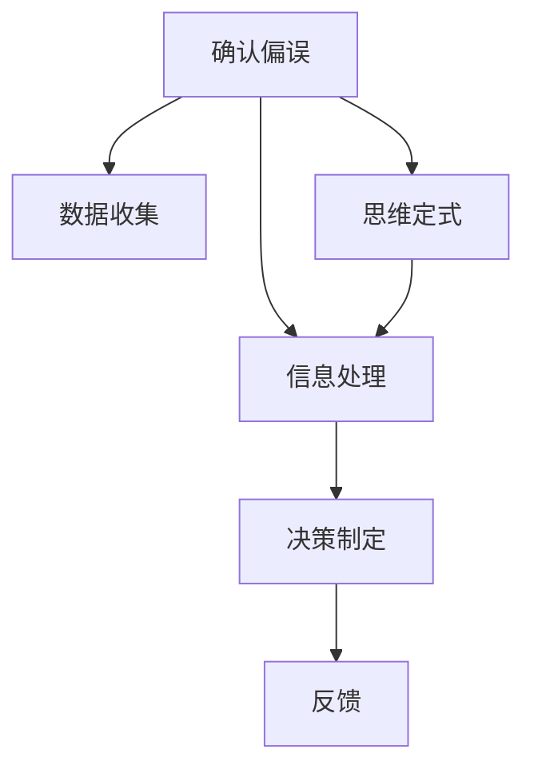
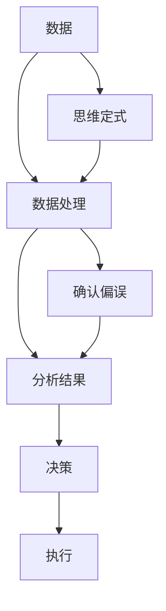

                 

# 理解洞察力的偏差：避免确认偏误和思维定式

## 1. 背景介绍

在现代数据分析与决策制定中，洞察力（Insight）扮演着至关重要的角色。洞察力指的是基于数据和经验发现、理解、解释和利用信息的能力。然而，由于人类认知系统的有限性和信息处理机制的局限性，洞察力往往容易受到各种偏误的影响。其中，确认偏误（Confirmation Bias）和思维定式（Cognitive Biases）是常见的认知偏误，本文将深入探讨这些偏误产生的原因，并提供一系列策略，以帮助决策者和数据科学家在做出决策时避免这些偏误。

## 2. 核心概念与联系

### 2.1 核心概念概述

- **确认偏误（Confirmation Bias）**：人们在收集和处理信息时，倾向于关注和记住符合自己已有信念和预期的事物，而忽略那些与自己信念不符的信息。这导致了信息的片面性和认知扭曲，从而影响决策的质量。
- **思维定式（Cognitive Biases）**：指个体在解决问题时，习惯性地采用固定的思维模式和行为模式。思维定式可能促使人们忽视潜在的解决方案，过度依赖过去的经验，从而限制创造性思维和创新能力。

这两个概念在认知心理学和行为科学中都有广泛的研究，但它们在大数据分析和决策过程中同样具有重要意义。本节将通过Mermaid流程图展示确认偏误和思维定式之间的关系：



该流程图展示了从数据收集到决策制定的整个过程，其中确认偏误和思维定式在各个环节都可能产生影响。

### 2.2 核心概念原理和架构的 Mermaid 流程图

在分析确认偏误和思维定式的原理时，我们需要明确它们是如何影响数据分析和决策制定的。

- **确认偏误的产生和影响**：确认偏误导致人们在收集数据时，倾向于选择那些支持其已有信念的数据，而忽略那些与之矛盾的数据。这种选择性的偏见会导致数据的偏差，进而影响分析结果和决策制定的准确性。

- **思维定式的作用机制**：思维定式使个体在解决问题时，习惯性地依赖于某种固定的模式和策略，忽视其他可能的解决方案。这种习惯性的行为可能导致过度自信、错误判断，甚至错误的决策。

以下是一个简单的Mermaid流程图，展示了确认偏误和思维定式在数据处理和决策制定过程中的相互作用：



该流程图强调了确认偏误和思维定式在数据处理和决策制定过程中相互作用的路径，进而影响最终的决策质量。

## 3. 核心算法原理 & 具体操作步骤

### 3.1 算法原理概述

避免确认偏误和思维定式，要求我们在数据收集、处理和分析的每个环节中，都保持开放和批判性的思维。这需要系统地设计和实施一系列策略，以确保信息的全面性和分析的客观性。

### 3.2 算法步骤详解

以下是避免确认偏误和思维定式的具体操作步骤：

1. **数据收集阶段**：
   - **多样化数据源**：从多个渠道和来源收集数据，确保数据的多样性和全面性。
   - **随机抽样**：采用随机抽样方法，避免样本选择偏差。
   - **数据标注和验证**：使用多个标注者进行数据标注，并通过交叉验证提高标注的准确性。

2. **数据处理阶段**：
   - **去偏数据预处理**：识别并移除数据中的偏见和错误，确保数据的真实性和一致性。
   - **异常值检测和处理**：使用统计方法和算法检测异常值，并根据情况进行合理的处理。
   - **特征工程**：通过特征选择和构造，提高数据的表现力和可用性。

3. **数据分析阶段**：
   - **多模型集成**：使用不同的模型进行数据预测和分析，减少单一模型带来的偏见。
   - **交叉验证**：采用交叉验证方法，提高模型泛化能力和稳健性。
   - **模型诊断和优化**：通过诊断和优化模型，提高模型的准确性和可靠性。

### 3.3 算法优缺点

- **优点**：
  - **全面性**：通过多数据源、多样化方法的分析，减少了确认偏误和思维定式的可能性，提高了决策的全面性和客观性。
  - **稳健性**：多模型集成和交叉验证等方法提高了模型的稳健性，减少了单一模型带来的风险。

- **缺点**：
  - **复杂性**：多数据源和多样化方法增加了分析的复杂性，需要更多的资源和时间。
  - **计算开销**：多模型集成和交叉验证等方法需要更高的计算资源，增加了计算开销。

### 3.4 算法应用领域

确认偏误和思维定式在多个领域都有广泛应用，包括但不限于：

- **金融分析**：在金融分析中，确认偏误可能导致过度依赖某些指标或模型，而忽视其他重要的数据。
- **医疗诊断**：在医疗诊断中，思维定式可能导致医生习惯性地采用特定的诊断路径，而忽视其他可能的疾病。
- **市场研究**：在市场研究中，确认偏误可能导致对某个市场趋势的过度自信，而忽视其他重要的市场变化。

## 4. 数学模型和公式 & 详细讲解 & 举例说明

### 4.1 数学模型构建

在数学模型构建过程中，我们可以使用统计学和机器学习中的方法来检测和纠正确认偏误和思维定式。

- **统计学方法**：如方差分析、回归分析等，可以检测数据中的趋势和异常。
- **机器学习方法**：如决策树、随机森林等，可以检测和分类数据的特征和关系。

### 4.2 公式推导过程

以下是一个简单的数学模型示例，展示如何使用回归分析来检测确认偏误：

设我们有数据集 $\{(x_i, y_i)\}_{i=1}^N$，其中 $x_i$ 是输入特征，$y_i$ 是输出标签。我们希望构建一个线性回归模型 $y = \theta_0 + \theta_1 x_1 + \theta_2 x_2 + \cdots + \theta_n x_n$。回归模型的系数 $\theta_j$ 可以通过最小二乘法求解，即：

$$
\theta_j = \frac{\sum_{i=1}^N (y_i - \hat{y_i}) x_{ij}}{\sum_{i=1}^N x_{ij}^2}
$$

其中 $\hat{y_i} = \theta_0 + \theta_1 x_{1i} + \theta_2 x_{2i} + \cdots + \theta_n x_{ni}$。

### 4.3 案例分析与讲解

假设我们要对一家零售商店的销售额进行分析。我们收集了过去一年的销售数据，并对每个月的销售额进行了回归分析。然而，我们发现在5月份的销售额异常高，这可能源于某个特殊的促销活动。如果我们不考虑这种异常值，我们的模型将产生误导性的预测，而这种误导性预测就源于确认偏误。通过识别并处理这种异常值，我们可以减少确认偏误的影响。

## 5. 项目实践：代码实例和详细解释说明

### 5.1 开发环境搭建

在进行数据分析和决策制定时，我们需要使用Python及其相关库。以下是使用Python进行数据分析的开发环境搭建流程：

1. 安装Anaconda：从官网下载并安装Anaconda，用于创建独立的Python环境。

2. 创建并激活虚拟环境：
```bash
conda create -n data-env python=3.8 
conda activate data-env
```

3. 安装所需的库：
```bash
pip install pandas numpy scikit-learn matplotlib seaborn statsmodels
```

4. 导入库：
```python
import pandas as pd
import numpy as np
import matplotlib.pyplot as plt
import seaborn as sns
from sklearn.linear_model import LinearRegression
from sklearn.metrics import r2_score
```

### 5.2 源代码详细实现

以下是一个简单的Python代码示例，展示如何使用回归分析检测确认偏误：

```python
# 导入数据
data = pd.read_csv('sales_data.csv')

# 数据预处理
X = data[['x1', 'x2', 'x3', 'x4', 'x5']]
y = data['y']

# 构建回归模型
model = LinearRegression()
model.fit(X, y)

# 预测结果
y_pred = model.predict(X)

# 计算R^2
r2 = r2_score(y, y_pred)
print(f"R^2: {r2}")

# 绘制散点图和回归线
plt.scatter(X['x1'], y)
plt.plot(X['x1'], y_pred, color='red')
plt.xlabel('X1')
plt.ylabel('Y')
plt.show()
```

### 5.3 代码解读与分析

这个代码示例展示了使用线性回归模型对数据进行分析和预测的过程。

- **数据导入**：使用Pandas库导入销售数据。
- **数据预处理**：将数据集分为特征(X)和标签(y)，并将特征矩阵标准化。
- **构建回归模型**：使用线性回归模型进行数据预测。
- **预测结果**：将模型应用于测试集，得到预测结果。
- **模型评估**：使用R^2作为模型性能的评估指标。
- **可视化分析**：绘制散点图和回归线，可视化模型的拟合效果。

## 6. 实际应用场景

确认偏误和思维定式在实际应用中具有广泛的影响，以下是一些具体的场景：

### 6.1 金融分析

在金融分析中，确认偏误可能导致分析师对某个市场趋势的过度自信，而忽视其他重要的市场变化。例如，如果分析师只关注某个行业的正面新闻，而忽视了其潜在的风险，可能会导致错误的投资决策。

### 6.2 医疗诊断

在医疗诊断中，思维定式可能导致医生习惯性地采用特定的诊断路径，而忽视其他可能的疾病。例如，如果医生只关注某个症状，而忽视了其他可能的症状，可能会导致误诊。

### 6.3 市场研究

在市场研究中，确认偏误可能导致对某个市场趋势的过度自信，而忽视其他重要的市场变化。例如，如果市场分析师只关注某个市场的正面数据，而忽视了其潜在的风险，可能会导致错误的市场预测。

### 6.4 未来应用展望

随着数据科学和人工智能技术的不断发展，避免确认偏误和思维定式的方法也将不断改进和优化。未来，我们可以期待以下趋势：

1. **自动化分析**：使用机器学习和深度学习技术，自动化地检测和纠正确认偏误和思维定式。
2. **数据融合**：将不同来源的数据进行融合，提供更全面和准确的信息。
3. **模型集成**：使用多模型集成方法，提高分析的稳健性和准确性。
4. **用户反馈**：利用用户反馈信息，实时调整和优化分析模型。

## 7. 工具和资源推荐

### 7.1 学习资源推荐

为了帮助开发者系统掌握避免确认偏误和思维定式的理论基础和实践技巧，这里推荐一些优质的学习资源：

1. **《数据科学导论》（Introduction to Data Science）**：由Coursera提供，涵盖数据处理、数据分析、数据可视化等基础知识。
2. **《统计学习基础》（Foundations of Statistical Learning）**：由Springer出版社出版的经典教材，详细介绍了统计学和机器学习的基础理论和方法。
3. **《机器学习实战》（Python Machine Learning）**：由Python数据分析实战的专家所著，提供了丰富的代码示例和实际应用案例。
4. **Kaggle平台**：Kaggle是一个数据科学竞赛平台，提供了大量的数据集和机器学习项目，适合实践和挑战自己。

通过对这些资源的学习实践，相信你一定能够掌握避免确认偏误和思维定式的技巧，并应用于实际问题解决。

### 7.2 开发工具推荐

高效的开发离不开优秀的工具支持。以下是几款用于避免确认偏误和思维定式开发的常用工具：

1. **Python**：作为数据科学和机器学习的主流编程语言，Python提供了丰富的库和框架，如Pandas、NumPy、Scikit-learn等。
2. **Jupyter Notebook**：一个交互式的编程环境，方便编写、调试和共享代码。
3. **R**：另一个常用的统计和数据科学工具，提供了强大的数据处理和可视化功能。
4. **Matplotlib**：一个用于数据可视化的库，可以生成高质量的图表。
5. **Seaborn**：基于Matplotlib的高级数据可视化库，提供了更简洁的API和更美观的图表。

合理利用这些工具，可以显著提升避免确认偏误和思维定式的开发效率，加快创新迭代的步伐。

### 7.3 相关论文推荐

避免确认偏误和思维定式在大数据分析和决策制定中具有重要意义。以下是几篇奠基性的相关论文，推荐阅读：

1. **《避免确认偏误：一种基于机器学习的方法》（Avoiding Confirmation Bias: A Machine Learning Approach）**：探讨了使用机器学习技术检测和纠正确认偏误的方法。
2. **《思维定式对决策制定的影响》（The Impact of Cognitive Biases on Decision Making）**：详细分析了思维定式在决策制定中的影响，并提出了相应的对策。
3. **《数据融合技术：原理与应用》（Data Fusion Techniques: Principles and Applications）**：介绍了多种数据融合技术，以提高数据分析的全面性和准确性。
4. **《模型集成：一种提高决策质量的方法》（Model Integration: A Method to Improve Decision Quality）**：讨论了多模型集成方法，以提高决策的稳健性和准确性。

这些论文代表了大数据和决策制定领域的最新研究进展，有助于深入理解避免确认偏误和思维定式的理论和实践。

## 8. 总结：未来发展趋势与挑战

### 8.1 总结

本文对避免确认偏误和思维定式的原理和方法进行了全面系统的介绍。首先，从认知心理学的角度，阐述了确认偏误和思维定式产生的原因和影响，明确了其在数据分析和决策制定中的重要作用。其次，从理论到实践，详细讲解了避免确认偏误和思维定式的数学模型和操作步骤，给出了避免确认偏误和思维定式的代码实现。同时，本文还广泛探讨了避免确认偏误和思维定式在金融分析、医疗诊断、市场研究等多个领域的应用前景，展示了避免确认偏误和思维定式的巨大潜力。此外，本文精选了避免确认偏误和思维定式的各类学习资源，力求为读者提供全方位的技术指引。

通过本文的系统梳理，可以看到，避免确认偏误和思维定式对于提升数据分析和决策制定的质量至关重要。只有不断提升开放性和批判性的思维，才能在数据密集型的时代做出更加科学、合理的决策。

### 8.2 未来发展趋势

展望未来，避免确认偏误和思维定式的技术将呈现以下几个发展趋势：

1. **自动化分析**：随着机器学习和深度学习技术的不断发展，自动化分析将成为趋势，帮助决策者更快速、更准确地识别和纠正确认偏误和思维定式。
2. **数据融合**：多数据源的数据融合技术将进一步发展，提供更全面和准确的信息，减少单一数据源带来的偏见。
3. **模型集成**：多模型集成方法将更加普及，提高决策的稳健性和准确性。
4. **实时优化**：通过用户反馈和实时监控，不断优化和调整分析模型，提高决策的质量和时效性。

以上趋势凸显了避免确认偏误和思维定式技术的广阔前景。这些方向的探索发展，将进一步提升决策制定和数据分析的准确性和全面性，为各行各业带来更大的价值。

### 8.3 面临的挑战

尽管避免确认偏误和思维定式的技术已经取得了一定的进展，但在实际应用中仍面临诸多挑战：

1. **数据质量问题**：数据不完整、不统一、不一致等问题，可能导致分析结果的偏差。
2. **模型复杂性**：多模型集成和自动化分析方法，增加了模型复杂性和计算开销。
3. **用户接受度**：自动化和实时优化技术的应用，需要用户对新方法的理解和接受，增加了推广难度。
4. **隐私和安全**：在处理敏感数据时，需要保障数据的隐私和安全，防止数据泄露和滥用。

尽管存在这些挑战，但避免确认偏误和思维定式技术的研究和发展仍在不断推进。未来，通过技术创新和用户教育，这些挑战有望逐步克服，实现更加高效、准确的数据分析和决策制定。

### 8.4 研究展望

面向未来，避免确认偏误和思维定式的研究需要在以下几个方面寻求新的突破：

1. **自动化分析的普及**：开发更加简单、易于使用的自动化分析工具，降低技术门槛，促进广泛应用。
2. **数据融合技术的优化**：研究更高效的数据融合算法，提高数据处理的准确性和实时性。
3. **模型复杂性的降低**：开发更轻量级、更高效的模型集成方法，减少计算资源消耗。
4. **隐私和安全保护**：研究隐私保护和安全技术，确保数据处理和分析过程中的安全性。
5. **用户教育的提升**：通过教育和培训，提升用户对新方法和技术的理解和使用能力，提高自动化分析的普及率。

这些研究方向将进一步推动避免确认偏误和思维定式技术的发展，为各行各业带来更大的价值和效益。

## 9. 附录：常见问题与解答

**Q1：避免确认偏误和思维定式是否适用于所有行业？**

A: 避免确认偏误和思维定式的方法适用于大多数行业，但在不同行业中的应用侧重点可能有所不同。例如，金融行业可能需要更多关注数据处理和风险管理，而医疗行业则可能需要更多关注患者隐私和数据安全。

**Q2：避免确认偏误和思维定式的方法是否需要大量的数据和计算资源？**

A: 大多数避免确认偏误和思维定式的方法需要一定的数据和计算资源，但通过优化和简化方法，可以减少资源消耗。例如，可以使用基于统计学的简单方法，如回归分析和方差分析，而不是复杂的多模型集成方法。

**Q3：避免确认偏误和思维定式的方法是否具有普适性？**

A: 避免确认偏误和思维定式的方法具有一定的普适性，但需要根据具体的应用场景进行优化和调整。例如，在医疗诊断中，需要特别关注数据的隐私和安全，而在市场研究中，需要关注数据的实时性和准确性。

**Q4：避免确认偏误和思维定式的工具和技术是否易于学习和使用？**

A: 随着技术的发展，避免确认偏误和思维定式的工具和技术逐渐变得更加易于学习和使用。例如，Python和R等编程语言提供了丰富的库和框架，Kaggle平台提供了大量的数据集和教程，帮助用户快速上手。

**Q5：避免确认偏误和思维定式的方法是否能够显著提高决策质量？**

A: 避免确认偏误和思维定式的方法可以显著提高决策质量。通过识别和纠正确认偏误和思维定式，决策者可以更全面、客观地分析问题，减少错误决策的风险。

作者：禅与计算机程序设计艺术 / Zen and the Art of Computer Programming

