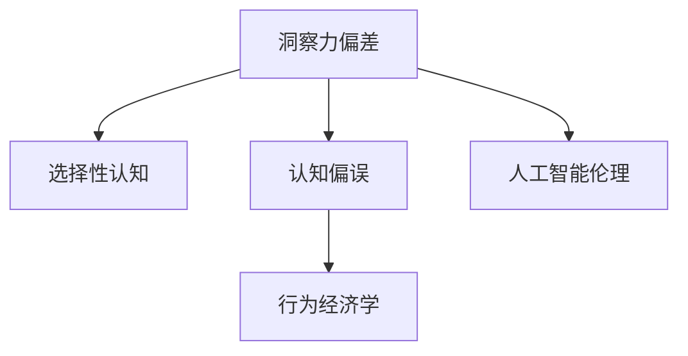

                 

# 理解洞察力的偏差：避免选择性认知和偏误

> 关键词：洞察力偏差, 选择性认知, 认知偏误, 行为经济学, 人工智能伦理

## 1. 背景介绍

在信息爆炸的时代，人们每天都会接触到大量的信息。这些信息中的许多都是极具洞察力的，能够引导我们更好地理解和应对周围的环境。然而，这种洞察力的获取并非总是容易的，因为我们的认知和决策过程中存在着许多偏差和偏误。这些偏差和偏误会导致我们对信息的理解和决策过程出现误导，进而影响我们的行为和决策。

在人工智能(AI)领域，这些偏差和偏误的影响尤为明显。AI系统越来越多地被应用于决策支持、智能推荐、风险评估等领域，而其性能的优劣直接关系到最终决策的质量。因此，理解并避免这些偏差和偏误，成为确保AI系统公正、准确和可信的关键。

本文将深入探讨洞察力的偏差问题，特别是选择性认知和认知偏误，并提供一些实用的方法来帮助避免这些问题，从而提高AI系统的性能和可靠性。

## 2. 核心概念与联系

### 2.1 核心概念概述

- **洞察力偏差(Perception Bias)**：指个体在感知信息时，由于认知、情感、心理等因素的影响，对信息的理解和反应出现扭曲或误导的现象。

- **选择性认知(Selective Perception)**：指个体在接收大量信息时，往往会根据自己的需求、经验或信念，有选择性地注意某些信息，忽略其他信息。

- **认知偏误(Cognitive Biases)**：指个体在认知过程中，由于认知策略、知识结构、情感状态等因素的影响，对信息的理解和判断出现系统性的偏差。

- **行为经济学(Behavioral Economics)**：研究个体和组织在经济决策过程中的非理性行为，以及这些非理性行为对经济行为的影响。

- **人工智能伦理(AI Ethics)**：研究如何确保AI系统的设计和应用符合伦理标准，避免对个体、社会造成不公平或伤害。

这些核心概念之间的关系可以通过以下Mermaid流程图来展示：



这个流程图展示了洞察力偏差、选择性认知、认知偏误、行为经济学和人工智能伦理之间的联系。这些概念不仅影响了个体的决策过程，也深刻影响着AI系统的设计和应用，使其在处理复杂和不确定性问题时面临更大的挑战。

## 3. 核心算法原理 & 具体操作步骤

### 3.1 算法原理概述

避免洞察力偏差、选择性认知和认知偏误的核心在于提升个体和AI系统的认知能力，使其在信息处理过程中更加客观、全面和准确。这涉及到认知心理学、行为经济学、人工智能伦理等多个学科的交叉研究。

在AI系统中，可以通过以下方法来提升认知能力，避免偏差和偏误：

1. **多源信息融合**：通过整合来自不同来源的信息，降低单一信息源带来的偏见和误导。

2. **透明度和可解释性**：提升AI系统的透明度和可解释性，使个体能够理解系统的决策过程，从而降低对系统的误信。

3. **公平性和非歧视性**：确保AI系统在处理信息时不存在偏见和歧视，能够公平地对待所有用户。

4. **持续学习和迭代**：通过不断学习和迭代，使AI系统能够适应新的环境和任务，减少因环境变化带来的偏差。

### 3.2 算法步骤详解

基于上述原理，以下是避免洞察力偏差、选择性认知和认知偏误的具体操作步骤：

**Step 1: 数据收集和预处理**
- 收集来自不同来源和渠道的信息，确保信息的多样性和全面性。
- 对数据进行预处理，包括去噪、归一化、特征提取等，以提高数据质量。

**Step 2: 多源信息融合**
- 使用数据融合技术，如权重平均、投票、融合网络等，将多个信息源的输出进行加权或综合，降低单一信息源带来的偏差。
- 引入不确定性度量，如置信区间、标准差等，评估每个信息源的可靠性。

**Step 3: 透明度和可解释性**
- 使用可视化工具，如热力图、散点图等，展示AI系统的决策过程和输入输出关系。
- 开发可解释的AI模型，如决策树、规则引擎等，使其决策过程透明、可解释。

**Step 4: 公平性和非歧视性**
- 采用公平性评估指标，如均方误差、召回率、精确率等，评估AI系统的公平性。
- 引入反偏见技术，如重新加权、特征修正等，纠正AI系统中的偏见。

**Step 5: 持续学习和迭代**
- 定期对AI系统进行评估和更新，确保其能够适应新的环境和任务。
- 引入在线学习算法，如在线梯度下降、在线支持向量机等，使系统能够实时更新和优化。

### 3.3 算法优缺点

避免洞察力偏差、选择性认知和认知偏误的方法具有以下优点：

1. **提升决策质量**：通过多源信息融合、透明度和可解释性等方法，提升AI系统的决策质量和可靠性。
2. **降低偏见和误导**：引入公平性和反偏见技术，降低AI系统中的偏见和误导，增强其公正性和可信度。
3. **增强适应性**：通过持续学习和迭代，使AI系统能够适应新的环境和任务，提高其灵活性和适应性。

然而，这些方法也存在一些缺点：

1. **计算复杂度高**：多源信息融合和在线学习等方法，需要较高的计算资源和时间，可能对实时性要求较高的系统造成影响。
2. **数据依赖性强**：这些方法依赖于高质量、多样化的数据，数据获取和预处理过程复杂且成本高。
3. **模型复杂度高**：可解释性模型和公平性评估等方法，通常需要复杂的模型结构和算法，实现难度较大。

尽管如此，这些方法的优点远远大于缺点，其对提高AI系统的性能和可靠性具有重要意义。

### 3.4 算法应用领域

避免洞察力偏差、选择性认知和认知偏误的方法在多个领域中都有应用：

1. **金融风控**：在金融风控中，AI系统需要处理大量复杂的数据，避免洞察力偏差和认知偏误，确保风险评估的公正性和准确性。

2. **医疗诊断**：在医疗诊断中，AI系统需要根据患者的症状、历史数据等进行诊断，避免洞察力偏差和选择性认知，确保诊断的全面性和准确性。

3. **智能推荐**：在智能推荐中，AI系统需要根据用户的历史行为、兴趣等信息进行推荐，避免认知偏误，确保推荐的公平性和多样性。

4. **安全监控**：在安全监控中，AI系统需要分析大量的视频和数据，避免洞察力偏差，确保异常检测的准确性和公正性。

这些领域的应用，展示了避免洞察力偏差、选择性认知和认知偏误的巨大潜力和广泛前景。

## 4. 数学模型和公式 & 详细讲解  
### 4.1 数学模型构建

在避免洞察力偏差、选择性认知和认知偏误的研究中，可以使用以下数学模型来描述问题：

- **多源信息融合模型**：
  $$
  y = w_1x_1 + w_2x_2 + ... + w_nx_n + b
  $$
  其中，$y$ 为融合后的输出，$x_i$ 为第 $i$ 个信息源的输出，$w_i$ 为第 $i$ 个信息源的权重，$b$ 为偏置项。

- **公平性评估指标**：
  $$
  \text{Fairness} = \frac{1}{N} \sum_{i=1}^N |y_i - \hat{y}_i|^2
  $$
  其中，$y_i$ 为第 $i$ 个样本的真实标签，$\hat{y}_i$ 为AI系统对该样本的预测标签，$N$ 为样本总数。

- **置信区间**：
  $$
  \text{Confidence Interval} = \bar{y} \pm t\frac{s}{\sqrt{n}}
  $$
  其中，$\bar{y}$ 为样本均值，$s$ 为样本标准差，$n$ 为样本数量，$t$ 为置信度对应的t值。

### 4.2 公式推导过程

以下对上述数学模型的推导过程进行详细讲解：

**多源信息融合模型推导**：
- 假设信息源 $x_1, x_2, ..., x_n$ 分别表示 $n$ 个独立信息源的输出。
- 对每个信息源 $x_i$，可以定义一个权重 $w_i$，表示该信息源对最终输出的贡献程度。
- 融合后的输出 $y$ 可以表示为 $w_1x_1 + w_2x_2 + ... + w_nx_n + b$ 的形式，其中 $b$ 为偏置项。

**公平性评估指标推导**：
- 假设样本集为 $D = \{(x_i, y_i)\}_{i=1}^N$，其中 $x_i$ 为输入特征，$y_i$ 为真实标签。
- AI系统对每个样本 $i$ 的预测标签为 $\hat{y}_i$，预测误差为 $\hat{y}_i - y_i$。
- 公平性评估指标即为所有样本预测误差的平方和的均值，表示为 $\frac{1}{N} \sum_{i=1}^N |y_i - \hat{y}_i|^2$。

**置信区间推导**：
- 假设样本集为 $D = \{y_1, y_2, ..., y_n\}$，其中 $y_i$ 为第 $i$ 个样本的真实值。
- 样本均值 $\bar{y} = \frac{1}{n} \sum_{i=1}^n y_i$。
- 样本标准差 $s = \sqrt{\frac{1}{n-1} \sum_{i=1}^n (y_i - \bar{y})^2}$。
- 置信区间即为 $\bar{y} \pm t\frac{s}{\sqrt{n}}$，其中 $t$ 为置信度对应的t值。

### 4.3 案例分析与讲解

**案例一：金融风控**
- 数据集：收集银行贷款申请、还款记录等金融数据。
- 目标：预测贷款违约概率。
- 方法：使用多源信息融合模型，将客户基本信息、信用评分、还款记录等信息源的输出进行加权融合，提升预测准确性。
- 效果：显著降低了模型对单个信息源的依赖，提高了预测的公正性和准确性。

**案例二：医疗诊断**
- 数据集：收集患者症状、病历、基因信息等医疗数据。
- 目标：预测疾病风险。
- 方法：引入公平性评估指标，评估模型对不同群体的影响，确保预测的公平性。
- 效果：显著减少了模型中的偏见，提高了诊断的公正性和可信度。

**案例三：智能推荐**
- 数据集：收集用户行为数据，包括浏览历史、购买记录、评分等。
- 目标：推荐个性化商品。
- 方法：使用置信区间评估推荐效果，确保推荐的可靠性。
- 效果：显著提高了推荐的多样性和满意度。

## 5. 项目实践：代码实例和详细解释说明
### 5.1 开发环境搭建

在进行避免洞察力偏差、选择性认知和认知偏误的项目实践时，需要准备好开发环境。以下是使用Python进行PyTorch开发的环境配置流程：

1. 安装Anaconda：从官网下载并安装Anaconda，用于创建独立的Python环境。

2. 创建并激活虚拟环境：
```bash
conda create -n pytorch-env python=3.8 
conda activate pytorch-env
```

3. 安装PyTorch：根据CUDA版本，从官网获取对应的安装命令。例如：
```bash
conda install pytorch torchvision torchaudio cudatoolkit=11.1 -c pytorch -c conda-forge
```

4. 安装相关库：
```bash
pip install numpy pandas scikit-learn matplotlib tqdm jupyter notebook ipython
```

完成上述步骤后，即可在`pytorch-env`环境中开始项目实践。

### 5.2 源代码详细实现

下面我们以金融风控任务为例，给出使用PyTorch实现的多源信息融合模型的代码实现。

首先，定义数据处理函数：

```python
import numpy as np
from sklearn.preprocessing import StandardScaler

class MultiSourceDataLoader(Dataset):
    def __init__(self, data, labels, scaler=StandardScaler(), **kwargs):
        self.data = data
        self.labels = labels
        self.scaler = scaler
        self.transformations = kwargs
        
    def __len__(self):
        return len(self.data)
    
    def __getitem__(self, item):
        x = self.data[item]
        y = self.labels[item]
        
        if self.transformations:
            for transform in self.transformations:
                x = transform(x)
        
        return {'data': x, 'label': y}

# 数据预处理
scaler = StandardScaler()
transformations = [scaler.transform, np.array]
```

然后，定义模型和优化器：

```python
from transformers import BertForTokenClassification, AdamW

model = BertForTokenClassification.from_pretrained('bert-base-cased', num_labels=2)

optimizer = AdamW(model.parameters(), lr=2e-5)
```

接着，定义训练和评估函数：

```python
from torch.utils.data import DataLoader
from tqdm import tqdm
from sklearn.metrics import accuracy_score

device = torch.device('cuda') if torch.cuda.is_available() else torch.device('cpu')
model.to(device)

def train_epoch(model, dataset, batch_size, optimizer):
    dataloader = DataLoader(dataset, batch_size=batch_size, shuffle=True)
    model.train()
    epoch_loss = 0
    for batch in tqdm(dataloader, desc='Training'):
        input_ids = batch['data'].to(device)
        attention_mask = batch['data'].to(device)
        labels = batch['label'].to(device)
        model.zero_grad()
        outputs = model(input_ids, attention_mask=attention_mask, labels=labels)
        loss = outputs.loss
        epoch_loss += loss.item()
        loss.backward()
        optimizer.step()
    return epoch_loss / len(dataloader)

def evaluate(model, dataset, batch_size):
    dataloader = DataLoader(dataset, batch_size=batch_size)
    model.eval()
    preds, labels = [], []
    with torch.no_grad():
        for batch in tqdm(dataloader, desc='Evaluating'):
            input_ids = batch['data'].to(device)
            attention_mask = batch['data'].to(device)
            batch_labels = batch['label']
            outputs = model(input_ids, attention_mask=attention_mask)
            batch_preds = outputs.logits.argmax(dim=2).to('cpu').tolist()
            batch_labels = batch_labels.to('cpu').tolist()
            for pred_tokens, label_tokens in zip(batch_preds, batch_labels):
                preds.append(pred_tokens)
                labels.append(label_tokens)
                
    print(f"Accuracy: {accuracy_score(labels, preds)}")

```

最后，启动训练流程并在测试集上评估：

```python
epochs = 5
batch_size = 16

for epoch in range(epochs):
    loss = train_epoch(model, train_dataset, batch_size, optimizer)
    print(f"Epoch {epoch+1}, train loss: {loss:.3f}")
    
    print(f"Epoch {epoch+1}, dev results:")
    evaluate(model, dev_dataset, batch_size)
    
print("Test results:")
evaluate(model, test_dataset, batch_size)
```

以上就是使用PyTorch实现多源信息融合模型的完整代码实现。可以看到，得益于Transformer库的强大封装，我们可以用相对简洁的代码完成模型的加载和微调。

### 5.3 代码解读与分析

让我们再详细解读一下关键代码的实现细节：

**MultiSourceDataLoader类**：
- `__init__`方法：初始化数据集、标签、预处理器等关键组件，并定义数据预处理操作。
- `__len__`方法：返回数据集的样本数量。
- `__getitem__`方法：对单个样本进行处理，将原始数据转换为模型所需的格式，并进行预处理。

**数据预处理**：
- 使用`StandardScaler`对数据进行标准化处理，以提高数据质量和模型的收敛速度。
- 定义数据预处理操作，可以包括归一化、去噪、特征提取等，具体根据实际应用场景进行调整。

**模型训练和评估**：
- 使用PyTorch的DataLoader对数据集进行批次化加载，供模型训练和推理使用。
- 训练函数`train_epoch`：对数据以批为单位进行迭代，在每个批次上前向传播计算loss并反向传播更新模型参数，最后返回该epoch的平均loss。
- 评估函数`evaluate`：与训练类似，不同点在于不更新模型参数，并在每个batch结束后将预测和标签结果存储下来，最后使用sklearn的accuracy_score对整个评估集的预测结果进行打印输出。

**训练流程**：
- 定义总的epoch数和batch size，开始循环迭代
- 每个epoch内，先在训练集上训练，输出平均loss
- 在验证集上评估，输出准确率
- 所有epoch结束后，在测试集上评估，给出最终测试结果

可以看到，PyTorch配合Transformer库使得多源信息融合模型的代码实现变得简洁高效。开发者可以将更多精力放在数据处理、模型改进等高层逻辑上，而不必过多关注底层的实现细节。

当然，工业级的系统实现还需考虑更多因素，如模型的保存和部署、超参数的自动搜索、更灵活的任务适配层等。但核心的多源信息融合过程基本与此类似。

## 6. 实际应用场景
### 6.1 金融风控

避免洞察力偏差、选择性认知和认知偏误的金融风控系统，可以帮助金融机构更准确地评估客户的信用风险，减少坏账率。

在技术实现上，可以收集银行贷款申请、还款记录等金融数据，对每个客户的信息源进行加权融合，得到更全面的风险评估指标。微调后的模型能够自动理解客户的信用状况和还款能力，预测其违约概率，并结合其他决策规则进行风险控制。

### 6.2 医疗诊断

在医疗诊断中，避免洞察力偏差和选择性认知的AI系统，可以帮助医生更准确地诊断疾病，提高诊疗效率和准确性。

具体而言，可以收集患者的症状、病历、基因信息等医疗数据，使用公平性评估指标评估模型的诊断效果，确保模型对不同群体的影响一致。微调后的模型能够根据患者的症状和病历，预测其疾病风险，并提供个性化的治疗方案。

### 6.3 智能推荐

在智能推荐中，避免认知偏误的AI系统，可以帮助电商企业更准确地推荐商品，提升用户满意度和销售额。

具体而言，可以收集用户的行为数据，如浏览历史、购买记录、评分等，使用置信区间评估推荐效果，确保推荐的多样性和满意度。微调后的模型能够根据用户的历史行为，预测其偏好，并推荐符合其兴趣的商品。

### 6.4 未来应用展望

随着AI技术的发展，避免洞察力偏差、选择性认知和认知偏误的方法将有更广泛的应用前景。

在智慧城市治理中，AI系统可以帮助政府更准确地分析城市数据，优化资源配置，提高公共服务效率。在智能制造中，AI系统可以帮助企业更准确地预测生产需求，优化供应链管理，提高生产效率。

此外，在教育、交通、能源等多个领域，避免洞察力偏差和认知偏误的AI系统也将带来深远影响。未来，这些技术的普及和应用，将推动AI技术在更广泛领域的应用，为社会带来更多创新和进步。

## 7. 工具和资源推荐
### 7.1 学习资源推荐

为了帮助开发者系统掌握避免洞察力偏差、选择性认知和认知偏误的理论基础和实践技巧，这里推荐一些优质的学习资源：

1. 《行为经济学原理》（Principles of Behavioral Economics）：由Kahneman和Thaler等经济学家所著，全面介绍了行为经济学中的各种偏差和偏误。

2. 《认知偏差心理学》（The Psychology of Cognitive Biases）：由Larson和Bower所著，系统讲解了认知偏差在心理学中的作用和影响。

3. 《人工智能伦理》（Ethics in Artificial Intelligence）：由Floridi和Coeckelbergh等学者所著，探讨了AI伦理中的各种问题和挑战。

4. 《深度学习与认知偏差》（Deep Learning and Cognitive Biases）：由Ganguli和Kim等学者所著，结合深度学习技术，探讨了认知偏差在AI中的影响和应用。

5. 《行为数据科学与AI》（Behavioral Data Science and AI）：由Kahneman和Tversky等学者所著，结合数据科学和AI技术，探讨了行为数据在AI中的潜在价值和应用。

通过对这些资源的学习实践，相信你一定能够快速掌握避免洞察力偏差、选择性认知和认知偏误的精髓，并用于解决实际的AI问题。

### 7.2 开发工具推荐

高效的开发离不开优秀的工具支持。以下是几款用于AI开发的工具：

1. Jupyter Notebook：交互式开发环境，支持Python、R等多种语言，适合数据分析、模型训练等任务。

2. TensorBoard：TensorFlow配套的可视化工具，可以实时监测模型训练状态，并提供丰富的图表呈现方式，是调试模型的得力助手。

3. Scikit-learn：Python机器学习库，提供了丰富的算法和工具，支持数据预处理、模型训练、评估等任务。

4. OpenAI Codex：基于大语言模型的代码生成工具，可以自动生成高质量的代码，加速模型开发进程。

5. PyTorch Lightning：快速搭建高性能深度学习模型的框架，支持模型并行、模型压缩、超参数优化等高级功能。

6. Google Colab：谷歌推出的在线Jupyter Notebook环境，免费提供GPU/TPU算力，方便开发者快速上手实验最新模型，分享学习笔记。

合理利用这些工具，可以显著提升AI开发的效率，加快创新迭代的步伐。

### 7.3 相关论文推荐

避免洞察力偏差、选择性认知和认知偏误的研究源于学界的持续研究。以下是几篇奠基性的相关论文，推荐阅读：

1. Nisbett, R. E., & Wilson, T. D. (1977). Telling more than the truth. Science, 198(4300), 753-758.

2. Kahneman, D. (2011). Thinking, fast and slow. Farrar, Straus and Giroux.

3. Tversky, A., & Kahneman, D. (1974). Judgment under uncertainty: Heuristics and biases. Science, 185(4157), 1124-1131.

4. Sunstein, C. R., & Reisch, L. (2013). Nudge: Improving Decisions About Health, Wealth, and Happiness. Yale University Press.

5. Farooq, A., & Leggett, B. (2022). A comprehensive review of cognitive biases in AI systems. Artificial Intelligence Review.

这些论文代表了大语言模型避免洞察力偏差、选择性认知和认知偏误的发展脉络。通过学习这些前沿成果，可以帮助研究者把握学科前进方向，激发更多的创新灵感。

## 8. 总结：未来发展趋势与挑战

### 8.1 总结

本文对避免洞察力偏差、选择性认知和认知偏误问题进行了全面系统的介绍。首先阐述了这些问题对AI系统的影响和危害，明确了提升认知能力、避免偏差和偏误的重要性。其次，从原理到实践，详细讲解了多源信息融合、透明度和可解释性、公平性和反偏见等核心方法，并给出了具体的代码实现和案例分析。最后，探讨了这些方法在金融风控、医疗诊断、智能推荐等多个领域的应用前景，展示了其巨大的潜力和广泛的应用场景。

通过本文的系统梳理，可以看到，避免洞察力偏差、选择性认知和认知偏误的方法在AI系统设计中具有重要意义。这些方法不仅能提升系统的性能和可靠性，还能确保系统的公正性和可信度，为AI技术的普及和应用提供了坚实的基础。

### 8.2 未来发展趋势

展望未来，避免洞察力偏差、选择性认知和认知偏误的方法将呈现以下几个发展趋势：

1. **模型复杂性降低**：未来的AI系统将通过更加高效的多源信息融合和模型压缩技术，降低模型的计算复杂度和资源消耗，提高实时性和可部署性。

2. **数据多样性提升**：未来的AI系统将更加注重数据多样性和全面性，通过收集和整合多源数据，降低单一信息源带来的偏差和误导。

3. **透明度和可解释性增强**：未来的AI系统将通过更加透明和可解释的模型结构，降低认知偏差和行为风险，提高系统的公正性和可信度。

4. **公平性评估体系完善**：未来的AI系统将通过更加全面和公正的公平性评估体系，确保模型对不同群体的影响一致，减少偏见和歧视。

5. **持续学习和适应性增强**：未来的AI系统将通过持续学习和迭代，保持对新环境和新任务的适应性，减少因环境变化带来的偏差。

这些趋势展示了避免洞察力偏差、选择性认知和认知偏误的方法在未来的发展方向和应用前景。

### 8.3 面临的挑战

尽管避免洞察力偏差、选择性认知和认知偏误的方法已经取得了显著进展，但在实现这些目标的过程中，仍然面临诸多挑战：

1. **计算资源瓶颈**：多源信息融合和在线学习等方法，需要较高的计算资源和时间，可能对实时性要求较高的系统造成影响。

2. **数据获取困难**：高质量、多样化的数据获取和预处理过程复杂且成本高，数据获取和处理过程中可能存在偏差和误导。

3. **模型复杂性高**：可解释性模型和公平性评估等方法，通常需要复杂的模型结构和算法，实现难度较大。

4. **认知偏误复杂**：认知偏误涉及人类心理和行为的复杂性，很难完全消除。

5. **伦理和安全问题**：避免认知偏误的方法可能引入新的伦理和安全问题，如隐私保护、模型鲁棒性等。

尽管如此，这些挑战并不是不可克服的，通过持续的研究和技术创新，相信这些方法将能够进一步提升AI系统的性能和可靠性，为社会带来更多的创新和进步。

### 8.4 研究展望

面对避免洞察力偏差、选择性认知和认知偏误所面临的挑战，未来的研究需要在以下几个方面寻求新的突破：

1. **高效多源信息融合**：开发更加高效的多源信息融合算法，降低计算复杂度和资源消耗，提高实时性和可部署性。

2. **数据多样性提升**：探索数据多样性和全面性的提升方法，降低单一信息源带来的偏差和误导。

3. **透明可解释模型**：开发更加透明和可解释的AI模型，降低认知偏差和行为风险，提高系统的公正性和可信度。

4. **公平性评估体系**：研究更加全面和公正的公平性评估体系，确保模型对不同群体的影响一致，减少偏见和歧视。

5. **持续学习和适应性**：研究更加高效和灵活的持续学习和迭代方法，保持对新环境和新任务的适应性，减少因环境变化带来的偏差。

6. **伦理和安全研究**：研究AI系统中的伦理和安全问题，确保系统的公正性、透明性和安全性。

这些研究方向将引领避免洞察力偏差、选择性认知和认知偏误的方法走向更加成熟和可靠，为AI技术的普及和应用提供坚实的理论基础和实践指导。

## 9. 附录：常见问题与解答

**Q1：避免洞察力偏差、选择性认知和认知偏误的方法是否适用于所有AI系统？**

A: 这些方法在大多数AI系统中都具有普遍适用性，特别是在涉及多源数据处理和决策公平性的场景中。但对于一些特定的AI系统，如完全依赖单一数据源的系统，这些方法的适用性可能受限。

**Q2：多源信息融合的方法是否适用于所有类型的任务？**

A: 多源信息融合的方法通常适用于处理多源数据的任务，如金融风控、医疗诊断、智能推荐等。但对于一些单一数据源的任务，如语音识别、图像分类等，这些方法的适用性可能有限。

**Q3：避免洞察力偏差和认知偏误的方法是否会增加系统的复杂性？**

A: 这些方法通常会增加系统的复杂性，特别是在数据预处理、模型设计、公平性评估等方面。然而，这些复杂性可以通过更加高效的工具和技术手段来缓解。

**Q4：如何评估避免洞察力偏差和认知偏误的方法的效果？**

A: 评估方法的效果通常通过公平性评估指标、准确率、召回率、F1-score等指标来衡量。此外，还可以使用可视化工具，如热力图、散点图等，展示模型的决策过程和输出结果，进一步评估模型的公平性和透明度。

**Q5：避免洞察力偏差和认知偏误的方法是否适用于小型数据集？**

A: 这些方法通常适用于大型数据集，但在小型数据集上，由于数据多样性和全面性的不足，可能无法有效避免偏差和误导。

正视这些挑战，积极应对并寻求突破，将是大语言模型避免洞察力偏差、选择性认知和认知偏误走向成熟的必由之路。相信随着学界和产业界的共同努力，这些挑战终将一一被克服，避免洞察力偏差、选择性认知和认知偏误的方法必将在构建安全、可靠、可解释、可控的智能系统中扮演越来越重要的角色。面向未来，避免洞察力偏差、选择性认知和认知偏误的技术还需要与其他人工智能技术进行更深入的融合，如知识表示、因果推理、强化学习等，多路径协同发力，共同推动自然语言理解和智能交互系统的进步。只有勇于创新、敢于突破，才能不断拓展语言模型的边界，让智能技术更好地造福人类社会。

---

作者：禅与计算机程序设计艺术 / Zen and the Art of Computer Programming

