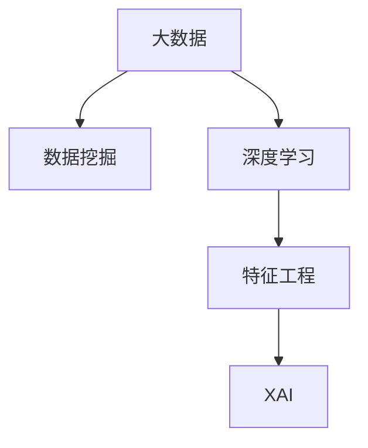

                 

# 理解洞察力的局限：承认复杂性和不确定因素

## 1. 背景介绍

在信息技术飞速发展的今天，数据分析和人工智能已经深入到各行各业，极大地提高了工作效率和生活质量。然而，这些技术在提升我们获取信息能力的同时，也暴露出了新的挑战和局限性。

### 1.1 大数据和人工智能的双刃剑
大数据和人工智能无疑极大地拓展了我们分析数据的能力，帮助我们在海量的数据中发现有用信息。然而，这些技术往往只能分析表面的数据关系，无法全面把握复杂的因果联系。这种局限性可能导致误导性的结论和决策，进而带来严重后果。

### 1.2 人性本质的复杂性
大数据和人工智能技术的强大功能，其实主要来源于对数据的抽象和简化。然而，现实世界充满了非线性、混沌和不确定性，这些复杂性难以完全建模。即便最先进的数据和算法，也难以完全掌握人性的微妙之处，例如决策、情感、道德等。

### 1.3 面对数据的不确定性
大数据和人工智能系统主要依赖历史数据进行训练和预测。然而，现实世界的变化无常，历史数据无法完全预测未来。面对数据的不确定性，现有系统往往缺乏灵活性和适应性，难以做出合理判断。

以上这些问题，要求我们在使用大数据和人工智能技术时，必须保持审慎和批判性，充分理解其局限性和潜在的风险。本文将探讨如何认识和处理这些局限性，进一步提升人工智能技术的安全性和可靠性。

## 2. 核心概念与联系

### 2.1 核心概念概述

为更好地理解人工智能技术的局限性，本节将介绍几个核心概念：

- 大数据（Big Data）：指规模巨大、高速变化、类型多样的数据集合。
- 人工智能（AI）：使用数据和算法模拟人类智能，包括感知、学习、推理等能力。
- 数据挖掘（Data Mining）：从大规模数据中发现隐含模式、知识或规律。
- 深度学习（Deep Learning）：使用多层神经网络进行复杂数据分析和建模。
- 特征工程（Feature Engineering）：从原始数据中提取有意义的特征，提高模型预测能力。
- 解释性AI（Explainable AI, XAI）：使AI模型的决策过程透明可解释，便于理解和调试。

这些概念之间的逻辑关系可以通过以下Mermaid流程图来展示：



这个流程图展示了大数据和人工智能中的关键概念及其之间的关系：

1. 大数据是人工智能的基础，提供数据挖掘和深度学习所需的输入。
2. 数据挖掘是提取数据中的关键信息，为深度学习提供特征输入。
3. 深度学习通过多层神经网络进行复杂模式建模，提供预测能力。
4. 特征工程优化输入特征，提升模型效果。
5. XAI使模型决策过程透明可解释，增强模型的可信度。

这些核心概念共同构成了大数据和人工智能的运行框架，使得我们能够从中发现数据中的重要信息和模式，并运用这些信息做出合理的决策。

## 3. 核心算法原理 & 具体操作步骤
### 3.1 算法原理概述

大数据和人工智能的局限性主要源于其核心算法的设计和应用。算法的复杂性和不确定性是其主要表现。

### 3.2 算法步骤详解

**Step 1: 数据采集和处理**
- 从各类数据源采集数据，包括但不限于数据库、日志文件、传感器等。
- 对数据进行清洗、去重、归一化等预处理，保证数据质量。
- 对数据进行采样和分割，划分为训练集、验证集和测试集。

**Step 2: 特征提取和选择**
- 通过统计、降维、特征选择等方法，从原始数据中提取有意义的特征。
- 使用领域知识和业务逻辑指导特征工程，提升模型泛化能力。

**Step 3: 模型训练和优化**
- 选择适合的模型，如回归模型、分类模型、神经网络等，进行训练。
- 使用交叉验证、网格搜索等方法，调整超参数，优化模型性能。
- 使用集成学习、梯度下降等方法，防止模型过拟合。

**Step 4: 模型评估和应用**
- 在测试集上评估模型效果，使用准确率、召回率、F1-score等指标衡量。
- 将模型应用于实际业务场景，进行预测和推理。
- 持续监控模型效果，及时调整参数，提升模型稳定性。

### 3.3 算法优缺点

大数据和人工智能的算法具有以下优点：
1. 强大的数据分析能力：能够处理海量数据，发现数据中的复杂模式和关系。
2. 高效的预测和决策：通过机器学习算法，快速得出预测结果，辅助决策。
3. 灵活的适应性：能够根据新的数据进行模型更新，适应数据分布的变化。

同时，这些算法也存在一定的局限性：
1. 过度依赖历史数据：算法主要依赖历史数据进行训练，难以处理数据分布变化。
2. 模型黑箱性：复杂模型如深度学习很难解释其内部机制，难以调试和优化。
3. 数据质量要求高：算法对输入数据的要求较高，容易出现数据偏差。
4. 鲁棒性不足：面对噪声数据和异常情况，算法容易失效。
5. 计算资源消耗大：训练复杂模型需要大量计算资源，对硬件要求高。

尽管存在这些局限性，但就目前而言，大数据和人工智能算法仍然是大数据分析和决策的主流范式。未来相关研究的重点在于如何进一步降低算法的复杂性和不确定性，提高其适应性和鲁棒性，同时兼顾可解释性和安全性等因素。

### 3.4 算法应用领域

大数据和人工智能技术已经在多个领域得到广泛应用，例如：

- 金融风控：利用算法进行风险评估和欺诈检测，保护金融安全。
- 医疗诊断：通过分析患者数据，辅助医生进行疾病诊断和治疗方案选择。
- 智能推荐：基于用户行为数据，推荐个性化的产品和服务。
- 供应链管理：利用大数据分析，优化库存和物流，降低运营成本。
- 自然语言处理：使用深度学习模型进行文本分析，辅助情感分析、舆情监测等任务。
- 自动驾驶：通过感知和决策算法，实现智能驾驶和交通管理。

除了这些常见应用外，大数据和人工智能技术还在智能家居、智慧城市、智能制造等多个领域得到应用，为各行各业带来了创新和变革。

## 4. 数学模型和公式 & 详细讲解 & 举例说明
### 4.1 数学模型构建

大数据和人工智能算法通常采用数学模型进行描述和计算。这里以回归分析为例，构建一个简单的数学模型。

假设我们有一个自变量向量 $\mathbf{x}=[x_1,x_2,\dots,x_n]$，一个因变量 $y$。根据经验，我们认为因变量与自变量之间的关系可以表示为：

$$
y = \beta_0 + \sum_{i=1}^{n} \beta_i x_i + \epsilon
$$

其中，$\beta_0$ 和 $\beta_i$ 为回归系数，$\epsilon$ 为随机误差项。这个模型即为线性回归模型。

### 4.2 公式推导过程

将上式代入数据集 $D=\{(x_i,y_i)\}_{i=1}^N$，得到：

$$
\mathcal{L}(\beta) = \sum_{i=1}^N (y_i - (\beta_0 + \sum_{j=1}^{n} \beta_j x_{ij}))^2
$$

求最小化损失函数 $\mathcal{L}(\beta)$ 的回归系数 $\beta$，即可得到最小二乘估计（Ordinary Least Squares, OLS）的回归方程：

$$
\hat{\beta} = (X^TX)^{-1}X^Ty
$$

其中 $X=[x_{i1},x_{i2},\dots,x_{in}]$ 为自变量矩阵，$y$ 为因变量向量。

### 4.3 案例分析与讲解

假设我们有一个关于房屋价格和面积的数据集，使用线性回归模型进行预测。我们首先采集了100个样本，包括房屋面积和价格的记录。经过数据清洗和预处理，得到一个矩阵 $X=[x_{i1},x_{i2},\dots,x_{in}]$ 和一个向量 $y$。

使用上式进行最小二乘估计，我们得到回归方程：

$$
\hat{y} = \beta_0 + \beta_1 x_{i1} + \epsilon
$$

其中 $\beta_0$ 和 $\beta_1$ 分别为房屋面积和价格的回归系数。将回归方程应用到未见过的数据中，可以得到该房屋的预测价格。

## 5. 项目实践：代码实例和详细解释说明
### 5.1 开发环境搭建

在进行数据分析和人工智能项目实践前，我们需要准备好开发环境。以下是使用Python进行Scikit-Learn和TensorFlow开发的常见环境配置流程：

1. 安装Anaconda：从官网下载并安装Anaconda，用于创建独立的Python环境。

2. 创建并激活虚拟环境：
```bash
conda create -n pyenv python=3.8 
conda activate pyenv
```

3. 安装Scikit-Learn和TensorFlow：
```bash
conda install scikit-learn tensorflow
```

4. 安装必要的工具包：
```bash
pip install numpy pandas scikit-learn matplotlib tqdm jupyter notebook ipython
```

完成上述步骤后，即可在`pyenv`环境中开始数据分析和人工智能的实践。

### 5.2 源代码详细实现

这里我们以线性回归为例，给出使用Scikit-Learn进行模型训练和预测的Python代码实现。

```python
from sklearn.linear_model import LinearRegression
from sklearn.model_selection import train_test_split
from sklearn.metrics import mean_squared_error

# 创建数据集
import numpy as np
X = np.array([[1], [2], [3], [4], [5]])
y = np.array([2, 4, 6, 8, 10])

# 数据划分
X_train, X_test, y_train, y_test = train_test_split(X, y, test_size=0.2, random_state=0)

# 创建模型
model = LinearRegression()

# 模型训练
model.fit(X_train, y_train)

# 模型预测
y_pred = model.predict(X_test)

# 模型评估
mse = mean_squared_error(y_test, y_pred)
print(f"Mean Squared Error: {mse:.3f}")
```

### 5.3 代码解读与分析

让我们再详细解读一下关键代码的实现细节：

**数据集创建**
- 使用numpy创建了5个样本的房屋面积和价格数据集，并保存在矩阵X和向量y中。

**数据划分**
- 使用sklearn的train_test_split函数将数据集划分为训练集和测试集，比例为8:2。

**模型创建和训练**
- 创建线性回归模型，并使用训练集数据拟合模型。

**模型预测**
- 使用训练好的模型对测试集进行预测，得到预测值y_pred。

**模型评估**
- 使用sklearn的mean_squared_error函数计算预测值与真实值的均方误差，并输出。

可以看到，Scikit-Learn提供了简单易用的接口，帮助我们快速实现线性回归模型的训练和评估。在实际应用中，我们还可以使用TensorFlow等深度学习框架进行更复杂的模型训练和优化。

## 6. 实际应用场景
### 6.1 金融风控

金融风控是大数据和人工智能技术的重要应用场景之一。传统风控系统依赖人工审核，成本高、效率低。通过大数据和人工智能技术，可以实时监控交易行为，自动识别风险，及时预警并采取措施。

在技术实现上，可以收集交易历史数据，训练模型识别正常交易和异常交易模式。一旦发现有异常交易，系统便会触发风险预警，进行进一步审核。此外，利用机器学习算法还可以识别欺诈行为，降低金融风险。

### 6.2 医疗诊断

医疗诊断是大数据和人工智能技术的重要应用领域。医生对患者的诊断依赖经验，存在个体差异。通过数据分析，可以辅助医生进行疾病诊断和治疗方案选择，提高诊断的准确率和效率。

在实际应用中，可以采集大量的患者数据，包括病历、体检报告、实验室数据等。使用深度学习模型对这些数据进行建模，识别出疾病的早期症状和预后指标。医生可以根据这些数据，辅助进行诊断和治疗决策。

### 6.3 智能推荐

智能推荐系统广泛应用于电商、媒体、视频等多个领域。传统的推荐系统依赖人工规则，难以灵活调整。通过大数据和人工智能技术，可以实时分析用户行为数据，推荐个性化的商品和服务。

在技术实现上，可以收集用户浏览、点击、评分等行为数据，使用协同过滤、内容推荐等算法进行推荐。利用深度学习模型可以捕捉用户行为背后的隐含模式，提高推荐的精度和多样性。

### 6.4 未来应用展望

随着大数据和人工智能技术的不断发展，未来其在各个领域的应用将更加广泛和深入。以下是几个未来应用展望：

- 医疗领域：结合大数据和人工智能技术，实现个性化医疗，提高诊断和治疗效果。
- 金融领域：通过数据分析，实时监控市场风险，提升金融产品的创新和风险管理能力。
- 制造业：利用工业大数据，实现智能制造和设备维护，降低生产成本和故障率。
- 教育领域：使用智能推荐和数据分析，实现个性化教育，提高教学质量和学生成绩。
- 交通领域：结合大数据和人工智能技术，实现智能交通管理和调度，提高交通效率和安全性。

## 7. 工具和资源推荐
### 7.1 学习资源推荐

为了帮助开发者系统掌握大数据和人工智能技术的理论基础和实践技巧，这里推荐一些优质的学习资源：

1. 《Python数据分析与机器学习》系列博文：由Python专家撰写，深入浅出地介绍了数据分析和机器学习的基本概念和常用技术。

2. 《深度学习》课程：斯坦福大学开设的深度学习课程，由Andrew Ng教授主讲，内容全面覆盖深度学习的各个方面。

3. 《机器学习实战》书籍：由Peter Harrington所著，详细介绍各种机器学习算法的实现和应用。

4. Kaggle：数据科学竞赛平台，提供大量高质量数据集和竞赛任务，锻炼数据分析和模型优化能力。

5. Coursera：在线教育平台，提供众多优质的大数据和人工智能课程，覆盖从入门到高级的内容。

通过对这些资源的学习实践，相信你一定能够快速掌握大数据和人工智能技术的精髓，并用于解决实际的数据分析问题。

### 7.2 开发工具推荐

高效的工具是实现大数据和人工智能项目的必备条件。以下是几款用于数据分析和人工智能开发的常用工具：

1. Jupyter Notebook：基于Web的交互式编程环境，支持Python、R等多种语言，方便进行实验和协作。

2. PyTorch：基于Python的深度学习框架，灵活的动态计算图，适合快速迭代研究。

3. TensorFlow：由Google主导开发的深度学习框架，生产部署方便，适合大规模工程应用。

4. Scikit-Learn：基于Python的机器学习库，提供了大量的经典算法和工具函数。

5. Matplotlib：Python的绘图库，支持多种绘图类型，方便展示数据分析结果。

6. Weights & Biases：模型训练的实验跟踪工具，可以记录和可视化模型训练过程中的各项指标，方便对比和调优。

合理利用这些工具，可以显著提升大数据和人工智能项目的开发效率，加快创新迭代的步伐。

### 7.3 相关论文推荐

大数据和人工智能技术的发展源于学界的持续研究。以下是几篇奠基性的相关论文，推荐阅读：

1. Deep Blue: Ultimate Battles in the Quest for the Machine Checkmate（国际象棋软件Deep Blue开发过程）：展示了如何通过数据挖掘和机器学习技术，开发出国际象棋软件，击败了人类冠军。

2. AlphaGo Zero: Mastering the Game of Go without Human Knowledge（AlphaGo Zero开发过程）：介绍了利用强化学习和大数据技术，开发出超越人类水平的围棋AI。

3. ImageNet Classification with Deep Convolutional Neural Networks（AlexNet论文）：提出使用卷积神经网络进行图像分类，刷新了图像识别任务的最先进性能。

4. Stanford Question Answering Dataset（SQuAD）：构建了一个大规模问答数据集，用于评估机器阅读理解能力。

5. Super Duper Deep: A Mix of Supervised, Semi-Supervised, and Unsupervised Learning in ConvNets（Super Duper Deep论文）：提出结合多模态数据和多任务学习，提高深度学习模型的性能和泛化能力。

这些论文代表了大数据和人工智能技术的发展脉络。通过学习这些前沿成果，可以帮助研究者把握学科前进方向，激发更多的创新灵感。

## 8. 总结：未来发展趋势与挑战
### 8.1 总结

本文对大数据和人工智能技术的局限性进行了全面系统的介绍。首先阐述了大数据和人工智能技术的强大功能，同时也指出了其背后的复杂性和不确定性。通过这些讨论，读者可以更好地理解这些技术的潜在风险和挑战，增强使用时的审慎性。

### 8.2 未来发展趋势

展望未来，大数据和人工智能技术的发展将呈现以下几个趋势：

1. 计算能力的提升：随着硬件技术的进步，计算能力将不断提升，大数据和人工智能算法将能够处理更大规模和更复杂的数据。

2. 数据的多样性：未来的数据将更加多样化，涵盖语音、视频、传感器等多个模态。大数据和人工智能算法将进一步融合多种数据，实现跨模态的分析和建模。

3. 模型的可解释性：面对复杂的数据和算法，提高模型的可解释性将是未来的重要研究方向。通过XAI等技术，使模型决策过程透明可解释，增强模型的可信度。

4. 算法的鲁棒性：面对数据的不确定性和噪声干扰，提高算法的鲁棒性将是重要的研究方向。通过对抗训练、数据增强等技术，提升模型对异常情况的适应能力。

5. 融合领域知识：未来的算法将更加注重领域知识的应用，结合专家知识和规则库，提升模型的泛化能力和解释能力。

6. 智能伦理和社会责任：大数据和人工智能技术的普及将带来更多的社会问题，如何保障数据隐私和安全、避免算法偏见和歧视等，将是未来重要的研究方向。

以上趋势凸显了大数据和人工智能技术的广阔前景。这些方向的探索发展，必将进一步提升模型的性能和应用范围，为人工智能技术的普及和落地带来新的动力。

### 8.3 面临的挑战

尽管大数据和人工智能技术已经取得了瞩目成就，但在迈向更加智能化、普适化应用的过程中，它仍面临着诸多挑战：

1. 数据质量和规模：数据的质量和规模仍是制约大数据和人工智能技术的重要因素。数据偏差和缺失将影响算法的性能和泛化能力。

2. 算法的复杂性：大数据和人工智能算法复杂度高，难以解释其内部机制。算法的可解释性和可调试性仍需进一步提升。

3. 计算资源的消耗：大规模模型的训练和推理需要大量计算资源，对硬件和网络要求高。如何降低计算成本，提高模型的实时性，仍需不断优化。

4. 模型的鲁棒性：面对噪声数据和异常情况，算法容易失效。如何提高模型的鲁棒性，增强算法的稳定性和可靠性，仍是重要的研究方向。

5. 数据隐私和安全：数据隐私和安全问题是人工智能应用的重要挑战。如何保护用户隐私，防止数据泄露，仍需进一步探索。

6. 社会伦理和法律问题：大数据和人工智能技术的普及将带来新的伦理和法律问题。如何制定合理的法规和政策，保障技术的应用效果和社会效益，仍需深入探讨。

### 8.4 研究展望

面对大数据和人工智能技术所面临的挑战，未来的研究需要在以下几个方面寻求新的突破：

1. 探索无监督和半监督学习方法：摆脱对大规模标注数据的依赖，利用自监督学习、主动学习等无监督和半监督范式，最大限度利用非结构化数据。

2. 开发更加高效和可解释的算法：提高算法的效率和可解释性，使模型决策过程透明可解释，增强模型的可信度。

3. 引入更多先验知识：将符号化的先验知识，如知识图谱、逻辑规则等，与神经网络模型进行巧妙融合，提高模型的泛化能力和解释能力。

4. 引入因果分析思想：通过引入因果分析方法，识别出模型决策的关键特征，增强输出解释的因果性和逻辑性。

5. 纳入伦理道德约束：在模型训练目标中引入伦理导向的评估指标，过滤和惩罚有偏见、有害的输出倾向。加强人工干预和审核，建立模型行为的监管机制，确保输出符合人类价值观和伦理道德。

这些研究方向的探索，必将引领大数据和人工智能技术迈向更高的台阶，为构建安全、可靠、可解释、可控的智能系统铺平道路。面向未来，大数据和人工智能技术还需要与其他人工智能技术进行更深入的融合，如知识表示、因果推理、强化学习等，多路径协同发力，共同推动自然语言理解和智能交互系统的进步。只有勇于创新、敢于突破，才能不断拓展人工智能技术的边界，让智能技术更好地造福人类社会。

## 9. 附录：常见问题与解答

**Q1：如何处理数据的不确定性？**

A: 数据的不确定性是大数据和人工智能技术面临的重要挑战。解决这一问题需要从数据预处理、模型设计、后处理等多个环节进行综合优化。

- 数据预处理：通过数据清洗、去重、归一化等预处理手段，提高数据质量。
- 模型设计：引入对抗训练、数据增强等技术，增强模型对噪声和异常情况的适应能力。
- 后处理：通过后处理技术，如置信度计算、异常检测等，提高模型输出的稳定性和可靠性。

**Q2：如何提高模型的可解释性？**

A: 提高模型的可解释性是大数据和人工智能技术的重要研究方向。以下是一些常用的方法：

- 特征可视化：使用可视化工具，展示模型的输入输出关系和特征重要性。
- 重要性解释：通过SHAP、LIME等算法，计算每个特征对模型输出的贡献度。
- 知识图谱：构建知识图谱，结合领域知识和模型输出，提高模型的解释能力。

**Q3：如何优化模型的计算效率？**

A: 优化模型的计算效率是大数据和人工智能技术的重要目标。以下是一些常用的方法：

- 模型压缩：通过剪枝、量化、蒸馏等技术，减小模型尺寸，提高计算效率。
- 分布式计算：使用分布式计算框架，如Hadoop、Spark等，提高计算速度。
- 硬件加速：使用GPU、TPU等硬件设备，加速模型训练和推理。

这些方法需要根据具体应用场景和模型特点进行灵活选择和组合，才能达到最佳效果。

**Q4：如何应对数据的多样性和复杂性？**

A: 数据的多样性和复杂性是大数据和人工智能技术的重要挑战。以下是一些常用的方法：

- 数据集成：将不同数据源的数据集成，形成一个统一的数据视图，方便数据建模。
- 数据融合：通过数据融合技术，将多模态数据结合，提高模型的综合能力。
- 领域知识：结合领域知识，进行数据预处理和特征工程，提高模型的解释能力和泛化能力。

通过这些方法，可以应对数据的多样性和复杂性，提高模型的性能和稳定性。

**Q5：如何应对算法的复杂性和不确定性？**

A: 算法的复杂性和不确定性是大数据和人工智能技术的核心问题。以下是一些常用的方法：

- 简化模型：使用更简单、更轻量的模型结构，降低复杂性。
- 参数高效：使用参数高效的技术，如LoRA、AdaLoRA等，在不增加参数量的情况下，提升模型的泛化能力。
- 随机化：引入随机化技术，如Dropout、噪声注入等，增强模型的鲁棒性和泛化能力。

这些方法需要根据具体应用场景和模型特点进行灵活选择和组合，才能达到最佳效果。

---

作者：禅与计算机程序设计艺术 / Zen and the Art of Computer Programming

