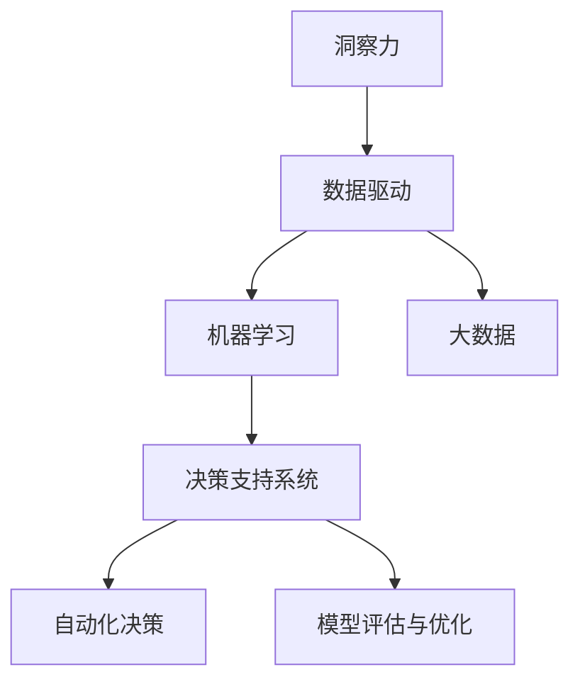

                 

# 理解洞察力的应用：在商业策略中的力量

> 关键词：洞察力,商业策略,数据驱动,机器学习,大数据,决策支持系统,行为分析,人工智能,客户画像

## 1. 背景介绍

### 1.1 问题由来
在商业决策过程中，洞察力（Insight）具有至关重要的作用。洞察力指的是通过观察和分析发现隐藏的规律、趋势和模式的能力，是企业制定有效策略、优化运营效率、提升客户满意度的关键。然而，在信息爆炸的时代，数据量之大、速度之快、维度之多，使得商业决策者难以从海量数据中快速获得有价值的洞察。

近年来，随着人工智能和大数据技术的不断成熟，越来越多的企业开始借助机器学习和数据驱动的方法，自动化地从海量数据中提取和分析洞察力，辅助企业做出更加科学和准确的商业决策。通过理解洞察力的应用，企业能够更有效地应对市场变化，抓住机会，实现可持续发展。

### 1.2 问题核心关键点
洞察力的应用涉及多个关键点，包括数据收集、清洗、分析、可视化和应用。在这些步骤中，机器学习和数据驱动的方法扮演了重要的角色。以下是该问题涉及的主要关键点：

1. **数据收集与预处理**：收集并处理来自不同来源的数据，如客户交易记录、社交媒体互动、网站流量等。
2. **机器学习模型选择**：选择合适的机器学习模型，如回归分析、分类模型、聚类分析、关联规则挖掘等。
3. **数据可视化与报表**：将分析结果以图形、报表等方式呈现，帮助决策者直观理解数据背后的洞察力。
4. **决策支持系统**：开发和部署决策支持系统，利用数据分析结果进行自动化决策和建议。
5. **模型评估与优化**：评估模型的性能，根据反馈不断优化模型，提高洞察力的准确性和可靠性。

理解这些关键点，有助于企业更好地利用机器学习和数据驱动的方法，提升洞察力应用的效果，从而在商业策略中发挥更大的作用。

## 2. 核心概念与联系

### 2.1 核心概念概述

为更好地理解洞察力在商业策略中的应用，本节将介绍几个密切相关的核心概念：

- **洞察力（Insight）**：通过数据分析发现隐藏的规律、趋势和模式的能力。在商业策略中，洞察力帮助企业发现市场机会、识别潜在风险、优化产品和服务。
- **数据驱动（Data-Driven）**：利用数据进行决策的过程，强调基于数据而非直觉或经验的决策方式。数据驱动帮助企业提升决策的科学性和准确性。
- **机器学习（Machine Learning）**：通过算法和模型自动从数据中学习和发现规律的技术。机器学习能够自动化地从海量数据中提取洞察力，支持企业进行快速响应和优化。
- **大数据（Big Data）**：指体积大、类型多、速度快的数据集。大数据技术使企业能够处理和分析更为复杂和多样化的数据，提升洞察力的广度和深度。
- **决策支持系统（DSS）**：利用数据分析结果进行自动化决策和建议的系统。DSS帮助企业快速响应市场变化，提升决策效率和质量。

这些核心概念之间的逻辑关系可以通过以下Mermaid流程图来展示：



这个流程图展示了大数据、机器学习和洞察力之间的内在联系：

1. 大数据为机器学习提供了丰富的数据源。
2. 机器学习自动从大数据中提取和分析洞察力。
3. 洞察力通过决策支持系统转化为自动化决策，提升企业运营效率。
4. 模型评估与优化进一步提升洞察力的准确性和可靠性。

## 3. 核心算法原理 & 具体操作步骤
### 3.1 算法原理概述

洞察力的应用过程可以大致分为以下几步：

1. **数据收集与预处理**：收集来自不同来源的数据，并进行清洗和预处理，确保数据的质量和一致性。
2. **特征工程与模型选择**：选择合适的机器学习模型，并进行特征选择和特征工程，提升模型的性能。
3. **训练与评估**：使用训练数据对模型进行训练，并使用测试数据评估模型的性能。
4. **可视化与报表**：将分析结果以图形、报表等方式呈现，帮助决策者直观理解数据背后的洞察力。
5. **决策支持与优化**：将洞察力应用到实际决策过程中，通过决策支持系统进行自动化决策和优化。

在算法层面，洞察力的应用主要涉及以下几个关键技术：

- **回归分析**：用于预测数值型变量的值，如销售额、收益等。
- **分类模型**：用于预测分类变量的值，如客户分类、产品类别等。
- **聚类分析**：将数据分成不同的组或簇，发现数据的自然结构。
- **关联规则挖掘**：发现数据集中的频繁项集和关联规则，如购物篮分析。

### 3.2 算法步骤详解

以下是洞察力应用的一般步骤：

**Step 1: 数据收集与预处理**
- 确定数据来源，如销售记录、客户互动记录、社交媒体等。
- 使用ETL工具进行数据清洗、转换和加载，确保数据质量。
- 进行数据整合，将不同来源的数据合并成一致的格式。

**Step 2: 特征工程与模型选择**
- 进行特征选择和特征工程，提取有意义的特征。
- 选择合适的机器学习模型，如回归模型、分类模型、聚类模型等。
- 使用交叉验证等方法评估模型的性能。

**Step 3: 训练与评估**
- 使用训练数据对模型进行训练。
- 使用测试数据评估模型的性能，选择合适的超参数。
- 进行模型调优，提升模型的准确性和可靠性。

**Step 4: 可视化与报表**
- 将模型分析结果以图形、报表等方式呈现。
- 使用Tableau、Power BI等工具进行数据可视化。
- 编写业务报表，提供给决策者直观理解。

**Step 5: 决策支持与优化**
- 将洞察力应用到实际决策过程中，如自动化推荐系统、定价策略等。
- 利用决策支持系统进行自动化决策和优化。
- 不断收集反馈，评估和优化模型，提升洞察力的价值。

### 3.3 算法优缺点

洞察力的应用过程中，机器学习和大数据技术提供了强大的支持，但也存在一些局限性：

**优点**：
1. **自动化和高效性**：机器学习和数据驱动的方法可以自动化地从大数据中提取洞察力，提升决策效率。
2. **科学性和准确性**：数据驱动的方法通过分析和模型优化，提升决策的科学性和准确性。
3. **灵活性和可扩展性**：机器学习模型和数据处理工具具有高度灵活性和可扩展性，可以适应不同场景和需求。

**缺点**：
1. **数据质量依赖**：洞察力的质量高度依赖于数据的质量和完整性，数据偏差可能导致洞察力的误导。
2. **模型复杂性**：选择合适的模型和优化参数需要一定的专业知识和经验。
3. **计算资源消耗**：处理和分析大规模数据需要大量的计算资源，可能面临资源瓶颈。

## 4. 数学模型和公式 & 详细讲解 & 举例说明

### 4.1 数学模型构建

洞察力的应用过程中，主要涉及回归分析、分类模型、聚类分析等常见的机器学习模型。以回归分析为例，构建数学模型如下：

设 $X$ 为自变量，$Y$ 为因变量，$n$ 为样本数量，$w$ 为模型参数。回归模型的目标是最小化预测误差，即：

$$
\min_{w} \sum_{i=1}^n (y_i - w^T x_i)^2
$$

其中 $x_i$ 为第 $i$ 个样本的特征向量，$y_i$ 为第 $i$ 个样本的目标值。

### 4.2 公式推导过程

回归分析的公式推导过程如下：

1. **最小二乘法**：假设模型线性，即 $Y = w^T X + b$，其中 $b$ 为截距。目标是最小化预测误差：

$$
\min_{w,b} \sum_{i=1}^n (y_i - w^T x_i - b)^2
$$

2. **矩阵形式**：将上述公式转化为矩阵形式：

$$
\min_{w,b} ||y - Xw - b||^2
$$

3. **正规方程**：通过求解正规方程 $X^T X w = X^T y$ 来得到 $w$ 的值：

$$
w = (X^T X)^{-1} X^T y
$$

### 4.3 案例分析与讲解

以销售额预测为例，假设有一家电商公司，想要预测未来一个月的销售额。可以使用线性回归模型进行预测：

1. **数据准备**：收集过去一个月的销售数据，包括日期、销售额、促销活动等特征。
2. **模型训练**：使用历史数据训练线性回归模型，求解模型参数 $w$。
3. **模型评估**：使用验证集评估模型的性能，选择最优模型。
4. **预测应用**：使用训练好的模型对未来一个月的销售额进行预测。

## 5. 项目实践：代码实例和详细解释说明
### 5.1 开发环境搭建

在进行洞察力应用实践前，我们需要准备好开发环境。以下是使用Python进行机器学习开发的环境配置流程：

1. 安装Anaconda：从官网下载并安装Anaconda，用于创建独立的Python环境。

2. 创建并激活虚拟环境：
```bash
conda create -n ml-env python=3.8 
conda activate ml-env
```

3. 安装必要的包：
```bash
conda install numpy pandas scikit-learn matplotlib seaborn jupyter notebook
```

4. 安装机器学习库：
```bash
pip install scikit-learn joblib
```

5. 安装可视化工具：
```bash
pip install matplotlib seaborn jupyter
```

完成上述步骤后，即可在`ml-env`环境中开始洞察力应用的实践。

### 5.2 源代码详细实现

以下是一个简单的回归分析模型实现，用于预测销售额：

```python
from sklearn.linear_model import LinearRegression
import pandas as pd
import matplotlib.pyplot as plt

# 数据准备
data = pd.read_csv('sales_data.csv')
X = data[['date', 'promo', 'advertising']]
y = data['sales']

# 模型训练
model = LinearRegression()
model.fit(X, y)

# 模型评估
train_score = model.score(X, y)
print('Train Score:', train_score)

# 模型预测
future_date = pd.date_range(start='2022-01-01', end='2022-01-31', freq='D')
future_data = pd.DataFrame({'date': future_date, 'promo': 0, 'advertising': 0})
future_pred = model.predict(future_data)
print('Future Sales Prediction:', future_pred)
```

### 5.3 代码解读与分析

让我们再详细解读一下关键代码的实现细节：

**数据准备**：
- `pd.read_csv()`：使用Pandas库读取CSV文件中的数据。
- `X` 和 `y` 分别为自变量和因变量的Pandas DataFrame。

**模型训练**：
- `LinearRegression()`：使用Scikit-learn库中的线性回归模型。
- `model.fit(X, y)`：训练模型，求解参数 $w$。

**模型评估**：
- `model.score(X, y)`：计算模型在训练集上的R平方值，评估模型性能。

**模型预测**：
- `future_date`：定义预测日期范围。
- `future_data`：构造新的数据集，用于预测。
- `model.predict(future_data)`：使用模型进行预测。

可以看到，在Python中使用机器学习库进行洞察力应用的代码实现相对简洁高效。开发者可以将更多精力放在数据处理、模型改进等高层逻辑上，而不必过多关注底层的实现细节。

当然，工业级的系统实现还需考虑更多因素，如模型的保存和部署、超参数的自动搜索、更灵活的模型构建逻辑等。但核心的洞察力应用流程基本与此类似。

## 6. 实际应用场景

### 6.1 客户行为分析

基于机器学习和大数据技术，洞察力可以帮助企业深入理解客户行为，从而优化产品和服务，提升客户满意度。

在实践中，可以收集客户购买历史、浏览记录、反馈评论等数据，使用聚类分析、关联规则挖掘等技术，发现不同客户群体的特征和行为模式。利用这些洞察力，企业可以制定个性化的营销策略，推荐适合的产品和服务，提升客户粘性和忠诚度。

### 6.2 库存管理

洞察力在库存管理中的应用非常广泛。通过分析历史销售数据、季节性变化、促销活动等，企业可以预测未来的销售趋势，优化库存水平，避免库存积压和短缺。

在实践中，可以使用时间序列分析等方法，预测未来的销售量和库存需求。结合需求预测，企业可以动态调整采购计划和库存管理策略，提升运营效率和利润。

### 6.3 金融风险管理

金融行业对洞察力的需求尤为强烈。通过分析交易数据、市场动态、客户行为等，洞察力可以帮助金融机构识别潜在的风险点，制定有效的风险管理策略。

在实践中，可以使用分类模型预测客户违约风险、市场波动等，提前采取措施降低损失。结合实时数据，金融机构可以实时监控市场变化，快速响应风险事件。

### 6.4 未来应用展望

随着机器学习和数据驱动技术的发展，洞察力的应用场景将不断扩展，带来更多的商业价值。

1. **智能客服**：结合自然语言处理和机器学习技术，洞察力可以帮助企业构建智能客服系统，提升客户体验和满意度。
2. **个性化推荐**：基于客户行为数据分析，洞察力可以推荐个性化的产品和服务，提升客户粘性和销售转化率。
3. **市场营销**：结合市场数据分析和客户洞察，洞察力可以帮助企业制定精准的市场营销策略，提升品牌影响力和市场份额。
4. **供应链优化**：结合供应链数据分析和需求预测，洞察力可以优化供应链管理，提升供应链效率和灵活性。
5. **智能制造**：结合生产数据分析和设备维护洞察，洞察力可以优化生产过程，提升生产效率和产品质量。

## 7. 工具和资源推荐
### 7.1 学习资源推荐

为了帮助开发者系统掌握洞察力的应用，以下是一些优质的学习资源：

1. **机器学习课程**：如Coursera上的《机器学习》课程，由斯坦福大学Andrew Ng教授讲授，系统介绍机器学习的基础和应用。
2. **数据科学博客**：如Kaggle、Towards Data Science等，提供丰富的数据分析和机器学习案例和教程。
3. **开源项目**：如Scikit-learn、TensorFlow等，提供丰富的机器学习库和实践代码。
4. **书籍推荐**：如《Python数据科学手册》、《数据科学实战》等，系统介绍数据科学的基础和应用。

通过对这些资源的学习实践，相信你一定能够快速掌握洞察力的应用精髓，并用于解决实际的商业问题。
### 7.2 开发工具推荐

高效的开发离不开优秀的工具支持。以下是几款用于洞察力应用开发的常用工具：

1. **Jupyter Notebook**：免费开源的交互式编程环境，支持Python、R等语言，适合数据分析和模型开发。
2. **Tableau**：数据可视化工具，支持多种数据源，提供丰富的图表和报表功能。
3. **Power BI**：微软推出的商业智能和数据分析工具，支持数据导入、可视化报表等。
4. **Python和R语言**：常用的数据分析和机器学习语言，支持丰富的数据处理和模型构建库。
5. **ETL工具**：如Apache Nifi、Talend等，支持数据清洗、转换和加载，确保数据质量。

合理利用这些工具，可以显著提升洞察力应用的开发效率，加快创新迭代的步伐。

### 7.3 相关论文推荐

洞察力的应用涉及多个前沿技术，以下是几篇奠基性的相关论文，推荐阅读：

1. **机器学习算法**：如李航的《机器学习》、周志华的《机器学习》等，系统介绍机器学习的基本算法和应用。
2. **数据可视化技术**：如Ware和Smith的《信息可视化》、Tufte的《可视化图形》等，提供丰富的数据可视化方法和案例。
3. **数据驱动决策**：如Adams和Bettman的《信息分析与决策》、Eisenberg和Eliashberg的《数据驱动的商业决策》等，提供数据驱动决策的实用方法和案例。

这些论文代表了大数据和机器学习领域的研究进展，通过学习这些前沿成果，可以帮助研究者把握学科前进方向，激发更多的创新灵感。

## 8. 总结：未来发展趋势与挑战

### 8.1 总结

本文对洞察力的应用进行了全面系统的介绍。首先阐述了洞察力在商业策略中的重要性，明确了机器学习和数据驱动方法在洞察力提取和应用中的关键作用。其次，从原理到实践，详细讲解了洞察力的提取步骤和应用方法，给出了洞察力应用任务开发的完整代码实例。同时，本文还广泛探讨了洞察力在商业策略中的应用场景，展示了洞察力应用的广阔前景。此外，本文精选了洞察力应用的各类学习资源，力求为读者提供全方位的技术指引。

通过本文的系统梳理，可以看到，机器学习和数据驱动技术为商业决策带来了新的可能性。这些技术的不断成熟和优化，将使洞察力应用更加广泛和深入，帮助企业更好地应对市场变化，提升竞争力和市场份额。

### 8.2 未来发展趋势

展望未来，洞察力的应用将呈现以下几个发展趋势：

1. **自动化和智能化**：随着机器学习和人工智能技术的进步，洞察力应用将更加自动化和智能化，能够实时分析和优化商业决策。
2. **实时性**：洞察力应用将具备更高的实时性，能够即时响应市场变化和客户需求，提升决策效率。
3. **跨领域融合**：洞察力应用将与其他技术如自然语言处理、图像识别、物联网等进行融合，拓展应用场景和能力。
4. **多模态数据融合**：洞察力应用将结合多模态数据，如文本、图像、视频等，提升决策的全面性和准确性。
5. **个性化服务**：洞察力应用将更加注重个性化服务，根据客户行为和偏好，提供量身定制的产品和服务。
6. **合规性和隐私保护**：洞察力应用将更加注重数据隐私和安全，确保合规性和用户隐私保护。

以上趋势凸显了洞察力应用技术的广阔前景。这些方向的探索发展，将进一步提升商业决策的科学性和准确性，帮助企业更好地应对市场变化和客户需求。

### 8.3 面临的挑战

尽管洞察力应用技术已经取得了显著进展，但在迈向更加智能化、普适化应用的过程中，它仍面临诸多挑战：

1. **数据质量和治理**：数据质量和数据治理是洞察力应用的基础，但数据收集、清洗和整合过程中可能存在数据偏差和噪声，影响洞察力的准确性和可靠性。
2. **计算资源消耗**：洞察力应用需要大量的计算资源，处理和分析大规模数据可能面临资源瓶颈。
3. **模型复杂性**：选择合适的模型和优化参数需要一定的专业知识和经验，模型复杂性增加可能导致过度拟合和泛化能力下降。
4. **隐私和安全**：洞察力应用需要处理大量敏感数据，隐私和安全问题尤为突出，需要采取严格的措施保障数据安全。
5. **业务理解和应用**：洞察力应用需要与业务深度结合，理解业务需求和应用场景，才能发挥最大价值。
6. **实时性挑战**：洞察力应用需要具备高实时性，但在高并发的场景下可能面临性能瓶颈。

正视洞察力应用面临的这些挑战，积极应对并寻求突破，将是大数据和机器学习技术向商业决策落地的必由之路。相信随着学界和产业界的共同努力，这些挑战终将一一被克服，洞察力应用必将在商业决策中发挥更大的作用。

### 8.4 研究展望

面向未来，洞察力的应用需要在以下几个方面寻求新的突破：

1. **自动化和智能化**：开发更高效的自动化和智能化工具，提升洞察力应用的效率和准确性。
2. **实时性和可扩展性**：优化计算资源和算法，提升洞察力应用的实时性和可扩展性，适应大规模并发场景。
3. **数据治理和质量提升**：优化数据治理流程，提升数据质量和数据治理效率，确保洞察力的可靠性和准确性。
4. **跨领域融合**：拓展洞察力应用的跨领域融合能力，结合多模态数据，提升决策的全面性和准确性。
5. **个性化服务**：优化个性化服务模型，提升客户满意度和忠诚度。
6. **合规性和隐私保护**：加强数据隐私和安全保护，确保洞察力应用符合合规性要求和用户隐私保护。

这些研究方向的探索，将引领洞察力应用技术迈向更高的台阶，为商业决策带来新的突破和价值。面向未来，洞察力应用技术需要与其他人工智能技术进行更深入的融合，共同推动商业决策的智能化和优化。只有勇于创新、敢于突破，才能不断拓展洞察力应用的范围，让数据驱动的商业决策更加科学和准确。

## 9. 附录：常见问题与解答

**Q1：洞察力是否适用于所有商业决策？**

A: 洞察力在大多数商业决策中都能发挥重要作用，特别是对于数据驱动的决策过程。但对于一些主观性强、情感驱动的决策，洞察力的作用可能有限。

**Q2：如何选择合适的机器学习模型？**

A: 选择合适的机器学习模型需要考虑数据类型、目标任务和数据量等因素。一般来说，回归分析适用于预测数值型变量，分类模型适用于预测分类变量，聚类分析适用于发现数据集的自然结构。

**Q3：如何提升模型的性能？**

A: 提升模型性能的方法包括：优化数据预处理流程，提高数据质量；选择合适的超参数，进行模型调优；结合特征工程，提取有意义的特征；使用更复杂的模型或集成方法，提升模型性能。

**Q4：洞察力应用中需要注意哪些数据隐私和安全问题？**

A: 洞察力应用中需要注意数据隐私和安全问题，如数据脱敏、数据加密、访问控制等。在处理敏感数据时，需要遵循相关法律法规，保护用户隐私。

**Q5：洞察力应用是否需要持续优化？**

A: 洞察力应用需要持续优化，以适应市场变化和客户需求的变化。定期评估模型性能，根据反馈不断优化模型和数据预处理流程，确保洞察力的准确性和可靠性。

---

作者：禅与计算机程序设计艺术 / Zen and the Art of Computer Programming

