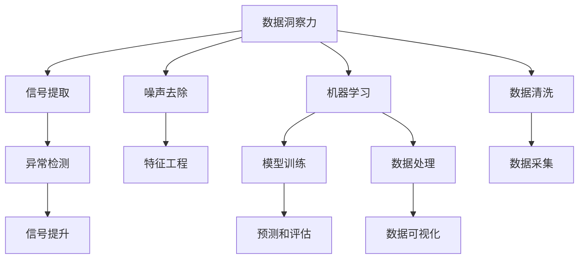

                 

# 理解洞察力的极限：在混乱中寻找信号

> 关键词：
- 数据洞察力
- 信号处理
- 复杂系统
- 机器学习
- 异常检测
- 噪声抑制
- 决策分析

## 1. 背景介绍

### 1.1 问题由来

在当今信息爆炸的时代，数据无处不在。数据不仅在科学研究、商业决策、政府管理等领域发挥着越来越重要的作用，也在个人生活和工作中成为不可或缺的一部分。然而，数据量的大幅增长和数据类型的多样性，使得传统的数据处理方法逐渐显现出其局限性。如何从海量的数据中提取有用的信息，实现高效、准确的洞察，成为数据科学家和机器学习从业者共同面临的挑战。

数据洞察力（Data Insight）指的是通过对数据进行深度分析，发现隐藏在其中的规律、趋势和模式，从而为决策提供支持的能力。然而，在数据噪声（Noise）的干扰下，真正的信号（Signal）往往被淹没在大量冗余的信息中，如何从混乱的数据中准确地“找到信号”（Finding the Signal），成为了提升数据洞察力的一个核心问题。

### 1.2 问题核心关键点

为了更深入地理解这一问题，需要明确几个核心关键点：

1. **数据噪声与信号的区分**：噪声是数据中随机或系统性的干扰，影响信号的可观测性。信号则是数据中的有用信息，代表着现象的真实变化。
2. **噪声的来源和类型**：噪声可能来源于测量误差、数据采集过程的随机性、数据收集和处理的不完备性等。
3. **信号的特征和存在形式**：信号可以是周期性的、非周期的，也可以是时变的、空间分布的。
4. **寻找信号的方法与技术**：包括统计学方法、机器学习算法、信号处理技术等，需要结合具体情况选择合适的方法。
5. **信号提取的实际应用**：包括金融风险管理、医疗诊断、工业监测、网络安全等多个领域，需要对信号提取的实际应用场景有深刻的理解。

理解这些核心关键点有助于我们全面把握数据洞察力的极限问题，从而在实际应用中有效地提取信号，提升数据分析和决策的准确性。

## 2. 核心概念与联系

### 2.1 核心概念概述

在解决数据洞察力极限问题的过程中，以下核心概念扮演着重要角色：

- **数据洞察力（Data Insight）**：通过对数据进行分析和挖掘，揭示出隐藏在其中的有用信息。
- **信号（Signal）**：数据中的有用信息，代表着现象的真实变化。
- **噪声（Noise）**：数据中的干扰和误差，可能来源于测量误差、数据采集过程的随机性、数据处理的不完备性等。
- **机器学习（Machine Learning）**：通过算法和模型，从数据中学习和提取规律，实现对数据的洞察。
- **异常检测（Anomaly Detection）**：识别数据中的异常点，帮助检测数据中的噪声和信号。
- **特征工程（Feature Engineering）**：通过对原始数据进行转换和组合，提取更有意义的信息特征。

这些概念之间的关系可以通过以下Mermaid流程图来展示：



这个流程图展示了大语言模型微调的核心概念及其之间的关系：

1. 数据洞察力通过信号提取和噪声去除，识别并提升数据中的有用信息。
2. 机器学习利用训练好的模型，对数据进行预测和评估，进一步提升信号的可观测性。
3. 异常检测帮助识别数据中的噪声和异常，优化信号提取过程。
4. 特征工程通过数据转换和组合，提高特征的质量和数量，有助于提升模型性能。
5. 数据清洗和处理是基础工作，确保数据的质量和一致性。
6. 数据可视化帮助直观理解数据和模型，为进一步分析提供支持。

## 3. 核心算法原理 & 具体操作步骤

### 3.1 算法原理概述

寻找信号的过程本质上是一个数据清洗和特征提取的过程，可以通过以下几个步骤实现：

1. **数据预处理**：包括数据清洗、缺失值处理、异常值检测等。
2. **特征提取**：通过对数据进行转换和组合，提取更有意义的信息特征。
3. **模型选择与训练**：根据数据类型和问题类型，选择合适的模型，并使用训练数据对模型进行训练。
4. **模型评估与优化**：通过评估指标，如准确率、召回率、F1-score等，评估模型性能，并进行必要的优化。
5. **信号提取与分析**：通过模型预测和分析，提取数据中的有用信息，识别信号和噪声。

### 3.2 算法步骤详解

以下是寻找信号的详细步骤：

**Step 1: 数据预处理**

1. **数据清洗**：处理缺失值、异常值、重复数据等，确保数据质量。
2. **数据转换**：将数据转换为适合模型处理的格式，如将文本数据转换为数值型特征。
3. **数据标准化**：对数据进行标准化处理，如归一化、标准化等，确保数据在相同尺度下。

**Step 2: 特征提取**

1. **特征选择**：选择对问题最有影响的特征，通过相关性分析、主成分分析（PCA）等方法。
2. **特征工程**：对原始特征进行转换和组合，生成新的特征，如将时间序列数据进行滑动窗口处理。
3. **特征降维**：通过降维技术，如PCA、LDA等，减少数据维度，提高计算效率。

**Step 3: 模型选择与训练**

1. **模型选择**：根据数据类型和问题类型，选择合适的模型，如线性回归、决策树、随机森林、神经网络等。
2. **模型训练**：使用训练数据对模型进行训练，调整模型参数，使其更好地拟合数据。
3. **模型验证**：使用验证数据集对模型进行验证，避免过拟合。

**Step 4: 模型评估与优化**

1. **评估指标**：根据具体问题选择合适的评估指标，如准确率、召回率、F1-score、ROC曲线等。
2. **模型优化**：根据评估结果，对模型进行优化，如调整参数、增加训练数据、改进特征工程等。
3. **模型测试**：使用测试数据集对优化后的模型进行测试，评估其泛化能力。

**Step 5: 信号提取与分析**

1. **信号识别**：通过模型预测，识别数据中的信号，如时间序列数据中的趋势变化。
2. **信号增强**：使用滤波、降噪等技术，增强信号的可观测性，减少噪声干扰。
3. **信号分析**：对信号进行进一步的分析，如统计分析、时间序列分析等，提取更深层次的信息。

### 3.3 算法优缺点

寻找信号的方法具有以下优点：

1. **效率高**：自动化地处理大量数据，提取有用信息，提高分析效率。
2. **精确度高**：通过模型训练和特征工程，提升数据洞察的准确性。
3. **灵活性高**：适用于多种数据类型和问题类型，具有较高的泛化能力。

同时，这些方法也存在一些局限性：

1. **数据依赖性强**：对数据的采集和处理质量要求较高，数据质量差可能影响模型性能。
2. **模型复杂度高**：复杂的模型需要更多的计算资源和时间进行训练和优化。
3. **特征工程难度大**：特征工程的复杂性和质量对模型性能有重要影响，需要一定的专业知识和经验。
4. **模型解释性差**：一些高级模型（如深度学习）的内部机制复杂，难以进行解释和理解。
5. **过度拟合风险**：复杂的模型容易过度拟合训练数据，泛化能力降低。

### 3.4 算法应用领域

寻找信号的方法在多个领域中得到了广泛应用，例如：

- **金融风险管理**：通过分析交易数据，识别异常交易和风险信号，实现风险控制和预警。
- **医疗诊断**：通过分析病人数据，识别异常指标和疾病信号，提高诊断的准确性和效率。
- **工业监测**：通过分析设备数据，识别故障信号和异常操作，预防设备故障和提高生产效率。
- **网络安全**：通过分析网络流量数据，识别异常行为和攻击信号，提高网络安全防护水平。
- **智能推荐**：通过分析用户行为数据，识别用户兴趣和偏好信号，提供个性化的推荐服务。

## 4. 数学模型和公式 & 详细讲解  
### 4.1 数学模型构建

寻找信号的数学模型构建可以分为以下几个步骤：

1. **信号模型定义**：假设信号 $S(t)$ 为时间序列，模型为 $S(t) = f(t) + N(t)$，其中 $f(t)$ 为信号部分，$N(t)$ 为噪声部分。
2. **模型假设**：假设噪声 $N(t)$ 满足正态分布，即 $N(t) \sim \mathcal{N}(0, \sigma^2)$。
3. **信号估计**：通过最小二乘法、贝叶斯方法等，估计信号 $S(t)$ 的值。

### 4.2 公式推导过程

以线性回归模型为例，推导信号估计的公式：

设 $S(t) = \beta_0 + \beta_1 t + \epsilon_t$，其中 $\epsilon_t \sim \mathcal{N}(0, \sigma^2)$。

最小二乘法的目标是最小化误差平方和：

$$
\sum_{t=1}^n (y_t - S(t))^2
$$

其中 $y_t$ 为观测数据。

将信号模型带入误差平方和中，得：

$$
\sum_{t=1}^n (y_t - \beta_0 - \beta_1 t)^2
$$

通过求导并令导数为0，得到参数估计公式：

$$
\beta_0 = \frac{\sum_{t=1}^n y_t - \beta_1 \sum_{t=1}^n t}{n}, \quad \beta_1 = \frac{\sum_{t=1}^n t y_t - \frac{1}{n} \sum_{t=1}^n t^2}{\sum_{t=1}^n t^2}
$$

### 4.3 案例分析与讲解

**案例1：股票价格预测**

假设有一组历史股票价格数据，需要预测未来价格走势。可以使用时间序列分析模型进行信号提取，如ARIMA、VAR等。

1. **数据预处理**：清洗缺失值、异常值，进行差分处理。
2. **特征提取**：提取价格变化率、市场波动等特征。
3. **模型训练**：使用历史数据训练模型，选择ARIMA模型。
4. **模型验证**：使用验证数据集评估模型性能，调整参数。
5. **信号提取**：使用训练好的模型预测未来价格走势，提取信号。
6. **信号分析**：分析预测结果，评估其准确性和可靠性。

**案例2：医疗病人诊断**

假设有一组病人的体检数据，需要诊断病人是否患有某种疾病。可以使用逻辑回归、决策树等分类模型进行信号提取。

1. **数据预处理**：清洗缺失值、异常值，进行数据标准化。
2. **特征提取**：提取病人体征、实验室检测结果等特征。
3. **模型训练**：使用历史数据训练模型，选择逻辑回归模型。
4. **模型验证**：使用验证数据集评估模型性能，调整参数。
5. **信号提取**：使用训练好的模型预测病人是否患病，提取信号。
6. **信号分析**：分析预测结果，评估其准确性和可靠性。

## 5. 项目实践：代码实例和详细解释说明
### 5.1 开发环境搭建

在进行信号提取实践前，我们需要准备好开发环境。以下是使用Python进行Pandas、Scikit-learn、TensorFlow等库的开发环境配置流程：

1. 安装Anaconda：从官网下载并安装Anaconda，用于创建独立的Python环境。

2. 创建并激活虚拟环境：
```bash
conda create -n signal-env python=3.8 
conda activate signal-env
```

3. 安装必要的库：
```bash
conda install pandas scikit-learn numpy matplotlib tensorflow
```

4. 安装TensorBoard：
```bash
pip install tensorboard
```

5. 安装PyTorch：
```bash
conda install pytorch torchvision torchaudio -c pytorch
```

完成上述步骤后，即可在`signal-env`环境中开始信号提取实践。

### 5.2 源代码详细实现

这里我们以时间序列分析为例，给出使用Pandas和Scikit-learn进行信号提取的Python代码实现。

首先，定义数据处理函数：

```python
import pandas as pd
from sklearn.model_selection import train_test_split
from sklearn.metrics import mean_squared_error
from sklearn.linear_model import LinearRegression

def load_data(file_path):
    data = pd.read_csv(file_path)
    return data

def preprocess_data(data, scale=False):
    # 处理缺失值
    data.dropna(inplace=True)
    
    # 数据标准化
    if scale:
        data = (data - data.mean()) / data.std()
    
    # 数据拆分
    X = data.drop(['Price'], axis=1)
    y = data['Price']
    X_train, X_test, y_train, y_test = train_test_split(X, y, test_size=0.2, random_state=42)
    
    return X_train, X_test, y_train, y_test
```

然后，定义模型训练函数：

```python
from sklearn.linear_model import LinearRegression
from sklearn.metrics import mean_squared_error

def train_model(X_train, y_train):
    model = LinearRegression()
    model.fit(X_train, y_train)
    y_pred = model.predict(X_train)
    
    return model, y_pred
```

接着，定义模型评估函数：

```python
def evaluate_model(model, X_test, y_test):
    y_pred = model.predict(X_test)
    mse = mean_squared_error(y_test, y_pred)
    rmse = np.sqrt(mse)
    
    return mse, rmse
```

最后，启动训练流程：

```python
file_path = 'data.csv'
data = load_data(file_path)
X_train, X_test, y_train, y_test = preprocess_data(data)
model, y_pred = train_model(X_train, y_train)
mse, rmse = evaluate_model(model, X_test, y_test)
print(f'Mean Squared Error: {mse:.3f}, Root Mean Squared Error: {rmse:.3f}')
```

以上就是使用Python进行时间序列信号提取的完整代码实现。可以看到，通过Pandas和Scikit-learn，我们可以快速实现数据预处理、模型训练和评估等关键步骤。

### 5.3 代码解读与分析

让我们再详细解读一下关键代码的实现细节：

**load_data函数**：
- 从指定路径加载CSV文件，返回Pandas DataFrame对象。

**preprocess_data函数**：
- 处理缺失值：使用`dropna`方法去除缺失值。
- 数据标准化：使用`mean`和`std`方法计算均值和标准差，进行数据标准化。
- 数据拆分：使用`train_test_split`方法将数据拆分为训练集和测试集。

**train_model函数**：
- 初始化线性回归模型。
- 使用训练集数据训练模型。
- 预测训练集数据。

**evaluate_model函数**：
- 使用测试集数据评估模型性能。
- 计算均方误差和均方根误差。

**启动训练流程**：
- 加载数据。
- 数据预处理。
- 模型训练和评估。
- 输出评估结果。

## 6. 实际应用场景

### 6.1 金融风险管理

在金融风险管理中，分析师需要实时监控市场数据，识别异常交易和风险信号，实现风险控制和预警。通过时间序列分析等方法，可以提取市场趋势、波动率等信号，实时预警市场风险。

### 6.2 医疗诊断

在医疗诊断中，医生需要分析病人的病历和体检数据，识别异常指标和疾病信号，提高诊断的准确性和效率。通过逻辑回归、决策树等分类模型，可以提取病人体征、实验室检测结果等特征，帮助医生进行诊断。

### 6.3 工业监测

在工业监测中，工程师需要分析设备数据，识别故障信号和异常操作，预防设备故障和提高生产效率。通过时序分析、异常检测等方法，可以提取设备运行状态、故障指标等信号，及时发现和解决设备问题。

### 6.4 网络安全

在网络安全中，安全分析师需要分析网络流量数据，识别异常行为和攻击信号，提高网络安全防护水平。通过异常检测、行为分析等方法，可以提取网络流量、用户行为等特征，实时监控网络安全状况。

### 6.5 智能推荐

在智能推荐中，推荐系统需要分析用户行为数据，识别用户兴趣和偏好信号，提供个性化的推荐服务。通过协同过滤、内容推荐等方法，可以提取用户历史行为、兴趣标签等信号，实现精准推荐。

## 7. 工具和资源推荐
### 7.1 学习资源推荐

为了帮助开发者系统掌握信号提取的理论基础和实践技巧，这里推荐一些优质的学习资源：

1. 《深度学习》（Deep Learning）一书：由Ian Goodfellow等人撰写，全面介绍了深度学习的基础理论和实际应用。
2. 《信号处理基础》（Fundamentals of Signal Processing）一书：由Richard G. Lyons撰写，系统讲解了信号处理的基本概念和算法。
3. 《Python数据科学手册》（Python Data Science Handbook）一书：由Jake VanderPlas撰写，介绍了Python在数据科学中的应用，包括Pandas、NumPy等库的使用。
4. Coursera的《机器学习》课程：由Andrew Ng教授主讲，是机器学习领域最受欢迎的在线课程之一。
5. Kaggle：一个数据科学竞赛平台，提供了大量的数据集和挑战，可以帮助开发者练习信号提取和数据分析技能。

通过对这些资源的学习实践，相信你一定能够快速掌握信号提取的精髓，并用于解决实际的信号处理问题。

### 7.2 开发工具推荐

高效的开发离不开优秀的工具支持。以下是几款用于信号提取开发的常用工具：

1. Jupyter Notebook：一个交互式的开发环境，支持Python、R等语言，适合数据科学和机器学习项目。
2. TensorFlow：由Google主导开发的深度学习框架，生产部署方便，适合大规模工程应用。
3. PyTorch：由Facebook主导的深度学习框架，灵活易用，适合研究和实验。
4. Matplotlib：一个数据可视化库，支持各种图表类型，适合数据可视化需求。
5. Seaborn：一个基于Matplotlib的数据可视化库，支持更高级的统计图表和数据可视化。

合理利用这些工具，可以显著提升信号提取任务的开发效率，加快创新迭代的步伐。

### 7.3 相关论文推荐

信号提取的研究源于学界的持续研究。以下是几篇奠基性的相关论文，推荐阅读：

1. "The Elements of Statistical Learning"（统计学习基础）：由Tibshirani等人撰写，介绍了统计学习的理论和算法。
2. "Pattern Recognition and Machine Learning"（模式识别与机器学习）：由Christopher M. Bishop撰写，系统讲解了模式识别和机器学习的基本概念和算法。
3. "An Introduction to Statistical Learning"（统计学习入门）：由Gareth James等人撰写，介绍了统计学习的理论和实际应用。
4. "Signal Processing for Communications"（通信中的信号处理）：由David T. P. Lee撰写，介绍了信号处理在通信中的应用。
5. "Digital Signal Processing"（数字信号处理）：由Harris和Stevenson撰写，系统讲解了数字信号处理的基本概念和算法。

这些论文代表了大语言模型微调技术的发展脉络。通过学习这些前沿成果，可以帮助研究者把握学科前进方向，激发更多的创新灵感。

## 8. 总结：未来发展趋势与挑战

### 8.1 总结

本文对寻找信号的方法进行了全面系统的介绍。首先阐述了数据洞察力极限问题的重要性和研究背景，明确了信号提取在数据分析中的核心地位。其次，从原理到实践，详细讲解了信号提取的数学原理和关键步骤，给出了信号提取任务开发的完整代码实例。同时，本文还广泛探讨了信号提取方法在金融、医疗、工业等多个领域的应用前景，展示了信号提取范式的巨大潜力。此外，本文精选了信号提取技术的各类学习资源，力求为读者提供全方位的技术指引。

通过本文的系统梳理，可以看到，信号提取方法正在成为数据科学的重要范式，极大地拓展了数据分析和决策的准确性。伴随信号提取方法的不断发展，相信数据分析技术必将迎来新的突破，进一步提升数据洞察力和决策支持能力。

### 8.2 未来发展趋势

展望未来，信号提取技术将呈现以下几个发展趋势：

1. **数据源多样化**：随着物联网、传感器等技术的发展，数据来源将更加多样化，信号提取方法需要适应各种类型的数据。
2. **模型复杂度提升**：随着深度学习等先进技术的应用，模型复杂度将不断提升，信号提取能力将进一步增强。
3. **特征工程自动化**：通过自动化特征工程工具，如AutoML、特征降维等技术，提升特征提取的效率和质量。
4. **实时性需求增强**：在金融、医疗等高实时性应用中，信号提取需要具备实时处理和快速响应能力。
5. **模型可解释性提升**：为满足工业界的需求，信号提取模型需要具备更好的可解释性和可控性。

这些趋势凸显了信号提取技术的广阔前景。这些方向的探索发展，必将进一步提升数据科学的应用价值，为各行业提供更精准、更高效的决策支持。

### 8.3 面临的挑战

尽管信号提取技术已经取得了显著进展，但在迈向更加智能化、普适化应用的过程中，仍面临诸多挑战：

1. **数据质量问题**：数据采集和处理过程中，数据质量可能受到多种因素影响，如设备误差、环境干扰等，影响信号提取的准确性。
2. **模型泛化能力**：复杂模型可能存在过拟合问题，泛化能力不足，无法适应新的数据分布。
3. **计算资源限制**：信号提取过程可能涉及大量计算资源，如GPU、TPU等高性能设备，成本较高。
4. **数据隐私与安全**：数据隐私和安全问题，如数据泄露、数据篡改等，需要严格的保护措施。

### 8.4 研究展望

面对信号提取面临的挑战，未来的研究需要在以下几个方面寻求新的突破：

1. **自适应信号处理**：开发自适应信号处理算法，自动调整模型参数，适应不同数据分布。
2. **鲁棒信号提取**：引入鲁棒性技术，如噪声抑制、异常检测等，提高信号提取的鲁棒性。
3. **联邦学习**：利用联邦学习技术，分布式训练信号提取模型，降低数据隐私风险。
4. **深度学习与强化学习结合**：结合深度学习与强化学习技术，优化信号提取过程，提升决策效率和效果。
5. **自动化信号处理**：开发自动化特征工程和模型优化工具，提升信号提取的自动化水平。

这些研究方向的探索，必将引领信号提取技术迈向更高的台阶，为各行业提供更精准、更高效的信号提取服务。面向未来，信号提取技术还需要与其他人工智能技术进行更深入的融合，如知识表示、因果推理、强化学习等，多路径协同发力，共同推动智能系统的进步。只有勇于创新、敢于突破，才能不断拓展信号提取技术的边界，让智能技术更好地造福人类社会。

## 9. 附录：常见问题与解答

**Q1：信号提取和特征工程有什么区别？**

A: 信号提取和特征工程都是数据分析中的重要步骤，但它们的目的和方法有所不同。信号提取的目的是从原始数据中提取有用的信号，如趋势、波动等，帮助识别数据中的规律和变化。特征工程则是通过数据转换和组合，生成新的特征，提高模型的表现力。信号提取更偏向于数据的降维和去噪，特征工程更偏向于数据的增强和提升。

**Q2：信号提取中常用的方法有哪些？**

A: 信号提取中常用的方法包括时间序列分析、频谱分析、小波分析、降噪技术等。这些方法可以从不同角度提取数据中的信号，适用于不同类型的数据和问题。

**Q3：信号提取中的数据噪声和信号如何区分？**

A: 信号和噪声的区别可以从数据分布和统计特性上进行区分。通常情况下，信号数据呈现出一定的规律和趋势，噪声数据则表现为随机或系统性的干扰。例如，在时间序列数据中，信号通常表现为周期性的变化，而噪声则表现为随机性的波动。

**Q4：信号提取中常用的评估指标有哪些？**

A: 信号提取中常用的评估指标包括均方误差（MSE）、均方根误差（RMSE）、平均绝对误差（MAE）、决定系数（R^2）等。这些指标可以评估模型预测结果与真实信号之间的差异，帮助评估模型的性能。

**Q5：信号提取中的模型选择与训练有哪些要点？**

A: 信号提取中的模型选择与训练需要考虑以下几个要点：
1. 数据类型和问题类型：选择合适的模型类型，如线性回归、决策树、神经网络等。
2. 数据质量和分布：确保数据质量和分布合理，避免过拟合和欠拟合。
3. 模型参数调整：通过交叉验证等方法调整模型参数，优化模型性能。
4. 模型评估与优化：使用评估指标评估模型性能，进行必要的优化调整。

---

作者：禅与计算机程序设计艺术 / Zen and the Art of Computer Programming

