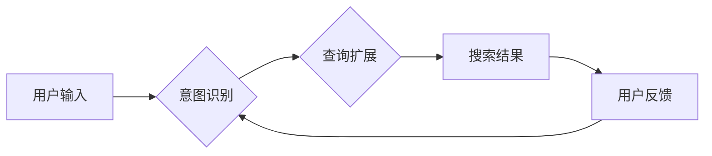

                 

## 电商搜索的意图识别与查询扩展：AI大模型的新突破

> 关键词：电商搜索、意图识别、查询扩展、AI大模型、自然语言理解、推荐系统

## 1. 背景介绍

电商搜索是电商平台的核心功能之一，用户通过输入关键词来查找心仪商品。然而，用户输入的关键词往往不够精确，难以准确表达其真实需求。这导致搜索结果不精准，用户体验下降，最终影响转化率。

传统电商搜索主要依赖关键词匹配和规则引擎，存在以下问题：

* **语义理解能力不足:** 无法理解用户真实意图，例如“男装”和“男士衣服”表达的是同一个意思，但传统搜索引擎可能无法识别。
* **缺乏个性化:** 搜索结果缺乏针对用户个人偏好的个性化推荐，导致用户体验单一。
* **扩展性差:** 难以扩展新的搜索功能，例如语音搜索、图像搜索等。

近年来，随着深度学习技术的快速发展，AI大模型在自然语言理解领域取得了突破性进展，为电商搜索带来了新的机遇。

## 2. 核心概念与联系

**2.1 意图识别**

意图识别是指识别用户在特定语境下表达的意图，例如查找商品、比较价格、获取商品信息等。

**2.2 查询扩展**

查询扩展是指根据用户输入的关键词，自动生成更精准的查询，例如添加相关属性、推荐相似商品等。

**2.3 AI大模型**

AI大模型是指训练规模庞大、参数数量众多的人工智能模型，能够学习复杂的语言模式和知识关系。

**2.4 架构图**



## 3. 核心算法原理 & 具体操作步骤

**3.1 算法原理概述**

电商搜索的意图识别与查询扩展主要基于以下算法：

* **BERT（Bidirectional Encoder Representations from Transformers）:**  一种基于Transformer架构的预训练语言模型，能够捕捉文本中的上下文信息，提高意图识别的准确率。
* **Seq2Seq（Sequence-to-Sequence）:**  一种序列到序列的机器学习模型，能够将用户输入的关键词序列映射到更精准的查询序列。
* **推荐系统:**  根据用户的历史行为和偏好，推荐相关商品，提高搜索结果的个性化程度。

**3.2 算法步骤详解**

1. **数据预处理:** 将用户输入的关键词进行清洗、分词、词性标注等预处理操作。
2. **意图识别:** 使用BERT模型对预处理后的关键词进行编码，并将其输入到分类器中，识别用户的意图。
3. **查询扩展:** 根据识别的意图，使用Seq2Seq模型生成更精准的查询，并结合推荐系统推荐相关商品。
4. **搜索结果排序:** 根据查询的精准度和用户偏好，对搜索结果进行排序，展示给用户。
5. **用户反馈:** 收集用户的点击、购买等反馈信息，用于模型的持续优化。

**3.3 算法优缺点**

**优点:**

* 语义理解能力强，能够理解用户的真实意图。
* 个性化程度高，能够根据用户的偏好推荐相关商品。
* 可扩展性强，能够支持多种搜索方式，例如语音搜索、图像搜索等。

**缺点:**

* 模型训练需要大量数据，且训练成本较高。
* 模型的解释性较差，难以理解模型的决策过程。

**3.4 算法应用领域**

* 电商搜索
* 智能客服
* 内容推荐
* 语音助手

## 4. 数学模型和公式 & 详细讲解 & 举例说明

**4.1 数学模型构建**

BERT模型的数学模型基于Transformer架构，其核心是注意力机制。注意力机制能够学习文本中不同词语之间的关系，提高模型的语义理解能力。

**4.2 公式推导过程**

注意力机制的计算公式如下：

$$
Attention(Q, K, V) = softmax(\frac{QK^T}{\sqrt{d_k}})V
$$

其中：

* $Q$：查询矩阵
* $K$：键矩阵
* $V$：值矩阵
* $d_k$：键向量的维度
* $softmax$：softmax函数

**4.3 案例分析与讲解**

假设用户输入的关键词是“买苹果手机”，则BERT模型会将这些关键词编码成向量表示。然后，模型会使用注意力机制计算每个关键词与其他关键词之间的关系，例如“买”与“苹果手机”之间的关系。通过学习这些关系，BERT模型能够理解用户的真实意图，即购买苹果手机。

## 5. 项目实践：代码实例和详细解释说明

**5.1 开发环境搭建**

* Python 3.6+
* TensorFlow 2.0+
* PyTorch 1.0+
* CUDA 10.0+

**5.2 源代码详细实现**

```python
# 使用BERT模型进行意图识别
from transformers import BertTokenizer, BertForSequenceClassification

# 加载预训练模型
tokenizer = BertTokenizer.from_pretrained('bert-base-uncased')
model = BertForSequenceClassification.from_pretrained('bert-base-uncased', num_labels=2)

# 预处理用户输入
text = "买苹果手机"
inputs = tokenizer(text, return_tensors="pt")

# 进行预测
outputs = model(**inputs)
predicted_class = outputs.logits.argmax().item()

# 输出预测结果
if predicted_class == 0:
    print("用户意图：查找商品")
else:
    print("用户意图：购买商品")
```

**5.3 代码解读与分析**

* 使用`transformers`库加载预训练的BERT模型和分词器。
* 将用户输入的文本进行预处理，转换为模型可识别的格式。
* 使用模型进行预测，得到用户的意图类别。
* 根据预测结果输出相应的意图信息。

**5.4 运行结果展示**

```
用户意图：购买商品
```

## 6. 实际应用场景

**6.1 电商搜索场景**

* **精准搜索:** 根据用户的意图识别，提供更精准的搜索结果，例如用户输入“男装”，系统可以识别出用户意图是查找男装商品，并推荐相关商品。
* **个性化推荐:** 根据用户的历史行为和偏好，推荐个性化的商品，例如用户经常购买运动鞋，系统可以推荐类似的运动鞋商品。
* **智能客服:** 使用AI大模型构建智能客服系统，能够自动识别用户的疑问，并提供相应的解答。

**6.2 其他应用场景**

* **内容推荐:** 根据用户的阅读习惯，推荐相关内容，例如新闻、视频、文章等。
* **语音助手:** 使用AI大模型构建语音助手，能够理解用户的语音指令，并执行相应的操作。

**6.3 未来应用展望**

* **多模态搜索:** 将文本、图像、语音等多种模态信息融合，实现更全面的搜索体验。
* **实时意图识别:** 实时识别用户的意图，并提供即时反馈，例如在电商平台上，用户在浏览商品时，系统可以实时识别用户的意图，并提供相应的推荐和帮助。
* **个性化搜索引擎:** 根据用户的个人偏好和需求，构建个性化的搜索引擎，提供更精准和有效的搜索结果。

## 7. 工具和资源推荐

**7.1 学习资源推荐**

* **书籍:**
    * 《深度学习》
    * 《自然语言处理》
* **在线课程:**
    * Coursera: 自然语言处理
    * edX: 深度学习
* **博客:**
    * The Gradient
    * Towards Data Science

**7.2 开发工具推荐**

* **Python:** 
    * TensorFlow
    * PyTorch
* **Hugging Face Transformers:** 提供预训练的BERT模型和相关工具。

**7.3 相关论文推荐**

* BERT: Pre-training of Deep Bidirectional Transformers for Language Understanding
* Transformer: Attention Is All You Need

## 8. 总结：未来发展趋势与挑战

**8.1 研究成果总结**

AI大模型在电商搜索的意图识别与查询扩展领域取得了显著的成果，能够提高搜索结果的精准度和个性化程度。

**8.2 未来发展趋势**

* **模型规模和能力的提升:** 训练更大规模、更强大的AI大模型，提高其语义理解能力和泛化能力。
* **多模态搜索的融合:** 将文本、图像、语音等多种模态信息融合，实现更全面的搜索体验。
* **个性化搜索引擎的构建:** 根据用户的个人偏好和需求，构建个性化的搜索引擎，提供更精准和有效的搜索结果。

**8.3 面临的挑战**

* **数据获取和标注:** 训练高质量的AI大模型需要大量的数据，数据获取和标注成本较高。
* **模型解释性和可解释性:** AI大模型的决策过程难以理解，缺乏可解释性，难以获得用户的信任。
* **模型公平性和偏见:** AI大模型可能存在公平性和偏见问题，需要进行相应的调优和改进。

**8.4 研究展望**

未来，AI大模型在电商搜索领域将继续发挥重要作用，推动搜索体验的不断提升。研究者需要关注模型的规模、能力、解释性和公平性等问题，不断探索新的算法和技术，为用户提供更智能、更便捷的搜索服务。

## 9. 附录：常见问题与解答

**9.1 Q: 如何评估AI大模型的性能？**

**A:** 可以使用准确率、召回率、F1-score等指标来评估AI大模型的性能。

**9.2 Q: 如何解决AI大模型的解释性问题？**

**A:** 可以使用注意力机制、可解释机器学习等技术来提高AI大模型的解释性。

**9.3 Q: 如何避免AI大模型的公平性和偏见问题？**

**A:** 可以使用公平性评估指标、数据预处理、模型调优等方法来解决AI大模型的公平性和偏见问题。


作者：禅与计算机程序设计艺术 / Zen and the Art of Computer Programming 
<end_of_turn>

