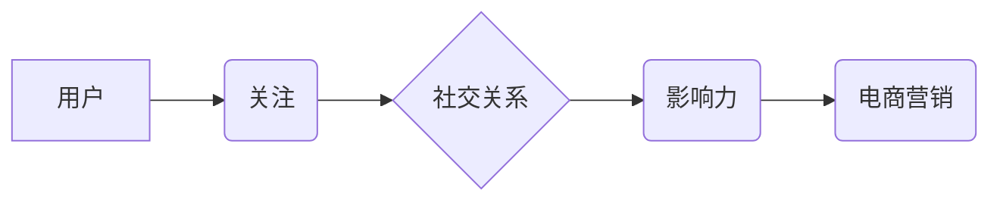

                 

## 电商营销中的用户社交网络挖掘与影响力分析

> 关键词：社交网络挖掘、影响力分析、电商营销、用户画像、推荐系统、数据分析

## 1. 背景介绍

在当今数字经济时代，社交网络已成为人们获取信息、交流互动和消费决策的重要平台。电商平台也逐渐认识到社交网络的巨大价值，开始将社交网络挖掘与影响力分析融入到营销策略中。通过分析用户之间的社交关系和影响力，电商平台可以更精准地定位目标用户、打造个性化营销方案、提升用户粘性和转化率。

传统的电商营销模式往往依赖于用户行为数据和广告投放，缺乏针对性的用户细分和个性化推荐。而社交网络挖掘与影响力分析则可以提供更丰富的用户画像和行为洞察，为电商营销提供更精准的决策依据。

## 2. 核心概念与联系

### 2.1 社交网络

社交网络是指由一个个节点（用户）和连接这些节点的边（关系）组成的网络结构。在电商平台，用户可以通过关注、点赞、评论、分享等行为建立社交关系。

### 2.2 用户影响力

用户影响力是指用户在社交网络中对其他用户的意见和行为产生影响的能力。高影响力用户通常拥有较多的粉丝、互动量和传播力，他们的观点和推荐更容易被其他用户接受。

### 2.3 电商营销

电商营销是指利用互联网平台进行商品销售和推广的营销活动。社交网络挖掘与影响力分析可以帮助电商平台实现以下营销目标：

* **精准用户定位:** 通过分析用户社交关系和兴趣爱好，精准定位目标用户群体。
* **个性化营销:** 根据用户画像和行为特征，定制个性化营销方案，提高用户转化率。
* **口碑营销:** 挖掘和培育高影响力用户，通过用户口碑传播，提升品牌知名度和用户信任度。
* **内容营销:** 利用社交网络平台发布优质内容，吸引用户关注和互动，增强品牌影响力。

**核心概念与联系流程图:**



## 3. 核心算法原理 & 具体操作步骤

### 3.1 算法原理概述

社交网络挖掘与影响力分析主要依赖于图论和机器学习算法。

* **图论:** 将用户和他们的社交关系表示为图结构，通过分析图结构的特征，挖掘用户之间的关系和影响力。
* **机器学习:** 利用用户行为数据训练机器学习模型，预测用户的影响力、兴趣爱好和购买行为。

常见的算法包括：

* **PageRank算法:** 用于计算用户在社交网络中的影响力，类似于搜索引擎的排名算法。
* **K-Core算法:** 用于识别核心用户，即拥有大量连接的用户。
* **Centrality算法:** 用于计算用户在社交网络中的中心度，例如度中心度、介数中心度等。
* **推荐算法:** 用于根据用户兴趣和社交关系推荐商品和内容。

### 3.2 算法步骤详解

1. **数据收集:** 收集用户社交关系数据，例如关注关系、点赞关系、评论关系等。
2. **数据预处理:** 清洗和处理数据，例如去除无效数据、标准化数据格式等。
3. **图结构构建:** 将用户和他们的社交关系表示为图结构。
4. **算法计算:** 使用PageRank、K-Core、Centrality等算法计算用户的影响力、核心度等特征。
5. **用户画像构建:** 根据用户影响力、兴趣爱好、购买行为等特征构建用户画像。
6. **营销策略制定:** 根据用户画像和分析结果制定个性化营销策略。

### 3.3 算法优缺点

**优点:**

* 可以精准定位目标用户群体。
* 可以根据用户画像和行为特征，定制个性化营销方案。
* 可以利用用户口碑传播，提升品牌知名度和用户信任度。

**缺点:**

* 数据收集和处理成本较高。
* 算法模型需要不断更新和优化。
* 算法结果可能存在一定的偏差和误差。

### 3.4 算法应用领域

社交网络挖掘与影响力分析在电商营销、品牌推广、用户运营等领域都有广泛的应用。

* **电商平台:** 精准用户定位、个性化推荐、口碑营销、内容营销。
* **品牌推广:** 寻找品牌代言人、影响力营销、用户口碑传播。
* **用户运营:** 用户画像分析、用户行为分析、用户分群管理。

## 4. 数学模型和公式 & 详细讲解 & 举例说明

### 4.1 数学模型构建

**PageRank算法:**

PageRank算法将社交网络视为一个有向图，其中每个节点代表一个用户，每个边代表一个用户之间的关注关系。PageRank值代表用户在社交网络中的影响力，计算公式如下：

$$PR(u) = (1-d) + d \sum_{v \in M(u)} \frac{PR(v)}{C(v)}$$

其中：

* $PR(u)$: 用户 $u$ 的 PageRank值。
* $d$: 阻尼因子，通常取值为0.85。
* $M(u)$: 用户 $u$ 的所有出度链接。
* $PR(v)$: 用户 $v$ 的 PageRank值。
* $C(v)$: 用户 $v$ 的入度链接数。

**解释:**

PageRank值等于一个常数 $(1-d)$ 和一个关于用户 $u$ 邻居节点 PageRank值的加权平均值。

**举例说明:**

假设有两个用户 A 和 B，A 关注 B，B 关注 C。则 A 的 PageRank值计算公式如下：

$$PR(A) = (1-0.85) + 0.85 \times \frac{PR(B)}{C(B)}$$

### 4.2 公式推导过程

PageRank算法的推导过程基于概率论和马尔科夫链的思想。

假设用户在社交网络中随机游走，每个用户都有一个固定的停留时间。PageRank值可以看作是用户在网络中被随机访问的概率。

通过迭代计算，可以得到每个用户的 PageRank值，从而反映出用户在社交网络中的影响力。

### 4.3 案例分析与讲解

**案例:**

假设一个电商平台有三个用户 A、B、C，A 关注 B 和 C，B 关注 A 和 C，C 关注 A。

**分析:**

根据 PageRank算法，我们可以计算出每个用户的 PageRank值。由于 A 拥有两个出度链接，而 B 和 C 只有一个出度链接，因此 A 的 PageRank值会相对较高。

**讲解:**

这个案例说明了 PageRank算法可以有效地识别出社交网络中的核心用户。

## 5. 项目实践：代码实例和详细解释说明

### 5.1 开发环境搭建

* **操作系统:** Linux/macOS/Windows
* **编程语言:** Python
* **库依赖:** NetworkX, Scikit-learn

### 5.2 源代码详细实现

```python
import networkx as nx
from sklearn.metrics.pairwise import cosine_similarity

# 数据加载
data = {
    'user_id': ['A', 'B', 'C', 'D', 'E'],
    'followers': [['B', 'C'], ['A', 'C'], ['A', 'B'], ['A'], ['B']]
}

# 图结构构建
graph = nx.from_dict_of_lists(data)

# PageRank算法计算
pagerank_scores = nx.pagerank(graph)

# 用户相似度计算
user_vectors = nx.node_vector(graph, 'followers')
similarity_matrix = cosine_similarity(user_vectors)

# 结果展示
print("PageRank scores:", pagerank_scores)
print("Similarity matrix:", similarity_matrix)
```

### 5.3 代码解读与分析

* **数据加载:** 将用户社交关系数据加载到字典中。
* **图结构构建:** 使用 NetworkX 库将数据转换为图结构。
* **PageRank算法计算:** 使用 NetworkX 库的 pagerank 函数计算每个用户的 PageRank值。
* **用户相似度计算:** 使用 NetworkX 库的 node_vector 函数计算每个用户的向量表示，然后使用 cosine_similarity 函数计算用户之间的相似度。
* **结果展示:** 打印 PageRank值和用户相似度矩阵。

### 5.4 运行结果展示

运行代码后，会输出每个用户的 PageRank值和用户之间的相似度矩阵。

## 6. 实际应用场景

### 6.1 电商平台用户画像

电商平台可以利用社交网络挖掘与影响力分析技术，构建用户画像，了解用户的兴趣爱好、消费习惯、社交行为等特征。

### 6.2 个性化商品推荐

根据用户画像和社交关系，电商平台可以推荐个性化商品，提高用户转化率。

### 6.3 精准营销活动

电商平台可以根据用户画像和影响力分析结果，精准定位目标用户群体，进行精准营销活动。

### 6.4 影响力营销

电商平台可以寻找高影响力用户，与他们合作进行影响力营销，提升品牌知名度和用户信任度。

### 6.5 未来应用展望

随着社交网络的不断发展，社交网络挖掘与影响力分析技术将发挥越来越重要的作用。未来，电商平台可以利用这些技术进行更精准的营销，提供更个性化的服务，提升用户体验。

## 7. 工具和资源推荐

### 7.1 学习资源推荐

* **书籍:**

    * 《社交网络分析》
    * 《数据挖掘与机器学习》

* **在线课程:**

    * Coursera: Social Network Analysis
    * edX: Data Mining and Machine Learning

### 7.2 开发工具推荐

* **NetworkX:** Python 图论库
* **Scikit-learn:** Python 机器学习库
* **Gephi:** 社交网络可视化工具

### 7.3 相关论文推荐

* **PageRank:** Brin, S., & Page, L. (1998). The anatomy of a large-scale hypertextual web search engine. Computer Networks and ISDN Systems, 30(1-7), 107-117.
* **K-Core:** Seidman, S. (2006). Social network analysis: Methods and applications. Cambridge university press.

## 8. 总结：未来发展趋势与挑战

### 8.1 研究成果总结

社交网络挖掘与影响力分析技术在电商营销领域取得了显著的成果，帮助电商平台精准定位目标用户、个性化推荐商品、提升用户转化率等。

### 8.2 未来发展趋势

* **深度学习:** 利用深度学习算法挖掘更深层次的用户特征和关系。
* **跨平台分析:** 将不同社交平台的数据整合分析，构建更全面的用户画像。
* **动态分析:** 分析用户社交关系和行为的动态变化，提供更实时、更精准的营销建议。

### 8.3 面临的挑战

* **数据隐私:** 如何保护用户隐私数据，同时进行有效的分析。
* **算法可解释性:** 如何提高算法的透明度和可解释性，增强用户信任。
* **算法公平性:** 如何避免算法产生偏见，确保公平公正的营销结果。

### 8.4 研究展望

未来，社交网络挖掘与影响力分析技术将继续发展，为电商营销提供更智能、更精准、更个性化的解决方案。


## 9. 附录：常见问题与解答

**Q1: 如何选择合适的算法？**

**A1:** 选择算法需要根据具体的需求和数据特点。例如，如果需要识别核心用户，可以选择 K-Core 算法；如果需要计算用户影响力，可以选择 PageRank 算法。

**Q2: 如何处理社交网络中的噪声数据？**

**A2:** 可以使用数据清洗和预处理技术，例如去除无效链接、标准化数据格式等，减少噪声数据的影响。

**Q3: 如何评估算法的性能？**

**A3:** 可以使用多种指标评估算法的性能，例如准确率、召回率、F1-score 等。

**Q4: 如何保证算法的公平性？**

**A4:** 可以采用多种方法保证算法的公平性，例如使用公平性损失函数、进行数据平衡等。

**Q5: 如何保护用户隐私数据？**

**A5:** 可以采用数据匿名化、差分隐私等技术保护用户隐私数据。


作者：禅与计算机程序设计艺术 / Zen and the Art of Computer Programming 
<end_of_turn>

