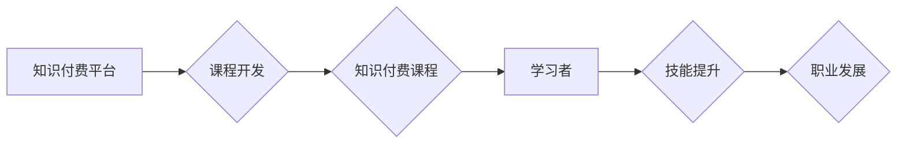

                 

## 知识付费与职业教育相结合的能力培养模式

> 关键词：知识付费、职业教育、能力培养、在线学习、技能匹配、人才培养、未来趋势

### 1. 背景介绍

在当今瞬息万变的科技时代，传统的教育模式面临着越来越多的挑战。一方面，科技发展日新月异，新兴技术不断涌现，传统的教育体系难以跟上步伐，导致人才培养与市场需求脱节。另一方面，社会对人才的技能要求越来越高，单纯的知识传授已经无法满足实际需求，更需要注重实践能力和解决实际问题的能力培养。

知识付费和职业教育的兴起，为打破传统教育模式的瓶颈提供了新的思路。知识付费是指通过付费的方式获取知识和技能，而职业教育则侧重于培养特定职业所需的技能和知识。将这两者相结合，可以构建一种更加灵活、高效、实用的人才培养模式。

### 2. 核心概念与联系

**2.1 知识付费**

知识付费是指个人或机构通过付费的方式获取知识、技能、经验等信息资源。它打破了传统教育的壁垒，让知识更加易于获取，也为知识创作者提供了新的盈利模式。

**2.2 职业教育**

职业教育是指以培养特定职业所需的技能和知识为目标的教育形式。它注重实践操作，强调技能应用，能够帮助学生更快地进入职场并胜任工作。

**2.3 结合模式**

将知识付费与职业教育相结合，可以构建一种更加灵活、高效、实用的人才培养模式。

* **灵活:**  学习者可以根据自己的时间安排和学习需求选择不同的课程和学习方式。
* **高效:**  课程内容更加聚焦，注重实践应用，能够帮助学习者更快地掌握技能。
* **实用:**  课程内容与市场需求紧密结合，能够帮助学习者获得更具竞争力的技能。

**2.4 架构图**



### 3. 核心算法原理 & 具体操作步骤

**3.1 算法原理概述**

知识付费与职业教育相结合的能力培养模式的核心算法原理是基于数据驱动的个性化学习推荐和技能匹配。

* **数据驱动:** 通过收集学习者的学习行为数据、职业目标数据、市场需求数据等，构建一个庞大的数据模型。
* **个性化推荐:** 利用机器学习算法，对学习者的数据进行分析，推荐最适合其学习需求和职业目标的课程和学习资源。
* **技能匹配:** 通过分析学习者的技能水平和市场需求，推荐最适合其职业发展的技能培训课程。

**3.2 算法步骤详解**

1. **数据收集:** 收集学习者的学习行为数据、职业目标数据、市场需求数据等。
2. **数据预处理:** 对收集到的数据进行清洗、转换、整合等预处理工作。
3. **特征提取:** 从数据中提取出学习者的学习偏好、技能水平、职业目标等特征。
4. **模型训练:** 利用机器学习算法，训练一个个性化学习推荐模型和技能匹配模型。
5. **推荐生成:** 根据学习者的特征，模型生成个性化的课程推荐和技能匹配建议。
6. **反馈机制:** 建立反馈机制，收集学习者的反馈信息，不断优化模型的推荐效果。

**3.3 算法优缺点**

* **优点:**
    * 能够提供更加个性化、精准的学习推荐和技能匹配建议。
    * 能够提高学习效率，帮助学习者更快地掌握技能。
    * 能够更好地满足市场对人才的需求。
* **缺点:**
    * 需要大量的学习数据和计算资源。
    * 模型的训练和优化需要专业技术人员。
    * 算法本身存在一定的局限性，无法完全满足所有学习者的需求。

**3.4 算法应用领域**

* 在线教育平台
* 职业技能培训机构
* 人才招聘平台
* 个人职业发展规划

### 4. 数学模型和公式 & 详细讲解 & 举例说明

**4.1 数学模型构建**

我们可以使用协同过滤算法构建一个知识付费与职业教育相结合的能力培养模式的数学模型。协同过滤算法是一种推荐系统算法，它通过分析用户之间的行为相似性来进行推荐。

**4.2 公式推导过程**

协同过滤算法的核心公式是用户-物品评分矩阵的预测公式。假设我们有一个用户-物品评分矩阵 $R$，其中 $R_{ui}$ 表示用户 $u$ 对物品 $i$ 的评分。我们可以使用以下公式来预测用户 $u$ 对物品 $i$ 的评分：

$$
\hat{R}_{ui} = \bar{R}_u + \frac{\sum_{v \in N(u)} (R_{v i} - \bar{R}_v) \cdot sim(u, v)}{\sum_{v \in N(u)} sim(u, v)}
$$

其中：

* $\hat{R}_{ui}$ 是预测的用户 $u$ 对物品 $i$ 的评分。
* $\bar{R}_u$ 是用户 $u$ 的平均评分。
* $N(u)$ 是用户 $u$ 的邻居用户集合。
* $sim(u, v)$ 是用户 $u$ 和用户 $v$ 之间的相似度。

**4.3 案例分析与讲解**

假设我们有一个在线学习平台，平台上有 $n$ 个用户和 $m$ 个课程。我们可以使用协同过滤算法来推荐课程给用户。

* 首先，我们需要收集用户对课程的评分数据。
* 然后，我们可以使用余弦相似度来计算用户之间的相似度。余弦相似度是衡量两个向量的夹角大小的指标，夹角越小，相似度越高。
* 最后，我们可以使用上述公式来预测用户对课程的评分，并推荐评分最高的课程给用户。

### 5. 项目实践：代码实例和详细解释说明

**5.1 开发环境搭建**

* Python 3.x
* Jupyter Notebook
* scikit-learn

**5.2 源代码详细实现**

```python
import pandas as pd
from sklearn.metrics.pairwise import cosine_similarity

# 加载用户-课程评分数据
ratings_data = pd.read_csv('ratings.csv')

# 计算用户之间的余弦相似度
user_similarity = cosine_similarity(ratings_data.T)

# 预测用户对课程的评分
def predict_rating(user_id, course_id):
    user_ratings = ratings_data.loc[user_id]
    similar_users = user_similarity[user_id].argsort()[:-10:-1]  # 获取前10个最相似的用户
    similar_user_ratings = ratings_data.loc[similar_users, course_id]
    if similar_user_ratings.empty:
        return 0  # 如果没有相似用户，则返回0
    return user_ratings.mean() + (similar_user_ratings - similar_user_ratings.mean()).dot(user_similarity[user_id][similar_users]) / user_similarity[user_id][similar_users].sum()

# 获取用户id和课程id
user_id = 1
course_id = 5

# 预测用户对课程的评分
predicted_rating = predict_rating(user_id, course_id)

# 打印预测评分
print(f'用户 {user_id} 对课程 {course_id} 的预测评分为: {predicted_rating}')
```

**5.3 代码解读与分析**

* 该代码首先加载用户-课程评分数据。
* 然后，使用余弦相似度计算用户之间的相似度。
* 接着，定义一个函数 `predict_rating` 来预测用户对课程的评分。该函数首先获取用户对已评分课程的平均评分，然后根据用户相似度和相似用户对课程的评分进行加权平均，最终得到预测评分。
* 最后，使用该函数预测用户对特定课程的评分，并打印结果。

**5.4 运行结果展示**

运行该代码后，会输出用户对特定课程的预测评分。

### 6. 实际应用场景

**6.1 在线教育平台**

在线教育平台可以利用知识付费与职业教育相结合的能力培养模式，为用户提供个性化的学习推荐和技能匹配建议。例如，平台可以根据用户的学习历史、职业目标和市场需求，推荐最适合用户的课程和学习资源。

**6.2 职业技能培训机构**

职业技能培训机构可以利用该模式，开发更加针对性的培训课程，并根据学员的学习进度和职业目标，提供个性化的辅导和指导。

**6.3 人才招聘平台**

人才招聘平台可以利用该模式，帮助企业更精准地找到符合其需求的候选人。平台可以根据企业的招聘需求和候选人的技能水平，进行匹配推荐。

**6.4 个人职业发展规划**

个人也可以利用该模式，进行职业发展规划。通过分析自己的技能水平、兴趣爱好和市场需求，可以制定更加合理的职业发展路径。

**6.5 未来应用展望**

随着人工智能技术的不断发展，知识付费与职业教育相结合的能力培养模式将更加智能化、个性化和高效化。未来，该模式将应用于更多领域，例如：

* 个性化学习路径规划
* 智能化教学辅助系统
* 虚拟现实/增强现实职业技能培训
* 人工智能驱动的职业发展咨询

### 7. 工具和资源推荐

**7.1 学习资源推荐**

* **在线课程平台:** Coursera, edX, Udemy, Udacity
* **书籍:**
    * 《深度学习》
    * 《机器学习》
    * 《Python编程：从入门到实践》
* **博客和论坛:**
    * Towards Data Science
    * Kaggle

**7.2 开发工具推荐**

* **Python:** 
    * scikit-learn
    * TensorFlow
    * PyTorch
* **数据分析工具:**
    * Pandas
    * NumPy
* **可视化工具:**
    * Matplotlib
    * Seaborn

**7.3 相关论文推荐**

* **协同过滤算法:**
    * "Collaborative Filtering: A User-Based Approach"
    * "Memory-Based Collaborative Filtering"
* **知识推荐系统:**
    * "Knowledge-Based Recommender Systems"
    * "Hybrid Recommender Systems"

### 8. 总结：未来发展趋势与挑战

**8.1 研究成果总结**

知识付费与职业教育相结合的能力培养模式是一个新兴的领域，取得了一些重要的研究成果。例如，协同过滤算法在推荐系统中得到了广泛应用，并取得了不错的效果。

**8.2 未来发展趋势**

未来，该模式将朝着更加智能化、个性化和高效化的方向发展。例如，将人工智能技术应用于学习路径规划、智能化教学辅助系统和虚拟现实/增强现实职业技能培训等领域。

**8.3 面临的挑战**

该模式也面临着一些挑战，例如：

* 数据质量问题：推荐系统的效果依赖于高质量的数据，而现实中数据往往存在噪声和缺失。
* 算法复杂度问题：一些推荐算法的复杂度较高，需要大量的计算资源。
* 隐私保护问题：收集和使用用户数据需要考虑隐私保护问题。

**8.4 研究展望**

未来，需要进一步研究如何解决上述挑战，并探索新的算法和技术，以提高该模式的效率和效果。


### 9. 附录：常见问题与解答

**9.1 如何选择适合自己的课程？**

* 了解自己的学习目标和职业规划。
* 关注平台的课程评价和推荐。
* 尝试免费课程或试听课程，体验课程内容和教学风格。

**9.2 如何提高学习效率？**

* 制定学习计划，并坚持执行。
* 积极参与课程讨论和互动。
* 利用碎片时间进行学习。
* 寻求老师或同学的帮助。

**9.3 如何获得职业发展机会？**

* 积极参加平台组织的职业发展活动。
* 利用平台的招聘资源，寻找合适的职位。
* 提升自己的技能水平，并展示自己的能力。

作者：禅与计算机程序设计艺术 / Zen and the Art of Computer Programming 


<end_of_turn>

