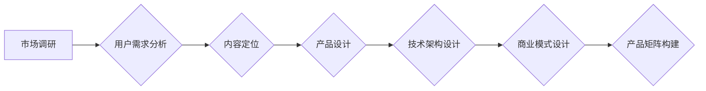

                 

## 知识付费创业的产品矩阵构建

> 关键词：知识付费、产品矩阵、市场定位、用户需求、内容运营、商业模式、技术架构

## 1. 背景介绍

知识付费行业近年来发展迅速，成为互联网经济的重要组成部分。随着人们对知识的需求不断增长，以及互联网技术的发展，知识付费模式也呈现出多元化趋势。从线上课程、付费咨询到会员体系、知识社区，各种形式的知识付费产品层出不穷。

然而，知识付费创业并非易事。如何构建一个成功的知识付费产品矩阵，是众多创业者面临的挑战。一个成功的产品矩阵需要考虑多个因素，包括市场定位、用户需求、内容运营、商业模式、技术架构等。

## 2. 核心概念与联系

**2.1 知识付费产品矩阵**

知识付费产品矩阵是指一个知识付费平台或企业提供的不同类型的知识付费产品组合，这些产品围绕着特定的主题或领域，并针对不同的用户群体和需求进行设计。

**2.2 市场定位**

市场定位是指企业在目标市场中所占据的独特位置，以及企业想要传达给目标用户的品牌形象和价值主张。

**2.3 用户需求**

用户需求是指用户对知识付费产品的期望和需求，包括内容类型、学习方式、价格水平、服务体验等。

**2.4 内容运营**

内容运营是指围绕知识付费产品进行的策划、创作、发布、推广和维护等一系列活动。

**2.5 商业模式**

商业模式是指企业通过提供知识付费产品获取利润的方式，例如订阅制、课程销售、会员体系等。

**2.6 技术架构**

技术架构是指知识付费平台的底层技术基础设施，包括数据库、服务器、网络安全等。

**2.7 产品矩阵构建流程**



## 3. 核心算法原理 & 具体操作步骤

**3.1 算法原理概述**

知识付费产品矩阵构建的核心算法原理是基于用户需求和市场定位进行产品分类和组合，并通过数据分析和算法模型优化产品矩阵结构，以最大化用户价值和平台收益。

**3.2 算法步骤详解**

1. **市场调研:** 对目标市场进行深入调研，了解用户需求、竞争对手情况、市场趋势等。
2. **用户需求分析:** 通过用户调研、数据分析等方式，分析用户对知识付费产品的需求，包括内容类型、学习方式、价格水平、服务体验等。
3. **内容定位:** 根据市场调研和用户需求分析结果，确定知识付费产品的主题和方向，并进行细分和分类。
4. **产品设计:** 根据内容定位和用户需求，设计不同类型的知识付费产品，例如线上课程、付费咨询、会员体系、知识社区等。
5. **技术架构设计:** 设计知识付费平台的底层技术基础设施，包括数据库、服务器、网络安全等。
6. **商业模式设计:** 选择合适的商业模式，例如订阅制、课程销售、会员体系等。
7. **产品矩阵构建:** 将不同类型的知识付费产品组合在一起，形成一个完整的知识付费产品矩阵。
8. **数据分析和优化:** 通过数据分析，不断优化产品矩阵结构，提高用户价值和平台收益。

**3.3 算法优缺点**

**优点:**

* 基于数据分析和算法模型，可以更准确地预测用户需求和市场趋势。
* 可以根据用户行为和反馈，动态调整产品矩阵结构，提高产品匹配度。
* 可以实现自动化运营，降低运营成本。

**缺点:**

* 需要大量的用户数据和技术支持。
* 算法模型的准确性取决于数据质量和算法设计。
* 可能会忽略一些非结构化数据和用户个性化需求。

**3.4 算法应用领域**

* 知识付费平台
* 在线教育平台
* 内容创作平台
* 社交媒体平台

## 4. 数学模型和公式 & 详细讲解 & 举例说明

**4.1 数学模型构建**

知识付费产品矩阵构建可以采用用户需求模型和市场竞争模型进行分析。

**用户需求模型:**

$$
U(p,c) = f(N,I,P,E)
$$

其中:

* $U(p,c)$: 用户对知识付费产品 $p$ 的满意度
* $N$: 内容质量
* $I$: 学习方式
* $P$: 价格水平
* $E$: 服务体验

**市场竞争模型:**

$$
S(p,c) = g(N',I',P',E',M)
$$

其中:

* $S(p,c)$: 产品 $p$ 在市场上的竞争力
* $N'$: 竞争对手产品的内容质量
* $I'$: 竞争对手产品学习方式
* $P'$: 竞争对手产品价格水平
* $E'$: 竞争对手产品服务体验
* $M$: 市场规模

**4.2 公式推导过程**

用户需求模型和市场竞争模型可以根据实际情况进行调整和完善。例如，可以引入用户年龄、职业、教育背景等因素，对用户需求进行更细致的分析。

**4.3 案例分析与讲解**

假设一家知识付费平台想要构建一个关于编程的知识付费产品矩阵。

根据用户需求分析，发现用户对编程语言、软件开发、数据结构等方面的知识需求比较高。

根据市场竞争分析，发现竞争对手的产品主要集中在编程语言和软件开发方面，而数据结构方面的产品相对较少。

因此，这家知识付费平台可以构建一个包含以下产品的知识付费产品矩阵:

* 编程语言入门课程
* 软件开发实战课程
* 数据结构与算法课程
* 编程社区

## 5. 项目实践：代码实例和详细解释说明

**5.1 开发环境搭建**

* 操作系统: Ubuntu 20.04 LTS
* 编程语言: Python 3.8
* 开发框架: Django 3.2
* 数据库: PostgreSQL 13

**5.2 源代码详细实现**

```python
# models.py
from django.db import models

class Course(models.Model):
    title = models.CharField(max_length=255)
    description = models.TextField()
    price = models.DecimalField(max_digits=10, decimal_places=2)
    category = models.CharField(max_length=255)

# views.py
from django.shortcuts import render
from .models import Course

def course_list(request):
    courses = Course.objects.all()
    return render(request, 'course_list.html', {'courses': courses})
```

**5.3 代码解读与分析**

* models.py 文件定义了课程模型，包括课程标题、描述、价格和类别等字段。
* views.py 文件定义了课程列表视图，从数据库中获取所有课程数据，并将其传递给模板文件进行渲染。

**5.4 运行结果展示**

运行上述代码后，可以访问 http://localhost:8000/courses/ 地址，查看所有课程列表。

## 6. 实际应用场景

**6.1 在线教育平台**

知识付费产品矩阵可以帮助在线教育平台提供更丰富的课程内容，满足不同用户的学习需求。

**6.2 内容创作平台**

知识付费产品矩阵可以帮助内容创作平台将内容转化为商业价值，并建立稳定的收入来源。

**6.3 社交媒体平台**

知识付费产品矩阵可以帮助社交媒体平台打造付费社区，提供更优质的服务和内容。

**6.4 未来应用展望**

随着人工智能、大数据等技术的不断发展，知识付费产品矩阵将更加智能化、个性化和多元化。

## 7. 工具和资源推荐

**7.1 学习资源推荐**

* 《产品经理的思维导图》
* 《互联网产品经理》
* 《Lean Startup》

**7.2 开发工具推荐**

* Django
* Flask
* React

**7.3 相关论文推荐**

* "The Economics of Online Education"
* "The Future of Knowledge Sharing"

## 8. 总结：未来发展趋势与挑战

**8.1 研究成果总结**

知识付费产品矩阵构建是一个复杂而动态的过程，需要综合考虑用户需求、市场定位、内容运营、商业模式和技术架构等多个因素。

**8.2 未来发展趋势**

未来，知识付费产品矩阵将更加智能化、个性化和多元化。

* **智能化:** 利用人工智能技术，对用户需求进行更精准的分析和预测，并自动生成个性化的产品推荐。
* **个性化:** 根据用户的学习习惯、兴趣爱好和知识水平，提供定制化的学习路径和内容。
* **多元化:** 除了传统的课程和咨询服务，还将出现更多新的知识付费形式，例如虚拟现实、增强现实、游戏化学习等。

**8.3 面临的挑战**

知识付费行业也面临着一些挑战，例如内容质量控制、用户付费意愿、平台竞争等。

**8.4 研究展望**

未来，需要进一步研究知识付费产品矩阵构建的算法模型和技术架构，以及如何应对行业面临的挑战。


## 9. 附录：常见问题与解答

**9.1 如何确定知识付费产品的主题和方向？**

可以通过市场调研、用户需求分析、竞争对手分析等方式确定知识付费产品的主题和方向。

**9.2 如何设计知识付费产品的价格？**

可以通过成本分析、市场调研、用户付费意愿等因素来确定知识付费产品的价格。

**9.3 如何推广知识付费产品？**

可以通过线上线下推广、内容营销、社群运营等方式推广知识付费产品。


作者：禅与计算机程序设计艺术 / Zen and the Art of Computer Programming 
<end_of_turn>

