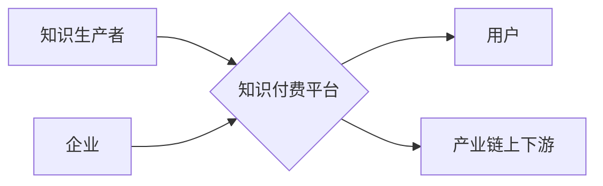

                 

## 关键词：知识付费、产业链、融合发展、技术创新、人才培养、市场需求

## 1. 背景介绍

知识经济时代，知识已成为重要的生产要素，知识付费作为一种新型的知识传播模式，在近年来得到了快速发展。它打破了传统知识获取的壁垒，为个人和企业提供了便捷高效的学习途径。然而，知识付费市场目前仍面临着一些挑战，例如内容质量参差不齐、用户付费意愿不足、产业链条不完善等。

为了推动知识付费行业健康可持续发展，加强与产业链上下游的融合发展至关重要。产业链上下游的融合可以促进知识付费内容的创新和升级，提升用户体验，扩大市场规模，最终形成良性循环。

## 2. 核心概念与联系

### 2.1 知识付费

知识付费是指以知识、技能、经验等为核心内容，通过付费的方式获取和学习。它涵盖了多种形式，例如在线课程、付费咨询、电子书、直播等。

### 2.2 产业链

产业链是指一个产品或服务的整个生产、流通、销售过程中的各个环节，包括原材料供应商、生产企业、分销商、零售商等。

### 2.3 融合发展

融合发展是指不同产业、不同领域之间相互渗透、相互融合，形成新的产业生态系统。

**Mermaid 流程图**



## 3. 核心算法原理 & 具体操作步骤

### 3.1 算法原理概述

知识付费与产业链融合发展的核心算法原理在于构建一个高效的知识价值传递机制。该机制需要考虑知识生产者、知识付费平台、用户以及产业链上下游的利益关系，并通过算法优化资源配置、知识匹配和价值分配。

### 3.2 算法步骤详解

1. **知识内容采集和分析:** 利用自然语言处理、机器学习等技术，对知识付费平台上的知识内容进行采集、分类、标注和分析，提取知识点、主题、关键词等信息。

2. **用户画像构建:** 基于用户行为数据、兴趣偏好、学习习惯等信息，构建用户画像，并进行细分，以便精准推荐相关知识内容。

3. **知识匹配与推荐:** 根据用户画像和知识内容分析结果，利用推荐算法，匹配用户与合适的知识内容，并进行个性化推荐。

4. **价值分配机制设计:** 设计合理的价值分配机制，确保知识生产者获得应有的收益，知识付费平台获得平台服务费，用户获得优质的学习体验。

5. **产业链上下游协同:** 建立与产业链上下游的合作机制，例如与企业合作开发定制化知识内容，与教育机构合作推广知识付费课程，与科研机构合作进行知识产权转化等。

### 3.3 算法优缺点

**优点:**

* 提高知识内容的匹配度和推荐精准度，提升用户学习体验。
* 促进知识生产者和知识付费平台的合作，提高知识付费平台的运营效率。
* 促进知识付费与产业链上下游的融合，形成新的产业生态系统。

**缺点:**

* 需要大量的用户数据和知识内容数据进行训练和优化，数据质量和数据安全是关键问题。
* 算法模型的复杂度较高，需要专业的技术人员进行开发和维护。
* 价值分配机制的设计需要平衡各方利益，避免出现不公平现象。

### 3.4 算法应用领域

* 在线教育平台
* 知识付费平台
* 企业培训系统
* 个人学习工具

## 4. 数学模型和公式 & 详细讲解 & 举例说明

### 4.1 数学模型构建

知识付费与产业链融合发展的数学模型可以基于用户价值、知识价值和平台价值三个维度构建。

* **用户价值:**  用户价值可以表示为用户学习到的知识量和用户学习体验的综合指标。

* **知识价值:** 知识价值可以表示为知识的独特性、实用性、时效性和影响力等因素的综合指标。

* **平台价值:** 平台价值可以表示为平台的用户规模、知识内容的丰富度、平台的运营效率等因素的综合指标。

### 4.2 公式推导过程

可以构建一个多目标优化模型，目标函数为用户价值、知识价值和平台价值的加权和。

$$
\text{目标函数} = w_1 \times \text{用户价值} + w_2 \times \text{知识价值} + w_3 \times \text{平台价值}
$$

其中，$w_1$, $w_2$, $w_3$ 为权重系数，分别代表用户价值、知识价值和平台价值在目标函数中的重要程度。

### 4.3 案例分析与讲解

假设一个在线教育平台，其目标是提高用户学习体验和知识付费收入。

* **用户价值:** 可以通过用户学习时长、用户评价、用户复购率等指标来衡量。

* **知识价值:** 可以通过知识点的独特性、知识的实用性、知识的时效性等指标来衡量。

* **平台价值:** 可以通过平台的用户规模、知识内容的丰富度、平台的运营效率等指标来衡量。

平台可以通过调整权重系数，优化目标函数，实现用户价值、知识价值和平台价值的平衡发展。例如，如果平台希望提高用户学习体验，可以将 $w_1$ 的值提高，从而更加注重用户学习时长和用户评价等指标。

## 5. 项目实践：代码实例和详细解释说明

### 5.1 开发环境搭建

* 操作系统：Windows/macOS/Linux
* 编程语言：Python
* 开发工具：VS Code/PyCharm
* 库依赖：pandas、numpy、scikit-learn

### 5.2 源代码详细实现

```python
# 导入必要的库
import pandas as pd
from sklearn.model_selection import train_test_split
from sklearn.linear_model import LogisticRegression

# 加载用户数据和知识内容数据
user_data = pd.read_csv("user_data.csv")
content_data = pd.read_csv("content_data.csv")

# 数据预处理
# ...

# 训练模型
X_train, X_test, y_train, y_test = train_test_split(user_data, content_data, test_size=0.2)
model = LogisticRegression()
model.fit(X_train, y_train)

# 模型评估
# ...

# 知识推荐
# ...
```

### 5.3 代码解读与分析

* 代码首先导入必要的库，例如 pandas 用于数据处理， scikit-learn 用于机器学习模型训练。
* 然后加载用户数据和知识内容数据，并进行数据预处理，例如特征提取、数据清洗等。
* 接着使用 LogisticRegression 模型训练，并进行模型评估。
* 最后，利用训练好的模型进行知识推荐。

### 5.4 运行结果展示

* 模型训练结果，例如准确率、召回率等指标。
* 知识推荐结果，例如推荐的知识内容列表和推荐理由。

## 6. 实际应用场景

### 6.1 在线教育平台

* 个性化推荐课程和学习资源，提高用户学习效率和学习体验。
* 根据用户学习进度和学习情况，提供个性化的学习建议和辅导。
* 推广知识付费课程，增加平台收入。

### 6.2 企业培训系统

* 根据员工岗位和技能需求，推荐合适的培训课程和学习资源。
* 评估员工培训效果，优化培训方案。
* 建立员工知识库，促进知识共享和传播。

### 6.3 个人学习工具

* 根据用户的学习目标和兴趣，推荐相关的学习资源和学习方法。
* 跟踪用户的学习进度和学习效果，提供个性化的学习建议。
* 建立用户的知识图谱，帮助用户更好地理解和记忆知识。

### 6.4 未来应用展望

* 与人工智能、大数据、云计算等技术的融合，将进一步提升知识付费的智能化、个性化和效率化。
* 知识付费将更加注重用户体验，提供更加沉浸式、互动式的学习体验。
* 知识付费将更加注重知识的应用和实践，将理论知识与实际应用相结合。

## 7. 工具和资源推荐

### 7.1 学习资源推荐

* **在线课程平台:** Coursera、edX、Udemy
* **知识付费平台:** 知乎付费专栏、网易云课堂、腾讯课堂
* **技术博客:** CSDN、博客园、SegmentFault

### 7.2 开发工具推荐

* **编程语言:** Python、Java、C++
* **机器学习库:** scikit-learn、TensorFlow、PyTorch
* **数据分析工具:** pandas、NumPy、Matplotlib

### 7.3 相关论文推荐

* **知识推荐系统:**
    * "Collaborative Filtering for Recommender Systems" by Su-Yin Chen and Wei-Min Chen
    * "Content-Based Recommendation Systems" by  Paul Resnick and  Charles  Z.  Yang
* **知识付费市场分析:**
    * "The Rise of the Knowledge Economy" by  Michael  Porter
    * "The Future of Learning" by  Clayton  M.  Christensen

## 8. 总结：未来发展趋势与挑战

### 8.1 研究成果总结

知识付费与产业链融合发展是一个新兴的领域，取得了一些重要的研究成果。例如，开发了多种知识推荐算法，构建了知识价值评估模型，探索了知识付费的商业模式。

### 8.2 未来发展趋势

* **智能化:** 利用人工智能技术，实现知识推荐的智能化、个性化和精准化。
* **融合化:** 与其他产业链融合，形成新的产业生态系统。
* **平台化:** 建立更加完善的知识付费平台，提供更加丰富的知识内容和服务。

### 8.3 面临的挑战

* **数据质量:** 知识付费平台需要收集和积累大量的用户数据和知识内容数据，数据质量是关键问题。
* **算法模型:** 知识推荐算法模型的复杂度较高，需要不断优化和改进。
* **价值分配:** 知识付费的价值分配机制需要更加公平合理，确保各方利益得到保障。

### 8.4 研究展望

未来，需要进一步研究知识付费与产业链融合发展的机制、模型和方法，推动知识付费行业健康可持续发展。


## 9. 附录：常见问题与解答

**Q1: 知识付费平台如何保证知识内容的质量？**

**A1:** 知识付费平台可以通过以下方式保证知识内容的质量：

* 建立严格的知识内容审核机制，邀请专家进行内容评审。
* 建立知识生产者的评价体系，鼓励优质知识生产者创作优质内容。
* 提供用户评价和反馈机制，及时发现和解决知识内容质量问题。

**Q2: 知识付费平台如何吸引用户付费？**

**A2:** 知识付费平台可以通过以下方式吸引用户付费：

* 提供高质量、有价值的知识内容。
* 提供个性化推荐和定制化服务。
* 提供优惠活动和会员制度。
* 建立良好的用户口碑和品牌形象。


作者：禅与计算机程序设计艺术 / Zen and the Art of Computer Programming 
<end_of_turn>

