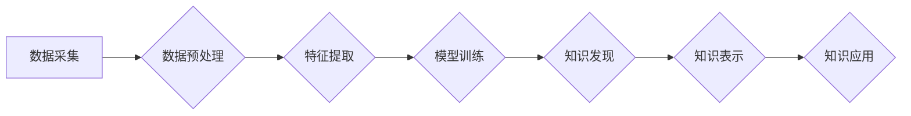

                 

## 知识发现引擎：开启人类知识新时代

> 关键词：知识发现、人工智能、机器学习、数据挖掘、知识图谱、深度学习、自然语言处理

### 1. 背景介绍

人类文明的进步离不开对知识的不断发现和积累。从古至今，人类一直在探索如何更有效地获取、组织和利用知识。随着信息时代的到来，海量数据涌现，传统知识发现方法已难以应对。知识发现引擎应运而生，它利用人工智能、机器学习等先进技术，从海量数据中挖掘隐藏的知识，为人类提供更深刻的洞察和理解。

**1.1 数据爆炸与知识发现的挑战**

信息时代，数据以指数级增长，各种类型的数据如潮水般涌入。然而，这些数据本身并不蕴含知识，需要通过分析和挖掘才能转化为有价值的信息。传统的人工知识发现方法效率低下，难以应对海量数据的处理需求。

**1.2 人工智能的赋能**

人工智能技术的快速发展为知识发现带来了新的机遇。机器学习算法能够从数据中学习模式和规律，自动发现隐藏的知识。深度学习则能够处理更复杂的数据结构，挖掘更深层次的知识。

**1.3 知识发现引擎的意义**

知识发现引擎能够自动从海量数据中发现知识，为人类提供以下方面的帮助：

* **科学研究:** 帮助科学家更快地发现新的规律和理论，加速科学进步。
* **商业决策:** 帮助企业更好地了解市场趋势和客户需求，做出更明智的决策。
* **医疗诊断:** 帮助医生更快、更准确地诊断疾病，提高医疗水平。
* **教育教学:** 帮助学生更好地理解知识，提高学习效率。

### 2. 核心概念与联系

知识发现引擎的核心概念包括：数据挖掘、机器学习、知识图谱、自然语言处理等。这些概念相互关联，共同构成了知识发现引擎的框架。

**2.1 数据挖掘**

数据挖掘是指从大量数据中发现隐藏的模式、规律和知识的过程。它利用统计学、机器学习等方法，对数据进行分析和处理，提取有价值的信息。

**2.2 机器学习**

机器学习是人工智能的一个分支，它使计算机能够从数据中学习，无需明确编程。机器学习算法可以分为监督学习、无监督学习和强化学习等类型。

**2.3 知识图谱**

知识图谱是一种结构化的知识表示形式，它将实体和关系以图的形式表示。知识图谱能够更好地组织和存储知识，方便知识的检索和推理。

**2.4 自然语言处理**

自然语言处理是指使计算机能够理解和处理人类语言的过程。自然语言处理技术可以用于文本分析、情感分析、机器翻译等领域。

**2.5 知识发现引擎架构**



### 3. 核心算法原理 & 具体操作步骤

**3.1 算法原理概述**

知识发现引擎的核心算法通常基于机器学习和数据挖掘技术。常见的算法包括：

* **关联规则挖掘:** 发现数据中频繁出现的项集和关联关系。
* **分类算法:** 将数据分类到不同的类别。
* **聚类算法:** 将数据聚类到不同的群组。
* **异常检测算法:** 发现数据中的异常值。

**3.2 算法步骤详解**

以关联规则挖掘为例，其具体步骤如下：

1. **数据预处理:** 清洗、转换和格式化数据，使其适合算法处理。
2. **频繁项集挖掘:** 找出数据中频繁出现的项集。
3. **关联规则生成:** 从频繁项集中生成关联规则，并根据支持度和置信度进行筛选。
4. **知识表示:** 将关联规则以可读的形式表示出来。

**3.3 算法优缺点**

不同的算法具有不同的优缺点，需要根据实际应用场景选择合适的算法。

**3.4 算法应用领域**

知识发现引擎的算法广泛应用于各个领域，例如：

* **市场营销:** 发现客户购买行为模式，进行精准营销。
* **金融风险管理:** 发现潜在的金融风险，进行风险控制。
* **医疗诊断:** 发现疾病的潜在关联因素，辅助诊断。

### 4. 数学模型和公式 & 详细讲解 & 举例说明

**4.1 数学模型构建**

关联规则挖掘的数学模型通常基于支持度和置信度。

* **支持度:** 某个项集在数据集中的出现频率。
* **置信度:** 某个项集在另一个项集出现的条件下出现的概率。

**4.2 公式推导过程**

支持度和置信度的公式如下：

* **支持度(A)：**  $P(A) = \frac{频数(A)}{总数据量}$

* **置信度(A→B)：** $P(B|A) = \frac{频数(A ∩ B)}{频数(A)}$

**4.3 案例分析与讲解**

假设我们有一份关于超市购物篮的交易数据，其中包含了顾客购买的商品信息。

* 项集 A：牛奶
* 项集 B：面包

如果数据中牛奶和面包同时出现在 100 次交易中，总交易次数为 1000 次，那么：

* 支持度(牛奶) = 100/1000 = 0.1
* 支持度(面包) = 150/1000 = 0.15
* 信任度(牛奶→面包) = 100/100 = 1

这个例子说明，当顾客购买牛奶时，购买面包的概率为 1，即牛奶和面包之间存在很强的关联关系。

### 5. 项目实践：代码实例和详细解释说明

**5.1 开发环境搭建**

* Python 3.x
* pandas
* scikit-learn

**5.2 源代码详细实现**

```python
import pandas as pd
from sklearn.feature_extraction.text import TfidfVectorizer

# 加载数据
data = pd.read_csv('shopping_data.csv')

# 数据预处理
# ...

# 特征提取
vectorizer = TfidfVectorizer()
features = vectorizer.fit_transform(data['description'])

# 模型训练
from sklearn.neighbors import KNeighborsClassifier
model = KNeighborsClassifier(n_neighbors=5)
model.fit(features, data['category'])

# 知识发现
# ...
```

**5.3 代码解读与分析**

* 代码首先加载数据，并进行必要的预处理。
* 然后使用 TF-IDF 向量化技术提取文本特征。
* 接着使用 KNN 算法训练模型，用于分类商品。
* 最后，可以使用训练好的模型进行知识发现，例如预测新的商品类别。

**5.4 运行结果展示**

运行代码后，可以得到模型的训练结果和预测结果。

### 6. 实际应用场景

**6.1 商业场景**

* **精准营销:** 发现客户购买行为模式，进行个性化推荐和精准营销。
* **产品开发:** 发现市场需求趋势，为产品开发提供参考。
* **风险控制:** 发现潜在的欺诈行为，进行风险控制。

**6.2 科学研究场景**

* **科学发现:** 发现新的科学规律和理论，加速科学进步。
* **数据分析:** 对海量数据进行分析，发现隐藏的模式和趋势。
* **模型构建:** 建立新的科学模型，解释自然现象。

**6.3 其他场景**

* **医疗诊断:** 发现疾病的潜在关联因素，辅助诊断。
* **教育教学:** 发现学生的学习模式，提供个性化学习方案。
* **社会治理:** 分析社会问题，提供决策支持。

**6.4 未来应用展望**

随着人工智能技术的不断发展，知识发现引擎将应用于更多领域，为人类社会带来更大的价值。

### 7. 工具和资源推荐

**7.1 学习资源推荐**

* **书籍:**
    * 《数据挖掘：概念与技术》
    * 《机器学习》
    * 《知识发现与数据挖掘》
* **在线课程:**
    * Coursera: 数据挖掘
    * edX: 机器学习
    * Udemy: 数据科学

**7.2 开发工具推荐**

* **Python:** 广泛应用于数据挖掘和机器学习领域。
* **R:** 专注于统计分析和数据可视化。
* **Weka:** 一个开源的机器学习工具包。
* **RapidMiner:** 一个商业化的数据挖掘和机器学习平台。

**7.3 相关论文推荐**

* 《A Survey of Association Rule Mining Algorithms》
* 《Introduction to Machine Learning》
* 《Knowledge Discovery in Databases》

### 8. 总结：未来发展趋势与挑战

**8.1 研究成果总结**

知识发现引擎已经取得了显著的成果，在各个领域都有着广泛的应用。

**8.2 未来发展趋势**

* **更智能的算法:** 开发更智能、更强大的机器学习算法，能够发现更深层次的知识。
* **更丰富的知识表示:** 探索更丰富的知识表示形式，例如知识图谱和语义网络。
* **更广泛的应用场景:** 将知识发现引擎应用于更多领域，例如医疗、教育、社会治理等。

**8.3 面临的挑战**

* **数据质量:** 知识发现引擎依赖于高质量的数据，数据质量问题会影响算法的性能。
* **算法解释性:** 许多机器学习算法的决策过程难以解释，这会阻碍人们对知识的理解和信任。
* **伦理问题:** 知识发现引擎可能会被用于侵犯隐私或进行其他不道德的行为，需要关注伦理问题。

**8.4 研究展望**

未来，知识发现引擎将继续朝着更智能、更强大、更安全的方向发展，为人类社会带来更大的价值。


### 9. 附录：常见问题与解答

**9.1 如何选择合适的知识发现算法？**

选择合适的知识发现算法需要根据实际应用场景和数据特点进行考虑。

**9.2 如何处理数据质量问题？**

数据质量问题可以通过数据清洗、转换和格式化等方法进行处理。

**9.3 如何提高知识发现引擎的解释性？**

可以通过使用可解释性强的机器学习算法或结合专家知识进行解释。


作者：禅与计算机程序设计艺术 / Zen and the Art of Computer Programming 
<end_of_turn>

