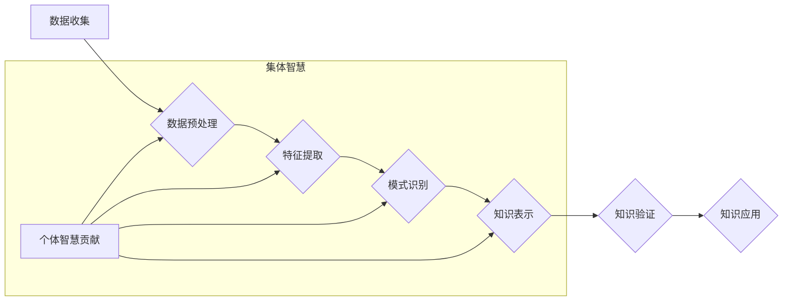

                 

## 知识的社会性：集体智慧与知识发现

> 关键词：集体智慧、知识发现、协作学习、社会网络、人工智能、知识图谱、机器学习

### 1. 背景介绍

在信息爆炸的时代，知识已成为最宝贵的资源。然而，知识的获取、积累和应用并非孤立的个体行为，而是高度依赖于社会化过程。从古至今，人类文明的进步都离不开群体智慧的积累和传承。随着互联网和人工智能技术的飞速发展，知识的社会性更加凸显，集体智慧在知识发现和创新中扮演着越来越重要的角色。

传统的信息检索和知识发现方法主要依赖于个人经验和专家知识，效率低下且难以应对海量数据的挑战。而集体智慧则通过将多个个体智慧汇聚起来，形成一种新的认知能力，能够更有效地发现隐藏在数据中的知识和模式。

### 2. 核心概念与联系

**2.1 集体智慧**

集体智慧是指一群人协同工作时，能够超越个体智慧的水平，产生更优的解决方案和创新的能力。它强调的是群体协作、信息共享和共同学习的过程，而非简单的个体智慧的加总。

**2.2 知识发现**

知识发现是指从海量数据中挖掘出潜在的知识和模式的过程。它涉及到数据预处理、特征提取、模式识别、知识表示等多个环节。

**2.3 联系**

集体智慧和知识发现之间存在着密切的联系。集体智慧可以为知识发现提供以下方面的支持：

* **多角度视角**: 集体智慧能够汇聚来自不同背景、不同专业领域的个体智慧，提供多角度的视角和分析方法，从而更全面地理解数据和发现隐藏的知识。
* **信息共享**: 集体智慧强调信息共享，能够促进知识的传播和积累，为知识发现提供更丰富的知识背景和参考信息。
* **协同学习**: 集体智慧中的协同学习过程能够帮助个体不断学习和进步，提升知识发现的能力。

**2.4 流程图**



### 3. 核心算法原理 & 具体操作步骤

**3.1 算法原理概述**

集体智慧的知识发现算法通常基于以下几个核心原理：

* **协同过滤**: 通过分析用户或物品之间的关联关系，预测用户对未体验过的物品的喜好。
* **聚类分析**: 将数据按照相似性进行分组，发现数据中的潜在结构和模式。
* **关联规则挖掘**: 从交易数据中发现物品之间的关联关系，例如“购买牛奶的人也经常购买面包”。
* **深度学习**: 利用多层神经网络，从复杂的数据中学习更深层次的特征和知识。

**3.2 算法步骤详解**

以协同过滤算法为例，其具体操作步骤如下：

1. **数据收集**: 收集用户对物品的评分或行为数据，例如用户对电影的评分、用户对商品的购买记录等。
2. **数据预处理**: 对数据进行清洗、去噪和格式转换，例如处理缺失值、去除异常值等。
3. **相似度计算**: 计算用户之间的相似度或物品之间的相似度，例如使用余弦相似度、皮尔逊相关系数等方法。
4. **预测评分**: 根据用户之间的相似度或物品之间的相似度，预测用户对未体验过的物品的评分。

**3.3 算法优缺点**

**优点**:

* 能够发现隐藏在数据中的潜在关系和模式。
* 不需要事先定义特征，能够自动学习数据中的特征。
* 能够处理海量数据。

**缺点**:

* 数据稀疏性问题：当数据中用户对物品的评分或行为记录较少时，算法的准确性会降低。
* 冷启动问题：对于新用户或新物品，由于缺乏历史数据，算法难以进行准确的预测。
* 算法复杂度高：一些算法的计算复杂度较高，需要较强的计算资源。

**3.4 算法应用领域**

* **推荐系统**: 为用户推荐感兴趣的商品、电影、音乐等。
* **市场营销**: 分析用户行为，进行精准营销。
* **金融风险管理**: 识别潜在的金融风险。
* **医疗诊断**: 辅助医生进行疾病诊断。

### 4. 数学模型和公式 & 详细讲解 & 举例说明

**4.1 数学模型构建**

协同过滤算法的数学模型可以表示为一个用户-物品评分矩阵，其中每个元素代表用户对物品的评分。

**4.2 公式推导过程**

协同过滤算法的预测评分公式通常基于以下原理：

* **用户相似度**: 计算用户之间的相似度，例如使用余弦相似度：

$$
\text{相似度}(u_i, u_j) = \frac{\sum_{k=1}^{N} r_{ik} \cdot r_{jk}}{\sqrt{\sum_{k=1}^{N} r_{ik}^2} \cdot \sqrt{\sum_{k=1}^{N} r_{jk}^2}}
$$

其中，$u_i$ 和 $u_j$ 是两个用户，$r_{ik}$ 和 $r_{jk}$ 是用户 $u_i$ 和 $u_j$ 对物品 $k$ 的评分。

* **预测评分**: 根据用户相似度和已知评分，预测用户对未体验过的物品的评分。例如，可以使用以下公式：

$$
\hat{r}_{ui} = \frac{\sum_{j \in N(u_i)} \text{相似度}(u_i, u_j) \cdot r_{uj}}{\sum_{j \in N(u_i)} \text{相似度}(u_i, u_j)}
$$

其中，$\hat{r}_{ui}$ 是用户 $u_i$ 对物品 $u$ 的预测评分，$N(u_i)$ 是用户 $u_i$ 的邻居用户集合。

**4.3 案例分析与讲解**

假设有一个用户评分矩阵，其中用户 1 和用户 2 都给电影 A 和电影 B 分了 5 分，用户 1 给电影 C 分了 4 分，用户 2 给电影 C 分了 3 分。

根据上述公式，我们可以计算出用户 1 和用户 2 的相似度，然后预测用户 1 对电影 D 的评分。

### 5. 项目实践：代码实例和详细解释说明

**5.1 开发环境搭建**

* Python 3.x
* scikit-learn 库
* pandas 库
* matplotlib 库

**5.2 源代码详细实现**

```python
import pandas as pd
from sklearn.metrics.pairwise import cosine_similarity

# 加载用户评分数据
ratings_data = pd.read_csv('ratings.csv')

# 计算用户之间的余弦相似度
user_similarity = cosine_similarity(ratings_data)

# 预测用户对电影 D 的评分
user_id = 1
movie_id = 4
predicted_rating = 0
for j in range(len(user_similarity[user_id])):
    if ratings_data.iloc[j, 3] == movie_id:
        predicted_rating += user_similarity[user_id][j] * ratings_data.iloc[j, 4]
predicted_rating /= sum(user_similarity[user_id])

print(f'用户 {user_id} 对电影 {movie_id} 的预测评分: {predicted_rating}')
```

**5.3 代码解读与分析**

* 首先，加载用户评分数据到 pandas DataFrame 中。
* 然后，使用 scikit-learn 库的 cosine_similarity 函数计算用户之间的余弦相似度。
* 最后，根据用户相似度和已知评分，预测用户对电影 D 的评分。

**5.4 运行结果展示**

运行上述代码后，将输出用户 1 对电影 4 的预测评分。

### 6. 实际应用场景

**6.1 电子商务推荐系统**

电商平台可以利用协同过滤算法，根据用户的购买历史和浏览记录，推荐用户可能感兴趣的商品。

**6.2 在线教育平台**

在线教育平台可以利用聚类分析算法，将学生按照学习能力和兴趣爱好进行分组，提供个性化的学习内容和辅导。

**6.3 社交网络平台**

社交网络平台可以利用关联规则挖掘算法，发现用户之间的社交关系和兴趣爱好，推荐用户可能认识的朋友或感兴趣的群组。

**6.4 未来应用展望**

随着人工智能技术的不断发展，集体智慧在知识发现领域的应用将更加广泛和深入。例如，

* **知识图谱构建**: 利用集体智慧，构建更加完善和准确的知识图谱，为知识发现提供更丰富的知识基础。
* **跨领域知识发现**: 利用集体智慧，突破领域之间的知识孤岛，促进跨领域知识的融合和创新。
* **智能问答系统**: 利用集体智慧，构建更加智能的问答系统，能够理解用户的复杂问题，并提供更准确和全面的答案。

### 7. 工具和资源推荐

**7.1 学习资源推荐**

* **书籍**:

    * 《集体智慧：如何利用群体智慧创造更好的结果》
    * 《数据挖掘：概念与技术》
    * 《机器学习》

* **在线课程**:

    * Coursera 上的《数据科学》课程
    * edX 上的《机器学习》课程

**7.2 开发工具推荐**

* **Python**: 广泛应用于数据挖掘和机器学习领域。
* **scikit-learn**: Python 的机器学习库，提供多种算法和工具。
* **pandas**: Python 的数据分析库，用于数据处理和分析。
* **matplotlib**: Python 的数据可视化库，用于数据可视化。

**7.3 相关论文推荐**

* 《协同过滤算法综述》
* 《基于深度学习的知识发现》
* 《集体智慧与知识发现》

### 8. 总结：未来发展趋势与挑战

**8.1 研究成果总结**

集体智慧在知识发现领域取得了显著的成果，为我们提供了新的视角和方法，能够有效地挖掘隐藏在数据中的知识和模式。

**8.2 未来发展趋势**

* **人工智能与集体智慧的融合**: 将人工智能技术与集体智慧相结合，构建更加智能和高效的知识发现系统。
* **跨领域知识发现**: 突破领域之间的知识孤岛，促进跨领域知识的融合和创新。
* **可解释性增强**: 提高知识发现算法的可解释性，帮助用户理解算法的决策过程。

**8.3 面临的挑战**

* **数据质量**: 知识发现算法对数据质量要求较高，需要解决数据稀疏性、噪声和不完整性等问题。
* **算法复杂度**: 一些知识发现算法的计算复杂度较高，需要更高效的算法和计算资源。
* **伦理问题**: 集体智慧的应用可能涉及到隐私、公平性和责任等伦理问题，需要进行深入的探讨和规范。

**8.4 研究展望**

未来，我们将继续探索集体智慧在知识发现领域的应用，致力于构建更加智能、高效和可解释的知识发现系统，为人类社会的发展做出贡献。

### 9. 附录：常见问题与解答

**9.1 Q: 集体智慧和人工智能有什么区别？**

**A:** 集体智慧强调的是群体协作和信息共享，而人工智能则侧重于模拟人类智能，例如学习、推理和决策。两者可以相互补充，共同推动知识发现的进步。

**9.2 Q: 如何解决协同过滤算法中的冷启动问题？**

**A:** 

* 利用用户画像和商品特征进行推荐。
* 使用基于内容的过滤算法，根据用户历史行为推荐相关内容。
* 利用其他数据源，例如社交网络数据，丰富用户和商品的信息。

**9.3 Q: 集体智慧的应用会带来哪些伦理问题？**

**A:** 

* **隐私问题**: 集体智慧的应用可能涉及到用户的个人信息，需要确保用户的隐私安全。
* **公平性问题**: 集体智慧的算法可能存在偏差，导致某些群体受到不公平的对待。
* **责任问题**: 当集体智慧系统做出错误决策时，需要明确责任归属。


作者：禅与计算机程序设计艺术 / Zen and the Art of Computer Programming 
<end_of_turn>

