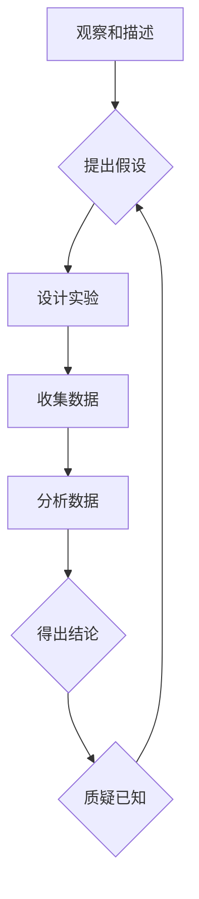

                 

## 知识的质疑：科学思维与怀疑精神

> 关键词：科学思维、怀疑精神、知识论、人工智能、算法、模型、实践、应用

## 1. 背景介绍

在信息爆炸的时代，我们被海量的信息淹没，各种观点和知识层出不穷。如何有效地筛选、评估和利用这些信息，成为了摆在我们面前的重大挑战。在这个背景下，科学思维和怀疑精神显得尤为重要。

科学思维是一种基于理性、逻辑和证据的思考方式，它强调对知识的质疑、探究和验证。怀疑精神则是科学思维的基石，它鼓励我们对已有的知识和观点保持批判性思考，不盲目接受，不断地提出问题、进行探索和挑战。

人工智能作为科技发展的重要方向，也面临着类似的挑战。人工智能模型的训练依赖于海量数据，而数据的质量和可靠性直接影响模型的性能。因此，在人工智能领域，科学思维和怀疑精神同样至关重要。

## 2. 核心概念与联系

### 2.1 科学思维

科学思维的核心在于：

* **观察和描述**: 对现象进行仔细观察和记录，并用语言或符号进行描述。
* **提出假设**: 基于观察结果，提出可能的解释或预测。
* **设计实验**: 设计实验来检验假设的正确性，并收集数据。
* **分析数据**: 对实验数据进行分析，判断假设是否得到支持。
* **得出结论**: 根据数据分析结果，得出结论并进行总结。

### 2.2 怀疑精神

怀疑精神的核心在于：

* **质疑已知**: 不盲目接受已有的知识和观点，对它们进行质疑和批判性思考。
* **寻求证据**: 要求所有知识和观点都能够得到充分的证据支持。
* **保持开放**: 对新的观点和信息保持开放的心态，愿意接受挑战和改变。
* **不断探索**: 始终保持求知欲，不断地探索和发现新的知识。

### 2.3 科学思维与怀疑精神的联系

科学思维和怀疑精神是相互促进、相互依存的。怀疑精神是科学思维的动力，它推动我们不断地质疑、探究和验证知识。而科学思维则提供了方法论和工具，帮助我们更好地进行怀疑和探索。

**Mermaid 流程图**



## 3. 核心算法原理 & 具体操作步骤

### 3.1 算法原理概述

在人工智能领域，算法是实现智能化功能的核心。算法的原理和设计直接影响着人工智能系统的性能和效率。

### 3.2 算法步骤详解

**举例：深度学习算法**

深度学习算法是一种基于多层神经网络的机器学习算法。其核心原理是通过多层神经网络的叠加，学习数据的复杂特征表示。

1. **数据预处理**: 对输入数据进行清洗、转换和标准化，使其适合深度学习模型的训练。
2. **网络结构设计**: 根据任务需求设计神经网络的层数、节点数和激活函数等参数。
3. **参数初始化**: 为神经网络中的参数赋予初始值。
4. **前向传播**: 将输入数据通过神经网络进行传递，计算输出结果。
5. **反向传播**: 计算输出结果与真实值的误差，并根据误差反向调整神经网络的参数。
6. **优化算法**: 使用优化算法，例如梯度下降法，不断调整参数，降低模型的误差。
7. **模型评估**: 使用测试数据评估模型的性能，并根据评估结果进行模型调优。

### 3.3 算法优缺点

**优点**:

* 表现能力强: 深度学习算法能够学习数据的复杂特征，在图像识别、自然语言处理等领域取得了优异的性能。
* 自动特征提取: 深度学习算法能够自动提取数据的特征，无需人工特征工程。

**缺点**:

* 数据依赖性强: 深度学习算法需要大量的训练数据才能达到良好的性能。
* 计算资源消耗大: 深度学习算法的训练过程需要大量的计算资源。
* 可解释性差: 深度学习模型的内部工作机制难以理解，其决策过程缺乏透明度。

### 3.4 算法应用领域

深度学习算法广泛应用于以下领域:

* **图像识别**: 人脸识别、物体检测、图像分类等。
* **自然语言处理**: 机器翻译、文本摘要、情感分析等。
* **语音识别**: 语音转文本、语音助手等。
* **推荐系统**: 商品推荐、内容推荐等。
* **医疗诊断**: 疾病诊断、影像分析等。

## 4. 数学模型和公式 & 详细讲解 & 举例说明

### 4.1 数学模型构建

深度学习算法的核心是神经网络模型。神经网络模型可以看作是一个由多个层组成的计算图，每个层包含多个神经元。神经元之间通过连接权重进行信息传递。

**神经元模型**:

一个神经元接收多个输入信号，经过加权求和和激活函数处理后输出一个信号。

$$
y = f(w_1x_1 + w_2x_2 + ... + w_nx_n + b)
$$

其中:

* $y$ 是神经元的输出信号。
* $x_1, x_2, ..., x_n$ 是输入信号。
* $w_1, w_2, ..., w_n$ 是连接权重。
* $b$ 是偏置项。
* $f$ 是激活函数。

### 4.2 公式推导过程

深度学习算法的训练过程本质上是一个参数优化过程。目标是通过调整神经网络的连接权重，使得模型的输出结果与真实值尽可能接近。

常用的优化算法是梯度下降法。梯度下降法的核心思想是沿着梯度方向更新参数，以降低模型的损失函数值。

**损失函数**:

$$
L = \frac{1}{N}\sum_{i=1}^{N}(y_i - \hat{y}_i)^2
$$

其中:

* $L$ 是损失函数值。
* $N$ 是样本数量。
* $y_i$ 是真实值。
* $\hat{y}_i$ 是模型预测值。

**梯度**:

$$
\frac{\partial L}{\partial w}
$$

其中:

* $w$ 是连接权重。

**参数更新**:

$$
w = w - \eta \frac{\partial L}{\partial w}
$$

其中:

* $\eta$ 是学习率。

### 4.3 案例分析与讲解

**举例：手写数字识别**

使用深度学习算法进行手写数字识别，可以将手写数字图像作为输入数据，训练一个神经网络模型，使其能够识别出图像中的数字。

训练过程中，模型会不断调整连接权重，以降低识别错误率。最终训练好的模型能够将新的手写数字图像识别为对应的数字。

## 5. 项目实践：代码实例和详细解释说明

### 5.1 开发环境搭建

使用Python语言和深度学习框架TensorFlow或PyTorch进行开发。

### 5.2 源代码详细实现

```python
# 使用TensorFlow框架实现手写数字识别

import tensorflow as tf

# 定义神经网络模型
model = tf.keras.models.Sequential([
    tf.keras.layers.Flatten(input_shape=(28, 28)),
    tf.keras.layers.Dense(128, activation='relu'),
    tf.keras.layers.Dropout(0.2),
    tf.keras.layers.Dense(10, activation='softmax')
])

# 编译模型
model.compile(optimizer='adam',
              loss='sparse_categorical_crossentropy',
              metrics=['accuracy'])

# 训练模型
model.fit(x_train, y_train, epochs=5)

# 评估模型
loss, accuracy = model.evaluate(x_test, y_test)
print('Loss:', loss)
print('Accuracy:', accuracy)
```

### 5.3 代码解读与分析

* **模型定义**: 使用`tf.keras.models.Sequential`定义一个顺序模型，包含多个层。
* **层类型**: 使用`tf.keras.layers.Flatten`将图像数据转换为一维向量，使用`tf.keras.layers.Dense`定义全连接层，使用`tf.keras.layers.Dropout`添加Dropout层来防止过拟合。
* **激活函数**: 使用`relu`作为激活函数，`softmax`作为输出层的激活函数。
* **编译模型**: 使用`adam`优化器，`sparse_categorical_crossentropy`损失函数，`accuracy`作为评估指标。
* **训练模型**: 使用`model.fit`函数训练模型，指定训练数据和训练轮数。
* **评估模型**: 使用`model.evaluate`函数评估模型在测试数据上的性能。

### 5.4 运行结果展示

训练完成后，模型能够识别出手写数字图像中的数字，并输出识别结果的准确率。

## 6. 实际应用场景

### 6.1 图像识别

深度学习算法在图像识别领域取得了突破性进展，广泛应用于人脸识别、物体检测、图像分类等场景。

### 6.2 自然语言处理

深度学习算法在自然语言处理领域也取得了显著成果，例如机器翻译、文本摘要、情感分析等。

### 6.3 语音识别

深度学习算法在语音识别领域也取得了突破，例如语音转文本、语音助手等。

### 6.4 其他应用场景

深度学习算法还应用于推荐系统、医疗诊断、金融风险评估等领域。

### 6.5 未来应用展望

随着人工智能技术的不断发展，深度学习算法将在更多领域得到应用，例如自动驾驶、机器人、个性化教育等。

## 7. 工具和资源推荐

### 7.1 学习资源推荐

* **书籍**:
    * 深度学习 (Deep Learning) - Ian Goodfellow, Yoshua Bengio, Aaron Courville
    * 构建深度学习模型 (Hands-On Machine Learning with Scikit-Learn, Keras & TensorFlow) - Aurélien Géron
* **在线课程**:
    * 深度学习 Specialization - Andrew Ng (Coursera)
    * fast.ai - Practical Deep Learning for Coders

### 7.2 开发工具推荐

* **深度学习框架**: TensorFlow, PyTorch, Keras
* **编程语言**: Python
* **数据处理工具**: Pandas, NumPy

### 7.3 相关论文推荐

* **ImageNet Classification with Deep Convolutional Neural Networks** - Alex Krizhevsky, Ilya Sutskever, Geoffrey E. Hinton
* **Attention Is All You Need** - Ashish Vaswani, Noam Shazeer, Niki Parmar, Jakob Uszkoreit, Llion Jones, Aidan N Gomez, Łukasz Kaiser, Illia Polosukhin

## 8. 总结：未来发展趋势与挑战

### 8.1 研究成果总结

深度学习算法取得了显著的成果，在图像识别、自然语言处理、语音识别等领域取得了突破性进展。

### 8.2 未来发展趋势

* **模型效率提升**: 研究更轻量级、更高效的深度学习模型。
* **可解释性增强**: 研究更易于理解和解释的深度学习模型。
* **数据效率提升**: 研究更少数据就能训练出良好性能的深度学习模型。
* **跨模态学习**: 研究能够处理多种模态数据（例如文本、图像、音频）的深度学习模型。

### 8.3 面临的挑战

* **数据安全和隐私**: 深度学习算法依赖于大量数据，如何保证数据安全和隐私是一个重要挑战。
* **算法公平性**: 深度学习算法可能存在偏见，如何确保算法公平性是一个重要的研究方向。
* **伦理问题**: 深度学习算法的应用可能带来伦理问题，例如自动决策的透明度和责任问题。

### 8.4 研究展望

未来，深度学习算法将继续发展，在更多领域发挥重要作用。我们需要加强对深度学习算法的理解和研究，并积极应对其带来的挑战，确保其安全、公平、可持续地发展。

## 9. 附录：常见问题与解答

### 9.1 什么是深度学习？

深度学习是一种机器学习的子领域，它使用多层神经网络来学习数据的复杂特征表示。

### 9.2 深度学习算法有哪些？

常见的深度学习算法包括卷积神经网络（CNN）、循环神经网络（RNN）、生成对抗网络（GAN）等。

### 9.3 如何训练深度学习模型？

训练深度学习模型需要大量的训练数据和计算资源。常用的训练方法包括梯度下降法、随机梯度下降法等。

### 9.4 深度学习算法的应用有哪些？

深度学习算法广泛应用于图像识别、自然语言处理、语音识别、推荐系统、医疗诊断等领域。


作者：禅与计算机程序设计艺术 / Zen and the Art of Computer Programming 
<end_of_turn>

