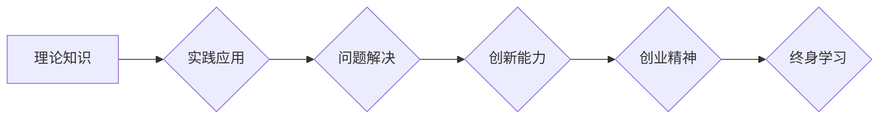

                 

## 硅谷的教育体系:培养创新人才

> 关键词：创新人才培养、硅谷教育、STEM教育、实践性学习、跨学科融合、创业精神、技术趋势、未来人才

## 1. 背景介绍

硅谷作为全球科技创新的中心，其蓬勃发展的科技产业离不开一支源源不断的创新人才队伍。 硅谷的教育体系在培养创新人才方面扮演着至关重要的角色，其独特的教育理念和实践模式为世界提供了宝贵的经验和启示。 

近年来，全球范围内对科技人才的需求不断增长，而传统的教育模式逐渐难以满足这一需求。 硅谷的教育体系以其注重实践、鼓励创新、跨学科融合的特点，成为全球关注的焦点。 

## 2. 核心概念与联系

硅谷的教育体系的核心概念包括：

* **实践性学习 (Hands-on Learning):** 强调将理论知识与实际应用相结合，通过项目实践、实验操作等方式，培养学生的动手能力和解决问题的能力。
* **跨学科融合 (Interdisciplinary Approach):** 鼓励学生从不同学科领域汲取知识和灵感，打破学科壁垒，培养学生的系统思维和创新能力。
* **创业精神 (Entrepreneurial Mindset):** 鼓励学生勇于尝试、敢于创新，培养学生的独立思考、团队合作和商业意识。
* **终身学习 (Lifelong Learning):** 强调学习是一个持续的过程，鼓励学生保持好奇心和学习热情，不断提升自身的能力。

**Mermaid 流程图:**



## 3. 核心算法原理 & 具体操作步骤

### 3.1  算法原理概述

硅谷的教育体系中，算法思维被视为一种重要的核心能力。 算法思维是指用逻辑和步骤的方式解决问题的能力，它能够帮助学生分析问题、设计解决方案、并有效地执行方案。 

### 3.2  算法步骤详解

1. **问题分析:** 首先要明确问题的具体内容和目标。
2. **算法设计:** 根据问题特点，设计出解决问题的步骤和逻辑。
3. **代码实现:** 将算法步骤转化为计算机可执行的代码。
4. **测试验证:** 对代码进行测试，确保算法能够正确地解决问题。
5. **优化改进:** 根据测试结果，对算法进行优化和改进，提高效率和准确性。

### 3.3  算法优缺点

**优点:**

* 逻辑清晰，易于理解和执行。
* 可重复性强，能够保证问题的解决过程的一致性。
* 可量化分析，能够评估算法的效率和准确性。

**缺点:**

* 对于复杂问题，设计算法可能比较困难。
* 算法的效率和准确性取决于算法的设计和实现。

### 3.4  算法应用领域

算法思维在各个领域都有广泛的应用，例如：

* **软件开发:** 设计和开发各种软件应用程序。
* **数据分析:** 处理和分析海量数据，发现数据中的规律和趋势。
* **人工智能:** 开发人工智能算法，实现机器学习和深度学习。
* **科学研究:** 解决科学问题，进行数据模拟和预测。

## 4. 数学模型和公式 & 详细讲解 & 举例说明

### 4.1  数学模型构建

在硅谷的教育体系中，数学模型被广泛应用于解决实际问题。 数学模型能够将复杂的问题抽象成数学语言，并通过公式和计算来分析和解决问题。

### 4.2  公式推导过程

例如，在机器学习领域，线性回归模型可以用来预测连续变量的值。 线性回归模型的数学公式如下：

$$
y = mx + c
$$

其中：

* $y$ 是预测值
* $x$ 是输入变量
* $m$ 是斜率
* $c$ 是截距

通过对训练数据进行拟合，可以求解出 $m$ 和 $c$ 的值，从而建立起线性回归模型。

### 4.3  案例分析与讲解

例如，假设我们想要预测房屋价格，我们可以使用线性回归模型。 我们可以收集房屋面积、房间数量等数据作为输入变量，以及房屋价格作为输出变量。 通过对这些数据进行线性回归模型的拟合，我们可以得到一个预测房屋价格的公式。

## 5. 项目实践：代码实例和详细解释说明

### 5.1  开发环境搭建

在硅谷的教育体系中，学生通常会使用各种开发工具和平台进行项目实践。 常见的开发环境包括：

* **Linux:** 作为开源的操作系统，Linux 在软件开发领域广泛使用。
* **Git:** 作为分布式版本控制系统，Git 能够帮助学生管理代码版本和协同开发。
* **IDE:** 集成开发环境 (IDE) 可以提供代码编辑、调试、编译等功能，例如 Eclipse、IntelliJ IDEA 等。

### 5.2  源代码详细实现

以下是一个简单的 Python 代码实例，用于计算两个数的和：

```python
def sum_two_numbers(a, b):
  """
  计算两个数的和。

  Args:
    a: 第一个数。
    b: 第二个数。

  Returns:
    两个数的和。
  """
  return a + b

# 获取用户输入
num1 = float(input("请输入第一个数: "))
num2 = float(input("请输入第二个数: "))

# 计算和
result = sum_two_numbers(num1, num2)

# 打印结果
print("两个数的和为:", result)
```

### 5.3  代码解读与分析

这段代码定义了一个名为 `sum_two_numbers` 的函数，该函数接受两个参数 `a` 和 `b`，并返回它们的和。 

代码首先获取用户输入的两个数字，然后调用 `sum_two_numbers` 函数计算它们的和，最后将结果打印到屏幕上。

### 5.4  运行结果展示

当用户输入两个数字，例如 5 和 3 时，程序会输出以下结果：

```
两个数的和为: 8.0
```

## 6. 实际应用场景

硅谷的教育体系培养出的创新人才在各个领域都有着广泛的应用，例如：

* **科技公司:** 硅谷的科技公司需要大量的软件工程师、数据科学家、人工智能工程师等人才。
* **创业公司:** 硅谷是全球创业热土，需要大量的创业者和创新者。
* **学术研究:** 硅谷的大学和研究机构需要大量的科研人员和技术人才。

### 6.4  未来应用展望

随着科技的不断发展，对创新人才的需求将更加迫切。 硅谷的教育体系将继续发挥其重要作用，培养更多具有创新能力、解决问题能力和跨学科融合能力的优秀人才。

## 7. 工具和资源推荐

### 7.1  学习资源推荐

* **在线课程平台:** Coursera, edX, Udacity 等平台提供大量的在线课程，涵盖计算机科学、数据科学、人工智能等领域。
* **开源社区:** GitHub, Stack Overflow 等开源社区提供丰富的代码资源和技术支持。
* **技术博客:** Hacker News, Medium 等技术博客分享最新的技术趋势和行业资讯。

### 7.2  开发工具推荐

* **编程语言:** Python, Java, C++, JavaScript 等编程语言是软件开发的常用工具。
* **IDE:** Eclipse, IntelliJ IDEA, Visual Studio Code 等 IDE 提供代码编辑、调试、编译等功能。
* **数据库:** MySQL, PostgreSQL, MongoDB 等数据库用于存储和管理数据。

### 7.3  相关论文推荐

* **《Deep Learning》** by Ian Goodfellow, Yoshua Bengio, and Aaron Courville
* **《The Master Algorithm》** by Pedro Domingos
* **《Weapons of Math Destruction》** by Cathy O'Neil

## 8. 总结：未来发展趋势与挑战

### 8.1  研究成果总结

硅谷的教育体系在培养创新人才方面取得了显著的成果，其实践性学习、跨学科融合、创业精神和终身学习的理念为世界提供了宝贵的经验和启示。

### 8.2  未来发展趋势

未来，硅谷的教育体系将继续朝着以下方向发展：

* **更加注重人工智能和数据科学的教育:** 随着人工智能和数据科学的快速发展，对相关人才的需求将更加迫切。
* **更加重视跨学科融合的教育:** 鼓励学生从不同学科领域汲取知识和灵感，培养学生的系统思维和创新能力。
* **更加注重实践性学习:** 通过项目实践、实验操作等方式，培养学生的动手能力和解决问题的能力。

### 8.3  面临的挑战

硅谷的教育体系也面临着一些挑战，例如：

* **教育资源的分配不均:** 优质的教育资源往往集中在少数地区，导致教育机会不平等。
* **教育模式的僵化:** 一些传统的教育模式难以适应科技的快速发展，需要不断进行改革和创新。
* **人才培养的周期性:** 培养一名合格的创新人才需要较长的周期，需要政府、企业和教育机构共同努力。

### 8.4  研究展望

未来，我们需要继续研究和探索硅谷的教育体系，总结其成功的经验，并将其应用到全球范围内，共同培养更多具有创新能力和解决问题能力的优秀人才。

## 9. 附录：常见问题与解答

**常见问题:**

* 硅谷的教育体系适合所有学生吗？
* 如何才能进入硅谷的教育体系？
* 硅谷的教育体系有哪些缺点？

**解答:**

* 硅谷的教育体系更适合那些具有学习能力、创新精神和解决问题能力的学生。
* 想要进入硅谷的教育体系，可以考虑申请硅谷的大学或科技公司提供的培训项目。
* 硅谷的教育体系也面临着一些挑战，例如教育资源的分配不均、教育模式的僵化等。


作者：禅与计算机程序设计艺术 / Zen and the Art of Computer Programming 
<end_of_turn>

