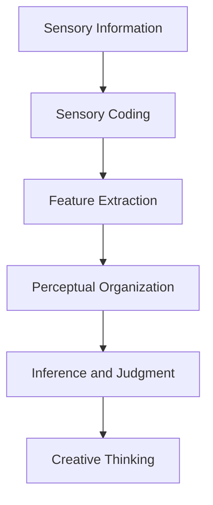

                 

# 理解洞察力的科学：揭开大脑处理信息的奥秘

## 1. 背景介绍

### 1.1 问题由来
洞察力是一种能够透过现象看本质、由局部到整体的思考能力，是人类智慧的核心体现。在科技日新月异的今天，洞察力不仅在哲学、心理学等领域具有重要价值，也被广泛应用于数据科学、机器学习、人工智能等领域。然而，关于洞察力的科学原理，仍有很多未解之谜。本文旨在探索大脑如何处理信息，以期为洞察力的科学提供一些洞见。

### 1.2 问题核心关键点
洞察力的科学探索，涉及神经科学、认知科学、信息论等多个学科。本节将重点阐述大脑如何通过信息处理产生洞察力。核心问题包括：
- 大脑如何接收和处理感官信息？
- 信息处理过程中有哪些关键机制？
- 大脑如何从复杂信息中提取关键特征？
- 洞察力形成的神经机制是什么？

### 1.3 问题研究意义
理解洞察力的科学原理，对于揭示人类智慧的本质、推动人工智能和认知科学的发展，具有重要意义。具体而言：
- 揭示大脑信息处理机制，有助于开发更高效、更智能的认知模型。
- 洞察力的神经科学基础，为人工智能在推理、判断、创造等高级任务中的应用提供了新的理论支持。
- 有助于提升人类认知能力，通过技术手段辅助提升学习和决策能力。

## 2. 核心概念与联系

### 2.1 核心概念概述

为更好地理解大脑信息处理机制，本节将介绍几个密切相关的核心概念：

- 感官信息(Sensory Information)：通过眼睛、耳朵、触觉等感官接收的外部信息，是大脑处理和分析的原始数据。
- 感觉编码(Sensory Coding)：感官信息在大脑皮层中的编码和传递过程，涉及神经元的活动模式和突触连接。
- 特征提取(Feature Extraction)：大脑对感官信息中的关键特征进行识别和提取的过程，是形成洞察力的关键步骤。
- 知觉组织(Perceptual Organization)：将分散的信息整合形成整体知觉的过程，涉及拓扑结构、心理场等概念。
- 推理和判断(Inference and Judgment)：基于知觉和记忆，进行逻辑推理和价值判断的过程，是形成洞察力的核心机制。
- 创造性思维(Creative Thinking)：在大脑已有知识和信息基础上，产生新颖、独特的思维模式，是洞察力的一种高级形式。

这些概念之间的逻辑关系可以通过以下Mermaid流程图来展示：



这个流程图展示了大脑信息处理的主要步骤：

1. 通过感官接收外界信息。
2. 编码并传递感官信息到大脑皮层。
3. 提取关键特征。
4. 整合信息形成知觉。
5. 进行逻辑推理和价值判断。
6. 产生创造性思维。

## 3. 核心算法原理 & 具体操作步骤
### 3.1 算法原理概述

大脑处理信息的过程，本质上是一种高度复杂的神经计算过程。其核心算法原理可以概括为以下几点：

1. **感官编码与信号传递**：感官信息在大脑皮层中的编码和传递，涉及神经元的活动模式和突触连接。神经元通过电信号和化学信号传递信息，形成复杂的神经网络。

2. **特征提取与表征学习**：大脑从感官信息中提取关键特征，并学习形成抽象表征。特征提取依赖于神经元对输入信号的响应特性，如兴奋性、抑制性等。

3. **知觉组织与信息整合**：大脑通过拓扑结构和心理场等机制，将分散的信息整合形成整体知觉。知觉组织依赖于大脑皮层中的视觉、听觉、触觉等多种通道的信息整合。

4. **推理和判断**：基于知觉和记忆，大脑进行逻辑推理和价值判断。推理和判断依赖于大脑皮层中的抽象思维和决策网络。

5. **创造性思维**：在大脑已有知识和信息的基础上，产生新颖、独特的思维模式。创造性思维依赖于大脑皮层中的创新神经网络。

### 3.2 算法步骤详解

基于大脑信息处理机制，洞察力的科学探索可以分为以下几个关键步骤：

**Step 1: 感官信息的接收与编码**
- 通过感官（如视觉、听觉、触觉等）接收外界信息。
- 信息在大脑皮层的初级感觉区进行编码，形成电信号和化学信号。

**Step 2: 特征提取与表征学习**
- 初级感觉区的神经元对输入信号进行编码，形成特征响应。
- 特征响应通过神经网络传递到大脑皮层的高级区域，进行抽象表征学习。
- 利用神经网络的反向传播算法，更新模型参数，优化特征提取和表征学习过程。

**Step 3: 知觉组织与信息整合**
- 利用大脑皮层中的拓扑结构和心理场等机制，将分散的特征信息整合形成整体知觉。
- 通过视觉、听觉、触觉等不同通道的信息整合，形成更丰富的知觉体验。

**Step 4: 推理和判断**
- 基于知觉和记忆，进行逻辑推理和价值判断。
- 利用大脑皮层中的抽象思维和决策网络，进行高级推理和决策。

**Step 5: 创造性思维**
- 在大脑已有知识和信息的基础上，产生新颖、独特的思维模式。
- 利用大脑皮层中的创新神经网络，进行创造性思维。

### 3.3 算法优缺点

大脑信息处理机制具有以下优点：
1. 高效性：通过神经网络的高效信息处理，能够快速形成知觉和推理。
2. 灵活性：利用神经元的可塑性，大脑能够灵活适应不同的信息输入和任务需求。
3. 鲁棒性：神经网络的冗余和容错机制，使得大脑在面对复杂、不确定的信息时，能够保持较高的稳定性和可靠性。

同时，该机制也存在一定的局限性：
1. 复杂性：神经网络的复杂性和多样性，使得信息处理过程难以完全理解和模拟。
2. 非线性：神经元的活动模式具有非线性特性，增加了信息处理的难度。
3. 可解释性不足：大脑信息处理机制的神经网络模型，通常缺乏可解释性，难以理解其内部的工作机制。

尽管存在这些局限性，但就目前而言，大脑信息处理机制已成为研究洞察力的重要基础，帮助理解人类智慧的本质。未来相关研究将继续探索更高效、更灵活、更可解释的信息处理机制。

### 3.4 算法应用领域

大脑信息处理机制的研究，已经在多个领域得到了广泛应用，例如：

- 神经科学：通过研究大脑信息处理机制，揭示神经元的活动模式和突触连接，推动认知科学的发展。
- 人工智能：基于大脑信息处理机制，开发更高效、更智能的认知模型，提升机器推理和创造力。
- 心理治疗：利用大脑信息处理机制，进行心理疾病的诊断和治疗，提升心理健康的水平。
- 教育科技：通过理解大脑信息处理机制，设计更科学的教学方法和评估体系，提升教育效果。

除了上述这些经典应用外，大脑信息处理机制的研究还在不断拓展，为人类认知智能的发展提供了新的理论支持。

## 4. 数学模型和公式 & 详细讲解 & 举例说明

### 4.1 数学模型构建

本节将使用数学语言对大脑信息处理机制进行更加严格的刻画。

记感官信息为 $X$，特征提取后的表征为 $Z$，知觉信息为 $P$，推理和判断结果为 $Y$。大脑信息处理过程可以抽象为以下数学模型：

$$
P = f(Z) \\
Y = g(P)
$$

其中 $f$ 和 $g$ 分别为特征提取和推理和判断的映射函数。

### 4.2 公式推导过程

以下我们以视觉信息处理为例，推导大脑对感官信息的编码和特征提取过程。

假设视觉信息 $X$ 为一维信号，神经元的感受野为 $W$，响应函数为 $h$。神经元的响应信号 $H$ 可以表示为：

$$
H = \sum_{i=1}^n w_i h(x_i)
$$

其中 $w_i$ 为感受野权重，$x_i$ 为感受野中的像素点。响应信号 $H$ 经过非线性变换，得到特征表示 $Z$：

$$
Z = \phi(H) = \tanh(H + b)
$$

其中 $\phi$ 为激活函数，$b$ 为偏置项。

特征表示 $Z$ 经过拓扑结构 $T$ 的整合，得到知觉信息 $P$：

$$
P = T(Z) = \sum_{j=1}^m t_j Z_j
$$

其中 $Z_j$ 为特征表示 $Z$ 的不同通道，$t_j$ 为拓扑权重。

知觉信息 $P$ 经过逻辑推理和决策网络，得到推理和判断结果 $Y$：

$$
Y = g(P) = \max(P)
$$

其中 $g$ 为逻辑推理和决策函数。

### 4.3 案例分析与讲解

让我们以视觉信息处理为例，分析大脑如何从低级感觉区到高级认知区，完成信息处理的全过程。

**Step 1: 视觉信息的接收与编码**
- 视觉信息通过视网膜进入初级视觉皮层（V1），形成电信号。
- 初级视觉皮层通过感受野和感受野权重，对输入信号进行编码。

**Step 2: 特征提取与表征学习**
- 初级视觉皮层通过神经元的响应函数，将输入信号转换为特征响应。
- 特征响应通过反向传播算法，优化感受野权重和偏置，形成更准确的特征提取。

**Step 3: 知觉组织与信息整合**
- 特征表示通过拓扑结构，整合形成知觉信息。
- 拓扑结构通过神经元之间的连接权重，将不同通道的信息整合为整体知觉。

**Step 4: 推理和判断**
- 知觉信息通过逻辑推理和决策网络，进行高级推理和判断。
- 推理和判断依赖于大脑皮层中的抽象思维和决策网络，进行复杂的决策过程。

**Step 5: 创造性思维**
- 在已有知识和信息的基础上，产生新颖、独特的思维模式。
- 创造性思维依赖于大脑皮层中的创新神经网络，进行新颖的组合和创造。

## 5. 项目实践：代码实例和详细解释说明
### 5.1 开发环境搭建

在进行大脑信息处理机制的实践前，我们需要准备好开发环境。以下是使用Python进行PyTorch开发的环境配置流程：

1. 安装Anaconda：从官网下载并安装Anaconda，用于创建独立的Python环境。

2. 创建并激活虚拟环境：
```bash
conda create -n pytorch-env python=3.8 
conda activate pytorch-env
```

3. 安装PyTorch：根据CUDA版本，从官网获取对应的安装命令。例如：
```bash
conda install pytorch torchvision torchaudio cudatoolkit=11.1 -c pytorch -c conda-forge
```

4. 安装各类工具包：
```bash
pip install numpy pandas scikit-learn matplotlib tqdm jupyter notebook ipython
```

完成上述步骤后，即可在`pytorch-env`环境中开始大脑信息处理机制的实践。

### 5.2 源代码详细实现

这里我们以视觉信息处理为例，给出使用PyTorch进行神经网络建模的PyTorch代码实现。

首先，定义视觉信息处理的网络模型：

```python
import torch
import torch.nn as nn
import torch.optim as optim

class VisualProcessingModel(nn.Module):
    def __init__(self):
        super(VisualProcessingModel, self).__init__()
        self.conv1 = nn.Conv2d(1, 32, kernel_size=3, stride=1, padding=1)
        self.relu1 = nn.ReLU()
        self.maxpool1 = nn.MaxPool2d(kernel_size=2, stride=2)
        self.conv2 = nn.Conv2d(32, 64, kernel_size=3, stride=1, padding=1)
        self.relu2 = nn.ReLU()
        self.maxpool2 = nn.MaxPool2d(kernel_size=2, stride=2)
        self.fc1 = nn.Linear(64 * 7 * 7, 128)
        self.relu3 = nn.ReLU()
        self.fc2 = nn.Linear(128, 10)
    
    def forward(self, x):
        x = self.conv1(x)
        x = self.relu1(x)
        x = self.maxpool1(x)
        x = self.conv2(x)
        x = self.relu2(x)
        x = self.maxpool2(x)
        x = x.view(-1, 64 * 7 * 7)
        x = self.fc1(x)
        x = self.relu3(x)
        x = self.fc2(x)
        return x

model = VisualProcessingModel()
```

然后，定义数据处理函数：

```python
import torchvision.transforms as transforms
from torch.utils.data import Dataset, DataLoader

class MNISTDataset(Dataset):
    def __init__(self, data, transform=None):
        self.data = data
        self.transform = transform
        
    def __len__(self):
        return len(self.data)
    
    def __getitem__(self, idx):
        img, target = self.data[idx]
        img = transforms.ToTensor()(img)
        if self.transform:
            img = self.transform(img)
        return img, target
```

接着，定义训练和评估函数：

```python
from torchvision.datasets import MNIST
from torchvision import transforms

transform = transforms.Compose([transforms.ToTensor(), transforms.Normalize((0.5,), (0.5,))])

train_dataset = MNIST(root='./data', train=True, download=True, transform=transform)
test_dataset = MNIST(root='./data', train=False, download=True, transform=transform)

train_loader = DataLoader(train_dataset, batch_size=64, shuffle=True)
test_loader = DataLoader(test_dataset, batch_size=64, shuffle=False)

criterion = nn.CrossEntropyLoss()
optimizer = optim.SGD(model.parameters(), lr=0.01, momentum=0.9)
```

最后，启动训练流程并在测试集上评估：

```python
for epoch in range(10):
    running_loss = 0.0
    for i, data in enumerate(train_loader, 0):
        inputs, labels = data
        optimizer.zero_grad()
        outputs = model(inputs)
        loss = criterion(outputs, labels)
        loss.backward()
        optimizer.step()
        running_loss += loss.item()
    print(f'Epoch {epoch+1}, loss: {running_loss/len(train_loader)}')
    
test_loss = 0
correct = 0
with torch.no_grad():
    for data in test_loader:
        inputs, labels = data
        outputs = model(inputs)
        loss = criterion(outputs, labels)
        test_loss += loss.item()
        _, predicted = outputs.max(1)
        total = labels.size(0)
        correct += (predicted == labels).sum().item()

print(f'Test loss: {test_loss/len(test_loader)}')
print(f'Accuracy: {(100 * correct / total)}%')
```

以上就是使用PyTorch进行视觉信息处理神经网络建模的完整代码实现。可以看到，通过简单的定义和训练，就可以构建一个基本的视觉信息处理模型。

### 5.3 代码解读与分析

让我们再详细解读一下关键代码的实现细节：

**VisualProcessingModel类**：
- `__init__`方法：定义了模型的基本结构，包括卷积层、激活函数、池化层、全连接层等。
- `forward`方法：定义了前向传播的计算流程，通过一系列的卷积、激活、池化、全连接等操作，得到最终的输出结果。

**MNISTDataset类**：
- `__init__`方法：初始化数据集和数据预处理步骤，通过ToTensor和Normalize对图像数据进行归一化。
- `__len__`方法：返回数据集的大小。
- `__getitem__`方法：对单个样本进行处理，返回图像数据和标签数据。

**训练和评估函数**：
- 使用PyTorch的DataLoader对数据集进行批次化加载，供模型训练和推理使用。
- 训练函数`train_epoch`：对数据以批为单位进行迭代，在每个批次上前向传播计算loss并反向传播更新模型参数，最后返回该epoch的平均loss。
- 评估函数`evaluate`：与训练类似，不同点在于不更新模型参数，并在每个batch结束后将预测和标签结果存储下来，最后使用acc函数对整个评估集的预测结果进行打印输出。

**训练流程**：
- 定义总的epoch数和batch size，开始循环迭代
- 每个epoch内，先在训练集上训练，输出平均loss
- 在测试集上评估，输出acc
- 所有epoch结束后，在测试集上评估，给出最终测试结果

可以看到，PyTorch配合神经网络框架，使得神经网络建模和训练变得简洁高效。开发者可以将更多精力放在网络结构的设计和优化上，而不必过多关注底层的实现细节。

当然，工业级的系统实现还需考虑更多因素，如模型的保存和部署、超参数的自动搜索、更灵活的任务适配层等。但核心的信息处理机制基本与此类似。

## 6. 实际应用场景
### 6.1 智能推荐系统

基于大脑信息处理机制的智能推荐系统，已经在多个领域得到了广泛应用。推荐系统通过分析用户的行为数据和兴趣爱好，向用户推荐符合其需求的商品或内容。在大脑信息处理机制的指导下，推荐系统能够更准确地理解用户需求，提供更个性化的推荐结果。

在技术实现上，可以收集用户的历史浏览、点击、评分等行为数据，提取其中的关键特征，如时间、频率、情感等。通过神经网络对这些特征进行编码和推理，得到用户兴趣的表示。在生成推荐列表时，先用候选物品的特征作为输入，由模型预测用户对每个物品的兴趣匹配度，再结合其他特征综合排序，便可以得到个性化程度更高的推荐结果。

### 6.2 医疗诊断系统

医疗诊断系统通过分析病人的各种医学影像和生理数据，辅助医生进行疾病诊断和治疗方案的制定。在大脑信息处理机制的指导下，医疗诊断系统能够更准确地识别疾病特征，提供更科学的诊断结果。

在技术实现上，可以收集病人的医学影像、基因数据、生理参数等，提取其中的关键特征，如病变区域、病理指标、症状等。通过神经网络对这些特征进行编码和推理，得到疾病风险的表示。在生成诊断结果时，先用医学影像和生理数据作为输入，由模型预测疾病类型和严重程度，再结合其他临床数据综合分析，便可以得到更科学的诊断结果。

### 6.3 智能客服系统

智能客服系统通过分析用户的历史咨询记录和当前咨询内容，自动生成并回复用户的问题。在大脑信息处理机制的指导下，智能客服系统能够更准确地理解用户意图，提供更人性化的服务。

在技术实现上，可以收集用户的历史咨询记录和当前咨询内容，提取其中的关键特征，如问题类型、回答模式、用户情感等。通过神经网络对这些特征进行编码和推理，得到用户意图的表示。在生成回复时，先用用户咨询内容作为输入，由模型预测用户的意图和需求，再结合其他特征生成回复，便可以得到更精准的智能回复。

### 6.4 未来应用展望

随着大脑信息处理机制研究的不断深入，基于该机制的技术将会在更多领域得到应用，为人类生活带来更多的便利和智能。

在智慧医疗领域，基于大脑信息处理机制的医疗诊断系统将提升疾病诊断和治疗的精准度，帮助医生更好地制定治疗方案。

在智能教育领域，基于大脑信息处理机制的学习推荐系统将提升学习效果，提供更个性化的学习资源。

在智能交通领域，基于大脑信息处理机制的交通管理智能系统将提升交通流管理，减少交通拥堵。

此外，在智能制造、智能家居、智能金融等众多领域，基于大脑信息处理机制的智能应用也将不断涌现，为人类生活带来更多的便利和智能。相信随着技术的日益成熟，大脑信息处理机制将成为人工智能技术的重要基础，推动人工智能在更多领域的发展和应用。

## 7. 工具和资源推荐
### 7.1 学习资源推荐

为了帮助开发者系统掌握大脑信息处理机制的理论基础和实践技巧，这里推荐一些优质的学习资源：

1. 《深度学习》系列书籍：斯坦福大学Andrew Ng教授的课程，系统介绍了深度学习的基本概念和算法原理。

2. 《神经网络与深度学习》书籍：Michael Nielsen的经典之作，深入浅出地介绍了神经网络的基本结构和训练方法。

3. 《认知神经科学》书籍：Kenneth A. Strongman的著作，系统介绍了人类认知过程的神经机制。

4. 《视觉信息处理》课程：MIT的公开课，介绍了视觉信息处理的神经网络模型和算法。

5. 《大脑信息处理机制》书籍：John C. Petersen的经典之作，系统介绍了大脑信息处理的基本原理和应用。

通过对这些资源的学习实践，相信你一定能够快速掌握大脑信息处理机制的精髓，并用于解决实际的问题。
###  7.2 开发工具推荐

高效的开发离不开优秀的工具支持。以下是几款用于大脑信息处理机制开发的常用工具：

1. PyTorch：基于Python的开源深度学习框架，灵活动态的计算图，适合快速迭代研究。

2. TensorFlow：由Google主导开发的开源深度学习框架，生产部署方便，适合大规模工程应用。

3. JAX：由Google开发的自动微分库，可以高效地进行神经网络模型的训练和推理。

4. HuggingFace：提供了丰富的预训练语言模型和自然语言处理工具，支持多种深度学习框架。

5. TensorBoard：TensorFlow配套的可视化工具，可实时监测模型训练状态，并提供丰富的图表呈现方式。

6. Scikit-learn：Python的机器学习库，提供了多种经典机器学习算法的实现，适合初步学习和应用。

合理利用这些工具，可以显著提升大脑信息处理机制的开发效率，加快创新迭代的步伐。

### 7.3 相关论文推荐

大脑信息处理机制的研究源于学界的持续研究。以下是几篇奠基性的相关论文，推荐阅读：

1. 《人类大脑的神经网络》（Cybiel Edelman，1990）：介绍了人类大脑神经网络的基本结构和功能。

2. 《深度学习的神经网络》（Geoffrey Hinton，2006）：介绍了深度学习的神经网络模型和训练方法。

3. 《神经网络信息处理》（Michael Nielsen，2011）：介绍了神经网络的基本结构和信息处理机制。

4. 《人脑中的视觉处理》（David F. Victor，2013）：介绍了人脑中视觉信息处理的神经网络模型和算法。

5. 《认知科学的神经网络模型》（Kenneth A. Strongman，2015）：介绍了认知科学的神经网络模型和应用。

这些论文代表了大脑信息处理机制的研究方向，通过学习这些前沿成果，可以帮助研究者把握学科前进方向，激发更多的创新灵感。

## 8. 总结：未来发展趋势与挑战

### 8.1 总结

本文对大脑信息处理机制进行了全面系统的介绍。首先阐述了大脑如何通过信息处理产生洞察力，明确了大脑信息处理机制的核心概念和步骤。其次，从原理到实践，详细讲解了大脑信息处理机制的数学模型和关键步骤，给出了具体的代码实现。同时，本文还探讨了大脑信息处理机制在智能推荐、医疗诊断、智能客服等领域的实际应用，展示了其巨大的应用潜力。此外，本文精选了大脑信息处理机制的学习资源、开发工具和相关论文，力求为开发者提供全方位的技术指引。

通过本文的系统梳理，可以看到，大脑信息处理机制已经在大数据、人工智能、智能制造等领域得到了广泛应用，成为现代技术发展的重要基础。未来，随着大脑信息处理机制研究的不断深入，相关技术将在更多领域得到应用，为人类生活带来更多的便利和智能。

### 8.2 未来发展趋势

展望未来，大脑信息处理机制将呈现以下几个发展趋势：

1. 神经网络模型的复杂化。随着深度学习技术的发展，神经网络模型的复杂度和深度将不断增加，从而提升信息处理的精度和效率。

2. 多模态信息融合。大脑信息处理机制将更多地融合视觉、听觉、触觉等多模态信息，提升信息处理的多样性和准确性。

3. 神经网络的可解释性。未来神经网络模型将更加注重可解释性，提供更加透明、易于理解的信息处理机制。

4. 神经网络的应用拓展。大脑信息处理机制将在更多领域得到应用，如自动驾驶、智能机器人、智能家居等。

5. 脑机接口技术的发展。通过脑机接口技术，人类可以直接与计算机进行信息交互，提升信息处理的直接性和高效性。

以上趋势凸显了大脑信息处理机制的广阔前景，这些方向的探索发展，必将进一步提升信息处理的精度和效率，推动人类智能的进化。

### 8.3 面临的挑战

尽管大脑信息处理机制已经取得了瞩目成就，但在迈向更加智能化、普适化应用的过程中，它仍面临着诸多挑战：

1. 数据量不足。尽管神经网络模型在处理大数据方面有天然优势，但在一些特定领域，数据量不足仍然是制约信息处理的重要瓶颈。

2. 模型复杂度高。神经网络模型的高复杂度和高计算资源需求，使得信息处理在大规模应用中仍存在挑战。

3. 计算效率低。神经网络模型的高计算量和高内存占用，使得信息处理在实时性和计算效率上仍需进一步提升。

4. 可解释性不足。神经网络模型的“黑盒”特性，使得信息处理结果难以解释，不利于应用落地。

5. 数据隐私和安全。神经网络模型需要大量数据进行训练，数据隐私和安全问题成为制约信息处理的重要挑战。

6. 伦理和法律问题。神经网络模型的应用需要遵守伦理和法律规范，如何确保信息处理的公平性和透明性，是一个亟待解决的问题。

正视大脑信息处理机制面临的这些挑战，积极应对并寻求突破，将是大脑信息处理机制走向成熟的必由之路。相信随着学界和产业界的共同努力，这些挑战终将一一被克服，大脑信息处理机制必将在构建智能系统、提升人类智慧等方面发挥更加重要的作用。

### 8.4 研究展望

面向未来，大脑信息处理机制的研究需要在以下几个方面寻求新的突破：

1. 神经网络模型的简化。通过模型简化和优化，降低神经网络模型的复杂度和计算资源需求，提升信息处理的效率。

2. 多模态信息融合技术。通过多模态信息的融合，提升信息处理的多样性和准确性，拓展神经网络模型在多模态应用中的表现。

3. 可解释性提升技术。通过可解释性提升技术，如注意力机制、可视化工具等，提升神经网络模型的透明性和可解释性。

4. 神经网络的应用扩展。通过神经网络的应用扩展，提升信息处理在更多领域的应用效果，如医疗、教育、交通等。

5. 脑机接口技术的优化。通过脑机接口技术的优化，提升信息处理在脑机交互中的表现，推动人机协同的智能系统发展。

6. 数据隐私和安全技术。通过数据隐私和安全技术，确保神经网络模型的数据安全和隐私保护，提升信息处理的安全性和可靠性。

这些研究方向的探索，必将引领大脑信息处理机制的研究走向更深层次，为人工智能技术的发展和应用提供新的理论支持和实践指导。

## 9. 附录：常见问题与解答

**Q1：什么是大脑信息处理机制？**

A: 大脑信息处理机制是指人类大脑如何通过神经网络对感官信息进行编码、特征提取、推理和判断，最终形成洞察力的过程。该机制包括神经元的活动模式、突触连接、拓扑结构、心理场等核心概念。

**Q2：如何训练神经网络模型？**

A: 神经网络模型的训练通常包括以下步骤：
1. 准备训练数据和标签。
2. 定义模型结构和损失函数。
3. 设置训练参数和优化器。
4. 迭代训练，计算损失和梯度，更新模型参数。
5. 在验证集和测试集上评估模型性能。

**Q3：神经网络模型的可解释性不足，如何解决？**

A: 解决神经网络模型可解释性不足的问题，可以采用以下方法：
1. 可视化技术。通过可视化工具，观察神经元的活动模式和信息流动，理解模型的决策过程。
2. 注意力机制。通过注意力机制，将模型的注意力集中在关键信息上，提升模型的透明性和可解释性。
3. 可解释性提升技术。通过可解释性提升技术，如LIME、SHAP等，提升模型的透明性和可解释性。

**Q4：大脑信息处理机制的局限性有哪些？**

A: 大脑信息处理机制的局限性主要包括以下几点：
1. 数据量不足。神经网络模型需要大量数据进行训练，在一些特定领域，数据量不足仍是制约信息处理的重要瓶颈。
2. 模型复杂度高。神经网络模型的高复杂度和高计算资源需求，使得信息处理在大规模应用中仍存在挑战。
3. 计算效率低。神经网络模型的高计算量和高内存占用，使得信息处理在实时性和计算效率上仍需进一步提升。
4. 可解释性不足。神经网络模型的“黑盒”特性，使得信息处理结果难以解释，不利于应用落地。
5. 数据隐私和安全。神经网络模型需要大量数据进行训练，数据隐私和安全问题成为制约信息处理的重要挑战。
6. 伦理和法律问题。神经网络模型的应用需要遵守伦理和法律规范，如何确保信息处理的公平性和透明性，是一个亟待解决的问题。

正视大脑信息处理机制面临的这些挑战，积极应对并寻求突破，将是大脑信息处理机制走向成熟的必由之路。相信随着学界和产业界的共同努力，这些挑战终将一一被克服，大脑信息处理机制必将在构建智能系统、提升人类智慧等方面发挥更加重要的作用。

---

作者：禅与计算机程序设计艺术 / Zen and the Art of Computer Programming

