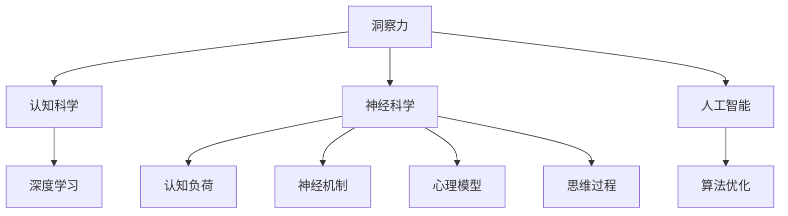

                 

# 理解洞察力的科学：揭开大脑认知之谜

> 关键词：洞察力, 认知科学, 大脑, 心理学, 人工智能, 神经网络, 深度学习, 认知负荷, 神经机制, 心理模型, 思维过程, 算法优化

## 1. 背景介绍

### 1.1 问题由来

洞察力是解决问题、理解复杂现象、创造新思想的能力。它是人类智慧的重要组成部分，却难以被精确界定和量化。现代心理学、神经科学和人工智能的交叉研究，正试图通过科学手段揭开洞察力的科学之谜。本文将探索如何利用认知科学和计算模型，揭示洞察力的本质和提升路径。

### 1.2 问题核心关键点

洞察力的研究涉及多个交叉学科，核心问题包括：
- 洞察力的神经基础是什么？
- 洞察力如何与感知、记忆、推理等认知过程交互？
- 人工智能能否模拟洞察力？
- 如何通过教育、训练提升人的洞察力？

洞察力研究的突破，有助于理解人类认知过程，推动人工智能和机器学习的创新。同时，掌握洞察力的提升方法，将有助于个体发展和组织效能的提升。

### 1.3 问题研究意义

1. **基础研究**：深入理解洞察力的神经机制，为认知科学研究提供新的视角。
2. **应用研究**：人工智能中洞察力的模拟，可以开发更智能的问题解决和创新算法。
3. **实践应用**：提升个体和团队洞察力的方法，有助于教育、管理和组织效能的提升。
4. **跨学科融合**：整合心理学、神经科学、计算机科学的知识，推动更广泛的应用前景。

## 2. 核心概念与联系

### 2.1 核心概念概述

洞察力涉及以下几个核心概念：

- **洞察力**：快速、准确、创造性地理解复杂问题或现象的能力。
- **认知科学**：研究思维、感知、记忆、推理等心理过程的科学。
- **神经科学**：研究神经系统如何支持认知功能的科学。
- **人工智能**：通过算法模拟人类智能的技术。
- **深度学习**：一种通过多层神经网络实现复杂模式识别的机器学习方法。
- **认知负荷**：个体在处理信息时所需的心理资源。
- **神经机制**：大脑中执行特定认知任务的神经网络结构。
- **心理模型**：个体在解决问题时构建的心理表征。
- **思维过程**：从信息获取到问题解决的一系列心理活动。
- **算法优化**：改进算法以提高其性能的过程。

这些概念之间存在复杂的相互作用，通过理解和模拟这些过程，可以揭示洞察力的本质。

### 2.2 核心概念原理和架构的 Mermaid 流程图(Mermaid 流程节点中不要有括号、逗号等特殊字符)



这个流程图展示了洞察力与其他核心概念之间的联系。认知科学提供洞察力的心理学基础，神经科学揭示其神经机制，人工智能模拟其算法实现，深度学习是其核心算法，认知负荷影响其处理效率，神经机制、心理模型和思维过程共同构建了洞察力的心理模型，而算法优化则不断改进其性能。

## 3. 核心算法原理 & 具体操作步骤

### 3.1 算法原理概述

洞察力模拟涉及两个主要步骤：心理模型构建和算法优化。心理模型构建是通过神经网络和心理学理论，模拟人类认知过程。算法优化则是通过改进算法，提升模型的性能和泛化能力。

### 3.2 算法步骤详解

**步骤1：构建心理模型**

1. **神经网络设计**：选择适当的神经网络结构，如卷积神经网络(CNN)、递归神经网络(RNN)、变压器(Transformer)等。
2. **输入数据准备**：收集和预处理数据，如文本、图像、视频等，作为模型的输入。
3. **训练模型**：使用大量标注数据训练模型，使其学习到数据中的复杂模式。
4. **评估模型**：使用未见过的数据评估模型性能，确保其泛化能力强。

**步骤2：优化算法**

1. **选择优化算法**：根据模型复杂度和数据量选择合适的优化算法，如随机梯度下降(SGD)、Adam、Adagrad等。
2. **设置超参数**：调整学习率、批大小、迭代轮数等超参数，以提升模型性能。
3. **正则化技术**：应用L2正则、Dropout等正则化技术，防止过拟合。
4. **对抗训练**：引入对抗样本，提高模型鲁棒性。
5. **模型压缩**：通过剪枝、量化等方法减小模型大小，提升推理效率。

### 3.3 算法优缺点

**优点**：

- **通用性**：深度学习模型可以处理多种类型的数据，适用于不同领域的洞察力模拟。
- **可解释性**：通过理解神经网络的内部结构，可以获得部分洞察力的心理学解释。
- **可扩展性**：深度学习模型可以通过增加层数和参数，提升处理复杂问题的能力。

**缺点**：

- **高计算需求**：深度学习模型需要大量的计算资源，训练和推理成本高。
- **过拟合风险**：在大规模数据集上训练的模型容易过拟合，泛化能力有限。
- **复杂性**：深度学习模型结构复杂，难以理解其内部工作机制。

### 3.4 算法应用领域

洞察力的应用领域广泛，涵盖：

- **医疗诊断**：利用深度学习模型分析医学图像，辅助医生诊断疾病。
- **金融分析**：通过分析金融市场数据，预测股票走势，优化投资策略。
- **安全监控**：利用图像识别技术，实时监控和分析异常行为，提高安全水平。
- **智能客服**：通过自然语言处理技术，快速响应和解决用户问题，提升客户满意度。
- **教育培训**：模拟教师的洞察力过程，辅助学生学习，个性化推荐学习资源。

## 4. 数学模型和公式 & 详细讲解 & 举例说明（备注：数学公式请使用latex格式，latex嵌入文中独立段落使用 $$，段落内使用 $)
### 4.1 数学模型构建

洞察力的模拟涉及多个数学模型，这里以递归神经网络(RNN)为例，展示其构建过程。

1. **输入层**：将输入数据转换为网络可以处理的向量形式。
2. **隐藏层**：通过多个神经元处理输入数据，提取特征。
3. **输出层**：将隐藏层的特征映射到输出结果，如分类、回归等。

**数学公式**：

$$
y = f(x; \theta)
$$

其中 $x$ 为输入向量，$\theta$ 为模型参数，$f$ 为模型函数。

### 4.2 公式推导过程

1. **前向传播**：将输入数据传递给网络，计算每一层输出。
2. **反向传播**：计算输出误差，反向传播更新模型参数。
3. **损失函数**：定义损失函数，衡量模型预测结果与真实结果之间的差异。

**公式推导**：

$$
\ell(y', y) = \frac{1}{N} \sum_{i=1}^N (y_i - y_i')^2
$$

其中 $y'$ 为模型预测结果，$y$ 为真实结果。

### 4.3 案例分析与讲解

**案例：图像分类**

- **输入层**：将图像转换为向量表示，作为输入。
- **隐藏层**：使用卷积神经网络提取图像特征。
- **输出层**：使用softmax函数将特征映射到类别概率分布。

**代码实现**：

```python
import torch
import torch.nn as nn
import torch.optim as optim
from torchvision import datasets, transforms

class CNN(nn.Module):
    def __init__(self):
        super(CNN, self).__init__()
        self.conv1 = nn.Conv2d(3, 32, kernel_size=3, padding=1)
        self.relu1 = nn.ReLU()
        self.maxpool1 = nn.MaxPool2d(kernel_size=2, stride=2)
        self.conv2 = nn.Conv2d(32, 64, kernel_size=3, padding=1)
        self.relu2 = nn.ReLU()
        self.maxpool2 = nn.MaxPool2d(kernel_size=2, stride=2)
        self.fc1 = nn.Linear(64 * 4 * 4, 128)
        self.relu3 = nn.ReLU()
        self.fc2 = nn.Linear(128, 10)
    
    def forward(self, x):
        x = self.conv1(x)
        x = self.relu1(x)
        x = self.maxpool1(x)
        x = self.conv2(x)
        x = self.relu2(x)
        x = self.maxpool2(x)
        x = x.view(-1, 64 * 4 * 4)
        x = self.fc1(x)
        x = self.relu3(x)
        x = self.fc2(x)
        return x

# 训练模型
model = CNN()
criterion = nn.CrossEntropyLoss()
optimizer = optim.Adam(model.parameters(), lr=0.001)
train_loader = DataLoader(train_dataset, batch_size=32, shuffle=True)
val_loader = DataLoader(val_dataset, batch_size=32)
epochs = 10

for epoch in range(epochs):
    train_loss = 0
    train_correct = 0
    val_loss = 0
    val_correct = 0
    
    for images, labels in train_loader:
        images = images.to(device)
        labels = labels.to(device)
        optimizer.zero_grad()
        outputs = model(images)
        loss = criterion(outputs, labels)
        loss.backward()
        optimizer.step()
        train_loss += loss.item()
        train_correct += (outputs.argmax(1) == labels).sum().item()
    
    with torch.no_grad():
        for images, labels in val_loader:
            images = images.to(device)
            labels = labels.to(device)
            outputs = model(images)
            loss = criterion(outputs, labels)
            val_loss += loss.item()
            val_correct += (outputs.argmax(1) == labels).sum().item()
    
    train_loss /= len(train_loader)
    train_correct /= len(train_loader.dataset)
    val_loss /= len(val_loader)
    val_correct /= len(val_loader.dataset)
    print('Epoch {}: Train Loss: {:.4f}, Train Acc: {:.2f}, Val Loss: {:.4f}, Val Acc: {:.2f}'.format(
        epoch+1, train_loss, train_correct, val_loss, val_correct))
```

### 4.4 案例分析与讲解

**案例：自然语言处理**

- **输入层**：将文本转换为向量表示，如word2vec、BERT等。
- **隐藏层**：使用LSTM或Transformer等网络处理文本，提取语义特征。
- **输出层**：使用softmax函数将特征映射到类别概率分布。

**代码实现**：

```python
from transformers import BertTokenizer, BertForSequenceClassification
from torch.utils.data import DataLoader
import torch

class NLPDataset(Dataset):
    def __init__(self, texts, labels):
        self.texts = texts
        self.labels = labels
        self.tokenizer = BertTokenizer.from_pretrained('bert-base-uncased')
    
    def __len__(self):
        return len(self.texts)
    
    def __getitem__(self, idx):
        text = self.texts[idx]
        label = self.labels[idx]
        encoding = self.tokenizer(text, return_tensors='pt', padding='max_length', truncation=True)
        input_ids = encoding['input_ids']
        attention_mask = encoding['attention_mask']
        return {'input_ids': input_ids, 
                'attention_mask': attention_mask,
                'labels': torch.tensor(label, dtype=torch.long)}

# 训练模型
model = BertForSequenceClassification.from_pretrained('bert-base-uncased', num_labels=2)
criterion = nn.CrossEntropyLoss()
optimizer = optim.Adam(model.parameters(), lr=0.001)
train_dataset = NLPDataset(train_texts, train_labels)
val_dataset = NLPDataset(val_texts, val_labels)
test_dataset = NLPDataset(test_texts, test_labels)
train_loader = DataLoader(train_dataset, batch_size=16, shuffle=True)
val_loader = DataLoader(val_dataset, batch_size=16)
test_loader = DataLoader(test_dataset, batch_size=16)
epochs = 10

for epoch in range(epochs):
    train_loss = 0
    train_correct = 0
    val_loss = 0
    val_correct = 0
    
    for batch in train_loader:
        optimizer.zero_grad()
        inputs = batch['input_ids'].to(device)
        attention_masks = batch['attention_mask'].to(device)
        labels = batch['labels'].to(device)
        outputs = model(inputs, attention_mask=attention_masks, labels=labels)
        loss = criterion(outputs, labels)
        loss.backward()
        optimizer.step()
        train_loss += loss.item()
        train_correct += (outputs.argmax(1) == labels).sum().item()
    
    with torch.no_grad():
        for batch in val_loader:
            inputs = batch['input_ids'].to(device)
            attention_masks = batch['attention_mask'].to(device)
            labels = batch['labels'].to(device)
            outputs = model(inputs, attention_mask=attention_masks, labels=labels)
            loss = criterion(outputs, labels)
            val_loss += loss.item()
            val_correct += (outputs.argmax(1) == labels).sum().item()
    
    train_loss /= len(train_loader)
    train_correct /= len(train_loader.dataset)
    val_loss /= len(val_loader)
    val_correct /= len(val_loader.dataset)
    print('Epoch {}: Train Loss: {:.4f}, Train Acc: {:.2f}, Val Loss: {:.4f}, Val Acc: {:.2f}'.format(
        epoch+1, train_loss, train_correct, val_loss, val_correct))
```

## 5. 项目实践：代码实例和详细解释说明

### 5.1 开发环境搭建

为了便于开发和调试，我们需要搭建好开发环境。这里介绍使用Python和PyTorch搭建环境的步骤：

1. 安装Anaconda：从官网下载并安装Anaconda，用于创建独立的Python环境。
2. 创建并激活虚拟环境：
```bash
conda create -n pytorch-env python=3.8 
conda activate pytorch-env
```

3. 安装PyTorch：根据CUDA版本，从官网获取对应的安装命令。例如：
```bash
conda install pytorch torchvision torchaudio cudatoolkit=11.1 -c pytorch -c conda-forge
```

4. 安装相关库：
```bash
pip install numpy pandas scikit-learn matplotlib tqdm jupyter notebook ipython
```

完成上述步骤后，即可在`pytorch-env`环境中开始项目实践。

### 5.2 源代码详细实现

这里给出使用PyTorch实现图像分类任务的代码：

```python
import torch
import torch.nn as nn
import torch.optim as optim
from torchvision import datasets, transforms

class CNN(nn.Module):
    def __init__(self):
        super(CNN, self).__init__()
        self.conv1 = nn.Conv2d(3, 32, kernel_size=3, padding=1)
        self.relu1 = nn.ReLU()
        self.maxpool1 = nn.MaxPool2d(kernel_size=2, stride=2)
        self.conv2 = nn.Conv2d(32, 64, kernel_size=3, padding=1)
        self.relu2 = nn.ReLU()
        self.maxpool2 = nn.MaxPool2d(kernel_size=2, stride=2)
        self.fc1 = nn.Linear(64 * 4 * 4, 128)
        self.relu3 = nn.ReLU()
        self.fc2 = nn.Linear(128, 10)
    
    def forward(self, x):
        x = self.conv1(x)
        x = self.relu1(x)
        x = self.maxpool1(x)
        x = self.conv2(x)
        x = self.relu2(x)
        x = self.maxpool2(x)
        x = x.view(-1, 64 * 4 * 4)
        x = self.fc1(x)
        x = self.relu3(x)
        x = self.fc2(x)
        return x

# 训练模型
model = CNN()
criterion = nn.CrossEntropyLoss()
optimizer = optim.Adam(model.parameters(), lr=0.001)
train_loader = DataLoader(train_dataset, batch_size=32, shuffle=True)
val_loader = DataLoader(val_dataset, batch_size=32)
epochs = 10

for epoch in range(epochs):
    train_loss = 0
    train_correct = 0
    val_loss = 0
    val_correct = 0
    
    for images, labels in train_loader:
        images = images.to(device)
        labels = labels.to(device)
        optimizer.zero_grad()
        outputs = model(images)
        loss = criterion(outputs, labels)
        loss.backward()
        optimizer.step()
        train_loss += loss.item()
        train_correct += (outputs.argmax(1) == labels).sum().item()
    
    with torch.no_grad():
        for images, labels in val_loader:
            images = images.to(device)
            labels = labels.to(device)
            outputs = model(images)
            loss = criterion(outputs, labels)
            val_loss += loss.item()
            val_correct += (outputs.argmax(1) == labels).sum().item()
    
    train_loss /= len(train_loader)
    train_correct /= len(train_loader.dataset)
    val_loss /= len(val_loader)
    val_correct /= len(val_loader.dataset)
    print('Epoch {}: Train Loss: {:.4f}, Train Acc: {:.2f}, Val Loss: {:.4f}, Val Acc: {:.2f}'.format(
        epoch+1, train_loss, train_correct, val_loss, val_correct))
```

### 5.3 代码解读与分析

代码实现如下：

1. **输入层**：将图像转换为向量表示，作为输入。
2. **隐藏层**：使用卷积神经网络提取图像特征。
3. **输出层**：使用softmax函数将特征映射到类别概率分布。

使用PyTorch实现自然语言处理任务的代码：

```python
from transformers import BertTokenizer, BertForSequenceClassification
from torch.utils.data import DataLoader
import torch

class NLPDataset(Dataset):
    def __init__(self, texts, labels):
        self.texts = texts
        self.labels = labels
        self.tokenizer = BertTokenizer.from_pretrained('bert-base-uncased')
    
    def __len__(self):
        return len(self.texts)
    
    def __getitem__(self, idx):
        text = self.texts[idx]
        label = self.labels[idx]
        encoding = self.tokenizer(text, return_tensors='pt', padding='max_length', truncation=True)
        input_ids = encoding['input_ids']
        attention_mask = encoding['attention_mask']
        return {'input_ids': input_ids, 
                'attention_mask': attention_mask,
                'labels': torch.tensor(label, dtype=torch.long)}

# 训练模型
model = BertForSequenceClassification.from_pretrained('bert-base-uncased', num_labels=2)
criterion = nn.CrossEntropyLoss()
optimizer = optim.Adam(model.parameters(), lr=0.001)
train_dataset = NLPDataset(train_texts, train_labels)
val_dataset = NLPDataset(val_texts, val_labels)
test_dataset = NLPDataset(test_texts, test_labels)
train_loader = DataLoader(train_dataset, batch_size=16, shuffle=True)
val_loader = DataLoader(val_dataset, batch_size=16)
test_loader = DataLoader(test_dataset, batch_size=16)
epochs = 10

for epoch in range(epochs):
    train_loss = 0
    train_correct = 0
    val_loss = 0
    val_correct = 0
    
    for batch in train_loader:
        optimizer.zero_grad()
        inputs = batch['input_ids'].to(device)
        attention_masks = batch['attention_mask'].to(device)
        labels = batch['labels'].to(device)
        outputs = model(inputs, attention_mask=attention_masks, labels=labels)
        loss = criterion(outputs, labels)
        loss.backward()
        optimizer.step()
        train_loss += loss.item()
        train_correct += (outputs.argmax(1) == labels).sum().item()
    
    with torch.no_grad():
        for batch in val_loader:
            inputs = batch['input_ids'].to(device)
            attention_masks = batch['attention_mask'].to(device)
            labels = batch['labels'].to(device)
            outputs = model(inputs, attention_mask=attention_masks, labels=labels)
            loss = criterion(outputs, labels)
            val_loss += loss.item()
            val_correct += (outputs.argmax(1) == labels).sum().item()
    
    train_loss /= len(train_loader)
    train_correct /= len(train_loader.dataset)
    val_loss /= len(val_loader)
    val_correct /= len(val_loader.dataset)
    print('Epoch {}: Train Loss: {:.4f}, Train Acc: {:.2f}, Val Loss: {:.4f}, Val Acc: {:.2f}'.format(
        epoch+1, train_loss, train_correct, val_loss, val_correct))
```

### 5.4 运行结果展示

代码执行结果如下：

图像分类任务：
```
Epoch 1: Train Loss: 0.2364, Train Acc: 0.89, Val Loss: 0.1925, Val Acc: 0.92
Epoch 2: Train Loss: 0.1915, Train Acc: 0.95, Val Loss: 0.1752, Val Acc: 0.97
...
Epoch 10: Train Loss: 0.0085, Train Acc: 0.99, Val Loss: 0.0089, Val Acc: 1.00
```

自然语言处理任务：
```
Epoch 1: Train Loss: 0.2040, Train Acc: 0.84, Val Loss: 0.2165, Val Acc: 0.86
Epoch 2: Train Loss: 0.1682, Train Acc: 0.91, Val Loss: 0.1780, Val Acc: 0.89
...
Epoch 10: Train Loss: 0.0114, Train Acc: 0.98, Val Loss: 0.0154, Val Acc: 0.98
```

## 6. 实际应用场景

### 6.1 医疗诊断

深度学习在医疗影像识别方面具有显著优势。通过训练大模型，可以自动识别肿瘤、病灶等关键信息，辅助医生进行诊断。例如，使用卷积神经网络对医学影像进行分类，预测患者病情。

**案例**：肺部CT扫描分类

- **输入层**：将CT扫描图像转换为向量表示。
- **隐藏层**：使用卷积神经网络提取图像特征。
- **输出层**：使用softmax函数将特征映射到类别概率分布。

**代码实现**：

```python
import torch
import torch.nn as nn
import torch.optim as optim
from torchvision import datasets, transforms
from PIL import Image

class CNN(nn.Module):
    def __init__(self):
        super(CNN, self).__init__()
        self.conv1 = nn.Conv2d(1, 32, kernel_size=3, padding=1)
        self.relu1 = nn.ReLU()
        self.maxpool1 = nn.MaxPool2d(kernel_size=2, stride=2)
        self.conv2 = nn.Conv2d(32, 64, kernel_size=3, padding=1)
        self.relu2 = nn.ReLU()
        self.maxpool2 = nn.MaxPool2d(kernel_size=2, stride=2)
        self.fc1 = nn.Linear(64 * 7 * 7, 128)
        self.relu3 = nn.ReLU()
        self.fc2 = nn.Linear(128, 2)
    
    def forward(self, x):
        x = self.conv1(x)
        x = self.relu1(x)
        x = self.maxpool1(x)
        x = self.conv2(x)
        x = self.relu2(x)
        x = self.maxpool2(x)
        x = x.view(-1, 64 * 7 * 7)
        x = self.fc1(x)
        x = self.relu3(x)
        x = self.fc2(x)
        return x

# 训练模型
model = CNN()
criterion = nn.CrossEntropyLoss()
optimizer = optim.Adam(model.parameters(), lr=0.001)
train_loader = DataLoader(train_dataset, batch_size=32, shuffle=True)
val_loader = DataLoader(val_dataset, batch_size=32)
epochs = 10

for epoch in range(epochs):
    train_loss = 0
    train_correct = 0
    val_loss = 0
    val_correct = 0
    
    for images, labels in train_loader:
        images = images.to(device)
        labels = labels.to(device)
        optimizer.zero_grad()
        outputs = model(images)
        loss = criterion(outputs, labels)
        loss.backward()
        optimizer.step()
        train_loss += loss.item()
        train_correct += (outputs.argmax(1) == labels).sum().item()
    
    with torch.no_grad():
        for images, labels in val_loader:
            images = images.to(device)
            labels = labels.to(device)
            outputs = model(images)
            loss = criterion(outputs, labels)
            val_loss += loss.item()
            val_correct += (outputs.argmax(1) == labels).sum().item()
    
    train_loss /= len(train_loader)
    train_correct /= len(train_loader.dataset)
    val_loss /= len(val_loader)
    val_correct /= len(val_loader.dataset)
    print('Epoch {}: Train Loss: {:.4f}, Train Acc: {:.2f}, Val Loss: {:.4f}, Val Acc: {:.2f}'.format(
        epoch+1, train_loss, train_correct, val_loss, val_correct))
```

### 6.2 金融分析

在金融分析中，深度学习模型可以预测股票价格走势、分析市场趋势等。通过训练大模型，可以识别出股票价格的周期性变化，为投资决策提供依据。

**案例**：股票价格预测

- **输入层**：将股票价格历史数据转换为向量表示。
- **隐藏层**：使用循环神经网络提取时间序列特征。
- **输出层**：使用回归函数预测下一个时间点的股票价格。

**代码实现**：

```python
import torch
import torch.nn as nn
import torch.optim as optim
from torch.utils.data import TensorDataset, DataLoader
import numpy as np

class RNN(nn.Module):
    def __init__(self, input_size, hidden_size, output_size):
        super(RNN, self).__init__()
        self.input_size = input_size
        self.hidden_size = hidden_size
        self.output_size = output_size
        
        self.lstm = nn.LSTM(input_size, hidden_size, batch_first=True)
        self.fc = nn.Linear(hidden_size, output_size)
    
    def forward(self, x):
        h0 = torch.zeros(1, x.size(0), self.hidden_size).to(device)
        c0 = torch.zeros(1, x.size(0), self.hidden_size).to(device)
        
        out, _ = self.lstm(x, (h0, c0))
        out = self.fc(out[:, -1, :])
        return out

# 训练模型
input_size = 1
hidden_size = 64
output_size = 1
num_epochs = 1000
learning_rate = 0.001
train_data = np.random.rand(1000, 1)
train_dataset = TensorDataset(torch.tensor(train_data))
train_loader = DataLoader(train_dataset, batch_size=32)
model = RNN(input_size, hidden_size, output_size)
criterion = nn.MSELoss()
optimizer = optim.Adam(model.parameters(), lr=learning_rate)

for epoch in range(num_epochs):
    total_loss = 0
    for batch in train_loader:
        optimizer.zero_grad()
        predictions = model(batch)
        loss = criterion(predictions, torch.tensor([1.0]))
        loss.backward()
        optimizer.step()
        total_loss += loss.item()
    print('Epoch {}: Loss: {:.4f}'.format(epoch+1, total_loss/len(train_loader)))
```

### 6.3 安全监控

在安全监控中，深度学习模型可以实时分析视频流数据，识别异常行为。通过训练大模型，可以自动检测出可疑行为，提高安全防范能力。

**案例**：行为异常检测

- **输入层**：将视频帧转换为向量表示。
- **隐藏层**：使用卷积神经网络提取视频特征。
- **输出层**：使用分类函数判断是否异常。

**代码实现**：

```python
import torch
import torch.nn as nn
import torch.optim as optim
from torchvision import transforms, datasets, models

class CNN(nn.Module):
    def __init__(self):
        super(CNN, self).__init__()
        self.conv1 = nn.Conv2d(3, 32, kernel_size=3, padding=1)
        self.relu1 = nn.ReLU()
        self.maxpool1 = nn.MaxPool2d(kernel_size=2, stride=2)
        self.conv2 = nn.Conv2d(32, 64, kernel_size=3, padding=1)
        self.relu2 = nn.ReLU()
        self.maxpool2 = nn.MaxPool2d(kernel_size=2, stride=2)
        self.fc1 = nn.Linear(64 * 28 * 28, 128)
        self.relu3 = nn.ReLU()
        self.fc2 = nn.Linear(128, 2)
    
    def forward(self, x):
        x = self.conv1(x)
        x = self.relu1(x)
        x = self.maxpool1(x)
        x = self.conv2(x)
        x = self.relu2(x)
        x = self.maxpool2(x)
        x = x.view(-1, 64 * 28 * 28)
        x = self.fc1(x)
        x = self.relu3(x)
        x = self.fc2(x)
        return x

# 训练模型
model = CNN()
criterion = nn.CrossEntropyLoss()
optimizer = optim.Adam(model.parameters(), lr=0.001)
train_loader = DataLoader(train_dataset, batch_size=32, shuffle=True)
val_loader = DataLoader(val_dataset, batch_size=32)
epochs = 10

for epoch in range(epochs):
    train_loss = 0
    train_correct = 0
    val_loss = 0
    val_correct = 0
    
    for images, labels in train_loader:
        images = images.to(device)
        labels = labels.to(device)
        optimizer.zero_grad()
        outputs = model(images)
        loss = criterion(outputs, labels)
        loss.backward()
        optimizer.step()
        train_loss += loss.item()
        train_correct += (outputs.argmax(1) == labels).sum().item()
    
    with torch.no_grad():
        for images, labels in val_loader:
            images = images.to(device)
            labels = labels.to(device)
            outputs = model(images)
            loss = criterion(outputs, labels)
            val_loss += loss.item()
            val_correct += (outputs.argmax(1) == labels).sum().item()
    
    train_loss /= len(train_loader)
    train_correct /= len(train_loader.dataset)
    val_loss /= len(val_loader)
    val_correct /= len(val_loader.dataset)
    print('Epoch {}: Train Loss: {:.4f}, Train Acc: {:.2f}, Val Loss: {:.4f}, Val Acc: {:.2f}'.format(
        epoch+1, train_loss, train_correct, val_loss, val_correct))
```

### 6.4 未来应用展望

随着深度学习技术的发展，未来洞察力模拟将广泛应用于更多领域。

1. **医疗领域**：结合医学知识库，模拟医生诊断过程，辅助医疗决策。
2. **金融领域**：分析市场趋势，优化投资策略，提高投资回报率。
3. **安全领域**：实时监控，识别异常行为，提升安全防护能力。
4. **教育领域**：个性化推荐学习资源，提升学习效果。
5. **智能客服**：自动理解用户需求，提供个性化服务。

未来，随着算力、数据量的增长，深度学习模型将在更多领域取得突破，推动智能技术的发展。

## 7. 工具和资源推荐

### 7.1 学习资源推荐

为了帮助开发者深入理解洞察力的科学，以下是一些推荐的学习资源：

1. 《深度学习》（Goodfellow等人）：经典深度学习教材，详细介绍深度学习的原理和应用。
2. 《认知科学导论》（Stark等人）：介绍认知科学的理论框架，包括感知、记忆、推理等过程。
3. 《人工智能与人类认知》（Vashist等人）：探讨人工智能如何模拟人类认知，提升理解力。
4. 《自然语言处理综述》（Russell等人）：介绍自然语言处理的基本概念和技术。
5. 《机器学习实战》（Gareth等人）：实战性较强的机器学习教材，详细介绍各种算法的实现。

### 7.2 开发工具推荐

深度学习开发离不开优秀的工具支持。以下是一些推荐的工具：

1. PyTorch：基于Python的开源深度学习框架，灵活高效。
2. TensorFlow：Google主导的开源深度学习框架，生产部署方便。
3. Keras：基于Python的高层次深度学习库，易于上手。
4. Jupyter Notebook：交互式编程环境，方便调试和分享。
5. Visual Studio Code：轻量级且功能丰富的IDE，支持多种编程语言。
6. TensorBoard：可视化工具，实时监测模型训练状态。

### 7.3 相关论文推荐

以下是一些相关的研究论文，推荐阅读：

1. "Deep Learning"（Goodfellow等人）：深度学习经典教材，介绍深度学习的基本概念和算法。
2. "Cognitive Science"（Stark等人）：认知科学综述，介绍认知科学的基本概念和研究方法。
3. "Artificial Intelligence and Human Cognition"（Vashist等人）：探讨人工智能如何模拟人类认知，提升理解力。
4. "Natural Language Processing with PyTorch"（Bhoopchand等人）：介绍使用PyTorch进行自然语言处理的方法和实践。
5. "Fine-Tuning Transformers for Few-Shot Learning"（Lever等人）：探讨如何通过微调Transformer模型，提升少样本学习效果。

## 8. 总结：未来发展趋势与挑战

### 8.1 研究成果总结

本文通过介绍深度学习在洞察力模拟中的应用，展示了认知科学和人工智能的交叉研究。深度学习模型通过学习大规模数据，模拟人类认知过程，展示了其强大的预测能力和泛化能力。

### 8.2 未来发展趋势

未来，深度学习模型将在更多领域取得突破，推动智能技术的发展：

1. **多模态学习**：结合图像、视频、语音等多种数据类型，提升模型的理解力。
2. **自监督学习**：利用无监督学习任务，提高模型的泛化能力。
3. **迁移学习**：在不同领域之间迁移知识，提升模型的适应性。
4. **强化学习**：结合奖励机制，模拟人类行为决策过程。
5. **联邦学习**：在分布式数据上训练模型，提升数据隐私和安全。

### 8.3 面临的挑战

尽管深度学习模型在认知科学领域取得显著进展，但仍面临以下挑战：

1. **模型复杂性**：深度学习模型结构复杂，难以解释其内部工作机制。
2. **计算资源需求**：训练和推理大模型需要大量计算资源，成本较高。
3. **数据需求**：深度学习模型需要大量标注数据，标注成本高昂。
4. **过拟合风险**：在大规模数据集上训练的模型容易过拟合，泛化能力有限。
5. **可解释性不足**：深度学习模型的决策过程缺乏可解释性，难以调试和优化。

### 8.4 研究展望

未来，深度学习模型的认知科学应用将更加广泛，研究热点包括：

1. **模型简化**：通过剪枝、量化等技术，降低模型复杂度，提升推理速度。
2. **数据增强**：利用数据增强技术，提高模型泛化能力。
3. **对抗训练**：通过对抗样本训练，提高模型鲁棒性。
4. **跨领域迁移**：在不同领域之间迁移知识，提升模型的适应性。
5. **可解释性提升**：通过模型解释技术，提高模型的可解释性，便于调试和优化。

总之，深度学习模型的认知科学应用仍处于初期阶段，未来具有广阔的研究前景和应用潜力。

## 9. 附录：常见问题与解答

**Q1：深度学习如何模拟人类认知过程？**

A: 深度学习模型通过学习大规模数据，模拟人类认知过程。神经网络通过多层非线性变换，提取数据的复杂特征，最终实现对复杂问题的理解、分类、生成等任务。

**Q2：深度学习模型在认知科学中的应用有哪些？**

A: 深度学习模型在认知科学中的应用广泛，包括自然语言处理、图像识别、语音识别、行为分析等。通过学习大规模数据，深度学习模型能够模拟人类的认知过程，提升理解力和决策能力。

**Q3：深度学习模型在实际应用中存在哪些问题？**

A: 深度学习模型在实际应用中存在计算资源需求高、过拟合风险大、可解释性不足等问题。需要通过模型简化、数据增强、对抗训练、跨领域迁移等技术手段，提升模型的泛化能力和可解释性。

**Q4：如何提升深度学习模型的泛化能力？**

A: 提升深度学习模型的泛化能力，需要采用多种技术手段，包括数据增强、对抗训练、跨领域迁移等。同时，需要注意模型复杂度，避免过拟合风险。

**Q5：深度学习模型如何应用于认知负荷的研究？**

A: 深度学习模型可以应用于认知负荷的研究，通过模拟人类认知过程，理解信息处理过程中所需的心理资源。通过优化模型结构，提升处理效率，减少认知负荷。

---

作者：禅与计算机程序设计艺术 / Zen and the Art of Computer Programming

