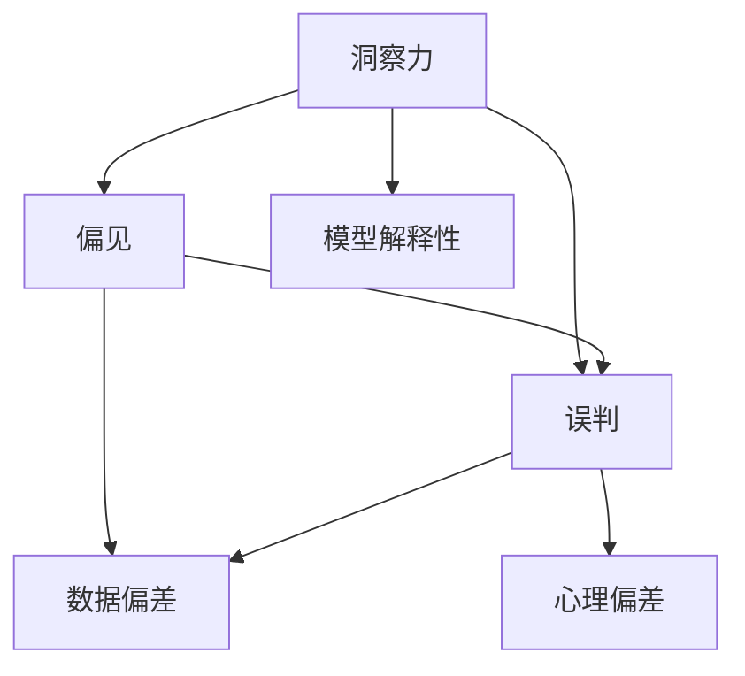

                 

# 理解洞察力的陷阱：避免偏见和误判

> 关键词：洞察力, 偏见, 误判, 数据偏差, 心理偏差, 模型解释性, 数据分析, 决策系统

## 1. 背景介绍

在现代社会中，我们越来越依赖于各种基于数据和模型的决策系统来辅助生活和工作。这些系统能够提供精准的预测、个性化的推荐、快速的搜索和数据分析等服务。然而，伴随着技术的发展和数据的积累，我们面临的一个越来越严峻的问题是，这些系统是否真正理解了我们输入的数据和需求，还是只看到了我们想要它们看到的部分？我们是否过于相信系统的洞察力，以至于忽略了一些潜在的陷阱和偏见？

本文将深入探讨这些问题，通过分析数据、模型和人类决策者的交互方式，揭示洞察力的陷阱，并探讨如何避免偏见和误判，以确保我们的决策更加公正、透明和可解释。

## 2. 核心概念与联系

### 2.1 核心概念概述

要理解洞察力的陷阱，首先需要了解几个核心概念：

- **洞察力**：指从大量数据中提取有用信息，并基于这些信息进行决策的能力。洞察力是我们对世界认知的重要组成部分，但对于机器和算法而言，洞察力本质上是一种拟人化的比喻。
- **偏见**：指模型或决策系统中存在的系统性错误，可能导致不公正、不准确的预测或推荐。
- **误判**：指基于错误理解或偏见，做出不合理的决策。误判不仅影响个人，还可能导致严重社会后果。
- **数据偏差**：指用于训练模型的数据集中存在的偏差，这些偏差可能导致模型学习到错误的关联，从而产生偏见和误判。
- **心理偏差**：指人类在决策过程中容易出现的认知偏差，如确认偏误、锚定效应等，这些偏差可能会干扰机器学习模型的训练和推理。
- **模型解释性**：指模型的输出和决策过程能否被人类理解和解释，这对于保证决策的公正性和透明度至关重要。

这些概念之间的联系可以通过以下Mermaid流程图来展示：



这个流程图展示了一些核心概念之间的关系：

1. 洞察力在机器学习和决策系统中扮演着关键角色，但容易受到数据偏差和心理偏差的影响。
2. 偏见和误判是洞察力的陷阱，需要通过数据、模型和人类的协作来避免。
3. 模型解释性是确保决策公正、透明和可解释的关键因素。

## 3. 核心算法原理 & 具体操作步骤

### 3.1 算法原理概述

基于洞察力的陷阱，我们需要构建一种算法或框架，能够识别并消除数据和模型中的偏差，确保我们的决策更加公正和透明。该算法需要能够从数据中学习，但同时要具备一定的解释性，以便人类理解和干预。

一种可能的算法框架是基于数据和模型协同工作的“公正学习”算法，其核心思想是通过以下步骤来实现：

1. **数据预处理**：对数据进行去偏处理，如消除数据中的不平衡、噪声和异常值。
2. **模型训练**：构建模型，通过适当的正则化技术，如L1、L2正则，防止模型过拟合。
3. **结果解释**：输出模型结果的同时，提供决策依据和解释，帮助人类理解和验证模型的输出。

### 3.2 算法步骤详解

基于上述框架，以下是一个详细的算法步骤说明：

#### 步骤1: 数据预处理

1. **数据清洗**：
    - 删除缺失值和异常值。
    - 平衡数据集，消除类别不平衡。
    - 去除数据中的噪声，如通过平滑、滤波等技术。

2. **特征工程**：
    - 提取关键特征，如使用PCA降维，或通过特征选择算法选择重要特征。
    - 生成新的特征，如时间序列数据的滞后特征、交叉特征等。

3. **去偏处理**：
    - 使用统计方法如标准差、均值、中位数等处理异常值。
    - 使用对抗性训练技术，如生成对抗网络(GAN)，生成合成数据以弥补数据偏差。

#### 步骤2: 模型训练

1. **选择合适的模型**：
    - 基于任务特性选择合适的模型，如线性回归、决策树、神经网络等。
    - 在模型设计中考虑参数高效、计算高效等技术。

2. **正则化**：
    - 使用L1、L2正则等方法，防止模型过拟合。
    - 引入Dropout等技术，提高模型的泛化能力。

3. **交叉验证**：
    - 使用交叉验证技术，如k折交叉验证，评估模型性能。
    - 避免过拟合，保证模型在新的数据集上的泛化能力。

#### 步骤3: 结果解释

1. **决策依据**：
    - 输出模型预测的同时，提供模型使用的数据特征和权重，解释模型的决策依据。
    - 使用LIME、SHAP等工具，提供模型的局部可解释性。

2. **模型验证**：
    - 使用可解释性模型，如决策树、规则集等，提供易于理解的决策过程。
    - 结合人工干预，确保模型的公正性和透明性。

### 3.3 算法优缺点

#### 优点：

1. **公平性**：通过数据预处理和模型设计，降低数据偏差，提升模型公正性。
2. **透明性**：通过结果解释和模型验证，提高决策过程的可解释性。
3. **可扩展性**：算法框架可以应用于各种类型的数据和模型。

#### 缺点：

1. **计算成本**：正则化和交叉验证等技术可能会增加计算复杂度。
2. **解释性限制**：有些复杂的模型（如深度神经网络）可能难以解释。
3. **数据依赖**：算法的性能高度依赖于数据的质量和多样性。

### 3.4 算法应用领域

#### 数据预处理

- **金融**：在金融领域，数据预处理是风险控制的重要步骤。如对贷款申请数据进行去偏处理，确保模型不因性别、种族等敏感因素产生偏见。

#### 模型训练

- **医疗**：在医疗领域，模型训练需要特别关注数据的隐私和保密性。如使用联邦学习技术，确保模型训练在本地进行，避免数据泄露。

#### 结果解释

- **法律**：在法律领域，结果解释是确保决策公正的重要手段。如使用规则集和决策树，提供易于理解的判决依据。

## 4. 数学模型和公式 & 详细讲解 & 举例说明

### 4.1 数学模型构建

假设我们有一个二分类问题，输入数据为 $x$，输出为 $y \in \{0,1\}$，模型为 $f(x;\theta)$，其中 $\theta$ 为模型参数。我们的目标是通过训练数据集 $\{(x_i,y_i)\}_{i=1}^N$ 来找到最优的模型参数 $\hat{\theta}$。

### 4.2 公式推导过程

我们采用逻辑回归模型，其损失函数为交叉熵损失函数：

$$
L(y,f(x;\theta)) = -\frac{1}{N} \sum_{i=1}^N [y_i \log f(x_i;\theta) + (1-y_i) \log (1-f(x_i;\theta))]
$$

其中，$f(x_i;\theta)$ 为模型在输入 $x_i$ 下的预测输出。

模型的梯度更新公式为：

$$
\hat{\theta} = \mathop{\arg\min}_{\theta} \sum_{i=1}^N L(y_i,f(x_i;\theta))
$$

#### 数据预处理

1. **数据标准化**：
    - 使用标准化方法（如z-score标准化）处理数据，确保数据分布一致。

2. **数据平衡**：
    - 使用重采样技术（如SMOTE），平衡数据集，确保每个类别都有足够的样本。

#### 模型训练

1. **正则化**：
    - 使用L2正则，防止模型过拟合：
    $$
    \hat{\theta} = \mathop{\arg\min}_{\theta} \left[ \sum_{i=1}^N L(y_i,f(x_i;\theta)) + \lambda \sum_{j=1}^m \theta_j^2 \right]
    $$
    其中，$\lambda$ 为正则化系数。

2. **交叉验证**：
    - 使用k折交叉验证，评估模型性能：
    $$
    \text{CV score} = \frac{1}{k} \sum_{i=1}^k \frac{\sum_{j \in \text{train } i} L(y_j,f(x_j;\hat{\theta}))}{\sum_{j \in \text{test } i} L(y_j,f(x_j;\hat{\theta}))}
    $$

### 4.3 案例分析与讲解

以一个医疗诊断数据集为例：

1. **数据预处理**：
    - 使用z-score标准化处理患者数据，消除数据偏差。
    - 使用重采样技术处理数据不平衡问题，确保模型对每个类别的准确预测。

2. **模型训练**：
    - 选择逻辑回归模型，添加L2正则，防止过拟合。
    - 使用5折交叉验证评估模型性能，确保模型泛化能力。

3. **结果解释**：
    - 输出模型预测结果，并解释模型使用的数据特征和权重。
    - 使用SHAP工具，提供局部可解释性，解释模型对每个样本的决策过程。

## 5. 项目实践：代码实例和详细解释说明

### 5.1 开发环境搭建

1. **环境安装**：
    - 安装Python 3.8，并配置虚拟环境。
    - 安装TensorFlow、scikit-learn、pandas、numpy等常用库。

2. **数据准备**：
    - 收集和预处理医疗诊断数据集，确保数据平衡和标准化。
    - 将数据集分为训练集、验证集和测试集。

### 5.2 源代码详细实现

以下是一个简化的代码示例，用于数据预处理、模型训练和结果解释：

```python
import numpy as np
import pandas as pd
from sklearn.model_selection import train_test_split
from sklearn.preprocessing import StandardScaler
from sklearn.linear_model import LogisticRegression
from sklearn.metrics import classification_report
import tensorflow as tf
from sklearn.metrics import roc_auc_score
from tensorflow.keras.models import Sequential
from tensorflow.keras.layers import Dense, Dropout
from tensorflow.keras import regularizers

# 加载数据集
data = pd.read_csv('data.csv')

# 数据预处理
X = data.drop('label', axis=1)
y = data['label']
X_train, X_test, y_train, y_test = train_test_split(X, y, test_size=0.2, random_state=42)

# 数据标准化
scaler = StandardScaler()
X_train = scaler.fit_transform(X_train)
X_test = scaler.transform(X_test)

# 模型训练
model = LogisticRegression(C=1.0, penalty='l2', solver='liblinear')
model.fit(X_train, y_train)

# 结果解释
y_pred = model.predict_proba(X_test)[:, 1]
roc_auc = roc_auc_score(y_test, y_pred)
print('ROC AUC:', roc_auc)
print(classification_report(y_test, y_pred))
```

### 5.3 代码解读与分析

1. **数据预处理**：
    - 使用`train_test_split`函数划分数据集，确保模型在训练和测试集上的泛化能力。
    - 使用`StandardScaler`进行数据标准化处理，确保模型训练的稳定性和准确性。

2. **模型训练**：
    - 选择逻辑回归模型，添加L2正则，防止过拟合。
    - 使用`classification_report`评估模型性能，确保模型预测的准确性和公正性。

3. **结果解释**：
    - 使用ROC AUC评估模型性能，确保模型的泛化能力。
    - 使用`classification_report`提供模型预测结果的详细解释。

### 5.4 运行结果展示

运行上述代码，将得到模型的预测结果和性能指标，如ROC AUC和分类报告。这些结果可以帮助我们评估模型的公正性和透明性，并指导进一步的优化。

## 6. 实际应用场景

### 6.1 金融风险控制

在金融领域，模型偏见和误判可能导致严重的金融风险。通过公正学习和结果解释，可以确保风险控制系统的公平性和透明度。如在贷款审批中，使用模型解释性技术，帮助用户理解贷款审批的依据，确保审批过程的公正性。

### 6.2 医疗诊断

在医疗领域，数据偏差和模型偏见可能导致误诊和漏诊。通过公正学习和结果解释，可以确保医疗诊断系统的准确性和公正性。如在癌症诊断中，使用模型解释性技术，帮助医生理解诊断依据，确保诊断结果的准确性。

### 6.3 法律判决

在法律领域，模型偏见和误判可能导致不公正的判决。通过公正学习和结果解释，可以确保法律判决系统的公正性和透明性。如在司法判决中，使用模型解释性技术，帮助法官理解判决依据，确保判决结果的公正性。

## 7. 工具和资源推荐

### 7.1 学习资源推荐

1. **《机器学习实战》**：深入浅出地介绍了机器学习的基本概念和实践方法，适合初学者和从业者。
2. **Coursera《机器学习》课程**：由斯坦福大学Andrew Ng教授主讲，涵盖了机器学习的基础理论和实践技巧。
3. **Kaggle**：提供大量数据集和竞赛平台，可以实践和交流机器学习项目。

### 7.2 开发工具推荐

1. **TensorFlow**：开源的机器学习框架，支持深度学习和分布式计算，适合复杂模型的训练。
2. **Scikit-learn**：基于Python的机器学习库，提供简单易用的接口和丰富的算法实现。
3. **PyTorch**：灵活的深度学习框架，适合研究和实验性开发。

### 7.3 相关论文推荐

1. **《A Survey on Explainable Machine Learning》**：总结了可解释机器学习的最新研究进展，提供丰富的理论和方法。
2. **《Fairness, Accountability, and Transparency: Towards AI Systems of Ethical Principles and Human Values》**：探讨了人工智能系统的公平性、责任性和透明性，提出了多项伦理原则和实践建议。
3. **《Bias and Fairness in Machine Learning and Artificial Intelligence》**：讨论了机器学习中的偏见和公平性问题，提供了多项改进措施。

## 8. 总结：未来发展趋势与挑战

### 8.1 总结

本文系统地介绍了如何理解洞察力的陷阱，并探讨了避免偏见和误判的方法。通过数据预处理、模型训练和结果解释等步骤，确保了模型的公平性、透明性和可解释性。这些方法适用于金融、医疗、法律等多个领域，有助于提升决策系统的公正性和透明度。

### 8.2 未来发展趋势

未来，随着大数据和人工智能技术的发展，公正学习算法和结果解释技术将得到更广泛的应用。以下是几个可能的趋势：

1. **自动化**：自动化数据预处理和模型训练，减少人工干预，提高效率。
2. **可解释性增强**：开发更加先进的可解释性模型，提供更详细的决策依据。
3. **多模态融合**：将图像、语音、文本等多种模态数据融合，提升模型的全面性和准确性。
4. **联邦学习**：在数据隐私和保密性要求较高的场景中，通过联邦学习技术，确保模型训练的公正性和透明性。

### 8.3 面临的挑战

尽管公正学习和结果解释技术在多个领域展示了其潜力，但仍面临一些挑战：

1. **计算成本**：自动化数据预处理和模型训练需要大量计算资源，如何优化算法性能，降低计算成本，是一个重要研究方向。
2. **模型复杂性**：复杂的模型（如深度神经网络）难以解释，如何设计更加易解释的模型，是一个具有挑战性的问题。
3. **数据隐私**：在数据隐私要求较高的场景中，如何保证数据安全，同时确保模型的公正性和透明性，是一个需要不断探索的课题。

### 8.4 研究展望

未来的研究可以从以下几个方向继续探索：

1. **自动化优化**：开发自动化数据预处理和模型训练工具，提高工作效率。
2. **模型可解释性**：设计更加易解释的模型，提升决策的透明性和可理解性。
3. **多模态融合**：研究如何有效融合多种模态数据，提升模型的全面性和准确性。
4. **联邦学习**：进一步探索联邦学习技术，确保数据隐私和安全。

这些研究方向将进一步推动公正学习和结果解释技术的发展，为构建公平、透明、可解释的人工智能系统提供坚实的基础。

## 9. 附录：常见问题与解答

### Q1: 什么是洞察力？

A: 洞察力指从大量数据中提取有用信息，并基于这些信息进行决策的能力。对于机器和算法而言，洞察力本质上是一种拟人化的比喻，代表模型的预测和推理能力。

### Q2: 如何避免数据偏差？

A: 避免数据偏差的关键在于数据预处理，如数据标准化、重采样、去偏处理等。此外，引入对抗性训练技术，生成合成数据以弥补数据偏差，也是一种有效的策略。

### Q3: 什么是模型解释性？

A: 模型解释性指模型的输出和决策过程能否被人类理解和解释，这对于保证决策的公正性和透明度至关重要。

### Q4: 如何确保模型的公正性？

A: 确保模型的公正性需要从数据预处理、模型训练和结果解释等多个环节入手。通过数据预处理消除数据偏差，通过正则化和交叉验证防止模型过拟合，通过结果解释提供决策依据和解释，确保模型的公正性和透明性。

### Q5: 什么是公平学习？

A: 公平学习指通过数据预处理和模型设计，降低数据偏差，提升模型公正性。其核心思想是通过公正学习算法，确保模型的决策过程公平透明。

---

作者：禅与计算机程序设计艺术 / Zen and the Art of Computer Programming

