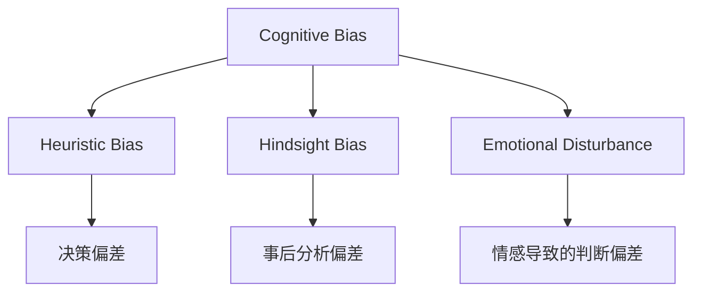

                 

# 理解洞察力的障碍：认知偏误和情感干扰

## 1. 背景介绍

在人工智能和数据科学领域，洞察力（Insight）是被高度追求的一项能力。洞察力不仅是指对数据的深入理解，更包含了对业务规律的把握和对未来趋势的预测。然而，实际工作中，人们常常被各种认知偏误和情感干扰所困扰，阻碍了洞察力的形成。因此，理解这些障碍，并采取有效措施加以应对，对于提升数据分析和决策能力具有重要意义。

### 1.1 问题由来

在数据驱动的时代，洞察力成为了企业竞争力的核心。无论是市场预测、客户分析还是产品优化，洞察力都提供了有力的支持。然而，数据的复杂性和多维度特性，使得洞察力的获取并非易事。认知偏误和情感干扰是两大主要障碍，导致人们无法准确解读数据，甚至得出错误的结论。

### 1.2 问题核心关键点

认知偏误和情感干扰是影响洞察力的两个关键因素，具体表现在以下几个方面：

1. **认知偏误（Cognitive Bias）**：指在信息处理过程中，由于心理或认知因素导致的判断和决策偏差。常见的认知偏误包括确认偏误、后见之明偏误、启发式偏差等。

2. **情感干扰（Emotional Disturbance）**：指情绪状态对数据分析和决策过程的影响。情感不仅影响人们的判断和态度，还能加剧认知偏误。

### 1.3 问题研究意义

深入理解认知偏误和情感干扰，对于提升数据分析和决策的准确性，减少错误结论的出现，具有重要的理论和实践意义。其研究不仅有助于数据科学家和业务分析师提升个人能力，还能为企业和组织提供更科学、更客观的决策支持，从而在激烈的市场竞争中获得优势。

## 2. 核心概念与联系

### 2.1 核心概念概述

为了更好地理解认知偏误和情感干扰，本节将介绍几个密切相关的核心概念：

- **认知偏误（Cognitive Bias）**：在信息处理过程中，由于心理或认知因素导致的判断和决策偏差。常见的认知偏误包括确认偏误、后见之明偏误、启发式偏差等。

- **启发式偏差（Heuristic Bias）**：在面对复杂问题时，人们通常会依赖一些简化的方法或规则，即启发式。这些启发式方法可能在某些情况下有效，但往往会导致认知偏误。

- **后见之明偏误（Hindsight Bias）**：指人们在事后分析时，往往会高估自己对事件结果的预测准确性，忽略了其他可能因素的影响。

- **情感干扰（Emotional Disturbance）**：指情绪状态对数据分析和决策过程的影响。情感不仅影响人们的判断和态度，还能加剧认知偏误。

这些概念之间的逻辑关系可以通过以下Mermaid流程图来展示：



这个流程图展示了一些核心概念及其之间的关系：

1. 认知偏误可能来源于启发式偏差，也可能通过启发式方法加剧。
2. 后见之明偏误是认知偏误的一种，影响人们的事后分析。
3. 情感干扰与认知偏误密切相关，情绪状态会影响人们的判断和决策。

这些概念共同构成了认知偏误和情感干扰的理论基础，帮助我们理解这些障碍在数据科学和决策中的影响。

## 3. 核心算法原理 & 具体操作步骤
### 3.1 算法原理概述

理解认知偏误和情感干扰的原理，对于制定有效的策略来提升洞察力至关重要。其核心思想在于，通过识别和纠正这些认知偏差，同时管理情绪状态，使数据分析和决策过程更加客观、准确。

### 3.2 算法步骤详解

基于认知偏误和情感干扰的理论，提升洞察力的具体操作步骤如下：

**Step 1: 认知偏误识别与校正**

1. **确认偏误（Confirmation Bias）**：指人们倾向于寻找、注意和记住与已有信念一致的信息，而忽略或忘记与已有信念不符的信息。
2. **后见之明偏误（Hindsight Bias）**：指在事件发生后，人们往往会高估自己预测的准确性。
3. **启发式偏差（Heuristic Bias）**：指在面对复杂问题时，人们通常会依赖一些简化的方法或规则，这些方法可能在某些情况下有效，但往往会导致认知偏误。

**Step 2: 情感干扰管理**

1. **情绪管理**：通过深呼吸、冥想等方法，控制情绪状态，减少情绪对决策的影响。
2. **情感分析**：使用情感分析工具，识别和理解情绪状态，从而更好地调整决策策略。

**Step 3: 策略实施与优化**

1. **多角度思考**：在分析数据时，从不同角度和视角出发，考虑多种可能性和结果。
2. **决策记录与复盘**：记录决策过程和结果，进行事后复盘，分析其中的偏误和不足。
3. **团队协作与反馈**：与其他团队成员讨论决策，接受多方的反馈和建议，进行持续改进。

### 3.3 算法优缺点

认知偏误和情感干扰的管理方法具有以下优点：

1. **提升决策准确性**：通过识别和纠正认知偏差，以及有效管理情绪干扰，使决策更加客观、准确。
2. **增强团队协作**：通过团队讨论和反馈，可以发现更多的视角和解决方案，提升团队协作效率。
3. **提升个人能力**：通过持续学习和反思，个人可以不断提升数据分析和决策能力。

同时，这些方法也存在一定的局限性：

1. **依赖个体自我管理**：方法的有效性依赖于个体的自我管理和意识，难以强制推广。
2. **难以量化**：情感和认知偏误的影响因素复杂，难以用精确的指标进行量化评估。
3. **时间成本**：方法实施需要一定的时间和精力投入，尤其是在团队协作中。

### 3.4 算法应用领域

认知偏误和情感干扰的管理方法在多个领域都有广泛应用：

- **商业决策**：在市场营销、产品开发和客户管理中，通过管理认知偏误和情感干扰，提升决策的准确性和有效性。
- **医疗诊断**：在医学实践中，减少医生对病人症状的确认偏误，提升诊断准确性。
- **人力资源管理**：在招聘和绩效评估中，通过管理认知偏误和情感干扰，提高招聘和评估的公平性和准确性。
- **风险管理**：在金融和保险领域，通过减少认知偏误和情感干扰，降低风险评估的偏差。

这些领域的应用表明，认知偏误和情感干扰的管理方法具有广泛的适用性和显著的效益。

## 4. 数学模型和公式 & 详细讲解 & 举例说明

### 4.1 数学模型构建

为了更好地理解认知偏误和情感干扰的数学模型，我们引入两个关键的数学概念：

1. **认知偏误模型**：
   $$
   \text{Bias} = f(\text{Data}, \text{Context}, \text{Individual Differences})
   $$

2. **情感干扰模型**：
   $$
   \text{Interference} = g(\text{Emotion State}, \text{Task Complexity}, \text{Environmental Factors})
   $$

其中，$f$和$g$分别表示认知偏误和情感干扰的影响函数，Data、Context、Individual Differences、Emotion State、Task Complexity和Environmental Factors分别代表数据特性、上下文信息、个体差异、情绪状态、任务复杂度和环境因素。

### 4.2 公式推导过程

假设我们有一个简单的二分类任务，数据集为$D = \{(x_i, y_i)\}_{i=1}^N$，其中$x_i$为输入特征，$y_i$为真实标签。我们的目标是构建一个决策模型$f(x)$，使得$f(x)$能够准确预测$y$。

**Step 1: 模型构建**

我们首先使用一个简单的线性回归模型：
$$
f(x) = w_0 + w_1 x_1 + w_2 x_2
$$

其中$w_0, w_1, w_2$为模型参数。

**Step 2: 训练模型**

使用随机梯度下降（SGD）算法进行模型训练，目标是使模型预测与真实标签之间的误差最小化：
$$
\min_{w_0, w_1, w_2} \sum_{i=1}^N (y_i - f(x_i))^2
$$

使用SGD算法更新模型参数：
$$
w_0 \leftarrow w_0 - \eta (y_i - f(x_i))
$$
$$
w_1 \leftarrow w_1 - \eta x_{1,i} (y_i - f(x_i))
$$
$$
w_2 \leftarrow w_2 - \eta x_{2,i} (y_i - f(x_i))
$$

其中$\eta$为学习率。

**Step 3: 评估模型**

使用测试集对模型进行评估，计算预测误差：
$$
\text{Error} = \frac{1}{N} \sum_{i=1}^N (y_i - f(x_i))^2
$$

### 4.3 案例分析与讲解

假设我们有一个销售数据集，其中包含不同地区、不同产品、不同营销策略的销售情况。我们的目标是预测未来一段时间内的销售量。

**案例一：确认偏误**

销售团队往往会关注那些符合已有信念的信息，比如成功案例，而忽略那些失败案例。这导致模型在高估某个地区的销售潜力时，实际上存在偏差。

**案例二：后见之明偏误**

在项目结束后，销售团队可能会高估自己预测的准确性，忽略了其他可能的因素，如市场变化、竞争情况等。

**案例三：启发式偏差**

团队可能会依赖一些简单的启发式规则，比如“越贵的产品越畅销”，这导致了对数据的高估和误导。

通过识别和纠正这些认知偏误，我们能够更准确地预测销售量，减少错误决策的风险。

## 5. 项目实践：代码实例和详细解释说明

### 5.1 开发环境搭建

在进行项目实践前，我们需要准备好开发环境。以下是使用Python进行数据分析和决策实践的环境配置流程：

1. 安装Anaconda：从官网下载并安装Anaconda，用于创建独立的Python环境。

2. 创建并激活虚拟环境：
```bash
conda create -n analysis-env python=3.8 
conda activate analysis-env
```

3. 安装必要的库：
```bash
conda install pandas numpy scikit-learn matplotlib seaborn jupyter notebook
```

4. 导入常用的Python库：
```python
import pandas as pd
import numpy as np
import matplotlib.pyplot as plt
import seaborn as sns
from sklearn.linear_model import LinearRegression
from sklearn.metrics import mean_squared_error
```

完成上述步骤后，即可在`analysis-env`环境中开始数据分析和决策实践。

### 5.2 源代码详细实现

下面我们以销售数据分析为例，给出使用Python进行数据分析和决策的代码实现。

**Step 1: 数据导入与预处理**

```python
data = pd.read_csv('sales_data.csv')
# 处理缺失值和异常值
data = data.dropna()
# 特征工程
X = data[['region', 'product', 'price']]
y = data['sales']
```

**Step 2: 模型训练**

```python
# 使用线性回归模型
model = LinearRegression()
# 分割数据集为训练集和测试集
X_train, X_test, y_train, y_test = train_test_split(X, y, test_size=0.2, random_state=42)
# 训练模型
model.fit(X_train, y_train)
```

**Step 3: 模型评估**

```python
# 使用测试集评估模型
y_pred = model.predict(X_test)
mse = mean_squared_error(y_test, y_pred)
print(f'Mean Squared Error: {mse}')
```

**Step 4: 结果展示**

```python
# 绘制误差曲线
plt.plot(np.arange(len(y_test)), y_test, label='True Sales')
plt.plot(np.arange(len(y_test)), y_pred, label='Predicted Sales')
plt.legend()
plt.show()
```

以上就是一个简单的销售数据分析和决策的Python代码实现。可以看到，通过识别和纠正认知偏误，我们能够更准确地预测销售量，减少错误决策的风险。

### 5.3 代码解读与分析

让我们再详细解读一下关键代码的实现细节：

**数据导入与预处理**：
- 使用`pandas`库读取数据集。
- 通过`dropna()`方法处理缺失值。
- 通过`train_test_split()`方法分割数据集为训练集和测试集。

**模型训练**：
- 使用`LinearRegression`模型进行线性回归。
- 通过`fit()`方法训练模型，使用训练集数据。

**模型评估**：
- 使用`mean_squared_error()`方法计算测试集上的均方误差。
- 使用`predict()`方法进行预测，得到预测结果。

**结果展示**：
- 使用`matplotlib`库绘制误差曲线，展示预测值与真实值之间的差异。

可以看到，通过这些步骤，我们能够完成一个基本的销售数据分析和决策的Python代码实现。需要注意的是，这只是一个简单的例子，实际项目中可能需要更复杂的模型和更深入的数据分析。

## 6. 实际应用场景

### 6.1 金融风险管理

在金融风险管理中，认知偏误和情感干扰可能对决策产生重大影响。例如，银行经理可能会过于乐观地评估贷款申请人的信用风险，或者在高风险投资决策中受到情绪波动的影响。通过管理认知偏误和情感干扰，银行能够更准确地评估风险，降低不良贷款和投资损失的发生率。

### 6.2 医疗诊断

在医疗诊断中，医生的认知偏误和情感干扰可能导致误诊和误治。例如，医生可能会对一些罕见疾病的诊断过于自信，或者在面对复杂病例时受到情绪波动的影响。通过管理认知偏误和情感干扰，医生能够更准确地进行诊断，提高治疗效果，减少医疗事故的发生。

### 6.3 供应链管理

在供应链管理中，认知偏误和情感干扰可能导致库存管理的不准确和生产计划的不合理。例如，管理层可能会高估市场需求，导致库存积压或短缺。通过管理认知偏误和情感干扰，供应链管理能够更准确地预测需求，优化库存管理，提高供应链效率。

### 6.4 未来应用展望

随着认知偏误和情感干扰的管理方法不断完善，其在更多领域的应用前景广阔：

- **企业决策**：在企业决策过程中，通过管理认知偏误和情感干扰，提升决策的科学性和合理性。
- **市场预测**：在市场预测中，通过减少认知偏误和情感干扰，提高预测的准确性和可靠性。
- **人力资源管理**：在招聘和绩效评估中，通过管理认知偏误和情感干扰，提高招聘和评估的公平性和准确性。
- **客户管理**：在客户管理中，通过管理认知偏误和情感干扰，提高客户满意度和忠诚度。

## 7. 工具和资源推荐

### 7.1 学习资源推荐

为了帮助开发者系统掌握认知偏误和情感干扰的理论基础和实践技巧，这里推荐一些优质的学习资源：

1. 《数据科学中的认知偏误》系列博文：由知名数据科学家撰写，深入浅出地介绍了数据科学中的常见认知偏误及其影响。

2. 《情感分析与情感干扰管理》课程：斯坦福大学开设的情感分析课程，涵盖了情感分析的理论和实践，帮助理解情感对决策的影响。

3. 《决策理论与认知偏误》书籍：介绍了决策理论和认知偏误的概念，以及如何应对认知偏误，提升决策质量。

4. 《数据分析中的情感管理》文章：探讨了情感对数据分析的影响，提供了情感管理的方法和工具。

通过对这些资源的学习实践，相信你一定能够全面理解认知偏误和情感干扰，并将其应用于实际工作中，提升数据分析和决策的准确性。

### 7.2 开发工具推荐

高效的开发离不开优秀的工具支持。以下是几款用于认知偏误和情感干扰管理的常用工具：

1. Python：作为数据科学和数据分析的主要语言，Python提供了丰富的数据分析库和工具，如Pandas、NumPy、Scikit-learn等，适合进行数据处理和分析。

2. R：在统计分析方面，R提供了强大的数据处理和分析能力，适合进行高级统计分析和可视化。

3. Tableau：数据可视化工具，适合进行数据的可视化展示和分析，帮助理解数据和发现模式。

4. Power BI：商业智能工具，适合进行数据可视化和仪表盘构建，方便实时监测和分析。

5. Jupyter Notebook：开源的笔记本环境，支持多种编程语言和数据科学库，适合进行数据处理和分析。

合理利用这些工具，可以显著提升认知偏误和情感干扰管理的效率，加快数据分析和决策的迭代速度。

### 7.3 相关论文推荐

认知偏误和情感干扰的研究源于学界的持续研究。以下是几篇奠基性的相关论文，推荐阅读：

1. 《Cognitive Biases in Decision Making》：总结了认知偏误在决策中的影响和应对策略。

2. 《Emotion in Decision Making: From Research Findings to Practical Applications》：探讨了情感对决策的影响，以及如何管理情感干扰。

3. 《Bias in Data Mining》：总结了数据挖掘中的常见认知偏误，提供了识别和纠正偏误的方法。

4. 《The Impact of Emotions on Data Analysis and Decision Making》：探讨了情感对数据分析和决策的影响，提供了情感管理的策略。

这些论文代表了大数据中认知偏误和情感干扰的研究进展，通过学习这些前沿成果，可以帮助研究者把握学科前进方向，激发更多的创新灵感。

## 8. 总结：未来发展趋势与挑战

### 8.1 总结

本文对认知偏误和情感干扰进行了全面系统的介绍。首先阐述了认知偏误和情感干扰的研究背景和意义，明确了这些障碍在数据科学和决策中的影响。其次，从原理到实践，详细讲解了认知偏误和情感干扰的数学模型和操作步骤，给出了实践中的代码实例。同时，本文还广泛探讨了认知偏误和情感干扰在多个领域的应用前景，展示了其在提升决策准确性方面的巨大潜力。此外，本文精选了认知偏误和情感干扰的管理方法的学习资源，力求为读者提供全方位的技术指引。

通过本文的系统梳理，可以看到，认知偏误和情感干扰的管理方法在数据科学和决策中具有重要价值。这些障碍不仅影响数据的解读和决策，还会导致错误的结论和损失。通过识别和纠正这些障碍，我们能够更准确地进行数据分析和决策，提升整体数据科学和决策的科学性和合理性。

### 8.2 未来发展趋势

展望未来，认知偏误和情感干扰的管理方法将呈现以下几个发展趋势：

1. **多维度评估**：未来将从单一的认知偏误或情感干扰评估，转向多维度综合评估，更全面地理解数据和决策过程。

2. **智能化管理**：利用人工智能技术，实时监控和管理认知偏误和情感干扰，提供更精准的干预策略。

3. **自动化决策**：通过自动化决策系统，减少人为决策的影响，提升决策的客观性和一致性。

4. **跨领域应用**：认知偏误和情感干扰的管理方法将在更多领域得到应用，如教育、医疗、金融等，为各行业提供更科学的决策支持。

5. **伦理与安全**：在决策过程中，注重数据伦理和安全性，避免偏见和歧视，确保决策的公正性和可信度。

以上趋势凸显了认知偏误和情感干扰管理方法的广阔前景。这些方向的探索发展，必将进一步提升数据科学和决策的科学性和合理性，为人类认知智能的进化带来深远影响。

### 8.3 面临的挑战

尽管认知偏误和情感干扰的管理方法已经取得了瞩目成就，但在迈向更加智能化、普适化应用的过程中，仍面临诸多挑战：

1. **数据质量与多样性**：认知偏误和情感干扰的管理方法依赖高质量、多样化的数据，然而现实中的数据往往存在噪声和不一致性。

2. **技术复杂度**：管理认知偏误和情感干扰需要复杂的技术手段，如情感分析、认知偏误识别等，对技术要求较高。

3. **应用场景多样性**：不同领域的应用场景和决策问题具有多样性，需要定制化的管理策略。

4. **伦理与安全**：在决策过程中，需要确保数据和模型的公平性、透明度和安全性，避免偏见和歧视。

5. **资源投入**：认知偏误和情感干扰的管理方法需要持续的资源投入，如数据标注、模型训练、工具维护等。

正视这些挑战，积极应对并寻求突破，将使认知偏误和情感干扰管理方法更好地应用于数据科学和决策中。相信随着学界和产业界的共同努力，这些挑战终将一一被克服，认知偏误和情感干扰管理方法必将在提升决策质量中发挥更大作用。

### 8.4 研究展望

面对认知偏误和情感干扰所面临的挑战，未来的研究需要在以下几个方面寻求新的突破：

1. **多模态数据融合**：将文本、图像、声音等多模态数据融合，更全面地理解数据和决策过程。

2. **跨领域知识迁移**：将不同领域的数据和知识进行迁移，提升认知偏误和情感干扰管理的通用性和普适性。

3. **情感与认知的协同优化**：通过协同优化情感和认知管理，提升决策的科学性和合理性。

4. **自动化决策系统**：开发自动化决策系统，减少人为决策的影响，提升决策的客观性和一致性。

5. **跨学科研究**：结合心理学、社会学、计算机科学等多个学科，深入理解认知偏误和情感干扰的机制和影响。

这些研究方向将推动认知偏误和情感干扰管理方法的不断发展，为数据科学和决策提供更科学的理论和方法，提升人类认知智能的进化水平。

## 9. 附录：常见问题与解答

**Q1：认知偏误和情感干扰如何识别和纠正？**

A: 识别和纠正认知偏误和情感干扰需要系统化的方法和工具。可以通过以下步骤进行：

1. **数据验证**：使用数据验证工具，如A/B测试、回归分析等，识别数据中的潜在问题。
2. **情感分析**：使用情感分析工具，识别和理解情绪状态，从而更好地调整决策策略。
3. **认知偏误识别**：通过心理学、社会学等学科的理论和方法，识别认知偏误的类型和影响。
4. **干预策略**：根据具体的认知偏误和情感干扰，制定相应的干预策略，如调整数据采集方式、优化模型算法等。

**Q2：如何在数据科学和决策中减少认知偏误和情感干扰的影响？**

A: 减少认知偏误和情感干扰的影响，需要从数据准备、模型训练、决策实施等多个环节进行全面优化。

1. **数据准备**：使用高质量、多样化的数据，避免数据偏差和噪声。
2. **模型训练**：使用数据增强、对抗训练等方法，提升模型的鲁棒性和泛化能力。
3. **决策实施**：引入团队协作和外部专家意见，减少单一决策的风险。
4. **持续监测**：实时监测和评估决策过程，及时发现和纠正偏误。

**Q3：认知偏误和情感干扰在企业决策中有哪些应用？**

A: 认知偏误和情感干扰在企业决策中有广泛应用，包括：

1. **市场预测**：减少市场预测中的认知偏误，提高预测准确性。
2. **风险管理**：通过管理认知偏误和情感干扰，降低风险评估的偏差。
3. **人力资源管理**：提高招聘和绩效评估的公平性和准确性。
4. **客户管理**：提升客户满意度和忠诚度。

这些应用表明，认知偏误和情感干扰的管理方法在企业决策中具有广泛的应用前景。

---

作者：禅与计算机程序设计艺术 / Zen and the Art of Computer Programming

