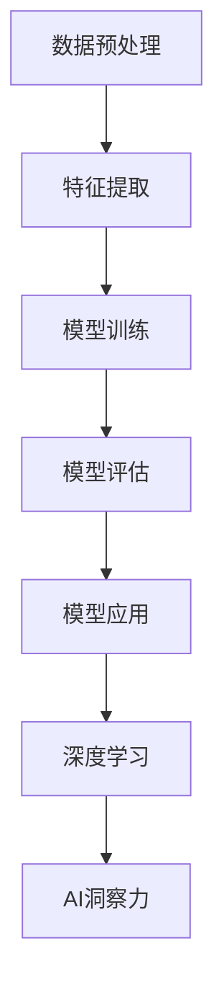

                 

# 理解洞察力：人类思维的制高点

## 1. 背景介绍

### 1.1 问题由来
在快速变化和信息爆炸的时代，洞察力成为人们掌握世界、解决复杂问题的关键。它不仅是一种直觉和预见，更是深入理解事物本质的能力。随着人工智能(AI)技术的发展，AI洞察力研究正在成为前沿领域，旨在通过机器学习、深度学习等技术，帮助人类获得更加精确、全面的洞察力。

### 1.2 问题核心关键点
AI洞察力研究的核心在于如何使机器能够像人类一样，具备理解复杂概念、发现模式、预测未来等能力。其关键点包括：
- 数据驱动：基于大规模数据训练模型，学习模式和规律。
- 模型构建：选择合适的算法和模型结构，实现对数据的精确表达。
- 特征工程：设计和提取有效特征，提升模型的学习效果。
- 训练优化：优化模型参数和超参数，提升模型性能。
- 应用部署：将训练好的模型集成到实际应用中，解决具体问题。

### 1.3 问题研究意义
AI洞察力研究对于提升人类认知、加速科技创新、推动经济发展具有重要意义：
- 提升决策质量：通过AI洞察力工具，决策者能够更全面、准确地理解问题本质，制定更科学的决策。
- 驱动创新：AI洞察力帮助企业发现未被发掘的市场机会，促进新产品的开发和迭代。
- 促进经济增长：AI洞察力优化供应链、提升运营效率，带动企业竞争力的提升，从而推动经济增长。
- 社会福祉：AI洞察力帮助政府优化公共服务、提升社会治理水平，提高人民生活质量。

## 2. 核心概念与联系

### 2.1 核心概念概述

为更好地理解AI洞察力研究，本节将介绍几个密切相关的核心概念：

- AI洞察力(AI Insight)：指机器通过学习海量数据，获得对问题的深层理解和洞察。AI洞察力不仅能发现数据中的模式和趋势，还能预测未来发展。

- 数据预处理(Preprocessing)：指对原始数据进行清洗、归一化、特征工程等处理，提升数据质量，为模型训练提供更可靠的基础。

- 特征提取(Feature Extraction)：从原始数据中提取对问题预测有帮助的特征，这些特征通常用于训练模型的输入。

- 模型训练(Model Training)：使用大量标注数据训练模型，优化模型参数，提升模型性能。

- 模型评估(Model Evaluation)：通过评估指标（如准确率、召回率、F1分数等）评估模型性能，确保模型在实际应用中能够稳定运行。

- 模型应用(Model Application)：将训练好的模型集成到具体应用场景中，解决实际问题。

- 深度学习(Deep Learning)：一类通过多层神经网络模型进行训练的机器学习方法，适用于处理复杂的非线性关系和抽象特征。

这些核心概念之间的逻辑关系可以通过以下Mermaid流程图来展示：



这个流程图展示了大语言模型的核心概念及其之间的关系：

1. 原始数据经过预处理，提取特征后输入模型训练。
2. 模型训练过程优化参数，提升预测准确性。
3. 训练好的模型通过评估确保其性能。
4. 模型应用于实际问题，实现洞察力。
5. 深度学习技术为模型训练提供强有力的工具。
6. 通过深度学习训练得到的模型能够实现AI洞察力。

这些概念共同构成了AI洞察力研究的框架，帮助机器从海量数据中提取有价值的信息，提升决策和预测能力。

## 3. 核心算法原理 & 具体操作步骤
### 3.1 算法原理概述

AI洞察力研究的基础是机器学习，特别是深度学习。其核心算法原理在于通过构建复杂的神经网络模型，从数据中学习复杂的模式和规律，进而实现对问题的深层理解和预测。

形式化地，假设训练数据集为 $D=\{(x_i, y_i)\}_{i=1}^N, x_i \in \mathcal{X}, y_i \in \mathcal{Y}$，其中 $\mathcal{X}$ 为输入空间，$\mathcal{Y}$ 为输出空间。目标是通过训练模型 $f: \mathcal{X} \rightarrow \mathcal{Y}$，最小化损失函数 $L(f)$，使模型在测试集 $D_{test}$ 上的表现最优：

$$
\min_{f \in F} L(f) = \frac{1}{N} \sum_{i=1}^N L(f(x_i),y_i)
$$

其中 $L$ 为损失函数，用于衡量模型预测输出与真实标签之间的差异。常见的损失函数包括均方误差损失、交叉熵损失等。

### 3.2 算法步骤详解

AI洞察力研究的算法步骤一般包括以下几个关键步骤：

**Step 1: 数据准备**
- 收集原始数据集 $D$，并进行预处理，清洗、归一化、特征提取等，确保数据质量。

**Step 2: 模型选择与设计**
- 选择合适的模型架构和算法，如卷积神经网络(CNN)、循环神经网络(RNN)、Transformer等，设计输入层、隐藏层和输出层等组件。
- 设定模型的超参数，如学习率、批大小、迭代轮数等。

**Step 3: 模型训练**
- 使用训练集 $D_{train}$ 进行模型训练，通过反向传播算法计算梯度，更新模型参数。
- 周期性在验证集 $D_{val}$ 上评估模型性能，根据性能指标决定是否触发 Early Stopping。
- 重复上述步骤直至满足预设的迭代轮数或 Early Stopping 条件。

**Step 4: 模型评估与优化**
- 在测试集 $D_{test}$ 上评估模型性能，对比模型在训练集和验证集上的表现。
- 通过调整模型结构和超参数，优化模型，提升其泛化性能。

**Step 5: 模型应用与部署**
- 将训练好的模型集成到实际应用中，如预测、分类、聚类、生成等。
- 设计良好的用户界面和交互流程，便于用户使用。

### 3.3 算法优缺点

AI洞察力研究的方法具有以下优点：
1. 数据驱动：AI洞察力方法能够从数据中学习规律和模式，无需手工设计特征。
2. 高效建模：深度学习模型能够处理高维度、非线性数据，适合解决复杂问题。
3. 泛化能力强：训练好的模型在未见过的数据上也能保持较好的表现。
4. 实时性：深度学习模型可以在大规模数据上进行训练，训练完成后实时应用于各种任务。

同时，该方法也存在一定的局限性：
1. 数据依赖：AI洞察力方法高度依赖数据的质量和数量，数据的偏差可能导致模型的不准确。
2. 模型复杂度高：深度学习模型参数量大，计算资源需求高。
3. 可解释性差：深度学习模型的决策过程复杂，难以解释其内部工作机制。
4. 训练时间长：深度学习模型训练需要大量时间，且收敛速度较慢。
5. 过拟合风险：深度学习模型容易过拟合，特别是在数据量不足的情况下。

尽管存在这些局限性，但AI洞察力研究依然是当前解决复杂问题的重要手段，尤其是在大数据和深度学习技术的支持下。未来相关研究的重点在于如何进一步降低数据依赖，提高模型的可解释性和实时性。

### 3.4 算法应用领域

AI洞察力研究已经广泛应用于多个领域，例如：

- 金融预测：通过分析历史数据和市场动态，预测股票价格、债券收益率等金融指标。
- 健康医疗：利用患者的历史数据和基因信息，预测疾病风险，辅助医生诊断。
- 自然灾害预警：分析气象数据和历史灾害数据，预测地震、洪水等自然灾害的发生。
- 城市交通优化：通过分析交通流量和交通事故数据，优化交通信号灯控制策略，减少拥堵。
- 工业生产监控：利用传感器数据，预测设备故障，提高生产效率和设备利用率。
- 智能推荐系统：分析用户行为数据，预测用户偏好，提供个性化推荐。

除了上述这些经典应用外，AI洞察力研究还在更多领域得到了创新性应用，如智能投顾、智能客服、智能制造等，为各行各业带来了新的变革。随着AI洞察力研究方法的不断进步，相信其将在更广泛的领域发挥作用，助力人类社会的发展。

## 4. 数学模型和公式 & 详细讲解 & 举例说明

### 4.1 数学模型构建

本节将使用数学语言对AI洞察力研究的数学原理进行更加严格的刻画。

假设输入数据集为 $D=\{(x_i, y_i)\}_{i=1}^N, x_i \in \mathcal{X}, y_i \in \mathcal{Y}$，其中 $\mathcal{X}$ 为输入空间，$\mathcal{Y}$ 为输出空间。目标是通过构建神经网络模型 $f: \mathcal{X} \rightarrow \mathcal{Y}$，最小化损失函数 $L(f)$，使模型在测试集 $D_{test}$ 上的表现最优：

$$
\min_{f \in F} L(f) = \frac{1}{N} \sum_{i=1}^N L(f(x_i),y_i)
$$

在实践中，我们通常使用基于梯度的优化算法（如SGD、Adam等）来近似求解上述最优化问题。设 $\eta$ 为学习率，$\lambda$ 为正则化系数，则参数的更新公式为：

$$
\theta \leftarrow \theta - \eta \nabla_{\theta}L(f(\theta(x_i),y_i)) - \eta\lambda\theta
$$

其中 $\nabla_{\theta}L(f(\theta(x_i),y_i))$ 为损失函数对模型参数 $\theta$ 的梯度，可通过反向传播算法高效计算。

### 4.2 公式推导过程

以下我们以二分类任务为例，推导交叉熵损失函数及其梯度的计算公式。

假设模型 $f_{\theta}(x)$ 在输入 $x$ 上的输出为 $\hat{y}=f_{\theta}(x) \in [0,1]$，表示样本属于正类的概率。真实标签 $y \in \{0,1\}$。则二分类交叉熵损失函数定义为：

$$
L(f_{\theta}(x),y) = -[y\log \hat{y} + (1-y)\log (1-\hat{y})]
$$

将其代入经验风险公式，得：

$$
L(f_{\theta}) = -\frac{1}{N}\sum_{i=1}^N [y_i\log f_{\theta}(x_i)+(1-y_i)\log(1-f_{\theta}(x_i))]
$$

根据链式法则，损失函数对模型参数 $\theta_k$ 的梯度为：

$$
\frac{\partial L(f_{\theta})}{\partial \theta_k} = -\frac{1}{N}\sum_{i=1}^N (\frac{y_i}{f_{\theta}(x_i)}-\frac{1-y_i}{1-f_{\theta}(x_i)}) \frac{\partial f_{\theta}(x_i)}{\partial \theta_k}
$$

其中 $\frac{\partial f_{\theta}(x_i)}{\partial \theta_k}$ 可进一步递归展开，利用自动微分技术完成计算。

在得到损失函数的梯度后，即可带入参数更新公式，完成模型的迭代优化。重复上述过程直至收敛，最终得到适应特定任务的最优模型参数 $\theta^*$。

## 5. 项目实践：代码实例和详细解释说明

### 5.1 开发环境搭建

在进行AI洞察力研究实践前，我们需要准备好开发环境。以下是使用Python进行TensorFlow开发的环境配置流程：

1. 安装Anaconda：从官网下载并安装Anaconda，用于创建独立的Python环境。

2. 创建并激活虚拟环境：
```bash
conda create -n tf-env python=3.8 
conda activate tf-env
```

3. 安装TensorFlow：根据CUDA版本，从官网获取对应的安装命令。例如：
```bash
conda install tensorflow -c tensorflow -c conda-forge
```

4. 安装Keras：
```bash
pip install keras
```

5. 安装各类工具包：
```bash
pip install numpy pandas scikit-learn matplotlib tqdm jupyter notebook ipython
```

完成上述步骤后，即可在`tf-env`环境中开始AI洞察力研究实践。

### 5.2 源代码详细实现

下面我们以二分类任务为例，给出使用TensorFlow对深度学习模型进行训练的PyTorch代码实现。

首先，定义二分类任务的训练集和测试集：

```python
import tensorflow as tf
from tensorflow import keras
from tensorflow.keras import layers
from sklearn.model_selection import train_test_split
import numpy as np

# 定义输入和标签
input_data = np.random.randn(1000, 100)
labels = np.random.randint(2, size=(1000,))

# 数据集划分
train_data, test_data, train_labels, test_labels = train_test_split(input_data, labels, test_size=0.2, random_state=42)
```

然后，定义模型和损失函数：

```python
# 定义模型
model = keras.Sequential([
    layers.Dense(64, activation='relu'),
    layers.Dense(1, activation='sigmoid')
])

# 定义损失函数
loss_fn = tf.keras.losses.BinaryCrossentropy()

# 编译模型
model.compile(optimizer=tf.keras.optimizers.Adam(0.01), loss=loss_fn, metrics=['accuracy'])
```

接着，定义训练和评估函数：

```python
# 定义训练函数
def train_model(model, train_data, train_labels, epochs=10):
    model.fit(train_data, train_labels, epochs=epochs, batch_size=32)

# 定义评估函数
def evaluate_model(model, test_data, test_labels):
    loss, accuracy = model.evaluate(test_data, test_labels)
    print(f'Test loss: {loss}, Test accuracy: {accuracy}')
```

最后，启动训练流程并在测试集上评估：

```python
# 训练模型
train_model(model, train_data, train_labels)

# 评估模型
evaluate_model(model, test_data, test_labels)
```

以上就是使用TensorFlow进行二分类任务AI洞察力研究的基本代码实现。可以看到，得益于TensorFlow的强大封装，我们可以用相对简洁的代码完成深度学习模型的训练和评估。

### 5.3 代码解读与分析

让我们再详细解读一下关键代码的实现细节：

**训练函数(train_model)**：
- `model.fit`方法：使用训练数据和标签，训练模型，设置训练轮数和批量大小，使用Adam优化器。
- `epochs=10`：设置训练轮数为10。
- `batch_size=32`：设置每个批次的样本数量为32。

**评估函数(evaluate_model)**：
- `model.evaluate`方法：使用测试数据和标签，评估模型的表现，返回损失和准确率。
- `loss`：损失值，用于衡量模型预测输出与真实标签之间的差异。
- `accuracy`：准确率，用于衡量模型预测的正确率。

**训练流程**：
- 定义训练函数，使用训练数据和标签训练模型。
- 定义评估函数，使用测试数据和标签评估模型。
- 训练模型10轮，并在测试集上评估模型表现。

可以看到，TensorFlow的高级API使得深度学习模型的训练和评估变得简单高效。开发者可以将更多精力放在模型设计和数据处理等高层逻辑上，而不必过多关注底层的实现细节。

当然，工业级的系统实现还需考虑更多因素，如模型的保存和部署、超参数的自动搜索、更灵活的任务适配层等。但核心的AI洞察力研究流程基本与此类似。

## 6. 实际应用场景
### 6.1 智能推荐系统

AI洞察力研究在智能推荐系统中的应用已经取得了显著成效。推荐系统通过分析用户的历史行为数据，学习用户的兴趣偏好，从而推荐更符合用户需求的商品、内容等。

具体而言，可以通过分析用户的浏览、购买、评分等数据，学习用户的行为模式，并预测用户对未见过的商品或内容的兴趣程度。微调后的深度学习模型能够处理高维度的用户行为数据，发现隐藏在数据中的用户兴趣点，从而提供个性化推荐。

### 6.2 医疗诊断

在医疗领域，AI洞察力研究的应用主要集中在疾病预测和辅助诊断上。通过分析患者的病历数据、基因信息、生理指标等，AI模型能够预测疾病风险，辅助医生诊断。

具体而言，可以使用微调后的深度学习模型，分析患者的历史健康数据，预测其患病的概率。例如，在肿瘤诊断中，通过分析CT图像和基因数据，AI模型可以预测患者患某种肿瘤的风险，辅助医生进行早期筛查和诊断。

### 6.3 金融风险评估

在金融领域，AI洞察力研究的应用主要集中在风险评估和欺诈检测上。通过分析客户的交易记录、信用历史、社交媒体信息等，AI模型能够评估客户的信用风险和欺诈行为。

具体而言，可以使用微调后的深度学习模型，分析客户的交易数据，识别异常交易行为，预测客户的违约风险。例如，在信用卡欺诈检测中，通过分析用户的消费记录和社交媒体行为，AI模型可以预测客户的欺诈行为，从而减少金融损失。

### 6.4 未来应用展望

随着AI洞察力研究方法的不断进步，其在更广泛的领域将会发挥更大的作用：

- 在智慧城市治理中，AI洞察力可以帮助政府优化公共服务，提高城市管理的自动化和智能化水平。
- 在智能制造领域，AI洞察力可以通过分析设备运行数据，预测设备故障，提高生产效率和设备利用率。
- 在智能交通中，AI洞察力可以分析交通流量和事故数据，优化交通信号灯控制策略，减少拥堵。
- 在智能客服中，AI洞察力可以帮助企业构建智能客服系统，提升客户咨询体验和问题解决效率。

未来，AI洞察力研究将会在更多领域得到应用，为各行各业带来新的变革，推动社会进步。

## 7. 工具和资源推荐
### 7.1 学习资源推荐

为了帮助开发者系统掌握AI洞察力研究的基础知识和实践技巧，这里推荐一些优质的学习资源：

1. 《深度学习》系列课程：斯坦福大学开设的深度学习课程，内容覆盖深度学习的基本概念、模型构建、训练优化等，适合初学者和进阶学习者。

2. TensorFlow官方文档：TensorFlow的官方文档，详细介绍了TensorFlow的使用方法和最佳实践，是学习TensorFlow的必备资料。

3. Keras官方文档：Keras的官方文档，提供了丰富的代码示例和API文档，适合快速上手深度学习模型的开发。

4. Kaggle：数据科学竞赛平台，提供丰富的公开数据集和竞赛题目，是实践深度学习模型的绝佳场所。

5. Coursera《深度学习专项课程》：由Coursera与斯坦福大学合作的深度学习课程，涵盖深度学习的基本概念、模型构建、训练优化等，适合初学者和进阶学习者。

通过对这些资源的学习实践，相信你一定能够快速掌握AI洞察力研究的核心方法，并用于解决实际的AI问题。

### 7.2 开发工具推荐

高效的开发离不开优秀的工具支持。以下是几款用于AI洞察力研究开发的常用工具：

1. TensorFlow：由Google主导开发的开源深度学习框架，生产部署方便，适合大规模工程应用。

2. Keras：高层次深度学习API，简洁易用，适合快速原型开发。

3. Jupyter Notebook：开源的交互式笔记本环境，支持Python、R等多种编程语言，适合数据科学和深度学习开发。

4. PyTorch：基于Python的开源深度学习框架，灵活动态的计算图，适合快速迭代研究。

5. Weights & Biases：模型训练的实验跟踪工具，可以记录和可视化模型训练过程中的各项指标，方便对比和调优。

6. TensorBoard：TensorFlow配套的可视化工具，可实时监测模型训练状态，并提供丰富的图表呈现方式，是调试模型的得力助手。

合理利用这些工具，可以显著提升AI洞察力研究的开发效率，加快创新迭代的步伐。

### 7.3 相关论文推荐

AI洞察力研究的发展源于学界的持续研究。以下是几篇奠基性的相关论文，推荐阅读：

1. AlexNet: ImageNet Classification with Deep Convolutional Neural Networks：介绍深度卷积神经网络在图像分类中的应用，推动了深度学习技术的发展。

2. Google Brain Team: Neural Machine Translation by Jointly Learning to Align and Translate：提出基于Transformer的神经机器翻译模型，提升了翻译模型的准确性和效率。

3. DeepMind: AlphaGo Zero: Mastering the Game of Go without Human Knowledge：介绍AlphaGo Zero在无监督学习下取得了令人瞩目的成果，展示了深度学习的强大潜力。

4. DeepMind: Knowledge-based neural image captioning：提出基于知识图谱的图像生成模型，实现了高质量的图像描述生成。

5. Microsoft Research Asia: Deep Neural Network for Natural Language Processing：介绍深度学习在自然语言处理中的应用，推动了自然语言理解技术的发展。

这些论文代表了大语言模型研究的发展脉络。通过学习这些前沿成果，可以帮助研究者把握学科前进方向，激发更多的创新灵感。

## 8. 总结：未来发展趋势与挑战

### 8.1 总结

本文对AI洞察力研究进行了全面系统的介绍。首先阐述了AI洞察力研究的背景和意义，明确了其在提高决策质量、驱动创新、促进经济发展等方面的重要性。其次，从原理到实践，详细讲解了AI洞察力研究的基本流程，包括数据准备、模型选择、训练优化、模型评估等关键步骤。同时，本文还广泛探讨了AI洞察力研究在智能推荐系统、医疗诊断、金融风险评估等多个领域的应用前景，展示了其广阔的应用范围。

通过本文的系统梳理，可以看到，AI洞察力研究已经成为解决复杂问题的重要手段，其强大的数据驱动能力、高效的建模方法、广泛的适用领域，使其在各行各业中发挥着越来越重要的作用。未来，伴随AI洞察力研究方法的不断进步，相信其将在更广泛的领域得到应用，推动社会进步。

### 8.2 未来发展趋势

展望未来，AI洞察力研究将呈现以下几个发展趋势：

1. 数据驱动：随着数据量的不断增加，AI洞察力研究将更加依赖于大规模、高质量的数据，数据的驱动作用将更加明显。

2. 模型多样性：未来的AI洞察力模型将更加多样，除了传统的深度学习模型外，还将涌现出更多基于知识图谱、符号计算等方法的高效模型。

3. 跨领域融合：AI洞察力研究将更多地与其他AI技术进行融合，如自然语言处理、计算机视觉、智能系统等，形成更加全面的智能解决方案。

4. 实时性：未来的AI洞察力模型将更加实时，能够在短时间内处理大规模数据，提供实时分析和服务。

5. 可解释性：未来的AI洞察力模型将更加可解释，能够提供详细的分析报告和决策依据，提升用户信任度和使用体验。

6. 伦理和安全：未来的AI洞察力模型将更加注重伦理和安全问题，确保数据隐私、模型公平、决策透明等。

以上趋势凸显了AI洞察力研究的发展前景，这些方向的探索发展，必将进一步提升AI洞察力模型的性能和应用范围，为各行各业带来新的变革。

### 8.3 面临的挑战

尽管AI洞察力研究已经取得了瞩目成就，但在迈向更加智能化、普适化应用的过程中，它仍面临着诸多挑战：

1. 数据获取和标注：高质量的数据获取和标注成本高昂，对于某些垂直领域，获取大规模、高标注数据成为难题。如何降低数据依赖，利用未标注数据进行学习和优化，是一个重要研究方向。

2. 模型复杂度：深度学习模型参数量大，计算资源需求高。如何降低模型复杂度，提升模型效率，是一个关键问题。

3. 模型可解释性：深度学习模型的决策过程复杂，难以解释其内部工作机制。如何提高模型的可解释性，增强用户信任，是一个重要研究方向。

4. 过拟合问题：深度学习模型容易过拟合，特别是在数据量不足的情况下。如何缓解过拟合问题，提升模型泛化性能，是一个关键问题。

5. 伦理和安全问题：AI洞察力模型可能学习到有偏见、有害的信息，如何从数据和算法层面消除模型偏见，避免恶意用途，是一个重要研究方向。

6. 隐私保护：AI洞察力模型需要大量数据进行训练，如何保护数据隐私，防止数据泄露，是一个关键问题。

正视AI洞察力研究面临的这些挑战，积极应对并寻求突破，将是大语言模型研究走向成熟的必由之路。相信随着学界和产业界的共同努力，这些挑战终将一一被克服，AI洞察力研究必将在构建智能系统、提升社会福祉等方面发挥重要作用。

### 8.4 研究展望

面对AI洞察力研究所面临的种种挑战，未来的研究需要在以下几个方面寻求新的突破：

1. 探索无监督和半监督学习范式：摆脱对大规模标注数据的依赖，利用自监督学习、主动学习等无监督和半监督范式，最大限度利用非结构化数据，实现更加灵活高效的模型学习。

2. 研究参数高效和计算高效的模型：开发更加参数高效的模型，在固定大部分预训练参数的情况下，只更新极少量的任务相关参数。同时优化模型计算图，减少前向传播和反向传播的资源消耗，实现更加轻量级、实时性的部署。

3. 引入因果分析：通过引入因果推断方法，增强AI洞察力模型建立稳定因果关系的能力，学习更加普适、鲁棒的语言表征，从而提升模型泛化性能。

4. 融合符号计算：将符号化的先验知识，如知识图谱、逻辑规则等，与神经网络模型进行融合，引导AI洞察力模型学习更准确、合理的语言模型。同时加强不同模态数据的整合，实现视觉、语音等多模态信息与文本信息的协同建模。

5. 结合博弈论工具：将博弈论工具引入AI洞察力模型，刻画人机交互过程，主动探索并规避模型的脆弱点，提高系统稳定性。

6. 纳入伦理道德约束：在AI洞察力模型训练目标中引入伦理导向的评估指标，过滤和惩罚有偏见、有害的输出倾向。同时加强人工干预和审核，建立模型行为的监管机制，确保输出符合人类价值观和伦理道德。

这些研究方向的探索，必将引领AI洞察力研究技术迈向更高的台阶，为构建安全、可靠、可解释、可控的智能系统铺平道路。面向未来，AI洞察力研究还需要与其他AI技术进行更深入的融合，如知识表示、因果推理、强化学习等，多路径协同发力，共同推动自然语言理解和智能交互系统的进步。只有勇于创新、敢于突破，才能不断拓展AI洞察力模型的边界，让智能技术更好地造福人类社会。

## 9. 附录：常见问题与解答

**Q1：AI洞察力研究是否适用于所有问题？**

A: AI洞察力研究在大多数问题上都能取得不错的效果，特别是对于数据量较大的问题。但对于一些特定领域的问题，如医学、法律等，AI洞察力研究需要进一步改进，以更好地适应特定领域的知识特点。

**Q2：AI洞察力研究是否需要大规模标注数据？**

A: AI洞察力研究并不总是需要大规模标注数据，对于一些问题，可以通过未标注数据进行自监督学习。例如，在无监督预训练中，模型可以学习到数据的内在结构和规律，从而在监督学习中进行微调。

**Q3：AI洞察力研究是否需要复杂的模型？**

A: 一般来说，AI洞察力研究需要相对复杂的深度学习模型，以处理高维度、非线性数据。但是，对于某些简单问题，使用线性模型、树模型等传统的机器学习模型也可以获得不错的效果。

**Q4：AI洞察力研究的计算资源需求高吗？**

A: 深度学习模型的计算资源需求较高，特别是在大规模数据上的训练。但是，随着GPU、TPU等硬件的不断进步，计算资源的瓶颈逐渐被克服，使得深度学习模型的应用变得更加广泛。

**Q5：AI洞察力研究是否需要专业的数据科学家？**

A: AI洞察力研究确实需要专业的数据科学家，包括数据预处理、特征工程、模型训练等方面的技能。但是对于一些简单问题，普通工程师也可以通过一些开源工具和API快速上手，实现AI洞察力研究。

通过对这些问题的解答，可以看出AI洞察力研究的应用前景广阔，但也需要克服一定的挑战。只有在数据、模型、计算资源、人力资源等方面进行全面优化，才能充分发挥AI洞察力研究的潜力，推动各行业的智能化进程。总之，AI洞察力研究需要从多个维度进行协同发力，才能真正实现其广泛应用。

