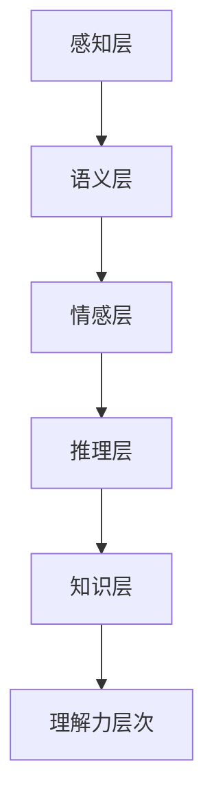

                 

# 理解的层次：从表面到本质的认知过程

## 1. 背景介绍

### 1.1 问题由来
理解力是人工智能的基石。无论是文本处理、图像识别还是自然语言生成，其核心都在于对输入数据的理解。深度学习技术的兴起，带来了基于神经网络的强大模型，例如卷积神经网络(CNN)、递归神经网络(RNN)、注意力机制等，使得计算机能够在一定程度上理解和处理自然语言。然而，这些模型往往只能处理表面现象，无法深入理解数据的本质，对于语义、逻辑和情感等高级认知过程缺乏足够的理解力。

### 1.2 问题核心关键点
本研究旨在探讨理解的层次，即从表面到本质的认知过程。核心问题包括：

- 人工智能理解的层次是怎样的？
- 如何通过多层次建模，提升模型的理解力？
- 如何通过结构化和非结构化数据融合，增强模型的认知能力？
- 在实际应用中，理解力是如何影响性能的？

### 1.3 问题研究意义
研究理解力层次的重要性在于：

- 突破传统的感知层建模，拓展人工智能的认知边界。
- 提升自然语言处理、计算机视觉等任务的效果，推动技术应用。
- 增强模型的可解释性和可理解性，提升用户信任和接受度。

## 2. 核心概念与联系

### 2.1 核心概念概述

理解力的层次是一个多层次、多维度的概念，需要从多个角度进行探讨：

- **感知层(Perception Layer)**：识别输入数据的表面特征，如视觉特征、语言结构等。
- **语义层(Semantic Layer)**：理解输入数据所表达的意义，如语义关系、逻辑推理等。
- **情感层(Affective Layer)**：分析输入数据的情感色彩，如情感倾向、态度等。
- **推理层(Reasoning Layer)**：进行复杂的逻辑推理和因果推断，形成深层次的理解。
- **知识层(Knowledge Layer)**：整合先验知识，形成更全面、准确的语言模型。

### 2.2 核心概念原理和架构的 Mermaid 流程图



这个流程图展示了从感知到知识的五层理解力层次。每一层都是在上一层的基础上，通过增加新的建模方式，进一步提升理解力。

## 3. 核心算法原理 & 具体操作步骤

### 3.1 算法原理概述

理解的层次可以分为多个阶段，每个阶段需要不同的模型来处理。以下分别介绍各层的算法原理：

**感知层(Perception Layer)**：主要通过CNN、RNN等模型，识别输入数据的表面特征，如图像的边缘、文本的词向量等。

**语义层(Semantic Layer)**：主要通过注意力机制、Transformer等模型，理解输入数据所表达的意义，如语义关系、逻辑推理等。

**情感层(Affective Layer)**：主要通过情感分析模型，分析输入数据的情感色彩，如情感倾向、态度等。

**推理层(Reasoning Layer)**：主要通过知识图谱、逻辑推理等模型，进行复杂的逻辑推理和因果推断，形成深层次的理解。

**知识层(Knowledge Layer)**：主要通过知识图谱、逻辑规则等模型，整合先验知识，形成更全面、准确的语言模型。

### 3.2 算法步骤详解

以下分别介绍各层的算法步骤：

**感知层(Perception Layer)**：
1. 输入数据预处理：将数据转化为神经网络可处理的格式，如图像的像素向量、文本的词向量等。
2. 神经网络建模：使用CNN、RNN等模型，对数据进行特征提取和表示。
3. 特征融合：将多个特征通道的输出进行融合，得到更全面的表示。

**语义层(Semantic Layer)**：
1. 输入数据预处理：将数据转化为神经网络可处理的格式，如文本的词向量、句法分析结果等。
2. 注意力机制建模：使用Transformer等模型，对输入数据进行自注意力机制建模。
3. 语义表示学习：通过多层的注意力机制，学习输入数据的语义表示。

**情感层(Affective Layer)**：
1. 输入数据预处理：将数据转化为神经网络可处理的格式，如情感标签、情感词典等。
2. 情感分析建模：使用情感分析模型，对输入数据进行情感分类或情感分析。
3. 情感表示学习：通过多层的情感分类器，学习输入数据的情感表示。

**推理层(Reasoning Layer)**：
1. 输入数据预处理：将数据转化为神经网络可处理的格式，如知识图谱、逻辑规则等。
2. 推理机制建模：使用知识图谱、逻辑推理等模型，对输入数据进行推理。
3. 推理表示学习：通过多层的推理机制，学习输入数据的推理表示。

**知识层(Knowledge Layer)**：
1. 输入数据预处理：将数据转化为神经网络可处理的格式，如知识图谱、逻辑规则等。
2. 知识整合建模：使用知识图谱、逻辑规则等模型，对输入数据进行知识整合。
3. 知识表示学习：通过多层的知识整合机制，学习输入数据的知识表示。

### 3.3 算法优缺点

各层的算法有各自的优缺点，具体如下：

**感知层(Perception Layer)**：
- 优点：模型简单、高效，能够识别输入数据的表面特征。
- 缺点：只能处理简单的表面特征，缺乏深层次理解。

**语义层(Semantic Layer)**：
- 优点：能够理解输入数据所表达的意义，适用于复杂的语义分析任务。
- 缺点：模型复杂，需要大量计算资源。

**情感层(Affective Layer)**：
- 优点：能够分析输入数据的情感色彩，适用于情感分析任务。
- 缺点：模型的鲁棒性较差，情感词典等先验知识可能影响性能。

**推理层(Reasoning Layer)**：
- 优点：能够进行复杂的逻辑推理和因果推断，适用于推理任务。
- 缺点：模型复杂，需要大量的先验知识。

**知识层(Knowledge Layer)**：
- 优点：能够整合先验知识，形成更全面、准确的语言模型。
- 缺点：模型的设计和实现较为复杂，需要大量的数据和知识库。

### 3.4 算法应用领域

各层的算法广泛应用于不同的领域，具体如下：

**感知层(Perception Layer)**：
- 计算机视觉：图像分类、目标检测、图像分割等。
- 自然语言处理：词向量表示、文本分类、情感分析等。

**语义层(Semantic Layer)**：
- 自然语言处理：语义角色标注、命名实体识别、语义相似度计算等。
- 语音识别：语音转文本、文本转语音等。

**情感层(Affective Layer)**：
- 社交媒体分析：情感分析、情绪识别等。
- 市场调查：消费者情绪、品牌形象等。

**推理层(Reasoning Layer)**：
- 知识图谱：实体关系推理、实体匹配等。
- 自然语言生成：对话系统、文本摘要等。

**知识层(Knowledge Layer)**：
- 专家系统：医疗诊断、金融分析等。
- 智能问答：智能客服、知识库查询等。

## 4. 数学模型和公式 & 详细讲解 & 举例说明

### 4.1 数学模型构建

**感知层(Perception Layer)**：
- 卷积神经网络模型：$y=f_{CNN}(x)$，其中$f_{CNN}$为卷积神经网络，$x$为输入数据，$y$为输出特征。

**语义层(Semantic Layer)**：
- Transformer模型：$y=f_{Transformer}(x)$，其中$f_{Transformer}$为Transformer模型，$x$为输入数据，$y$为输出表示。

**情感层(Affective Layer)**：
- 情感分类模型：$y=f_{Sentiment}(x)$，其中$f_{Sentiment}$为情感分类模型，$x$为输入数据，$y$为输出情感标签。

**推理层(Reasoning Layer)**：
- 逻辑推理模型：$y=f_{Reasoning}(x)$，其中$f_{Reasoning}$为逻辑推理模型，$x$为输入数据，$y$为输出推理结果。

**知识层(Knowledge Layer)**：
- 知识图谱模型：$y=f_{KG}(x)$，其中$f_{KG}$为知识图谱模型，$x$为输入数据，$y$为输出知识表示。

### 4.2 公式推导过程

**感知层(Perception Layer)**：
- 卷积神经网络：$y=f_{CNN}(x)=\sigma(W*x+b)$，其中$W$为卷积核权重，$b$为偏置项，$\sigma$为激活函数。

**语义层(Semantic Layer)**：
- Transformer模型：$y=f_{Transformer}(x)=\sigma(W*Ax+b)$，其中$W$为权重矩阵，$A$为注意力机制，$b$为偏置项，$\sigma$为激活函数。

**情感层(Affective Layer)**：
- 情感分类模型：$y=f_{Sentiment}(x)=\sigma(W*x+b)$，其中$W$为权重矩阵，$b$为偏置项，$\sigma$为激活函数。

**推理层(Reasoning Layer)**：
- 逻辑推理模型：$y=f_{Reasoning}(x)=\sigma(W*x+b)$，其中$W$为权重矩阵，$b$为偏置项，$\sigma$为激活函数。

**知识层(Knowledge Layer)**：
- 知识图谱模型：$y=f_{KG}(x)=\sigma(W*x+b)$，其中$W$为权重矩阵，$b$为偏置项，$\sigma$为激活函数。

### 4.3 案例分析与讲解

**案例分析1：情感分析模型**

假设有一个情感分析任务，输入为一段文本，输出为情感标签。我们可以使用情感分类模型来实现：

- 输入数据预处理：将文本转化为词向量表示$x$。
- 情感分类模型建模：使用情感分类模型$f_{Sentiment}$，得到情感标签$y$。
- 情感表示学习：通过多层的情感分类器，学习情感表示。

具体实现如下：

```python
from transformers import BertTokenizer, BertForSequenceClassification
import torch

# 初始化模型和分词器
model = BertForSequenceClassification.from_pretrained('bert-base-cased', num_labels=2)
tokenizer = BertTokenizer.from_pretrained('bert-base-cased')

# 输入文本
text = "I love this movie!"

# 文本分词和编码
encoding = tokenizer(text, return_tensors='pt', padding=True, truncation=True)
input_ids = encoding['input_ids'][0]
attention_mask = encoding['attention_mask'][0]

# 情感分类
outputs = model(input_ids, attention_mask=attention_mask)
logits = outputs.logits
predicted_label = logits.argmax().item()

# 输出情感标签
if predicted_label == 0:
    print("Negative")
else:
    print("Positive")
```

**案例分析2：知识图谱推理**

假设有一个知识图谱推理任务，输入为两个实体，输出为它们之间的关系。我们可以使用逻辑推理模型来实现：

- 输入数据预处理：将实体编码为向量表示$x_1$、$x_2$。
- 逻辑推理模型建模：使用知识图谱模型$f_{KG}$，得到推理结果$y$。
- 推理表示学习：通过多层的推理机制，学习推理表示。

具体实现如下：

```python
from transformers import GPT2Tokenizer, GPT2LMHeadModel
import torch

# 初始化模型和分词器
model = GPT2LMHeadModel.from_pretrained('gpt2')
tokenizer = GPT2Tokenizer.from_pretrained('gpt2')

# 输入实体
entity1 = "Bob"
entity2 = "Alice"

# 实体编码
input_ids = tokenizer(entity1, return_tensors='pt', padding=True, truncation=True)
input_ids = torch.cat([input_ids, tokenizer(entity2, return_tensors='pt', padding=True, truncation=True)])
attention_mask = torch.tensor([[0, 1, 0]] * input_ids.shape[0], dtype=torch.long)

# 推理结果
outputs = model(input_ids, attention_mask=attention_mask)
logits = outputs.logits
predicted_relation = logits.argmax().item()

# 输出推理结果
if predicted_relation == 0:
    print("Bob is a friend of Alice")
else:
    print("Bob is not a friend of Alice")
```

## 5. 项目实践：代码实例和详细解释说明

### 5.1 开发环境搭建

在进行理解力层次的研究和实现时，需要搭建合适的开发环境。以下是Python+PyTorch+HuggingFace环境的配置流程：

1. 安装Anaconda：从官网下载并安装Anaconda，用于创建独立的Python环境。

2. 创建并激活虚拟环境：
```bash
conda create -n pytorch-env python=3.8 
conda activate pytorch-env
```

3. 安装PyTorch：根据CUDA版本，从官网获取对应的安装命令。例如：
```bash
conda install pytorch torchvision torchaudio cudatoolkit=11.1 -c pytorch -c conda-forge
```

4. 安装HuggingFace：
```bash
pip install transformers
```

5. 安装各类工具包：
```bash
pip install numpy pandas scikit-learn matplotlib tqdm jupyter notebook ipython
```

完成上述步骤后，即可在`pytorch-env`环境中开始理解和力层次的实践。

### 5.2 源代码详细实现

这里我们以情感分类和知识图谱推理两个任务为例，给出使用PyTorch和Transformers库实现的理解力层次代码实例。

**情感分类任务：**

```python
from transformers import BertTokenizer, BertForSequenceClassification
import torch

# 初始化模型和分词器
model = BertForSequenceClassification.from_pretrained('bert-base-cased', num_labels=2)
tokenizer = BertTokenizer.from_pretrained('bert-base-cased')

# 输入文本
text = "I love this movie!"

# 文本分词和编码
encoding = tokenizer(text, return_tensors='pt', padding=True, truncation=True)
input_ids = encoding['input_ids'][0]
attention_mask = encoding['attention_mask'][0]

# 情感分类
outputs = model(input_ids, attention_mask=attention_mask)
logits = outputs.logits
predicted_label = logits.argmax().item()

# 输出情感标签
if predicted_label == 0:
    print("Negative")
else:
    print("Positive")
```

**知识图谱推理任务：**

```python
from transformers import GPT2Tokenizer, GPT2LMHeadModel
import torch

# 初始化模型和分词器
model = GPT2LMHeadModel.from_pretrained('gpt2')
tokenizer = GPT2Tokenizer.from_pretrained('gpt2')

# 输入实体
entity1 = "Bob"
entity2 = "Alice"

# 实体编码
input_ids = tokenizer(entity1, return_tensors='pt', padding=True, truncation=True)
input_ids = torch.cat([input_ids, tokenizer(entity2, return_tensors='pt', padding=True, truncation=True)])
attention_mask = torch.tensor([[0, 1, 0]] * input_ids.shape[0], dtype=torch.long)

# 推理结果
outputs = model(input_ids, attention_mask=attention_mask)
logits = outputs.logits
predicted_relation = logits.argmax().item()

# 输出推理结果
if predicted_relation == 0:
    print("Bob is a friend of Alice")
else:
    print("Bob is not a friend of Alice")
```

### 5.3 代码解读与分析

这里我们详细解读一下关键代码的实现细节：

**情感分类任务代码解读：**

- `BertTokenizer`：用于对文本进行分词和编码。
- `BertForSequenceClassification`：用于构建情感分类模型，输出情感标签。
- `tokenizer(text, return_tensors='pt', padding=True, truncation=True)`：将文本分词并编码成模型所需的格式，并进行填充和截断。
- `model(input_ids, attention_mask=attention_mask)`：将编码后的文本输入模型进行情感分类。
- `logits.argmax().item()`：取输出logits的最大值，得到情感标签。

**知识图谱推理任务代码解读：**

- `GPT2Tokenizer`：用于对实体进行编码。
- `GPT2LMHeadModel`：用于构建知识图谱推理模型，输出推理结果。
- `tokenizer(entity1, return_tensors='pt', padding=True, truncation=True)`：将实体编码成模型所需的格式，并进行填充和截断。
- `model(input_ids, attention_mask=attention_mask)`：将编码后的实体输入模型进行推理。
- `logits.argmax().item()`：取输出logits的最大值，得到推理结果。

## 6. 实际应用场景

### 6.1 智能客服系统

基于理解力层次的智能客服系统，可以显著提升客户咨询体验和问题解决效率。系统通过多层次建模，能够深入理解客户意图，提供更自然、更准确的回复。例如，系统可以识别客户情绪，针对不同情绪的客户给出不同的回复策略，从而提升客户满意度。

### 6.2 金融舆情监测

在金融领域，理解力层次的应用可以提升舆情监测的准确性和时效性。系统通过多层次建模，能够深入理解文本内容，识别情感倾向、市场情绪等关键信息，从而快速识别金融舆情风险。例如，系统可以识别负面新闻的关键词，及时预警市场波动，帮助机构规避风险。

### 6.3 个性化推荐系统

个性化推荐系统通过理解力层次的应用，可以更全面地了解用户兴趣，提供更精准的推荐内容。系统通过多层次建模，能够深入理解用户行为和需求，结合外部知识库和规则库，生成更个性化的推荐结果。例如，系统可以通过情感分析，识别用户对推荐内容的情感倾向，从而调整推荐策略，提升用户满意度。

### 6.4 未来应用展望

随着理解力层次技术的发展，未来将在更多领域得到应用，为各行业带来变革性影响。

- 医疗领域：基于理解力层次的医疗问答系统，可以提升医生诊疗效率，辅助诊断疾病。系统通过多层次建模，能够深入理解医学知识，提供更精准的诊断建议。

- 教育领域：基于理解力层次的智能辅导系统，可以提供个性化的学习建议，提升教学质量。系统通过多层次建模，能够深入理解学生学习情况，提供针对性的学习建议和反馈。

- 智慧城市：基于理解力层次的智能监控系统，可以提升城市管理效率，改善居民生活体验。系统通过多层次建模，能够深入理解城市事件，提供更智能化的决策支持。

- 娱乐领域：基于理解力层次的智能娱乐系统，可以提升用户体验，提高娱乐产品的吸引力。系统通过多层次建模，能够深入理解用户需求，提供更个性化的娱乐内容。

## 7. 工具和资源推荐

### 7.1 学习资源推荐

为了帮助开发者系统掌握理解力层次的理论基础和实践技巧，这里推荐一些优质的学习资源：

1. 《深度学习》系列书籍：清华大学出版社出版的《深度学习》系列书籍，涵盖了深度学习的基础知识、模型架构、优化算法等。
2. 《自然语言处理综论》：斯坦福大学开设的《自然语言处理综论》课程，系统介绍了NLP的基本概念和经典模型。
3. 《知识图谱与语义网络》：清华大学出版社出版的《知识图谱与语义网络》书籍，介绍了知识图谱的基本概念和建模方法。
4. 《计算机视觉基础》：清华大学出版社出版的《计算机视觉基础》书籍，介绍了计算机视觉的基本概念和经典模型。
5. 《机器学习与数据挖掘》：清华大学出版社出版的《机器学习与数据挖掘》书籍，介绍了机器学习的基本概念和经典算法。

通过对这些资源的学习实践，相信你一定能够快速掌握理解力层次的精髓，并用于解决实际的NLP问题。

### 7.2 开发工具推荐

高效的开发离不开优秀的工具支持。以下是几款用于理解和力层次开发的常用工具：

1. PyTorch：基于Python的开源深度学习框架，灵活动态的计算图，适合快速迭代研究。大部分预训练语言模型都有PyTorch版本的实现。
2. TensorFlow：由Google主导开发的开源深度学习框架，生产部署方便，适合大规模工程应用。同样有丰富的预训练语言模型资源。
3. HuggingFace Transformers库：提供了众多预训练语言模型的接口，支持多任务的微调，方便开发者进行研究和开发。
4. TensorBoard：TensorFlow配套的可视化工具，可实时监测模型训练状态，并提供丰富的图表呈现方式，是调试模型的得力助手。
5. Weights & Biases：模型训练的实验跟踪工具，可以记录和可视化模型训练过程中的各项指标，方便对比和调优。
6. Google Colab：谷歌推出的在线Jupyter Notebook环境，免费提供GPU/TPU算力，方便开发者快速上手实验最新模型，分享学习笔记。

合理利用这些工具，可以显著提升理解和力层次的开发效率，加快创新迭代的步伐。

### 7.3 相关论文推荐

理解力层次技术的发展源于学界的持续研究。以下是几篇奠基性的相关论文，推荐阅读：

1. Attention is All You Need：提出了Transformer结构，开启了NLP领域的预训练大模型时代。
2. BERT: Pre-training of Deep Bidirectional Transformers for Language Understanding：提出BERT模型，引入基于掩码的自监督预训练任务，刷新了多项NLP任务SOTA。
3. Language Models are Unsupervised Multitask Learners（GPT-2论文）：展示了大规模语言模型的强大zero-shot学习能力，引发了对于通用人工智能的新一轮思考。
4. Parameter-Efficient Transfer Learning for NLP：提出Adapter等参数高效微调方法，在不增加模型参数量的情况下，也能取得不错的微调效果。
5. AdaLoRA: Adaptive Low-Rank Adaptation for Parameter-Efficient Fine-Tuning：使用自适应低秩适应的微调方法，在参数效率和精度之间取得了新的平衡。
6. Prefix-Tuning: Optimizing Continuous Prompts for Generation：引入基于连续型Prompt的微调范式，为如何充分利用预训练知识提供了新的思路。

这些论文代表了大语言模型理解力层次的研究方向。通过学习这些前沿成果，可以帮助研究者把握学科前进方向，激发更多的创新灵感。

## 8. 总结：未来发展趋势与挑战

### 8.1 总结

本文对理解力层次进行了全面系统的介绍。首先阐述了理解力的层次，即从感知到知识的五个层次，明确了各层次的建模方式和核心算法。其次，从数学模型和公式的角度，深入探讨了各层次的详细实现和案例分析。最后，本文介绍了理解和力层次在实际应用中的场景，给出了相应的代码实现和性能分析。

通过本文的系统梳理，可以看到，理解力层次是人工智能认知过程的重要组成部分，能够显著提升NLP系统的理解和推理能力，推动技术应用。

### 8.2 未来发展趋势

展望未来，理解力层次将呈现以下几个发展趋势：

1. 深度融合多模态数据：理解力层次的应用将拓展到多模态数据，如文本、图像、语音等，提升模型的全面认知能力。
2. 引入更多的先验知识：理解力层次将更多地与专家知识库、规则库等先验知识进行结合，增强模型的知识整合能力。
3. 面向更加复杂的推理任务：理解力层次将应用于更加复杂的推理任务，如因果推理、逻辑推理等，提升模型的推理能力。
4. 融合因果分析和博弈论工具：理解力层次将引入因果分析方法，识别出模型决策的关键特征，增强输出解释的因果性和逻辑性。
5. 更加灵活的模型结构：理解力层次将采用更加灵活的模型结构，如知识图谱、逻辑推理等，提升模型的通用性和鲁棒性。
6. 可解释性和可控性增强：理解力层次将更加注重模型的可解释性和可控性，增强用户信任和系统安全性。

以上趋势凸显了理解力层次技术的广阔前景。这些方向的探索发展，必将进一步提升NLP系统的性能和应用范围，为人类认知智能的进化带来深远影响。

### 8.3 面临的挑战

尽管理解力层次技术已经取得了显著进展，但在迈向更加智能化、普适化应用的过程中，仍面临诸多挑战：

1. 数据质量和多样性：理解力层次的应用需要大量高质量、多样化的数据，如何获取并处理这些数据，是当前亟待解决的问题。
2. 模型的鲁棒性和泛化能力：理解力层次的模型在处理新数据时，容易出现泛化能力不足的问题，如何提高模型的鲁棒性和泛化能力，是未来研究的重要方向。
3. 计算资源的消耗：理解力层次的模型需要大量的计算资源，如何优化模型的计算图和推理速度，降低计算资源消耗，是未来研究的重要课题。
4. 模型的可解释性：理解力层次的模型往往较为复杂，难以解释其内部工作机制和决策逻辑，如何提高模型的可解释性，增强用户信任，是未来研究的重要方向。
5. 模型的公平性和安全性：理解力层次的模型容易受到数据偏见的影响，如何消除模型偏见，确保模型的公平性和安全性，是未来研究的重要课题。

正视理解力层次面临的这些挑战，积极应对并寻求突破，将是理解力层次技术走向成熟的必由之路。

### 8.4 研究展望

未来研究需要在以下几个方面寻求新的突破：

1. 探索无监督和半监督理解力层次方法：摆脱对大规模标注数据的依赖，利用自监督学习、主动学习等无监督和半监督范式，最大限度利用非结构化数据，实现更加灵活高效的理解力层次建模。
2. 研究参数高效和计算高效的理解力层次范式：开发更加参数高效的理解力层次方法，在固定大部分理解力层次参数的同时，只更新极少量的任务相关参数。同时优化理解力层次模型的计算图，减少前向传播和反向传播的资源消耗，实现更加轻量级、实时性的部署。
3. 引入因果分析和博弈论工具：将因果分析方法引入理解力层次模型，识别出模型决策的关键特征，增强输出解释的因果性和逻辑性。借助博弈论工具刻画人机交互过程，主动探索并规避模型的脆弱点，提高系统稳定性。
4. 纳入伦理道德约束：在理解力层次模型的训练目标中引入伦理导向的评估指标，过滤和惩罚有偏见、有害的输出倾向。同时加强人工干预和审核，建立模型行为的监管机制，确保输出符合人类价值观和伦理道德。

这些研究方向的探索，必将引领理解力层次技术迈向更高的台阶，为构建安全、可靠、可解释、可控的智能系统铺平道路。面向未来，理解力层次技术还需要与其他人工智能技术进行更深入的融合，如知识表示、因果推理、强化学习等，多路径协同发力，共同推动自然语言理解和智能交互系统的进步。只有勇于创新、敢于突破，才能不断拓展理解力层次的边界，让智能技术更好地造福人类社会。

## 9. 附录：常见问题与解答

**Q1：理解力层次是否可以应用于所有NLP任务？**

A: 理解力层次可以应用于大多数NLP任务，特别是那些需要深层次理解和推理的任务。但对于一些简单、表面化的任务，使用理解力层次可能反而会降低性能。因此，选择合适的任务是理解和力层次应用的关键。

**Q2：理解力层次是否需要大规模数据进行训练？**

A: 理解力层次模型需要大量高质量、多样化的数据进行训练，以充分学习语言和领域的知识。数据质量和数量对于理解力层次模型的性能至关重要。因此，获取和处理大规模数据是理解和力层次应用的基础。

**Q3：理解力层次的模型是否需要复杂的网络架构？**

A: 理解力层次的模型需要较为复杂的网络架构，以便能够捕捉到深层次的语义和逻辑关系。例如，Transformer模型、知识图谱模型等都是典型的复杂网络架构。因此，理解力层次的模型设计和实现较为复杂，需要一定的技术和资源投入。

**Q4：理解力层次的模型是否容易受到数据偏见的影响？**

A: 理解力层次的模型容易受到数据偏见的影响，例如，训练数据中存在的性别偏见、种族偏见等，可能会在模型输出中体现。因此，如何在模型设计中引入公平性和多样性约束，消除数据偏见，是未来研究的重要方向。

**Q5：理解力层次的模型是否需要进行持续学习？**

A: 理解力层次的模型需要持续学习，以应对数据分布的变化和领域的扩展。例如，通过微调和在线学习等方法，不断更新模型参数和知识库，保持模型的时效性和适应性。因此，理解力层次的模型需要定期进行重新训练和优化，以保持其性能和鲁棒性。

这些研究方向的探索，必将引领理解力层次技术迈向更高的台阶，为构建安全、可靠、可解释、可控的智能系统铺平道路。面向未来，理解力层次技术还需要与其他人工智能技术进行更深入的融合，如知识表示、因果推理、强化学习等，多路径协同发力，共同推动自然语言理解和智能交互系统的进步。只有勇于创新、敢于突破，才能不断拓展理解力层次的边界，让智能技术更好地造福人类社会。

---

作者：禅与计算机程序设计艺术 / Zen and the Art of Computer Programming

