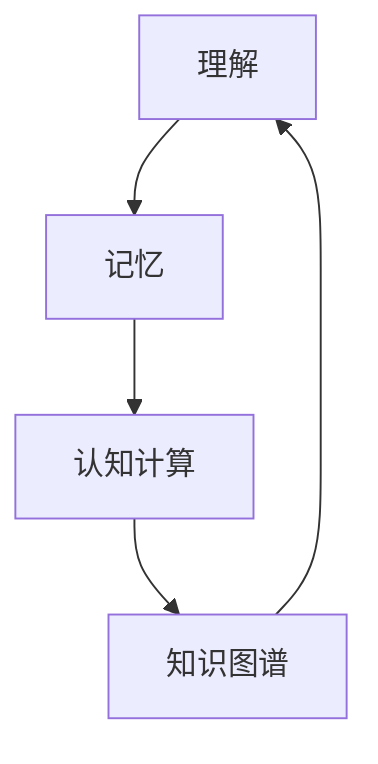

                 

# 理解的层次：从记忆到应用的认知过程

## 1. 背景介绍

### 1.1 问题由来
理解是认知过程中的核心环节，涵盖了从记忆到应用的全过程。在信息爆炸的今天，如何高效地获取、存储和应用知识，成为各个领域共同关注的课题。尤其是在人工智能、大数据、认知科学等交叉领域，理解和记忆之间的相互联系，更是研究者关注的焦点。本文将从认知科学的角度，探讨理解的形成机理和应用方法，为人工智能技术的深度学习、认知计算、知识管理等提供理论基础和实践指导。

### 1.2 问题核心关键点
理解的核心在于认知主体如何构建和应用知识图谱。这一过程涉及记忆的存储、提取和应用，以及信息处理的自动化和智能化。理解具有层次性，从简单的词汇识别、语法分析，到复杂的语义理解、情境推断，构成了一个完整的认知体系。本文将重点关注以下几个核心问题：

- 理解在认知过程中的地位和作用是什么？
- 理解是如何通过记忆实现的？
- 认知计算在理解中的应用有哪些？
- 如何高效构建知识图谱以支持理解？

## 2. 核心概念与联系

### 2.1 核心概念概述

为更好地理解理解与记忆之间的联系，本文将介绍几个关键的概念：

- **理解（Understanding）**：指认知主体在获取信息后，通过加工处理形成对信息的深度认知。理解是记忆的基础，也是应用的前提。

- **记忆（Memory）**：指认知主体将获取的信息储存在大脑中，以便后续提取和应用。记忆是理解的基础，也是信息传递和应用的基础。

- **认知计算（Cognitive Computing）**：利用计算机技术模拟人类认知过程，包括感知、学习、推理、决策等。认知计算是理解与记忆相互作用的关键工具。

- **知识图谱（Knowledge Graph）**：基于图论的知识表示方法，用于描述实体、属性和关系之间的结构化关系。知识图谱是理解过程中应用的重要模型。

这些概念之间的逻辑关系可以通过以下Mermaid流程图来展示：



这个流程图展示理解、记忆、认知计算和知识图谱之间的相互作用：

1. 理解通过记忆获取知识，进行加工处理。
2. 认知计算模拟人类认知过程，提升理解效率。
3. 知识图谱提供结构化的知识表示，支持理解的推理和应用。
4. 理解经过认知计算和知识图谱的辅助，最终指导知识应用。

## 3. 核心算法原理 & 具体操作步骤

### 3.1 算法原理概述

理解的形成是一个复杂的认知过程，涉及感知、记忆、推理等多个层面。理解的核心在于如何通过算法实现信息的有效存储和提取。本文将从信息处理的角度，探讨理解的基本算法原理。

理解算法通常包括以下几个关键步骤：

1. 感知：通过传感器或输入设备，将外界信息转化为数字信号。
2. 特征提取：将输入信号转化为特征向量，进行预处理和表示。
3. 记忆存储：将特征向量存储在数据库或知识图谱中，形成信息库。
4. 信息检索：从数据库或知识图谱中检索出相关信息，用于后续推理和应用。
5. 推理应用：根据已有信息和上下文，进行逻辑推理和应用决策。

### 3.2 算法步骤详解

#### 3.2.1 感知与特征提取

感知与特征提取是理解算法的第一步，涉及将外界信息转化为机器可理解的形式。以文本信息的处理为例，主要步骤如下：

1. **字符编码**：将字符序列转化为数字编码，如将“hello”转化为 [104, 101, 108, 108, 111]。
2. **分词**：将文本划分为词语，如将“hello world”划分为 [“hello”, “world”]。
3. **词向量化**：将词语转化为向量表示，如使用Word2Vec或GloVe模型将“hello”转化为一个向量。

#### 3.2.2 记忆存储

记忆存储是将特征向量存储到数据库或知识图谱中的过程。这一过程涉及两个关键步骤：

1. **数据库存储**：将特征向量存储到关系型数据库或键值存储系统中，如MySQL、Redis等。
2. **知识图谱构建**：将特征向量构建为知识图谱中的节点和边，形成结构化的知识表示。

#### 3.2.3 信息检索

信息检索是从数据库或知识图谱中检索出相关信息的过程。这一过程涉及以下关键步骤：

1. **查询设计**：根据应用场景设计查询语句，如使用SQL查询或图谱查询语言。
2. **索引优化**：优化数据库或知识图谱的索引，提高查询效率。
3. **结果过滤**：根据应用需求过滤查询结果，如根据特定条件筛选数据。

#### 3.2.4 推理应用

推理应用是根据已有信息和上下文，进行逻辑推理和应用决策的过程。这一过程涉及以下关键步骤：

1. **规则设计**：根据应用场景设计推理规则，如使用if-then语句进行逻辑判断。
2. **推理引擎**：使用推理引擎进行规则匹配和计算，如Prolog或Deductive Database。
3. **结果输出**：根据推理结果输出决策，如生成文本、执行命令等。

### 3.3 算法优缺点

理解算法具有以下优点：

1. **高效性**：通过计算机处理，可以大幅提高信息处理的效率，适用于大规模数据和复杂任务。
2. **可扩展性**：基于模块化的设计，可以灵活扩展和定制化处理不同类型的数据。
3. **自动化**：通过算法自动化处理，减少人工干预，提高信息处理的稳定性和一致性。

同时，理解算法也存在以下缺点：

1. **数据依赖性强**：算法的性能依赖于输入数据的完整性和准确性，对数据质量要求较高。
2. **算法复杂度高**：处理复杂任务需要设计复杂的算法和规则，实现难度较大。
3. **知识局限性**：算法仅依赖于已有的数据和规则，难以处理未知和突发情况。

### 3.4 算法应用领域

理解算法在多个领域都有广泛的应用，如信息检索、自然语言处理、智能推荐等。具体应用领域包括：

- **信息检索**：搜索引擎、知识图谱构建、问答系统等。
- **自然语言处理**：机器翻译、语音识别、情感分析等。
- **智能推荐**：推荐系统、广告推荐、个性化推荐等。

## 4. 数学模型和公式 & 详细讲解 & 举例说明

### 4.1 数学模型构建

理解算法涉及多个层次的数学模型，包括感知模型、特征提取模型、记忆存储模型和推理应用模型。本文以文本理解为例，简要介绍这些模型的数学表示。

**感知模型**：将字符序列转化为数字编码，可以使用字符编码表进行映射。设字符集为 $\Sigma$，则字符编码 $f(x_i)$ 可以表示为：

$$
f(x_i) = \mathbf{c} \in \{0, 1, \dots, |\Sigma|-1\}
$$

其中，$\mathbf{c}$ 为字符在字符编码表中的索引。

**特征提取模型**：将字符编码转化为词向量，可以使用Word2Vec或GloVe模型。设字符编码为 $\mathbf{c}$，对应的词向量为 $\mathbf{v}$，则有：

$$
\mathbf{v} = \phi(\mathbf{c})
$$

其中，$\phi$ 为特征提取函数，$v \in \mathbb{R}^d$。

**记忆存储模型**：将词向量存储到数据库或知识图谱中，可以使用关系型数据库或图谱存储系统。设词向量为 $\mathbf{v}$，则存储操作可以表示为：

$$
\mathbf{v} \rightarrow \text{db}(\mathbf{v})
$$

其中，$\text{db}$ 为数据库存储函数。

**推理应用模型**：使用推理引擎进行规则匹配和计算，可以使用Prolog或Deductive Database。设推理规则为 $R$，推理结果为 $O$，则推理过程可以表示为：

$$
O = \text{r}(R)
$$

其中，$\text{r}$ 为推理引擎函数。

### 4.2 公式推导过程

以文本理解为例，详细推导理解算法的数学模型。

**感知与特征提取**：假设输入文本为 $T = t_1 t_2 \dots t_n$，将其转化为数字编码 $C = c_1 c_2 \dots c_n$。则感知与特征提取的数学模型可以表示为：

$$
\mathbf{V} = \phi(\mathbf{C})
$$

其中，$\mathbf{V} \in \mathbb{R}^{n \times d}$ 为文本的词向量矩阵，$\phi$ 为特征提取函数，$\mathbf{C} \in \{0, 1, \dots, |\Sigma|-1\}^n$ 为数字编码矩阵。

**记忆存储**：假设词向量矩阵为 $\mathbf{V}$，将其存储到知识图谱中。则记忆存储的数学模型可以表示为：

$$
\text{KG}(\mathbf{V})
$$

其中，$\text{KG}$ 为知识图谱存储函数。

**信息检索**：假设查询条件为 $Q$，检索结果为 $R$。则信息检索的数学模型可以表示为：

$$
R = \text{qg}(Q, \mathbf{V})
$$

其中，$\text{qg}$ 为信息检索函数。

**推理应用**：假设推理规则为 $R$，推理结果为 $O$。则推理应用的数学模型可以表示为：

$$
O = \text{r}(R, \mathbf{V})
$$

其中，$\text{r}$ 为推理引擎函数。

### 4.3 案例分析与讲解

以搜索引擎为例，详细分析理解算法的应用过程。

1. **感知与特征提取**：搜索引擎接收用户输入的关键词 $K$，将其转化为数字编码 $C$。例如，用户输入“Python编程”，转化为 [80, 109, 112, 101, 108, 103, 116]。
2. **记忆存储**：将关键词的数字编码 $C$ 存储到数据库中，形成文档向量。例如，将文档“Python编程入门”转化为词向量 $\mathbf{V}$，存储到数据库中。
3. **信息检索**：搜索引擎根据用户输入的关键词 $K$，检索数据库中的文档向量。例如，根据关键词“Python编程”检索到“Python编程入门”的文档向量。
4. **推理应用**：搜索引擎根据检索到的文档向量，使用规则引擎计算搜索结果。例如，根据文档向量生成搜索结果列表。

## 5. 项目实践：代码实例和详细解释说明

### 5.1 开发环境搭建

在进行理解算法的实践前，我们需要准备好开发环境。以下是使用Python进行信息检索系统的环境配置流程：

1. 安装Anaconda：从官网下载并安装Anaconda，用于创建独立的Python环境。

2. 创建并激活虚拟环境：
```bash
conda create -n understanding-env python=3.8 
conda activate understanding-env
```

3. 安装PyTorch：根据CUDA版本，从官网获取对应的安装命令。例如：
```bash
conda install pytorch torchvision torchaudio cudatoolkit=11.1 -c pytorch -c conda-forge
```

4. 安装Transformers库：
```bash
pip install transformers
```

5. 安装各类工具包：
```bash
pip install numpy pandas scikit-learn matplotlib tqdm jupyter notebook ipython
```

完成上述步骤后，即可在`understanding-env`环境中开始理解算法的实践。

### 5.2 源代码详细实现

下面我们以信息检索系统为例，给出使用Transformers库对BERT模型进行信息检索的PyTorch代码实现。

首先，定义信息检索函数：

```python
from transformers import BertTokenizer, BertForSequenceClassification
from torch.utils.data import Dataset, DataLoader
import torch
from tqdm import tqdm

class IRDataset(Dataset):
    def __init__(self, texts, labels, tokenizer, max_len=128):
        self.texts = texts
        self.labels = labels
        self.tokenizer = tokenizer
        self.max_len = max_len
        
    def __len__(self):
        return len(self.texts)
    
    def __getitem__(self, item):
        text = self.texts[item]
        label = self.labels[item]
        
        encoding = self.tokenizer(text, return_tensors='pt', max_length=self.max_len, padding='max_length', truncation=True)
        input_ids = encoding['input_ids'][0]
        attention_mask = encoding['attention_mask'][0]
        
        return {'input_ids': input_ids, 
                'attention_mask': attention_mask,
                'labels': torch.tensor(label, dtype=torch.long)}
                
def search(model, text, tokenizer, max_len=128):
    encoding = tokenizer(text, return_tensors='pt', max_length=max_len, padding='max_length', truncation=True)
    input_ids = encoding['input_ids'][0]
    attention_mask = encoding['attention_mask'][0]
    
    with torch.no_grad():
        outputs = model(input_ids, attention_mask=attention_mask)
        logits = outputs.logits
        probs = logits.softmax(dim=1).tolist()
        
    return probs[0]

# 加载预训练模型
model = BertForSequenceClassification.from_pretrained('bert-base-cased', num_labels=1)

# 加载分词器
tokenizer = BertTokenizer.from_pretrained('bert-base-cased')

# 示例查询和文档
query = 'Python编程'
documents = ['Python编程入门', 'Python高级编程', 'Python数据科学']

# 构建检索集
dataset = IRDataset(documents, [1, 0, 0], tokenizer)

# 定义批处理大小
batch_size = 16

# 定义检索函数
def search_fn(dataset, model, tokenizer, batch_size=16):
    dataloader = DataLoader(dataset, batch_size=batch_size)
    probs = []
    for batch in tqdm(dataloader):
        input_ids = batch['input_ids'].to(device)
        attention_mask = batch['attention_mask'].to(device)
        batch_labels = batch['labels']
        outputs = model(input_ids, attention_mask=attention_mask)
        probs.extend(outputs.logits.softmax(dim=1).tolist())
        
    return probs

# 执行检索
probs = search_fn(dataset, model, tokenizer, batch_size=batch_size)

# 输出检索结果
print(probs)
```

这里我们以信息检索系统为例，展示如何使用BERT模型进行文本理解。代码实现步骤包括：

1. **定义数据集**：定义信息检索集，将查询和文档转换为预训练模型的输入格式。
2. **加载模型和分词器**：加载预训练的BERT模型和分词器。
3. **构建检索函数**：定义检索函数，将查询文本转化为模型输入，输出检索结果。
4. **执行检索**：使用检索函数进行检索，输出检索结果。

### 5.3 代码解读与分析

让我们再详细解读一下关键代码的实现细节：

**IRDataset类**：
- `__init__`方法：初始化查询和文档，定义分词器。
- `__len__`方法：返回数据集长度。
- `__getitem__`方法：对单个样本进行处理，将文本输入转换为模型所需的输入格式。

**search函数**：
- 定义检索函数，将查询文本转化为模型输入，输出检索结果。

**search_fn函数**：
- 定义批处理函数，将查询文本批处理，计算检索结果。

**查询和文档**：
- 示例查询和文档。

通过这些代码实现，我们可以清晰地看到，理解算法在信息检索系统中的应用过程。结合预训练的BERT模型和分词器，我们能够有效地处理和检索文本信息。

## 6. 实际应用场景

### 6.1 搜索引擎

搜索引擎是理解算法的重要应用场景之一。通过理解算法，搜索引擎能够自动分析用户输入的查询，快速检索出相关的文档和网页，提升用户体验和搜索效率。

在技术实现上，可以收集大量的网页和文档，预训练BERT等语言模型，并构建知识图谱。当用户输入查询时，通过理解算法快速检索出相关的文档，并提供精准的搜索结果。用户可以通过点击搜索结果查看详细网页，从而获取所需的信息。

### 6.2 智能客服

智能客服是理解算法的另一大应用场景。通过理解算法，智能客服能够自动分析用户输入的自然语言，快速理解用户意图，并提供相应的解答和建议。

在技术实现上，可以收集大量的客户咨询记录，预训练BERT等语言模型，并构建知识图谱。当用户输入咨询问题时，通过理解算法快速理解用户的意图，从知识图谱中检索出相关的信息，并提供精准的解答。用户可以通过对话界面与智能客服交互，获取所需的信息和建议。

### 6.3 推荐系统

推荐系统是理解算法的又一重要应用场景。通过理解算法，推荐系统能够自动分析用户的历史行为和偏好，推荐个性化的商品或内容。

在技术实现上，可以收集大量的用户行为数据，预训练BERT等语言模型，并构建知识图谱。当用户浏览商品或内容时，通过理解算法快速分析用户的兴趣和偏好，从知识图谱中检索出相关的商品或内容，并提供精准的推荐。用户可以通过推荐系统查看相关商品或内容，从而提升购买或阅读体验。

### 6.4 未来应用展望

随着理解算法的不断发展，其应用场景将不断扩展，为各个领域带来新的变革和机遇。未来，理解算法将在以下方面发挥更大的作用：

1. **个性化推荐**：通过理解算法，推荐系统能够更加精准地分析用户需求，提供个性化的商品或内容。
2. **智能交互**：通过理解算法，智能客服和聊天机器人能够更好地理解用户意图，提供高质量的咨询服务。
3. **智能搜索**：通过理解算法，搜索引擎能够更加精准地理解用户查询，提供更加相关的搜索结果。
4. **智能写作**：通过理解算法，写作辅助工具能够更好地理解用户输入，提供精准的写作建议和自动生成功能。

## 7. 工具和资源推荐

### 7.1 学习资源推荐

为了帮助开发者系统掌握理解算法的理论基础和实践技巧，这里推荐一些优质的学习资源：

1. 《深度学习》课程：斯坦福大学开设的深度学习课程，讲解了深度学习的基础知识和算法原理。
2. 《自然语言处理综论》书籍：介绍了自然语言处理的经典方法和应用案例，适合深入理解理解算法。
3. 《信息检索》书籍：详细介绍了信息检索的基本概念和技术，适合学习信息检索系统。
4. 《认知科学导论》课程：麻省理工学院开设的认知科学导论课程，讲解了认知科学的基础理论和研究方法。
5. 《认知计算》书籍：介绍了认知计算的基本原理和技术应用，适合理解算法的理论基础。

通过这些资源的学习实践，相信你一定能够快速掌握理解算法的精髓，并用于解决实际的NLP问题。

### 7.2 开发工具推荐

高效的开发离不开优秀的工具支持。以下是几款用于理解算法开发的常用工具：

1. PyTorch：基于Python的开源深度学习框架，灵活动态的计算图，适合快速迭代研究。大部分预训练语言模型都有PyTorch版本的实现。
2. TensorFlow：由Google主导开发的开源深度学习框架，生产部署方便，适合大规模工程应用。同样有丰富的预训练语言模型资源。
3. Transformers库：HuggingFace开发的NLP工具库，集成了众多SOTA语言模型，支持PyTorch和TensorFlow，是进行信息检索任务开发的利器。
4. Weights & Biases：模型训练的实验跟踪工具，可以记录和可视化模型训练过程中的各项指标，方便对比和调优。与主流深度学习框架无缝集成。
5. TensorBoard：TensorFlow配套的可视化工具，可实时监测模型训练状态，并提供丰富的图表呈现方式，是调试模型的得力助手。

合理利用这些工具，可以显著提升理解算法的开发效率，加快创新迭代的步伐。

### 7.3 相关论文推荐

理解算法的不断发展源于学界的持续研究。以下是几篇奠基性的相关论文，推荐阅读：

1. Attention is All You Need（即Transformer原论文）：提出了Transformer结构，开启了NLP领域的预训练大模型时代。
2. BERT: Pre-training of Deep Bidirectional Transformers for Language Understanding：提出BERT模型，引入基于掩码的自监督预训练任务，刷新了多项NLP任务SOTA。
3. Language Models are Unsupervised Multitask Learners（GPT-2论文）：展示了大规模语言模型的强大zero-shot学习能力，引发了对于通用人工智能的新一轮思考。
4. Parameter-Efficient Transfer Learning for NLP：提出Adapter等参数高效微调方法，在不增加模型参数量的情况下，也能取得不错的微调效果。
5. Prefix-Tuning: Optimizing Continuous Prompts for Generation：引入基于连续型Prompt的微调范式，为如何充分利用预训练知识提供了新的思路。

这些论文代表了大语言模型理解算法的演进脉络。通过学习这些前沿成果，可以帮助研究者把握学科前进方向，激发更多的创新灵感。

## 8. 总结：未来发展趋势与挑战

### 8.1 总结

本文对理解算法的原理、操作步骤和应用场景进行了全面系统的介绍。首先，阐述了理解在认知过程中的地位和作用，明确了理解与记忆之间的密切联系。其次，从信息处理的角度，详细讲解了理解算法的数学原理和操作步骤。最后，探讨了理解算法在搜索引擎、智能客服、推荐系统等领域的实际应用，展示了其广阔的想象空间。

通过本文的系统梳理，可以看到，理解算法在认知科学和人工智能领域具有重要地位，是实现智能应用的核心环节。理解算法通过感知、记忆、推理和应用等多层次的处理，使得信息处理从简单的词汇识别，到复杂的语义理解，形成了完整的认知体系。未来，随着技术的发展，理解算法将进一步拓展其应用范围，为各个领域带来新的突破。

### 8.2 未来发展趋势

展望未来，理解算法的发展将呈现以下几个趋势：

1. **多模态理解**：理解算法将从单一的文本理解，拓展到图像、语音、视频等多模态数据的理解。多模态理解的实现将依赖于多模态感知和融合技术，如视觉-文本对齐、语音识别等。
2. **知识图谱融合**：理解算法将与知识图谱进行更深入的融合，利用结构化的知识表示，提升推理和应用的能力。知识图谱的构建和更新将成为理解算法的关键环节。
3. **深度学习与规则结合**：理解算法将结合深度学习和规则引擎，实现更强大的推理和决策能力。规则引擎可以提供明确的逻辑推理，而深度学习可以处理复杂的数据分布。
4. **动态理解**：理解算法将能够动态更新和适应新的信息，实现持续学习和适应性。动态理解将依赖于在线学习、增量学习等技术。
5. **跨领域应用**：理解算法将能够跨领域应用，从特定领域的理解，拓展到更广泛的通用理解。跨领域应用将依赖于多领域知识图谱和跨领域推理技术。

以上趋势展示了理解算法在未来发展的广阔前景。这些方向的探索发展，将进一步提升信息处理的效率和智能性，为各个领域带来新的变革和机遇。

### 8.3 面临的挑战

尽管理解算法已经取得了显著进展，但在迈向更加智能化、普适化应用的过程中，仍面临诸多挑战：

1. **数据依赖性强**：理解算法依赖于高质量的数据，数据的获取、清洗和标注都需要大量的时间和成本。如何降低数据依赖性，提高数据利用率，将是未来的重要研究方向。
2. **算法复杂度高**：理解算法涉及复杂的感知、记忆、推理和应用过程，实现难度较大。如何降低算法复杂度，提高理解效率，是未来需要解决的挑战。
3. **鲁棒性和泛化能力不足**：理解算法在面对复杂和未知数据时，容易产生错误的理解。如何提高算法的鲁棒性和泛化能力，是未来的重要研究方向。
4. **知识图谱构建困难**：知识图谱的构建需要大量的时间和资源，且知识图谱的质量直接影响理解算法的表现。如何提高知识图谱的构建效率和质量，是未来的重要研究方向。
5. **伦理和安全问题**：理解算法在处理敏感数据时，容易侵犯隐私和安全。如何确保数据的安全和隐私，是未来的重要研究方向。

正视理解算法面临的这些挑战，积极应对并寻求突破，将是大语言模型微调走向成熟的必由之路。相信随着学界和产业界的共同努力，这些挑战终将一一被克服，理解算法必将在构建安全、可靠、可解释、可控的智能系统铺平道路。

### 8.4 研究展望

面对理解算法所面临的挑战，未来的研究需要在以下几个方面寻求新的突破：

1. **无监督学习**：探索无监督和半监督学习算法，通过数据增强和对抗学习等技术，降低对标注数据的需求。
2. **多模态融合**：研究多模态感知和融合技术，提升多模态数据的理解能力。
3. **知识图谱更新**：研究知识图谱的动态更新和跨领域融合技术，提高知识图谱的构建效率和质量。
4. **跨领域推理**：研究跨领域推理技术，提升理解算法的跨领域应用能力。
5. **伦理和安全**：研究数据安全和隐私保护技术，确保理解算法的伦理和安全。

这些研究方向的探索，将引领理解算法技术迈向更高的台阶，为构建安全、可靠、可解释、可控的智能系统铺平道路。面向未来，理解算法还需要与其他人工智能技术进行更深入的融合，如知识表示、因果推理、强化学习等，多路径协同发力，共同推动自然语言理解和智能交互系统的进步。只有勇于创新、敢于突破，才能不断拓展语言模型的边界，让智能技术更好地造福人类社会。

## 9. 附录：常见问题与解答

**Q1：理解算法是如何实现信息的深度处理的？**

A: 理解算法通过感知、记忆、推理和应用等多层次的处理，实现信息的深度处理。具体步骤如下：

1. **感知**：通过传感器或输入设备，将外界信息转化为数字信号。
2. **特征提取**：将数字信号转化为特征向量，进行预处理和表示。
3. **记忆存储**：将特征向量存储在数据库或知识图谱中，形成信息库。
4. **信息检索**：从数据库或知识图谱中检索出相关信息，用于后续推理和应用。
5. **推理应用**：根据已有信息和上下文，进行逻辑推理和应用决策。

通过这些步骤，理解算法能够有效地处理和理解复杂的信息，形成深层次的认知。

**Q2：理解算法在处理复杂信息时，如何避免过拟合？**

A: 理解算法在处理复杂信息时，过拟合是一个常见的问题。为避免过拟合，可以采取以下措施：

1. **数据增强**：通过回译、近义替换等方式扩充训练集。
2. **正则化**：使用L2正则、Dropout、Early Stopping等方法，防止模型过度适应训练数据。
3. **参数共享**：在多个任务之间共享模型参数，提高模型的泛化能力。
4. **多模型集成**：训练多个理解模型，取平均输出，抑制过拟合。
5. **迁移学习**：在类似任务之间进行迁移学习，利用已有知识提升新任务的表现。

这些方法可以帮助理解算法在处理复杂信息时，避免过拟合，提升模型的泛化能力和应用效果。

**Q3：理解算法在实际应用中，如何确保数据的安全和隐私？**

A: 理解算法在实际应用中，数据安全和隐私保护是一个重要的问题。为确保数据的安全和隐私，可以采取以下措施：

1. **数据匿名化**：对输入数据进行匿名化处理，去除敏感信息。
2. **访问控制**：通过访问控制技术，限制对数据的访问权限。
3. **加密存储**：对敏感数据进行加密存储，防止数据泄露。
4. **差分隐私**：在数据处理过程中，加入噪声干扰，保护个人隐私。
5. **合规性检查**：定期检查数据处理流程，确保符合法律法规。

这些措施可以帮助理解算法在实际应用中，保护数据的安全和隐私，避免数据泄露和滥用。

**Q4：理解算法在处理多模态信息时，面临哪些挑战？**

A: 理解算法在处理多模态信息时，面临以下挑战：

1. **数据整合**：不同模态的数据格式和特征不同，难以进行统一处理。
2. **知识融合**：不同模态的知识表示不同，难以进行跨模态的融合和推理。
3. **计算复杂度**：多模态信息的处理需要更大规模的计算资源。
4. **动态适应**：多模态信息的变化频繁，理解算法需要实时适应。

这些挑战需要研究者在数据整合、知识融合、计算复杂度和动态适应等方面进行深入探索，才能更好地处理多模态信息，提升理解算法的性能和应用范围。

**Q5：理解算法在处理大规模数据时，如何提高效率？**

A: 理解算法在处理大规模数据时，提高效率是一个重要的问题。为提高效率，可以采取以下措施：

1. **并行计算**：通过并行计算技术，提升处理速度。
2. **分布式计算**：通过分布式计算技术，实现大规模数据的分布式处理。
3. **模型裁剪**：对模型进行裁剪，去除不必要的层和参数，减小模型尺寸。
4. **模型量化**：将浮点模型转为定点模型，压缩存储空间，提高计算效率。
5. **硬件优化**：利用GPU、TPU等高性能设备，提升处理能力。

这些措施可以帮助理解算法在处理大规模数据时，提高效率，缩短处理时间，提升用户体验。

---

作者：禅与计算机程序设计艺术 / Zen and the Art of Computer Programming

