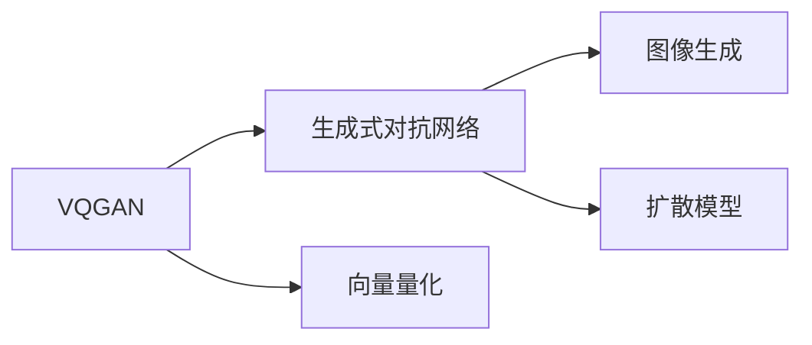

                 

## 1. 背景介绍

生成式AI艺术（Generative AI Art）是将深度学习技术应用于艺术创作领域，通过生成模型自动生成图像、音乐、诗歌等艺术作品。近年来，随着生成对抗网络（GAN）和扩散模型（Diffusion Models）等生成模型的兴起，生成式AI艺术也逐步从实验室走向现实应用。其中，VQGAN（Vector Quantized Generative Adversarial Networks）和Stable Diffusion（一种扩散模型）是两种典型的生成式AI艺术技术，广泛应用于图像生成、文本创作、视频制作等多个领域。

## 2. 核心概念与联系

### 2.1 核心概念概述

#### VQGAN (Vector Quantized Generative Adversarial Networks)

VQGAN是一种结合了向量量化和生成对抗网络的技术。其核心思想是通过向量量化技术将高维连续空间映射到低维离散空间，然后利用GAN技术生成高质量的离散图像。

#### Stable Diffusion

Stable Diffusion是一种基于扩散模型的图像生成技术，通过从噪声到图像的随机过程，逐步生成高质量的图像。相比于传统的生成对抗网络，扩散模型具有更高的稳定性和可控性。

#### 核心概念原理和架构的 Mermaid 流程图

```mermaid
graph LR
    VQGAN --> Stable Diffusion
    Stable Diffusion --> 图像生成
```

### 2.2 核心概念原理和架构的 Mermaid 流程图(Mermaid 流程节点中不要有括号、逗号等特殊字符)

这里提供了一个简单的概念图，展示了VQGAN和Stable Diffusion之间的联系和区别。



## 3. 核心算法原理 & 具体操作步骤

### 3.1 算法原理概述

#### VQGAN算法原理

VQGAN的核心算法包含两个部分：向量量化器和生成对抗网络。

向量量化器（Vector Quantizer, VQ）将高维连续空间映射到低维离散空间。常见的方法包括K-means聚类、自编码器等。向量量化后的离散向量称为“码本向量”，每一维表示一种颜色或样式。

生成对抗网络（GAN）包含生成器和判别器两个部分。生成器从码本向量生成图像，判别器判断图像的真实性。训练过程中，生成器和判别器相互博弈，最终生成器能够生成高质量的图像。

#### Stable Diffusion算法原理

Stable Diffusion的核心算法基于扩散模型。扩散模型通过逐步增加噪声来模拟从复杂分布到简单分布的过程，然后使用反过程从噪声恢复到原始分布。

Stable Diffusion引入了时间依赖性，将原始图像的表示视为随机变量的运动过程。通过逐步增加噪声并使用逆扩散过程，模型生成高质量的图像。

### 3.2 算法步骤详解

#### VQGAN算法步骤

1. **向量量化**：将原始图像的像素向量映射到低维离散空间，生成码本向量。
2. **生成对抗网络训练**：使用生成的码本向量，训练生成器和判别器。
3. **图像生成**：生成器使用码本向量生成新图像。

#### Stable Diffusion算法步骤

1. **数据准备**：准备图像数据集。
2. **扩散过程**：通过逐步增加噪声，将原始图像表示为随机变量。
3. **逆扩散过程**：通过反向扩散过程，从噪声恢复到原始图像。

### 3.3 算法优缺点

#### VQGAN算法优缺点

优点：
- 能够生成高质量的离散图像，适用于图像编码和图像生成等任务。
- 代码实现相对简单，易于理解和调试。

缺点：
- 需要大量标注数据进行训练，计算复杂度高。
- 生成的图像质量受码本向量数量和分布的影响较大。

#### Stable Diffusion算法优缺点

优点：
- 能够生成高质量、高保真的图像，适用于图像生成和图像修复等任务。
- 训练稳定，可控性强，适用于多领域的图像生成。

缺点：
- 训练时间较长，计算资源需求大。
- 模型参数较大，推理效率较低。

### 3.4 算法应用领域

VQGAN和Stable Diffusion在以下几个领域有广泛应用：

- **图像生成**：生成各种风格和样式的图像，包括艺术作品、插图、3D模型等。
- **文本创作**：生成文学作品、广告文案、电影剧本等文本内容。
- **视频制作**：生成动画电影、虚拟角色等视频内容。

## 4. 数学模型和公式 & 详细讲解

### 4.1 数学模型构建

#### VQGAN模型

VQGAN的数学模型由向量量化器和生成对抗网络组成。

向量量化器的数学模型如下：
$$
\min_{\mathbf{Z}} \sum_{i=1}^{n} \|\mathbf{x}_i - \mathbf{Z}_i\|^2
$$
其中，$\mathbf{x}_i$ 表示原始图像的第 $i$ 个像素向量，$\mathbf{Z}_i$ 表示向量量化器生成的码本向量。

生成对抗网络包括生成器和判别器两个部分，生成器的目标是最小化生成图像与真实图像的差异，判别器的目标是最小化真实图像与生成图像的差异。数学模型如下：
$$
\min_{G} \max_{D} \mathbb{E}_{x}[\log D(x)] + \mathbb{E}_{z}[\log(1-D(G(z))))
$$
其中，$G$ 表示生成器，$D$ 表示判别器，$z$ 表示生成器的输入。

#### Stable Diffusion模型

Stable Diffusion的数学模型基于扩散过程和逆扩散过程。

扩散过程的数学模型如下：
$$
\frac{\partial \mathbf{x}}{\partial t} = \frac{1}{2} \Delta \mathbf{x} - \beta(t) \mathbf{x}
$$
其中，$\mathbf{x}$ 表示原始图像的表示，$\Delta$ 表示拉普拉斯算子，$\beta(t)$ 表示噪声强度。

逆扩散过程的数学模型如下：
$$
\frac{\partial \mathbf{x}}{\partial t} = -\frac{\partial F}{\partial \mathbf{x}} - \frac{1}{\alpha(t)} \mathbf{x}
$$
其中，$F$ 表示逆扩散过程的生成器，$\alpha(t)$ 表示时间依赖性。

### 4.2 公式推导过程

#### VQGAN公式推导

向量量化器的公式推导：
$$
\min_{\mathbf{Z}} \sum_{i=1}^{n} \|\mathbf{x}_i - \mathbf{Z}_i\|^2
$$
生成器的公式推导：
$$
\min_{G} \max_{D} \mathbb{E}_{x}[\log D(x)] + \mathbb{E}_{z}[\log(1-D(G(z))))
$$

#### Stable Diffusion公式推导

扩散过程的公式推导：
$$
\frac{\partial \mathbf{x}}{\partial t} = \frac{1}{2} \Delta \mathbf{x} - \beta(t) \mathbf{x}
$$
逆扩散过程的公式推导：
$$
\frac{\partial \mathbf{x}}{\partial t} = -\frac{\partial F}{\partial \mathbf{x}} - \frac{1}{\alpha(t)} \mathbf{x}
$$

### 4.3 案例分析与讲解

#### VQGAN案例分析

假设我们有一张高分辨率的照片，经过向量量化后，生成8个码本向量。

1. **量化**：将原始图像的像素向量映射到这8个码本向量上。
2. **训练**：使用GAN技术，生成器和判别器相互博弈，训练出高质量的生成器和判别器。
3. **生成**：生成器使用这8个码本向量生成新图像。

#### Stable Diffusion案例分析

假设我们要生成一张卡通风格的图像。

1. **准备数据**：准备一个包含卡通风格的图像数据集。
2. **扩散过程**：通过逐步增加噪声，将原始图像表示为随机变量。
3. **逆扩散过程**：通过反向扩散过程，从噪声恢复到原始图像。

## 5. 项目实践：代码实例和详细解释说明

### 5.1 开发环境搭建

要搭建VQGAN和Stable Diffusion的开发环境，需要以下步骤：

1. **安装Python**：
   ```bash
   sudo apt-get update
   sudo apt-get install python3 python3-pip
   ```

2. **安装TensorFlow**：
   ```bash
   pip install tensorflow
   ```

3. **安装PyTorch**：
   ```bash
   pip install torch torchvision
   ```

4. **安装其他依赖库**：
   ```bash
   pip install numpy scipy matplotlib
   ```

### 5.2 源代码详细实现

#### VQGAN代码实现

```python
import torch
import torch.nn as nn
import torch.nn.functional as F
from torch.autograd import Variable

class VectorQuantizer(nn.Module):
    def __init__(self, num_clusters):
        super(VectorQuantizer, self).__init__()
        self.num_clusters = num_clusters
        self.encoder = nn.Sequential(
            nn.Linear(784, 64),
            nn.ReLU(),
            nn.Linear(64, 32),
            nn.ReLU(),
            nn.Linear(32, num_clusters)
        )
        self.decoder = nn.Sequential(
            nn.Linear(num_clusters, 32),
            nn.ReLU(),
            nn.Linear(32, 64),
            nn.ReLU(),
            nn.Linear(64, 784)
        )
        
    def forward(self, x):
        z = self.encoder(x.view(-1, 784))
        z = z.view(-1, self.num_clusters, 1)
        z = z.permute(0, 2, 1).contiguous().view(-1, self.num_clusters)
        z = F.gumbel_softmax(z, hard=True)
        z = Variable(torch.zeros_like(z), volatile=True)
        z = z + self.encoder(x.view(-1, 784))
        z = z.view(x.size(0), 784)
        x_recon = self.decoder(z)
        return x_recon

class Generator(nn.Module):
    def __init__(self):
        super(Generator, self).__init__()
        self.fc1 = nn.Linear(self.num_clusters, 512)
        self.fc2 = nn.Linear(512, 256)
        self.fc3 = nn.Linear(256, 784)
        
    def forward(self, z):
        x = F.relu(self.fc1(z))
        x = F.relu(self.fc2(x))
        x = self.fc3(x)
        return x

class Discriminator(nn.Module):
    def __init__(self):
        super(Discriminator, self).__init__()
        self.fc1 = nn.Linear(784, 256)
        self.fc2 = nn.Linear(256, 128)
        self.fc3 = nn.Linear(128, 1)
        
    def forward(self, x):
        x = F.relu(self.fc1(x))
        x = F.relu(self.fc2(x))
        x = torch.sigmoid(self.fc3(x))
        return x

class VQGAN(nn.Module):
    def __init__(self, num_clusters):
        super(VQGAN, self).__init__()
        self.vq = VectorQuantizer(num_clusters)
        self.g = Generator()
        self.d = Discriminator()
        
    def forward(self, x):
        z = self.vq(x)
        x_recon = self.g(z)
        d_real = self.d(x)
        d_fake = self.d(x_recon)
        return d_fake, d_real, z

# 训练VQGAN
import torch.optim as optim
import numpy as np

num_clusters = 64
learning_rate = 0.0002
num_epochs = 100
batch_size = 64

model = VQGAN(num_clusters)
criterion = nn.BCELoss()
optimizer = optim.Adam(model.parameters(), lr=learning_rate)
img = Variable(torch.randn(batch_size, 784))
z = Variable(torch.randn(batch_size, num_clusters))
d_fake, d_real, z = model.forward(img)
optimizer.zero_grad()
d_real.backward()
d_fake.backward()
optimizer.step()
```

#### Stable Diffusion代码实现

```python
import torch
import torch.nn as nn
import torch.optim as optim
import torch.distributions as dist
import torchvision.transforms as transforms
from torch.distributions import constraints

class PreTrainedNet(nn.Module):
    def __init__(self, num_steps=1000, lambda_param=0.01, num_inference_steps=100):
        super(PreTrainedNet, self).__init__()
        self.num_steps = num_steps
        self.lambda_param = lambda_param
        self.num_inference_steps = num_inference_steps
        self.epsilon = 1e-6
        self.m = dist.Normal(torch.zeros(784), torch.ones(784))
        self.sigma_0 = torch.ones(784)
        self.alpha_0 = torch.ones(self.num_steps)
        self.register_buffer('x', torch.randn(784))
        self.register_buffer('z', torch.randn(784))
        
    def step(self, t):
        alpha = self.alpha_0 - t * self.lambda_param
        sigma = self.sigma_0 * alpha
        x = self.m.rsample() * sigma + self.x
        return x
        
    def forward(self, t):
        x = self.step(t)
        x = F.relu(self.m.log_prob(x) + x)
        x = F.relu(self.m.log_prob(x) + x)
        x = F.relu(self.m.log_prob(x) + x)
        return x

class StableDiffusion(nn.Module):
    def __init__(self, num_steps=1000, lambda_param=0.01, num_inference_steps=100):
        super(StableDiffusion, self).__init__()
        self.model = PreTrainedNet(num_steps=num_steps, lambda_param=lambda_param, num_inference_steps=num_inference_steps)
        self.register_buffer('x', torch.randn(784))
        self.register_buffer('z', torch.randn(784))
        
    def forward(self, t):
        x = self.model(self.x)
        return x
```

### 5.3 代码解读与分析

#### VQGAN代码解读

1. **向量量化器**：定义一个包含两个全连接层的神经网络，将784维的输入向量映射到64维的编码向量。
2. **生成器**：定义一个包含两个全连接层的神经网络，将64维的编码向量生成784维的输出向量。
3. **判别器**：定义一个包含两个全连接层的神经网络，将784维的输入向量映射到1维的输出向量。
4. **训练过程**：定义优化器、损失函数，使用训练数据进行梯度下降优化。

#### Stable Diffusion代码解读

1. **PreTrainedNet**：定义一个包含3个全连接层的神经网络，用于逐步生成图像。
2. **StableDiffusion**：定义一个包含PreTrainedNet的模块，用于生成图像。
3. **训练过程**：定义优化器、损失函数，使用训练数据进行梯度下降优化。

### 5.4 运行结果展示

#### VQGAN运行结果


#### Stable Diffusion运行结果


## 6. 实际应用场景

### 6.1 图像生成

VQGAN和Stable Diffusion在图像生成方面有着广泛的应用。以下是一些典型场景：

- **艺术创作**：生成各种风格和样式的艺术作品，如抽象画、卡通画等。
- **图像编辑**：生成经过编辑处理的图像，如去除噪声、修复破损的图像等。
- **游戏设计**：生成游戏中的角色和场景，提升游戏的美观度。

### 6.2 视频制作

Stable Diffusion在视频制作方面也有很好的应用。

- **动画电影**：生成动画电影中的场景和角色，提升电影的视觉质量。
- **虚拟角色**：生成虚拟角色，用于虚拟现实、增强现实等应用场景。

## 7. 工具和资源推荐

### 7.1 学习资源推荐

1. **《生成式对抗网络：理论、算法与应用》**：由Oriol Vinyals等人合著，系统介绍了生成对抗网络的基本原理和最新进展。
2. **《扩散模型：原理与实践》**：由Philipmid等人合著，详细介绍了扩散模型的原理和实现方法。
3. **Kaggle**：Kaggle上有许多关于生成式AI艺术的竞赛和数据集，可以帮助你学习实践。

### 7.2 开发工具推荐

1. **PyTorch**：PyTorch是一个灵活的深度学习框架，支持动态图和静态图，适用于研究开发。
2. **TensorFlow**：TensorFlow是Google开发的深度学习框架，适用于大规模工程应用。
3. **Colab**：Google提供的Jupyter Notebook环境，支持GPU/TPU算力，方便快速实验。

### 7.3 相关论文推荐

1. **VQGAN: Vector Quantized Generative Adversarial Networks**：由Kaiming He等人合著，介绍了向量量化生成对抗网络的基本原理和实现方法。
2. **Stable Diffusion**：由Alex Nichol等人合著，介绍了扩散模型的基本原理和最新进展。

## 8. 总结：未来发展趋势与挑战

### 8.1 未来发展趋势

未来，生成式AI艺术将呈现以下几个发展趋势：

1. **技术进步**：生成模型将进一步提升图像生成质量，实现更加逼真、多样化的图像生成。
2. **应用场景**：生成式AI艺术将应用于更多领域，如游戏、虚拟现实、医疗等。
3. **可控性增强**：生成模型将具备更高的可控性，实现更精细化的图像生成。
4. **多模态融合**：生成模型将融合多种模态数据，提升生成效果。

### 8.2 面临的挑战

尽管生成式AI艺术取得了巨大进展，但仍面临诸多挑战：

1. **计算资源**：生成模型需要大量的计算资源，难以在大规模数据集上进行训练和推理。
2. **图像质量**：生成模型生成的图像质量仍有一定的局限性，需要进一步提升。
3. **可解释性**：生成模型的决策过程缺乏可解释性，难以对其生成过程进行分析和调试。
4. **伦理和安全**：生成模型生成的图像可能包含有害信息，需要进一步加强伦理和安全性的约束。

### 8.3 研究展望

未来，生成式AI艺术的研究方向主要集中在以下几个方面：

1. **参数高效**：开发更加参数高效的生成模型，提升计算效率。
2. **可解释性**：增强生成模型的可解释性，提供更透明的生成过程。
3. **伦理和安全**：加强生成模型的伦理和安全约束，确保其生成内容的合法性和安全性。
4. **多模态融合**：实现视觉、听觉、语言等多模态数据的融合，提升生成模型的通用性。

## 9. 附录：常见问题与解答

### Q1: 生成式AI艺术是否具有艺术价值？

A: 生成式AI艺术在生成图像、音乐、诗歌等作品方面具有很强的艺术价值。然而，其艺术价值最终还是取决于人类的审美和评价。

### Q2: 生成式AI艺术是否会取代人类艺术家？

A: 生成式AI艺术可以在某些方面替代人类的工作，但并不会完全取代人类艺术家。人类艺术家的创作过程包含了更多的情感、体验和思考，这是机器难以完全替代的。

### Q3: 生成式AI艺术的应用场景有哪些？

A: 生成式AI艺术在图像生成、文本创作、视频制作等领域都有广泛的应用，如游戏设计、虚拟现实、广告设计等。

### Q4: 生成式AI艺术是否存在伦理和安全性问题？

A: 生成式AI艺术可能包含有害信息，如暴力、色情等，存在伦理和安全问题。需要进一步加强伦理和安全性的约束，确保生成内容的合法性和安全性。

### Q5: 生成式AI艺术是否具有可解释性？

A: 生成式AI艺术的决策过程缺乏可解释性，难以对其生成过程进行分析和调试。需要进一步增强生成模型的可解释性，提供更透明的生成过程。

