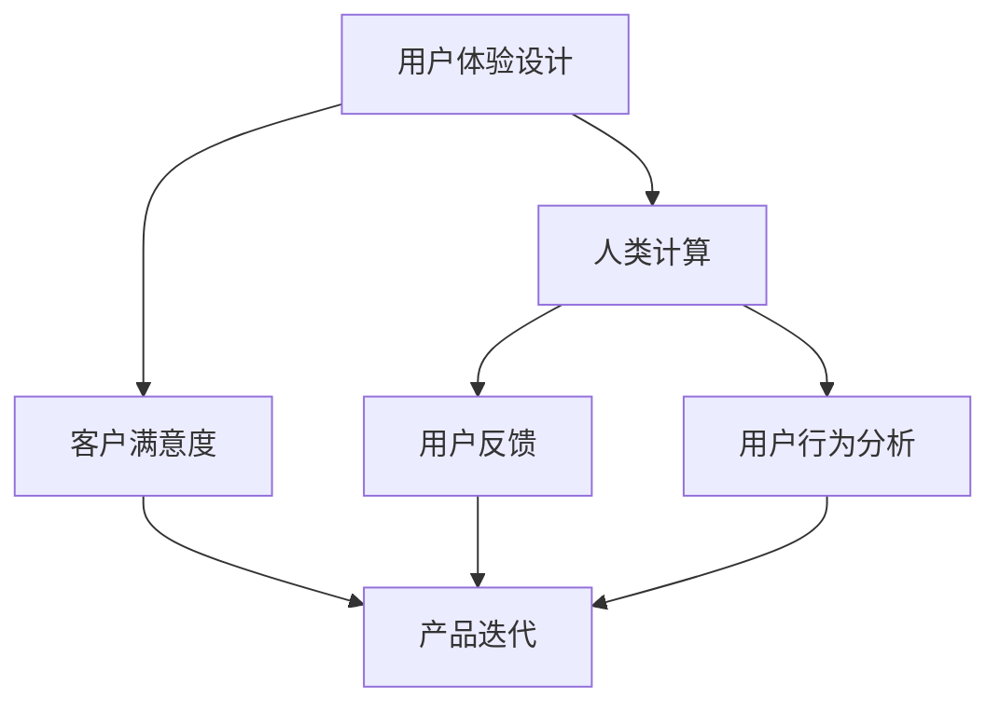

                 

# 用户体验至上：人类计算如何提升客户满意度

> 关键词：用户体验设计,人类计算,客户满意度,产品迭代,用户反馈

## 1. 背景介绍

随着技术的飞速发展和用户需求的日益多样化，用户体验设计（User Experience Design, UX）成为了企业获取竞争优势的关键因素。如何通过人类计算（Human-Computer Interaction, HCI）来提升客户满意度，成为了一个亟待解决的重要课题。本文将从用户体验设计的核心理念出发，探讨人类计算如何帮助企业提升客户满意度，助力产品迭代，实现持续增长。

## 2. 核心概念与联系

### 2.1 核心概念概述

在探讨人类计算如何提升客户满意度之前，我们需要先理解几个关键概念及其相互关系：

- **用户体验设计**（User Experience Design, UX）：旨在提升用户使用产品的满意度，通过用户研究和设计实践，优化产品功能、界面、流程等，以满足用户的真实需求。

- **人类计算**（Human-Computer Interaction, HCI）：关注人机交互的方式和效果，通过改善界面设计、交互方式等，提升用户的使用体验和满意度。

- **客户满意度**（Customer Satisfaction, CSAT）：衡量客户对产品和服务的满意程度，是企业持续改进的重要依据。

- **用户反馈**（User Feedback）：客户在使用产品过程中提供的使用体验反馈，是优化产品的重要数据来源。

- **用户行为分析**（User Behavior Analysis）：通过分析用户的使用数据和行为模式，发现用户的痛点，提供个性化的解决方案。

### 2.2 核心概念原理和架构的 Mermaid 流程图



这个流程图展示了用户体验设计、人类计算、客户满意度、用户反馈和用户行为分析之间的联系。可以看出，人类计算通过优化用户界面和交互方式，提升用户体验，进而提高客户满意度。用户反馈和行为分析提供了改进产品的数据支持，帮助企业持续迭代产品，最终实现客户满意度的提升。

## 3. 核心算法原理 & 具体操作步骤

### 3.1 算法原理概述

提升客户满意度的核心在于理解用户需求，通过优化产品设计和使用体验，让用户在使用产品时感到愉悦和满意。这个过程可以分为以下几个步骤：

1. **用户研究**：通过问卷调查、访谈、用户测试等方式，深入了解用户需求和痛点。
2. **界面设计**：设计简洁、直观、易用的用户界面，确保用户能够轻松完成任务。
3. **交互设计**：优化人机交互流程，减少用户的操作负担，提升用户体验。
4. **反馈收集与分析**：持续收集用户反馈，分析用户行为，发现问题并进行改进。
5. **产品迭代**：根据用户反馈和行为分析结果，不断优化产品功能，提升用户体验。

### 3.2 算法步骤详解

以下是一个完整的用户体验设计流程，以及如何通过人类计算提升客户满意度：

**Step 1: 用户研究**
- **目标**：深入了解用户需求和痛点。
- **方法**：通过问卷调查、用户访谈、可用性测试等方式，收集用户反馈。
- **工具**：SurveyMonkey, UserTesting, UsabilityHub 等。

**Step 2: 界面设计**
- **目标**：设计简洁、直观、易用的界面，提升用户满意度。
- **方法**：使用设计工具如Sketch、Figma等进行界面设计，遵循设计原则如Material Design、Apple Human Interface Guidelines等。
- **工具**：Sketch, Figma, Adobe XD等。

**Step 3: 交互设计**
- **目标**：优化用户交互流程，提升用户体验。
- **方法**：通过原型设计、交互动画、用户测试等方式，确保交互流程顺畅。
- **工具**：Axure, InVision, Principle等。

**Step 4: 反馈收集与分析**
- **目标**：持续收集用户反馈，发现问题并进行改进。
- **方法**：使用反馈工具如Hotjar、Crazy Egg等，进行实时监控和分析。
- **工具**：Hotjar, Crazy Egg, Mixpanel等。

**Step 5: 产品迭代**
- **目标**：根据用户反馈和行为分析结果，不断优化产品功能，提升用户体验。
- **方法**：进行A/B测试，迭代发布新版本，不断优化产品。
- **工具**：Google Optimize, Optimizely, Amplitude等。

### 3.3 算法优缺点

提升客户满意度的用户体验设计方法具有以下优点：

1. **提升用户满意度**：通过优化设计和使用体验，使产品更易用、更舒适，提升用户满意度。
2. **增加用户留存**：满意的用户更愿意长期使用产品，增加用户留存率。
3. **提高转化率**：优质的用户体验可以降低用户流失率，提高转化率。

但同时，该方法也存在以下缺点：

1. **成本高**：用户研究和设计优化需要投入大量人力和物力资源。
2. **时间较长**：产品迭代和优化需要持续投入，周期较长。
3. **用户需求多样化**：用户需求复杂多变，难以通过单一设计满足所有用户需求。

### 3.4 算法应用领域

提升客户满意度的用户体验设计方法广泛应用于各个行业，例如：

1. **电商行业**：优化购物流程、提升商品展示效果，增加用户购买率。
2. **金融行业**：改善用户体验、提升服务质量，增强用户信任。
3. **医疗行业**：优化诊疗流程、提升医疗服务质量，改善患者体验。
4. **教育行业**：设计易学易用的学习平台，提高学生学习效率。
5. **旅游行业**：优化预订流程、提升旅游体验，增加用户满意度。

## 4. 数学模型和公式 & 详细讲解 & 举例说明

### 4.1 数学模型构建

提升客户满意度的用户体验设计可以通过以下数学模型进行量化分析：

$$
\text{CSAT} = f(\text{UX}, \text{HCI}, \text{User Feedback}, \text{User Behavior Analysis}, \text{Product Iteration})
$$

其中，CSAT表示客户满意度，UX表示用户体验设计，HCI表示人类计算，User Feedback表示用户反馈，User Behavior Analysis表示用户行为分析，Product Iteration表示产品迭代。

### 4.2 公式推导过程

为了更直观地理解上述模型，我们可以进一步展开各个因子的作用：

$$
\text{UX} = \text{Interface Design} + \text{Interaction Design} + \text{Feedback Collection}
$$

$$
\text{HCI} = \text{Interface Design} + \text{Interaction Design} + \text{Accessibility}
$$

$$
\text{User Feedback} = \text{Survey} + \text{Interview} + \text{Usability Testing}
$$

$$
\text{User Behavior Analysis} = \text{Click Analysis} + \text{Heatmap Analysis} + \text{Conversion Analysis}
$$

$$
\text{Product Iteration} = \text{A/B Testing} + \text{User Testing} + \text{Data-driven Optimization}
$$

通过上述模型，我们可以更系统地理解提升客户满意度的关键要素，并通过数学模型进行量化分析，优化用户体验设计。

### 4.3 案例分析与讲解

以电商平台为例，通过用户行为分析，我们可以发现以下关键数据：

- **平均浏览时长**：用户浏览每个商品的平均时间，可以用来评估商品展示效果。
- **转化率**：用户从浏览到购买的比例，反映用户体验和设计是否满足用户需求。
- **页面跳出率**：用户在浏览商品后离开页面的比例，可以用来评估界面设计和交互流程的优化效果。

通过分析这些数据，我们可以发现用户体验设计的瓶颈，并进行针对性的优化，提升客户满意度。

## 5. 项目实践：代码实例和详细解释说明

### 5.1 开发环境搭建

在进行用户体验设计项目实践时，首先需要搭建开发环境。以下是使用Python进行用户体验设计项目开发的完整环境配置流程：

1. 安装Anaconda：从官网下载并安装Anaconda，用于创建独立的Python环境。

2. 创建并激活虚拟环境：
```bash
conda create -n userx-design python=3.8 
conda activate userx-design
```

3. 安装必要的库：
```bash
pip install numpy pandas matplotlib scikit-learn plotly
```

4. 安装设计工具和数据可视化工具：
```bash
pip install sketchupinkscape
pip install matplotlib
```

### 5.2 源代码详细实现

以下是一个简单的用户体验设计项目的Python代码实现，以电商网站为例，展示如何使用数据可视化工具优化用户体验：

```python
import pandas as pd
import matplotlib.pyplot as plt

# 导入电商网站的数据
data = pd.read_csv('commerce_data.csv')

# 绘制点击率热图
plt.figure(figsize=(10, 6))
plt.imshow(data.pivot_table(values='click_rate', index='product', columns='category'), cmap='Greens', interpolation='nearest')
plt.colorbar()
plt.xlabel('Category')
plt.ylabel('Product')
plt.title('Product Click Rate Heatmap')
plt.show()
```

### 5.3 代码解读与分析

上述代码实现了一个简单的用户体验设计项目，通过数据可视化工具，我们可以直观地展示不同产品的点击率分布，发现哪些产品的点击率较高，哪些产品的点击率较低，从而进行针对性的优化。

## 6. 实际应用场景

### 6.1 电商行业

电商网站通过优化用户体验设计，可以显著提升用户满意度和购买率。例如，通过分析用户点击数据，发现用户更倾向于购买哪种类型的商品，从而调整商品推荐策略，提升用户体验和销售转化率。

### 6.2 金融行业

金融应用通过优化用户体验设计，可以提升用户信任度和满意度。例如，通过设计简洁的支付流程，减少用户操作步骤，提升用户支付成功率，增加用户黏性。

### 6.3 医疗行业

医疗APP通过优化用户体验设计，可以提升患者满意度和诊疗体验。例如，通过优化诊疗流程，减少用户等待时间，提升诊疗效率和满意度。

### 6.4 未来应用展望

随着技术的不断进步，用户体验设计将进一步智能化和个性化，通过大数据和AI技术，更精准地满足用户需求。未来，通过人类计算优化用户体验，将更加注重个性化和定制化，实现真正的“以用户为中心”的产品设计。

## 7. 工具和资源推荐

### 7.1 学习资源推荐

为了帮助开发者系统掌握用户体验设计的理论基础和实践技巧，这里推荐一些优质的学习资源：

1. 《用户体验设计原理》（原书名为《The Elements of User Experience》）：详细介绍了用户体验设计的核心概念和方法。
2. 《设计心理学》（原书名为《Design Psychology》）：探讨用户体验设计的心理学原理。
3. 《人机交互设计》（原书名为《Human-Computer Interaction》）：介绍了人机交互设计的最新研究进展。
4. UX设计课程：如Coursera上的《UX设计基础》课程，可以帮助你系统学习用户体验设计。

### 7.2 开发工具推荐

以下是几款用于用户体验设计开发的常用工具：

1. Sketch：流行的矢量图形编辑器，适合设计界面和原型。
2. Figma：云端设计工具，适合团队协作和实时编辑。
3. Adobe XD：全面的设计工具，支持原型设计和交互动画。
4. InVision：设计原型和用户测试工具，适合进行实时反馈和优化。

### 7.3 相关论文推荐

用户体验设计的核心在于通过用户研究和设计实践，提升用户使用产品的满意度。以下是几篇奠基性的相关论文，推荐阅读：

1. Nielsen, J.（2010）.《UX设计原理》：详细介绍了用户体验设计的核心概念和方法。
2. Goodman, M.（2007）.《设计心理学》：探讨用户体验设计的心理学原理。
3. Scott, A.（2011）.《人机交互设计》：介绍了人机交互设计的最新研究进展。

## 8. 总结：未来发展趋势与挑战

### 8.1 研究成果总结

本文对用户体验设计进行全面系统的介绍，主要探讨了如何通过人类计算提升客户满意度。用户体验设计的核心理念是通过用户研究和设计实践，优化产品功能、界面、流程等，以满足用户的真实需求，从而提升用户满意度。

### 8.2 未来发展趋势

展望未来，用户体验设计将呈现以下几个发展趋势：

1. **智能化和个性化**：通过大数据和AI技术，更精准地满足用户需求。
2. **多渠道整合**：跨平台的用户体验设计，提升用户在不同设备上的使用体验。
3. **增强现实**：通过增强现实技术，提升用户的沉浸式体验。

### 8.3 面临的挑战

尽管用户体验设计已经取得了显著成就，但在迈向更加智能化、普适化应用的过程中，仍面临诸多挑战：

1. **成本高**：用户研究和设计优化需要投入大量人力和物力资源。
2. **周期长**：产品迭代和优化需要持续投入，周期较长。
3. **需求多样化**：用户需求复杂多变，难以通过单一设计满足所有用户需求。

### 8.4 研究展望

面对用户体验设计所面临的种种挑战，未来的研究需要在以下几个方面寻求新的突破：

1. **降低成本**：通过自动化和工具化，降低用户研究和设计优化的成本。
2. **缩短周期**：通过快速迭代和敏捷开发，缩短产品迭代和优化的周期。
3. **多样化需求**：通过个性化和定制化设计，满足不同用户的需求。

## 9. 附录：常见问题与解答

**Q1：用户体验设计是否适用于所有行业？**

A: 用户体验设计在大多数行业中都有广泛应用。无论电商、金融、医疗还是教育，通过优化设计和使用体验，都可以提升客户满意度，增加用户留存和转化率。

**Q2：如何平衡用户体验和业务需求？**

A: 用户体验设计和业务需求之间需要找到一个平衡点。通过用户研究和数据分析，找到用户的痛点和需求，同时考虑业务目标和资源限制，进行综合优化。

**Q3：用户体验设计是否需要长期投入？**

A: 用户体验设计是一个持续优化的过程，需要不断收集用户反馈和行为数据，进行持续改进。长期的投入可以带来持续的回报，提升客户满意度和业务增长。

**Q4：如何评估用户体验设计的成效？**

A: 用户体验设计的成效可以通过用户满意度、留存率、转化率等指标进行评估。同时，也可以通过用户反馈和行为数据，进行定量和定性的分析，发现问题和改进方向。

**Q5：用户体验设计的难点和挑战是什么？**

A: 用户体验设计的难点和挑战包括：成本高、周期长、需求多样化等。需要综合考虑用户需求和业务目标，进行系统化的设计和优化。

总之，用户体验设计通过优化产品设计和使用体验，提升客户满意度，是企业获取竞争优势的关键因素。未来，通过人类计算的不断优化，用户体验设计将更加智能化和个性化，为用户带来更好的使用体验。

---

作者：禅与计算机程序设计艺术 / Zen and the Art of Computer Programming

