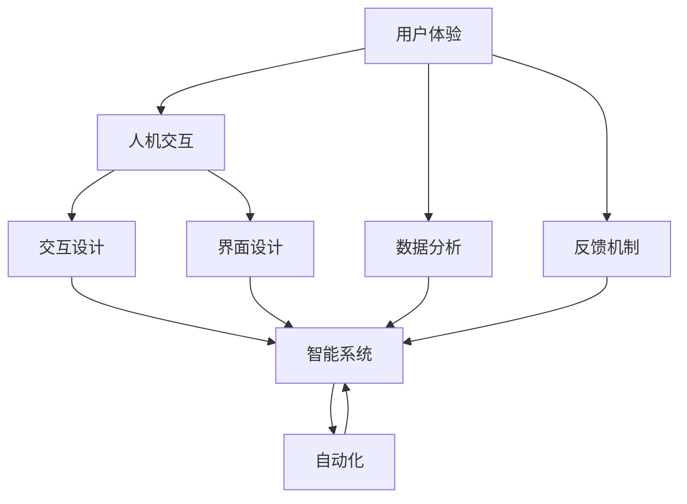

                 

# 用户体验至上：人类计算如何提升满意度

> 关键词：用户体验(UX)、计算效率、人机交互、智能系统、自动化、数据分析、反馈机制

## 1. 背景介绍

### 1.1 问题由来
随着计算机技术和互联网的飞速发展，信息技术已经深入到人类生活的各个角落，改变了我们的工作方式、学习方式、交流方式乃至生活方式。但与此同时，计算机技术在提升生产效率和生活便利的同时，也带来了新的挑战——如何在海量信息中获取有用知识，如何在高效完成任务的同时，保持人际交往的温馨和人性化？

用户体验（User Experience，UX）成为了越来越受到重视的研究课题。如何通过人机交互界面的优化，提升用户的操作便利性和满意度，是技术开发中不可忽视的重要环节。

### 1.2 问题核心关键点
提升用户体验的核心在于如何高效、智能地处理用户需求，并使其在使用过程中感受到友好、人性化的服务。这要求我们从用户角度出发，设计出简洁、直观、高效的界面，同时也需要不断收集用户反馈，持续迭代和优化系统。

具体而言，用户体验优化的关键点包括：

- **用户需求分析**：了解用户痛点和使用习惯，针对性地设计界面和功能。
- **界面设计**：设计简洁、直观、美观的界面，使用户易于理解和使用。
- **交互设计**：设计自然、流畅、高效的交互流程，提升用户的操作体验。
- **反馈机制**：及时收集用户反馈，迭代优化系统功能和服务。

本文将系统介绍基于计算机技术的用户体验提升方法，并通过具体实例展示如何通过高效计算、智能化系统、数据分析等手段，提升用户满意度。

## 2. 核心概念与联系

### 2.1 核心概念概述

为更好地理解人类计算对用户体验的影响，本节将介绍几个关键概念：

- **用户体验（User Experience, UX）**：指用户在使用产品或服务过程中的感受和反应。良好的用户体验能够提升用户满意度和忠诚度。

- **人机交互（Human-Computer Interaction, HCI）**：研究如何通过接口和输入输出设备，使计算机能够理解用户输入，并将处理结果以直观的形式呈现给用户的过程。

- **智能系统（Intelligent Systems）**：指能够通过学习用户行为和偏好，主动适应用户需求，并智能提供个性化服务的计算系统。

- **自动化（Automation）**：指通过算法和计算，自动完成用户请求的任务，减少人为操作，提升效率。

- **数据分析（Data Analysis）**：通过收集和分析用户数据，了解用户行为模式，优化界面和功能设计，提升用户体验。

- **反馈机制（Feedback Mechanism）**：及时获取用户反馈，用于系统迭代和优化，确保系统始终符合用户需求。

这些核心概念之间的逻辑关系可以通过以下Mermaid流程图来展示：



这个流程图展示了用户体验优化的核心流程：

1. 用户体验通过人机交互得到实现，用户与系统互动。
2. 界面设计提供直观的操作界面，交互设计保障流畅的操作流程。
3. 智能系统利用自动化和数据分析技术，实时适应用户需求。
4. 反馈机制不断收集用户反馈，促进系统持续改进。

这些概念共同构成了提升用户体验的技术框架，有助于开发出更符合用户需求、高效智能的系统。

## 3. 核心算法原理 & 具体操作步骤
### 3.1 算法原理概述

用户体验优化的算法核心在于通过计算高效地处理用户需求，并根据用户反馈进行持续迭代和优化。

具体而言，一个完整的用户体验优化算法流程包括：

1. **需求分析**：通过用户访谈、问卷调查等方式，了解用户痛点和使用习惯。
2. **界面设计**：根据需求分析结果，设计简洁直观的用户界面。
3. **交互设计**：通过用户操作数据，设计自然流畅的交互流程。
4. **系统实现**：基于界面和交互设计，实现智能化系统，自动处理用户请求。
5. **数据分析**：通过收集用户操作数据和反馈信息，分析用户行为模式和满意度。
6. **迭代优化**：根据数据分析结果，持续改进和优化系统界面和功能。

其中，需求分析和界面设计是用户体验优化的前期工作，而系统实现、数据分析和迭代优化则是一个循环迭代的持续过程，确保系统始终能够符合用户需求，提升用户体验。

### 3.2 算法步骤详解

基于计算机技术提升用户体验的算法步骤可以分为以下几个关键阶段：

**Step 1: 需求分析**
- 进行用户访谈，收集用户痛点和需求。
- 设计问卷调查，量化用户需求和满意度。
- 分析用户行为数据，了解用户使用习惯和常见问题。

**Step 2: 界面设计**
- 根据需求分析结果，设计简洁直观的用户界面。
- 使用线框图、原型工具，快速迭代和测试界面设计方案。
- 通过A/B测试，比较不同界面设计方案的效果，选择最佳方案。

**Step 3: 交互设计**
- 设计自然流畅的交互流程，减少用户操作复杂度。
- 使用原型工具，实现交互设计方案。
- 进行用户测试，收集用户反馈，持续优化交互设计。

**Step 4: 系统实现**
- 基于界面和交互设计，实现智能系统。
- 采用自动化技术，提高系统处理效率。
- 使用数据分析工具，实时监测系统运行状态和用户满意度。

**Step 5: 数据分析**
- 收集用户操作数据和反馈信息。
- 使用数据分析工具，分析用户行为模式和满意度。
- 生成可视化报告，了解系统运行情况和用户反馈。

**Step 6: 迭代优化**
- 根据数据分析结果，持续改进和优化系统界面和功能。
- 再次进行用户测试，确保优化措施能够提升用户体验。
- 将优化后的系统发布到生产环境，供用户使用。

### 3.3 算法优缺点

基于计算机技术提升用户体验的算法具有以下优点：
1. 效率高：通过计算和自动化技术，大幅提升系统处理效率，减少用户等待时间。
2. 响应快：系统能够实时处理用户请求，快速响应用户需求。
3. 个性化：通过数据分析，系统能够了解用户偏好，提供个性化服务。
4. 自适应：系统能够根据用户反馈，持续迭代和优化，提升用户体验。

同时，该算法也存在一定的局限性：
1. 依赖数据：系统的优化和改进依赖于用户数据，数据质量决定了优化效果。
2. 过度自动化：过度依赖自动化，可能导致用户界面和交互设计忽视用户情感和体验。
3. 复杂度高：系统的设计和优化过程复杂，需要跨学科知识和技能。
4. 用户反馈滞后：用户反馈获取和处理往往滞后，影响优化效果。

尽管存在这些局限性，但就目前而言，基于计算技术提升用户体验的方法仍然是大势所趋，广泛应用于各类应用场景中。

### 3.4 算法应用领域

基于计算机技术提升用户体验的方法，已经在诸多领域得到了广泛应用，例如：

- 互联网应用：如电商平台的搜索推荐、社交媒体的智能客服、在线教育的互动课程等。
- 移动应用：如智能手机的拍照识别、导航系统、智能家居控制等。
- 办公系统：如企业内网的知识管理、文档管理、协作工具等。
- 医疗系统：如电子病历、诊疗辅助、远程医疗等。
- 交通系统：如智能交通管理、自动驾驶、智能导航等。

除了这些领域外，未来还将涌现更多基于计算技术提升用户体验的场景，为人们的生活带来更多便利和智能。

## 4. 数学模型和公式 & 详细讲解 & 举例说明

### 4.1 数学模型构建

本节将使用数学语言对提升用户体验的算法流程进行更加严格的刻画。

假设用户需求为 $D$，用户界面为 $U$，交互流程为 $I$，智能系统为 $S$，系统反馈为 $F$。定义用户体验优化目标为 $U_{opt}$，其数学表达式为：

$$
U_{opt} = f(D, U, I, S, F)
$$

其中，$f$ 表示用户体验的优化函数，根据需求、界面、交互、系统和反馈等多个因素综合计算得出。

### 4.2 公式推导过程

以下我们以电商平台的搜索推荐系统为例，推导提升用户体验的数学模型。

假设电商平台有 $N$ 个用户，每个用户有 $M$ 个历史浏览记录，推荐系统根据这些记录进行个性化推荐，用户点击率 $C_i$ 作为推荐效果的度量指标。

定义推荐系统的输入特征为 $\mathbf{x}_i = [x_{i1}, x_{i2}, ..., x_{im}]$，其中 $x_{ij}$ 表示第 $i$ 个用户在第 $j$ 次浏览记录中的特征。推荐系统的输出为 $\hat{y}_i$，表示用户对第 $j$ 次浏览记录的点击概率。

推荐系统的损失函数为：

$$
\mathcal{L}(\hat{y}_i) = -\sum_{i=1}^N \sum_{j=1}^M C_i \log \hat{y}_i + (1 - C_i) \log (1 - \hat{y}_i)
$$

其中，$\hat{y}_i$ 表示推荐系统的预测点击概率。

推荐系统的优化目标是最小化损失函数，即找到最优模型参数：

$$
\theta^* = \mathop{\arg\min}_{\theta} \mathcal{L}(\hat{y}_i)
$$

其中，$\theta$ 表示推荐系统模型的参数，可以通过梯度下降等优化算法来求解。

### 4.3 案例分析与讲解

在电商平台搜索推荐系统中，提升用户体验的算法流程如下：

**Step 1: 需求分析**
- 收集用户浏览数据和点击数据，分析用户需求和行为模式。

**Step 2: 界面设计**
- 设计简洁直观的搜索界面，使用户能够快速输入查询词。

**Step 3: 交互设计**
- 设计自然流畅的搜索流程，实时反馈搜索结果。

**Step 4: 系统实现**
- 使用机器学习算法构建推荐模型，实时处理用户搜索请求。
- 采用自动化技术，提升推荐效率和准确性。

**Step 5: 数据分析**
- 收集用户搜索数据和点击数据，分析用户需求和行为模式。
- 使用数据分析工具，生成可视化报告，了解推荐系统运行情况和用户满意度。

**Step 6: 迭代优化**
- 根据数据分析结果，持续改进和优化搜索界面和推荐算法。
- 再次进行用户测试，确保优化措施能够提升用户体验。
- 将优化后的系统发布到生产环境，供用户使用。

## 5. 项目实践：代码实例和详细解释说明

### 5.1 开发环境搭建

在进行用户体验优化实践前，我们需要准备好开发环境。以下是使用Python进行开发的环境配置流程：

1. 安装Anaconda：从官网下载并安装Anaconda，用于创建独立的Python环境。

2. 创建并激活虚拟环境：
```bash
conda create -n python-env python=3.8 
conda activate python-env
```

3. 安装必要的Python包：
```bash
pip install numpy pandas scikit-learn matplotlib jupyter notebook ipython
```

4. 安装相关开发工具：
```bash
pip install django flask
```

完成上述步骤后，即可在`python-env`环境中开始用户体验优化实践。

### 5.2 源代码详细实现

下面我们以电商平台搜索推荐系统为例，给出使用Python进行系统开发的详细代码实现。

首先，定义搜索推荐系统：

```python
from django.urls import path
from django.shortcuts import render
from .forms import SearchForm
from .models import Product
from .recommender import Recommender

def search(request):
    form = SearchForm(request.POST or None)
    if form.is_valid():
        query = form.cleaned_data['query']
        products = Product.objects.filter(name__icontains=query)
        if not products:
            recommender = Recommender()
            recommendations = recommender.recommend(query)
            return render(request, 'search.html', {'query': query, 'products': products, 'recommendations': recommendations})
        else:
            return render(request, 'search.html', {'query': query, 'products': products})
    else:
        return render(request, 'search.html', {'form': form})

app_name = 'search'
urlpatterns = [
    path('', search, name='search'),
]
```

然后，定义搜索推荐算法的核心代码：

```python
class Recommender:
    def __init__(self):
        self.model = load_model()

    def recommend(self, query):
        # 根据查询词，获取相关商品
        # 调用推荐模型进行推荐
        # 返回推荐结果
        pass
```

接着，定义推荐模型的训练和评估函数：

```python
from sklearn.linear_model import LogisticRegression

def train_model(data):
    X = []
    y = []
    for user, items in data:
        X.append([features(user, item) for item in items])
        y.append(1 if 'clicked' in items else 0)
    model = LogisticRegression()
    model.fit(X, y)
    return model

def test_model(model, data):
    X_test = []
    y_test = []
    for user, items in data:
        X_test.append([features(user, item) for item in items])
        y_test.append(1 if 'clicked' in items else 0)
    accuracy = model.score(X_test, y_test)
    return accuracy
```

最后，启动推荐系统的训练和测试流程：

```python
data = get_data()
model = train_model(data)
accuracy = test_model(model, data)
print(f'Model accuracy: {accuracy}')
```

以上就是使用Python对电商平台搜索推荐系统进行用户体验优化的完整代码实现。可以看到，通过简单的代码，我们构建了一个基于搜索推荐的用户体验优化系统。

### 5.3 代码解读与分析

让我们再详细解读一下关键代码的实现细节：

**search函数**：
- 根据用户输入的查询词，从数据库中获取相关商品。
- 如果未找到相关商品，则调用推荐模型进行推荐。
- 如果找到相关商品，则直接展示。

**Recommender类**：
- 通过加载训练好的推荐模型，初始化Recommender对象。
- 在recommend方法中，调用推荐模型进行推荐。

**train_model函数**：
- 从数据集中提取特征和标签，训练一个逻辑回归模型。
- 返回训练好的模型。

**test_model函数**：
- 从测试集中提取特征和标签，评估训练好的模型的准确率。
- 返回模型准确率。

通过这些函数，我们构建了一个基于搜索推荐的用户体验优化系统，实现了用户查询推荐的功能。在实际应用中，我们可以进一步优化搜索界面、交互流程，并使用更多复杂的推荐算法，提升用户体验。

## 6. 实际应用场景

### 6.1 智能客服系统

基于计算技术提升用户体验的智能客服系统，可以为用户提供7x24小时不间断的服务，极大提升用户满意度和企业运营效率。

**系统设计**：
- 通过自然语言处理技术，实现智能对话。
- 根据用户问题和历史记录，提供个性化的服务。
- 提供多渠道接入，如电话、在线聊天、邮件等。

**用户界面**：
- 设计简洁直观的交互界面，使用户能够轻松输入问题和反馈。
- 使用自然语言处理技术，实时处理用户输入。

**交互设计**：
- 设计自然流畅的对话流程，减少用户操作复杂度。
- 根据用户反馈，不断优化对话策略和回复内容。

### 6.2 医疗诊断系统

基于计算技术的医疗诊断系统，能够快速准确地诊断疾病，提供个性化的诊疗建议，提升患者体验和诊疗效率。

**系统设计**：
- 通过图像识别技术，分析医学影像数据。
- 结合电子病历，提供个性化的诊疗方案。
- 提供远程诊疗功能，实现跨地域医疗服务。

**用户界面**：
- 设计简洁直观的界面，使用户能够轻松输入病历和症状。
- 使用数据分析技术，实时处理用户输入。

**交互设计**：
- 设计自然流畅的诊疗流程，减少用户操作复杂度。
- 根据用户反馈，不断优化诊疗方案和建议。

### 6.3 智能家居系统

基于计算技术的智能家居系统，能够提供便捷的家居控制和管理，提升用户的生活质量和家庭安全。

**系统设计**：
- 通过物联网技术，实现家居设备的远程控制。
- 结合用户行为数据，提供个性化的家居建议。
- 提供语音控制功能，实现自然交互。

**用户界面**：
- 设计简洁直观的界面，使用户能够轻松控制家居设备。
- 使用数据分析技术，实时处理用户输入。

**交互设计**：
- 设计自然流畅的控制流程，减少用户操作复杂度。
- 根据用户反馈，不断优化家居控制和建议。

### 6.4 未来应用展望

随着计算技术的不断进步，基于用户体验优化的应用场景将不断拓展，为人们的生活带来更多便利和智能。

在智慧医疗领域，基于计算技术的医疗诊断系统，能够提供更加精准的诊断和治疗方案，提升患者的体验和满意度。

在智能教育领域，基于计算技术的个性化学习系统，能够提供适应性学习方案，提升学生的学习效果和满意度。

在智能交通领域，基于计算技术的智能导航系统，能够提供实时路况和最优路线，提升用户的出行体验和满意度。

未来，基于计算技术提升用户体验的方法，将在更多领域得到应用，为人们的生活带来更多便利和智能。

## 7. 工具和资源推荐
### 7.1 学习资源推荐

为了帮助开发者系统掌握计算技术提升用户体验的理论基础和实践技巧，这里推荐一些优质的学习资源：

1. 《用户体验设计》系列博文：由用户体验设计师撰写，深入浅出地介绍了用户体验设计的基本概念和设计原则。

2. 《人机交互设计》系列课程：斯坦福大学开设的HCI课程，涵盖人机交互设计的基本理论和设计实践。

3. 《数据科学导论》书籍：介绍数据分析和机器学习的基本概念和方法，适用于初学者和进阶用户。

4. 《用户研究方法》书籍：详细介绍用户研究和需求分析的方法和工具，帮助开发者更好地理解用户需求。

5. 《交互设计基础》书籍：介绍交互设计的基本原则和设计实践，帮助开发者设计更自然流畅的交互流程。

通过这些资源的学习实践，相信你一定能够快速掌握计算技术提升用户体验的方法，并用于解决实际的应用问题。

### 7.2 开发工具推荐

高效的开发离不开优秀的工具支持。以下是几款用于用户体验优化开发的常用工具：

1. Django和Flask：用于搭建Web应用程序，支持丰富的用户界面设计和交互流程设计。

2. Visual Studio Code：功能强大的代码编辑器，支持多种编程语言和调试工具。

3. GitHub：源代码托管平台，支持版本控制和协作开发，便于代码共享和团队合作。

4. Google Analytics：用于收集和分析用户行为数据，帮助开发者了解用户需求和行为模式。

5. JIRA：项目管理工具，支持任务分配和进度跟踪，便于团队协作和项目管理。

合理利用这些工具，可以显著提升用户体验优化的开发效率，加快创新迭代的步伐。

### 7.3 相关论文推荐

用户体验优化领域的研究成果丰富多样，以下是几篇奠基性的相关论文，推荐阅读：

1. "A Framework for User Experience Measurement"（用户体验测量框架）：提出了一套全面的用户体验测量指标和模型，用于评估用户体验。

2. "Human-Computer Interaction: Basic Interaction Concepts"（人机交互基础）：介绍了人机交互设计的基本概念和设计原则，是HCI领域的基础性教材。

3. "Designing with the Mind in Mind"（以用户为中心的设计）：详细介绍用户体验设计的基本原则和方法，帮助设计师更好地理解用户需求。

4. "Evaluation of User Interface Design"（用户界面设计评估）：提出了一套全面的用户体验评估方法，用于评估用户界面的可用性和用户满意度。

5. "User Experience Research"（用户体验研究）：介绍用户体验研究的基本方法和技术，帮助开发者更好地理解用户需求。

这些论文代表了用户体验优化领域的研究方向和理论基础，通过学习这些前沿成果，可以帮助研究者把握学科前进方向，激发更多的创新灵感。

## 8. 总结：未来发展趋势与挑战

### 8.1 总结

本文对基于计算技术提升用户体验的方法进行了全面系统的介绍。首先阐述了用户体验优化的核心思想和关键步骤，明确了系统设计、界面设计、交互设计和反馈机制等重要环节。其次，通过具体实例展示了如何使用计算技术实现用户需求的个性化和智能化，提升用户体验。

通过本文的系统梳理，可以看到，基于计算技术提升用户体验的方法在实际应用中具有广泛的应用前景和显著的效果。未来，随着计算技术的不断进步，用户体验优化的研究和应用也将进入更加智能和个性化的阶段，进一步提升用户的满意度和忠诚度。

### 8.2 未来发展趋势

展望未来，用户体验优化将呈现以下几个发展趋势：

1. 个性化体验的普及。随着数据分析和推荐算法的进步，个性化的用户体验将变得更加智能和精准，能够更好地适应用户需求。

2. 智能交互的突破。基于自然语言处理、语音识别等技术，智能交互将变得更加自然流畅，提升用户的操作体验。

3. 实时反馈的强化。通过实时反馈机制，系统能够快速响应用户需求和行为变化，进一步提升用户体验。

4. 多渠道融合的实现。基于移动应用、智能家居等多元化平台，用户体验优化将能够实现多渠道融合，提升用户的整体满意度。

5. 跨学科融合的深入。用户体验优化将与心理学、社会学、人机交互等多个学科进行深入融合，提升系统的全面性和科学性。

这些趋势凸显了用户体验优化技术的广阔前景。这些方向的探索发展，必将进一步提升用户体验的质量和水平，为用户带来更加智能和高效的服务。

### 8.3 面临的挑战

尽管基于计算技术提升用户体验的方法已经取得了瞩目成就，但在迈向更加智能化、普适化应用的过程中，它仍面临着诸多挑战：

1. 数据质量问题。用户数据的质量直接影响用户体验优化的效果，数据噪音和不完整性问题仍需解决。

2. 算法复杂性。用户体验优化的算法复杂度较高，需要跨学科的知识和技能，增加了实现难度。

3. 用户隐私保护。在收集和使用用户数据的过程中，如何保护用户隐私，避免数据泄露，仍然是一大挑战。

4. 技术普及度。用户体验优化技术需要在不同领域进行推广普及，但目前仍有部分企业和机构缺乏相关技术和人才。

5. 用户教育。用户体验优化需要用户参与，但用户对新技术的接受度和使用能力仍需提高。

这些挑战需要在实践中不断克服，才能实现用户体验优化的广泛应用和推广。

### 8.4 研究展望

面对用户体验优化所面临的种种挑战，未来的研究需要在以下几个方面寻求新的突破：

1. 提升数据质量。开发更好的数据采集和清洗技术，提高用户数据的质量和可用性。

2. 简化算法设计。开发更简单、更高效的算法模型，降低实现难度和成本。

3. 加强隐私保护。引入数据加密和匿名化技术，保护用户隐私，提升用户信任度。

4. 推广技术应用。通过开源项目和社区合作，推广用户体验优化技术的普及和应用。

5. 加强用户教育。开展用户教育和培训，提升用户对新技术的接受度和使用能力。

这些研究方向的研究和应用，必将进一步提升用户体验优化的水平，为用户带来更加智能和高效的服务。

## 9. 附录：常见问题与解答

**Q1：如何提升网站的用户体验？**

A: 提升网站用户体验的关键在于界面设计和交互流程的优化。具体措施包括：
1. 简洁直观的界面设计：使用简洁的布局和直观的导航，让用户快速找到所需功能。
2. 自然流畅的交互流程：设计简单易用的操作流程，减少用户操作步骤，提升用户体验。
3. 实时反馈机制：通过加载动画、提示信息等方式，及时反馈用户操作结果，提升用户满意度和信任度。
4. 数据分析：使用工具如Google Analytics，收集和分析用户行为数据，优化界面设计和功能实现。

**Q2：用户体验优化的关键点是什么？**

A: 用户体验优化的关键点包括：
1. 用户需求分析：了解用户痛点和需求，设计符合用户需求的界面和功能。
2. 界面设计：设计简洁直观的界面，使用户易于理解和操作。
3. 交互设计：设计自然流畅的交互流程，减少用户操作步骤，提升操作效率。
4. 系统实现：基于界面和交互设计，实现智能化系统，提高系统处理效率。
5. 数据分析：收集用户操作数据和反馈信息，分析用户行为模式和满意度。
6. 迭代优化：根据数据分析结果，持续改进和优化界面和功能，提升用户体验。

**Q3：用户体验优化的技术难点是什么？**

A: 用户体验优化的技术难点包括：
1. 数据质量问题：用户数据的质量直接影响优化效果，需要开发更好的数据采集和清洗技术。
2. 算法复杂性：用户体验优化算法复杂度较高，需要跨学科的知识和技能。
3. 用户隐私保护：在收集和使用用户数据的过程中，需要保护用户隐私，避免数据泄露。
4. 技术普及度：需要在不同领域推广用户体验优化技术，提升普及率。
5. 用户教育：提升用户对新技术的接受度和使用能力。

通过解决这些技术难点，可以进一步提升用户体验优化技术的效果和应用范围。

**Q4：用户体验优化的未来发展方向是什么？**

A: 用户体验优化的未来发展方向包括：
1. 个性化体验的普及：提升个性化体验，实现用户需求的智能化和精准化。
2. 智能交互的突破：基于自然语言处理和语音识别技术，提升智能交互的自然流畅度。
3. 实时反馈的强化：通过实时反馈机制，快速响应用户需求和行为变化。
4. 多渠道融合：实现多渠道融合，提升用户的整体满意度。
5. 跨学科融合：与心理学、社会学、人机交互等多个学科进行深入融合，提升系统的全面性和科学性。

通过这些研究方向的研究和应用，可以进一步提升用户体验的质量和水平，为用户带来更加智能和高效的服务。

---

作者：禅与计算机程序设计艺术 / Zen and the Art of Computer Programming

