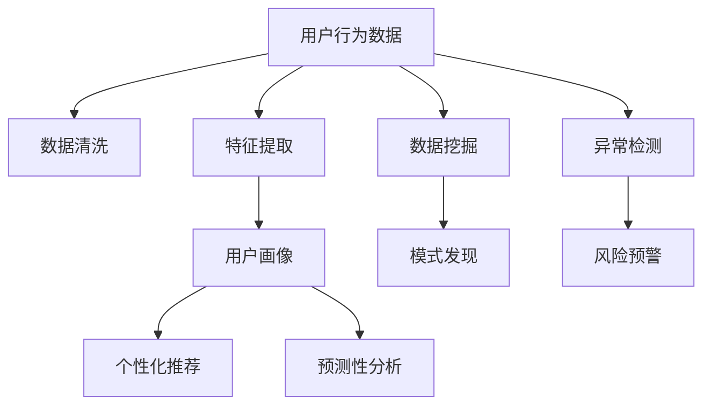

                 

# 用户行为分析：AI的个性化基础

> 关键词：用户行为分析, 人工智能, 个性化推荐, 机器学习, 数据挖掘, 用户画像

## 1. 背景介绍

### 1.1 问题由来

在数字化和互联网时代，企业面临着数据量爆炸式增长的挑战，如何有效利用这些数据洞察用户行为、挖掘用户价值，成为了企业发展的关键。用户行为分析通过大数据和AI技术，深入理解用户的消费习惯、偏好和需求，从而提供更精准、个性化的服务。然而，用户行为数据通常庞大且复杂，传统的数据挖掘和统计方法难以应对。

### 1.2 问题核心关键点

用户行为分析的核心在于从海量用户数据中，提取有价值的信息，构建用户画像，预测用户行为，从而实现个性化推荐、定向广告投放、营销策略优化等业务目标。

用户行为分析的核心问题包括：
1. 如何高效地从数据中提取用户特征。
2. 如何利用机器学习算法，构建用户画像。
3. 如何从用户行为中预测用户后续行为。
4. 如何将用户画像应用于业务场景，实现个性化服务。

这些问题涉及数据预处理、特征工程、模型训练和结果应用等多个环节，需要通过科学的方法和工具来解决。

### 1.3 问题研究意义

用户行为分析对企业具有重要意义：
1. 提升用户体验。通过个性化推荐，提高用户满意度和忠诚度。
2. 提高运营效率。通过精准营销，减少广告投放的无效曝光，提升转化率。
3. 增强竞争优势。通过深入了解用户需求，开发更具针对性的产品和服务，提高市场份额。
4. 降低风险。通过风险预测和预警，降低业务风险，保障企业运营稳定。

## 2. 核心概念与联系

### 2.1 核心概念概述

为了更好地理解用户行为分析，本节将介绍几个密切相关的核心概念：

- **用户行为分析（User Behavior Analysis, UBA）**：通过数据分析和人工智能技术，从用户的历史行为数据中提取有价值的信息，洞察用户需求和行为规律，为业务决策提供支持。
- **用户画像（User Profile）**：根据用户行为数据构建的用户特征描述，通常包括基本信息、兴趣偏好、消费行为、社交关系等，用于个性化推荐和定向广告投放。
- **个性化推荐（Personalized Recommendation）**：根据用户画像，利用机器学习模型，向用户推荐可能感兴趣的产品或服务。
- **预测性分析（Predictive Analytics）**：通过历史数据和机器学习模型，预测用户未来行为，如购买行为、流失风险等。
- **数据挖掘（Data Mining）**：从大规模数据中提取有价值的模式、规律和知识，通常涉及分类、聚类、关联规则挖掘等。

这些核心概念之间的逻辑关系可以通过以下Mermaid流程图来展示：



这个流程图展示了大规模用户行为数据的处理流程：

1. 数据清洗：去除噪声、处理缺失值，准备高质量的数据集。
2. 特征提取：从原始数据中提取有用的特征，构建用户画像。
3. 用户画像：根据用户特征描述，构建用户画像，用于个性化推荐和预测性分析。
4. 个性化推荐：基于用户画像，通过机器学习模型推荐产品或服务。
5. 预测性分析：利用用户画像，通过机器学习模型预测用户行为，如购买、流失等。
6. 数据挖掘：通过机器学习算法挖掘用户行为中的模式和规律，用于模式发现和异常检测。

这些概念共同构成了用户行为分析的基本框架，为AI个性化推荐和预测性分析提供了坚实的基础。

## 3. 核心算法原理 & 具体操作步骤
### 3.1 算法原理概述

用户行为分析的核心算法包括分类、聚类、关联规则挖掘和预测模型。这些算法分别用于不同场景下的用户行为分析和个性化推荐。

### 3.2 算法步骤详解

#### 3.2.1 数据预处理

1. **数据清洗**：去除重复记录、处理缺失值、处理异常值等，确保数据质量。
2. **数据整合**：将不同来源的数据进行整合，建立统一的数据仓库。
3. **特征工程**：从原始数据中提取有用的特征，构建用户画像。

#### 3.2.2 用户画像构建

1. **特征选择**：选择对用户行为影响较大的特征，如年龄、性别、地域、消费金额等。
2. **特征归一化**：将不同尺度的特征归一化到同一范围，便于后续处理。
3. **特征降维**：使用PCA、t-SNE等方法，将高维特征降维到低维空间，减小计算复杂度。

#### 3.2.3 个性化推荐

1. **模型选择**：选择合适的推荐算法，如协同过滤、基于内容的推荐、混合推荐等。
2. **模型训练**：使用历史数据训练推荐模型，评估模型的性能指标。
3. **推荐实现**：根据用户画像和推荐模型，向用户推荐个性化产品或服务。

#### 3.2.4 预测性分析

1. **数据准备**：准备用于训练预测模型的数据集，包括用户特征和历史行为数据。
2. **模型选择**：选择适合预测性分析的模型，如线性回归、随机森林、深度学习等。
3. **模型训练**：使用历史数据训练预测模型，评估模型的性能指标。
4. **预测实现**：根据用户画像和预测模型，预测用户未来行为，如购买、流失等。

### 3.3 算法优缺点

用户行为分析的算法具有以下优点：
1. 提升用户体验。通过个性化推荐，提高用户满意度和忠诚度。
2. 提高运营效率。通过精准营销，减少广告投放的无效曝光，提升转化率。
3. 增强竞争优势。通过深入了解用户需求，开发更具针对性的产品和服务，提高市场份额。
4. 降低风险。通过风险预测和预警，降低业务风险，保障企业运营稳定。

同时，这些算法也存在一些局限性：
1. 依赖数据质量。数据清洗和特征选择等步骤，对数据质量有较高要求，数据偏差可能导致分析结果不准确。
2. 计算复杂度高。用户行为数据量大，特征工程和模型训练过程计算复杂度高，需要高性能计算资源。
3. 模型泛化能力有限。不同用户的行为模式复杂多样，单一模型难以全面覆盖。
4. 隐私和安全问题。用户行为数据涉及用户隐私，模型训练和应用过程中需注意数据安全和隐私保护。

尽管存在这些局限性，但就目前而言，用户行为分析算法仍是实现个性化推荐和预测性分析的重要手段。未来相关研究的重点在于如何进一步降低算法对数据质量的依赖，提高模型的泛化能力，同时兼顾数据安全和隐私保护等因素。

### 3.4 算法应用领域

用户行为分析在众多领域都有广泛的应用，例如：

- 电商零售：通过分析用户浏览、点击、购买行为，推荐商品，提升转化率和销售额。
- 金融服务：通过预测用户交易行为，提前预警风险，防范金融诈骗。
- 社交网络：通过分析用户互动行为，推荐内容和用户，提升用户粘性。
- 健康医疗：通过分析用户健康行为数据，推荐健康建议，提高健康管理水平。
- 物流仓储：通过分析用户订单行为，优化物流路径，提升配送效率。

这些应用场景展示了用户行为分析的广泛价值，为企业提供了丰富的个性化服务和业务决策支持。

## 4. 数学模型和公式 & 详细讲解  
### 4.1 数学模型构建

假设用户行为数据集为 $D=\{(x_i,y_i)\}_{i=1}^N$，其中 $x_i$ 为用户的特征向量，$y_i$ 为用户的标签（如购买行为）。用户画像的构建过程可以表示为：

1. 数据预处理：去除噪声、处理缺失值、处理异常值等。
2. 特征提取：从原始数据中提取有用的特征，构建用户特征向量 $x_i$。
3. 模型训练：使用历史数据训练模型，得到用户画像 $p_i$。

数学上，用户画像可以表示为：

$$
p_i = f(x_i; \theta)
$$

其中 $f$ 为特征函数，$\theta$ 为模型参数。

个性化推荐模型的训练过程可以表示为：

1. 特征选择：选择对用户行为影响较大的特征 $x_i$。
2. 特征归一化：将不同尺度的特征归一化到同一范围，便于后续处理。
3. 特征降维：使用PCA、t-SNE等方法，将高维特征降维到低维空间，减小计算复杂度。
4. 模型训练：使用历史数据训练推荐模型 $M$，得到推荐结果 $r_i$。

数学上，推荐结果可以表示为：

$$
r_i = M(x_i; \phi)
$$

其中 $M$ 为推荐模型，$\phi$ 为模型参数。

预测性分析模型的训练过程可以表示为：

1. 数据准备：准备用于训练预测模型的数据集，包括用户特征和历史行为数据 $(x_i,y_i)$。
2. 模型选择：选择适合预测性分析的模型，如线性回归、随机森林、深度学习等。
3. 模型训练：使用历史数据训练预测模型 $P$，得到预测结果 $\hat{y}_i$。

数学上，预测结果可以表示为：

$$
\hat{y}_i = P(x_i; \psi)
$$

其中 $P$ 为预测模型，$\psi$ 为模型参数。

### 4.2 公式推导过程

以下是用户画像和个性化推荐模型的推导过程。

**用户画像构建**：

1. 数据预处理：去除噪声、处理缺失值、处理异常值等。
2. 特征提取：从原始数据中提取有用的特征，构建用户特征向量 $x_i$。
3. 模型训练：使用历史数据训练模型，得到用户画像 $p_i$。

**个性化推荐模型**：

1. 特征选择：选择对用户行为影响较大的特征 $x_i$。
2. 特征归一化：将不同尺度的特征归一化到同一范围，便于后续处理。
3. 特征降维：使用PCA、t-SNE等方法，将高维特征降维到低维空间，减小计算复杂度。
4. 模型训练：使用历史数据训练推荐模型 $M$，得到推荐结果 $r_i$。

### 4.3 案例分析与讲解

假设我们有一组用户浏览商品的数据，包括用户的年龄、性别、地域和浏览行为（如点击次数、停留时间）。我们希望通过分析这些数据，推荐用户可能感兴趣的商品。

1. **数据预处理**：去除重复记录、处理缺失值、处理异常值等。
2. **特征提取**：从原始数据中提取有用的特征，如用户年龄、性别、地域、浏览次数、停留时间等。
3. **特征归一化**：将不同尺度的特征归一化到同一范围，如年龄归一化到0-1之间，停留时间归一化到0-1之间。
4. **特征降维**：使用PCA、t-SNE等方法，将高维特征降维到低维空间，减小计算复杂度。
5. **模型训练**：使用历史数据训练推荐模型 $M$，得到推荐结果 $r_i$。

在实际应用中，还需要考虑模型的评估和优化，以提升推荐效果。评估指标包括准确率、召回率、F1-score等，通过交叉验证等方法，不断调整模型参数，提高模型的性能。

## 5. 项目实践：代码实例和详细解释说明
### 5.1 开发环境搭建

在进行用户行为分析实践前，我们需要准备好开发环境。以下是使用Python进行Scikit-learn和TensorFlow开发的环境配置流程：

1. 安装Anaconda：从官网下载并安装Anaconda，用于创建独立的Python环境。

2. 创建并激活虚拟环境：
```bash
conda create -n user-behavior-env python=3.8 
conda activate user-behavior-env
```

3. 安装必要的库：
```bash
conda install scikit-learn pandas numpy matplotlib tqdm jupyter notebook ipython
conda install tensorflow
```

4. 安装TensorFlow：
```bash
pip install tensorflow
```

5. 安装TensorBoard：
```bash
pip install tensorboard
```

完成上述步骤后，即可在`user-behavior-env`环境中开始用户行为分析实践。

### 5.2 源代码详细实现

这里我们以电商推荐系统为例，给出使用Scikit-learn和TensorFlow进行用户行为分析的Python代码实现。

首先，定义数据预处理函数：

```python
import pandas as pd
from sklearn.model_selection import train_test_split
from sklearn.preprocessing import StandardScaler
from sklearn.decomposition import PCA

def preprocess_data(data, features, target):
    # 数据清洗：去除重复记录、处理缺失值、处理异常值等
    data = data.drop_duplicates().reset_index(drop=True)
    data = data.dropna()
    data = data[data[target].notna()]
    
    # 特征选择：选择对用户行为影响较大的特征
    features = [feature for feature in features if feature not in data.columns]
    
    # 特征归一化：将不同尺度的特征归一化到同一范围
    scaler = StandardScaler()
    scaled_features = scaler.fit_transform(data[features])
    
    # 特征降维：使用PCA将高维特征降维到低维空间
    pca = PCA(n_components=2)
    reduced_features = pca.fit_transform(scaled_features)
    
    # 数据整合：将用户画像和目标变量分开
    X = pd.DataFrame(reduced_features, columns=['feature_1', 'feature_2'])
    y = data[target]
    
    # 数据划分：将数据集划分为训练集和测试集
    X_train, X_test, y_train, y_test = train_test_split(X, y, test_size=0.2, random_state=42)
    
    return X_train, X_test, y_train, y_test
```

然后，定义用户画像和推荐模型：

```python
from sklearn.linear_model import LogisticRegression
from sklearn.ensemble import RandomForestClassifier
from sklearn.metrics import accuracy_score, roc_auc_score

def build_user_profile(X_train, y_train):
    # 用户画像构建：使用逻辑回归模型训练用户画像
    user_profile_model = LogisticRegression()
    user_profile_model.fit(X_train, y_train)
    
    return user_profile_model

def build_recommendation_model(X_train, y_train):
    # 个性化推荐模型构建：使用随机森林模型训练推荐模型
    recommendation_model = RandomForestClassifier()
    recommendation_model.fit(X_train, y_train)
    
    return recommendation_model
```

接着，定义训练和评估函数：

```python
def train_model(model, X_train, y_train):
    # 模型训练：使用历史数据训练模型
    model.fit(X_train, y_train)
    
    return model

def evaluate_model(model, X_test, y_test):
    # 模型评估：使用测试集评估模型性能
    y_pred = model.predict(X_test)
    accuracy = accuracy_score(y_test, y_pred)
    auc = roc_auc_score(y_test, y_pred)
    
    print(f"Accuracy: {accuracy:.3f}, AUC: {auc:.3f}")
```

最后，启动训练流程并在测试集上评估：

```python
from sklearn.linear_model import LogisticRegression
from sklearn.ensemble import RandomForestClassifier
from sklearn.metrics import accuracy_score, roc_auc_score

# 数据预处理：数据清洗、特征选择、特征归一化、特征降维等
X_train, X_test, y_train, y_test = preprocess_data(data, features, target)

# 用户画像构建：使用逻辑回归模型训练用户画像
user_profile_model = build_user_profile(X_train, y_train)

# 个性化推荐模型构建：使用随机森林模型训练推荐模型
recommendation_model = build_recommendation_model(X_train, y_train)

# 模型训练：使用历史数据训练模型
user_profile_model = train_model(user_profile_model, X_train, y_train)
recommendation_model = train_model(recommendation_model, X_train, y_train)

# 模型评估：使用测试集评估模型性能
evaluate_model(user_profile_model, X_test, y_test)
evaluate_model(recommendation_model, X_test, y_test)
```

以上就是使用Scikit-learn和TensorFlow对电商推荐系统进行用户行为分析的完整代码实现。可以看到，得益于Scikit-learn和TensorFlow的强大封装，我们可以用相对简洁的代码完成用户行为分析的各个环节。

### 5.3 代码解读与分析

让我们再详细解读一下关键代码的实现细节：

**preprocess_data函数**：
- 数据清洗：去除重复记录、处理缺失值、处理异常值等，确保数据质量。
- 特征选择：选择对用户行为影响较大的特征。
- 特征归一化：将不同尺度的特征归一化到同一范围，如年龄归一化到0-1之间，停留时间归一化到0-1之间。
- 特征降维：使用PCA将高维特征降维到低维空间，减小计算复杂度。
- 数据整合：将用户画像和目标变量分开，准备训练数据。
- 数据划分：将数据集划分为训练集和测试集。

**build_user_profile和build_recommendation_model函数**：
- 用户画像构建：使用逻辑回归模型训练用户画像。
- 个性化推荐模型构建：使用随机森林模型训练推荐模型。

**train_model和evaluate_model函数**：
- 模型训练：使用历史数据训练模型。
- 模型评估：使用测试集评估模型性能，输出准确率和AUC值。

可以看到，Scikit-learn和TensorFlow使得用户行为分析的代码实现变得简洁高效。开发者可以将更多精力放在数据处理、模型改进等高层逻辑上，而不必过多关注底层的实现细节。

当然，工业级的系统实现还需考虑更多因素，如模型的保存和部署、超参数的自动搜索、更灵活的任务适配层等。但核心的用户行为分析流程基本与此类似。

## 6. 实际应用场景
### 6.1 电商推荐系统

电商推荐系统通过分析用户的浏览、点击、购买行为，向用户推荐可能感兴趣的商品，提高用户的购买转化率和满意度。在技术实现上，可以收集用户的浏览数据，将浏览行为映射到用户画像，再利用推荐模型预测用户可能感兴趣的商品，实现个性化推荐。

在推荐过程中，还可以通过实时获取用户的点击、购买行为等动态数据，实时更新用户画像和推荐模型，提升推荐效果。同时，可以根据用户的反馈信息，动态调整推荐算法，实现更精准的推荐。

### 6.2 金融风险预测

金融行业需要实时监测用户的交易行为，预测用户是否存在潜在的金融风险，如信用风险、欺诈风险等。通过收集用户的交易数据，利用用户行为分析技术，构建用户画像，预测用户未来行为，提前预警风险，降低金融风险。

在预测过程中，可以利用用户的交易记录、社交关系、历史行为等数据，构建综合的风险评分模型，评估用户的风险等级。同时，可以结合专家知识和领域经验，进一步提升模型的准确性和鲁棒性。

### 6.3 社交网络推荐

社交网络推荐系统通过分析用户的互动行为，向用户推荐可能感兴趣的内容和用户，提升用户的粘性和活跃度。在技术实现上，可以收集用户的互动数据，构建用户画像，再利用推荐模型预测用户可能感兴趣的内容和用户，实现个性化推荐。

在推荐过程中，可以通过动态获取用户的互动行为数据，实时更新用户画像和推荐模型，提升推荐效果。同时，可以结合社交网络的结构特征，增强推荐模型的表现力。

### 6.4 未来应用展望

随着用户行为分析技术的不断发展，未来的应用场景将更加多样和广泛：

- 智能家居：通过分析用户的居家行为，智能推荐家居产品和服务，提升用户的居家体验。
- 智能医疗：通过分析用户的健康行为，推荐健康建议和医疗服务，提高用户的健康管理水平。
- 智能交通：通过分析用户的出行行为，优化交通路线和交通管理，提高城市的交通效率。
- 智能教育：通过分析学生的学习行为，推荐个性化学习资源和教学方案，提升学生的学习效果。

以上应用场景展示了用户行为分析的广阔前景，为企业提供了丰富的个性化服务和业务决策支持。

## 7. 工具和资源推荐
### 7.1 学习资源推荐

为了帮助开发者系统掌握用户行为分析的理论基础和实践技巧，这里推荐一些优质的学习资源：

1. 《Python数据科学手册》（由Pandas的作者撰写）：系统介绍了Python在数据科学中的应用，包括数据预处理、特征工程、模型训练等。
2. 《机器学习实战》：涵盖了机器学习的基础知识和实践技巧，适合初学者入门。
3. 《TensorFlow实战》：介绍了TensorFlow的搭建和应用，包括模型训练、模型评估等。
4. Coursera的《机器学习》课程：由斯坦福大学开设的知名课程，深入浅出地介绍了机器学习的基本概念和算法。
5. Kaggle平台：提供了大量数据集和竞赛项目，可以帮助开发者实践机器学习算法，提升数据处理和模型训练能力。

通过对这些资源的学习实践，相信你一定能够快速掌握用户行为分析的精髓，并用于解决实际的业务问题。

### 7.2 开发工具推荐

高效的开发离不开优秀的工具支持。以下是几款用于用户行为分析开发的常用工具：

1. Jupyter Notebook：Python的交互式开发环境，支持代码编写、数据可视化、模型训练等功能，适合数据科学和机器学习项目。
2. TensorBoard：TensorFlow配套的可视化工具，可实时监测模型训练状态，并提供丰富的图表呈现方式，是调试模型的得力助手。
3. PyCharm：Python IDE，提供了丰富的代码高亮、调试、版本控制等功能，适合大型项目开发。
4. R Studio：R语言的数据分析和可视化工具，提供了强大的数据处理和模型训练功能，适合统计分析和机器学习项目。
5. Python DataCamp：提供在线编程课程和数据科学项目，适合开发者学习Python和数据科学技能。

合理利用这些工具，可以显著提升用户行为分析的开发效率，加快创新迭代的步伐。

### 7.3 相关论文推荐

用户行为分析的研究涉及到多个领域，以下是几篇奠基性的相关论文，推荐阅读：

1. 《用户行为分析技术综述》：介绍了用户行为分析的基本概念、技术框架和应用场景。
2. 《用户画像构建与分析》：系统介绍了用户画像的构建方法、特征选择和模型训练。
3. 《个性化推荐算法》：介绍了协同过滤、基于内容的推荐、混合推荐等个性化推荐算法。
4. 《预测性分析》：介绍了线性回归、随机森林、深度学习等预测性分析算法。
5. 《用户行为预测的深度学习模型》：介绍了基于深度学习的用户行为预测模型，如CNN、RNN等。

这些论文代表了大规模用户行为分析的研究进展，通过学习这些前沿成果，可以帮助研究者把握学科前进方向，激发更多的创新灵感。

## 8. 总结：未来发展趋势与挑战

### 8.1 总结

本文对用户行为分析的基本概念和算法原理进行了全面系统的介绍。首先阐述了用户行为分析的核心问题，明确了用户行为分析和个性化推荐技术的研究背景和意义。其次，从原理到实践，详细讲解了用户行为分析的数学模型和操作步骤，给出了用户行为分析任务开发的完整代码实例。同时，本文还探讨了用户行为分析在电商、金融、社交网络等多个行业领域的应用前景，展示了用户行为分析的广泛价值。最后，本文精选了用户行为分析的学习资源、开发工具和相关论文，力求为读者提供全方位的技术指引。

通过本文的系统梳理，可以看到，用户行为分析技术正在成为企业实现个性化服务和业务决策的重要手段，为企业提供了丰富的个性化服务和业务决策支持。未来，伴随用户行为分析技术的不断进步，基于用户画像的个性化推荐将更加精准，预测性分析将更加准确，用户体验将进一步提升。

### 8.2 未来发展趋势

展望未来，用户行为分析技术将呈现以下几个发展趋势：

1. 数据融合技术：通过融合多源异构数据，提升用户画像的全面性和准确性，实现更精准的个性化推荐和预测性分析。
2. 深度学习技术：利用深度学习模型，提升用户行为预测的准确性和鲁棒性，实现更智能的个性化推荐。
3. 联邦学习技术：通过联邦学习技术，保护用户隐私的同时，实现分布式训练和模型优化，提升用户行为分析的效果。
4. 模型可解释性：通过模型解释技术，提升用户行为分析模型的可解释性，增强模型的可信度和透明性。
5. 实时化分析：通过实时数据流处理技术，实现用户行为分析的实时化和动态化，提升用户体验和运营效率。
6. 跨领域应用：通过跨领域应用技术，将用户行为分析技术应用于更广泛的场景，如智能交通、智慧医疗等。

以上趋势凸显了用户行为分析技术的广阔前景。这些方向的探索发展，必将进一步提升用户行为分析的准确性和智能性，为用户画像和个性化推荐提供更坚实的基础。

### 8.3 面临的挑战

尽管用户行为分析技术已经取得了显著成果，但在迈向更加智能化、普适化应用的过程中，它仍面临着诸多挑战：

1. 数据隐私和安全：用户行为数据涉及用户隐私，如何保护数据安全和隐私，防止数据泄露和滥用，仍需进一步探索。
2. 数据质量和一致性：用户行为数据通常庞大且复杂，如何保证数据的质量和一致性，防止数据偏差和错误，仍需进一步研究。
3. 计算资源需求：用户行为分析涉及大量数据和模型训练，对计算资源需求较高，如何降低计算成本，提升模型训练效率，仍需进一步优化。
4. 模型泛化能力：不同用户的行为模式复杂多样，单一模型难以全面覆盖，如何提升模型的泛化能力，增强模型的适应性，仍需进一步探索。
5. 模型解释性：用户行为分析模型通常较为复杂，如何提高模型的可解释性，增强模型的可信度和透明性，仍需进一步研究。

尽管存在这些挑战，但用户行为分析技术正在不断发展和完善，未来有望在更多行业和应用中发挥重要作用。相信随着学界和产业界的共同努力，这些挑战终将一一克服，用户行为分析技术必将为人工智能技术的发展提供新的动力。

### 8.4 研究展望

面向未来，用户行为分析技术的研究可以从以下几个方面寻求新的突破：

1. 探索更高效的特征工程方法：通过深度学习等技术，提升特征提取和选择的效率和效果，提高用户画像的全面性和准确性。
2. 研发更智能的预测性分析模型：利用深度学习、因果推断等技术，提升用户行为预测的准确性和鲁棒性，实现更智能的个性化推荐。
3. 融合多源异构数据：通过联邦学习、联邦决策等技术，融合多源异构数据，提升用户画像的全面性和准确性，实现更精准的个性化推荐和预测性分析。
4. 提升模型的可解释性：通过模型解释技术，提升用户行为分析模型的可解释性，增强模型的可信度和透明性。
5. 实现实时化分析：通过实时数据流处理技术，实现用户行为分析的实时化和动态化，提升用户体验和运营效率。
6. 探索跨领域应用：通过跨领域应用技术，将用户行为分析技术应用于更广泛的场景，如智能交通、智慧医疗等。

这些研究方向的探索，必将引领用户行为分析技术迈向更高的台阶，为人工智能技术的发展提供新的动力。面向未来，用户行为分析技术还需要与其他人工智能技术进行更深入的融合，如知识表示、因果推理、强化学习等，多路径协同发力，共同推动人工智能技术的发展。只有勇于创新、敢于突破，才能不断拓展用户行为分析的边界，让人工智能技术更好地造福人类社会。

## 9. 附录：常见问题与解答

**Q1：用户画像和个性化推荐有什么区别？**

A: 用户画像是指通过用户行为数据构建的用户特征描述，通常包括基本信息、兴趣偏好、消费行为、社交关系等，用于个性化推荐和定向广告投放。而个性化推荐是基于用户画像，利用机器学习模型，向用户推荐可能感兴趣的产品或服务。用户画像和个性化推荐是用户行为分析中两个重要的环节，前者是后者的基础，后者是前者的应用。

**Q2：如何选择合适的特征进行用户画像构建？**

A: 用户画像的构建需要选择合适的特征，一般遵循以下原则：
1. 相关性：选择与用户行为密切相关的特征，如年龄、性别、地域、消费金额等。
2. 可解释性：选择具有可解释性的特征，便于后续分析和解释。
3. 稳定性：选择稳定且持续变化的特征，避免因数据波动导致用户画像不准确。
4. 可获取性：选择易于获取和处理的特征，降低数据采集和处理的难度。
5. 综合性：选择综合多种特征的特征组合，提高用户画像的全面性和准确性。

**Q3：在用户行为分析中，常用的特征降维方法有哪些？**

A: 用户行为数据的特征维度通常较高，需要进行特征降维处理，常用的特征降维方法包括：
1. PCA（主成分分析）：通过线性变换，将高维特征映射到低维空间，保留主要特征信息。
2. t-SNE（t分布随机邻域嵌入）：通过非线性变换，将高维特征映射到二维或三维空间，保留特征局部结构。
3. LDA（线性判别分析）：通过线性变换，降低特征维度，同时保留特征的分类信息。
4. KPCA（核主成分分析）：通过核函数，将高维特征映射到低维空间，保留特征的局部结构。
5. Autoencoder（自动编码器）：通过神经网络模型，对高维特征进行降维，保留主要特征信息。

**Q4：用户行为分析中常用的模型有哪些？**

A: 用户行为分析中常用的模型包括：
1. 逻辑回归：用于构建用户画像，预测用户行为。
2. 随机森林：用于个性化推荐，通过特征选择和特征降维，提升推荐效果。
3. SVM（支持向量机）：用于分类问题，如用户流失预测。
4. 神经网络：用于深度学习任务，如用户行为预测。
5. 集成学习：通过组合多个模型，提升预测准确性和鲁棒性。

**Q5：用户行为分析中的数据隐私和安全问题如何解决？**

A: 用户行为分析中的数据隐私和安全问题，可以通过以下方法解决：
1. 数据匿名化：通过对用户数据进行匿名化处理，防止数据泄露和滥用。
2. 数据加密：对用户数据进行加密处理，保护数据隐私和安全。
3. 联邦学习：通过联邦学习技术，在分布式环境中进行模型训练，保护用户数据隐私。
4. 差分隐私：通过差分隐私技术，在保护数据隐私的同时，保证模型性能。
5. 访问控制：通过访问控制技术，限制对用户数据的访问权限，保护数据安全。

这些方法可以有效保护用户数据隐私和安全，同时满足用户行为分析的需求。

**Q6：用户行为分析中的特征选择有哪些方法？**

A: 用户行为分析中的特征选择方法包括：
1. 相关性分析：通过计算特征与目标变量之间的相关性，选择与用户行为相关的特征。
2. 特征重要性评估：通过特征重要性评估算法，选择对用户行为影响较大的特征。
3. 特征降维：通过特征降维技术，减少特征维度，提高特征选择效率。
4. 特征选择算法：如Lasso回归、决策树、随机森林等，选择对用户行为影响较大的特征。
5. 特征工程：通过特征工程方法，构建更合适的特征，提高特征选择的准确性。

这些方法可以用于特征选择和特征构建，提升用户行为分析的效果。

**Q7：用户行为分析中的数据清洗方法有哪些？**

A: 用户行为分析中的数据清洗方法包括：
1. 去除重复记录：通过唯一标识符去重，确保数据的一致性和准确性。
2. 处理缺失值：通过均值、中位数、众数等方法填充缺失值，保证数据完整性。
3. 处理异常值：通过统计方法检测和处理异常值，确保数据质量。
4. 数据格式转换：将数据格式统一转换为标准格式，便于后续处理和分析。
5. 数据预处理：通过数据清洗和数据转换等方法，保证数据质量和一致性。

这些方法可以有效清洗用户行为数据，确保数据质量和分析效果。

---

作者：禅与计算机程序设计艺术 / Zen and the Art of Computer Programming

