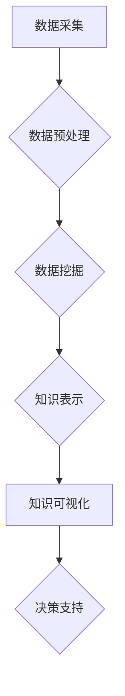

                 

## 程序员如何利用知识发现引擎提高决策能力

> 关键词：知识发现引擎、数据挖掘、决策支持、机器学习、人工智能、程序员、数据分析、商业智能

## 1. 背景介绍

在当今数据爆炸的时代，程序员们每天都面临着海量数据的处理和分析。如何从这些数据中提取有价值的知识，并将其转化为有效的决策支持，成为了一个至关重要的挑战。传统的编程方法难以应对这种复杂性，因此需要借助更先进的技术手段。知识发现引擎 (Knowledge Discovery Engine，KDE) 正是解决这一问题的关键工具。

KDE 是一种能够从海量数据中自动发现模式、趋势和关系的智能系统。它利用数据挖掘、机器学习和人工智能等技术，帮助程序员深入理解数据，并为决策提供数据驱动的洞察。

## 2. 核心概念与联系

### 2.1  知识发现引擎 (KDE)

KDE 是一个综合性的数据分析系统，它将数据清洗、转换、分析和可视化等步骤整合在一起，最终将发现的知识以易于理解的形式呈现给用户。

### 2.2  数据挖掘 (Data Mining)

数据挖掘是KDE的核心技术之一，它通过运用统计学、机器学习和数据库技术等方法，从海量数据中挖掘出隐藏的模式、趋势和关系。

### 2.3  机器学习 (Machine Learning)

机器学习是KDE的重要组成部分，它通过训练模型，使系统能够从数据中学习，并自动发现新的知识。

**KDE 架构流程图**



## 3. 核心算法原理 & 具体操作步骤

### 3.1  算法原理概述

KDE 中常用的算法包括：

* **关联规则挖掘算法 (Apriori Algorithm)**：用于发现数据集中频繁出现的项集和关联关系。
* **分类算法 (Classification Algorithm)**：用于将数据分类到不同的类别，例如垃圾邮件分类、客户画像分析等。
* **聚类算法 (Clustering Algorithm)**：用于将数据按照相似性进行分组，例如用户群分析、市场细分等。
* **预测算法 (Prediction Algorithm)**：用于预测未来事件的发生概率，例如销售预测、风险评估等。

### 3.2  算法步骤详解

以关联规则挖掘算法为例，其步骤如下：

1. **数据预处理**: 清洗、转换和格式化数据，使其适合算法处理。
2. **频繁项集挖掘**: 使用 Apriori 算法找出数据集中频繁出现的项集。
3. **关联规则生成**: 基于频繁项集，生成关联规则，例如“购买牛奶的人也经常购买面包”。
4. **规则评估**: 对生成的关联规则进行评估，筛选出置信度和支持度较高的规则。

### 3.3  算法优缺点

**优点:**

* 自动化数据分析，提高效率。
* 发现隐藏的模式和关系，提供新的洞察。
* 支持数据驱动的决策，降低风险。

**缺点:**

* 需要大量的数据作为训练样本。
* 算法选择和参数设置需要专业知识。
* 发现的知识可能存在局限性，需要结合实际情况进行判断。

### 3.4  算法应用领域

KDE 广泛应用于各个领域，例如：

* **商业智能**: 市场分析、客户关系管理、销售预测等。
* **金融**: 风险评估、欺诈检测、投资决策等。
* **医疗**: 疾病诊断、药物研发、患者画像分析等。
* **教育**: 学生行为分析、个性化学习推荐等。

## 4. 数学模型和公式 & 详细讲解 & 举例说明

### 4.1  数学模型构建

关联规则挖掘算法的核心是频繁项集的挖掘。频繁项集的定义是：在数据集中的出现频率高于某个阈值的项集。

**支持度 (Support)**：表示一个项集在数据集中的出现频率。

$$Support(X) = \frac{Number of transactions containing X}{Total number of transactions}$$

**置信度 (Confidence)**：表示在满足条件 X 的情况下，Y 出现的概率。

$$Confidence(X \rightarrow Y) = \frac{Number of transactions containing both X and Y}{Number of transactions containing X}$$

### 4.2  公式推导过程

Apriori 算法通过迭代的方式，从频繁项集的子集开始，逐步挖掘出更大的频繁项集。

**频繁项集的生成规则**:

如果一个项集的子集是频繁项集，那么这个项集也可能是频繁项集。

**频繁项集的筛选规则**:

如果一个项集的支持度低于某个阈值，那么这个项集就不再被认为是频繁项集。

### 4.3  案例分析与讲解

假设我们有一个数据集，包含以下交易记录：

* {牛奶, 面包}
* {牛奶, 鸡蛋}
* {牛奶, 面包, 鸡蛋}
* {面包, 鸡蛋}
* {牛奶}

**频繁项集挖掘**:

1. 首先，我们找到所有频繁的单项集，例如 {牛奶}, {面包}, {鸡蛋}。
2. 然后，我们找到所有频繁的双项集，例如 {牛奶, 面包}, {牛奶, 鸡蛋}, {面包, 鸡蛋}。
3. 最后，我们找到所有频繁的三项集，例如 {牛奶, 面包, 鸡蛋}。

**关联规则生成**:

根据频繁项集，我们可以生成以下关联规则：

* {牛奶} -> {面包} (置信度 = 1)
* {牛奶} -> {鸡蛋} (置信度 = 1)
* {牛奶, 面包} -> {鸡蛋} (置信度 = 1)

## 5. 项目实践：代码实例和详细解释说明

### 5.1  开发环境搭建

* Python 3.x
* pandas
* scikit-learn

### 5.2  源代码详细实现

```python
import pandas as pd
from sklearn.feature_extraction.text import TfidfVectorizer

# 数据加载
data = pd.read_csv('data.csv')

# 数据预处理
# ...

# TF-IDF 向量化
vectorizer = TfidfVectorizer()
tfidf_matrix = vectorizer.fit_transform(data['text_column'])

# 关联规则挖掘
from mlxtend.frequent_patterns import apriori, association_rules

frequent_itemsets = apriori(tfidf_matrix, min_support=0.1, use_colnames=True)
rules = association_rules(frequent_itemsets, metric="confidence", min_threshold=0.8)

# 结果展示
print(rules)
```

### 5.3  代码解读与分析

* 数据加载：使用 pandas 库读取数据文件。
* 数据预处理：对数据进行清洗、转换和格式化，例如去除停用词、分词等。
* TF-IDF 向量化：使用 scikit-learn 库中的 TfidfVectorizer 将文本数据转换为数值向量。
* 关联规则挖掘：使用 mlxtend 库中的 apriori 和 association_rules 函数进行关联规则挖掘。
* 结果展示：打印出挖掘出的关联规则。

### 5.4  运行结果展示

运行代码后，会输出一个包含关联规则的 DataFrame，其中包含规则、支持度、置信度等信息。

## 6. 实际应用场景

### 6.1  电商推荐

KDE 可以用于分析用户购买历史和浏览记录，发现用户之间的关联关系，并推荐相关的商品。

### 6.2  医疗诊断

KDE 可以用于分析患者的症状、病史和检查结果，发现潜在的疾病关联，辅助医生进行诊断。

### 6.3  金融风险评估

KDE 可以用于分析客户的信用记录、交易行为等数据，发现潜在的风险因素，帮助金融机构进行风险评估。

### 6.4  未来应用展望

随着人工智能和数据分析技术的不断发展，KDE 将在更多领域得到应用，例如个性化教育、智能交通、精准农业等。

## 7. 工具和资源推荐

### 7.1  学习资源推荐

* **书籍**:
    * "Data Mining: Concepts and Techniques" by Jiawei Han, Micheline Kamber, and Jian Pei
    * "Introduction to Data Mining" by Pang-Ning Tan, Michael Steinbach, and Vipin Kumar
* **在线课程**:
    * Coursera: Data Mining Specialization
    * edX: Data Science Fundamentals

### 7.2  开发工具推荐

* **Python**: 
    * pandas
    * scikit-learn
    * mlxtend
* **R**:
    * tm
    * arules

### 7.3  相关论文推荐

* "Apriori: Bringing Down the Cost of Discovering Frequent Patterns" by Rakesh Agrawal, Tomasz Imielinski, and Arun Swami
* "Association Rule Mining: Methodological Issues and Future Directions" by Jiawei Han, Jian Pei, and Yiwen Yin

## 8. 总结：未来发展趋势与挑战

### 8.1  研究成果总结

KDE 在数据挖掘、机器学习和人工智能等领域取得了显著的成果，为程序员提供了一种高效的工具，帮助他们从数据中发现有价值的知识，并为决策提供数据驱动的支持。

### 8.2  未来发展趋势

* **更强大的算法**: 研究更先进的算法，提高关联规则挖掘的效率和准确性。
* **更丰富的知识表示**: 开发更丰富的知识表示形式，例如知识图谱，更好地表达和理解数据中的知识。
* **更智能的交互**: 设计更智能的交互方式，使程序员能够更方便地使用KDE。

### 8.3  面临的挑战

* **数据质量**: KDE 的效果依赖于数据质量，如何处理不完整、不一致的数据仍然是一个挑战。
* **算法解释性**: 许多KDE算法的内部机制难以解释，如何提高算法的透明度和可解释性是一个重要的研究方向。
* **隐私保护**: 如何在使用KDE的同时保护用户隐私是一个重要的伦理问题。

### 8.4  研究展望

未来，KDE 将继续朝着更智能、更强大、更安全的方向发展，为程序员提供更强大的数据分析工具，帮助他们更好地理解数据，并做出更明智的决策。

## 9. 附录：常见问题与解答

* **Q: KDE 的应用场景有哪些？**

A: KDE 的应用场景非常广泛，例如电商推荐、医疗诊断、金融风险评估等。

* **Q: 如何选择合适的 KDE 算法？**

A: 选择合适的 KDE 算法需要根据具体的数据特点和应用场景进行选择。

* **Q: 如何保证 KDE 的准确性？**

A: KDE 的准确性依赖于数据质量和算法选择。需要确保数据完整、一致，并选择合适的算法进行分析。


作者：禅与计算机程序设计艺术 / Zen and the Art of Computer Programming 
<end_of_turn>

