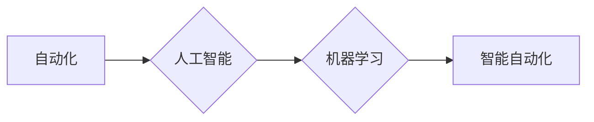

                 

## 程序员如何应对行业自动化的挑战

> 关键词：自动化、人工智能、机器学习、程序员转型、技能提升、未来趋势、职业发展、持续学习

## 1. 背景介绍

近年来，人工智能（AI）和自动化技术飞速发展，深刻地改变着各行各业，也对程序员职业提出了新的挑战和机遇。自动化技术能够完成许多重复性、规则性任务，这使得一些传统程序员的工作岗位面临被替代的风险。然而，自动化也创造了新的工作机会，需要程序员具备更高级的技能和知识来应对。

### 1.1 自动化浪潮的来袭

从工业革命到信息革命，每一次技术变革都伴随着生产力的提升和社会结构的重塑。如今，自动化浪潮正在席卷整个IT行业，其核心驱动力是人工智能和机器学习技术的进步。

* **人工智能的崛起:** 人工智能能够模拟人类的智能行为，例如学习、推理和决策。机器学习作为人工智能的重要分支，通过算法训练，能够从数据中学习模式并做出预测。
* **自动化工具的普及:** 一系列自动化工具和平台涌现，例如GitHub Copilot、Tabnine、DeepCode等，能够帮助程序员提高代码编写效率，甚至自动生成代码片段。

### 1.2 程序员面临的挑战

自动化技术带来的挑战主要体现在以下几个方面：

* **工作岗位的替代:** 一些重复性、规则性任务将被自动化工具取代，例如代码测试、代码生成、数据处理等。
* **技能的升级:** 程序员需要不断学习新的技术和技能，例如人工智能、机器学习、云计算等，才能适应不断变化的行业需求。
* **竞争加剧:** 自动化技术降低了技术门槛，也意味着更多人可以进入IT行业，程序员之间的竞争将更加激烈。

## 2. 核心概念与联系

### 2.1 自动化与人工智能

自动化是指利用技术手段，使系统或流程能够自动执行，无需人工干预。人工智能则是模拟人类智能行为的技术，其目标是让机器能够像人类一样学习、推理和决策。

自动化技术和人工智能技术相互补充，共同推动着行业数字化转型。人工智能赋予自动化技术更强大的智能能力，使其能够完成更复杂的任务。

**Mermaid 流程图:**



### 2.2 自动化技术在程序员工作中的应用

自动化技术在程序员工作中的应用非常广泛，例如：

* **代码生成:** 使用AI模型自动生成代码片段，提高代码编写效率。
* **代码测试:** 自动化测试工具可以自动执行测试用例，提高测试效率和覆盖率。
* **代码审查:** AI模型可以帮助程序员识别代码中的潜在问题，提高代码质量。
* **代码文档生成:** 自动生成代码文档，节省程序员的时间和精力。

## 3. 核心算法原理 & 具体操作步骤

### 3.1 算法原理概述

机器学习算法是人工智能的核心技术之一，其原理是通过训练模型，使模型能够从数据中学习模式并做出预测。常见的机器学习算法包括：

* **监督学习:** 通过标记数据训练模型，例如分类、回归等。
* **无监督学习:** 通过未标记数据训练模型，例如聚类、降维等。
* **强化学习:** 通过奖励机制训练模型，例如游戏AI、机器人控制等。

### 3.2 算法步骤详解

以监督学习为例，其基本步骤如下：

1. **数据收集:** 收集相关数据，并进行清洗和预处理。
2. **特征工程:** 从原始数据中提取特征，用于训练模型。
3. **模型选择:** 选择合适的机器学习算法，例如线性回归、决策树、支持向量机等。
4. **模型训练:** 使用训练数据训练模型，调整模型参数，使其能够准确预测目标变量。
5. **模型评估:** 使用测试数据评估模型的性能，例如准确率、召回率、F1-score等。
6. **模型部署:** 将训练好的模型部署到实际应用场景中。

### 3.3 算法优缺点

不同的机器学习算法具有不同的优缺点，需要根据具体应用场景选择合适的算法。

* **线性回归:** 算法简单易懂，但对数据线性关系要求较高。
* **决策树:** 算法易于解释，但容易过拟合。
* **支持向量机:** 算法性能优异，但训练时间较长。

### 3.4 算法应用领域

机器学习算法广泛应用于各个领域，例如：

* **图像识别:** 自动识别图像中的物体、场景等。
* **自然语言处理:** 处理和理解人类语言，例如机器翻译、文本摘要等。
* **推荐系统:** 根据用户的历史行为推荐相关商品或内容。
* **预测分析:** 预测未来趋势，例如销售预测、风险评估等。

## 4. 数学模型和公式 & 详细讲解 & 举例说明

### 4.1 数学模型构建

机器学习算法通常基于数学模型，例如线性回归模型、逻辑回归模型、神经网络模型等。

**线性回归模型:**

假设我们有一个数据集，包含n个样本，每个样本有两个特征x和y，我们希望找到一个线性关系来描述x和y之间的关系。

线性回归模型的数学表达式为：

$$y = wx + b$$

其中：

* y 是目标变量
* x 是特征变量
* w 是权重参数
* b 是偏置参数

### 4.2 公式推导过程

通过最小二乘法，我们可以求解出最佳的权重参数w和偏置参数b，使得模型预测值与实际值之间的误差最小。

最小二乘法的目标函数为：

$$J(w, b) = \sum_{i=1}^{n}(y_i - wx_i - b)^2$$

通过求解该目标函数的梯度，我们可以得到w和b的更新公式：

$$w = w - \alpha \frac{\partial J(w, b)}{\partial w}$$

$$b = b - \alpha \frac{\partial J(w, b)}{\partial b}$$

其中：

* $\alpha$ 是学习率

### 4.3 案例分析与讲解

假设我们有一个数据集，包含以下样本：

| x | y |
|---|---|
| 1 | 2 |
| 2 | 4 |
| 3 | 5 |

我们可以使用线性回归模型来拟合该数据集。通过最小二乘法，我们可以求解出最佳的权重参数w和偏置参数b，得到以下线性回归模型：

$$y = 1.5x + 0.5$$

我们可以使用该模型预测新的样本的y值。例如，当x=4时，我们可以预测y值为：

$$y = 1.5 * 4 + 0.5 = 6.5$$

## 5. 项目实践：代码实例和详细解释说明

### 5.1 开发环境搭建

为了演示机器学习算法的应用，我们可以使用Python语言和Scikit-learn库进行开发。

需要安装以下软件：

* Python 3.x
* Scikit-learn库

### 5.2 源代码详细实现

```python
from sklearn.linear_model import LinearRegression
from sklearn.model_selection import train_test_split
import numpy as np

# 数据集
X = np.array([[1], [2], [3]])
y = np.array([2, 4, 5])

# 数据集划分
X_train, X_test, y_train, y_test = train_test_split(X, y, test_size=0.2)

# 创建线性回归模型
model = LinearRegression()

# 模型训练
model.fit(X_train, y_train)

# 模型预测
y_pred = model.predict(X_test)

# 模型评估
print("模型预测值:", y_pred)
```

### 5.3 代码解读与分析

* 首先，我们导入必要的库，例如Scikit-learn库中的LinearRegression类用于创建线性回归模型。
* 然后，我们定义数据集X和y，其中X是特征变量，y是目标变量。
* 接下来，我们使用train_test_split函数将数据集划分为训练集和测试集。
* 然后，我们创建线性回归模型对象，并使用fit函数对模型进行训练。
* 最后，我们使用predict函数对测试集进行预测，并使用模型评估指标来评估模型的性能。

### 5.4 运行结果展示

运行以上代码，我们可以得到模型预测值，并评估模型的性能。

## 6. 实际应用场景

### 6.1 代码生成

GitHub Copilot等工具可以根据程序员的代码注释或上下文，自动生成代码片段，提高代码编写效率。

### 6.2 代码测试

自动化测试工具可以自动执行测试用例，提高测试效率和覆盖率。例如，Selenium可以自动执行网页测试，JUnit可以自动执行Java代码测试。

### 6.3 代码审查

DeepCode等工具可以利用机器学习算法分析代码，识别潜在的代码缺陷和安全漏洞，提高代码质量。

### 6.4 未来应用展望

随着人工智能技术的不断发展，自动化技术将在程序员工作中发挥更重要的作用。未来，程序员将更加关注算法设计、模型训练和数据分析等高级技能。

## 7. 工具和资源推荐

### 7.1 学习资源推荐

* **在线课程:** Coursera、edX、Udacity等平台提供丰富的机器学习和人工智能课程。
* **书籍:** 《Python机器学习》、《深度学习》等书籍可以帮助程序员深入了解机器学习和人工智能的原理和应用。
* **开源项目:** TensorFlow、PyTorch等开源项目可以帮助程序员实践机器学习算法。

### 7.2 开发工具推荐

* **GitHub Copilot:** 代码生成工具
* **DeepCode:** 代码审查工具
* **Selenium:** 网页测试工具
* **JUnit:** Java代码测试工具

### 7.3 相关论文推荐

* **《ImageNet Classification with Deep Convolutional Neural Networks》:** 
* **《Attention Is All You Need》:** 

## 8. 总结：未来发展趋势与挑战

### 8.1 研究成果总结

自动化技术和人工智能技术正在深刻地改变着程序员的工作方式，为程序员带来了新的机遇和挑战。程序员需要不断学习新的技术和技能，才能适应不断变化的行业需求。

### 8.2 未来发展趋势

未来，自动化技术和人工智能技术将更加深入地融入程序员工作中，例如：

* **更智能的代码生成工具:** 可以根据程序员的意图自动生成更复杂的代码片段。
* **更精准的代码测试工具:** 可以自动识别和修复代码中的潜在缺陷。
* **更全面的代码审查工具:** 可以识别代码中的安全漏洞和潜在的性能问题。

### 8.3 面临的挑战

自动化技术的发展也带来了一些挑战，例如：

* **程序员的职业转型:** 一些程序员的工作岗位将被自动化工具取代，需要进行职业转型。
* **技术技能的升级:** 程序员需要不断学习新的技术和技能，才能适应行业需求。
* **伦理和社会影响:** 自动化技术的发展也需要考虑其伦理和社会影响，例如算法偏见、数据隐私等问题。

### 8.4 研究展望

未来，我们需要继续研究自动化技术和人工智能技术的应用，探索其在程序员工作中的更多可能性，并解决其带来的挑战。

## 9. 附录：常见问题与解答

### 9.1 自动化技术会取代程序员吗？

自动化技术会改变程序员的工作方式，但不会完全取代程序员。程序员仍然需要负责算法设计、模型训练、数据分析等高级技能，而自动化技术可以帮助程序员提高效率和准确性。

### 9.2 程序员应该如何应对自动化挑战？

程序员应该不断学习新的技术和技能，例如人工智能、机器学习、云计算等，并关注自动化技术的发展趋势。

### 9.3 如何学习自动化技术？

可以通过在线课程、书籍、开源项目等方式学习自动化技术。


作者：禅与计算机程序设计艺术 / Zen and the Art of Computer Programming 
<end_of_turn>

