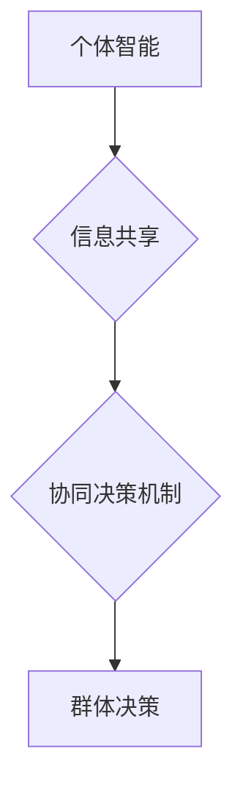

                 

## 群体智慧：决策的新引擎

> 关键词：群体智慧、协同决策、机器学习、人工智能、算法优化、数据分析、决策支持系统

## 1. 背景介绍

在当今数据爆炸的时代，面对复杂多变的决策问题，传统的单一决策模式已显不足。群体智慧，即通过群体成员的协同作用，获得超越个体智慧的决策结果，逐渐成为解决复杂问题的新引擎。

群体智慧的概念源于自然界中蜂群、鸟群等群体行为的观察。这些群体成员虽然个体能力有限，但通过简单的规则和信息共享，能够实现惊人的集体智慧，例如寻觅食物、避开危险、集体迁徙等。

近年来，随着人工智能和机器学习技术的飞速发展，群体智慧的研究和应用也取得了长足进步。从金融市场预测到医疗诊断，从交通流量管理到城市规划，群体智慧的应用场景日益广泛。

## 2. 核心概念与联系

群体智慧的核心概念是将多个个体智能的优势汇聚在一起，通过协同决策机制，获得比单个个体更优的决策结果。

**群体智慧的构成要素：**

* **个体智能：** 每个群体成员都拥有独立的思考能力和决策能力，并能够根据自身经验和知识做出判断。
* **信息共享：** 群体成员之间能够有效地共享信息，包括数据、知识、经验等。
* **协同决策机制：** 群体成员通过一定的规则和算法，将个体决策结果融合在一起，形成最终的群体决策。

**群体智慧的架构：**



**群体智慧与其他技术的联系：**

* **人工智能：** 人工智能技术为群体智慧提供了强大的工具，例如机器学习算法可以帮助群体成员进行数据分析和决策优化。
* **数据分析：** 数据分析技术可以帮助群体成员收集、整理和分析数据，为决策提供更准确的依据。
* **决策支持系统：** 决策支持系统可以帮助群体成员进行决策分析和模拟，提高决策效率和准确性。

## 3. 核心算法原理 & 具体操作步骤

群体智慧的算法原理主要基于以下几个方面：

* **启发式算法：** 启发式算法是一种基于经验和直觉的算法，能够快速找到近似最优的解决方案。
* **模拟退火算法：** 模拟退火算法是一种启发式优化算法，能够帮助群体成员从局部最优解走向全局最优解。
* **粒子群算法：** 粒子群算法是一种基于群体行为的优化算法，能够模拟群体成员的协同搜索过程。

### 3.1  算法原理概述

群体智慧算法的核心思想是通过模拟群体成员的协同行为，实现决策优化。这些算法通常包含以下步骤：

1. **初始化群体：** 创建一个包含多个个体成员的群体，每个成员都拥有初始的决策方案。
2. **信息共享：** 群体成员之间共享信息，例如决策方案、经验、知识等。
3. **决策更新：** 根据共享的信息和个体智能，群体成员更新自己的决策方案。
4. **群体进化：** 重复步骤2和3，直到群体决策达到预设的优化目标。

### 3.2  算法步骤详解

以粒子群算法为例，其具体步骤如下：

1. **初始化粒子群：** 随机生成多个粒子，每个粒子代表一个决策方案。每个粒子的位置和速度都随机初始化。
2. **评估粒子适应度：** 计算每个粒子的适应度，即其决策方案的优劣程度。适应度通常通过目标函数来评估。
3. **更新粒子速度和位置：** 根据每个粒子的当前速度、位置和全局最优解，更新粒子的速度和位置。
4. **重复步骤2和3：** 重复步骤2和3，直到粒子群收敛到全局最优解。

### 3.3  算法优缺点

**优点：**

* **并行性：** 群体智慧算法可以并行执行，提高计算效率。
* **鲁棒性：** 群体智慧算法对噪声和不确定性具有较强的鲁棒性。
* **全局搜索能力：** 群体智慧算法能够有效地进行全局搜索，找到更优的决策方案。

**缺点：**

* **计算复杂度：** 一些群体智慧算法的计算复杂度较高，需要较大的计算资源。
* **参数调优：** 群体智慧算法的参数调优较为复杂，需要根据具体问题进行调整。
* **收敛性：** 一些群体智慧算法的收敛性较慢，需要较长时间才能找到最优解。

### 3.4  算法应用领域

群体智慧算法广泛应用于以下领域：

* **金融市场预测：** 利用群体智慧算法对市场数据进行分析，预测股票价格、汇率等。
* **医疗诊断：** 利用群体智慧算法分析患者的病历数据，辅助医生进行诊断。
* **交通流量管理：** 利用群体智慧算法优化交通信号灯控制，缓解交通拥堵。
* **城市规划：** 利用群体智慧算法规划城市布局、交通网络等。

## 4. 数学模型和公式 & 详细讲解 & 举例说明

群体智慧算法的数学模型通常基于优化问题，目标是找到最优的决策方案。

### 4.1  数学模型构建

假设群体决策问题可以表示为一个优化问题：

$$
\min_{x} f(x)
$$

其中，$x$ 代表决策方案，$f(x)$ 代表目标函数，目标是找到使目标函数最小化的决策方案。

### 4.2  公式推导过程

群体智慧算法通常使用启发式算法或模拟退火算法来求解优化问题。

例如，粒子群算法的更新公式如下：

$$
v_{i}(t+1) = w \cdot v_{i}(t) + c_{1} \cdot r_{1} \cdot (p_{best} - x_{i}(t)) + c_{2} \cdot r_{2} \cdot (g_{best} - x_{i}(t))
$$

$$
x_{i}(t+1) = x_{i}(t) + v_{i}(t+1)
$$

其中，$v_{i}(t)$ 代表第$i$个粒子的速度，$x_{i}(t)$ 代表第$i$个粒子的位置，$p_{best}$ 代表第$i$个粒子找到的最佳位置，$g_{best}$ 代表全局最佳位置，$w$ 代表惯性权重，$c_{1}$ 和 $c_{2}$ 代表学习因子，$r_{1}$ 和 $r_{2}$ 代表随机数。

### 4.3  案例分析与讲解

例如，在股票预测问题中，可以使用粒子群算法来寻找最优的投资组合。

目标函数可以定义为投资组合的预期收益，粒子群算法可以迭代搜索最优的投资组合，使得预期收益最大化。

## 5. 项目实践：代码实例和详细解释说明

以下是一个使用Python实现粒子群算法的简单代码实例：

### 5.1  开发环境搭建

需要安装Python和必要的库，例如NumPy、SciPy等。

### 5.2  源代码详细实现

```python
import numpy as np

class Particle:
    def __init__(self, position, velocity, pbest, gbest):
        self.position = position
        self.velocity = velocity
        self.pbest = pbest
        self.gbest = gbest

    def update(self, w, c1, c2, r1, r2):
        self.velocity = w * self.velocity + c1 * r1 * (self.pbest - self.position) + c2 * r2 * (self.gbest - self.position)
        self.position = self.position + self.velocity

def particle_swarm_optimization(func, bounds, num_particles, iterations, w, c1, c2):
    # 初始化粒子群
    particles = [Particle(np.random.uniform(bounds[0], bounds[1], size=len(bounds)),
                          np.random.uniform(-1, 1, size=len(bounds)),
                          np.random.uniform(bounds[0], bounds[1], size=len(bounds)),
                          np.random.uniform(bounds[0], bounds[1], size=len(bounds)))
                 for _ in range(num_particles)]

    # 迭代优化
    for _ in range(iterations):
        for particle in particles:
            # 更新粒子位置和速度
            particle.update(w, c1, c2, np.random.rand(), np.random.rand())

            # 更新全局最佳解
            if func(particle.position) < func(particles[0].position):
                particles[0].position = particle.position

    # 返回全局最佳解
    return particles[0].position

# 示例函数
def example_function(x):
    return x[0]**2 + x[1]**2

# 参数设置
bounds = [(-5, 5), (-5, 5)]
num_particles = 10
iterations = 100
w = 0.7
c1 = 1.5
c2 = 1.5

# 运行粒子群算法
best_solution = particle_swarm_optimization(example_function, bounds, num_particles, iterations, w, c1, c2)

# 打印结果
print(f"最佳解: {best_solution}")
```

### 5.3  代码解读与分析

该代码实现了一个简单的粒子群算法，用于求解一个二元函数的最小值。

* `Particle` 类定义了每个粒子的属性和方法，包括位置、速度、最佳位置和全局最佳位置。
* `particle_swarm_optimization` 函数实现了粒子群算法的迭代优化过程，包括粒子初始化、位置和速度更新、全局最佳解更新等步骤。
* `example_function` 是一个示例函数，用于测试粒子群算法。

### 5.4  运行结果展示

运行该代码后，会输出一个最佳解，即该函数的最小值对应的参数值。

## 6. 实际应用场景

群体智慧的应用场景非常广泛，以下是一些具体的例子：

### 6.1  金融市场预测

利用群体智慧算法对市场数据进行分析，预测股票价格、汇率等。

### 6.2  医疗诊断

利用群体智慧算法分析患者的病历数据，辅助医生进行诊断。

### 6.3  交通流量管理

利用群体智慧算法优化交通信号灯控制，缓解交通拥堵。

### 6.4  城市规划

利用群体智慧算法规划城市布局、交通网络等。

### 6.5  未来应用展望

群体智慧技术在未来将有更广泛的应用，例如：

* **个性化推荐：** 利用群体智慧算法分析用户的行为数据，提供个性化的产品推荐。
* **自动驾驶：** 利用群体智慧算法协同控制多个车辆，实现自动驾驶。
* **科学研究：** 利用群体智慧算法加速科学研究，例如药物研发、材料设计等。

## 7. 工具和资源推荐

### 7.1  学习资源推荐

* **书籍：**
    * 《群体智慧：决策的新引擎》
    * 《人工智能：一种现代方法》
* **在线课程：**
    * Coursera 上的《机器学习》课程
    * edX 上的《人工智能导论》课程

### 7.2  开发工具推荐

* **Python:** 广泛用于机器学习和人工智能开发。
* **NumPy:** Python 的数值计算库。
* **SciPy:** Python 的科学计算库。
* **TensorFlow:** Google 开发的深度学习框架。
* **PyTorch:** Facebook 开发的深度学习框架。

### 7.3  相关论文推荐

* **"Particle Swarm Optimization" by Kennedy and Eberhart (1995)**
* **"Ant Colony Optimization: A Metaheuristic Approach" by Dorigo (1992)**
* **"Evolutionary Algorithms: A Comprehensive Introduction" by Mitchell (1998)**

## 8. 总结：未来发展趋势与挑战

群体智慧技术在未来将继续发展，并对各个领域产生深远影响。

### 8.1  研究成果总结

群体智慧算法已经取得了显著的成果，在许多领域得到了应用。

### 8.2  未来发展趋势

* **更有效的算法：** 研究更有效的群体智慧算法，提高算法的效率和精度。
* **更广泛的应用：** 将群体智慧技术应用于更多领域，例如自动驾驶、个性化推荐等。
* **更强大的计算能力：** 利用云计算和分布式计算等技术，提高群体智慧算法的计算能力。

### 8.3  面临的挑战

* **算法复杂度：** 一些群体智慧算法的复杂度较高，需要更强大的计算资源。
* **参数调优：** 群体智慧算法的参数调优较为复杂，需要根据具体问题进行调整。
* **收敛性：** 一些群体智慧算法的收敛性较慢，需要较长时间才能找到最优解。

### 8.4  研究展望

未来，群体智慧技术将继续发展，并与其他人工智能技术相结合，例如深度学习、强化学习等，为解决更复杂的问题提供新的解决方案。

## 9. 附录：常见问题与解答

### 9.1  群体智慧算法与传统算法相比有什么优势？

群体智慧算法能够利用多个个体的智慧，并行搜索，从而提高效率和精度。

### 9.2  群体智慧算法有哪些局限性？

群体智慧算法的计算复杂度较高，参数调优较为复杂，收敛性较慢。

### 9.3  群体智慧算法的应用领域有哪些？

群体智慧算法广泛应用于金融市场预测、医疗诊断、交通流量管理、城市规划等领域。


作者：禅与计算机程序设计艺术 / Zen and the Art of Computer Programming<end_of_turn>

